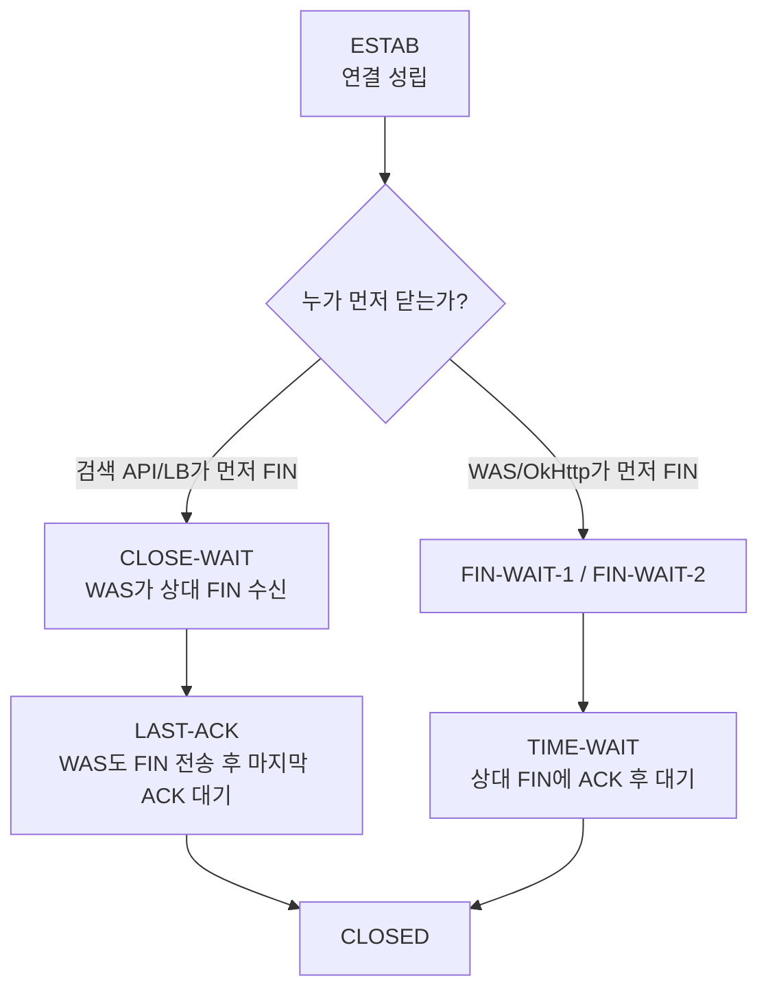
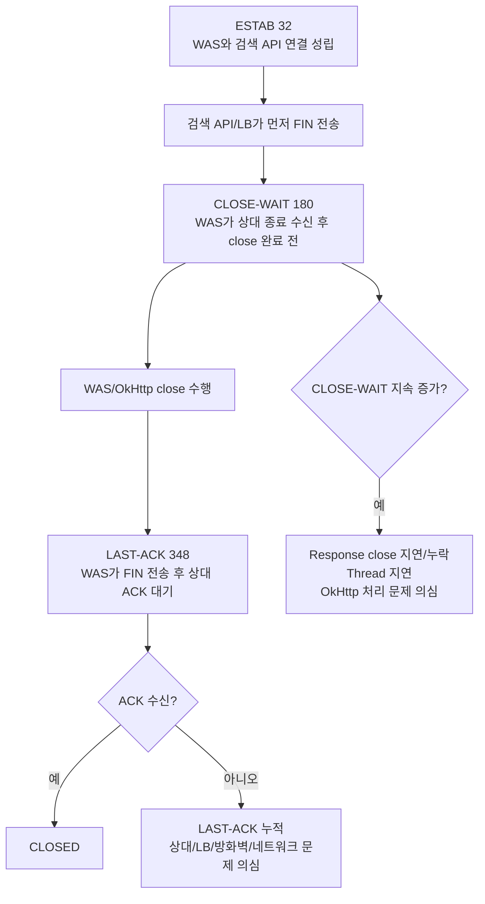

#### 1. `ss -tanp | grep '192.168.100.50:8080'` 상태별 모니터링 커맨드 3가지

##### 1-1. 5초마다 대상 서버 연결 상태별 개수 확인
```bash
watch -n 5 "ss -tanp | grep '192.168.100.50:8080' | awk '{state[\$1]++} END {for (s in state) print s, state[s]}' | sort"
```

설명:
- `192.168.100.50:8080`으로 연결된 TCP Socket을 상태별로 집계합니다.
- `ESTAB`, `TIME-WAIT`, `CLOSE-WAIT`, `SYN-SENT` 등이 몇 개인지 확인할 수 있습니다.
- 장애 상황에서 가장 먼저 쓰기 좋은 커맨드입니다.  
    예상 출력:
```bash
CLOSE-WAIT 2
ESTAB 15
TIME-WAIT 40
```

##### 1-2. 5초마다 전체 목록과 상태별 개수를 같이 확인
```bash
watch -n 5 "echo '===== DETAIL ====='; ss -tanp | grep '192.168.100.50:8080'; echo; echo '===== COUNT BY STATE ====='; ss -tanp | grep '192.168.100.50:8080' | awk '{state[\$1]++} END {for (s in state) print s, state[s]}' | sort"
```

설명:
- 실제 연결 목록과 상태별 집계를 같이 봅니다.
- 특정 WAS 프로세스가 어떤 상태의 연결을 많이 가지고 있는지 확인할 때 유용합니다.
- `-p` 옵션은 프로세스 정보를 보여주지만, 일반 계정에서는 일부 PID/프로세스명이 안 보일 수 있습니다. 필요하면 `sudo` 권한이 필요합니다.

##### 1-3. 5초마다 주요 상태만 개별 카운트

```bash
watch -n 5 "echo -n 'ESTAB='; ss -tanp state established | grep '192.168.100.50:8080' | wc -l; echo -n 'CLOSE-WAIT='; ss -tanp state close-wait | grep '192.168.100.50:8080' | wc -l; echo -n 'TIME-WAIT='; ss -tanp state time-wait | grep '192.168.100.50:8080' | wc -l; echo -n 'SYN-SENT='; ss -tanp state syn-sent | grep '192.168.100.50:8080' | wc -l"
```

설명:
- 운영 중 자주 보는 상태만 분리해서 확인합니다.
- `ESTAB`: 정상 연결 중
- `CLOSE-WAIT`: 상대 서버가 닫았지만 WAS 쪽 정리가 완료되지 않은 상태
- `TIME-WAIT`: 짧은 연결이 많이 생성될 때 증가 가능
- `SYN-SENT`: 대상 서버 연결 수립 지연 또는 네트워크 문제 가능

#### 2. 실무 권장

장애 분석 중에는 1번으로 상태 변화를 먼저 보고, `CLOSE-WAIT`나 `TIME-WAIT`가 많으면 2번으로 상세 목록을 확인하는 방식이 좋습니다. `Socket closed` 원인 분석에서는 특히 `CLOSE-WAIT`, `TIME-WAIT`, `SYN-SENT` 증가 여부를 중점적으로 봐야 합니다.

## 3. LAST-ACK
#### 3-1-1. `LAST-ACK`가 많을 경우 문제점

`LAST-ACK`는 TCP 연결 종료 과정에서 **로컬 서버가 FIN을 보낸 뒤, 상대방의 마지막 ACK를 기다리는 상태**입니다. RFC 9293의 TCP 상태 모델 기준으로 `LAST-ACK`는 “보낸 연결 종료 요청에 대한 ACK를 기다리는 상태”에 해당합니다. `ss`는 Linux에서 Socket 상태를 확인하는 도구이며 `netstat`보다 더 많은 TCP 상태 정보를 표시할 수 있습니다. ([IETF Datatracker](https://datatracker.ietf.org/doc/html/rfc9293?utm_source=chatgpt.com "RFC 9293 - Transmission Control Protocol (TCP)"))

##### 3-1-1-1. 상태 의미
```text
상대방 FIN 수신
→ 로컬 ACK 응답
→ 애플리케이션 close 처리
→ 로컬 FIN 전송
→ LAST-ACK 상태
→ 상대방 ACK 수신
→ CLOSED
```

즉, `LAST-ACK`는 연결 종료의 마지막 단계입니다. 짧게 존재하는 것은 정상입니다. 그러나 **많이 쌓이거나 오래 유지되면 비정상 가능성**이 있습니다.

#### 3-1-2. `LAST-ACK`가 많을 때 의심할 수 있는 문제

|  구분 | 가능 원인          | 설명                                                 |
| --: | -------------- | -------------------------------------------------- |
|   1 | 상대방 ACK 미수신    | 로컬이 FIN을 보냈지만 상대 서버/클라이언트의 마지막 ACK가 오지 않음          |
|   2 | 네트워크 패킷 손실     | FIN/ACK 패킷이 중간에서 유실되거나 지연됨                         |
|   3 | 방화벽/L4 세션 정리   | 중간 장비가 종료 단계 패킷을 비정상적으로 차단/정리                      |
|   4 | 상대 서버 비정상      | 검색 API 서버, DB 서버, Proxy가 종료 ACK를 정상 반환하지 못함        |
|   5 | 로컬 서버 고부하      | WAS CPU/Thread/네트워크 큐 지연으로 종료 처리가 늦어짐              |
|   6 | 대량 단기 연결       | 짧은 HTTP 연결이 대량 생성되어 종료 상태가 순간적으로 쌓임                |
|   7 | Keep-Alive 불일치 | WAS/OkHttp/LB/검색 API 서버의 keep-alive timeout 정책 불일치 |
|   8 | NAT/LB 경유 문제   | NAT 테이블, L4 세션 테이블, 방화벽 idle timeout과 충돌           |

#### 3-1-3. WAS/OkHttp 관점에서의 의미
`OkHttp → 검색 API 서버` 호출 중 `LAST-ACK`가 많다면, WAS 쪽에서 연결 종료를 진행했지만 검색 API 서버 또는 중간 장비로부터 마지막 ACK를 제대로 못 받고 있을 가능성이 있습니다.

|              관점 | 해석                                        |
| --------------: | ----------------------------------------- |
|  `TIME-WAIT` 많음 | 짧은 연결이 많고 로컬이 정상 종료 완료 후 대기 중일 가능성        |
| `CLOSE-WAIT` 많음 | 상대가 닫았는데 WAS 애플리케이션이 close를 늦게 하거나 누락 가능성 |
|   `LAST-ACK` 많음 | WAS가 닫으려고 FIN을 보냈지만 상대 ACK가 안 돌아오는 상태     |
|   `SYN-SENT` 많음 | 연결 수립 자체가 지연되거나 대상 서버 접근 문제               |
|      `ESTAB` 많음 | 실제 연결이 많이 유지 중                            |

#### 3-1-4. 장애 영향

|                    영향 | 설명                                                       |
| --------------------: | -------------------------------------------------------- |
|          Socket/FD 점유 | `LAST-ACK` 상태도 Socket 리소스를 점유함                           |
|              신규 연결 지연 | 대량 누적 시 FD, ephemeral port, TCP 메모리 사용 증가                |
|              응답 지연 증가 | 종료 지연이 많으면 외부 API 호출 지연과 함께 나타날 수 있음                     |
|            네트워크 장애 징후 | 패킷 손실, 방화벽/LB 문제, 상대 서버 비정상 종료 가능성                       |
| `Socket closed` 동반 가능 | 종료 중이거나 닫힌 Socket 접근 시 `SocketException` 로그와 함께 나타날 수 있음 |

#### 3-1-5. 확인 커맨드
##### 3-1-5-1. 대상 검색 API의 `LAST-ACK` 개수 확인
```bash
ss -tan state last-ack | grep '192.168.100.50:8080' | wc -l
```

##### 3-1-5-2. 5초마다 `LAST-ACK` 변화 확인
```bash
watch -n 5 "ss -tan state last-ack | grep '192.168.100.50:8080' | wc -l"
```

##### 3-1-5-3. 대상 서버 상태별 개수 비교
```bash
watch -n 5 "ss -tan | grep '192.168.100.50:8080' | awk '{state[\$1]++} END {for (s in state) print s, state[s]}' | sort"
```

##### 3-1-5-4. 대상 연결 상세 확인

```bash
ss -tanp state last-ack | grep '192.168.100.50:8080'
```

##### 3-1-5-5. WAS 프로세스 기준 FD 사용량 확인

```bash
PID=<WAS_PID>
ls /proc/"$PID"/fd | wc -l
```

##### 3-1-5-6. WAS 프로세스의 TCP 연결 확인

```bash
PID=<WAS_PID>
lsof -Pan -p "$PID" -iTCP | grep '192.168.100.50:8080'
```

#### 3-1-6. 판단 기준

|현상|판단|
|--:|---|
|`LAST-ACK`가 순간적으로 보였다가 사라짐|정상 종료 과정일 가능성 큼|
|`LAST-ACK`가 계속 증가|상대 ACK 미수신, 네트워크/LB/상대 서버 문제 의심|
|`LAST-ACK`와 `Socket closed` 동시 증가|종료 중인 연결 접근, 검색 API/LB 연결 종료 문제 가능|
|`LAST-ACK`와 retransmission 증가|패킷 손실 또는 네트워크 품질 문제 가능|
|`LAST-ACK`와 FD 사용량 증가|Socket 리소스 점유로 WAS 안정성 저하 가능|

#### 3-1-7. 추가 확인 커맨드

```bash
# TCP 재전송/Reset/Timeout 통계 확인
netstat -s | grep -iE 'reset|retrans|timeout|failed'
```

```bash
# sysstat 설치 서버에서 TCP 통계 1초 간격 5회 확인
sar -n TCP,ETCP 1 5
```

```bash
# 대상 서버와의 패킷 흐름 확인, 운영에서는 짧게 수행
tcpdump -nn -i any host 192.168.100.50 and port 8080
```

#### 3-1-8. 실무 조치 방향

|우선|조치|설명|
|--:|---|---|
|1|대상 서버 기준 상태별 Socket 수 확인|`LAST-ACK`만 보지 말고 `ESTAB`, `TIME-WAIT`, `CLOSE-WAIT`와 비교|
|2|발생 시간대 로그 대조|`Socket closed`, `Connection reset`, `Read timed out`와 같은 시간대인지 확인|
|3|검색 API 서버 상태 확인|재기동, 배포, GC pause, Thread 고갈, Access log 지연 확인|
|4|L4/LB/방화벽 timeout 확인|Keep-Alive/idle timeout이 WAS·OkHttp timeout과 맞는지 확인|
|5|OkHttpClient 재사용|매 요청마다 Client 생성하지 않고 Connection Pool 재사용|
|6|Response close 보장|`try-with-resources`로 `Response` 정리|
|7|Timeout 명시|connect/read/write timeout을 업무 SLA 기준으로 설정|
|8|네트워크 품질 확인|retransmission, packet loss, ACK 지연 확인|

#### 3-1-9. 결론

`LAST-ACK`는 연결 종료의 마지막 ACK를 기다리는 상태이므로 **일시적으로 보이는 것은 정상**입니다. 하지만 특정 검색 API 서버 `192.168.100.50:8080` 대상으로 `LAST-ACK`가 많이 쌓이면, WAS가 연결을 닫으려 했지만 상대방 ACK가 오지 않는 상태이므로 **검색 API 서버, L4/LB, 방화벽, 네트워크 패킷 손실, keep-alive timeout 불일치**를 우선 의심해야 합니다. 이 상태가 지속되면 Socket/FD를 점유해 WAS의 신규 연결 처리와 외부 API 호출 안정성에 영향을 줄 수 있습니다.

## 4. `LAST-ACK`, `CLOSE-WAIT`, `ESTAB`, `TIME-WAIT`의 관계

TCP 상태는 **“내가 보고 있는 서버 기준”**으로 해석해야 합니다. WAS에서 `ss`를 실행했다면 아래 상태는 모두 **WAS 입장에서의 TCP 상태**입니다. RFC 9293은 TCP 상태로 `ESTABLISHED`, `CLOSE-WAIT`, `LAST-ACK`, `TIME-WAIT` 등을 정의하고, TCP 연결 종료는 FIN/ACK 교환을 통해 양방향으로 독립적으로 닫히는 구조입니다. ([RFC Editor](https://www.rfc-editor.org/rfc/rfc9293.html?utm_source=chatgpt.com "RFC 9293: Transmission Control Protocol (TCP)"))

#### 4-1-1. 상태 관계 요약

|상태|의미|WAS 관점 해석|많을 때 의심|
|--:|---|---|---|
|`ESTAB`|연결 성립|현재 통신 중이거나 Keep-Alive 유지 중|트래픽 증가, 외부 API 지연, Thread 점유|
|`CLOSE-WAIT`|상대가 먼저 FIN 보냄|검색 API/LB/상대 서버가 먼저 닫았고 WAS가 ACK 응답|애플리케이션 close 지연, 응답 미반환, 상대 서버 선종료|
|`LAST-ACK`|WAS도 FIN 보냄|WAS가 close 처리 후 마지막 ACK를 기다림|상대 ACK 미수신, 네트워크/LB/방화벽 문제|
|`TIME-WAIT`|WAS가 종료 ACK 후 대기|WAS가 능동 종료한 연결이 일정 시간 유지|짧은 연결 과다, Client 재사용 미흡|

#### 4-1-2. 가장 중요한 관계

##### 4-1-2-1. 상대방이 먼저 닫은 경우: `ESTAB → CLOSE-WAIT → LAST-ACK → CLOSED`

```text
[ESTAB]
  ↓ 상대 서버 또는 LB가 FIN 전송
[CLOSE-WAIT]
  ↓ WAS 애플리케이션이 socket/response close 처리
[LAST-ACK]
  ↓ 상대방의 마지막 ACK 수신
[CLOSED]
```

이 흐름은 **상대방이 먼저 연결을 닫은 경우**입니다. WAS에서 `CLOSE-WAIT`가 보이면 “상대가 먼저 닫았다”는 뜻이고, 이후 WAS 애플리케이션이 close를 수행하면 `LAST-ACK`로 넘어갑니다.

##### 4-1-2-2. WAS가 먼저 닫은 경우: `ESTAB → FIN-WAIT → TIME-WAIT → CLOSED`

```text
[ESTAB]
  ↓ WAS가 먼저 FIN 전송
[FIN-WAIT-1 / FIN-WAIT-2]
  ↓ 상대 FIN 수신 후 ACK 응답
[TIME-WAIT]
  ↓ 일정 시간 대기 후
[CLOSED]
```

이 흐름은 **WAS가 먼저 연결을 닫은 경우**입니다. `TIME-WAIT`는 대체로 능동 종료한 쪽에서 많이 보입니다. RFC 9293은 능동적으로 닫힌 연결이 `TIME-WAIT` 상태에서 2MSL 동안 머무를 수 있음을 설명합니다. ([RFC Editor](https://www.rfc-editor.org/errata/rfc9293?utm_source=chatgpt.com "RFC Errata Report » RFC Editor"))

#### 4-1-3. 관계를 한 문장으로 정리

|관계|해석|
|--:|---|
|`ESTAB → CLOSE-WAIT`|상대 서버가 먼저 연결 종료 요청을 보냄|
|`CLOSE-WAIT → LAST-ACK`|WAS 애플리케이션이 close 처리함|
|`LAST-ACK → CLOSED`|상대방이 마지막 ACK를 보내 종료 완료|
|`ESTAB → TIME-WAIT`|WAS 쪽이 먼저 닫는 종료 흐름의 결과|
|`CLOSE-WAIT`와 `LAST-ACK`|같은 “상대 선종료” 흐름에 있는 연속 상태|
|`TIME-WAIT`|보통 “내가 먼저 닫은” 연결의 잔여 상태|

#### 4-1-4. OkHttp 검색 API 호출 상황에 적용

`OkHttp`가 WAS에서 검색 API 서버 `192.168.100.50:8080`으로 POST 요청을 보내는 구조라면, 상태별 의미는 다음과 같습니다.

|상태|OkHttp/WAS 관점|
|--:|---|
|`ESTAB`|검색 API 서버와 연결이 살아 있음. 요청 처리 중이거나 Keep-Alive 연결일 수 있음|
|`CLOSE-WAIT`|검색 API 서버 또는 중간 LB가 먼저 연결을 닫음. WAS 쪽 OkHttp가 아직 완전히 정리하지 못한 상태|
|`LAST-ACK`|WAS 쪽 OkHttp가 연결 정리를 진행했고, 상대의 마지막 ACK를 기다림|
|`TIME-WAIT`|WAS가 먼저 연결을 닫은 연결이 남아 있음. 매 요청마다 새 연결을 만들면 증가하기 쉬움|

#### 4-1-5. 상태별 문제 판단

##### 4-1-5-1. `ESTAB`가 많음

`ESTAB` 자체는 정상입니다. 다만 검색 API 응답 지연이 있으면 WAS Thread가 외부 API 응답을 기다리면서 `ESTAB`가 많이 유지될 수 있습니다.  
확인:

```bash
ss -tanp | grep '192.168.100.50:8080' | grep ESTAB | wc -l
```

##### 4-1-5-2. `CLOSE-WAIT`가 많음

상대가 먼저 FIN을 보냈고, WAS 애플리케이션이 아직 연결을 완전히 닫지 못한 상태입니다. 지속적으로 쌓이면 `Response`/`ResponseBody` close 누락, Thread 지연, 외부 API 응답 처리 지연을 의심합니다.  
확인:

```bash
ss -tanp state close-wait | grep '192.168.100.50:8080'
```

##### 4-1-5-3. `LAST-ACK`가 많음

WAS는 close 처리를 했고 마지막 ACK를 기다리는 상태입니다. 많이 쌓이면 검색 API 서버, LB, 방화벽, 네트워크 구간에서 ACK가 지연·유실되는지 확인해야 합니다.  
확인:

```bash
ss -tanp state last-ack | grep '192.168.100.50:8080'
```

##### 4-1-5-4. `TIME-WAIT`가 많음

WAS가 짧은 연결을 많이 만들고 닫는 경우 증가할 수 있습니다. 현재처럼 `OkHttpClient`를 매 요청마다 생성하면 Connection Pool 재사용이 약해져 `TIME-WAIT` 증가 가능성이 커집니다.  
확인:

```bash
ss -tan state time-wait | grep '192.168.100.50:8080' | wc -l
```

#### 4-1-6. 상태별 모니터링 커맨드

##### 4-1-6-1. 대상 서버 상태별 개수

```bash
ss -tan | grep '192.168.100.50:8080' \
| awk '{state[$1]++} END {for (s in state) print s, state[s]}' \
| sort
```

##### 4-1-6-2. 5초 간격 상태 변화

```bash
watch -n 5 "ss -tan | grep '192.168.100.50:8080' | awk '{state[\$1]++} END {for (s in state) print s, state[s]}' | sort"
```

##### 4-1-6-3. 주요 상태별 개별 카운트

```bash
watch -n 5 "echo -n 'ESTAB='; ss -tan state established | grep '192.168.100.50:8080' | wc -l; echo -n 'CLOSE-WAIT='; ss -tan state close-wait | grep '192.168.100.50:8080' | wc -l; echo -n 'LAST-ACK='; ss -tan state last-ack | grep '192.168.100.50:8080' | wc -l; echo -n 'TIME-WAIT='; ss -tan state time-wait | grep '192.168.100.50:8080' | wc -l"
```

#### 4-1-7. 상태 전이 도식





#### 4-1-8. 실무 판단 기준

|패턴|판단|
|--:|---|
|`ESTAB` 증가 + 응답 지연|검색 API 처리 지연 또는 네트워크 지연|
|`CLOSE-WAIT` 지속 증가|WAS 애플리케이션에서 close 누락/지연 가능성 큼|
|`LAST-ACK` 지속 증가|상대 ACK 미수신, 네트워크/LB/상대 서버 문제 가능성|
|`TIME-WAIT` 지속 증가|짧은 연결 과다, OkHttpClient 재사용 미흡 가능성|
|`CLOSE-WAIT → LAST-ACK`이 빠르게 사라짐|정상적인 종료 흐름|
|`CLOSE-WAIT`만 오래 남음|WAS 쪽 리소스 정리 문제 가능성|

#### 4-1-9. 이번 `Socket closed` 이슈와 연결한 해석

`Socket closed`가 `readResponseHeaders()`에서 발생했고, 같은 시간대에 `CLOSE-WAIT` 또는 `LAST-ACK`가 늘어난다면 **검색 API 서버 또는 중간 LB가 응답 헤더를 정상적으로 주기 전에 연결을 닫았을 가능성**을 우선 봐야 합니다. 반대로 `TIME-WAIT`가 많다면 WAS에서 짧은 연결이 과도하게 생성·종료되는 구조, 특히 `OkHttpClient`를 매 호출 생성하는 구조를 먼저 점검해야 합니다.

#### 4-1-10. 결론

`CLOSE-WAIT`와 `LAST-ACK`는 같은 종료 흐름에 있는 상태입니다. `CLOSE-WAIT`는 “상대가 먼저 닫았고 WAS가 아직 close 완료 전”, `LAST-ACK`는 “WAS도 닫았고 상대의 마지막 ACK를 기다리는 중”입니다. `TIME-WAIT`는 보통 WAS가 먼저 닫은 연결의 잔여 상태이며, `ESTAB`는 정상 연결 상태입니다. 운영에서는 네 상태를 따로 보지 말고 **`ESTAB → CLOSE-WAIT → LAST-ACK` 흐름인지, `ESTAB → TIME-WAIT` 흐름인지**를 구분해서 봐야 원인을 정확히 좁힐 수 있습니다.

정확도: 94%

#### 4-1-11. 결론

`LAST-ACK=348`, `CLOSE-WAIT=180`, `ESTAB=32`가 **WAS → 검색 API 서버** 대상 Socket 상태라면, 정상적인 외부 API 호출 상태로 보기 어렵습니다. 이전 소스와 StackTrace를 함께 보면 가장 가능성이 높은 문제는 다음입니다.

> **검색 API 서버 또는 중간 L4/LB/Proxy가 먼저 연결을 닫고 있으며, WAS 쪽 OkHttp는 일부 연결을 뒤늦게 닫고 있으나 마지막 ACK를 받지 못해 `LAST-ACK`가 대량 누적되는 상태입니다. 동시에 `CLOSE-WAIT`도 높아 WAS 애플리케이션의 응답 리소스 정리 지연/누락 가능성도 남아 있습니다.**  
> Java `Socket.close()`는 Socket의 `InputStream`/`OutputStream`도 함께 닫고, 해당 Socket I/O에서 block 중인 Thread는 `SocketException`을 받을 수 있습니다. 닫힌 Socket은 재사용할 수 없습니다. 이 점에서 현재 `Socket closed` 로그와 TCP 종료 상태 누적은 서로 연결해서 봐야 합니다. ([Oracle Docs](https://docs.oracle.com/en/java/javase/11/docs/api/java.base/java/net/Socket.html?utm_source=chatgpt.com "Socket (Java SE 11 & JDK 11 )"))

#### 4-1-12. 현재 수치 해석

|상태|수치|의미|판단|
|--:|--:|---|---|
|`ESTAB`|32|검색 API와 연결 성립 상태|현재 처리 중이거나 Keep-Alive 유지 중|
|`CLOSE-WAIT`|180|상대가 먼저 FIN 전송, WAS가 아직 close 완료 전|**WAS 쪽 close 지연/누락 가능성**|
|`LAST-ACK`|348|WAS도 FIN 전송 후 상대의 마지막 ACK 대기|**상대/LB/방화벽/네트워크 ACK 지연 가능성 큼**|
|`TIME-WAIT`|미제시|WAS가 먼저 닫은 연결의 잔여 상태|추가 확인 필요|

#### 4-1-13. 가장 중요한 판단

`CLOSE-WAIT=180`만 있으면 “WAS 애플리케이션이 close를 안 하고 있다” 쪽에 무게가 큽니다. 그런데 지금은 `LAST-ACK=348`이 더 큽니다.  
이 말은 다음 흐름이 실제로 많이 발생했다는 뜻입니다.

```text
검색 API/LB가 먼저 FIN 전송
→ WAS Socket이 CLOSE-WAIT 진입
→ WAS/OkHttp가 뒤늦게 close 수행
→ WAS가 FIN 전송
→ 상대방의 마지막 ACK를 기다리며 LAST-ACK 누적
```

따라서 현재는 단순히 `Response close 누락` 하나만으로 보기 어렵고, **상대 검색 API 서버 또는 중간 네트워크 장비가 정상적인 TCP 종료 ACK를 제때 반환하지 못하는 문제**까지 같이 의심해야 합니다. RFC 9293 기준으로 TCP 연결 종료는 원격 피어와의 통신이 필요하므로 연결이 closing 상태에 잠시 머무를 수 있습니다. 다만 수백 개 단위로 지속되면 정상 종료 지연으로 봐야 합니다. ([RFC Editor](https://www.rfc-editor.org/rfc/rfc9293.html?utm_source=chatgpt.com "RFC 9293: Transmission Control Protocol (TCP)"))

#### 4-1-14. StackTrace와의 연결

로그 핵심은 아래입니다.

```text
SocketInputStream.read
RealBufferedSource.readUtf8LineStrict
Http1Codec.readHeaderLine
Http1Codec.readResponseHeaders
```

이 StackTrace는 OkHttp가 **POST 요청 후 응답 헤더를 읽는 중** Socket이 닫힌 상황입니다. 즉, 오류 발생 지점은 아래 라인일 가능성이 가장 큽니다.

```java
response = client.newCall(request).execute();
```

아직 `response.body().string()`까지 정상 진입한 뒤의 오류라기보다, **응답 헤더 수신 전 또는 수신 중 연결이 닫힌 상황**입니다.

#### 4-1-15. 현재 소스상의 문제

```java
OkHttpClient client = new OkHttpClient().newBuilder().build();
...
response = client.newCall(request).execute();
String rep = response.body().string();
```

|                        항목 | 문제                       | 영향                                     |
| ------------------------: | ------------------------ | -------------------------------------- |
|      `OkHttpClient` 매번 생성 | 호출마다 별도 Client 생성        | Connection Pool 재사용 효과 저하, 짧은 연결 증가 가능 |
|       `Response` close 없음 | `try-with-resources` 미사용 | 예외 경로에서 리소스 정리 보장 부족                   |
|               timeout 미설정 | 기본값 의존                   | 검색 API/LB timeout과 WAS timeout 비교 어려움  |
|           HTTP status 미확인 | 4xx/5xx도 body 파싱 시도      | 검색 API 오류와 네트워크 오류 구분 어려움              |
|           body null 체크 없음 | 비정상 응답 시 NPE 가능          | 원인 혼재                                  |
| `log.error(e.toString())` | StackTrace 손실            | 실제 실패 위치 추적 어려움                        |
|             request 전체 로그 | 민감 검색조건 노출 가능            | 운영 보안 위험                               |

- OkHttp 공식 문서 기준 `ResponseBody`는 Socket 같은 제한 리소스를 기반으로 하므로 반드시 닫아야 하며, 닫지 않으면 리소스 누수로 애플리케이션이 느려지거나 장애가 발생할 수 있습니다. ([Square Open Source](https://square.github.io/okhttp/3.x/okhttp/okhttp3/ResponseBody.html?utm_source=chatgpt.com "ResponseBody (OkHttp 3.14.0 API)"))
#### 4-1-16. 원인 가능성 순위

|순위|원인|근거|
|--:|---|---|
|1|검색 API 서버/LB/방화벽이 먼저 연결 종료|`CLOSE-WAIT`가 높고, StackTrace가 응답 헤더 수신 단계|
|2|상대 ACK 지연/유실 또는 L4/LB 세션 처리 문제|`LAST-ACK=348`이 매우 높음|
|3|WAS 쪽 OkHttp 리소스 정리 미흡|`CLOSE-WAIT=180`, `Response` close 보장 없음|
|4|매 호출 `OkHttpClient` 생성으로 연결 재사용 불안정|짧은 연결 증가, Pool 효과 저하 가능|
|5|검색 API 응답 지연/Thread 고갈|`ESTAB` 유지 + 응답 헤더 수신 전 Socket closed 가능|
|6|timeout 정책 불일치|WAS, OkHttp, 검색 API, L4/LB timeout 기준 불명확|

#### 4-1-17. 상태 흐름도





#### 4-1-18. 바로 확인할 커맨드

##### 4-1-18-1. 대상 서버 상태별 추이
```bash
watch -n 5 "ss -tan | grep '192.168.100.50:8080' | awk '{state[\$1]++} END {for (s in state) print s, state[s]}' | sort"
```

판단:
- `LAST-ACK`가 계속 증가하면 상대 ACK 미수신 문제 가능성이 큽니다.
- `CLOSE-WAIT`가 계속 증가하면 WAS 쪽 close 지연/누락 가능성이 큽니다.

##### 4-1-18-2. 주요 상태 개별 카운트
```bash
watch -n 5 "echo -n 'ESTAB='; ss -tan state established | grep '192.168.100.50:8080' | wc -l; echo -n 'CLOSE-WAIT='; ss -tan state close-wait | grep '192.168.100.50:8080' | wc -l; echo -n 'LAST-ACK='; ss -tan state last-ack | grep '192.168.100.50:8080' | wc -l; echo -n 'TIME-WAIT='; ss -tan state time-wait | grep '192.168.100.50:8080' | wc -l"
```

##### 4-1-18-3. `LAST-ACK` 상세 확인
```bash
ss -tanp state last-ack | grep '192.168.100.50:8080'
```

확인할 것:
- 로컬 포트가 계속 바뀌는지
- 동일 PID가 잡고 있는지
- 특정 시간 이후 줄어드는지

##### 4-1-18-4. `CLOSE-WAIT` 상세 확인
```bash
ss -tanp state close-wait | grep '192.168.100.50:8080'
```

`CLOSE-WAIT`가 오래 유지되면 WAS 쪽에서 Socket close가 지연되고 있는 것입니다.

##### 4-1-18-5. WAS 프로세스 FD 사용량
```bash
PID=<WAS_PID>
ls /proc/"$PID"/fd | wc -l
```

Socket도 FD를 사용하므로 `CLOSE-WAIT`, `LAST-ACK`가 많으면 FD 사용량을 같이 봐야 합니다.

##### 4-1-18-6. WAS FD 한도
```bash
PID=<WAS_PID>
cat /proc/"$PID"/limits | grep -i 'open files'
```

FD 한도에 가까워지면 외부 API 호출, 로그 기록, 파일 접근까지 장애가 확산될 수 있습니다.

##### 4-1-18-7. WAS 프로세스의 대상 TCP 연결
```bash
PID=<WAS_PID>
lsof -Pan -p "$PID" -iTCP | grep '192.168.100.50:8080'
```

##### 4-1-18-8. Socket 오류 로그 집계

```bash
grep -iE 'sendSearch|Socket closed|SocketException|Connection reset|Read timed out|Broken pipe' /app/logs/application.log | tail -300
```

##### 4-1-18-9. 분 단위 오류 발생량

```bash
grep -i 'Socket closed' /app/logs/application.log \
| awk '{print $1,$2}' \
| cut -c1-16 \
| sort | uniq -c | sort -nr | head -20
```

##### 4-1-18-10. Thread dump에서 OkHttp 대기 확인

```bash
PID=<WAS_PID>
jstack "$PID" | grep -iE 'okhttp|SocketInputStream|Http1Codec|readResponseHeaders|WAITING|BLOCKED' -n
```

OkHttp는 `EventListener`로 DNS, connect, request, response 단계별 이벤트를 모니터링할 수 있습니다. 응답 헤더 수신 전후 이벤트와 `callFailed`를 남기면 `readResponseHeaders` 단계에서 실패하는지 더 정확히 확인할 수 있습니다. ([Square Open Source](https://square.github.io/okhttp/3.x/okhttp/okhttp3/EventListener.html?utm_source=chatgpt.com "EventListener (OkHttp 3.14.0 API)"))

#### 4-1-19. 개선 코드 방향

##### 4-1-19-1. `OkHttpClient`를 Bean으로 재사용

```java
@Bean
public OkHttpClient searchOkHttpClient() {
    return new OkHttpClient.Builder()
            .connectTimeout(3, TimeUnit.SECONDS)
            .writeTimeout(5, TimeUnit.SECONDS)
            .readTimeout(10, TimeUnit.SECONDS)
            .connectionPool(new ConnectionPool(50, 5, TimeUnit.MINUTES))
            .retryOnConnectionFailure(true)
            .build();
}
```

##### 4-1-19-2. `try-with-resources`로 `Response` close 보장

```java
private SearchCommRespVO sendSearch(SearchCommReqVO searchVo) throws Exception {
    String data = gson.toJson(searchVo);
    RequestBody body = RequestBody.create(
            MediaType.parse("application/json; charset=utf-8"),
            data
    );
    Request request = new Request.Builder()
            .url(GOODS_SEARCH_URL)
            .post(body)
            .header("Content-Type", "application/json")
            .build();
    long start = System.currentTimeMillis();
    try (Response response = searchOkHttpClient.newCall(request).execute()) {
        int status = response.code();
        ResponseBody responseBody = response.body();
        if (responseBody == null) {
            throw new IOException("Search API response body is null. status=" + status);
        }
        String rep = responseBody.string();
        if (!response.isSuccessful()) {
            log.error("sendSearch HTTP ERROR. status={}, elapsedMs={}, response={}",
                    status, System.currentTimeMillis() - start, truncate(rep));
            throw new IOException("Search API HTTP error. status=" + status);
        }
        return gson.fromJson(rep, SearchCommRespVO.class);
    } catch (SocketException e) {
        log.error("sendSearch SOCKET ERROR. elapsedMs={}, url={}, request={}",
                System.currentTimeMillis() - start, GOODS_SEARCH_URL, mask(data), e);
        throw e;
    } catch (SocketTimeoutException e) {
        log.error("sendSearch TIMEOUT. elapsedMs={}, url={}, request={}",
                System.currentTimeMillis() - start, GOODS_SEARCH_URL, mask(data), e);
        throw e;
    } catch (IOException e) {
        log.error("sendSearch IO ERROR. elapsedMs={}, url={}, request={}",
                System.currentTimeMillis() - start, GOODS_SEARCH_URL, mask(data), e);
        throw e;
    }
}
```

#### 4-1-20. 주의할 점

`try-with-resources`는 반드시 적용해야 하지만, 이번 `Socket closed`의 직접 원인을 100% 제거한다고 보면 안 됩니다. 현재 StackTrace는 `execute()` 내부에서 응답 헤더를 읽다가 실패한 것이므로, 검색 API 서버/LB/방화벽이 먼저 연결을 닫는 상황이면 코드 개선 후에도 일부 `Socket closed`는 발생할 수 있습니다.  
다만 코드 개선으로 다음 문제는 줄일 수 있습니다.

|개선|줄어드는 문제|
|--:|---|
|`OkHttpClient` 재사용|불필요한 연결 생성, Pool 미활용|
|`Response` close 보장|`CLOSE-WAIT`, FD 누적 가능성|
|timeout 명시|WAS Thread 장시간 점유|
|StackTrace 로깅|실제 원인 추적 실패|
|HTTP status 체크|5xx/네트워크 오류 혼재|

#### 4-1-21. 검색 API/LB 쪽 확인 항목

|대상|확인할 내용|
|--:|---|
|검색 API 서버|같은 시간대 재기동/배포 여부|
|검색 API 서버|Access log에 요청이 들어왔는지|
|검색 API 서버|응답 헤더를 보내기 전 오류가 났는지|
|검색 API 서버|Thread pool, CPU, GC pause, FD 고갈|
|L4/LB|idle timeout, keep-alive timeout|
|L4/LB|FIN/RST 발생 로그|
|방화벽|세션 timeout, 세션 테이블 고갈|
|네트워크|retransmission, packet loss, ACK 지연|

#### 4-1-22. 최종 판단

현재 수치에서 가장 큰 문제는 `LAST-ACK=348`입니다. 이는 WAS가 close 처리를 시도했지만 상대 검색 API 서버 또는 중간 장비로부터 마지막 ACK를 충분히 받지 못하고 있다는 신호입니다. 동시에 `CLOSE-WAIT=180`도 높으므로 WAS 쪽 OkHttp 응답 리소스 정리 지연/누락 가능성도 배제할 수 없습니다.  
정리하면 현재 상황은 아래 조합으로 보는 것이 가장 합리적입니다.

```text
검색 API/LB가 연결을 먼저 닫음
+ WAS가 응답 헤더를 읽는 중 Socket closed 발생
+ 일부 연결은 CLOSE-WAIT로 남음
+ 일부 연결은 WAS가 close 후 LAST-ACK로 이동
+ 상대 ACK 지연/유실 또는 L4/LB 세션 처리 문제로 LAST-ACK 대량 누적
```

우선순위는 **검색 API/LB timeout·재기동·ACK 지연 확인**과 **WAS 소스의 OkHttpClient 재사용/Response close 보장/timeout 명시 적용**을 동시에 진행하는 것입니다.

## 5. Command 참고

JBoss 7 (EAP 6) 서버가 구동 중인 리눅스(Linux) 환경에서 WAS 프로세스의 **PID 확인부터 실제 FD(File Descriptor) 사용량 및 임계치 조회까지**의 과정을 순서대로 정리해 드립니다.

주로 커넥션 누수(Socket Leak)나 파일 개방 누수가 의심될 때 아래 순서대로 점검하시면 됩니다.

## 6. 단계 1. JBoss 프로세스 ID (PID) 확인하기

가장 먼저 JBoss가 어떤 PID로 실행 중인지 찾아야 합니다. JBoss 7은 `jboss-modules.jar`를 기반으로 자바 프로세스가 실행됩니다.

Bash

```
ps -ef | grep jboss
```

- **출력 예시 및 확인 방법:**

    Plaintext

    ```
    jboss    12345     1  2 12:00 ?        00:01:30 /usr/bin/java -D[Standalone] -server -Xms1303m -Xmx1303m ... -jar /app/jboss7/jboss-modules.jar -mp ...
    ```

    - 위 출력 결과에서 맨 앞의 숫자가 아니라, 사용자명(`jboss`) 바로 옆에 있는 **`12345`가 해당 WAS의 PID**입니다.

    - 만약 프로세스가 너무 많이 뜬다면 `pgrep -f jboss` 명령어로 PID만 깔끔하게 뽑아낼 수도 있습니다.

## 7. 단계 2. 현재 사용 중인 FD 개수 확인하기

확인한 PID(예: `12345`)를 가지고 현재 실시간으로 몇 개의 FD(소켓 및 파일)를 열고 있는지 확인합니다. 두 가지 방법 중 편한 것을 사용하세요.

### 7-1. 방법 A. `/proc` 파일 시스템 활용 (가장 빠르고 추천)

리눅스 자체 파일 시스템을 조회하는 방식으로, 추가 패키지(lsof)가 없어도 즉시 작동하며 속도가 가장 빠릅니다.

Bash

```
ls -l /proc/12345/fd | wc -l
```

- **결과 값 의미:** 현재 JBoss 프로세스가 점유하고 있는 총 FD 개수(숫자)가 출력됩니다. (예: `842`)

### 7-2. 방법 B. `lsof` 명령어 활용

시스템에 `lsof` 패키지가 설치되어 있다면 아래 명령어로도 확인할 수 있습니다.

Bash

```
lsof -p 12345 | wc -l
```

## 8. 단계 3. 설정된 최대 FD 임계치(Limit) 확인하기

현재 사용량이 많은 편인지 아닌지를 판단하려면, 해당 JBoss 프로세스에 허용된 최대 오픈 파일 제한(Max open files)을 알아야 합니다. 리눅스의 기본값은 보통 1024로 매우 낮기 때문에 운영 환경에서는 이 임계치와 현재 사용량을 비교하는 것이 필수적입니다.

Bash

```
cat /proc/12345/limits | grep "Max open files"
```

- **출력 예시:**

    Plaintext

    ```
    Max open files            65536                65536                files
    ```

    - **해석:** 이 프로세스는 최대 65,536개까지 FD를 열 수 있습니다. 만약 **단계 2의 결과값**이 이 수치에 근접해 있다면 `Too many open files` 에러가 발생하기 직전인 위험 상태입니다.

## 9. 단계 4. (참고) 어떤 FD가 범인인지 상세 내역 확인하기

만약 FD 사용량이 임계치에 육박했다면, 실제로 어떤 파일이나 네트워크 소켓이 반환되지 않고 쌓여있는지 확인해야 합니다.

- **열려있는 소켓/파일 리스트 상세 보기:**

    Bash

    ```
    ls -l /proc/12345/fd
    ```

- **특정 소켓(네트워크 연결)만 모아서 보기:**

    현재 소켓 누수(Socket leak)가 의심된다면 아래 명령어로 socket 타입만 추려낼 수 있습니다.

    Bash

    ```
    ls -l /proc/12345/fd | grep socket
    ```

> 💡 **장애 예방 팁**
> 
> JBoss 7 운영 중 `Too many open files` 에러가 자주 발생한다면, 대개 OS 레벨의 `ulimit -n` 설정이 너무 낮거나(1024), 앞서 분석한 애플리케이션 내 HTTP 클라이언트/DB 커넥션의 `close()` 누수가 원인입니다. 위의 4단계 명령어를 통해 실시간 추이를 모니터링해 보세요.
<details>
  <summary>참고</summary>  
  <pre>
  </pre>
</details>
