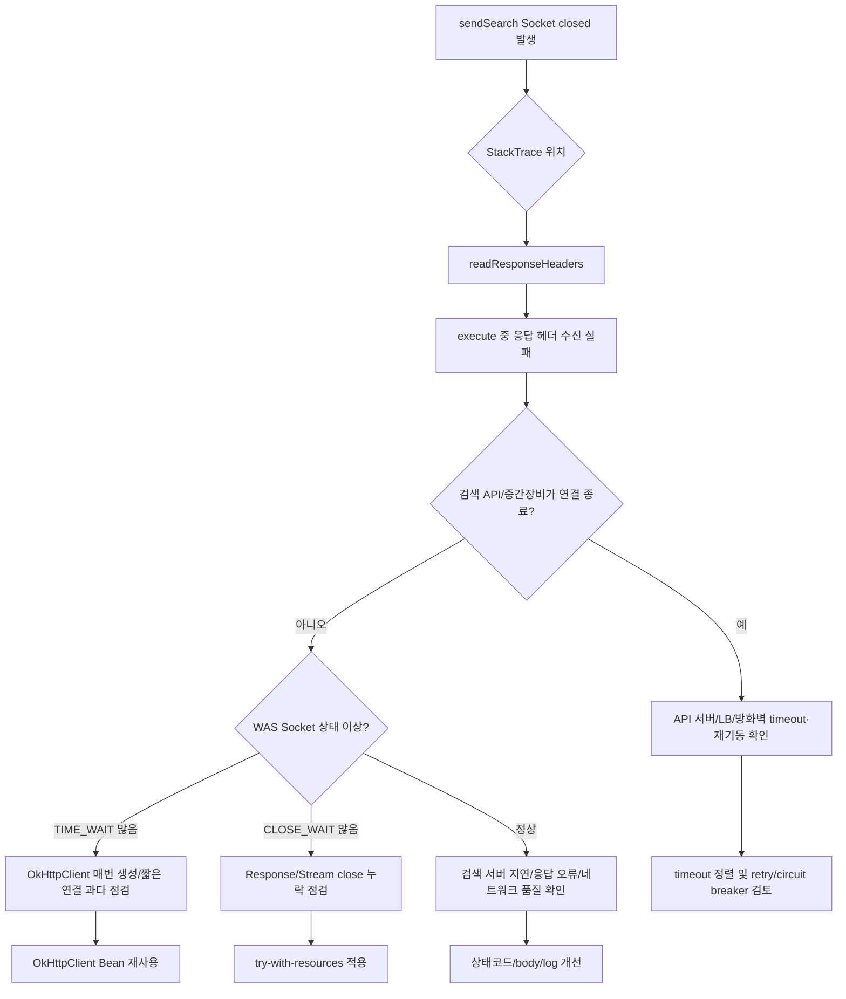
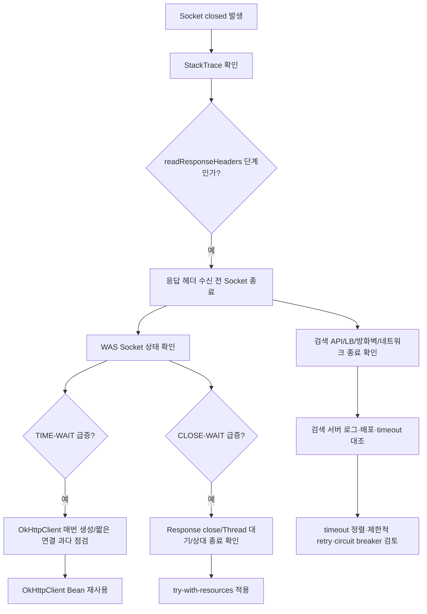

## 1. java.net.SocketException

```java
private SearchCommRespVO sendSearch(SearchCommReqVO searchVo) throws Exception {        
	Gson gson = new GsonBuilder().create();
	OkHttpClient client = new OkHttpClient().newBuilder().build();
	MediaType mediaType = MediaType.parse("application/json");

	String data = gson.toJson(searchVo);

	RequestBody body = RequestBody.create(mediaType, data);
	Request request = new Request.Builder()
			.url(GOODS_SEARCH_URL)
			.method("POST", body)
			.addHeader("Content-Type", "application/json")
			.build();
	
	SearchCommRespVO result = null;
	Response response = null;
	
	try {
		
		response = client.newCall(request).execute();       
		String rep = response.body().string();
		result = gson.fromJson(rep, SearchCommRespVO.class);

	} catch (EcException e) {
		log.error(e.toString());
		
		throw e;
	} catch (Exception e) {
		log.error("sendSearch ERROR request : {}", data);
		log.error(e.toString());
		throw e;
	}
	
	return result;
}
```

[was 로그]
    Caused by: java.net.SocketException: Socket closed
        at java.net.SocketInputStream.read(SocketInputStream.java:183) ~[?:?]
        at java.net.SocketInputStream.read(SocketInputStream.java:140) ~[?:?]
        at okio.Okio$2.read(Okio.java:140) ~[okio-1.14.0.jar:?]
        at okio.AsyncTimeout$2.read(AsyncTimeout.java:237) ~[okio-1.14.0.jar:?]
        at okio.RealBufferedSource.indexOf(RealBufferedSource.java:355) ~[okio-1.14.0.jar:?]
        at okio.RealBufferedSource.readUtf8LineStrict(RealBufferedSource.java:227) ~[okio-1.14.0.jar:?]
        at okhttp3.internal.http1.Http1Codec.readHeaderLine(Http1Codec.java:215) ~[okhttp-3.10.0.jar:?]
        at okhttp3.internal.http1.Http1Codec.readResponseHeaders(Http1Codec.java:189) ~[okhttp-3.10.0.jar:?]
        at okhttp3.internal.http.CallServerInterceptor.intercept(CallServerInterceptor.java:88) ~[okhttp-3.10.0.jar:?]
        at okhttp3.internal.http.RealInterceptorChain.proceed(RealInterceptorChain.java:147) ~[okhttp-3.10.0.jar:?]
        at okhttp3.internal.connection.ConnectInterceptor.intercept(ConnectInterceptor.java:45) ~[okhttp-3.10.0.jar:?]
        at okhttp3.internal.http.RealInterceptorChain.proceed(RealInterceptorChain.java:147) ~[okhttp-3.10.0.jar:?]
        at okhttp3.internal.http.RealInterceptorChain.proceed(RealInterceptorChain.java:121) ~[okhttp-3.10.0.jar:?]
        at okhttp3.internal.cache.CacheInterceptor.intercept(CacheInterceptor.java:93) ~[okhttp-3.10.0.jar:?]
        at okhttp3.internal.http.RealInterceptorChain.proceed(RealInterceptorChain.java:147) ~[okhttp-3.10.0.jar:?]
        at okhttp3.internal.http.RealInterceptorChain.proceed(RealInterceptorChain.java:121) ~[okhttp-3.10.0.jar:?]
        at okhttp3.internal.http.BridgeInterceptor.intercept(BridgeInterceptor.java:93) ~[okhttp-3.10.0.jar:?]
#### 1-1-1. 결론

제시된 StackTrace 기준으로 `java.net.SocketException: Socket closed`는 **OkHttp가 검색 API 서버로 POST 요청을 보낸 뒤, HTTP 응답 헤더를 읽는 과정에서 Socket이 이미 닫혀 발생한 오류**로 보는 것이 가장 타당합니다.  
특히 아래 구간이 핵심입니다.

```text
SocketInputStream.read
okio.RealBufferedSource.readUtf8LineStrict
okhttp3.internal.http1.Http1Codec.readHeaderLine
okhttp3.internal.http1.Http1Codec.readResponseHeaders
okhttp3.internal.http.CallServerInterceptor.intercept
```

즉, 현재 오류는 코드상으로는 주로 이 라인에서 발생했을 가능성이 큽니다.

```java
response = client.newCall(request).execute();
```

Java `Socket.close()`가 호출되면 해당 Socket의 `InputStream`, `OutputStream`도 함께 닫히고, 해당 Socket I/O에서 block 중이던 Thread는 `SocketException`을 받을 수 있습니다. 또한 한번 닫힌 Socket은 다시 네트워크 통신에 사용할 수 없습니다. ([Oracle Docs](https://docs.oracle.com/en/java/javase/11/docs/api/java.base/java/net/Socket.html "Socket (Java SE 11 & JDK 11 )"))

#### 1-1-2. 현재 소스의 문제점

```java
private SearchCommRespVO sendSearch(SearchCommReqVO searchVo) throws Exception {        
    Gson gson = new GsonBuilder().create();
    OkHttpClient client = new OkHttpClient().newBuilder().build();
    MediaType mediaType = MediaType.parse("application/json");

    String data = gson.toJson(searchVo);

    RequestBody body = RequestBody.create(mediaType, data);
    Request request = new Request.Builder()
            .url(GOODS_SEARCH_URL)
            .method("POST", body)
            .addHeader("Content-Type", "application/json")
            .build();
    
    SearchCommRespVO result = null;
    Response response = null;
    
    try {
        response = client.newCall(request).execute();       
        String rep = response.body().string();
        result = gson.fromJson(rep, SearchCommRespVO.class);

    } catch (EcException e) {
        log.error(e.toString());
        throw e;
    } catch (Exception e) {
        log.error("sendSearch ERROR request : {}", data);
        log.error(e.toString());
        throw e;
    }
    
    return result;
}
```

|구분|문제|영향|
|--:|---|---|
|1|`OkHttpClient`를 메서드 호출마다 생성|Connection Pool 재사용 효과 감소, TIME_WAIT 증가 가능|
|2|`Response` 명시적 close 없음|예외 경로에서 리소스 누수 가능|
|3|timeout 설정 없음|장애 시 대기 시간·실패 기준이 불명확|
|4|`response.body()` null 체크 없음|응답 body가 없을 때 NPE 가능|
|5|HTTP status 체크 없음|4xx/5xx 응답도 정상 JSON처럼 파싱 시도|
|6|`log.error(e.toString())`만 사용|StackTrace가 남지 않아 원인 추적 어려움|
|7|POST 재시도 정책 없음|일시적 네트워크 오류 대응 어려움|
|8|요청 전문 전체 로그 출력|개인정보/검색어/민감값 노출 가능|

#### 1-1-3. `Response` 미닫힘이 직접 원인인가?

이번 StackTrace만 보면 **직접 원인이라고 단정하기 어렵습니다.**  
이유는 예외가 `response.body().string()`에서 발생했다기보다, OkHttp 내부의 `readResponseHeaders()`에서 발생했기 때문입니다. 이는 `execute()`가 아직 `Response`를 정상 반환하기 전 단계입니다.  
다만 현재 코드는 `Response`를 명시적으로 닫지 않습니다. OkHttp 공식 문서에서도 `ResponseBody`는 Socket 같은 제한된 리소스를 사용하므로 반드시 닫아야 하며, 닫지 않으면 리소스 누수로 애플리케이션이 느려지거나 장애로 이어질 수 있다고 설명합니다. 동기 호출에서는 `try (Response response = call.execute())` 구조가 권장됩니다. ([Square Open Source](https://square.github.io/okhttp/3.x/okhttp/okhttp3/ResponseBody.html "ResponseBody (OkHttp 3.14.0 API)"))  
주의할 점은 `response.body().string()` 자체는 body를 소비하면서 close까지 수행하는 메서드 목록에 포함됩니다. 그러나 아래 경우에는 여전히 문제가 남습니다.

|경우|문제|
|--:|---|
|`execute()` 성공 후 `body()`가 null|`response.body().string()`에서 NPE|
|`execute()` 성공 후 `string()` 전에 예외|close 누락 가능|
|HTTP 오류 응답인데 body 파싱 실패|close 경로가 불명확|
|향후 코드 수정으로 `string()` 대신 stream 사용|close 누락 위험 증가|
|따라서 실무에서는 **`try-with-resources`로 `Response` 전체를 닫는 방식이 안전합니다.**||

#### 1-1-4. 발생 가능 원인

##### 1-1-4-1. 검색 API 서버 또는 중간 장비가 연결을 먼저 닫음

가장 가능성이 큽니다.

|원인|설명|
|--:|---|
|API 서버 응답 지연|WAS가 응답 헤더를 기다리는 중 상대가 연결 종료|
|API 서버 재기동|요청 처리 중 검색 서버 재시작 또는 배포|
|L4/LB/Proxy idle timeout|중간 장비가 먼저 TCP 연결 종료|
|방화벽 세션 정리|장시간 idle 또는 비정상 세션으로 판단하여 종료|
|검색 서버 Keep-Alive 정책|서버가 Keep-Alive 연결을 닫았는데 클라이언트가 통신 시도|
|StackTrace가 `readResponseHeaders()`에서 끊기므로, **요청은 나갔고 응답을 받는 초입에서 연결이 닫힌 상황**으로 보는 것이 자연스럽습니다.||

##### 1-1-4-2. `OkHttpClient`를 매번 생성하여 연결 관리가 비효율적임

현재 코드는 요청마다 아래 객체를 새로 만듭니다.

```java
OkHttpClient client = new OkHttpClient().newBuilder().build();
```

OkHttp는 기본적으로 재사용 가능한 HTTP Client로 설계되어 있고, Connection Pool을 통해 연결을 관리합니다. 매번 Client를 만들면 Pool 재사용 이점이 줄어들고, 고빈도 호출 시 Socket 수, `TIME-WAIT`, GC 부담이 커질 수 있습니다. OkHttp 공식 개요도 네트워크 문제가 있을 때 복구를 시도하고 대체 주소 시도 등 HTTP Client 차원의 동작을 제공한다고 설명합니다. ([Square Open Source](https://square.github.io/okhttp/?utm_source=chatgpt.com "Overview - OkHttp"))

##### 1-1-4-3. timeout 설정이 업무 기준에 맞지 않음

현재 코드에는 `connectTimeout`, `readTimeout`, `writeTimeout`, `callTimeout` 설정이 없습니다. OkHttp의 read timeout은 TCP Socket과 응답 Source의 개별 read I/O에 적용되며, 기본값은 10초입니다. ([Square Open Source](https://square.github.io/okhttp/5.x/okhttp/okhttp3/-ok-http-client/-builder/read-timeout.html "readTimeout"))  
검색 API가 간헐적으로 10초 이상 지연되거나, 중간 장비 timeout과 애플리케이션 timeout이 맞지 않으면 `Socket closed`, `Read timed out`, `Connection reset` 계열 오류가 섞여 발생할 수 있습니다.

##### 1-1-4-4. HTTP/1.1 Keep-Alive 연결 재사용 중 stale connection 가능성

StackTrace에 `Http1Codec`이 보이므로 HTTP/1.1 경로입니다. 이때 서버 또는 LB가 Keep-Alive 연결을 닫았는데 클라이언트가 해당 연결을 재사용하려는 시점에 닫힘이 감지되면 Socket 계열 오류가 날 수 있습니다.  
단, 현재 코드는 Client를 매번 생성하므로 일반적인 장기 Pool stale connection보다는 **검색 API 서버·LB·방화벽 쪽 연결 종료** 또는 **요청 중 응답 지연/종료** 가능성이 더 큽니다.

##### 1-1-4-5. 응답 본문 또는 HTTP 상태 검증 부재

현재 코드는 HTTP 상태를 확인하지 않고 바로 body를 문자열로 읽습니다.

```java
String rep = response.body().string();
result = gson.fromJson(rep, SearchCommRespVO.class);
```

검색 서버가 500, 502, 503, 504, HTML 에러 페이지, 빈 응답을 반환하면 JSON 파싱 오류나 NPE가 발생할 수 있습니다. 이 경우 실제 네트워크 원인과 애플리케이션 파싱 오류가 섞여 장애 분석이 어려워집니다.

#### 1-1-5. 권장 수정 코드

##### 1-1-5-1. Spring Bean 형태로 `OkHttpClient` 공용화

```java
@Bean
public OkHttpClient searchOkHttpClient() {
    return new OkHttpClient.Builder()
            .connectTimeout(3, TimeUnit.SECONDS)
            .writeTimeout(5, TimeUnit.SECONDS)
            .readTimeout(10, TimeUnit.SECONDS)
            .connectionPool(new ConnectionPool(50, 5, TimeUnit.MINUTES))
            .retryOnConnectionFailure(true)
            .build();
}
```

주의:

- timeout 값은 예시입니다.

- 검색 API SLA, WAS Thread timeout, LB timeout, 사용자 응답 허용시간에 맞춰 조정해야 합니다.

- `retryOnConnectionFailure(true)`는 네트워크 계층의 일부 실패에 도움은 되지만, 모든 POST 요청을 안전하게 재시도한다는 의미는 아닙니다.

##### 1-1-5-2. 메서드 수정 예시

```java
private final Gson gson = new GsonBuilder().create();
private final OkHttpClient searchOkHttpClient;

private SearchCommRespVO sendSearch(SearchCommReqVO searchVo) throws Exception {
    String data = gson.toJson(searchVo);

    RequestBody body = RequestBody.create(
            MediaType.parse("application/json; charset=utf-8"),
            data
    );

    Request request = new Request.Builder()
            .url(GOODS_SEARCH_URL)
            .post(body)
            .header("Content-Type", "application/json")
            .build();

    try (Response response = searchOkHttpClient.newCall(request).execute()) {
        int status = response.code();

        if (response.body() == null) {
            throw new IOException("Search API response body is null. status=" + status);
        }

        String rep = response.body().string();

        if (!response.isSuccessful()) {
            log.error("sendSearch HTTP ERROR. status={}, response={}", status, maskResponse(rep));
            throw new IOException("Search API HTTP error. status=" + status);
        }

        return gson.fromJson(rep, SearchCommRespVO.class);

    } catch (SocketTimeoutException e) {
        log.error("sendSearch TIMEOUT. url={}, request={}", GOODS_SEARCH_URL, maskRequest(data), e);
        throw e;
    } catch (SocketException e) {
        log.error("sendSearch SOCKET ERROR. url={}, request={}", GOODS_SEARCH_URL, maskRequest(data), e);
        throw e;
    } catch (IOException e) {
        log.error("sendSearch IO ERROR. url={}, request={}", GOODS_SEARCH_URL, maskRequest(data), e);
        throw e;
    } catch (Exception e) {
        log.error("sendSearch ERROR. url={}, request={}", GOODS_SEARCH_URL, maskRequest(data), e);
        throw e;
    }
}
```

예시 보조 메서드:

```java
private String maskRequest(String data) {
    if (data == null) {
        return null;
    }
    return data.length() > 1000 ? data.substring(0, 1000) + "...(truncated)" : data;
}

private String maskResponse(String data) {
    if (data == null) {
        return null;
    }
    return data.length() > 1000 ? data.substring(0, 1000) + "...(truncated)" : data;
}
```

##### 1-1-5-3. 현재 코드와 개선 코드 비교

|항목|현재|개선|
|--:|---|---|
|Client 생성|호출마다 생성|Singleton Bean 재사용|
|Timeout|기본값 의존|업무 기준 명시|
|Response close|명시적 보장 없음|`try-with-resources`|
|HTTP 상태|미확인|`response.isSuccessful()` 확인|
|Body null|미확인|null 체크|
|로그|`e.toString()`|StackTrace 포함|
|요청 로그|전체 출력|마스킹/길이 제한|
|장애 분류|Exception 일괄 처리|Timeout/Socket/IO 분리|

#### 1-1-6. 재시도 정책 검토

검색 API가 **조회성 POST**라면 재시도를 고려할 수 있습니다. 다만 POST는 일반적으로 부작용 가능성이 있으므로 아래 조건을 먼저 확인해야 합니다.

|조건|확인 내용|
|--:|---|
|멱등성|동일 요청을 여러 번 보내도 서버 상태가 바뀌지 않는가|
|검색 서버 처리 방식|요청 수 증가가 검색 서버 부하를 악화시키지 않는가|
|사용자 응답 시간|재시도 때문에 화면 응답이 과도하게 늦어지지 않는가|
|오류 대상|`Socket closed`, `Connection reset`, `SocketTimeoutException` 등 일시 오류에 한정할 것|
|재시도 횟수|보통 1회, 짧은 backoff 권장|
|간단 예시:||

```java
private SearchCommRespVO sendSearchWithRetry(SearchCommReqVO searchVo) throws Exception {
    int maxAttempts = 2;
    Exception last = null;

    for (int attempt = 1; attempt <= maxAttempts; attempt++) {
        try {
            return sendSearch(searchVo);
        } catch (SocketException | SocketTimeoutException e) {
            last = e;
            log.warn("sendSearch retryable error. attempt={}/{}", attempt, maxAttempts, e);

            if (attempt == maxAttempts) {
                throw e;
            }

            Thread.sleep(200L * attempt);
        }
    }

    throw last;
}
```

주의:

- 무제한 재시도는 금지해야 합니다.

- 검색 서버 장애 시 재시도가 트래픽 폭증을 만들 수 있습니다.

- 운영에서는 Resilience4j 같은 Circuit Breaker, Retry, Bulkhead 사용을 검토하는 것이 더 안전합니다.

#### 1-1-7. 서버에서 확인할 모니터링 커맨드

##### 1-1-7-1. 검색 API 대상 연결 확인

```bash
ss -tanp | grep '<검색API_IP>:<PORT>'
```

설명:

- WAS에서 검색 서버로 연결이 얼마나 생성되는지 확인합니다.

- `ESTAB`, `TIME-WAIT`, `CLOSE-WAIT` 상태를 봅니다.

##### 1-1-7-2. TCP 상태별 카운트

```bash
ss -tan | awk 'NR>1 {state[$1]++} END {for (s in state) print s, state[s]}' | sort
```

설명:

- `TIME-WAIT`가 급증하면 짧은 연결이 많이 생기는 구조일 수 있습니다.

- `CLOSE-WAIT`가 급증하면 close 누락 또는 상대방 종료 후 애플리케이션 정리 지연 가능성이 있습니다.

##### 1-1-7-3. 5초 간격 TCP 상태 모니터링

```bash
watch -n 5 "ss -tan | awk 'NR>1 {state[\$1]++} END {for (s in state) print s, state[s]}' | sort"
```

##### 1-1-7-4. WAS 프로세스가 가진 Socket 확인

```bash
PID=<WAS_PID>
lsof -Pan -p "$PID" -iTCP
```

##### 1-1-7-5. WAS FD 사용량 확인

```bash
PID=<WAS_PID>
ls /proc/"$PID"/fd | wc -l
```

##### 1-1-7-6. FD 제한 확인

```bash
PID=<WAS_PID>
cat /proc/"$PID"/limits | grep -i 'open files'
```

##### 1-1-7-7. 검색 오류 로그 집계

```bash
grep -iE 'sendSearch|Socket closed|SocketException|Connection reset|Read timed out|Broken pipe' /app/logs/application.log | tail -200
```

##### 1-1-7-8. 분 단위 발생량 집계

```bash
grep -i 'Socket closed' /app/logs/application.log | awk '{print $1,$2}' | cut -c1-16 | sort | uniq -c | sort -nr | head -20
```

##### 1-1-7-9. 검색 API 호출 시각과 장애 시각 대조

```bash
grep -i 'sendSearch' /app/logs/application.log | awk '{print $1,$2}' | cut -c1-16 | sort | uniq -c | tail -30
```

##### 1-1-7-10. Java Thread Dump에서 HTTP 대기 확인

```bash
PID=<WAS_PID>
jstack "$PID" | grep -iE 'okhttp|SocketInputStream|http|WAITING|BLOCKED' -n
```

#### 1-1-8. 운영 점검 포인트

|구분|점검 항목|판단|
|--:|---|---|
|발생 시각|검색 서버 배포/재기동과 일치?|일치하면 외부 서버 종료 가능성 큼|
|네트워크|L4/LB/방화벽 idle timeout 존재?|WAS timeout보다 짧으면 문제 가능|
|WAS|동일 시간대 Thread 증가?|검색 API 지연으로 WAS Thread 점유 가능|
|Socket|`TIME-WAIT` 급증?|Client 매번 생성, 짧은 연결 과다 의심|
|Socket|`CLOSE-WAIT` 급증?|Response/Stream close 누락 의심|
|로그|`Read timed out` 동반?|검색 API 지연 가능성|
|로그|`Connection reset` 동반?|상대방/중간 장비 강제 종료 가능성|
|코드|`Response` close 보장?|`try-with-resources` 필요|
|코드|StackTrace 로깅 여부|`log.error(..., e)`로 변경 필요|
|설정|timeout 명시 여부|connect/read/write/call 기준화 필요|

#### 1-1-9. 실무 대책 우선순위

|우선|대책|이유|
|--:|---|---|
|1|`log.error(..., e)`로 StackTrace 로깅|실제 발생 위치와 원인 추적 가능|
|2|`try (Response response = ...)` 적용|Socket/ResponseBody 리소스 누수 방지|
|3|`OkHttpClient` Singleton Bean화|Connection Pool 재사용, Socket 수 안정화|
|4|timeout 명시|장애 대기 시간 통제|
|5|HTTP status/body null 체크|비정상 응답과 네트워크 오류 분리|
|6|검색 API/LB timeout 확인|중간 장비 선종료 여부 확인|
|7|Socket 상태 모니터링|`TIME-WAIT`, `CLOSE-WAIT` 원인 분리|
|8|제한적 retry/circuit breaker|일시 장애 완화|
|9|요청/응답 로그 마스킹|개인정보·민감값 노출 방지|
|10|OkHttp 버전 업그레이드 검토|현재 `okhttp-3.10.0`, `okio-1.14.0`은 오래된 조합이므로 보안·버그 수정 관점에서 검토 필요|

#### 1-1-10. 판단 흐름도





#### 1-1-11. 최종 정리

현재 오류는 `response.body().string()` 자체보다 `client.newCall(request).execute()` 내부에서 **검색 서버 응답 헤더를 읽는 중 Socket이 닫힌 상황**으로 보는 것이 맞습니다. 직접 원인은 검색 API 서버, L4/LB, 방화벽, 네트워크, 서버 재기동, 응답 지연 중 하나일 가능성이 높습니다. 그러나 현재 코드에는 `OkHttpClient` 매번 생성, `Response` close 보장 부족, timeout 미정의, StackTrace 미출력 문제가 있으므로 운영 안정성 관점에서 반드시 개선하는 것이 좋습니다.

#### 1-1-12. 장애 해석 기준

제공된 StackTrace는 `response.body().string()`에서 응답 Body를 읽다가 실패한 형태라기보다, **OkHttp가 POST 요청 후 HTTP 응답 헤더를 읽는 `readResponseHeaders()` 단계에서 Socket이 닫힌 상황**으로 보는 것이 맞습니다.

```text
SocketInputStream.read
okio.RealBufferedSource.readUtf8LineStrict
okhttp3.internal.http1.Http1Codec.readHeaderLine
okhttp3.internal.http1.Http1Codec.readResponseHeaders
```

Java `Socket`은 `close()`되면 `InputStream`/`OutputStream`도 함께 닫히며, 해당 Socket I/O에서 block 중인 Thread는 `SocketException`을 받을 수 있습니다. 닫힌 Socket은 재사용할 수 없습니다. ([Oracle Docs][1])

#### 1-1-13. 발생 원인 후보

| 구분 | 원인                 | 판단 포인트                                          |
| -: | ------------------ | ----------------------------------------------- |
|  1 | 검색 API 서버가 연결 종료   | 검색 서버 재기동, 배포, 장애, 응답 지연                        |
|  2 | L4/LB/Proxy/방화벽 종료 | idle timeout, keep-alive timeout, 세션 정리         |
|  3 | OkHttp 연결 관리 비효율   | 매 호출 `OkHttpClient` 생성으로 Connection Pool 재사용 저하 |
|  4 | timeout 불명확        | connect/read/write/call timeout 업무 기준 미정의       |
|  5 | 응답 리소스 정리 미흡       | `Response` close 보장 부족                          |
|  6 | 검색 서버 응답 비정상       | 502/503/504, 빈 응답, 헤더 수신 전 연결 종료                |
|  7 | 고부하 순간 Socket 증가   | `TIME-WAIT`, FD 증가, Thread 대기 증가                |

#### 1-1-14. 현재 소스상의 문제

|                                                                                                                                                                                 항목 | 현재 코드                                     | 문제                                                                       |
| ---------------------------------------------------------------------------------------------------------------------------------------------------------------------------------: | ----------------------------------------- | ------------------------------------------------------------------------ |
|                                                                                                                                                                             Client | `new OkHttpClient().newBuilder().build()` | 호출마다 Client 생성. OkHttp는 단일 Client 재사용 시 Connection Pool/Thread 재사용 이점이 큼 |
|                                                                                                                                                                           Response | `Response response = null` 후 close 없음     | 예외 경로에서 ResponseBody close 보장 부족                                         |
|                                                                                                                                                                            Timeout | 별도 설정 없음                                  | 검색 API 지연/중간 장비 timeout과 애플리케이션 timeout 비교 어려움                           |
|                                                                                                                                                                             Status | `response.isSuccessful()` 확인 없음           | 4xx/5xx도 정상 JSON처럼 파싱 시도                                                 |
|                                                                                                                                                                               Body | `response.body().string()` 바로 호출          | body null 가능성, 응답 오류 내용 분리 어려움                                           |
|                                                                                                                                                                                 로그 | `log.error(e.toString())`                 | StackTrace 미출력으로 실제 장애 지점 추적 어려움                                         |
|                                                                                                                                                                              전문 로그 | `request : {}` 전체 출력                      | 검색어/개인정보/민감값 노출 가능                                                       |
|                                                                                                                                                                                재시도 | 없음                                        | 일시적 네트워크 오류 완화 불가                                                        |
|                                                                                                                                                                               회로차단 | 없음                                        | 검색 API 장애 시 WAS Thread 동반 고갈 가능                                          |
| OkHttp 공식 문서 기준 `ResponseBody`는 반드시 닫아야 하며, 동기 호출에서는 `try (Response response = call.execute())` 구조로 닫는 방식이 명시되어 있습니다. 또한 Response body는 한 번만 소비할 수 있습니다. ([Square Open Source][2]) |                                           |                                                                          |

#### 1-1-15. 서버 모니터링 커맨드

##### 1-1-15-1. Socket closed 발생 로그 확인

```bash
grep -iE 'sendSearch|Socket closed|SocketException|Connection reset|Read timed out|Broken pipe|readResponseHeaders' /app/logs/application.log | tail -200
```

`Socket closed`만 보지 말고 `Connection reset`, `Read timed out`, `Broken pipe`를 함께 봐야 합니다. 같은 시간대에 섞여 있으면 검색 API 서버, LB, 방화벽, 네트워크 종료 가능성이 커집니다.

##### 1-1-15-2. 분 단위 발생량 집계

```bash
grep -i 'Socket closed' /app/logs/application.log \
| awk '{print $1,$2}' \
| cut -c1-16 \
| sort | uniq -c | sort -nr | head -20
```

특정 분에 집중되면 검색 서버 재기동, 배포, 순간 트래픽, 네트워크 장비 세션 정리 시간과 대조해야 합니다.

##### 1-1-15-3. 검색 API 호출 로그 집계

```bash
grep -i 'sendSearch' /app/logs/application.log \
| awk '{print $1,$2}' \
| cut -c1-16 \
| sort | uniq -c | tail -30
```

호출량 증가와 오류 증가가 같은 시간대인지 확인합니다. 호출량은 그대로인데 오류만 늘면 검색 API 또는 네트워크 계층 문제가 더 의심됩니다.

##### 1-1-15-4. 검색 API 서버와의 TCP 연결 확인

```bash
ss -tanp | grep '<검색API_IP>:<PORT>'
```

예:

```bash
ss -tanp | grep '192.168.100.50:8080'
```

`ESTAB`, `TIME-WAIT`, `CLOSE-WAIT`, `SYN-SENT` 상태를 확인합니다. `ss`는 Linux Socket 상태를 확인하는 표준 도구입니다. ([Square Open Source][3])

##### 1-1-15-5. TCP 상태별 카운트

```bash
ss -tan | awk 'NR>1 {state[$1]++} END {for (s in state) print s, state[s]}' | sort
```

전체 Socket 상태를 요약합니다. `TIME-WAIT`가 급증하면 짧은 연결이 많이 생성되는 구조, `CLOSE-WAIT`가 많으면 애플리케이션 close 지연 또는 응답 리소스 정리 문제 가능성을 봅니다.

##### 1-1-15-6. 5초 간격 TCP 상태 변화

```bash
watch -n 5 "ss -tan | awk 'NR>1 {state[\$1]++} END {for (s in state) print s, state[s]}' | sort"
```

장애 중 Socket 상태가 증가하는지 실시간으로 봅니다.

##### 1-1-15-7. 검색 API 대상 `TIME-WAIT` 확인

```bash
ss -tan state time-wait | grep '<검색API_IP>:<PORT>' | wc -l
```

호출마다 새 연결이 많이 만들어지면 `TIME-WAIT`가 증가할 수 있습니다. 현재처럼 `OkHttpClient`를 매 호출 생성하는 구조에서는 Connection Pool 재사용 관점에서 불리합니다.

##### 1-1-15-8. 검색 API 대상 `CLOSE-WAIT` 확인

```bash
ss -tan state close-wait | grep '<검색API_IP>:<PORT>'
```

`CLOSE-WAIT`가 지속적으로 쌓이면 상대는 연결을 닫았는데 WAS 쪽 애플리케이션이 정리를 끝내지 못한 상태일 수 있습니다.

##### 1-1-15-9. WAS 프로세스가 가진 TCP Socket 확인

```bash
PID=<WAS_PID>
lsof -Pan -p "$PID" -iTCP
```

WAS 프로세스가 어떤 원격 IP/PORT와 Socket을 열고 있는지 확인합니다. 권한이 부족하면 일부 정보가 보이지 않을 수 있습니다.

##### 1-1-15-10. WAS FD 사용량 확인

```bash
PID=<WAS_PID>
ls /proc/"$PID"/fd | wc -l
```

Socket도 File Descriptor를 사용합니다. 이 값이 계속 증가하면 Socket/Stream/파일 close 누락 가능성을 의심합니다.

##### 1-1-15-11. WAS FD 제한 확인

```bash
PID=<WAS_PID>
cat /proc/"$PID"/limits | grep -i 'open files'
```

고부하 시 FD 한도에 가까워지면 신규 Socket 생성이나 파일 접근이 실패할 수 있습니다.

##### 1-1-15-12. Java Thread Dump에서 OkHttp 대기 확인

```bash
PID=<WAS_PID>
jstack "$PID" | grep -iE 'okhttp|SocketInputStream|Http1Codec|readResponseHeaders|WAITING|BLOCKED' -n
```

검색 API 응답 대기 Thread가 많이 쌓이는지 확인합니다. 검색 API 지연이 WAS Thread 고갈로 번지는지 판단할 수 있습니다.

#### 1-1-16. OkHttp 내부 모니터링 방법

OkHttp는 `EventListener`로 DNS, connect, request header/body, response header/body 단계 이벤트를 관찰할 수 있습니다. 공식 문서상 요청 이벤트 순서는 일반적으로 `requestHeaders → requestBody → responseHeaders → responseBody` 흐름이며, 연결 재사용 시 DNS/connect 이벤트가 없을 수 있습니다. ([Square Open Source][3])

##### 1-1-16-1. EventListener 적용 예시

```java
public class SearchOkHttpEventListener extends EventListener {
    private final long startNanos = System.nanoTime();

    private long elapsedMs() {
        return TimeUnit.NANOSECONDS.toMillis(System.nanoTime() - startNanos);
    }

    @Override
    public void connectionAcquired(Call call, Connection connection) {
        log.info("searchApi connectionAcquired elapsedMs={}, route={}", elapsedMs(), connection.route());
    }

    @Override
    public void requestHeadersStart(Call call) {
        log.info("searchApi requestHeadersStart elapsedMs={}", elapsedMs());
    }

    @Override
    public void requestBodyEnd(Call call, long byteCount) {
        log.info("searchApi requestBodyEnd elapsedMs={}, bytes={}", elapsedMs(), byteCount);
    }

    @Override
    public void responseHeadersStart(Call call) {
        log.info("searchApi responseHeadersStart elapsedMs={}", elapsedMs());
    }

    @Override
    public void responseHeadersEnd(Call call, Response response) {
        log.info("searchApi responseHeadersEnd elapsedMs={}, status={}", elapsedMs(), response.code());
    }

    @Override
    public void callFailed(Call call, IOException ioe) {
        log.error("searchApi callFailed elapsedMs={}, url={}", elapsedMs(), call.request().url(), ioe);
    }
}
```

##### 1-1-16-2. Client에 EventListener 연결

```java
@Bean
public OkHttpClient searchOkHttpClient() {
    return new OkHttpClient.Builder()
            .connectTimeout(3, TimeUnit.SECONDS)
            .writeTimeout(5, TimeUnit.SECONDS)
            .readTimeout(10, TimeUnit.SECONDS)
            .connectionPool(new ConnectionPool(50, 5, TimeUnit.MINUTES))
            .eventListenerFactory(call -> new SearchOkHttpEventListener())
            .retryOnConnectionFailure(true)
            .build();
}
```

OkHttp `ConnectionPool`은 HTTP/HTTP2 연결 재사용을 관리해 네트워크 지연을 줄이는 역할을 합니다. ([Javadoc][4])

#### 1-1-17. 개선 소스 예시

```java
private final Gson gson = new GsonBuilder().create();
private final OkHttpClient searchOkHttpClient;

private SearchCommRespVO sendSearch(SearchCommReqVO searchVo) throws Exception {
    String data = gson.toJson(searchVo);

    RequestBody body = RequestBody.create(
            MediaType.parse("application/json; charset=utf-8"),
            data
    );

    Request request = new Request.Builder()
            .url(GOODS_SEARCH_URL)
            .post(body)
            .header("Content-Type", "application/json")
            .build();

    long start = System.currentTimeMillis();

    try (Response response = searchOkHttpClient.newCall(request).execute()) {
        int status = response.code();
        ResponseBody responseBody = response.body();

        if (responseBody == null) {
            throw new IOException("Search API response body is null. status=" + status);
        }

        String rep = responseBody.string();

        if (!response.isSuccessful()) {
            log.error("sendSearch HTTP ERROR. status={}, elapsedMs={}, response={}",
                    status, System.currentTimeMillis() - start, truncate(rep));
            throw new IOException("Search API HTTP error. status=" + status);
        }

        return gson.fromJson(rep, SearchCommRespVO.class);

    } catch (SocketTimeoutException e) {
        log.error("sendSearch TIMEOUT. elapsedMs={}, url={}, request={}",
                System.currentTimeMillis() - start, GOODS_SEARCH_URL, mask(data), e);
        throw e;
    } catch (SocketException e) {
        log.error("sendSearch SOCKET ERROR. elapsedMs={}, url={}, request={}",
                System.currentTimeMillis() - start, GOODS_SEARCH_URL, mask(data), e);
        throw e;
    } catch (IOException e) {
        log.error("sendSearch IO ERROR. elapsedMs={}, url={}, request={}",
                System.currentTimeMillis() - start, GOODS_SEARCH_URL, mask(data), e);
        throw e;
    } catch (Exception e) {
        log.error("sendSearch ERROR. elapsedMs={}, url={}, request={}",
                System.currentTimeMillis() - start, GOODS_SEARCH_URL, mask(data), e);
        throw e;
    }
}

private String truncate(String value) {
    if (value == null) return null;
    return value.length() > 1000 ? value.substring(0, 1000) + "...(truncated)" : value;
}

private String mask(String value) {
    if (value == null) return null;
    return value.length() > 1000 ? value.substring(0, 1000) + "...(truncated)" : value;
}
```

#### 1-1-18. 개선 우선순위

| 우선 | 조치                                 | 이유                                  |
| -: | ---------------------------------- | ----------------------------------- |
|  1 | `log.error(..., e)` 적용             | StackTrace 확보                       |
|  2 | `try-with-resources` 적용            | Response/ResponseBody close 보장      |
|  3 | `OkHttpClient` Bean/Singletone 재사용 | Connection Pool 안정화                 |
|  4 | `connect/read/write timeout` 명시    | 장애 대기 시간 통제                         |
|  5 | `response.isSuccessful()` 체크       | HTTP 오류와 네트워크 오류 분리                 |
|  6 | `response.body() == null` 체크       | NPE 방지                              |
|  7 | 요청/응답 로그 마스킹                       | 개인정보/민감값 보호                         |
|  8 | EventListener 적용                   | 요청 단계별 실패 지점 확인                     |
|  9 | Socket 상태 모니터링                     | `TIME-WAIT`, `CLOSE-WAIT`, FD 증가 확인 |
| 10 | 제한적 retry/circuit breaker          | 검색 API 일시 장애 완화                     |

#### 1-1-19. Timeout 설정 기준

OkHttp Builder의 connect/read/write timeout 기본값은 문서상 10초입니다. read timeout은 TCP Socket 및 Response Source의 개별 read I/O에 적용됩니다. ([Square Open Source][5])

|                                                                                                                                                       Timeout | 권장 기준     | 설명                                       |
| ------------------------------------------------------------------------------------------------------------------------------------------------------------: | --------- | ---------------------------------------- |
|                                                                                                                                              `connectTimeout` | 2~3초      | 검색 API 서버 연결 수립 시간                       |
|                                                                                                                                                `writeTimeout` | 3~5초      | POST body 전송 시간                          |
|                                                                                                                                                 `readTimeout` | 5~10초     | 응답 헤더/본문 대기 시간                           |
|                                                                                                                                                 `callTimeout` | 업무 SLA 기준 | 전체 호출 제한. OkHttp 3.10.0 사용 시 지원 여부 확인 필요 |
| 주의: `callTimeout`은 OkHttp 3.12 이후 API이므로 현재 `okhttp-3.10.0`에서는 바로 사용 불가할 수 있습니다. 현재 버전 유지 시 connect/read/write timeout 중심으로 제어하고, 가능하면 라이브러리 업그레이드를 검토해야 합니다. |           |                                          |

#### 1-1-20. 장애 판단 흐름





#### 1-1-21. 실무 결론

이번 오류는 **검색 API 서버로 요청을 보낸 뒤 응답 헤더를 읽는 중 Socket이 닫힌 상황**입니다. 1차 원인은 검색 API 서버, L4/LB, 방화벽, 네트워크, 검색 서버 재기동/지연일 수 있습니다. 하지만 현재 소스도 운영 안정성 관점에서 문제가 있습니다. 특히 `OkHttpClient`를 매번 생성하는 구조, `Response` close 보장 부족, timeout 미정의, StackTrace 미출력은 반드시 개선해야 합니다. 모니터링은 애플리케이션 로그만 보지 말고 `ss`, `lsof`, `/proc/$PID/fd`, `jstack`, OkHttp `EventListener`를 함께 적용하는 방식이 가장 실무적으로 안전합니다.

[1]: https://docs.oracle.com/en/java/javase/11/docs/api/java.base/java/net/Socket.html?utm_source=chatgpt.com "Socket (Java SE 11 & JDK 11 )"
[2]: https://square.github.io/okhttp/3.x/okhttp/okhttp3/ResponseBody.html?utm_source=chatgpt.com "ResponseBody (OkHttp 3.14.0 API)"
[3]: https://square.github.io/okhttp/3.x/okhttp/okhttp3/EventListener.html?utm_source=chatgpt.com "EventListener (OkHttp 3.14.0 API)"
[4]: https://javadoc.io/doc/com.squareup.okhttp3/okhttp/3.10.0/okhttp3/ConnectionPool.html?utm_source=chatgpt.com "ConnectionPool (OkHttp 3.10.0 API)"
[5]: https://square.github.io/okhttp/3.x/okhttp/okhttp3/OkHttpClient.Builder.html?utm_source=chatgpt.com "OkHttpClient.Builder (OkHttp 3.14.0 API)"

OkHttp가 API 서버로 POST 요청을 보낸 후 응답 헤더를 읽는 단계(`readResponseHeaders`)에서 `Socket closed` 예외가 발생했다는 것은, 대기 시간을 참지 못한 누군가(클라이언트 타임아웃, 네트워크 장비, 혹은 원격 서버)가 커넥션을 중간에 뽀갰다(강제 종료)는 의미입니다.

이 문제를 리운영 환경에서 감지하고 예방하기 위한 **단계별 모니터링 방법**과 **기존 소스의 핵심 문제점**을 일목요연하게 정리해 드립니다.

---

## 2. Socket Closed 오류 모니터링 방법

이 오류는 애플리케이션 내부 문제(자원 누수)와 외부 요인(네트워크 타임아웃)이 결합되어 발생하므로, 다각도로 모니터링 체계를 구축해야 합니다.

### 2-1. ① 인프라 및 네트워크 레벨 모니터링 (`netstat` / `ss`)

소켓이 정상적으로 닫히지 않고 고갈되는지 WAS 서버에서 직접 확인하는 방법입니다.

* **CLOSE_WAIT 상태 감시:** 소켓 자원 누수가 발생하면 서버에 `CLOSE_WAIT` 상태의 커넥션이 계속 쌓입니다. 명령어(`netstat -an | findstr CLOSE_WAIT` 또는 리눅스 `ss -t -a | grep CLOSE-WAIT`)를 통해 이 개수가 지속적으로 증가하는지 모니터링합니다.
* **방화벽/LB 유휴 타임아웃 확인:** 클라이언트와 API 서버 사이에 있는 L4 스위치나 방화벽의 **Idle Timeout** 설정을 확인해야 합니다. 만약 이 장비들의 타임아웃이 60초인데 OkHttp 타임아웃이 이보다 길면, 장비가 커넥션을 먼저 끊어버려 `Socket closed`가 발생합니다.

### 2-2. ② 애플리케이션 레벨 모니터링 (APM 활용)

Pinpoint, Datadog, Scouter, Jennifer 등의 APM 도구를 활용합니다.

* **에러 트래킹:** `java.net.SocketException` 발생 빈도를 대시보드에 시각화하고, 특정 임계치(예: 5분간 10회 이상) 초과 시 Slack이나 이메일 알림(Alert)을 설정합니다.
* **외부 HTTP 아웃바운드 호출 시간:** `GOODS_SEARCH_URL`로 향하는 요청들의 평균 응답 시간(Duration) 변화 추이를 모니터링합니다. 갑자기 이 시간이 길어지면서 에러가 동반된다면 target API 서버의 지연 문제입니다.

### 2-3. ③ OkHttpClient 커넥션 풀 메트릭 수집 (Spring Boot Actuator)

Spring 5.3 환경이라면 **Micrometer**를 통해 OkHttp의 커넥션 풀 상태를 Prometheus + Grafana로 모니터링할 수 있습니다.

* **주요 모니터링 지표:**
* `okhttp.pool.connection.count` (현재 풀에 있는 총 커넥션 수)
* `okhttp.pool.idle.connection.count` (유휴 커넥션 수)

* **효과:** 소스 수정 후 커넥션이 정상적으로 풀에 반환되고 유지되는지 실시간 그래포로 확인할 수 있습니다.

---

## 3. 기존 소스 코드의 치명적 문제점 요약

제공해주신 기존 소스 코드의 문제는 크게 '자원의 무한 생성'과 '자원의 미반환'으로 요약할 수 있습니다.

| 문제 요소 | 현상 | 결과 및 장애 원인 |
| --- | --- | --- |
| **① 매 요청마다 `new OkHttpClient()**` | 싱글톤이 아닌 로컬 변수로 매번 클라이언트 생성 | 호출할 때마다 독자적인 커넥션 풀과 스레드가 생성되어 **OS 소켓 및 메모리 고갈** 유발 |
| **② `Response` 폐쇄 누락 (`.close()`)** | `try-catch` 내부에서 응답 객체를 닫아주지 않음 | HTTP 연결 스트림이 계속 열려 있어 **커넥션 누수(Leak)** 발생 |
| **③ 명시적 타임아웃 설정 부재** | OkHttp 기본 타임아웃(10초) 적용 | 대용량 조회 시 API 서버 응답이 10초를 넘기면 클라이언트 내부 타임아웃 스레드가 **소켓을 강제로 닫아버림** |
| **④ 로깅 방식의 한계** | 에러 로그 기록 시 `e.toString()`만 사용 | 에러 메시지 한 줄만 찍히고 구체적인 원인(스택 트레이스)을 알 수 없어 **원인 분석(디버깅)이 불가능**했음 |

> 💡 **한 줄 요약**
> 기존 코드는 호출될 때마다 소켓을 새로 열고 다 쓴 소켓은 닫지 않고 방치했으며, 그 상태에서 상대 서버 응답이 조금이라도 늦어지면 내부 타임아웃 핸들러가 소켓을 강제로 끊어버리는(`Socket closed`) 구조였습니다.

---

현재 운영 중인 시스템에 Pinpoint나 Datadog 같은 **APM 도구**가 도입되어 있나요? 아니면 로그 파일(ELK 등) 기반으로만 모니터링 중이신지 알려주시면, 해당 환경에 맞는 알림(Alert) 설정 팁을 더 구체적으로 조언해 드릴 수 있습니다.
<details>
  <summary>참고</summary>  
  <pre>
  </pre>
</details>
