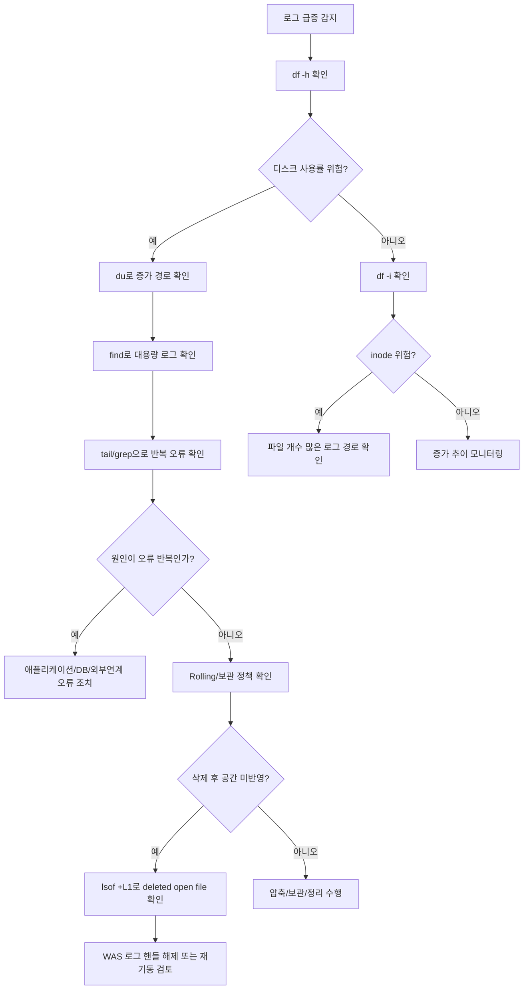
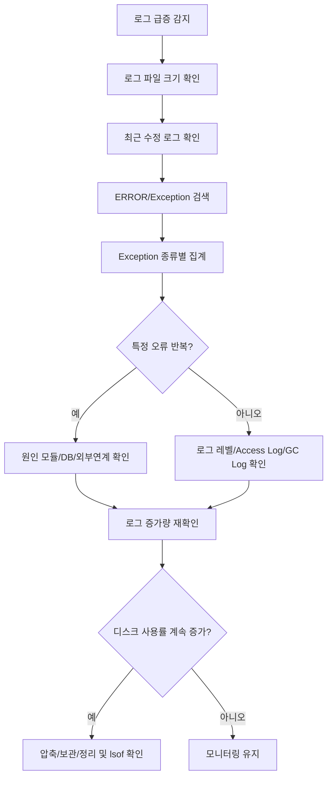

정확도: 94%

#### 1. WAS 서버 로그 파일 급증 시 디스크 모니터링 방법

##### 1-1. 핵심 점검 관점

WAS 서버 로그가 급격히 증가할 때는 단순히 `df -h`만 보면 원인을 놓칠 수 있습니다. 아래 6가지를 함께 확인해야 합니다.

|구분|확인 내용|대표 원인|
|--:|---|---|
|1|파일시스템 사용률|로그 파일 증가, 배포파일 누적|
|2|로그 디렉터리 증가량|애플리케이션 오류 반복, DEBUG 로그 과다|
|3|단일 대용량 로그|특정 로그 파일 무한 증가|
|4|다량의 로그 파일|Rolling 정책 오류, 날짜별 로그 미정리|
|5|inode 부족|작은 로그 파일 대량 생성|
|6|삭제됐지만 점유 중인 로그|WAS 프로세스가 삭제된 로그 파일을 계속 잡고 있음|

##### 1-2. 전체 디스크 사용률 확인

```bash
df -h
```

설명:

- 서버 전체 파일시스템의 사용률을 확인합니다.

- `/`, `/app`, `/data`, `/logs` 같은 파티션이 85% 이상이면 위험 구간으로 봅니다.

- 로그 디렉터리가 별도 파티션이 아니라 `/`에 있으면, 로그 폭증이 OS 전체 장애로 이어질 수 있습니다.

```bash
watch -n 5 'df -h'
```

설명:

- 5초 간격으로 디스크 사용률 변화를 확인합니다.

- 장애 대응 중 로그가 계속 증가하는지 확인할 때 사용합니다.

##### 1-3. inode 사용률 확인

```bash
df -i
```

설명:

- 디스크 용량은 남아 있는데 파일 생성이 실패하는 경우 inode 부족일 수 있습니다.

- 로그 파일이 아주 많이 생성되는 구조이면 `df -h`보다 `df -i`가 먼저 위험해질 수 있습니다.

```bash
watch -n 5 'df -h; echo; df -i'
```

설명:

- 디스크 용량과 inode 사용률을 동시에 확인합니다.

##### 1-4. 로그 디렉터리 전체 용량 확인

```bash
du -sh /app/logs
du -sh /app/jboss/standalone/log
```

설명:

- 애플리케이션 로그와 WAS 자체 로그의 전체 크기를 확인합니다.

- JBoss/WildFly 계열이면 보통 `/standalone/log`를 우선 확인합니다.

- 프로젝트별 로그 경로가 별도이면 `/app/logs`, `/data/logs`, `/logs` 등 실제 경로로 변경해야 합니다.

##### 1-5. 로그 하위 디렉터리별 사용량 확인

```bash
du -h --max-depth=1 /app/logs 2>/dev/null | sort -hr
```

```bash
du -h --max-depth=1 /app/jboss/standalone/log 2>/dev/null | sort -hr
```

설명:

- 어느 업무, 모듈, 서버 로그가 가장 많이 증가했는지 확인합니다.

- `sort -hr`로 용량이 큰 순서대로 정렬합니다.

- 로그 파일이 매우 많은 운영 서버에서는 `du` 자체가 I/O 부하를 만들 수 있으므로 장애 시간대에는 대상 경로를 좁혀 실행하는 것이 안전합니다.

##### 1-6. 대용량 로그 파일 TOP 확인

```bash
find /app/logs -type f -exec du -h {} + 2>/dev/null | sort -hr | head -20
```

```bash
find /app/jboss/standalone/log -type f -exec du -h {} + 2>/dev/null | sort -hr | head -20
```

설명:

- 어떤 로그 파일이 디스크를 가장 많이 차지하는지 확인합니다.

- 보통 `server.log`, `application.log`, `error.log`, `access.log`, `gc.log`, `nohup.out` 등이 원인이 될 수 있습니다.

##### 1-7. 특정 크기 이상 로그 파일 검색

```bash
find /app/logs -type f -size +500M -ls 2>/dev/null
```

```bash
find /app/logs -type f -size +1G -ls 2>/dev/null
```

설명:

- 500MB 또는 1GB 이상으로 커진 로그 파일을 찾습니다.

- 단일 로그 파일이 계속 커진다면 Rolling 정책이 동작하지 않거나 특정 오류가 반복 중일 가능성이 큽니다.

##### 1-8. 최근 급증한 로그 확인

```bash
find /app/logs -type f -mmin -10 -ls 2>/dev/null
```

```bash
find /app/logs -type f -mtime -1 -ls 2>/dev/null
```

설명:

- `-mmin -10`: 최근 10분 내 수정된 파일 확인

- `-mtime -1`: 최근 1일 내 수정된 파일 확인

- 장애 발생 시점에 어떤 로그가 계속 쓰이고 있는지 확인할 수 있습니다.

##### 1-9. 로그 증가량 실시간 확인

```bash
watch -n 5 'ls -lh /app/logs/*.log 2>/dev/null | sort -k5 -hr | head -20'
```

설명:

- 5초마다 로그 파일 크기를 확인합니다.

- 특정 파일 크기가 계속 증가하면 해당 로그를 우선 분석해야 합니다.

```bash
watch -n 5 'du -sh /app/logs /app/jboss/standalone/log 2>/dev/null'
```

설명:

- 로그 디렉터리 전체 크기가 계속 증가하는지 확인합니다.

##### 1-10. 로그 파일 증가 속도 확인

```bash
LOG=/app/logs/application.log
while true; do
  date '+%F %T'
  ls -lh "$LOG"
  sleep 5
done
```

설명:

- 특정 로그 파일의 크기 변화를 5초 단위로 확인합니다.

- 장애성 로그 폭증인지, 정상 트래픽 증가인지 1차 판단할 수 있습니다.

```bash
LOG=/app/logs/application.log
while true; do
  stat -c '%y %s %n' "$LOG"
  sleep 5
done
```

설명:

- `stat`은 파일의 수정 시각과 byte 크기를 확인합니다.

- `ls -lh`보다 스크립트 분석에 적합합니다.

##### 1-11. 로그 내용 급증 원인 확인

```bash
tail -f /app/logs/application.log
```

설명:

- 현재 어떤 로그가 반복 출력되는지 확인합니다.

- 단, 로그가 너무 빠르게 쏟아지는 경우 터미널이 느려질 수 있습니다.

```bash
tail -n 200 /app/logs/application.log
```

설명:

- 최근 200줄만 확인합니다.

- 운영 서버에서는 먼저 `tail -n`으로 확인하고, 필요할 때만 `tail -f`를 쓰는 것이 안전합니다.

```bash
grep -iE 'ERROR|Exception|WARN|OutOfMemory|Timeout|Deadlock|Connection' /app/logs/application.log | tail -100
```

설명:

- 오류, 예외, 타임아웃, DB 연결 문제 등 로그 폭증 원인을 빠르게 필터링합니다.

##### 1-12. 반복 오류 카운트 확인

```bash
grep -i 'Exception' /app/logs/application.log | awk '{print $1,$2,$3,$4,$5}' | sort | uniq -c | sort -nr | head -20
```

설명:

- 같은 예외가 반복되는지 확인합니다.

- 다만 로그 포맷이 프로젝트마다 다르므로 `awk` 컬럼은 실제 로그 형식에 맞게 조정해야 합니다.

```bash
grep -iE 'ERROR|Exception' /app/logs/application.log | wc -l
```

설명:

- 오류 로그 발생량을 대략적으로 확인합니다.

##### 1-13. 삭제했는데 디스크가 안 줄어드는 경우 확인

```bash
lsof +L1
```

설명:

- 삭제된 파일을 프로세스가 계속 잡고 있는지 확인합니다.

- 로그 파일을 `rm`으로 삭제했는데 `df -h` 사용률이 줄지 않는 대표 원인입니다.

- WAS 프로세스가 삭제된 로그 파일 핸들을 잡고 있으면, 파일은 보이지 않아도 디스크 공간은 계속 점유됩니다.

```bash
lsof | grep deleted
```

설명:

- `lsof +L1`이 제한되는 환경에서 대체 확인용으로 사용합니다.

- 권한이 없으면 전체 결과가 안 보일 수 있습니다.

##### 1-14. 프로세스별 로그 점유 확인

```bash
ps -ef | grep -i 'java\|jboss\|wildfly' | grep -v grep
```

설명:

- WAS 프로세스 PID를 확인합니다.

```bash
lsof -p <PID> | grep -iE 'log|deleted'
```

설명:

- 특정 WAS 프로세스가 어떤 로그 파일을 열고 있는지 확인합니다.

- 삭제된 로그를 계속 잡고 있는 경우 WAS 재기동 또는 로그 핸들 재오픈 조치가 필요할 수 있습니다.

##### 1-15. 로그 파일 개수 확인

```bash
find /app/logs -type f | wc -l
```

```bash
find /app/jboss/standalone/log -type f | wc -l
```

설명:

- 로그 파일 개수가 비정상적으로 많으면 inode 부족 가능성이 있습니다.

- 날짜별, 시간별, 요청별로 로그가 과도하게 쪼개지는 설정인지 확인해야 합니다.

##### 1-16. 오래된 로그 확인

```bash
find /app/logs -type f -mtime +30 -ls 2>/dev/null
```

```bash
find /app/jboss/standalone/log -type f -mtime +30 -ls 2>/dev/null
```

설명:

- 30일 이상 지난 로그 파일을 확인합니다.

- 바로 삭제하지 말고 보관 정책, 장애 분석 필요성, 감사 요건을 먼저 확인해야 합니다.

##### 1-17. 압축되지 않은 오래된 로그 확인

```bash
find /app/logs -type f -mtime +7 ! -name "*.gz" -ls 2>/dev/null
```

설명:

- 오래된 로그가 압축되지 않고 남아 있는지 확인합니다.

- Rolling은 되고 있지만 압축 정책이 없으면 디스크 증가 속도가 빨라집니다.

##### 1-18. 운영 서버에서 위험한 삭제 방식

```bash
# 비권장
rm -rf /app/logs/*
```

```bash
# 비권장
find /app/logs -type f -mtime +30 -delete
```

위 방식은 운영 서버에서 바로 실행하면 위험합니다. 삭제 대상 확인, 백업, 보관 정책 검토 없이 수행하면 장애 분석 자료나 감사 로그가 사라질 수 있습니다.

##### 1-19. 안전한 정리 절차

```bash
# 1단계: 삭제 후보 확인
find /app/logs -type f -mtime +30 -ls 2>/dev/null
```

```bash
# 2단계: 삭제 후보 목록 저장
find /app/logs -type f -mtime +30 -print > /tmp/old_logs_$(date +%Y%m%d).txt
```

```bash
# 3단계: 목록 검토
head -50 /tmp/old_logs_$(date +%Y%m%d).txt
wc -l /tmp/old_logs_$(date +%Y%m%d).txt
```

```bash
# 4단계: 압축 가능 로그 확인
find /app/logs -type f -mtime +7 ! -name "*.gz" -ls 2>/dev/null
```

```bash
# 5단계: 개별 파일 압축 예시
gzip /app/logs/application.log.20260501
```

설명:

- 운영 서버에서는 삭제보다 압축을 먼저 고려하는 것이 안전합니다.

- 삭제는 로그 보관 정책과 백업 여부 확인 후 수행해야 합니다.

##### 1-20. 주요 상황별 모니터링 커맨드

|상황|커맨드|설명|
|--:|---|---|
|전체 용량 증가|`df -h`|파티션 사용률 확인|
|inode 부족|`df -i`|파일 개수 과다 여부 확인|
|로그 전체 증가|`du -sh /app/logs`|로그 디렉터리 총량 확인|
|원인 디렉터리|`du -h --max-depth=1 /app/logs \| sort -hr`|하위 경로별 용량 확인|
|대용량 파일|`find /app/logs -type f -size +1G -ls`|1GB 이상 로그 확인|
|최근 증가|`find /app/logs -type f -mmin -10 -ls`|최근 10분 내 변경 로그 확인|
|실시간 증가|`watch -n 5 'ls -lh /app/logs/*.log \| sort -k5 -hr \| head'`|파일 크기 변화 확인|
|오류 반복|`grep -iE 'ERROR\|Exception' /app/logs/application.log \| tail -100`|오류 로그 확인|
|삭제 후 미반영|`lsof +L1`|삭제된 파일 점유 확인|
|파일 과다|`find /app/logs -type f \| wc -l`|로그 파일 개수 확인|

##### 1-21. 실무 서버 운영 시 주의할 점

|구분|주의점|설명|
|--:|---|---|
|1|`du` 남발 금지|파일이 많은 경로에서 I/O 부하 발생 가능|
|2|바로 삭제 금지|장애 분석, 감사, 정산 로그 유실 가능|
|3|`rm`보다 압축 우선|오래된 로그는 `gzip` 후 보관 검토|
|4|삭제 후 `df` 재확인|`du`는 줄었는데 `df`가 안 줄면 `lsof` 확인|
|5|WAS 재기동 주의|삭제 파일 점유 해소 목적 재기동은 업무 영향 검토 필요|
|6|로그 레벨 점검|운영에서 `DEBUG`, 과도한 SQL 로그는 위험|
|7|Rolling 정책 점검|크기, 기간, 총 보관량 제한 필요|
|8|로그 파티션 분리|가능하면 `/logs` 또는 `/app/logs` 별도 파티션 권장|
|9|알림 기준 필요|80%, 85%, 90% 구간별 대응 기준 필요|
|10|원인 제거 우선|디스크 정리만 하면 재발 가능성이 큼|

##### 1-22. Java/Spring/WAS 로그 설정 측면 점검

|항목|점검 내용|
|--:|---|
|로그 레벨|운영 환경에서 `DEBUG`, `TRACE`가 켜져 있는지 확인|
|SQL 로그|MyBatis, JDBC, log4jdbc SQL 로그가 과도하게 남는지 확인|
|예외 반복|같은 Exception StackTrace가 초당 수십~수백 건 반복되는지 확인|
|Rolling|날짜별 또는 크기별 Rolling이 정상 동작하는지 확인|
|보관 기간|`maxHistory`, `retention`, `delete policy`가 있는지 확인|
|총량 제한|Logback `totalSizeCap`, Log4j2 Delete Policy 등 총량 제한 여부 확인|
|Access Log|요청량 증가 또는 Liveness Check 과다로 access log가 폭증하는지 확인|
|GC Log|GC 로그 파일이 순환되지 않고 계속 커지는지 확인|
|Dump 파일|heap dump, thread dump가 로그 경로에 누적되는지 확인|

##### 1-23. 장애 대응용 최소 점검 순서

```bash
df -h
df -i
du -h --max-depth=1 /app 2>/dev/null | sort -hr
du -h --max-depth=1 /app/logs 2>/dev/null | sort -hr
find /app/logs -type f -size +1G -ls 2>/dev/null
find /app/logs -type f -mmin -10 -ls 2>/dev/null
tail -n 200 /app/logs/application.log
lsof +L1
```

##### 1-24. 간단 모니터링 스크립트 예시

```bash
#!/bin/bash
BASE_LOG_DIR="/app/logs"
WAS_LOG_DIR="/app/jboss/standalone/log"
echo "===== DATE ====="
date '+%F %T'
echo
echo "===== DISK USAGE ====="
df -h
echo
echo "===== INODE USAGE ====="
df -i
echo
echo "===== LOG DIR SIZE ====="
du -sh "$BASE_LOG_DIR" "$WAS_LOG_DIR" 2>/dev/null
echo
echo "===== TOP LOG DIRECTORIES ====="
du -h --max-depth=1 "$BASE_LOG_DIR" 2>/dev/null | sort -hr | head -20
echo
echo "===== LARGE LOG FILES OVER 1GB ====="
find "$BASE_LOG_DIR" "$WAS_LOG_DIR" -type f -size +1G -ls 2>/dev/null
echo
echo "===== RECENTLY MODIFIED LOGS WITHIN 10 MIN ====="
find "$BASE_LOG_DIR" "$WAS_LOG_DIR" -type f -mmin -10 -ls 2>/dev/null
echo
echo "===== DELETED BUT OPEN FILES ====="
lsof +L1 2>/dev/null | grep -iE 'java|jboss|wildfly|log|deleted'
```

실행 예시:

```bash
vi /app/scripts/check_was_log_disk.sh
chmod +x /app/scripts/check_was_log_disk.sh
/app/scripts/check_was_log_disk.sh
```

##### 1-25. cron으로 주기 점검 로그 남기기

```bash
crontab -e
```

```bash
*/10 * * * * /app/scripts/check_was_log_disk.sh >> /app/logs/disk_monitor_$(date +\%Y\%m\%d).log 2>&1
```

설명:

- 10분마다 디스크 점검 결과를 파일에 남깁니다.

- 단, 이 모니터링 로그 자체도 계속 증가하므로 별도 Rolling 또는 정리 정책이 필요합니다.

##### 1-26. 권장 임계치 기준

|구분|주의|위험|조치|
|--:|--:|--:|---|
|디스크|80%|90%|원인 로그 확인, 압축/정리|
|inode|80%|90%|파일 개수 과다 경로 확인|
|단일 로그|500MB|1GB+|Rolling 정책 확인|
|로그 증가|분 단위 증가|초 단위 급증|오류 반복 확인|
|삭제 파일 점유|발견|대용량 발견|프로세스 핸들 해제 검토|

##### 1-27. 전체 판단 흐름





##### 1-28. 실무 결론

WAS 로그 급증 대응은 `df -h`로 디스크 위험도를 보고, `du`로 증가 경로를 찾고, `find`로 대용량·최근 변경 로그를 식별한 뒤, `tail`·`grep`으로 반복 오류 원인을 확인하는 순서가 안전합니다. 운영 서버에서는 로그 삭제보다 원인 제거가 우선이며, 삭제 후에도 공간이 줄지 않으면 `lsof +L1`로 삭제된 로그 파일을 WAS 프로세스가 계속 잡고 있는지 반드시 확인해야 합니다.

## 2. 모니터링 커멘드 상세

#### 2-1-1. 대상 커맨드

```bash
grep -i 'Exception' /app/logs/application.log | awk '{print $1,$2,$3,$4,$5}' | sort | uniq -c | sort -nr | head -20
```

#### 2-1-2. 커맨드 목적

이 커맨드는 `/app/logs/application.log` 파일에서 `Exception` 문자열이 포함된 로그 라인을 찾아, 각 라인의 앞쪽 5개 필드를 기준으로 동일 패턴을 묶은 뒤, 많이 발생한 순서대로 상위 20개를 보여주는 명령입니다.  
즉, **로그 파일 안에서 반복적으로 발생하는 Exception 로그 패턴을 빠르게 찾기 위한 1차 분석용 커맨드**입니다.

#### 2-1-3. 파이프라인 단계별 설명

|순서|구문|역할|
|--:|---|---|
|1|`grep -i 'Exception' /app/logs/application.log`|로그 파일에서 대소문자 구분 없이 `Exception` 포함 라인 검색|
|2|`awk '{print $1,$2,$3,$4,$5}'`|검색된 라인에서 공백 기준 앞 5개 필드만 출력|
|3|`sort`|동일한 라인이 모이도록 정렬|
|4|`uniq -c`|동일한 라인의 반복 횟수 집계|
|5|`sort -nr`|발생 횟수를 숫자 기준 내림차순 정렬|
|6|`head -20`|상위 20개만 출력|

#### 2-1-4. 실제 동작 예시

예를 들어 로그가 아래와 같다고 가정합니다.

```log
2026-06-01 10:00:01 ERROR [default task-1] com.test.OrderService - java.lang.NullPointerException
2026-06-01 10:00:02 ERROR [default task-2] com.test.OrderService - java.lang.NullPointerException
2026-06-01 10:00:03 ERROR [default task-3] com.test.PaymentService - java.sql.SQLNonTransientConnectionException
```

현재 명령의 `awk '{print $1,$2,$3,$4,$5}'` 결과는 대략 아래처럼 됩니다.

```bash
2026-06-01 10:00:01 ERROR [default task-1]
2026-06-01 10:00:02 ERROR [default task-2]
2026-06-01 10:00:03 ERROR [default task-3]
```

이 경우 **시간과 스레드명이 포함되므로 같은 Exception이라도 서로 다른 라인으로 집계될 수 있습니다.**  
따라서 현재 커맨드는 로그 포맷에 따라 정확한 Exception 집계가 안 될 수 있습니다.

#### 2-1-5. 현재 커맨드의 실무상 한계

|구분|문제점|영향|
|--:|---|---|
|1|앞 5개 필드만 집계|실제 Exception 클래스명이 빠질 수 있음|
|2|날짜/시간이 포함됨|같은 오류도 서로 다른 항목으로 분리될 수 있음|
|3|StackTrace 전체 미분석|원인 위치까지 파악하기 어려움|
|4|대용량 로그에서 `sort` 부하|CPU, 메모리, I/O 사용량 증가|
|5|현재 로그 파일만 분석|`.gz`, 날짜별 로그는 별도 분석 필요|
|6|`Exception` 문자열만 검색|`ERROR`, `Caused by`, `Timeout`, `Deadlock` 누락 가능|

#### 2-1-6. 실무에서 더 적절한 변형

##### 2-1-6-1. Exception 클래스명 기준 집계

```bash
grep -oE '[A-Za-z0-9_.]+Exception' /app/logs/application.log | sort | uniq -c | sort -nr | head -20
```

설명:

- 로그 라인 전체가 아니라 `NullPointerException`, `SQLException` 같은 Exception 클래스명만 추출합니다.

- 반복 오류 유형을 파악할 때 현재 커맨드보다 실무적으로 더 유용합니다.

##### 2-1-6-2. ERROR/Exception/Caused by 같이 검색

```bash
grep -iE 'ERROR|Exception|Caused by' /app/logs/application.log | tail -200
```

설명:

- 단순 Exception 라인뿐 아니라 실제 원인 라인인 `Caused by`도 같이 확인합니다.

- 최근 장애 원인 확인용으로 적합합니다.

##### 2-1-6-3. 최근 로그에서만 Exception 집계

```bash
tail -n 10000 /app/logs/application.log | grep -oE '[A-Za-z0-9_.]+Exception' | sort | uniq -c | sort -nr | head -20
```

설명:

- 전체 로그가 너무 크면 최근 10,000줄만 대상으로 분석합니다.

- 운영 서버 부하를 줄일 수 있습니다.

#### 2-1-7. 실무 관련 모니터링 커맨드 10개

##### 2-1-7-1. 최근 Exception 로그 확인

```bash
grep -i 'Exception' /app/logs/application.log | tail -100
```

설명:

- 최근 발생한 Exception 100건을 확인합니다.

- 장애 직후 빠른 1차 확인에 사용합니다.

##### 2-1-7-2. Exception 종류별 발생 횟수 집계

```bash
grep -oE '[A-Za-z0-9_.]+Exception' /app/logs/application.log | sort | uniq -c | sort -nr | head -20
```

설명:

- Exception 클래스명 기준으로 많이 발생한 오류를 집계합니다.

- `NullPointerException`, `SocketTimeoutException`, `SQLNonTransientConnectionException` 등을 구분할 수 있습니다.

##### 2-1-7-3. ERROR 로그 발생 횟수 확인

```bash
grep -i 'ERROR' /app/logs/application.log | wc -l
```

설명:

- 전체 ERROR 로그 수를 확인합니다.

- 배포 전후 또는 장애 전후 비교 시 사용하기 좋습니다.

##### 2-1-7-4. 최근 10분 내 수정된 로그 파일 확인

```bash
find /app/logs -type f -mmin -10 -ls 2>/dev/null
```

설명:

- 현재 계속 쓰이고 있는 로그 파일을 찾습니다.

- 로그 급증 시 어느 파일이 증가 중인지 확인할 수 있습니다.

##### 2-1-7-5. 로그 파일 크기 큰 순서 확인

```bash
find /app/logs -type f -exec du -h {} + 2>/dev/null | sort -hr | head -20
```

설명:

- 디스크를 많이 차지하는 로그 파일 TOP 20을 확인합니다.

- 단일 로그 파일 폭증 여부를 확인할 때 사용합니다.

##### 2-1-7-6. 5초마다 로그 디렉터리 용량 확인

```bash
watch -n 5 'du -sh /app/logs 2>/dev/null'
```

설명:

- 로그 디렉터리 전체 용량이 실시간으로 증가하는지 확인합니다.

- 장애 상황에서 디스크가 계속 차는지 판단할 수 있습니다.

##### 2-1-7-7. 5초마다 대용량 로그 파일 확인

```bash
watch -n 5 'ls -lh /app/logs/*.log 2>/dev/null | sort -k5 -hr | head -20'
```

설명:

- `.log` 파일 중 크기가 큰 파일을 반복 확인합니다.

- 특정 로그 파일이 계속 커지는지 확인할 수 있습니다.

##### 2-1-7-8. 실시간 ERROR/Exception 모니터링

```bash
tail -F /app/logs/application.log | grep --line-buffered -iE 'ERROR|Exception|Caused by'
```

설명:

- 실시간으로 ERROR, Exception, 원인 로그를 확인합니다.

- `tail -F`는 로그 파일이 rotate 되어도 추적을 이어가므로 `tail -f`보다 운영 로그 감시에 적합합니다.

##### 2-1-7-9. 삭제됐지만 프로세스가 잡고 있는 로그 확인

```bash
lsof +L1 2>/dev/null | grep -iE 'java|jboss|wildfly|log|deleted'
```

설명:

- 로그 파일을 삭제했는데 `df -h` 사용률이 줄지 않는 경우 확인합니다.

- WAS 프로세스가 삭제된 로그 파일 핸들을 계속 잡고 있으면 디스크 공간이 반환되지 않습니다.

##### 2-1-7-10. 시간대별 ERROR 발생량 집계

```bash
grep -i 'ERROR' /app/logs/application.log | awk '{print $1,$2}' | cut -c1-16 | sort | uniq -c | sort -nr | head -20
```

설명:

- 로그 포맷이 `YYYY-MM-DD HH:MM:SS` 형태일 때 분 단위 ERROR 발생량을 집계합니다.

- 어느 시점부터 오류가 폭증했는지 확인할 수 있습니다.

#### 2-1-8. 상황별 권장 커맨드

|상황|권장 커맨드|
|--:|---|
|Exception 종류 확인|`grep -oE '[A-Za-z0-9_.]+Exception' /app/logs/application.log \| sort \| uniq -c \| sort -nr \| head -20`|
|최근 오류 확인|`grep -iE 'ERROR\|Exception\|Caused by' /app/logs/application.log \| tail -200`|
|실시간 오류 확인|`tail -F /app/logs/application.log \| grep --line-buffered -iE 'ERROR\|Exception\|Caused by'`|
|로그 폭증 파일 확인|`find /app/logs -type f -exec du -h {} + \| sort -hr \| head -20`|
|삭제 후 디스크 미반환|`lsof +L1 \| grep -iE 'java\|log\|deleted'`|

#### 2-1-9. 운영 서버 사용 시 주의점

|구분|주의사항|
|--:|---|
|대용량 로그|`grep`, `sort`, `du`가 I/O 부하를 만들 수 있으므로 먼저 `tail -n`으로 범위를 줄이는 것이 안전|
|실시간 감시|`tail -F` 사용 시 터미널 출력이 과도하면 세션이 느려질 수 있음|
|정렬 집계|`sort`는 입력량이 많으면 임시 디스크와 메모리를 많이 사용 가능|
|로그 포맷|`awk '{print $1,$2,$3,$4,$5}'`는 로그 포맷에 강하게 의존함|
|압축 로그|`.gz` 로그는 `grep`이 아니라 `zgrep` 사용 필요|
|삭제|로그 파일 삭제 전 보관 정책, 감사 요건, 장애 분석 필요성 확인 필요|

#### 2-1-10. 압축 로그까지 포함한 분석 예시

```bash
zgrep -h -oE '[A-Za-z0-9_.]+Exception' /app/logs/application.log*.gz | sort | uniq -c | sort -nr | head -20
```

설명:

- 압축된 과거 로그에서 Exception 종류를 집계합니다.

- `-h`는 파일명을 출력하지 않도록 합니다.

```bash
zgrep -h -iE 'ERROR|Exception|Caused by' /app/logs/application.log*.gz | tail -200
```

설명:

- 압축 로그에서 오류 관련 라인을 확인합니다.

#### 2-1-11. 더 안전한 장애 대응용 축소 분석

운영 서버에서 전체 파일을 바로 분석하기 부담스러우면 아래처럼 최근 일부만 확인하는 것이 안전합니다.

```bash
tail -n 50000 /app/logs/application.log | grep -oE '[A-Za-z0-9_.]+Exception' | sort | uniq -c | sort -nr | head -20
```

설명:

- 최근 50,000줄만 대상으로 Exception 종류를 집계합니다.

- 전체 로그가 수 GB 이상일 때 서버 부하를 줄일 수 있습니다.

#### 2-1-12. 점검 흐름





#### 2-1-13. 결론

현재 커맨드는 `Exception`이 포함된 로그 라인을 집계하는 데 사용할 수 있지만, 앞 5개 필드를 기준으로 묶기 때문에 로그 포맷에 따라 정확도가 떨어질 수 있습니다. 실무에서는 Exception 클래스명만 추출하는 방식, 최근 로그만 대상으로 분석하는 방식, `ERROR|Exception|Caused by`를 함께 보는 방식을 병행하는 것이 더 안전합니다. 운영 서버에서는 전체 대용량 로그에 `grep | sort`를 바로 수행하기보다 `tail -n`으로 범위를 줄인 후 원인을 확인하는 방식이 권장됩니다.
<details>
  <summary>참고</summary>  
  <pre>
  </pre>
</details>
