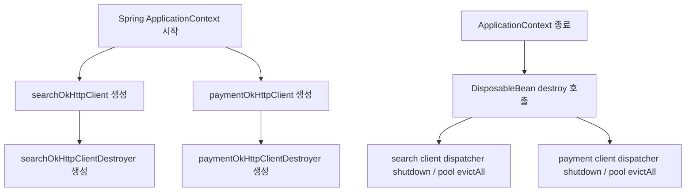
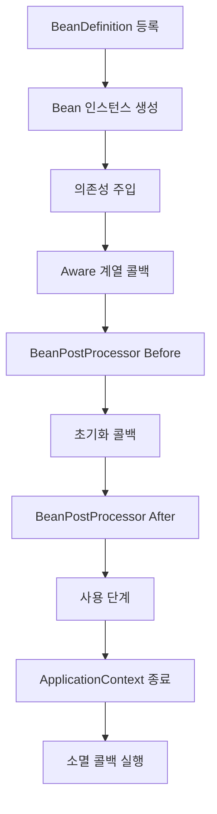

## 1. Sample Source
```java
@Configuration
public class OkHttpConfig {

    // ==========================================
    // 1. 검색 도메인용 클라이언트 및 종료 로직
    // ==========================================
    
    @Bean(name = "searchOkHttpClient")
    public OkHttpClient searchOkHttpClient() {
        return new OkHttpClient.Builder()
            .connectTimeout(3, TimeUnit.SECONDS)
            .build();
    }

    @Bean
    public DisposableBean searchOkHttpClientDestroyer(
            @Qualifier("searchOkHttpClient") OkHttpClient client) {
        return () -> {
            System.out.println("[Search] 클라이언트 자원을 해제합니다.");
            client.dispatcher().executorService().shutdown();
            client.connectionPool().evictAll();
        };
    }

    // ==========================================
    // 2. 결제 도메인용 클라이언트 및 종료 로직
    // ==========================================
    
    @Bean(name = "paymentOkHttpClient")
    public OkHttpClient paymentOkHttpClient() {
        return new OkHttpClient.Builder()
            .connectTimeout(10, TimeUnit.SECONDS) // 결제는 타임아웃을 길게
            .build();
    }

    @Bean
    public DisposableBean paymentOkHttpClientDestroyer(
            @Qualifier("paymentOkHttpClient") OkHttpClient client) {
        return () -> {
            System.out.println("[Payment] 클라이언트 자원을 해제합니다.");
            client.dispatcher().executorService().shutdown();
            client.connectionPool().evictAll();
        };
    }
}

```

### 1-1. 결론

제시한 코드는 **Spring Bean LifeCycle 기준으로 정상 동작 가능**합니다. `searchOkHttpClient`, `paymentOkHttpClient`가 각각 Spring Singleton Bean으로 생성되고, 별도의 `DisposableBean` Bean이 종료 시점에 각 `OkHttpClient`의 `dispatcher().executorService().shutdown()`과 `connectionPool().evictAll()`을 호출하는 구조입니다.  
다만 실무 기준으로는 아래 3가지를 보완하는 것이 좋습니다.

1. `OkHttpClient`에 `readTimeout`, `writeTimeout`, `callTimeout`, `ConnectionPool`을 명시
2. `System.out.println` 대신 logger 사용
3. `DisposableBean`을 별도 Bean으로 두는 방식보다 **관리 전용 Bean 또는 Wrapper Bean**으로 묶는 방식이 더 명확

---

### 1-2. `DisposableBean` 설명

`DisposableBean`은 Spring Bean이 소멸될 때 호출되는 콜백 인터페이스입니다. Spring 공식 Javadoc은 `DisposableBean`을 “소멸 시 리소스를 해제하고자 하는 Bean이 구현하는 인터페이스”로 설명하며, `BeanFactory`가 Bean 소멸 시 `destroy()`를 호출한다고 설명합니다. ([Home](https://docs.spring.io/spring-framework/docs/current/javadoc-api/org/springframework/beans/factory/DisposableBean.html?utm_source=chatgpt.com "DisposableBean (Spring Framework 7.0.7 API)"))

```java
public interface DisposableBean {
    void destroy() throws Exception;
}
```

즉, Spring 컨테이너가 종료될 때 다음과 같은 리소스 정리에 사용할 수 있습니다.
- Thread pool 종료
- Connection pool 정리
- File handle close
- Socket close
- Cache close
- 외부 client 종료

---

### 1-3. 현재 코드의 동작 여부

#### 1-3-1. Bean 생성 흐름

```java
@Bean(name = "searchOkHttpClient")
public OkHttpClient searchOkHttpClient() {
    return new OkHttpClient.Builder()
        .connectTimeout(3, TimeUnit.SECONDS)
        .build();
}
```

위 메서드는 `searchOkHttpClient`라는 이름의 `OkHttpClient` Bean을 생성합니다.

```java
@Bean
public DisposableBean searchOkHttpClientDestroyer(
        @Qualifier("searchOkHttpClient") OkHttpClient client) {
    return () -> {
        client.dispatcher().executorService().shutdown();
        client.connectionPool().evictAll();
    };
}
```

이 메서드는 `searchOkHttpClient` Bean을 주입받아, Spring 종료 시 실행될 `DisposableBean` Bean을 하나 더 등록합니다.  
따라서 전체 구조는 다음과 같습니다.





---

### 1-4. Spring Bean LifeCycle 기반 설명

Spring Bean의 일반적인 생명주기는 다음 순서로 볼 수 있습니다.





## 2. `DisposableBean`은 위 흐름 중 **소멸 콜백 실행 단계**에 해당합니다.
Spring 공식 Reference 문서는 Bean lifecycle에 관여하려면 `InitializingBean`, `DisposableBean` 같은 인터페이스를 구현할 수 있다고 설명합니다. 다만 Spring 전용 인터페이스에 코드가 결합되므로, 일반적으로는 `@PreDestroy`나 `@Bean(destroyMethod=...)` 같은 방식을 더 선호할 수 있습니다. ([Home](https://docs.spring.io/spring-framework/reference/core/beans/factory-nature.html?utm_source=chatgpt.com "Customizing the Nature of a Bean :: Spring Framework"))

### 2-1. 현재 코드가 정상 종료되는 조건

현재 코드는 아래 조건에서는 정상적으로 자원 정리가 수행됩니다.

|조건|설명|
|---|---|
|Spring이 `OkHttpConfig`를 스캔함|`@Configuration`이 Root/ApplicationContext에 등록되어야 함|
|Bean scope가 singleton|기본값이 singleton이므로 문제 없음|
|ApplicationContext가 정상 종료됨|WAS undeploy, Spring context close 시 destroy 콜백 실행|
|해당 `OkHttpClient`가 Bean으로만 사용됨|코드 중간에서 별도 `new OkHttpClient()`를 만들지 않아야 함|
|종료 후 재사용 없음|shutdown 후 해당 client로 새 call을 만들면 실패 가능|
|OkHttp 공식 문서는 dispatcher의 executor service를 `shutdown()`하면 이후 해당 client의 future call이 거부된다고 설명합니다. 또한 connection pool은 `evictAll()`로 비울 수 있다고 설명합니다. ([Javadoc](https://www.javadoc.io/doc/com.squareup.okhttp3/okhttp/3.14.1/okhttp3/OkHttpClient.html?utm_source=chatgpt.com "OkHttpClient (OkHttp 3.14.1 API)"))||

---

### 2-2. 현재 코드의 문제 가능성

#### 2-2-1. `connectTimeout`만 설정되어 있음

현재 코드:

```java
new OkHttpClient.Builder()
    .connectTimeout(3, TimeUnit.SECONDS)
    .build();
```

`connectTimeout`은 TCP 연결 수립 시간 제한입니다. 하지만 실무 API 호출 장애는 연결 수립 이후에도 발생합니다.  
추가 권장:

```java
.readTimeout(5, TimeUnit.SECONDS)
.writeTimeout(5, TimeUnit.SECONDS)
.callTimeout(10, TimeUnit.SECONDS)
.connectionPool(new ConnectionPool(20, 120, TimeUnit.SECONDS))
.retryOnConnectionFailure(true)
```

`connectTimeout`만 있으면 API 서버가 연결은 받아놓고 응답을 늦게 주는 경우 `readTimeout` 기본값에 의존하게 됩니다. OkHttp Builder 문서에서는 `connectTimeout`, `readTimeout`, `writeTimeout` 등의 timeout을 별도로 제공합니다. ([Square](https://square.github.io/okhttp/3.x/okhttp/index.html?okhttp3%2FOkHttpClient.html=&utm_source=chatgpt.com "OkHttpClient (OkHttp 3.14.0 API)"))

#### 2-2-2. `ConnectionPool`이 명시되어 있지 않음

명시하지 않아도 OkHttp 기본 connection pool은 생성됩니다. 따라서 “pool이 없다”는 문제는 아닙니다.  
다만 현재 L4/Nginx idle timeout을 고려해야 하는 상황이라면 아래처럼 명시하는 것이 좋습니다.

```java
.connectionPool(new ConnectionPool(20, 120, TimeUnit.SECONDS))
```

이유:

- 기본 idle 유지 시간이 운영 L4 timeout보다 길 수 있음

- Nginx/L4가 먼저 idle socket을 끊으면 stale connection 재사용 가능성 증가

- 운영 장애 분석 시 설정값을 명확히 설명 가능

#### 2-2-3. 종료 Bean이 client Bean과 분리되어 있음

현재 구조는 동작합니다.  
하지만 `OkHttpClient` Bean과 `DisposableBean` Bean이 분리되어 있어서, 나중에 설정이 늘어나면 관리 포인트가 흩어질 수 있습니다.  
예:

```java
searchOkHttpClient
searchOkHttpClientDestroyer
paymentOkHttpClient
paymentOkHttpClientDestroyer
```

도메인이 늘어나면 종료 Bean도 계속 늘어납니다.

#### 2-2-4. 종료 순서 자체는 크게 문제 없음

## 3. `searchOkHttpClientDestroyer`는 `searchOkHttpClient`를 생성자 파라미터로 주입받으므로, Spring은 destroyer Bean을 만들기 전에 client Bean을 먼저 생성합니다. 일반적으로 Spring은 의존 관계를 고려하여 Bean을 생성하고, 종료 시에는 의존하는 Bean이 먼저 정리되는 방향으로 처리됩니다.
이 구조에서는 `searchOkHttpClientDestroyer`가 종료될 때 client를 정리합니다. 이후 client Bean 자체는 특별한 destroy method가 없으므로 별도 처리는 거의 없습니다.  
다만 중요한 점은 **종료 시점에 다른 Bean이 아직 해당 OkHttpClient를 사용 중이면 안 된다**는 것입니다. WAS 정상 종료라면 보통 요청 수신이 중단된 뒤 context가 내려가므로 큰 문제는 적습니다.

### 3-1. 현재 코드 검증 결과

|항목|판단|설명|
|---|---|---|
|컴파일|가능|import만 있으면 문제 없음|
|Bean 등록|가능|`@Configuration`, `@Bean`, `@Qualifier` 구조 정상|
|Qualifier 주입|정상|이름이 명확하므로 `searchOkHttpClient`, `paymentOkHttpClient` 구분 가능|
|종료 콜백|동작|`DisposableBean` Bean이 singleton으로 등록되어 종료 시 호출|
|OkHttp 자원 정리|부분 적절|dispatcher shutdown, connectionPool evictAll은 공식 문서 권장 방식|
|Cache 정리|미포함|OkHttp cache를 설정하지 않았다면 문제 없음|
|Timeout 설정|부족|`readTimeout`, `writeTimeout`, `callTimeout` 추가 권장|
|Pool 설정|부족|운영 timeout 기준으로 명시 권장|
|로그|개선 필요|`System.out.println` 대신 SLF4J 권장|

---

### 3-2. 현재 코드의 실질적 동작 예

Spring 컨테이너 시작 시:

```text
1. OkHttpConfig 등록
2. searchOkHttpClient Bean 생성
3. searchOkHttpClientDestroyer Bean 생성
4. paymentOkHttpClient Bean 생성
5. paymentOkHttpClientDestroyer Bean 생성
6. 서비스 Bean에서 @Qualifier로 필요한 OkHttpClient 사용
```

Spring 컨테이너 종료 시:

```text
1. searchOkHttpClientDestroyer.destroy() 호출
2. searchOkHttpClient dispatcher shutdown
3. searchOkHttpClient connectionPool evictAll
4. paymentOkHttpClientDestroyer.destroy() 호출
5. paymentOkHttpClient dispatcher shutdown
6. paymentOkHttpClient connectionPool evictAll
```

## 4. 실제 종료 순서는 Bean 생성/의존 관계에 따라 달라질 수 있지만, 각 destroyer가 자기 client를 참조하고 있으므로 기본 구조는 안전한 편입니다.

### 4-1. 실무 개선안 1: 현재 구조 유지 + 설정 보강

현재 구조를 최대한 유지한다면 아래처럼 수정하는 것이 좋습니다.

```java
@Configuration
public class OkHttpConfig {
    private static final Logger log = LoggerFactory.getLogger(OkHttpConfig.class);
    @Bean(name = "searchOkHttpClient")
    public OkHttpClient searchOkHttpClient() {
        return new OkHttpClient.Builder()
            .connectionPool(new ConnectionPool(20, 120, TimeUnit.SECONDS))
            .connectTimeout(3, TimeUnit.SECONDS)
            .readTimeout(5, TimeUnit.SECONDS)
            .writeTimeout(5, TimeUnit.SECONDS)
            .callTimeout(10, TimeUnit.SECONDS)
            .retryOnConnectionFailure(true)
            .build();
    }
    @Bean
    public DisposableBean searchOkHttpClientDestroyer(
            @Qualifier("searchOkHttpClient") OkHttpClient client) {
        return () -> {
            log.info("[Search] OkHttpClient resources are being released.");
            client.dispatcher().executorService().shutdown();
            client.connectionPool().evictAll();
            if (client.cache() != null) {
                client.cache().close();
            }
        };
    }
    @Bean(name = "paymentOkHttpClient")
    public OkHttpClient paymentOkHttpClient() {
        return new OkHttpClient.Builder()
            .connectionPool(new ConnectionPool(10, 120, TimeUnit.SECONDS))
            .connectTimeout(10, TimeUnit.SECONDS)
            .readTimeout(15, TimeUnit.SECONDS)
            .writeTimeout(15, TimeUnit.SECONDS)
            .callTimeout(30, TimeUnit.SECONDS)
            .retryOnConnectionFailure(false)
            .build();
    }
    @Bean
    public DisposableBean paymentOkHttpClientDestroyer(
            @Qualifier("paymentOkHttpClient") OkHttpClient client) {
        return () -> {
            log.info("[Payment] OkHttpClient resources are being released.");
            client.dispatcher().executorService().shutdown();
            client.connectionPool().evictAll();
            if (client.cache() != null) {
                client.cache().close();
            }
        };
    }
}
```

## 5. 결제 도메인에서 `retryOnConnectionFailure(false)`를 예시로 둔 이유는, 결제/주문/승인 API는 **네트워크 레벨 자동 재시도가 중복 처리 위험**을 만들 수 있기 때문입니다. 실제로는 PG/API의 idempotency key, 주문번호 중복 방지, API 명세에 따라 결정해야 합니다.

### 5-1. 실무 개선안 2: `@PreDestroy` 방식

`DisposableBean` 별도 Bean을 만들기보다 Config 클래스 안에서 보관 후 `@PreDestroy`로 정리할 수도 있습니다.

```java
@Configuration
public class OkHttpConfig {
    private static final Logger log = LoggerFactory.getLogger(OkHttpConfig.class);
    private OkHttpClient searchOkHttpClient;
    private OkHttpClient paymentOkHttpClient;
    @Bean(name = "searchOkHttpClient")
    public OkHttpClient searchOkHttpClient() {
        this.searchOkHttpClient = new OkHttpClient.Builder()
            .connectionPool(new ConnectionPool(20, 120, TimeUnit.SECONDS))
            .connectTimeout(3, TimeUnit.SECONDS)
            .readTimeout(5, TimeUnit.SECONDS)
            .writeTimeout(5, TimeUnit.SECONDS)
            .callTimeout(10, TimeUnit.SECONDS)
            .retryOnConnectionFailure(true)
            .build();
        return this.searchOkHttpClient;
    }
    @Bean(name = "paymentOkHttpClient")
    public OkHttpClient paymentOkHttpClient() {
        this.paymentOkHttpClient = new OkHttpClient.Builder()
            .connectionPool(new ConnectionPool(10, 120, TimeUnit.SECONDS))
            .connectTimeout(10, TimeUnit.SECONDS)
            .readTimeout(15, TimeUnit.SECONDS)
            .writeTimeout(15, TimeUnit.SECONDS)
            .callTimeout(30, TimeUnit.SECONDS)
            .retryOnConnectionFailure(false)
            .build();
        return this.paymentOkHttpClient;
    }
    @PreDestroy
    public void destroy() throws IOException {
        close("search", this.searchOkHttpClient);
        close("payment", this.paymentOkHttpClient);
    }
    private void close(String name, OkHttpClient client) throws IOException {
        if (client == null) {
            return;
        }
        log.info("[{}] OkHttpClient resources are being released.", name);
        client.dispatcher().executorService().shutdown();
        client.connectionPool().evictAll();
        if (client.cache() != null) {
            client.cache().close();
        }
    }
}
```

## 6. 이 방식은 코드가 짧고 직관적이지만, `@Configuration` 클래스가 여러 책임을 갖게 된다는 단점이 있습니다.

### 6-1. 실무 개선안 3: 가장 명확한 Wrapper Bean 방식

운영에서는 이 방식이 가장 관리하기 좋습니다.

```java
public class ManagedOkHttpClient implements DisposableBean {
    private final OkHttpClient client;
    private final String name;
    public ManagedOkHttpClient(String name, OkHttpClient client) {
        this.name = name;
        this.client = client;
    }
    public OkHttpClient getClient() {
        return client;
    }
    @Override
    public void destroy() throws Exception {
        client.dispatcher().executorService().shutdown();
        client.connectionPool().evictAll();
        if (client.cache() != null) {
            client.cache().close();
        }
    }
}
```

## 7. 다만 서비스에서 `OkHttpClient`를 바로 주입받고 싶다면 별도 어댑터가 필요해져서 코드가 다소 번거로울 수 있습니다. 현재 프로젝트에서는 **개선안 1**이 가장 적용 난이도가 낮습니다.

### 7-1. 현재 코드에 대한 최종 판단

현재 코드:

```java
@Bean
public DisposableBean searchOkHttpClientDestroyer(
        @Qualifier("searchOkHttpClient") OkHttpClient client) {
    return () -> {
        System.out.println("[Search] 클라이언트 자원을 해제합니다.");
        client.dispatcher().executorService().shutdown();
        client.connectionPool().evictAll();
    };
}
```

판단:

- **동작 가능**

- **Spring Bean LifeCycle상 소멸 콜백으로 실행됨**

- **OkHttp 공식 종료 방식과 방향이 맞음**

- **다만 운영 설정으로는 timeout/pool/log/cache close 보완 필요**  
    최소 보완 버전은 다음입니다.

```java
@Bean
public DisposableBean searchOkHttpClientDestroyer(
        @Qualifier("searchOkHttpClient") OkHttpClient client) {
    return () -> {
        log.info("[Search] OkHttpClient resources are being released.");
        client.dispatcher().executorService().shutdown();
        client.connectionPool().evictAll();
        if (client.cache() != null) {
            client.cache().close();
        }
    };
}
```

---

### 7-2. 반드시 같이 지켜야 할 사용부 원칙

종료 Bean을 아무리 잘 만들어도 호출부에서 `Response`를 닫지 않으면 `CLOSE-WAIT` 문제는 계속 발생할 수 있습니다.

```java
try (Response response = searchOkHttpClient.newCall(request).execute()) {
    String responseText = response.body() != null
        ? response.body().string()
        : "";
    // response 처리
}
```

## 8. OkHttp 종료 처리는 **애플리케이션 종료 시 리소스 정리**이고, `Response close`는 **매 요청마다 socket을 pool로 반환하기 위한 처리**입니다. 둘은 목적이 다릅니다.

### 8-1. 최종 정리

| 항목                   | 답변                                                                                                       |
| -------------------- | -------------------------------------------------------------------------------------------------------- |
| `DisposableBean`이란   | Spring Bean 소멸 시 `destroy()`를 호출받는 lifecycle callback                                                    |
| 현재 코드 동작 여부          | 정상 동작 가능                                                                                                 |
| Spring LifeCycle상 위치 | ApplicationContext 종료 시 singleton Bean 소멸 단계                                                             |
| OkHttp 종료 방식         | `dispatcher().executorService().shutdown()`, `connectionPool().evictAll()`, cache 사용 시 `cache().close()` |
| 현재 코드의 주요 부족점        | timeout 부족, pool 명시 없음, logger 미사용, cache close 없음                                                       |
| 실무 권장                | 현재 구조 유지하되 설정 보강                                                                                         |

- 가장 중요한 판단은 다음입니다.
```text
현재 DisposableBean 구조는 문제 없이 동작 가능한 구조다.
다만 이것은 애플리케이션 종료 시 정리 로직일 뿐,
요청 중 발생하는 CLOSE-WAIT 방지는 반드시 try-with-resources로 Response를 닫아야 한다.
```
<details>
  <summary>참고</summary>  
  <pre>
  </pre>
</details>
