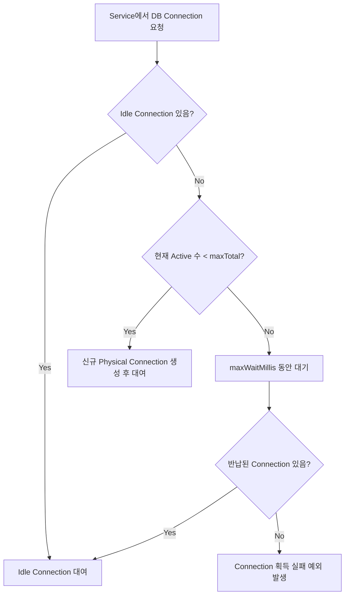
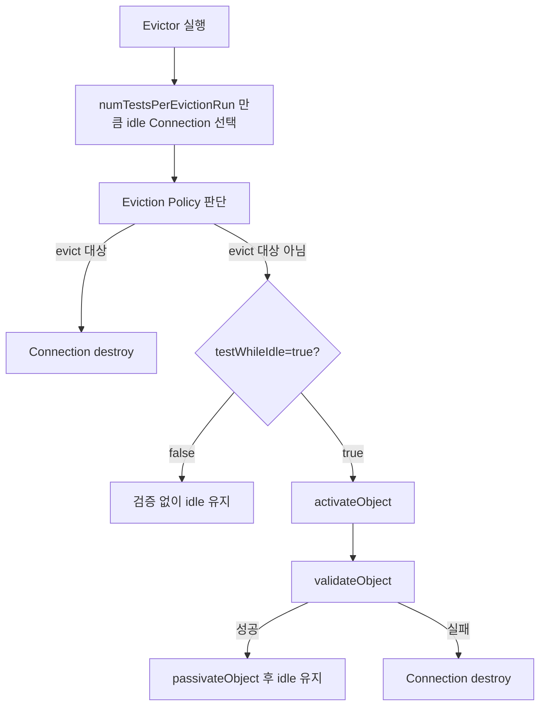
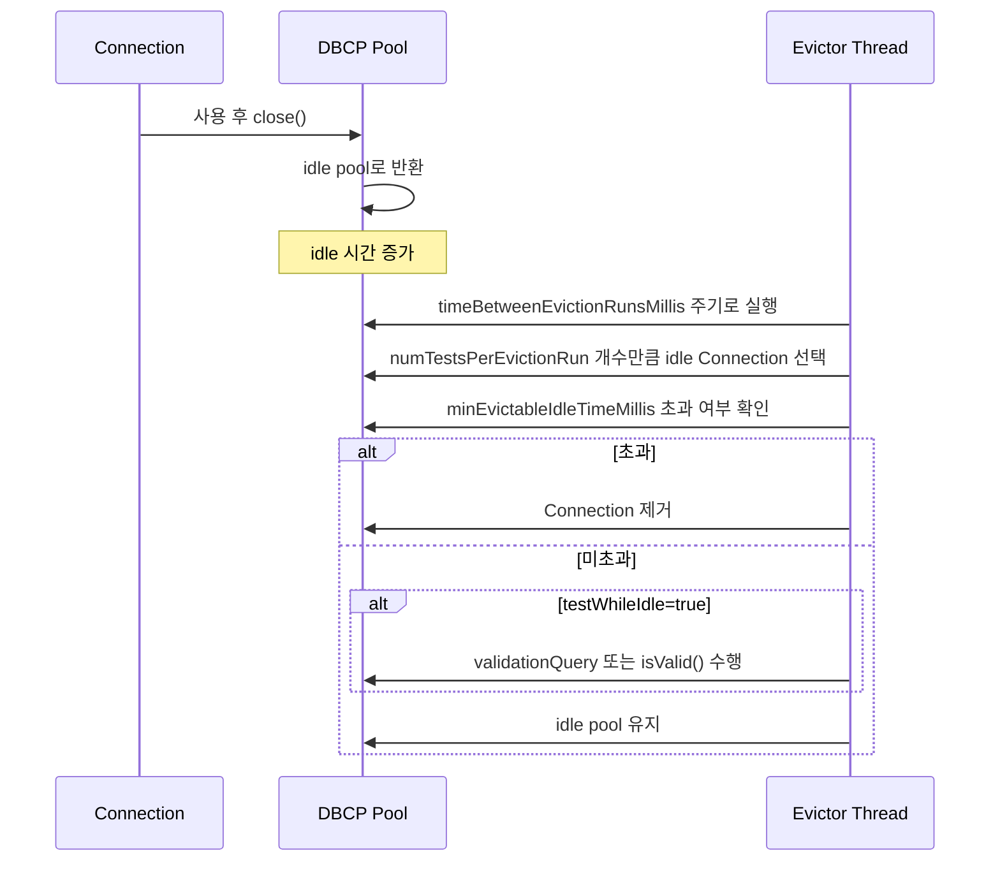
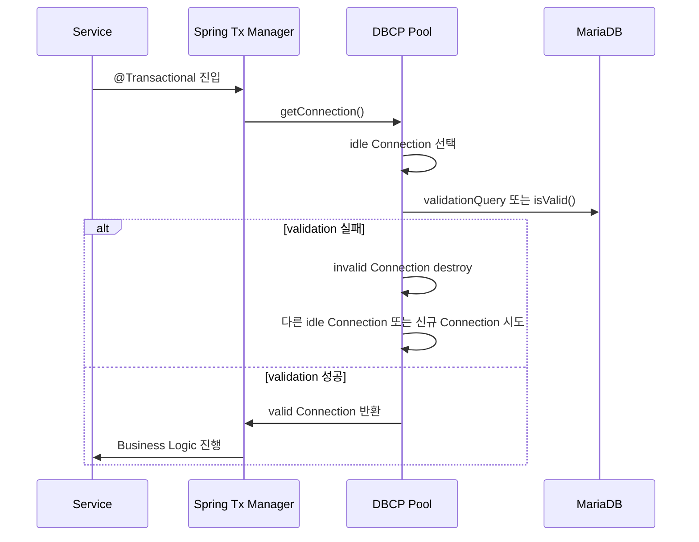
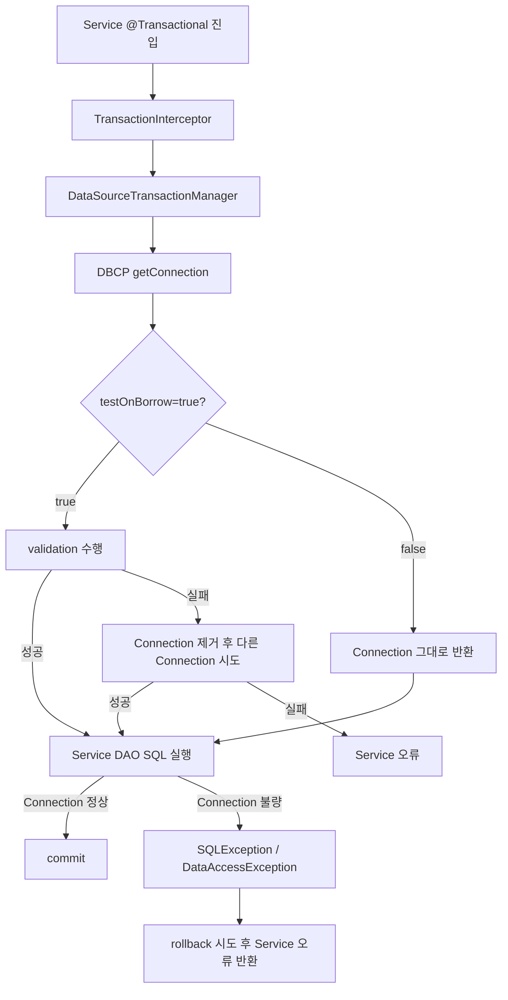

## 1. MaxTotal 의 정확한 의미
### 1-1. 결론

**정상적인 단일 DBCP2 `BasicDataSource` 기준으로는 `maxTotal` 이상의 Connection은 동시에 할당되지 않습니다.**  
`maxTotal`은 “해당 풀에서 동시에 할당 가능한 최대 active connection 수”이며, 음수로 설정하면 제한이 없어집니다. Apache Commons DBCP 공식 설정에서도 `maxTotal`은 기본값 8이고, 동시에 할당 가능한 active connection 최대치라고 설명합니다. ([Apache Commons](https://commons.apache.org/dbcp/configuration.html "BasicDataSource Configuration – Apache Commons DBCP"))

### 1-2. 동작 흐름





### 1-3. 핵심 정리

|구분|설명|
|---|---|
|`maxTotal=100`|해당 DBCP 풀에서 동시에 대여 가능한 Connection 최대 100개|
|100개 모두 사용 중|101번째 요청은 신규 Connection을 만들지 않고 대기|
|`maxWaitMillis` 초과|Connection 획득 실패 예외 발생|
|`maxTotal=-1`|제한 없음. 운영 환경에서는 위험|
|`maxIdle=20`|반납 후 idle 상태로 유지 가능한 최대 수. 초과 idle은 반환 시 닫힐 수 있음|
|`maxWaitMillis`는 사용 가능한 Connection이 없을 때 풀에서 기다리는 최대 시간이며, 시간이 지나면 예외를 던집니다. `maxIdle`은 idle 상태로 풀에 남아 있을 수 있는 Connection 수를 제한하며, 초과분은 반환 시 release될 수 있습니다. ([Apache Commons](https://commons.apache.org/dbcp/configuration.html "BasicDataSource Configuration – Apache Commons DBCP"))||

### 1-4. 단, “maxTotal 초과처럼 보이는” 경우

|관측 상황|실제 의미|
|---|---|
|DB `processlist`가 `maxTotal`보다 많음|여러 `DataSource`, 여러 WAS 인스턴스, 관리자 접속, 배치/별도 프로그램 접속 포함 가능|
|`dataSource`와 `dataSourceMail`이 각각 있음|각 풀마다 `maxTotal`이 별도 적용됨. 예: Main 100 + Mail 10 = 최대 110|
|Spring Root Context와 Servlet Context에 DataSource가 중복 생성됨|같은 설정처럼 보여도 실제 풀은 2개일 수 있음|
|OS `ss`에서 `TIME-WAIT`, `LAST-ACK`, `CLOSE-WAIT`까지 카운트|`maxTotal`은 현재 풀에서 대여 가능한 JDBC Connection 기준이지, 종료 중이거나 과거에 닫힌 TCP 소켓 상태까지 제한하는 값은 아님|
|`maxIdle`이 낮음|부하 후 반납된 Connection이 닫히고 곧바로 새로 열려 생성/종료가 빈번해질 수 있음|

### 1-5. KTR 프로젝트 기준 판단

현재처럼 Main DB `maxTotal=100`, Mail DB `maxTotal=10`이면 다음과 같이 봐야 합니다.

|항목|최대 Connection|
|---|--:|
|Main DB Pool|100|
|Mail DB Pool|10|
|동일 WAS 1대 기준 합계|최대 110|
|WAS 2대 운영 시|최대 220|
|따라서 DB 서버에서 100개를 초과하는 세션이 보인다고 해서 바로 DBCP `maxTotal` 위반은 아닙니다. **풀 단위, WAS 인스턴스 단위, DataSource 단위로 나눠서 봐야 합니다.**||

### 1-6. 확인 방법

```java
BasicDataSource ds = (BasicDataSource) dataSource;
log.info("maxTotal={}, numActive={}, numIdle={}",
    ds.getMaxTotal(),
    ds.getNumActive(),
    ds.getNumIdle()
);
```

운영 확인 기준은 다음이 가장 정확합니다.

|확인값|판단 기준|
|---|---|
|`numActive`|현재 Business Logic에 대여된 Connection 수|
|`numIdle`|풀 안에 놀고 있는 Connection 수|
|`numActive + numIdle`|해당 DBCP 풀 내부에서 관리 중인 Connection 규모|
|DB `processlist`|전체 DB 접속 세션이므로 다른 풀/다른 서버/툴 접속까지 포함|

### 1-7. 최종 답변

**예. 정상적인 단일 DBCP2 Pool에서는 `maxTotal` 이상의 Connection을 동시에 생성·대여하지 않습니다.**  
다만 DB나 OS에서 보이는 Connection 수가 `maxTotal`보다 많다면, 대부분은 **복수 DataSource, 복수 WAS, 중복 ApplicationContext, 별도 배치/관리자 접속, 또는 종료 중인 TCP 소켓 상태까지 함께 집계했기 때문**입니다.

## 2. 결론

`minEvictableIdleTimeMillis`는 **Connection이 idle 상태가 된 순간부터 계속 타이머처럼 상시 감시되는 값이 아닙니다.**  
실제 적용 시점은 **Idle Object Evictor가 주기적으로 실행될 때**이며, 그 실행 시점에 선택된 idle Connection에 대해서만 검사됩니다.

즉, 질문에 대한 답은 아래와 같습니다.

|질문|답변|
|---|---|
|`minEvictableIdleTimeMillis`는 언제 적용되는가?|`timeBetweenEvictionRunsMillis` 주기로 Evictor가 실행될 때 적용|
|모든 Connection에 상시 적용되는가?|아님|
|`numTestsPerEvictionRun` 개수만큼만 적용되는가?|기본적으로 맞음|
|`testWhileIdle=true`일 때만 적용되는가?|아님. Eviction 판단은 Evictor 실행 시 수행되고, `testWhileIdle`은 그 대상 Connection을 validation 할지 여부|
|즉시 제거되는가?|아님. 설정 시간 초과 후에도 Evictor 검사 대상이 되어야 제거 가능|

Apache DBCP 공식 설정 문서에서도 `timeBetweenEvictionRunsMillis`는 idle object evictor thread의 실행 간격이고, `numTestsPerEvictionRun`은 Evictor 1회 실행 시 검사할 object 수이며, `minEvictableIdleTimeMillis`는 idle object evictor에 의해 제거 대상이 될 수 있는 최소 idle 시간으로 설명합니다. ([Apache Commons](https://commons.apache.org/dbcp/configuration.html "BasicDataSource Configuration – Apache Commons DBCP"))

## 3. Evictor 과 testWhileIdle 의 관계
## 4. DBCP `testWhileIdle=true` 관련 옵션과 Evictor 관련 옵션 정리

### 4-1. 핵심 결론

|구분|핵심|
|---|---|
|`testWhileIdle=true`|Evictor가 검사 대상으로 선택한 idle Connection에 대해 validation 수행|
|Evictor 실행 조건|`timeBetweenEvictionRunsMillis > 0`이어야 함|
|검사 대상 수|Evictor 1회 실행 시 `numTestsPerEvictionRun` 기준|
|오래된 idle 제거|`minEvictableIdleTimeMillis`, `softMinEvictableIdleTimeMillis`가 담당|
|최소 idle 유지|`minIdle`은 Evictor 주기에서 보충 동작과 soft eviction 판단에 영향|
|abandoned 회수|`removeAbandonedOnMaintenance=true`이면 Evictor maintenance cycle 이후 active Connection 중 장기 미반납 Connection 회수 가능|

Apache DBCP 공식 설정상 `testWhileIdle`은 idle object evictor가 Connection을 검증할지 여부이며, `timeBetweenEvictionRunsMillis`가 0 이하이면 Evictor 자체가 실행되지 않습니다. ([Apache Commons](https://commons.apache.org/dbcp/configuration.html "BasicDataSource Configuration – Apache Commons DBCP"))

---

## 5. `testWhileIdle=true`와 직접 관계있는 옵션

### 5-1. 직접 관련 옵션 목록

|옵션|기본값|`testWhileIdle`과의 관계|설명|
|---|--:|---|---|
|`testWhileIdle`|`false`|기준 옵션|Evictor가 선택한 idle Connection을 validation 할지 결정|
|`timeBetweenEvictionRunsMillis`|`-1`|필수|Evictor 실행 주기. 0 이하이면 Evictor 미실행|
|`numTestsPerEvictionRun`|`3`|검사 범위 결정|Evictor 1회 실행 시 몇 개의 idle Connection을 검사할지 결정|
|`validationQuery`|미설정|validation 방식 결정|설정 시 해당 SELECT SQL로 검증, 미설정 시 JDBC `Connection.isValid()` 사용|
|`validationQueryTimeout`|제한 없음|validation 지연 방지|validation query의 Statement timeout 초 단위 설정|
|`fastFailValidation`|`false`|validation 실패 최적화|fatal SQL 상태가 기록된 Connection은 실제 validation query/isValid 호출 없이 빠르게 실패 처리 가능|
|`disconnectionSqlCodes`|`null`|fast fail 판정 보정|fatal disconnect로 볼 SQLState 목록 지정|
|`disconnectionIgnoreSqlCodes`|`null`|fast fail 판정 제외|fatal disconnect 판정에서 제외할 SQLState 목록 지정|
|`maxConnLifetimeMillis`|`-1`|validation 시 만료 판정 가능|Connection 최대 수명 초과 시 activation/passivation/validation 과정에서 실패 처리|
|`logExpiredConnections`|`true`|만료 로그|`maxConnLifetimeMillis` 초과로 닫히는 Connection 로그 출력 여부|

DBCP 문서 기준 `validationQuery`는 지정된 경우 Connection 검증용 SELECT SQL로 사용되고, 지정하지 않으면 `isValid()`가 사용됩니다. `validationQueryTimeout`은 validation query에 대한 Statement timeout으로 적용됩니다. ([Apache Commons](https://commons.apache.org/dbcp/configuration.html "BasicDataSource Configuration – Apache Commons DBCP"))

### 5-2. 동작 순서





Pool2 `GenericObjectPool` 구현에서도 Evictor는 `getNumTests()`만큼 idle object를 순회하고, eviction 대상이 아닌 경우에만 `testWhileIdle` 여부를 확인한 뒤 `activateObject → validateObject → passivateObject` 흐름을 수행합니다. ([Apache Commons](https://commons.apache.org/proper/commons-pool/apidocs/src-html/org/apache/commons/pool2/impl/GenericObjectPool.html "Source code"))

---

## 6. `testWhileIdle=true`와 관련 있지만, 혼동하면 안 되는 옵션

|옵션|`testWhileIdle`과의 관계|차이점|
|---|---|---|
|`testOnCreate`|같은 validation 계열|Connection 생성 직후 검증|
|`testOnBorrow`|같은 validation 계열|애플리케이션이 `getConnection()`으로 빌릴 때 검증|
|`testOnReturn`|같은 validation 계열|애플리케이션이 `close()`로 Pool에 반납할 때 검증|
|`testWhileIdle`|Evictor validation|애플리케이션 요청과 무관하게 Evictor가 idle Connection 검증|

DBCP 공식 문서상 `testOnCreate`, `testOnBorrow`, `testOnReturn`, `testWhileIdle`은 모두 validation 관련 옵션이지만 실행 시점이 다릅니다. `testWhileIdle`은 idle object evictor에 의해 검증된다는 점이 핵심 차이입니다. ([Apache Commons](https://commons.apache.org/dbcp/configuration.html "BasicDataSource Configuration – Apache Commons DBCP"))

---

## 7. `testWhileIdle`과 무관하게 Evictor 자체와 관계있는 옵션

### 7-1. Evictor 실행/검사 범위 옵션

|옵션|기본값|Evictor와의 관계|설명|
|---|--:|---|---|
|`timeBetweenEvictionRunsMillis`|`-1`|Evictor 실행 여부/주기|양수일 때만 Evictor Thread 실행|
|`numTestsPerEvictionRun`|`3`|1회 검사 수|한 번의 Evictor 실행에서 검사할 idle Connection 수|
|`lifo`|`true`|검사/borrow 순서 영향|idle pool에서 최근 반납 Connection 우선 사용 여부. Evictor 순회와 borrow 패턴에 간접 영향|
|`evictionPolicyClassName`|기본 정책|제거 판단 정책|idle 제거 정책 클래스를 커스터마이징할 때 사용|
|`minEvictableIdleTimeMillis`|30분|hard eviction|idle 시간이 이 값을 넘으면 `minIdle` 고려 없이 제거 대상|
|`softMinEvictableIdleTimeMillis`|`-1`|soft eviction|idle 시간이 이 값을 넘고, `minIdle` 초과분일 때 제거 대상|
|`minIdle`|`0`|최소 idle 유지|Evictor 주기에서 idle Connection 보충 및 soft eviction 판단에 영향|

DBCP 공식 문서는 `numTestsPerEvictionRun`을 Evictor 1회 실행 시 검사할 object 수, `minEvictableIdleTimeMillis`를 Evictor에 의해 제거 가능해지는 최소 idle 시간으로 설명합니다. `softMinEvictableIdleTimeMillis`는 `minIdle` 유지 조건을 추가로 고려합니다. ([Apache Commons](https://commons.apache.org/dbcp/configuration.html "BasicDataSource Configuration – Apache Commons DBCP"))

### 7-2. Evictor와 abandoned Connection 회수 관련 옵션

|옵션|기본값|Evictor와의 관계|설명|
|---|--:|---|---|
|`removeAbandonedOnMaintenance`|`false`|Evictor maintenance cycle 이후 실행|장시간 반납되지 않은 active Connection 회수|
|`removeAbandonedTimeout`|`300초`|회수 기준 시간|이 시간 이상 사용 흔적이 없으면 abandoned 후보|
|`logAbandoned`|`false`|진단용|abandoned Connection/Statement stack trace 로깅|
|`abandonedUsageTracking`|`false`|진단용|Connection 메소드 호출마다 stack trace 기록. 부하 큼|

`removeAbandonedOnMaintenance=true`는 Evictor의 maintenance cycle에서 동작하며, `timeBetweenEvictionRunsMillis`가 양수로 설정되어 maintenance가 활성화되어야 효과가 있습니다. DBCP 문서도 이 옵션은 eviction 종료 후 동작한다고 설명합니다. ([Apache Commons](https://commons.apache.org/dbcp/configuration.html "BasicDataSource Configuration – Apache Commons DBCP"))

---

## 8. Evictor 1회 실행 시 내부 판단 구조

|단계|관련 옵션|설명|
|--:|---|---|
|1|`timeBetweenEvictionRunsMillis`|Evictor Thread 실행|
|2|`numTestsPerEvictionRun`|검사할 idle Connection 수 산정|
|3|`minEvictableIdleTimeMillis`|hard idle timeout 초과 여부 판단|
|4|`softMinEvictableIdleTimeMillis`, `minIdle`|soft idle timeout 및 최소 idle 유지 조건 판단|
|5|`testWhileIdle`|제거 대상이 아닌 idle Connection을 validation 할지 결정|
|6|`validationQuery`, `validationQueryTimeout`|실제 DB validation 수행|
|7|`removeAbandonedOnMaintenance`|Eviction 종료 후 abandoned active Connection 회수 가능|
|8|`minIdle`|필요 시 idle Connection 보충|

Pool2 구현 기준 `getNumTests()`는 `numTestsPerEvictionRun >= 0`이면 `min(numTestsPerEvictionRun, idleObjects.size())`를 사용하고, 음수이면 idle 수를 절댓값으로 나눈 개수를 검사합니다. 예를 들어 `-1`이면 사실상 전체 idle Connection 검사 효과가 납니다. ([Apache Commons](https://commons.apache.org/proper/commons-pool/apidocs/src-html/org/apache/commons/pool2/impl/GenericObjectPool.html "Source code"))

---

## 9. 26_KTR 기준 옵션 분류표

### 9-1. `testWhileIdle=true`를 켰을 때 반드시 같이 봐야 하는 설정

|우선순위|옵션|권장 확인|
|--:|---|---|
|1|`timeBetweenEvictionRunsMillis`|양수인지 확인. 0 이하이면 `testWhileIdle=true`여도 Evictor 미실행|
|2|`numTestsPerEvictionRun`|idle Connection 수 대비 너무 작지 않은지 확인|
|3|`validationQuery`|MariaDB 기준 보통 `SELECT 1` 사용 가능|
|4|`validationQueryTimeout`|2~3초 수준 권장. 무제한 방치 금지|
|5|`minEvictableIdleTimeMillis`|DB `wait_timeout`, L4 timeout보다 짧게 설정 검토|
|6|`softMinEvictableIdleTimeMillis`|`minIdle`을 유지하면서 오래된 idle만 줄이고 싶을 때 검토|
|7|`fastFailValidation`|빈번한 stale/fatal SQLState 발생 시 검토|
|8|`maxConnLifetimeMillis`|DB/L4/방화벽의 장기 연결 강제 종료 정책이 있으면 검토|

### 9-2. `testWhileIdle`과 무관하지만 Evictor에 중요한 설정

|옵션|영향|
|---|---|
|`timeBetweenEvictionRunsMillis`|Evictor 실행 자체를 결정|
|`numTestsPerEvictionRun`|Evictor 부하와 stale Connection 제거 지연 시간 결정|
|`minEvictableIdleTimeMillis`|idle Connection hard 제거 기준|
|`softMinEvictableIdleTimeMillis`|`minIdle`을 고려한 soft 제거 기준|
|`minIdle`|Evictor 실행 시 최소 idle 보충 및 soft eviction 판단|
|`evictionPolicyClassName`|제거 정책 자체 변경|
|`removeAbandonedOnMaintenance`|Evictor maintenance cycle에서 active 누수 Connection 회수|
|`removeAbandonedTimeout`|abandoned Connection 판단 시간|
|`logAbandoned`|누수 추적 로그|
|`abandonedUsageTracking`|누수 추적 정밀도 증가, 성능 부하 증가|

---

## 10. 설정 예시

```xml
<bean id="dataSource" class="org.apache.commons.dbcp2.BasicDataSource" destroy-method="close">
    <property name="driverClassName" value="org.mariadb.jdbc.Driver"/>
    <property name="url" value="${jdbc.url}"/>
    <property name="username" value="${jdbc.username}"/>
    <property name="password" value="${jdbc.password}"/>
    <property name="initialSize" value="10"/>
    <property name="maxTotal" value="100"/>
    <property name="maxIdle" value="20"/>
    <property name="minIdle" value="10"/>
    <property name="testWhileIdle" value="true"/>
    <property name="timeBetweenEvictionRunsMillis" value="90000"/>
    <property name="numTestsPerEvictionRun" value="20"/>
    <property name="minEvictableIdleTimeMillis" value="210000"/>
    <property name="validationQuery" value="SELECT 1"/>
    <property name="validationQueryTimeout" value="3"/>
    <property name="testOnBorrow" value="true"/>
    <property name="removeAbandonedOnMaintenance" value="false"/>
    <property name="removeAbandonedTimeout" value="300"/>
</bean>
```

---

## 11. 운영상 해석

|상황|해석|
|---|---|
|`testWhileIdle=true`, `timeBetweenEvictionRunsMillis=-1`|Evictor가 안 떠서 idle validation도 안 됨|
|`testWhileIdle=true`, `numTestsPerEvictionRun=3`, idle 100개|한 번에 3개만 검증하므로 전체 순회가 매우 느림|
|`minEvictableIdleTimeMillis=210000`|210초 후 즉시 제거가 아니라 Evictor 검사 대상이 되어야 제거|
|`softMinEvictableIdleTimeMillis` 사용|`minIdle` 이하로 줄이지 않으려는 목적에 적합|
|`removeAbandonedOnMaintenance=true`|idle Connection이 아니라 active 상태로 빌려간 뒤 반납 안 한 Connection 회수 목적|
|`validationQueryTimeout` 미설정|DB 장애 시 Evictor validation이 길게 지연될 수 있음|
|`numTestsPerEvictionRun=-1`|전체 idle 검사 효과는 있지만 validation 부하 증가 가능|

---

## 12. 최종 요약

`testWhileIdle=true`와 직접 관계있는 핵심 옵션은 `timeBetweenEvictionRunsMillis`, `numTestsPerEvictionRun`, `validationQuery`, `validationQueryTimeout`, `fastFailValidation`, `disconnectionSqlCodes`, `maxConnLifetimeMillis`입니다.

반면 `testWhileIdle`과 무관하게 Evictor 자체에 영향을 주는 옵션은 `timeBetweenEvictionRunsMillis`, `numTestsPerEvictionRun`, `minEvictableIdleTimeMillis`, `softMinEvictableIdleTimeMillis`, `minIdle`, `evictionPolicyClassName`, `removeAbandonedOnMaintenance` 계열입니다.

운영 기준으로는 아래 3개를 먼저 봐야 합니다.

```properties
testWhileIdle=true
timeBetweenEvictionRunsMillis=90000
numTestsPerEvictionRun=20
```

그 다음 DB/L4 timeout보다 먼저 stale Connection을 제거하려면 아래 값을 같이 조정해야 합니다.

```properties
minEvictableIdleTimeMillis=210000
validationQuery=SELECT 1
validationQueryTimeout=3
```

`testWhileIdle=true`는 “idle Connection을 전부 상시 검사”하는 설정이 아니라, **Evictor가 주기적으로 선택한 Connection에 대해서만 validation을 수행하게 하는 설정**입니다.

## 13. 동작 구조





## 14. 핵심 동작 방식

|설정|역할|
|---|---|
|`timeBetweenEvictionRunsMillis`|Evictor Thread 실행 주기. 0 이하이면 Evictor 미실행|
|`numTestsPerEvictionRun`|Evictor 1회 실행 시 검사할 idle Connection 수|
|`minEvictableIdleTimeMillis`|해당 idle Connection이 이 시간 이상 idle이면 제거 대상|
|`testWhileIdle`|Evictor 검사 대상 Connection에 대해 유효성 검증을 수행할지 여부|
|`validationQuery` / `isValid()`|`testWhileIdle=true`일 때 실제 DB 연결 정상 여부 확인|

Apache Pool2의 `GenericObjectPool` 소스에서도 Evictor는 `getNumTests()` 결과만큼 반복하면서 idle object를 검사합니다. `numTestsPerEvictionRun >= 0`이면 `min(numTestsPerEvictionRun, idleObjects.size())`만 검사합니다. ([Apache Commons](https://commons.apache.org/proper/commons-pool/apidocs/src-html/org/apache/commons/pool2/impl/GenericObjectPool.html "Source code"))

## 15. 예시

현재 설정이 아래와 같다고 가정합니다.

```properties
timeBetweenEvictionRunsMillis=90000
numTestsPerEvictionRun=20
minEvictableIdleTimeMillis=210000
testWhileIdle=true
```

idle Connection이 100개라면 Evictor는 다음처럼 동작합니다.

|시간|동작|
|--:|---|
|0초|Connection이 idle pool에 반환됨|
|90초|Evictor 실행, idle Connection 중 최대 20개 검사|
|180초|다음 20개 검사|
|270초|다음 20개 검사. 이때 검사 대상 중 idle 210초 초과 Connection은 제거 가능|
|360초|다음 20개 검사|
|450초|다음 20개 검사|
|이후|다시 순환 검사|

따라서 `minEvictableIdleTimeMillis=210000`이라고 해서 **idle 210초가 되는 즉시 제거되는 것이 아닙니다.**  
`210초 이상 idle 상태`이고, 동시에 `Evictor의 이번 검사 대상`이 되어야 제거됩니다.

## 16. testWhileIdle=true와의 관계

`testWhileIdle=true`는 `minEvictableIdleTimeMillis`와 역할이 다릅니다.

|구분|설명|
|---|---|
|`minEvictableIdleTimeMillis`|오래 idle 상태인 Connection을 제거할지 판단|
|`testWhileIdle=true`|제거되지 않은 Connection이라도 DB 연결이 살아있는지 검증|
|둘의 공통점|둘 다 Evictor 실행 시점에 동작|
|차이점|eviction은 수명/idle 시간 판단, validation은 연결 정상 여부 판단|

Pool2 소스 기준으로도 Eviction Policy 판단이 먼저 수행되고, 제거되지 않은 경우 `testWhileIdle`이 true이면 `validateObject()`가 수행됩니다. ([Apache Commons](https://commons.apache.org/proper/commons-pool/apidocs/src-html/org/apache/commons/pool2/impl/GenericObjectPool.html "Source code"))

## 17. `numTestsPerEvictionRun`에 따른 실제 적용 범위

|설정값|의미|
|--:|---|
|`3`|Evictor 1회 실행 시 최대 3개 idle Connection 검사|
|`20`|Evictor 1회 실행 시 최대 20개 idle Connection 검사|
|`0`|실질적으로 검사하지 않음|
|`-1`|Pool2 기준 전체 idle Connection 검사|
|`-2`|대략 idle Connection의 1/2 검사|
|`-3`|대략 idle Connection의 1/3 검사|

Pool2의 `getNumTests()` 구현상 음수 값은 `idleObjects.size() / abs(numTestsPerEvictionRun)` 방식으로 계산됩니다. 따라서 `-1`이면 전체 idle Connection을 검사하는 효과가 있습니다. ([Apache Commons](https://commons.apache.org/proper/commons-pool/apidocs/src-html/org/apache/commons/pool2/impl/GenericObjectPool.html "Source code"))

## 18. 운영 관점 정리

|오해|실제|
|---|---|
|`minEvictableIdleTimeMillis`가 지나면 바로 close된다|Evictor 검사 대상이 되어야 close된다|
|모든 idle Connection을 매번 검사한다|`numTestsPerEvictionRun` 수만큼만 검사한다|
|`testWhileIdle=true`가 모든 idle Connection을 상시 검사한다|Evictor가 선택한 대상만 검사한다|
|`minIdle` 이하로는 절대 줄지 않는다|`minEvictableIdleTimeMillis`는 hard eviction 성격이라 `minIdle` 보호 조건이 없는 것으로 봐야 한다|
|`softMinEvictableIdleTimeMillis`와 동일하다|`softMinEvictableIdleTimeMillis`는 `minIdle` 유지 조건을 고려한다|

DBCP 문서도 `softMinEvictableIdleTimeMillis`는 `minIdle` 조건을 추가로 고려하지만, `minEvictableIdleTimeMillis`가 양수이면 먼저 비교된다고 설명합니다. ([Apache Commons](https://commons.apache.org/dbcp/configuration.html "BasicDataSource Configuration – Apache Commons DBCP"))

## 19. 26_KTR 기준 권장 해석

현재처럼 DB `wait_timeout`, L4 timeout, WAS idle Connection 문제가 있는 환경에서는 아래처럼 이해하는 것이 맞습니다.

```text
실제 제거 시점
= Connection idle 시작 시점
+ minEvictableIdleTimeMillis
+ Evictor 검사 순번 대기 시간
```

따라서 idle Connection이 많고 `numTestsPerEvictionRun`이 작으면, `minEvictableIdleTimeMillis`를 DB/L4 timeout보다 짧게 잡아도 실제 제거가 늦어질 수 있습니다.

예를 들어:

```properties
timeBetweenEvictionRunsMillis=120000
numTestsPerEvictionRun=8
idle connection=80
minEvictableIdleTimeMillis=200000
```

이면 전체 idle Connection 한 바퀴 검사에 대략:

```text
80 / 8 * 120초 = 1,200초 = 20분
```

이 걸릴 수 있습니다. 이 경우 일부 Connection은 `minEvictableIdleTimeMillis=200초`를 훨씬 초과해도 실제 제거가 늦어질 수 있습니다.

## 20. 권장 설정 방향

|목적|권장 방향|
|---|---|
|DB/L4 timeout 전에 stale Connection 제거|`minEvictableIdleTimeMillis`를 timeout보다 충분히 짧게 설정|
|Eviction 지연 방지|`numTestsPerEvictionRun`을 idle Connection 수 대비 너무 작게 두지 않음|
|DB validation 부하 방지|`testWhileIdle=true` 사용 시 `timeBetweenEvictionRunsMillis`와 `numTestsPerEvictionRun`을 과도하게 aggressive하게 잡지 않음|
|최소 idle 유지 필요|`softMinEvictableIdleTimeMillis`와 `minIdle` 관계 검토|
|장애 분석|JMX의 `NumIdle`, `NumActive`, `DestroyedByEvictorCount` 추적|

## 21. 최종 답변

`minEvictableIdleTimeMillis`는 **모든 Connection에 상시 적용되는 타이머가 아니라, Evictor가 실행될 때 검사 대상이 된 idle Connection에만 적용**됩니다.

따라서 `testWhileIdle=true`, `timeBetweenEvictionRunsMillis=90000`, `numTestsPerEvictionRun=20`이라면 Evictor가 90초마다 실행되며, 그때마다 idle Connection 중 최대 20개만 대상으로 `minEvictableIdleTimeMillis` 초과 여부와 validation 여부를 판단합니다.  
전체 idle Connection을 매번 검사하려면 `numTestsPerEvictionRun=-1`에 가까운 설정이 필요하지만, 운영 DB에는 validation 부하가 커질 수 있으므로 신중히 적용해야 합니다.

## 22. 결론

**DBCP 안에 유효하지 않은 Connection이 있더라도 Service가 항상 오류 나는 것은 아닙니다.**  
오류 발생 여부는 **그 Connection이 Business Logic에 전달되기 전에 검증되는지**에 따라 달라집니다.

|상황|Service 영향|
|---|---|
|`testOnBorrow=true`이고 borrow 시 validation 실패|DBCP가 해당 Connection을 버리고 다른 Connection을 시도하므로 Service는 보통 정상 수행|
|다른 valid idle Connection 또는 신규 Connection 생성 가능|Service 영향 없음, 단 borrow 지연 가능|
|모든 Connection이 invalid이고 신규 생성도 실패|Service 오류 발생|
|`testOnBorrow=false`이고 invalid Connection이 Service에 전달|Service 내부 SQL 실행 시 오류 발생 가능|
|`testWhileIdle=true`만 설정|일부 stale Connection 제거에는 도움되지만 Service 오류를 완전히 막지는 못함|
|실행 중 DB/L4/네트워크가 Connection을 끊음|이미 Service가 사용 중인 Connection이므로 SQL 오류 발생|

DBCP 공식 문서 기준 `testOnBorrow=true`이면 Connection을 pool에서 빌려주기 전에 검증하고, 검증 실패 시 pool에서 제거한 뒤 다른 Connection을 빌리려고 시도합니다. 반면 `testWhileIdle`은 Evictor가 idle Connection을 검증할 때만 동작합니다. ([Apache Commons](https://commons.apache.org/dbcp/configuration.html "BasicDataSource Configuration – Apache Commons DBCP"))

---

## 23. 가장 중요한 판단 기준

### 23-1. Service가 오류 없이 진행되는 경우

```properties
testOnBorrow=true
validationQuery=SELECT 1
validationQueryTimeout=3
```

이 경우 흐름은 아래와 같습니다.





이 경우 invalid Connection이 pool 안에 있어도 **Service에 전달되기 전에 걸러질 수 있습니다.**

Commons Pool 구현도 borrow 시 activation 실패 또는 `testOnBorrow=true` validation 실패가 발생하면 해당 object를 destroy하고 다음 idle object를 검사한다고 설명합니다. 유효한 object가 반환되거나 더 이상 사용할 idle object가 없을 때까지 이 과정이 반복됩니다. ([Apache Commons](https://commons.apache.org/proper/commons-pool/apidocs/src-html/org/apache/commons/pool2/impl/GenericObjectPool.html "Source code"))

---

## 24. Service가 오류를 반환하는 경우

### 24-1. `testOnBorrow=false`인 경우

```properties
testOnBorrow=false
testWhileIdle=true
```

이 설정은 위험할 수 있습니다.

`testWhileIdle=true`가 있더라도 Evictor가 아직 검사하지 않은 invalid Connection이 남아 있을 수 있습니다. 이 Connection이 그대로 Service에 전달되면, 실제 SQL 실행 시점에 오류가 납니다.

|발생 위치|가능 오류|
|---|---|
|트랜잭션 시작 시 `setAutoCommit(false)`|`SQLException`, `CannotCreateTransactionException` 가능|
|MyBatis/JdbcTemplate SQL 실행 시|`SQLNonTransientConnectionException`, `CommunicationsException`, `Connection reset`, `Broken pipe` 등|
|commit/rollback 시|commit 실패, rollback 실패, transaction rollback 처리|
|Spring 예외 변환 후|`DataAccessResourceFailureException`, `TransientDataAccessResourceException` 계열 가능|

즉, **DBCP가 사용 중인 Connection을 중간에 자동으로 새 Connection으로 바꿔서 같은 SQL을 재실행해주지는 않습니다.**

---

## 25. `testWhileIdle=true`만으로 충분하지 않은 이유

`testWhileIdle=true`는 Service 요청 시점이 아니라 **Evictor 실행 시점**에 idle Connection을 검사합니다.

|옵션|동작 시점|Service 보호 효과|
|---|---|---|
|`testWhileIdle=true`|Evictor가 idle Connection 검사할 때|사전 정리 효과|
|`testOnBorrow=true`|Service가 Connection을 빌릴 때|직접 보호 효과|
|`testOnReturn=true`|Service가 Connection을 반납할 때|다음 사용자 보호 효과|
|`validationQueryTimeout`|validation query 실행 시|검증 지연 방지|

따라서 운영 장애 방어 관점에서는 아래처럼 봐야 합니다.

```text
testWhileIdle=true
= idle pool을 깨끗하게 유지하려는 설정

testOnBorrow=true
= Business Logic에 invalid Connection이 전달되는 것을 막는 설정
```

DBCP 공식 문서에서도 `testWhileIdle`은 idle object evictor가 검증하는 옵션이고, `timeBetweenEvictionRunsMillis`가 0 이하이면 Evictor 자체가 실행되지 않습니다. ([Apache Commons](https://commons.apache.org/dbcp/configuration.html "BasicDataSource Configuration – Apache Commons DBCP"))

---

## 26. Spring `@Transactional` 환경에서의 실제 오류 흐름

Spring `DataSourceTransactionManager`는 JDBC `DataSource`에서 Connection을 얻어 현재 Thread에 바인딩합니다. Spring 문서에서도 `DataSourceTransactionManager`가 지정된 `DataSource`의 JDBC Connection을 현재 실행 Thread에 바인딩한다고 설명합니다. ([Home](https://docs.spring.io/spring-framework/docs/5.3.30/reference/html/data-access.html?utm_source=chatgpt.com "Data Access"))

### 26-1. 일반적인 `@Transactional REQUIRED` 흐름





---

## 27. 케이스별 정리

|케이스|설정/상황|DBCP 동작|Service 결과|
|---|---|---|---|
|1|idle Connection 1개 invalid, `testOnBorrow=true`, 다른 idle 정상|invalid 제거 후 정상 Connection 반환|정상 가능|
|2|idle Connection invalid, `testOnBorrow=true`, 신규 생성 가능|invalid 제거 후 신규 생성|정상 가능|
|3|idle Connection 전부 invalid, DB 접속 불가|validation 실패, 신규 생성 실패|오류|
|4|`testOnBorrow=false`, stale Connection borrow|검증 없이 전달|SQL 실행 시 오류 가능|
|5|`testWhileIdle=true`, Evictor가 미검사한 stale Connection 존재|stale Connection이 남아 있을 수 있음|borrow 시 오류 가능|
|6|Service 실행 중 DB가 Connection kill|이미 사용 중인 Connection 장애|현재 Service 오류|
|7|`testOnReturn=true`, Service 중 Connection 불량 발생|반납 시 validation 실패 후 제거 가능|현재 Service는 이미 오류, 다음 요청 보호|

---

## 28. 26_KTR 운영 기준 권장 설정

현재처럼 MariaDB, L4, JBoss, DBCP2 환경에서 `Connection reset`, `Software caused connection abort`, `Timeout waiting for idle object` 류 장애를 줄이려면 아래 조합이 안전합니다.

```properties
testOnBorrow=true
testWhileIdle=true
validationQuery=SELECT 1
validationQueryTimeout=3
timeBetweenEvictionRunsMillis=90000
numTestsPerEvictionRun=20
minEvictableIdleTimeMillis=210000
```

단, `testOnBorrow=true`는 매 borrow마다 validation이 들어가므로 트래픽이 매우 높은 시스템에서는 약간의 부하가 생깁니다. 그러나 **Service에 죽은 Connection이 전달되는 것을 막는 효과는 `testWhileIdle`보다 훨씬 직접적**입니다.

---

## 29. 최종 답변

DBCP 안에 유효하지 않은 Connection이 있을 때:

|질문|답|
|---|---|
|Service가 무조건 오류를 반환하는가?|아님|
|DBCP가 새 Connection을 얻어 Service가 정상 수행될 수 있는가?|`testOnBorrow=true`이고 다른 Connection 또는 신규 생성이 가능하면 가능|
|`testWhileIdle=true`만으로 충분한가?|부족함|
|invalid Connection이 Service에 전달되면?|SQL 실행 또는 트랜잭션 시작/commit 시 오류 발생|
|DBCP가 SQL 실패 후 자동 재시도하는가?|아님|
|Business Logic 재시도가 필요하면?|Service/DAO 상위에서 명시적 retry 설계 필요|

핵심은 아래 한 줄입니다.

```text
testOnBorrow=true이면 invalid Connection은 Service에 전달되기 전에 제거될 수 있고,
testOnBorrow=false이면 invalid Connection이 Service에 전달되어 Business Logic 오류로 이어질 수 있다.
```
<details>
  <summary>참고</summary>  
  <pre>
  </pre>
</details>
