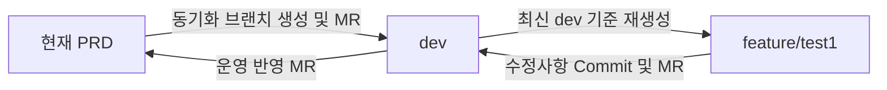

안녕하세요! 기능 개발부터 `dev` 환경 테스트까지 진행하시느라 정말 고생 많으셨습니다. 운영 배포를 앞두고 Git 브랜치 트리를 깔끔하게 정리하려는 고민은 시스템의 유지보수성을 높이는 매우 훌륭한 접근입니다.

말씀하신 상황처럼 **1) PRD의 최신 내용을 하위 브랜치들에 동기화**하고, **2) 개발했던 자잘한 커밋 이력들을 뭉쳐서 PRD에 '새로운 단일 커밋'으로 깔끔하게 반영**하고 싶으실 때는 `Rebase`와 `Squash Merge`를 조합하는 것이 실무에서 가장 권장되는 방식입니다.

저는 AI로서 직접 명령어를 실행해 드릴 수는 없지만, 가장 안전하고 명확하게 브랜치를 병합할 수 있는 가이드를 단계별로 정리해 드리겠습니다.

### 1. **최종 운영 반영을 위한 깔끔한 Git 병합 시나리오**

전체적인 흐름은 **[최신화] -> [feature 정리] -> [PRD 단일 커밋] -> [dev 동기화]** 순으로 진행됩니다.

#### 1-1. **Step 1: 원격 저장소 최신화**

가장 먼저 원격 저장소의 최신 상태를 로컬로 가져옵니다.

Bash

```
git fetch origin
```

#### 1-2. **Step 2: PRD의 최신 내용을 `feature/test1`에 반영하기 (Rebase)**

`feature/test1` 브랜치에 `PRD`의 최신 내용을 반영합니다. 이때 일반 `merge`를 사용하면 불필요한 병합 커밋(Merge commit)이 남아 지저분해지므로, `rebase`를 사용하여 히스토리를 한 줄로 평탄화하는 것이 좋습니다.

Bash

```
git checkout feature/test1
git rebase origin/PRD
```

> **💡 참고:** 만약 여기서 충돌(Conflict)이 발생한다면, 충돌을 해결한 뒤 아래 명령어를 차례로 입력합니다.
> 
> `git add .` (수정된 파일 스테이징)
> 
> `git rebase --continue` (리베이스 계속 진행)
> 
> _(주의: `git commit`을 새로 하시면 안 됩니다.)_

#### 1-3. **Step 3: `PRD` 브랜치에 '새로운 단일 커밋'으로 반영하기 (Squash Merge)**

개발 중 남긴 여러 개의 자잘한 커밋 내역(예: "오타 수정", "테스트 진행 중" 등)을 숨기고, 작업 내용을 **하나의 깔끔한 커밋**으로 만들어 PRD에 반영합니다.

Bash

```
git checkout PRD
git pull origin PRD

# --squash 옵션을 주면 feature/test1의 모든 변경사항을 가져와서 '스테이징(add)' 상태로만 만듭니다.
git merge --squash feature/test1

# 하나의 깔끔한 메시지로 운영 반영용 새 커밋을 생성합니다.
git commit -m "feat: [기능명] 운영 배포 최종 반영"

# 원격 PRD에 푸시
git push origin PRD
```

#### 1-4. **Step 4: `PRD`의 최종 상태를 `dev` 브랜치에 동기화**

이제 `dev` 브랜치에도 `PRD`에 반영된 내용(방금 만든 깔끔한 커밋 포함)을 동일하게 맞춰주어, 다음 개발 시에도 문제가 없도록 세팅합니다.

Bash

```
git checkout dev
git pull origin dev

# PRD의 최신 상태를 dev로 병합
git merge origin/PRD

# 원격 dev에 푸시
git push origin dev
```

### 2. **요약 및 팁**

- `rebase`는 내 작업물을 최신 PRD 기준선 위로 깔끔하게 옮겨 붙일 때 사용합니다.

- `merge --squash`는 여러 개의 작업 커밋을 하나로 압축하여 새로운 커밋을 생성할 때 사용합니다. (요청하신 "가장 깔끔하게 새로 commit 하는 방법"의 핵심입니다.)

## 3. GPT

## 4. 권장 작업 구조

현재 조건에서는 다음 흐름이 가장 깔끔합니다.





핵심 원칙은 다음과 같습니다.

|구분|원칙|
|---|---|
|PRD 최신 내용 반영|`PRD`를 직접 `dev`에 Push하지 않고 동기화 브랜치를 통해 MR|
|feature 기준 브랜치|PRD가 반영된 최신 `dev`에서 새로 생성|
|기능 개발 반영|`feature/test1 → dev` MR|
|운영 반영|`dev → PRD` MR|
|feature 원격 브랜치|MR 완료 시 삭제|
|운영 MR Squash|가급적 사용하지 않음|
|feature MR Squash|작업 Commit이 여러 개면 사용 가능|

## 5. 전제 상태

현재 상태는 대략 다음과 같습니다.

```text
PRD
 └─ 운영 중 추가된 최신 변경사항 존재 가능
dev
 └─ 이전 feature/test1 작업이 MR로 이미 반영됨
feature/test1
 └─ 원격 브랜치는 MR 완료 시 삭제됨
```

따라서 기존 원격 `feature/test1`을 복구해서 사용하는 것보다, **PRD가 반영된 최신 dev 기준으로 같은 이름의 브랜치를 새로 생성하는 것이 안전합니다.**

## 6. 전체 절차

### 6-1. 1단계: 현재 PRD와 dev 차이 확인

먼저 로컬 브랜치를 변경하지 않고 원격 상태를 갱신합니다.

```bash
git fetch origin --prune
git status
git branch -vv
```

PRD에만 있고 dev에는 없는 Commit을 확인합니다.

```bash
git log --oneline origin/dev..origin/PRD
```

dev에만 있고 PRD에는 없는 Commit을 확인합니다.

```bash
git log --oneline origin/PRD..origin/dev
```

두 브랜치의 전체 관계를 확인합니다.

```bash
git log --graph --oneline --decorate --all --max-count=100
```

최종 파일 내용 차이도 확인합니다.

```bash
git diff --name-status origin/PRD origin/dev
```

|명령어|의미|
|---|---|
|`origin/dev..origin/PRD`|PRD에만 있는 Commit|
|`origin/PRD..origin/dev`|dev에만 있는 Commit|
|`git diff origin/PRD origin/dev`|두 브랜치 최종 파일 내용 차이|

## 7. 2단계: PRD 내용을 dev에 반영

PRD 또는 dev 보호 브랜치에 직접 Push하지 않고 임시 동기화 브랜치를 사용합니다.

### 7-1. 최신 dev 기준 동기화 브랜치 생성

```bash
git switch -c sync/prd-to-dev origin/dev
```

현재 브랜치 구조:

```text
origin/dev
    └─ sync/prd-to-dev
```

### 7-2. PRD를 동기화 브랜치에 Merge

```bash
git merge --no-ff origin/PRD
```

충돌이 없으면 Merge Commit이 생성됩니다.  
충돌이 발생하면 다음 절차로 해결합니다.

```bash
git status
```

충돌 파일을 수정한 후:

```bash
git add <충돌해결파일>
git commit
```

충돌 해결 시 기준은 다음과 같습니다.

|대상|적용 기준|
|---|---|
|운영 환경 설정|PRD 기준 우선|
|기존 feature/test1 기능|dev에서 테스트 완료한 내용 유지|
|동일 소스 수정 충돌|PRD 최신 변경과 기능 수정이 모두 유지되도록 수동 병합|
|프로파일·URL·DB 설정|운영값이 dev에 그대로 덮어써지지 않도록 주의|
|특히 다음 파일은 단순히 PRD 버전을 선택하면 안 됩니다.||

```text
application-dev.properties
application-prd.properties
globals.properties
context-datasource.xml
log 설정
외부 API URL 설정
배포 서버별 설정
```

환경별 설정은 PRD 값을 dev에 덮어쓰는 것이 아니라, **PRD에서 발생한 소스 변경사항만 반영하고 dev 환경값은 유지**해야 합니다.

### 7-3. 동기화 결과 확인

```bash
git status
git log --graph --oneline --decorate --max-count=30
git diff --name-status origin/dev..HEAD
```

PRD에서 dev로 들어오는 변경사항만 확인하려면:

```bash
git diff --name-status origin/dev HEAD
```

빌드와 테스트도 실행합니다.

```bash
mvn clean test
```

프로젝트 정책에 따라:

```bash
mvn clean package
```

### 7-4. 동기화 브랜치 Push

```bash
git push -u origin sync/prd-to-dev
```

### 7-5. GitLab Merge Request 생성

|항목|값|
|---|---|
|Source branch|`sync/prd-to-dev`|
|Target branch|`dev`|
|Squash commits|사용하지 않음 권장|
|Delete source branch|Merge 후 삭제|
|목적|현재 PRD 변경사항을 dev에 동기화|
|MR 제목 예:||

```text
sync: PRD 변경사항을 dev에 동기화
```

MR 설명 예:

```text
- 현재 PRD 브랜치 변경사항을 dev 브랜치에 동기화
- 기존 dev 기능 변경사항 유지
- 환경별 설정 충돌 검토 완료
- 동기화 후 feature/test1 추가 수정 예정
```

### 7-6. 왜 Squash하지 않는가

`PRD`의 Commit 관계를 `dev`가 그대로 이어받아야 이후 `dev → PRD` MR의 변경 이력이 명확해집니다.  
동기화 MR을 Squash하면 PRD에 있던 변경사항과 동일한 내용이 dev에서 새로운 Commit ID로 만들어져 브랜치 관계가 복잡해질 수 있습니다.

## 8. 3단계: 최신 dev 로컬 반영

GitLab에서 `sync/prd-to-dev → dev` MR이 완료된 후 실행합니다.

```bash
git fetch origin --prune
git switch dev
git pull --ff-only origin dev
```

확인:

```bash
git log --graph --oneline --decorate --max-count=30
```

이 시점의 `dev`에는 다음 내용이 모두 있어야 합니다.

```text
기존 dev 변경사항
+ 기존 feature/test1 반영 내용
+ 최신 PRD 변경사항
```

## 9. 4단계: 기존 로컬 feature/test1 처리

원격 `feature/test1`은 이미 삭제되었더라도 로컬 브랜치는 남아 있을 수 있습니다.

### 9-1. 로컬 브랜치 존재 여부 확인

```bash
git branch --list feature/test1
```

### 9-2. 로컬 브랜치에 미반영 작업이 없는 경우

기존 로컬 브랜치를 삭제합니다.

```bash
git branch -D feature/test1
```

그리고 최신 dev 기준으로 다시 생성합니다.

```bash
git switch -c feature/test1 origin/dev
```

이 방법이 가장 깔끔합니다.

### 9-3. 로컬 feature/test1에 아직 저장하지 않은 작업이 있는 경우

먼저 기존 브랜치를 백업합니다.

```bash
git switch feature/test1
git status
git branch backup/feature-test1-before-sync
```

미Commit 변경사항이 있다면 Commit하거나 Stash합니다.

#### 9-3-1. 임시 Commit 방식

```bash
git add .
git commit -m "wip: feature/test1 동기화 전 임시 저장"
```

#### 9-3-2. Stash 방식

```bash
git stash push -u -m "feature/test1 동기화 전 임시 저장"
```

이후 최신 dev에서 feature 브랜치를 다시 생성합니다.

```bash
git switch dev
git branch -D feature/test1
git switch -c feature/test1 origin/dev
```

백업 브랜치에서 실제 추가 변경사항만 확인합니다.

```bash
git log --oneline origin/dev..backup/feature-test1-before-sync
```

동일한 변경사항이 이미 dev에 반영되었는지 검사하려면:

```bash
git cherry -v origin/dev backup/feature-test1-before-sync
```

결과 의미:

|표시|의미|
|---|---|
|`-`|동일하거나 동등한 변경사항이 이미 dev에 존재|
|`+`|dev에 없는 독립적인 변경사항|
|`+`로 표시된 Commit만 선별해서 반영합니다.||

```bash
git cherry-pick <필요한-commit-hash>
```

이전에 MR로 dev에 이미 반영된 Commit은 다시 Cherry-pick하면 안 됩니다.  
중복 코드나 충돌이 발생할 수 있습니다.

## 10. 5단계: 최신 dev 기준 feature/test1 생성

최종적으로 다음 상태여야 합니다.

```bash
git fetch origin --prune
git switch -c feature/test1 origin/dev
```

확인:

```bash
git status
git log --oneline --decorate --max-count=10
```

예상 결과:

```text
현재 브랜치: feature/test1
origin/dev와 동일한 상태
작업 트리 clean
```

이 구조에서는 `feature/test1`에 최신 PRD 내용이 직접 Merge된 것이 아니라, 다음 경로로 자연스럽게 포함됩니다.

```text
PRD
 → sync/prd-to-dev
 → dev
 → feature/test1
```

feature 브랜치에서 다시 `git merge origin/PRD`를 실행할 필요가 없습니다.  
오히려 중복 Merge 이력만 늘어날 수 있습니다.

## 11. 6단계: 수정사항 개발 및 Commit

소스를 수정한 후 변경 범위를 확인합니다.

```bash
git status
git diff
```

전체 파일을 무조건 Stage하기보다는 필요한 부분만 선택하는 것이 좋습니다.

```bash
git add -p
```

또는 파일 단위로 추가합니다.

```bash
git add src/main/java/...
git add src/main/resources/...
```

Stage 내용 확인:

```bash
git diff --cached
git diff --cached --name-status
```

Commit:

```bash
git commit -m "fix: test1 기능 운영 반영 보완"
```

상세 Commit 메시지 예:

```bash
git commit -m "fix(search): 상품 검색 기능 운영 반영 보완

- PRD 최신 소스 기준 충돌 내용 조정
- dev 테스트 중 발견된 오류 수정
- 운영 환경 적용을 위한 예외 처리 보완"
```

### 11-1. Commit 구성 권장

|상황|권장 방식|
|---|---|
|수정사항이 하나의 기능|Commit 1개|
|기능과 설정 변경이 분리됨|2개 Commit|
|중간 임시 Commit이 많음|feature MR에서 Squash|
|운영 장애 수정|원인과 수정 범위를 Commit 메시지에 명확히 기록|

## 12. 7단계: feature/test1을 dev에 반영

### 12-1. 원격 Push

```bash
git push -u origin feature/test1
```

### 12-2. GitLab Merge Request 생성

|항목|값|
|---|---|
|Source branch|`feature/test1`|
|Target branch|`dev`|
|Squash commits|여러 작업 Commit이면 사용 가능|
|Delete source branch|사용|
|Pipeline|빌드·테스트·SonarQube 확인|
|MR 제목 예:||

```text
fix: test1 기능 운영 반영 보완
```

MR에서 반드시 확인할 사항:

```text
Changes에 내가 수정한 파일만 포함되는가
PRD 동기화 파일이 기능 변경으로 다시 표시되지 않는가
환경 설정 파일이 의도치 않게 변경되지 않았는가
기존 dev의 다른 기능을 제거하지 않았는가
빌드 및 자동 테스트가 성공하는가
```

MR 완료 후 원격 `feature/test1`은 기존 방식대로 삭제합니다.

## 13. 8단계: dev 환경 테스트

feature MR이 완료되면 로컬 dev를 최신화합니다.

```bash
git fetch origin --prune
git switch dev
git pull --ff-only origin dev
```

dev 배포 및 테스트를 진행합니다.  
검증 대상:

|영역|확인 사항|
|---|---|
|기능 테스트|수정 기능 정상 동작|
|회귀 테스트|기존 기능 영향 여부|
|PRD 동기화 내용|운영 변경사항과 충돌 여부|
|환경 설정|dev 서버 설정 정상 유지|
|DB 변경|DDL·DML 적용 순서 및 호환성|
|외부 연계|API URL, 인증정보, Timeout|
|배포|빌드 산출물 및 정적 리소스 반영|

## 14. 9단계: dev와 PRD 차이 최종 확인

운영 MR 생성 전에 반드시 `dev`에 다른 개발자의 미완료 변경사항이 포함되어 있는지 확인해야 합니다.

```bash
git fetch origin --prune
git log --oneline origin/PRD..origin/dev
```

운영에 반영될 Commit 목록입니다.  
파일 단위 차이:

```bash
git diff --name-status origin/PRD...origin/dev
```

실제 최종 소스 차이:

```bash
git diff --name-status origin/PRD origin/dev
```

상세 확인:

```bash
git diff origin/PRD origin/dev
```

### 14-1. 가장 중요한 주의사항

`dev → PRD` MR은 `feature/test1`만 골라서 반영하는 것이 아닙니다.  
**PRD에 없는 dev의 모든 변경사항이 운영 반영 대상**이 됩니다.  
예:

```text
dev
 ├─ feature/test1
 ├─ feature/test2
 ├─ 다른 개발자의 테스트 기능
 └─ 임시 설정 변경
```

이 상태에서 `dev → PRD` MR을 생성하면 모두 PRD 반영 대상입니다.  
따라서 다음 조건 중 하나가 충족되어야 합니다.

|조건|판단|
|---|---|
|dev의 모든 변경사항이 운영 반영 가능|dev → PRD MR 진행|
|다른 기능이 있으나 Feature Flag로 비활성화|검토 후 진행 가능|
|다른 미완료 기능이 존재|운영 MR 진행 금지|
|임시 테스트 설정이 존재|제거 후 진행|
|운영 제외 대상 Commit 존재|dev 정리 후 진행|
|현재 정책이 반드시 `dev → PRD`라면 특정 기능만 선택적으로 운영 반영하는 것은 불가능합니다.||
|이 경우 dev 자체가 항상 운영 후보 상태로 관리되어야 합니다.||

## 15. 10단계: dev에서 PRD로 Merge Request

운영 반영 대상이 모두 정상임을 확인한 후 GitLab에서 MR을 생성합니다.

|항목|값|
|---|---|
|Source branch|`dev`|
|Target branch|`PRD`|
|Squash commits|사용하지 않음 권장|
|Delete source branch|사용하지 않음|
|Pipeline|운영 반영 전 전체 빌드 및 테스트|
|MR 제목 예:||

```text
release: test1 기능 운영 반영
```

MR 설명 예:

```text
### 반영 내용
- PRD 최신 변경사항 dev 동기화
- feature/test1 수정사항 반영
- dev 환경 기능 및 회귀 테스트 완료
### 확인 사항
- PRD 대비 dev 변경 Commit 검토 완료
- 타 기능 포함 여부 검토 완료
- 환경별 설정값 검토 완료
- 빌드 및 테스트 정상
```

### 15-1. dev → PRD에서 Squash를 권장하지 않는 이유

feature MR에서 이미 Commit이 정리되어 있는데 운영 MR에서 다시 Squash하면:

```text
dev의 Commit ID
≠
PRD의 Commit ID
```

동일한 코드가 서로 다른 Commit으로 관리될 수 있습니다.  
이로 인해 향후 다음 문제가 발생할 수 있습니다.

- PRD와 dev의 이력 비교가 어려움

- 동일 변경사항이 반복해서 MR에 표시될 가능성

- 장애 발생 시 Commit 추적 어려움

- Cherry-pick 및 Revert 대상 판단 어려움  
    따라서 권장 설정은 다음과 같습니다.  
    |MR 종류|Squash|  
    |---|---|  
    |`sync/prd-to-dev → dev`|사용하지 않음|  
    |`feature/test1 → dev`|필요한 경우 사용|  
    |`dev → PRD`|사용하지 않음|

## 16. 11단계: PRD MR의 Merge 방식

가장 이상적인 방식은 `dev`가 최신 PRD를 이미 포함하고 있는 상태에서 `dev → PRD`를 Fast-forward로 반영하는 것입니다.

```text
PRD ───────┐
           └─ dev 최신 Commit
```

운영 반영 후:

```text
PRD = dev와 동일한 Commit 이력
```

GitLab 프로젝트에서 가능하다면:

```text
Merge method: Fast-forward merge
Squash: 비활성화
```

가 가장 깔끔합니다.

### 16-1. Merge Commit 방식인 경우

GitLab 설정상 Merge Commit이 생성되면 운영 반영 후 PRD에 새로운 Merge Commit이 생깁니다.

```text
dev ──────────────── D
                      \
PRD ──────────────── M
```

소스 내용은 같아도 PRD의 Merge Commit `M`은 dev에 존재하지 않습니다.  
이 경우 다음 작업 시작 전 다시 한 번:

```text
PRD → sync/prd-to-dev → dev
```

동기화 절차를 수행하는 것이 좋습니다.

## 17. 최종 명령어 순서

### 17-1. PRD를 dev에 동기화

```bash
git fetch origin --prune
git switch -c sync/prd-to-dev origin/dev
git merge --no-ff origin/PRD
git push -u origin sync/prd-to-dev
```

GitLab:

```text
sync/prd-to-dev → dev MR
Squash 사용 안 함
Merge 후 source branch 삭제
```

### 17-2. 최신 dev 반영

```bash
git fetch origin --prune
git switch dev
git pull --ff-only origin dev
```

### 17-3. 기존 로컬 feature 삭제 후 재생성

```bash
git branch -D feature/test1
git switch -c feature/test1 origin/dev
```

### 17-4. 수정사항 Commit

```bash
git status
git add -p
git diff --cached
git commit -m "fix: test1 기능 운영 반영 보완"
git push -u origin feature/test1
```

GitLab:

```text
feature/test1 → dev MR
필요 시 Squash
Merge 후 feature/test1 삭제
```

### 17-5. dev 테스트 후 운영 반영 범위 확인

```bash
git fetch origin --prune
git log --oneline origin/PRD..origin/dev
git diff --name-status origin/PRD...origin/dev
git diff --name-status origin/PRD origin/dev
```

### 17-6. 운영 반영

GitLab:

```text
dev → PRD MR
Squash 사용 안 함
가능하면 Fast-forward Merge
dev 브랜치는 삭제하지 않음
```

## 18. 최종 권장 흐름

```text
1. origin/PRD 최신화
2. origin/dev 최신화
3. sync/prd-to-dev를 origin/dev에서 생성
4. origin/PRD를 sync/prd-to-dev에 Merge
5. sync/prd-to-dev → dev MR
6. 최신 origin/dev에서 feature/test1 신규 생성
7. 수정사항 Commit
8. feature/test1 → dev MR
9. dev 환경 테스트
10. PRD 대비 dev 전체 변경사항 확인
11. dev → PRD MR
12. 운영 반영 후 필요 시 PRD → dev 재동기화
```

가장 중요한 기준은 **feature/test1을 PRD에서 직접 만들지 않고, PRD가 동기화된 최신 dev에서 생성하는 것**입니다. 이 구조가 현재 GitLab 운영 정책을 유지하면서 브랜치 이력, MR 추적, 운영 배포 이력을 가장 일관되게 관리하는 방법입니다.
<details>
  <summary>참고</summary>  
  <pre>
  </pre>
</details>
