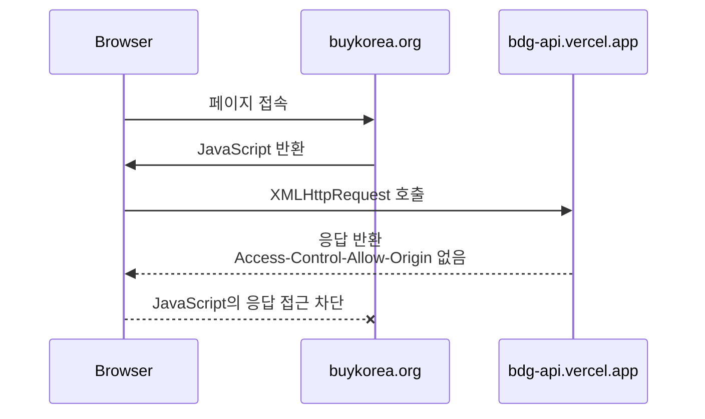
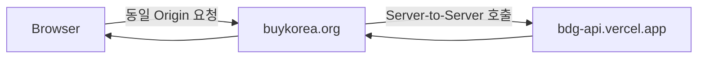

## 1. CORS 브라우저 로그

```
Access to XMLHttpRequest at '[https://bdg-api.vercel.app/b/g?i=1GZewYSUYqpR](https://bdg-api.vercel.app/b/g?i=1GZewYSUYqpR)' from origin '[https://buykorea.org](https://buykorea.org/)' has been blocked by CORS policy: No 'Access-Control-Allow-Origin' header is present on the requested resource.
```

사고 프로세스 및 전체 절차 요약]

- **상황 분석:** 사용자가 브라우저 콘솔에서 발생한 CORS 에러 로그를 제공하고, 실무 관점에서의 원인 및 해결책을 요구했습니다. 요청 도메인(Client)은 `https://buykorea.org`이며, 대상 도메인(API Server)은 Vercel에 호스팅된 `https://bdg-api.vercel.app`입니다.

- **정보 탐색 및 연관:** CORS(Cross-Origin Resource Sharing) 정책은 브라우저가 보안을 위해 강제하는 표준 사양입니다. 오류 메시지(`No 'Access-Control-Allow-Origin' header is present`)를 통해, API를 제공하는 Vercel 서버 측에서 요청 도메인에 대한 허용 헤더를 응답에 포함하지 않았음을 식별했습니다.

- **해결책 설계:** 1. 실제 로그 데이터에 기반하여 원인을 직관적으로 분석합니다.

    2. 실무에서 가장 흔하게 범하는 CORS 대응 시의 보안 위험성(Wildcard 오남용)을 경고합니다.

    3. 인프라 및 소스코드 레벨에서 적용 가능한 복수의 해결 방안을 장단점 비교 표와 함께 제시합니다.

## 2. 실무 적용 시나리오 및 원인 분석 (Concept & Scenario)

제공해주신 로그는 브라우저의 보안 메커니즘인 SOP(Same-Origin Policy)에 의해 요청이 차단되었음을 나타냅니다. JavaScript가 구동되는 클라이언트 웹사이트와 호출하려는 API 서버의 도메인이 서로 다를 때 발생합니다.

- **요청 도메인 (Origin):** `https://buykorea.org`
- **대상 API 도메인 (Target):** `https://bdg-api.vercel.app`

```
[인증/요청] https://buykorea.org (브라우저) 
     │ 
     ├─▶ API 호출 (Origin: https://buykorea.org 헤더 포함)
     │ 
     ▼ 
https://bdg-api.vercel.app (Vercel 서버) 
     │ 
     └─▶ 응답 반환 (⚠️ Access-Control-Allow-Origin 헤더 누락)
```

브라우저는 `https://buykorea.org`에서 `https://bdg-api.vercel.app`으로 비동기 요청(XMLHttpRequest)을 보낼 때, 헤더에 `Origin`을 실어 보냅니다. API 서버는 이에 대한 응답으로 "너의 도메인을 허용한다"는 증서인 `Access-Control-Allow-Origin` 헤더를 내려주어야 합니다.

현재 오류가 발생한 근본 원인은 **API 서버(`bdg-api.vercel.app`)의 설정 또는 소스코드에서 이 응답 헤더를 누락**했기 때문입니다. 즉, 클라이언트(프론트엔드) 코드가 아닌 **API 서버(백엔드/인프라)측에서 해결해야 하는 문제**입니다.

## 3. 도입 시 잠재적 위험성 (Risk Warning)

CORS 오류를 해결하는 과정에서 실무자들이 가장 많이 치르는 실무적 리스크는 다음과 같습니다.

- **와일드카드(`*`) 오남용으로 인한 데이터 유출:** 개발 편의를 위해 API 서버의 응답 헤더를 `Access-Control-Allow-Origin: *`로 설정하여 모든 도메인을 허용하는 경우가 많습니다. 이는 대외 서비스 환경에서 CSRF(공격자가 사용자의 권한을 도용하여 악의적 요청을 보내는 방식) 공격에 취약해지며, 민감한 비즈니스 API 데이터가 비인가 제3자에게 무단 노출 및 크롤링당하는 심각한 보안 취약점을 야기합니다.

- **인증 정보(Credential) 동반 차단 리스크:** 만약 API 요청 시 쿠키(Cookie)나 Authorization 헤더 등 인증 정보를 동반(`withCredentials = true`)해야 하는 경우, 서버 측 헤더가 와일드카드(`*`)로 되어 있으면 브라우저가 요청 자체를 거부합니다. 반드시 명확한 특정 도메인 주소가 지정되어야만 정상 동작합니다.

## 4. 리스크 회피 및 해결 방안 (Mitigation)

|**회피 방안**|**장점 (Pros)**|**단점 (Cons)**|**실무 권장도**|
|---|---|---|---|
|**방안 A: Vercel 라우팅 설정을 통한 헤더 주입**<br><br>  <br><br>(`vercel.json` 수정)|* 백엔드 소스코드를 수정하지 않고 빌드/배포 환경에서 깔끔하게 통제 가능합니다.|* Vercel 플랫폼 종속적인 설정이므로 향후 타 클라우드로 이전 시 재설정이 필요합니다.|**매우 높음**<br><br>  <br><br>(Vercel 호스팅 환경 최적)|
|**방안 B: API 애플리케이션 코드 내 CORS 미들웨어 적용**|* 개발 언어(Node.js, Express, Python 등) 레벨에서 동적으로 Origin 체크 로직을 고도화할 수 있습니다.|* 모든 API 엔드포인트나 라우터 초입에 미들웨어 누락이 없는지 검증 공수가 발생합니다.|**높음**<br><br>  <br><br>(동적 도메인 관리에 유리)|
|**방안 C: 웹서버(Nginx/Apache) 또는 리버스 프록시 도입**|* 클라이언트 도메인 하위에 특정 경로(예: `/api`)를 두고 서버 내부에서 포워딩하여 CORS를 원천 회피합니다.|* 인프라 아키텍처가 복잡해지며 Proxy 서버 비용 및 관리 포인트가 추가됩니다.|**보통**<br><br>  <br><br>(대규모 엔터프라이즈 환경)|

### 4-1. 실무 가이드: 방안 A (Vercel 설정 적용 예시)

API 서버의 루트 디렉토리에 `vercel.json` 파일을 생성하거나 기존 파일을 수정하여 특정 도메인만 허용하도록 명시하는 것이 가장 빠르고 안전합니다.

JSON

```
{
  "headers": [
    {
      "source": "/(.*)",
      "headers": [
        { "key": "Access-Control-Allow-Credentials", "value": "true" },
        { "key": "Access-Control-Allow-Origin", "value": "https://buykorea.org" },
        { "key": "Access-Control-Allow-Methods", "value": "GET,OPTIONS,PATCH,DELETE,POST,PUT" },
        { "key": "Access-Control-Allow-Headers", "value": "X-CSRF-Token, X-Requested-With, Accept, Accept-Version, Content-Length, Content-MD5, Content-Type, Date, X-Api-Version, Authorization" }
      ]
    }
  ]
}
```

### 4-2. 오류 의미

브라우저에서 다음과 같은 교차 출처 요청이 발생했습니다.

|구분|값|
|---|---|
|요청 페이지 Origin|`https://buykorea.org`|
|호출 API|`https://bdg-api.vercel.app/b/g?i=1GZewYSUYqpR`|
|요청 방식|`XMLHttpRequest`|
|오류 원인|API 응답에 `Access-Control-Allow-Origin` 헤더 없음|
|`buykorea.org`와 `bdg-api.vercel.app`은 도메인이 서로 다르므로 브라우저의 Same-Origin Policy 적용 대상입니다.||





### 4-3. 핵심 원인

API 서버인 `bdg-api.vercel.app`의 응답에 다음 헤더가 없기 때문에 발생한 오류입니다.

```http
Access-Control-Allow-Origin: https://buykorea.org
```

중요한 점은 CORS 설정은 호출하는 `buykorea.org` 화면이 아니라, **호출 대상 서버인 `bdg-api.vercel.app`에서 설정해야 한다는 것**입니다.

### 4-4. 가능한 발생 원인

|우선순위|원인|설명|
|--:|---|---|
|1|API 서버 CORS 미설정|응답에 `Access-Control-Allow-Origin`이 없음|
|2|허용 Origin 불일치|`www.buykorea.org`만 허용하거나 다른 도메인만 허용|
|3|오류 응답에 CORS 헤더 누락|정상 응답에는 헤더가 있으나 4xx·5xx 응답에는 없음|
|4|리다이렉트 응답에 헤더 누락|301·302로 다른 URL로 이동하는 과정에서 CORS 차단|
|5|Preflight 처리 실패|`OPTIONS` 요청에 적절한 CORS 응답을 반환하지 않음|
|6|인증정보 사용 설정 불일치|쿠키 또는 Authorization 사용 시 `*` 허용 불가|

### 4-5. 먼저 확인할 사항

브라우저 개발자 도구의 `Network` 탭에서 해당 요청을 선택하여 다음을 확인해야 합니다.

| 확인 항목            | 확인 내용                               |
| ---------------- | ----------------------------------- |
| Request Method   | `GET`, `POST`, `OPTIONS` 여부         |
| Status Code      | 200, 301, 302, 403, 404, 500 등      |
| Response Headers | `Access-Control-Allow-Origin` 존재 여부 |
| Location         | 리다이렉트 발생 여부                         |
| Request Headers  | `Authorization`, 커스텀 헤더 포함 여부       |
| OPTIONS 요청       | Preflight 요청이 별도로 발생했는지             |

- 특히 실제 API가 404 또는 500 오류를 반환하면서 CORS 헤더도 누락한 경우 브라우저에는 CORS 오류만 보일 수 있습니다. 따라서 서버 로그와 실제 HTTP 상태도 함께 확인해야 합니다.
### 4-6. 대책 1: API 서버에서 CORS 허용

가장 정상적인 해결 방법입니다.  
API 응답에 다음 헤더를 반환합니다.

```http
Access-Control-Allow-Origin: https://buykorea.org
Access-Control-Allow-Methods: GET, POST, OPTIONS
Access-Control-Allow-Headers: Content-Type, Authorization
```

여러 허용 도메인이 있다면 요청의 `Origin`을 검증한 후 해당 값을 동적으로 반환합니다.

```http
Origin: https://buykorea.org
Access-Control-Allow-Origin: https://buykorea.org
```

보안상 다음과 같이 모든 Origin을 허용하는 설정은 공개 API가 아니면 권장하지 않습니다.

```http
Access-Control-Allow-Origin: *
```

### 4-7. 대책 2: Vercel API에서 CORS 설정

`bdg-api.vercel.app`을 직접 관리한다면 API Handler에서 응답 헤더를 설정해야 합니다.

#### 4-7-1. Node.js/Vercel Function 예시

```javascript
export default function handler(req, res) {
  const allowedOrigins = [
    'https://buykorea.org',
    'https://www.buykorea.org'
  ];
  const origin = req.headers.origin;
  if (allowedOrigins.includes(origin)) {
    res.setHeader('Access-Control-Allow-Origin', origin);
  }
  res.setHeader('Vary', 'Origin');
  res.setHeader('Access-Control-Allow-Methods', 'GET, POST, OPTIONS');
  res.setHeader(
    'Access-Control-Allow-Headers',
    'Content-Type, Authorization'
  );
  if (req.method === 'OPTIONS') {
    return res.status(204).end();
  }
  return res.status(200).json({
    result: 'success'
  });
}
```

`Vary: Origin`은 CDN이나 캐시가 특정 Origin에 대한 CORS 응답을 다른 Origin에 재사용하지 않도록 하기 위해 필요합니다.

### 4-8. 대책 3: Spring 5.3 API 서버에서 CORS 설정

API 서버가 Spring 5.3 기반이라면 전역 CORS 설정을 적용할 수 있습니다.

```java
@Configuration
public class WebMvcConfig implements WebMvcConfigurer {
    @Override
    public void addCorsMappings(CorsRegistry registry) {
        registry.addMapping("/b/**")
                .allowedOrigins(
                        "https://buykorea.org",
                        "https://www.buykorea.org"
                )
                .allowedMethods("GET", "POST", "OPTIONS")
                .allowedHeaders(
                        "Content-Type",
                        "Authorization"
                )
                .allowCredentials(false)
                .maxAge(3600);
    }
}
```

Spring Security를 사용한다면 MVC 설정만으로 부족할 수 있으므로 Security 설정에서도 CORS를 활성화해야 합니다.

```java
@Override
protected void configure(HttpSecurity http) throws Exception {
    http
        .cors()
        .and()
        .csrf().disable();
}
```

`csrf().disable()`은 단순 예시이며, 실제 커머스 서비스에서는 인증 방식과 보안 정책에 따라 CSRF 설정을 별도로 검토해야 합니다.

### 4-9. 대책 4: 동일 Origin 프록시 구성

외부 API 서버의 CORS 설정을 변경할 수 없다면 `buykorea.org` 서버가 API를 대신 호출하도록 구성합니다.





브라우저는 다음과 같이 동일 도메인으로 호출합니다.

```javascript
$.ajax({
  url: '/external-api/b/g?i=1GZewYSUYqpR',
  method: 'GET'
});
```

Nginx 예시:

```nginx
location /external-api/ {
    proxy_pass https://bdg-api.vercel.app/;
    proxy_set_header Host bdg-api.vercel.app;
    proxy_set_header X-Real-IP $remote_addr;
    proxy_set_header X-Forwarded-For $proxy_add_x_forwarded_for;
    proxy_ssl_server_name on;
}
```

다만 단순 공개 프록시로 만들면 악용될 수 있으므로 호출 URL, 파라미터, 인증 및 Rate Limit을 제한해야 합니다.

### 4-10. 쿠키 또는 인증정보를 사용하는 경우

브라우저 요청에서 쿠키나 인증정보를 전달한다면 다음 조건이 필요합니다.  
클라이언트:

```javascript
fetch('https://bdg-api.vercel.app/b/g?i=1GZewYSUYqpR', {
  credentials: 'include'
});
```

서버:

```http
Access-Control-Allow-Origin: https://buykorea.org
Access-Control-Allow-Credentials: true
```

이 경우 다음 설정은 사용할 수 없습니다.

```http
Access-Control-Allow-Origin: *
```

`Access-Control-Allow-Credentials: true`를 사용하면 반드시 정확한 Origin을 지정해야 합니다.

### 4-11. 잘못된 해결 방법

|방법|문제점|
|---|---|
|브라우저 보안 비활성화|사용자 브라우저 전체 보안이 약화됨|
|Chrome CORS 확장 프로그램|개발자 PC에서만 동작하며 운영 해결책이 아님|
|`mode: "no-cors"`|응답이 `opaque`가 되어 JavaScript에서 데이터 확인 불가|
|프론트 JavaScript에서 CORS 헤더 추가|CORS 허용 헤더는 서버 응답에 있어야 하므로 효과 없음|
|`Access-Control-Allow-Origin`을 Request Header로 전송|브라우저가 인정하지 않으며 서버가 응답해야 함|

### 4-12. 권장 대응 순서

|순서|대응|
|--:|---|
|1|Network 탭에서 상태 코드와 리다이렉트 여부 확인|
|2|`bdg-api.vercel.app` 응답 헤더 확인|
|3|API 서버에 `https://buykorea.org` Origin 허용|
|4|OPTIONS 요청 발생 시 Preflight 처리 추가|
|5|4xx·5xx 오류 응답에도 CORS 헤더가 포함되도록 설정|
|6|외부 API 수정이 불가능하면 Spring 또는 Nginx 프록시 적용|

### 4-13. 결론

현재 오류의 직접 원인은 다음과 같습니다.

> `https://bdg-api.vercel.app` 서버가 `https://buykorea.org`에서의 브라우저 호출을 허용하는 `Access-Control-Allow-Origin` 응답 헤더를 반환하지 않아 브라우저가 응답 접근을 차단했습니다.  
> 가장 좋은 대책은 `bdg-api.vercel.app`에서 `https://buykorea.org`를 명시적으로 허용하는 것입니다. 외부 써드파티 API라서 수정할 수 없다면 브라우저에서 직접 호출하지 말고, Spring 서버 또는 Nginx를 경유하는 동일 Origin 프록시 방식으로 전환하는 것이 적절합니다.
<details>
  <summary>참고</summary>  
  <pre>
  </pre>
</details>
