### 1. 확인 결과

현재 공개 자료만으로는 **`Driven`이라는 특정 상품추천 솔루션의 API 명세, 추천 알고리즘, 데이터 저장 구조를 확인하기 어렵습니다.**  
검색되는 국내 `Driven` 회사는 데이터 분석, A/B 테스트, 데이터 클러스터링, 머신러닝 모델링, 고객 자동화 마케팅 등을 제공한다고 공개하고 있지만, 상품추천 엔진의 구체적인 처리 방식이나 API 규격은 공개하지 않았습니다. 따라서 해당 회사와 앞서 확인한 `bdg-api.vercel.app` 사이의 관계도 확정할 수 없습니다. ([driven.co.kr](https://www.driven.co.kr/ "Driven | AI 데이터드리븐 퍼포먼스 마케팅"))  
반면 buyKOREA에는 실제로 다음 추천 영역이 존재합니다.

|화면|추천 영역|
|---|---|
|메인|`RECOMMENDED CATEGORIES FOR YOU`|
|메인|`RECOMMENDED PRODUCTS FOR YOU`|
|메인|`HOW ABOUT THIS ONE?`|
|상품 상세|`Recommended products for you`|
|buyKOREA 메인과 상품 상세 페이지에서 개인화 또는 연관상품 추천 영역이 확인됩니다. ([buyKOREA](https://buykorea.org/ "buyKOREA \| Korean Supplier Directory & Verified Manufacturers"))||
|따라서 이하에서는 **특정 Driven 제품의 확정 사양이 아니라, buyKOREA와 같은 커머스 사이트에서 일반적으로 사용하는 추천 솔루션의 메커니즘**을 기준으로 설명합니다.||

### 2. 전체 상품추천 처리 구조

현대적인 추천엔진은 일반적으로 다음 3단계로 구성됩니다.

1. 후보 상품 생성

2. 상품별 점수 계산

3. 필터링 및 재정렬  
    Google의 추천시스템 문서도 추천 구조를 `Candidate Generation → Scoring → Re-ranking`의 3단계로 설명합니다. ([Google for Developers](https://developers.google.com/machine-learning/recommendation/overview/types?utm_source=chatgpt.com "Recommendation systems overview | Machine Learning"))


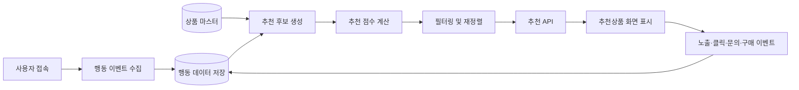


### 3. 1단계: 상품·사용자·행동 데이터 수집

추천 솔루션은 API 자체를 저장하는 것이 아니라, 다음 데이터를 수집하고 저장합니다.

#### 3-1. 상품 데이터

|데이터|예시|추천 활용|
|---|---|---|
|상품 ID|`goodsSn=3104092`|추천 결과 식별|
|카테고리|식품, 화장품, 산업재|유사 상품 검색|
|상품명·설명|영문 상품명, 상세설명|텍스트 유사도|
|키워드·태그|refrigeration, chiller|콘텐츠 기반 추천|
|판매자 ID|공급업체 식별자|동일 판매자 제한·우대|
|가격·MOQ|가격, 최소 주문량|바이어 조건 반영|
|국가·배송|배송 가능 지역|구매 불가능 상품 제외|
|재고·노출 상태|판매 중, 숨김|추천 제외|
|등록일|신규 상품 여부|신상품 가중치|

#### 3-2. 사용자 데이터

| 구분                                                                                | 예시                    |
| --------------------------------------------------------------------------------- | --------------------- |
| 회원 사용자                                                                            | buyer ID, 국가, 선호 카테고리 |
| 비회원 사용자                                                                           | 익명 방문자 ID, 세션 ID      |
| 접속 환경                                                                             | 언어, 국가, 디바이스          |
| 현재 문맥                                                                             | 현재 상품, 검색어, 카테고리      |

- 익명 사용자는 일반적으로 쿠키나 `localStorage` 등에 저장된 방문자 식별자로 구분하고, 로그인 후에는 회원 ID와 연결할 수 있습니다.
#### 3-3. 행동 이벤트

| 이벤트      | 추천 신호 강도 | 설명             |
| -------- | -------: | -------------- |
| 추천상품 노출  |       낮음 | 화면에 추천 상품이 표시됨 |
| 상품 클릭    |       중간 | 추천 상품에 관심을 보임  |
| 상품 상세 조회 |       중간 | 상품 정보를 실제 확인   |
| 검색       |       중간 | 현재 구매 의도 표현    |
| 즐겨찾기     |       높음 | 명확한 관심 표현      |
| 장바구니     |       높음 | 구매 가능성 증가      |
| 문의·인콰이어리 |    매우 높음 | B2B 구매 의도      |
| 구매·계약    |       최고 | 최종 전환          |

- | 실시간 이벤트를 지속적으로 기록하면 사용자의 최근 관심사를 추천 결과에 반영할 수 있습니다. Amazon Personalize도 상품 조회·구매 같은 상호작용 이벤트를 실시간으로 기록해 추천에 반영하는 구조를 사용합니다. ([AWS Documentation](https://docs.aws.amazon.com/personalize/latest/dg/recording-item-interaction-events.html?utm_source=chatgpt.com "Recording real-time item interaction events"))   
- buyKOREA는 B2B 플랫폼이므로 일반 B2C 쇼핑몰보다 **구매 건수가 적고 구매 주기가 길 가능성이 큽니다.** 따라서 구매 이력만 사용하기보다 `검색 → 상세조회 → 즐겨찾기 → Inquiry/RFQ` 이벤트에 높은 가중치를 부여하는 방식이 더 적합합니다. buyKOREA는 한국 공급업체와 해외 바이어를 연결하고 인콰이어리, 결제, 배송 등을 지원하는 B2B 플랫폼입니다. ([KOTRA](https://www.kotra.or.kr/subList/20000005984/subhome/bizIntro/selectBizDetail.do?bizClCd=ESPUOMBS&utm_source=chatgpt.com "buyKOREA (B2B/이커머스 플랫폼활용)")) 
### 4. 2단계: 추천 후보 상품 생성

전체 수십만 개 상품을 매 요청마다 정밀 비교하지 않고, 여러 알고리즘을 이용해 수백 개 정도의 후보를 먼저 만듭니다.

#### 4-1. 인기 상품 추천

```text
최근 7일 조회수 + 클릭수 + 문의수 + 구매수
```

사용자 이력이 없는 신규 방문자에게 적용하기 쉽습니다.

```text
추천 예시
- 국가별 인기 상품
- 카테고리별 인기 상품
- 최근 문의가 급증한 상품
- Trending Now
```

#### 4-2. 상품 기반 협업 필터링

현재 사용자가 보고 있는 상품과 함께 조회되거나 문의된 상품을 찾습니다.

```text
상품 A를 조회한 사용자들이
상품 B와 상품 C도 자주 조회함
→ A 상세화면에서 B, C 추천
```

예:

```text
산업용 냉각기 조회
→ 냉동차 부품
→ 온도 센서
→ 냉각 시스템 제어기 추천
```

#### 4-3. 사용자 기반 협업 필터링

행동 패턴이 비슷한 사용자를 찾고, 유사 사용자가 관심을 보인 상품을 추천합니다.

```text
Buyer A: 냉각기, 냉동차, 압축기 조회
Buyer B: 냉각기, 냉동차, 온도센서 조회
→ Buyer A에게 온도센서 추천
```

협업 필터링은 사용자와 상품 간의 상호작용 유사성을 학습하여, 유사 사용자가 선호한 상품을 추천하는 방식입니다. ([Google for Developers](https://developers.google.com/machine-learning/recommendation/collaborative/basics?utm_source=chatgpt.com "Collaborative filtering | Machine Learning"))

#### 4-4. 콘텐츠 기반 추천

상품명, 설명, 카테고리, HS코드, 태그 등의 유사성을 계산합니다.

```text
현재 상품
- Category: Refrigeration
- Keywords: chiller, cooler, truck
- HS Code: 관련 산업분류
추천 후보
- 동일 카테고리
- 유사 키워드
- 유사 HS Code
```

신규 상품처럼 행동 이력이 부족한 경우에도 적용할 수 있습니다.

#### 4-5. 세션 기반 실시간 추천

현재 세션에서 최근 본 상품과 검색어를 사용합니다.

```text
검색: cosmetic packaging
→ 화장품 용기 상세 조회
→ 친환경 포장재 조회
→ 화장품 포장재·라벨·인쇄 업체 추천
```

로그인 이력이 없어도 현재 세션 행동만으로 추천할 수 있습니다.

#### 4-6. 운영 규칙 기반 추천

머신러닝 결과에 운영자가 지정한 상품을 추가합니다.

```text
- 신규 등록 상품
- 전시회 참가 상품
- 프로모션 상품
- 인증 보유 상품
- 특정 국가 수출 가능 상품
```

### 5. 3단계: 추천 점수 계산

각 후보 상품에 대해 사용자가 관심을 가질 가능성을 점수화합니다.  
다음은 개념적인 예시입니다.

```text
RecommendationScore =
    사용자 선호도         × 0.30
  + 현재 상품 유사도     × 0.25
  + 최근 행동 연관도     × 0.20
  + 전체 인기도          × 0.10
  + 국가·언어 적합도     × 0.05
  + 신상품 가중치        × 0.05
  + 운영 프로모션 점수   × 0.05
```

실제 가중치는 A/B 테스트와 클릭률·문의전환율 등의 결과를 기준으로 조정합니다.

| 추천 위치                                                                                                                                                                                                                               | 주요 점수 기준         |
| ----------------------------------------------------------------------------------------------------------------------------------------------------------------------------------------------------------------------------------- | ---------------- |
| 메인 추천상품                                                                                                                                                                                                                             | 사용자 장기 관심사+최근 행동 |
| 상품 상세 연관상품                                                                                                                                                                                                                          | 현재 상품 유사도+동시 조회  |
| 검색 결과 추천                                                                                                                                                                                                                            | 검색어 적합도+사용자 선호   |
| 장바구니 추천                                                                                                                                                                                                                             | 보완재·동시 구매 관계     |
| 비회원 첫 방문                                                                                                                                                                                                                            | 국가·언어별 인기 상품     |

- 후보 생성 단계에서 여러 소스의 상품을 합친 뒤 공통 점수 모델을 적용하면 서로 다른 후보군을 동일한 기준으로 비교할 수 있습니다. ([Google for Developers](https://developers.google.com/machine-learning/recommendation/dnn/scoring?utm_source=chatgpt.com "Scoring | Machine Learning"))
### 6. 4단계: 필터링 및 재정렬

점수가 높더라도 노출하면 안 되는 상품은 제거합니다.

| 필터                                                                                                                                                                                                                         | 처리             |
| -------------------------------------------------------------------------------------------------------------------------------------------------------------------------------------------------------------------------- | -------------- |
| 판매 중지                                                                                                                                                                                                                      | 추천 제외          |
| 삭제·승인 대기                                                                                                                                                                                                                   | 추천 제외          |
| 배송 불가능 국가                                                                                                                                                                                                                  | 추천 제외          |
| 언어 미지원                                                                                                                                                                                                                     | 우선순위 하향        |
| 현재 보고 있는 상품                                                                                                                                                                                                                | 중복 추천 제외       |
| 이미 구매한 상품                                                                                                                                                                                                                  | 재구매 상품이 아니면 제외 |
| 동일 판매자 과다 노출                                                                                                                                                                                                               | 판매자별 최대 개수 제한  |
| 동일 카테고리 편중                                                                                                                                                                                                                 | 다양성 확보         |
| 오래된 상품                                                                                                                                                                                                                     | 신선도 점수 감점      |

- 최종 재정렬 단계에서는 정확도뿐 아니라 상품 다양성, 신규성, 중복 제거, 운영 정책을 함께 적용합니다. ([Google for Developers](https://developers.google.com/machine-learning/recommendation/dnn/re-ranking?utm_source=chatgpt.com "Re-ranking | Machine Learning"))
### 7. 추천 API 응답 및 화면 표시

추천 솔루션은 일반적으로 상품 전체 정보를 반환하거나, 상품 ID와 추천 점수만 반환합니다.

#### 7-1. 상품 ID만 반환하는 방식

```json
{
  "requestId": "rec-20260616-100001",
  "recommendations": [
    {
      "productId": "3104092",
      "score": 0.9231,
      "reason": "SIMILAR_ITEM"
    },
    {
      "productId": "3077661",
      "score": 0.8874,
      "reason": "USER_AFFINITY"
    }
  ]
}
```

커머스 서버는 반환된 상품 ID로 내부 상품 DB를 조회합니다.


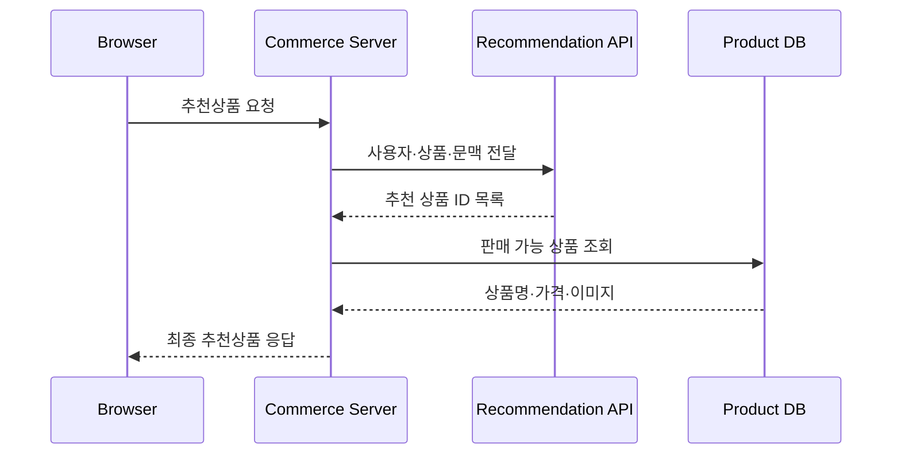


이 방식의 장점은 다음과 같습니다.

- 추천 솔루션에 최신 가격과 재고를 중복 저장하지 않아도 됨

- 내부 노출 정책을 최종 적용할 수 있음

- 추천 솔루션 장애 시 대체 로직 적용 가능

#### 7-2. 상품 정보까지 반환하는 방식

```json
{
  "recommendations": [
    {
      "productId": "3104092",
      "name": "Transport Refrigeration Unit",
      "imageUrl": "...",
      "sellerId": "SELLER001",
      "score": 0.9231
    }
  ]
}
```

화면 출력은 빠르지만 추천 솔루션과 상품 DB 간 데이터 동기화 문제가 발생할 수 있습니다.

### 8. 추천 결과 표시 후 피드백 수집

추천상품을 보여준 것만으로 처리가 끝나지 않습니다.


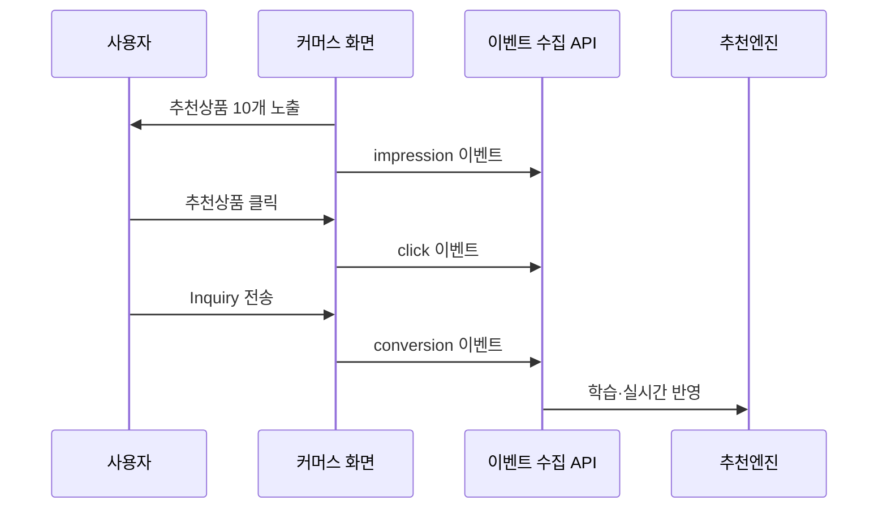


수집되는 대표 데이터는 다음과 같습니다.

```json
{
  "eventType": "recommendation_click",
  "visitorId": "anonymous-visitor-id",
  "userId": null,
  "productId": "3104092",
  "requestId": "rec-20260616-100001",
  "position": 3,
  "placement": "PRODUCT_DETAIL",
  "timestamp": "2026-06-16T10:00:10+09:00"
}
```

`requestId`, `position`, `placement`를 저장해야 어떤 추천 요청에서 몇 번째 상품이 클릭되었는지 측정할 수 있습니다.

### 9. 오프라인 학습과 실시간 추천

상품추천 솔루션은 보통 배치 처리와 실시간 처리를 함께 사용합니다.

|구분|처리 내용|실행 주기|
|---|---|---|
|배치 학습|장기간 조회·클릭·구매 패턴 학습|일 1회~수시간|
|상품 유사도 계산|상품별 연관상품 사전 계산|상품 변경 또는 일 단위|
|인기 상품 집계|최근 조회·문의 순위 계산|5분~1시간|
|실시간 이벤트|현재 세션 관심사 반영|즉시|
|실시간 추론|현재 사용자의 추천 결과 생성|요청 시|
|실시간 개인화 모델은 최근 사용자 행동을 즉시 추천에 반영할 수 있지만, 일부 모델은 재학습 이후에만 신규 데이터를 반영합니다. ([AWS Documentation](https://docs.aws.amazon.com/personalize/latest/dg/how-new-data-influences-recommendations.html?utm_source=chatgpt.com "How new data influences real-time recommendations"))|||

### 10. 앞서 발생한 `bdg-api.vercel.app` CORS 오류와 추천 기능의 관계

확인된 주소를 직접 호출하면 현재 다음 형태의 응답을 반환합니다.

```json
{
  "success": true,
  "response": {
    "q": ""
  }
}
```

다만 이 응답만으로는 해당 API가 다음 중 무엇인지 확정할 수 없습니다. ([bdg-api.vercel.app](https://bdg-api.vercel.app/b/g?i=1GZewYSUYqpR "bdg-api.vercel.app"))

|가능한 역할|CORS 오류 영향|
|---|---|
|추천 결과 조회 API|추천 상품 영역이 비거나 기본 상품으로 대체|
|행동 이벤트 수집 API|현재 화면은 보이지만 개인화 데이터가 저장되지 않음|
|사용자 식별 API|비회원 사용자 식별 실패|
|SDK 초기화·설정 API|추천 스크립트 전체 초기화 실패|
|검색어·쿼리 저장 API|검색 기반 추천 정확도 저하|
|URL의 `i=1GZewYSUYqpR` 값도 다음 중 하나일 수 있습니다.||

```text
- 설치 사이트 ID
- 고객사 ID
- 방문자 ID
- 추천 영역 ID
- API 인증용 공개 키
- 캠페인 ID
```

파라미터 이름이 `i`라는 사실만으로 사용자 ID나 개인정보라고 판단할 수는 없습니다.

### 11. Network 로그에서 실제 역할 확인 방법

Chrome 개발자도구의 `Network`에서 해당 요청을 선택해 다음을 확인해야 합니다.

|확인 항목|판단 기준|
|---|---|
|Initiator|어떤 JavaScript 파일이 호출했는지|
|Request Payload|상품 ID, 사용자 ID, 이벤트 유형 포함 여부|
|Query String|`i` 외에 `product`, `user`, `event` 값 존재 여부|
|호출 시점|페이지 로딩, 상품 클릭, 검색, 장바구니 시점|
|Response|상품 ID 목록인지 단순 성공 응답인지|
|후속 요청|해당 API 호출 후 다른 추천 API가 호출되는지|
|Local Storage|방문자 ID 또는 추천 SDK 키 저장 여부|
|Cookies|추천 솔루션의 익명 식별 쿠키 존재 여부|

#### 11-1. 동작별 판별

```text
페이지 로딩 때만 호출
→ 초기화 또는 사용자 식별 가능성
상품 클릭 때마다 호출
→ 행동 이벤트 수집 가능성
응답에 상품 ID 배열 존재
→ 추천 결과 API 가능성
응답이 success:true만 존재
→ 이벤트 저장 또는 설정 조회 가능성
```

현재 확인된 응답은 상품 배열을 반환하지 않으므로, **직접적인 추천 결과 API보다는 초기화·식별·설정·이벤트 처리 API일 가능성이 상대적으로 높지만 확정할 수는 없습니다.**

### 12. Spring 5.3 기반 권장 연동 아키텍처

브라우저가 써드파티 추천 API를 직접 호출하는 구조보다 커머스 서버에 Adapter 계층을 두는 것이 안정적입니다.


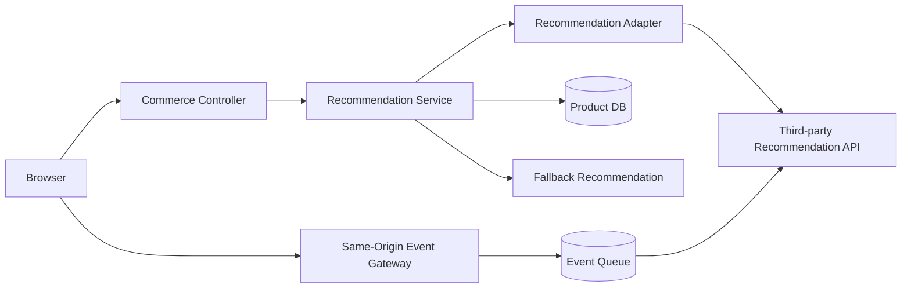


```text
Controller
└─ RecommendationApplicationService
   ├─ RecommendationClient
   │  └─ DrivenRecommendationClient 또는 ThirdPartyRecommendationClient
   ├─ ProductRepository
   ├─ RecommendationPolicy
   └─ FallbackRecommendationService
```

#### 12-1. 권장 API

```http
GET /api/recommendations
    ?placement=PRODUCT_DETAIL
    &productId=3104092
    &limit=10
```

```http
POST /api/recommendation-events
```

```json
{
  "eventType": "PRODUCT_VIEW",
  "productId": "3104092",
  "requestId": "rec-20260616-100001",
  "position": 1
}
```

#### 12-2. 장애 시 Fallback

|장애 상황|대체 추천|
|---|---|
|추천 API Timeout|동일 카테고리 인기 상품|
|추천 결과 0건|최근 인기 상품|
|사용자 식별 실패|국가·언어별 인기 상품|
|상품 데이터 불일치|유효 상품만 필터링|
|전체 추천엔진 장애|DB 사전 집계 추천|

### 13. 최종 정리

Driven 솔루션의 공개된 상품추천 상세 사양은 확인되지 않았으므로, 현재 단계에서 특정 알고리즘을 사용한다고 단정하면 안 됩니다.  
buyKOREA와 같은 커머스 사이트의 일반적인 상품추천 처리는 다음 순서로 동작합니다.

```text
1. 상품 마스터 동기화
2. 방문자 또는 회원 식별
3. 검색·조회·클릭·문의·구매 이벤트 수집
4. 인기·협업 필터링·콘텐츠 기반으로 후보 생성
5. 개인화 점수 계산
6. 판매 상태·국가·언어·다양성 기준 필터링
7. 추천 상품 ID를 커머스 시스템에 반환
8. 상품 DB에서 최신 정보 조회 후 화면 표시
9. 노출·클릭·Inquiry 결과를 다시 추천엔진에 전달
10. 실시간 추천 및 주기적 모델 재학습
```

앞서 발생한 CORS 오류는 추천 결과 조회, 사용자 식별 또는 행동 데이터 수집 중 하나를 차단할 수 있습니다. 정확한 기능 영향은 `Network → Initiator`, 요청 Payload, 호출 시점, 응답 구조를 확인하여 판단해야 합니다.

## 14. 커머스 상품추천과 Google 검색 연동
### 14-1. 핵심 구분

커머스 상품추천과 Google 검색 연동은 서로 다른 기능입니다.

| 구분               | 목적                          | 대표 기술                                               |
| ---------------- | --------------------------- | --------------------------------------------------- |
| 상품추천             | 사용자에게 구매 가능성이 높은 상품 제시      | 협업 필터링, 콘텐츠 기반, 세션 기반, ML Ranking                   |
| 사이트 내부검색         | 사용자가 입력한 검색어에 적합한 상품 조회     | Elasticsearch/OpenSearch, Google AI Commerce Search |
| Google 검색 노출     | Google 검색·쇼핑에서 자사 상품 발견     | 구조화 데이터, Merchant Center, Sitemap                   |
| Google 검색 데이터 활용 | Google 유입 검색어를 분석해 추천·전시 개선 | Search Console API                                  |
| Google 웹검색 API   | Google에 색인된 웹문서 검색          | Programmable Search JSON API                        |

- 따라서 **Google 검색 결과를 그대로 상품추천으로 사용하는 구조가 아니라**, 내부 상품추천 엔진과 Google 검색 노출·유입 데이터를 각각 연동하는 구조가 적절합니다.
### 14-2. 일반적인 상품추천 전체 메커니즘

Google이 설명하는 일반적인 추천시스템도 다음 3단계 구조를 사용합니다.

1. 후보 상품 생성

2. 후보별 점수 계산

3. 필터링 및 재정렬  
    추천시스템은 전체 상품을 바로 정렬하지 않고, 여러 후보 생성기로 상품 수를 축소한 다음 정밀 점수화하고 운영 정책을 적용합니다. ([Google for Developers](https://developers.google.com/machine-learning/recommendation/overview/types?utm_source=chatgpt.com "Recommendation systems overview | Machine Learning"))


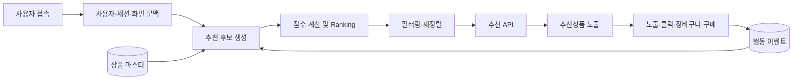


### 14-3. 추천엔진에 필요한 데이터

#### 14-3-1. 상품 데이터

| 필드      | 예시          | 추천 활용      |
| ------- | ----------- | ---------- |
| 상품 ID   | `P000123`   | 추천 결과 식별   |
| 상품명     | 무선 청소기 A200 | 텍스트 유사도    |
| 카테고리    | 가전 > 생활가전   | 카테고리 연관성   |
| 브랜드     | ABC         | 브랜드 선호도    |
| 가격      | 299,000원    | 가격대 선호도    |
| 재고 상태   | 판매 중, 품절    | 노출 필터      |
| 상품 속성   | 색상, 용량, 소재  | 유사 상품 계산   |
| 키워드·태그  | 무선, 저소음     | 콘텐츠 기반 추천  |
| 판매자     | Seller-01   | 판매자별 노출 제한 |
| 등록일     | 2026-06-01  | 신상품 가중치    |
| 판매량     | 최근 7일 320개  | 인기도        |
| 마진·프로모션 | 할인, 광고 여부   | 운영 재정렬     |
|         |             |            |
- 상품 데이터의 정확성과 속성의 구체성이 추천·검색 품질에 직접 영향을 줍니다. Google의 커머스 검색 서비스 역시 상품 카탈로그와 실시간 사용자 이벤트를 공통 입력으로 사용합니다. ([Google Cloud Documentation](https://docs.cloud.google.com/retail/docs/catalog?utm_source=chatgpt.com "About catalogs and products | AI Commerce Search in ..."))
#### 14-3-2. 사용자 식별 데이터

|사용자 유형|식별 방법|
|---|---|
|로그인 회원|회원 ID|
|비회원|익명 Visitor ID|
|현재 방문|Session ID|
|디바이스 변경 사용자|로그인 후 회원 ID로 통합|
|권장 식별 구조:||

```text
visitorId: 브라우저 또는 앱 단위 익명 ID
sessionId: 방문 세션 단위 ID
userId: 로그인 회원 ID
```

비회원 행동을 무시하면 전체 방문자의 추천 학습 데이터가 크게 감소하므로, 익명 방문자 ID를 유지하고 로그인 시 회원 ID와 논리적으로 연결하는 것이 좋습니다.

#### 14-3-3. 행동 이벤트

|이벤트|일반적인 의미|개념적 가중치|
|---|---|--:|
|`IMPRESSION`|추천상품 화면 노출|0.1|
|`CLICK`|추천상품 클릭|1|
|`DETAIL_VIEW`|상품 상세조회|2|
|`SEARCH`|검색어 입력|2|
|`WISHLIST`|관심상품 등록|4|
|`ADD_TO_CART`|장바구니 등록|5|
|`INQUIRY`|상품 문의·견적요청|6|
|`PURCHASE`|구매 완료|10|
|가중치는 고정 표준이 아니라 서비스의 KPI와 전환 구조를 기준으로 조정해야 합니다. B2B 커머스라면 실제 구매보다 `Inquiry`, `RFQ`, 견적서 요청이 더 자주 발생하므로 이를 강한 전환 신호로 취급하는 것이 적절합니다.|||
|이벤트 예시:|||

```json
{
  "eventId": "evt-20260616-000001",
  "eventType": "DETAIL_VIEW",
  "visitorId": "v-52f81c",
  "sessionId": "s-b1a527",
  "userId": "BUYER-1024",
  "productId": "P000123",
  "categoryId": "C100",
  "query": "industrial cooling unit",
  "recommendationRequestId": "rec-100301",
  "position": 3,
  "timestamp": "2026-06-16T12:10:30+09:00"
}
```

Google의 커머스 검색·추천 서비스도 과거 이벤트를 적재하고 실시간 이벤트를 기록하며, 추천과 검색에서 동일한 이벤트를 사용할 수 있도록 설계되어 있습니다. ([Google Cloud Documentation](https://docs.cloud.google.com/retail/docs/user-events?utm_source=chatgpt.com "About user events | AI Commerce Search in Gemini ..."))

### 14-4. 후보 상품 생성

추천 요청 시 여러 방식으로 후보를 생성한 뒤 하나로 합칩니다.

#### 14-4-1. 인기 상품

```text
최근 조회수 × 0.2
+ 클릭수 × 0.3
+ 장바구니 × 0.5
+ 구매수 × 1.0
```

적용 위치:

- 비회원 첫 방문

- 신규 회원

- 데이터가 적은 카테고리

- 추천 장애 시 Fallback

#### 14-4-2. 콘텐츠 기반 추천

현재 상품 또는 사용자가 선호한 상품과 속성이 비슷한 상품을 추천합니다.

```text
상품명 유사도
+ 카테고리 일치도
+ 브랜드 일치도
+ 상품 속성 유사도
+ 설명문 Embedding 유사도
```

콘텐츠 기반 추천은 상품의 특징을 이용해 사용자가 이전에 관심을 보인 상품과 유사한 상품을 찾는 방식입니다. 다른 사용자의 행동 데이터가 적어도 동작할 수 있다는 장점이 있습니다. ([Google for Developers](https://developers.google.com/machine-learning/recommendation/content-based/basics?utm_source=chatgpt.com "Content-based filtering | Machine Learning"))

#### 14-4-3. 협업 필터링

사용자와 상품 간 행동 패턴을 기반으로 추천합니다.

```text
사용자 A: 상품 1, 2, 3 조회
사용자 B: 상품 1, 2, 4 조회
→ 사용자 A에게 상품 4 추천
```

협업 필터링은 사용자와 상품을 같은 임베딩 공간에 표현하고, 유사 사용자 또는 유사 상품 간 관계를 학습할 수 있습니다. ([Google for Developers](https://developers.google.com/machine-learning/recommendation/collaborative/basics?utm_source=chatgpt.com "Collaborative filtering | Machine Learning"))

#### 14-4-4. 세션 기반 추천

로그인 여부와 관계없이 현재 방문 중 행동을 사용합니다.

```text
최근 검색어
→ 최근 조회 카테고리
→ 최근 본 상품
→ 장바구니 상품
```

예:

```text
검색: camping chair
상세조회: 경량 캠핑의자
상세조회: 접이식 테이블
→ 캠핑 테이블, 수납가방, 캠핑매트 추천
```

#### 14-4-5. 함께 구매한 상품

주문 데이터를 분석해 보완재를 추천합니다.

```text
노트북 → 마우스, 파우치, USB 허브
프린터 → 토너, 용지
산업용 펌프 → 밸브, 호스, 압력계
```

Google의 커머스 추천 모델도 `Frequently Bought Together`, `Similar Items`, `Recommended for You`, `Buy it Again`, `Recently Viewed` 등의 유형을 지원합니다. ([Google Cloud Documentation](https://docs.cloud.google.com/retail/docs/models?utm_source=chatgpt.com "About recommendation models | AI Commerce Search in ..."))

### 14-5. 추천 점수 계산

후보별로 구매·클릭 가능성을 점수화합니다.

```text
FinalScore =
    개인 선호 점수             × 0.25
  + 현재 상품 유사도          × 0.20
  + 현재 세션 관심도          × 0.20
  + 협업 필터링 점수          × 0.15
  + 최근 인기도               × 0.10
  + 신상품·프로모션 점수      × 0.05
  + 국가·언어·배송 적합도     × 0.05
```

실제 ML 모델에서는 다음과 같은 Feature가 입력될 수 있습니다.

|영역|Feature 예시|
|---|---|
|사용자|선호 카테고리, 가격대, 브랜드, 국가|
|상품|카테고리, 가격, 브랜드, 판매량, 등록일|
|상호작용|조회 횟수, 마지막 조회 시각, 구매 여부|
|세션|현재 검색어, 최근 클릭 상품, 장바구니|
|문맥|시간대, 디바이스, 유입 채널, 추천 위치|
|운영|프로모션, 광고, 재고, 판매자 등급|

### 14-6. 재정렬과 필터링

ML 점수가 높아도 운영상 노출할 수 없는 상품을 제거해야 합니다.

|정책|처리|
|---|---|
|품절·판매중지|추천 제외|
|승인 전 상품|추천 제외|
|배송 불가 국가|추천 제외|
|현재 보고 있는 상품|중복 제거|
|동일 판매자 과다노출|판매자별 최대 개수 제한|
|동일 브랜드 편중|브랜드 다양성 적용|
|동일 카테고리 편중|카테고리 다양성 적용|
|최근 구매 상품|소모품이 아니면 제외|
|낮은 품질 상품|후순위 처리|
|프로모션 상품|정책 범위 내 Boost|
|재정렬 단계는 관련성뿐 아니라 다양성, 신선도, 정책 제약과 같은 추가 조건을 반영하는 단계입니다. ([Google for Developers](https://developers.google.com/machine-learning/recommendation/dnn/re-ranking?utm_source=chatgpt.com "Re-ranking \| Machine Learning"))||

### 14-7. 추천 위치별 권장 방식

|화면 위치|주요 추천 방식|
|---|---|
|메인 화면|개인화 추천+인기 상품|
|카테고리 화면|카테고리 선호+인기 상품|
|상품 상세|유사 상품+함께 본 상품|
|장바구니|함께 구매한 보완재|
|검색 결과|검색어 관련성+개인화 재정렬|
|마이페이지|최근 본 상품+재구매 상품|
|이메일·알림|최근 관심상품+가격 인하 상품|
|비회원 첫 화면|국가·언어·카테고리별 인기 상품|

### 14-8. 상품추천 API 처리 순서


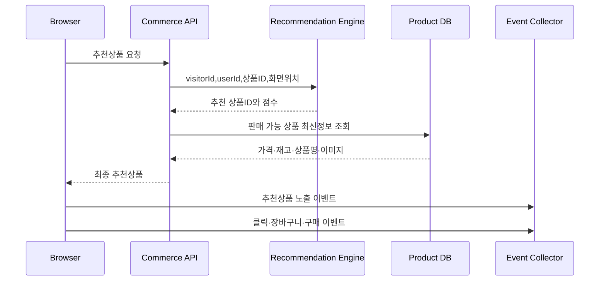


추천엔진이 상품 ID와 점수만 반환하고, 커머스 서버가 상품 DB에서 최신 가격·재고를 조회하는 구조가 안전합니다.

```json
{
  "requestId": "rec-20260616-1001",
  "placement": "PRODUCT_DETAIL",
  "items": [
    {
      "productId": "P000124",
      "score": 0.932,
      "reason": "SIMILAR_ITEM"
    },
    {
      "productId": "P000381",
      "score": 0.887,
      "reason": "FREQUENTLY_VIEWED_TOGETHER"
    }
  ]
}
```

### 14-9. Google 검색 연동 유형

#### 14-9-1. 유형 A: Google 검색·쇼핑에 상품 노출

가장 일반적으로 말하는 Google 검색 연동입니다.


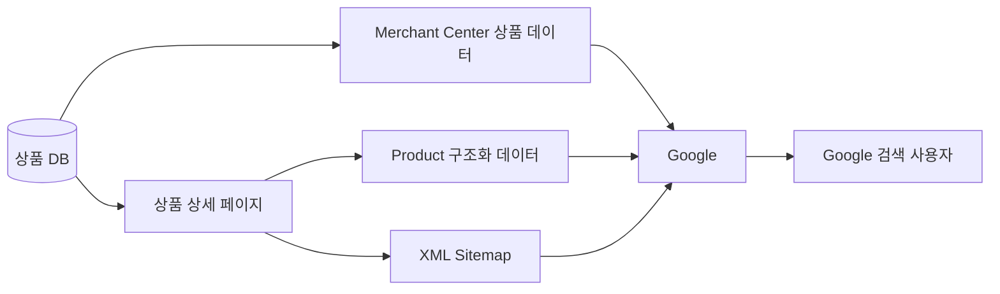


필수 구성:

1. 검색 가능한 상품 상세 URL

2. `Product` 구조화 데이터

3. XML Sitemap

4. Google Search Console

5. Google Merchant Center

6. 상품 수가 많으면 Merchant API 연동  
    Google은 상품 페이지의 구조화 데이터와 Merchant Center 데이터를 모두 제공하는 것이 상품 정보를 정확히 이해하고 다양한 검색 경험에 노출될 가능성을 높이는 방법이라고 설명합니다. ([Google for Developers](https://developers.google.com/search/docs/appearance/structured-data/product?utm_source=chatgpt.com "Intro to Product Structured Data on Google"))

#### 14-9-2. Product JSON-LD 예시

```html
<script type="application/ld+json">
{
  "@context": "https://schema.org",
  "@type": "Product",
  "name": "Industrial Cooling Unit A100",
  "image": [
    "https://www.example.com/images/P000123-1.jpg"
  ],
  "description": "Commercial transport refrigeration unit",
  "sku": "P000123",
  "brand": {
    "@type": "Brand",
    "name": "ABC Cooling"
  },
  "offers": {
    "@type": "Offer",
    "url": "https://www.example.com/products/P000123",
    "priceCurrency": "USD",
    "price": "1250.00",
    "availability": "https://schema.org/InStock",
    "itemCondition": "https://schema.org/NewCondition"
  }
}
</script>
```

구조화 데이터는 가격, 재고, 평점, 배송·반품 등의 상품 정보를 Google이 해석하도록 돕지만, 구조화 데이터를 추가했다고 검색 결과의 특정 표시가 보장되는 것은 아닙니다. ([Google for Developers](https://developers.google.com/search/docs/appearance/structured-data/product?utm_source=chatgpt.com "Intro to Product Structured Data on Google"))

#### 14-9-3. Sitemap 예시

```xml
<?xml version="1.0" encoding="UTF-8"?>
<urlset xmlns="http://www.sitemaps.org/schemas/sitemap/0.9">
  <url>
    <loc>https://www.example.com/products/P000123</loc>
    <lastmod>2026-06-16</lastmod>
  </url>
</urlset>
```

Sitemap은 Google에 선호 URL을 알려주는 힌트이며 색인 자체를 보장하지는 않습니다. 한 Sitemap은 비압축 기준 50MB 또는 50,000 URL 제한이 있으므로 대규모 커머스는 Sitemap Index로 분할해야 합니다. ([Google for Developers](https://developers.google.com/search/docs/crawling-indexing/sitemaps/build-sitemap?utm_source=chatgpt.com "Build and Submit a Sitemap | Google Search Central"))

#### 14-9-4. Merchant Center 연동

상품 수가 많거나 가격·재고가 자주 변하면 Merchant API를 사용합니다.

```text
상품 DB
  ├─ 전체 상품 정기 동기화
  ├─ 가격 변경 즉시 PATCH
  ├─ 재고 변경 즉시 PATCH
  └─ 판매중지 상품 DELETE
```

현재 Merchant API의 Products 기능은 상품 등록, 조회, 수정, 삭제를 지원하며 가격과 재고처럼 자주 변하는 필드는 부분 업데이트할 수 있습니다. ([Google for Developers](https://developers.google.com/merchant/api/guides/products/add-manage?utm_source=chatgpt.com "Add and manage products | Merchant API"))  
동기화 대상의 대표 항목:

```text
offerId
title
description
link
imageLink
contentLanguage
targetCountry
channel
price
availability
brand
gtin
mpn
condition
shipping
```

주의사항:

- 페이지 가격과 Merchant Center 가격이 달라지지 않게 관리

- 품절 상태 즉시 반영

- 비로그인 상태에서도 상품 페이지 접근 가능

- canonical URL 일치

- robots.txt 또는 `noindex`로 상품을 차단하지 않음

- 옵션 상품은 Parent/Variant 관계 관리  
    상품 변형이 있는 경우 Google은 `ProductGroup`, `hasVariant`, `variesBy`, `productGroupID` 등을 사용해 옵션 관계를 표현하도록 안내합니다. ([Google for Developers](https://developers.google.com/search/docs/appearance/structured-data/product-variants?utm_source=chatgpt.com "Product Variant Structured Data (ProductGroup, Product)"))

### 14-10. 유형 B: Google의 커머스 검색·추천 엔진 사용

Google Cloud의 현재 커머스 검색 서비스는 상품 카탈로그와 사용자 이벤트를 입력받아 사이트 내부검색과 추천 결과를 제공합니다. 같은 카탈로그와 이벤트 데이터를 검색과 추천 양쪽에서 사용하므로 별도로 중복 적재할 필요가 없습니다. ([Google Cloud Documentation](https://docs.cloud.google.com/retail/docs/overview?utm_source=chatgpt.com "Implement AI Commerce Search"))


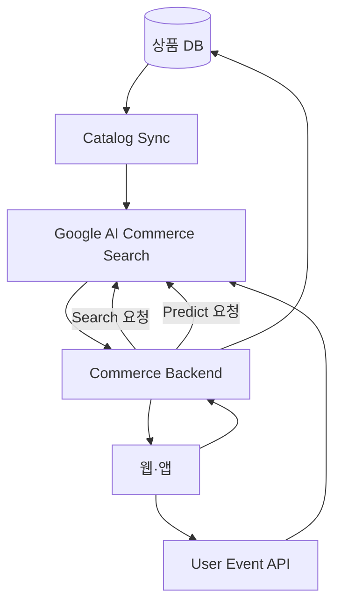


#### 14-10-1. 구축 순서

|순서|내용|
|--:|---|
|1|Google Cloud 프로젝트 및 API 활성화|
|2|상품 Catalog 적재|
|3|과거 사용자 이벤트 적재|
|4|실시간 이벤트 전송|
|5|추천 Model 생성|
|6|Serving Config 생성|
|7|검색·추천 API 호출|
|8|응답 상품 ID를 내부 DB와 결합|
|9|Attribution Token과 전환 이벤트 기록|
|Google은 추천 요청 전에 상품 데이터와 사용자 이벤트를 적재하고, 특정 사용자 및 현재 행동을 기준으로 추천을 요청하는 구조를 사용합니다. ([Google Cloud Documentation](https://docs.cloud.google.com/retail/docs/predict?utm_source=chatgpt.com "Get recommendations \| AI Commerce Search in Gemini ..."))||

#### 14-10-2. 사이트 내부검색 요청 개념

```json
{
  "query": "wireless vacuum",
  "visitorId": "v-52f81c",
  "pageSize": 20,
  "filter": "availability: ANY(\"IN_STOCK\")",
  "userInfo": {
    "userId": "MEMBER-1001"
  }
}
```

#### 14-10-3. 상품추천 요청 개념

```json
{
  "eventType": "detail-page-view",
  "visitorId": "v-52f81c",
  "userInfo": {
    "userId": "MEMBER-1001"
  },
  "productDetails": [
    {
      "product": {
        "id": "P000123"
      }
    }
  ],
  "pageSize": 10
}
```

현재 REST API에서는 `servingConfigs`를 사용하는 것이 권장되며, 기존 `placements`는 레거시 리소스로 안내됩니다. 검색은 `servingConfigs.search`, 추천은 Serving Config를 기준으로 Predict 요청을 처리할 수 있습니다. ([Google Cloud Documentation](https://docs.cloud.google.com/retail/docs/reference/rest/v2/projects.locations.catalogs.servingConfigs/search?utm_source=chatgpt.com "Method: projects.locations.catalogs.servingConfigs.search"))

### 14-11. 유형 C: Google Search Console 데이터를 추천에 활용

Search Console API에서는 Google 검색 유입 데이터를 다음 차원으로 조회할 수 있습니다.

|차원|활용|
|---|---|
|`query`|Google 유입 검색어|
|`page`|유입된 상품·카테고리 페이지|
|`country`|국가별 관심상품|
|`device`|모바일·PC 관심 차이|
|`date`|검색 트렌드 변화|
|Search Analytics API는 검색어, 페이지, 국가, 디바이스 등의 차원으로 노출·클릭 데이터를 조회할 수 있지만 내부 제한에 따라 모든 행이 아닌 상위 데이터 중심으로 반환될 수 있습니다. 따라서 실시간 개인화 데이터보다는 일별 트렌드와 전시 전략용으로 사용하는 것이 적합합니다. ([Google for Developers](https://developers.google.com/webmaster-tools/v1/searchanalytics/query?utm_source=chatgpt.com "Search Analytics: query \| Search Console API"))||

#### 14-11-1. 활용 예시

```text
Google 검색어: korean sunscreen
유입 증가율: 전주 대비 +85%
연결 카테고리: 화장품 > 선케어
추천 처리:
- 메인 선케어 영역 Boost
- 관련 상품 후보 가중치 상승
- 품절 상품 제외
- 국가별 인기 상품 생성
```

개념적 계산:

```text
GoogleTrendScore =
    log(검색 노출수 + 1) × 0.2
  + log(클릭수 + 1) × 0.4
  + CTR 정규화 점수 × 0.2
  + 최근 증가율 × 0.2
```

최종 추천:

```text
FinalScore =
    PersonalRecommendationScore × 0.80
  + GoogleTrendScore × 0.10
  + InternalSearchTrendScore × 0.10
```

Google 검색 트렌드를 너무 높은 비율로 반영하면 개인화가 약해지므로, 일반적으로 후보 생성 또는 제한된 Boost 신호로 사용하는 편이 안전합니다.

### 14-12. 유형 D: Programmable Search JSON API

Programmable Search JSON API는 지정한 Programmable Search Engine에서 웹 또는 이미지 검색 결과를 JSON으로 가져오는 API입니다. 사용하려면 API Key, 검색엔진 ID인 `cx`, 검색어 `q`가 필요합니다. ([Google for Developers](https://developers.google.com/custom-search/v1/overview?utm_source=chatgpt.com "Custom Search JSON API"))

```http
GET https://customsearch.googleapis.com/customsearch/v1
    ?key={API_KEY}
    &cx={SEARCH_ENGINE_ID}
    &q=wireless+vacuum
```

이 방식은 다음 용도에는 적합합니다.

- 쇼핑몰 도움말 검색

- 블로그·콘텐츠 검색

- 여러 관계사 사이트 통합검색

- Google에 색인된 웹페이지 검색  
    그러나 주 상품검색으로는 한계가 있습니다.  
    |한계|설명|  
    |---|---|  
    |가격·재고 실시간성|Google 색인 시점과 실제 DB가 다를 수 있음|  
    |정밀 필터|상품 속성·재고·배송 조건 필터가 제한적|  
    |개인화|내부 회원 행동 기반 개인화에 부적합|  
    |운영 정책|판매자·마진·프로모션 정책 반영 어려움|  
    |API Key 보안|브라우저 직접 호출 시 Key 노출 위험|  
    따라서 커머스 상품검색은 내부 검색엔진 또는 Google AI Commerce Search로 처리하고, Programmable Search는 콘텐츠 검색 용도로 제한하는 것이 좋습니다.

### 14-13. Spring 5.3 기반 권장 아키텍처


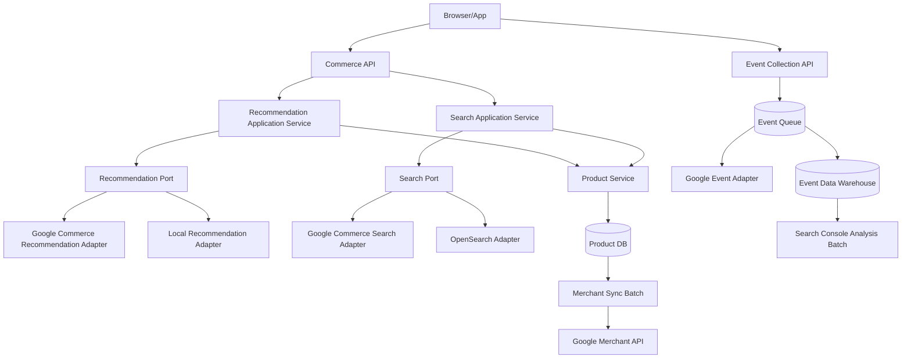


#### 14-13-1. 권장 패키지 구조

```text
com.company.commerce
├─ recommendation
│  ├─ application
│  │  └─ RecommendationService
│  ├─ domain
│  │  ├─ RecommendationRequest
│  │  └─ RecommendedProduct
│  └─ infrastructure
│     ├─ GoogleRecommendationClient
│     └─ LocalRecommendationRepository
├─ search
│  ├─ application
│  └─ infrastructure
│     ├─ GoogleCommerceSearchClient
│     └─ OpenSearchClient
├─ event
│  ├─ EventCollectorController
│  └─ RecommendationEventPublisher
├─ merchant
│  └─ GoogleMerchantSyncService
└─ product
   └─ ProductRepository
```

#### 14-13-2. Port 인터페이스

```java
public interface RecommendationClient {
    RecommendationResult recommend(RecommendationCommand command);
}
```

```java
public interface ProductSearchClient {
    ProductSearchResult search(ProductSearchCommand command);
}
```

```java
public interface RecommendationEventPublisher {
    void publish(RecommendationEvent event);
}
```

#### 14-13-3. Application Service

```java
@Service
public class RecommendationService {
    private final RecommendationClient recommendationClient;
    private final ProductRepository productRepository;
    private final FallbackRecommendationService fallbackService;
    public RecommendationResponse recommend(RecommendationCommand command) {
        try {
            RecommendationResult result =
                    recommendationClient.recommend(command);
            List<Product> products =
                    productRepository.findSaleableProducts(result.getProductIds());
            if (products.isEmpty()) {
                return fallbackService.recommend(command);
            }
            return RecommendationResponse.of(result.getRequestId(), products);
        } catch (RuntimeException ex) {
            return fallbackService.recommend(command);
        }
    }
}
```

### 14-14. Google API 호출 위치

Google API는 브라우저에서 직접 호출하지 않고 서버에서 호출하는 것이 좋습니다.


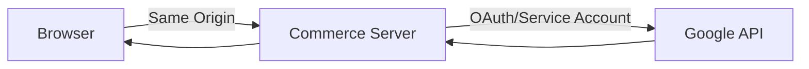


서버 경유 방식의 장점:

- API Key와 인증정보 은닉

- CORS 문제 방지

- Timeout·Retry·Circuit Breaker 적용

- 응답 상품의 판매 여부 재검증

- Google 장애 시 Fallback 가능

- 개인정보 전송 범위 중앙 통제

### 14-15. 실시간 이벤트 처리 권장 구조

상품 노출·클릭 이벤트마다 비즈니스 요청이 Google API 응답을 기다리면 화면 성능이 저하될 수 있습니다.

```text
Browser
→ Commerce Event API
→ Kafka/RabbitMQ
→ Google Event Consumer
→ Google API
```

권장 사항:

|항목|권장 방식|
|---|---|
|이벤트 전송|비동기|
|중복 방지|`eventId` 기반 Idempotency|
|재처리|Retry Queue 또는 DLQ|
|전송 실패|로컬 적재 후 재전송|
|개인정보|최소 정보만 전송|
|토큰·쿠키|로그에서 마스킹|
|응답시간|추천 호출에 짧은 Timeout|
|장애 대응|인기상품 Fallback|

### 14-16. Cold Start 대책

#### 14-16-1. 신규 사용자

```text
국가별 인기상품
+ 현재 유입 검색어
+ 현재 세션 클릭
+ 현재 카테고리
```

#### 14-16-2. 신규 상품

```text
콘텐츠 유사도
+ 카테고리
+ 브랜드
+ 상품 속성
+ 신상품 가중치
```

#### 14-16-3. 신규 서비스

```text
운영 규칙 추천
→ 인기상품
→ 콘텐츠 기반
→ 행동 데이터 누적
→ 협업 필터링
→ ML Ranking
```

추천 품질은 행동 데이터가 축적될수록 개선되며, Google의 추천 서비스도 실시간 이벤트 전송을 중요하게 안내합니다. 일부 개인화 모델은 사용자 이력이 없으면 인기 또는 유사 상품 중심으로 시작합니다. ([Google Cloud Documentation](https://docs.cloud.google.com/retail/docs/faq?utm_source=chatgpt.com "Frequently asked questions | AI Commerce Search in ..."))

### 14-17. 성과 측정 지표

|영역|지표|
|---|---|
|추천 노출|Impression 수|
|사용자 반응|CTR|
|구매 의도|장바구니율, 관심상품률, 문의율|
|최종 전환|CVR, 구매금액|
|수익|Revenue per Session|
|추천 품질|Coverage, Diversity, Novelty|
|검색 품질|Zero Result Rate, 검색 후 클릭률|
|성능|평균·P95 응답시간|
|안정성|Fallback 비율, API 오류율|
|Google의 커머스 추천 모델은 모델 유형에 따라 CTR 또는 세션당 수익 같은 최적화 목표를 지원합니다. 실제 서비스에서는 A/B 테스트로 추천 모델과 화면 위치별 성과를 검증해야 합니다. ([Google Cloud Documentation](https://docs.cloud.google.com/retail/docs/models?utm_source=chatgpt.com "About recommendation models \| AI Commerce Search in ..."))||

### 14-18. 권장 최종 구성

커머스 시스템에는 다음처럼 역할을 분리하는 것이 가장 적절합니다.

|기능|권장 구현|
|---|---|
|개인화 상품추천|자체 추천엔진 또는 Google AI Commerce Search|
|사이트 상품검색|OpenSearch/Elasticsearch 또는 Google AI Commerce Search|
|Google 자연검색 노출|상품 페이지+구조화 데이터+Sitemap|
|Google 쇼핑 노출|Merchant Center+Merchant API|
|Google 유입 분석|Search Console API 일별 수집|
|콘텐츠 통합검색|필요한 경우 Programmable Search|
|추천 장애 대체|카테고리별·국가별 인기상품|


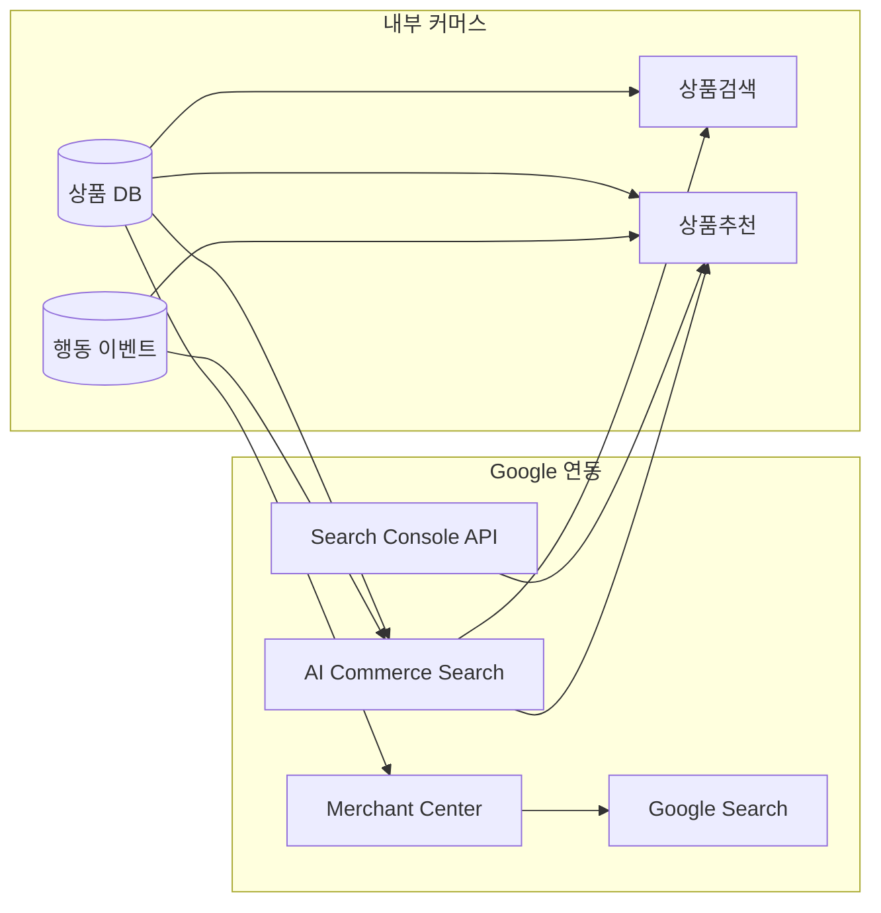


### 14-19. 결론

가장 안정적인 처리 구조는 다음과 같습니다.

```text
1. 내부 상품 DB를 기준 정보로 유지
2. 상품·사용자·행동 이벤트를 추천엔진에 공급
3. 후보 생성 → 점수화 → 운영 필터 → 재정렬
4. 추천엔진은 상품 ID와 점수만 반환
5. 커머스 서버가 최신 가격·재고를 검증 후 노출
6. 노출·클릭·문의·구매 결과를 다시 학습 데이터로 전송
7. Google 검색 노출은 구조화 데이터·Sitemap·Merchant Center로 처리
8. Google Search Console 검색어는 추천의 보조 Trend 신호로 사용
9. 내부 검색과 추천을 Google 기술로 통합하려면 AI Commerce Search 사용
10. Google 장애나 Timeout 발생 시 내부 인기상품으로 Fallback
```

**핵심은 Google 자연검색, Google 쇼핑, 사이트 내부검색, 개인화 상품추천을 하나의 기능으로 혼합하지 않는 것입니다.** 상품 마스터는 커머스 DB가 소유하고, Google과 추천 솔루션은 검색·추천·외부 노출을 담당하는 Adapter로 분리해야 합니다.
<details>
  <summary>참고</summary>  
  <pre>
  </pre>
</details>
