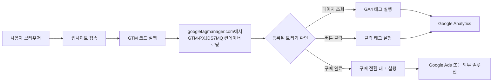
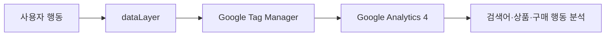
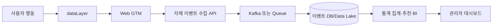
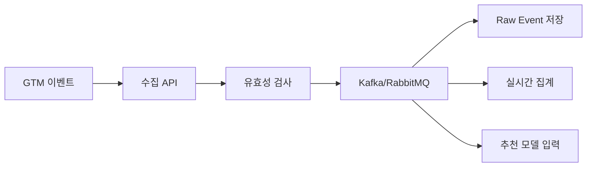
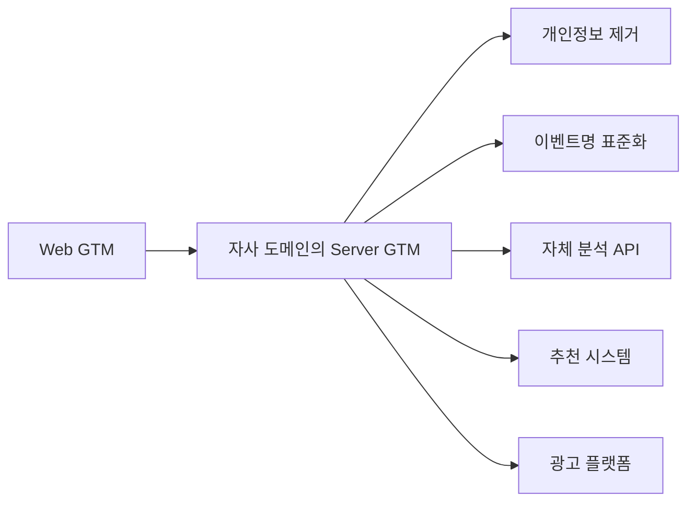
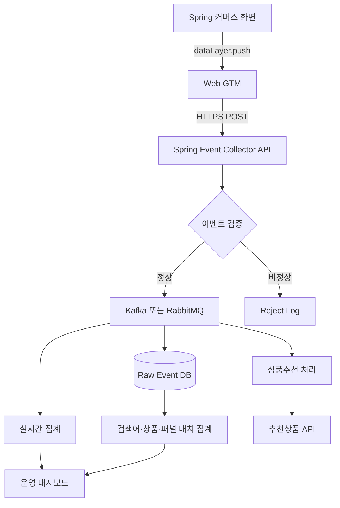
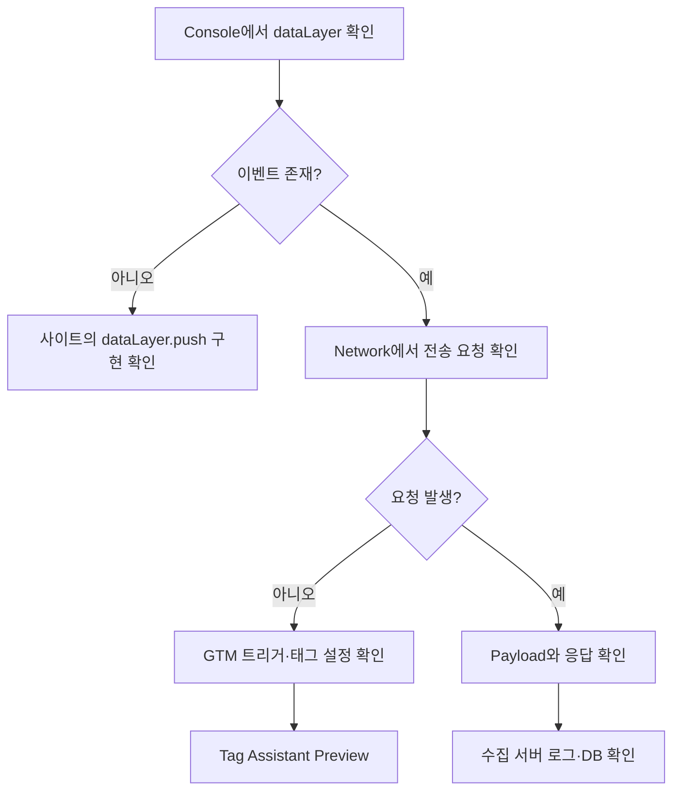
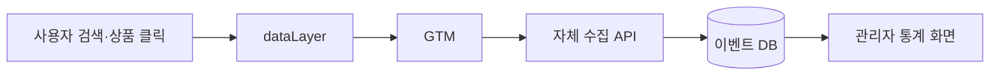

## 1. GTM 설정

- 페이지의 head 에서 최대한 위에 이 코드를 붙여넣으세요.
```html
<!-- Google Tag Manager -->
<script>(function(w,d,s,l,i){w[l]=w[l]||[];w[l].push({'gtm.start':
new Date().getTime(),event:'gtm.js'});var f=d.getElementsByTagName(s)[0],
j=d.createElement(s),dl=l!='dataLayer'?'&l='+l:'';j.async=true;j.src=
'https://www.googletagmanager.com/gtm.js?id='+i+dl;f.parentNode.insertBefore(j,f);
})(window,document,'script','dataLayer','GTM-PXJDS7MQ');</script>
<!-- End Google Tag Manager -->
```

- 2. 여는  body 태그 바로 뒤에 코드를 붙여넣으세요

```html
<!-- Google Tag Manager (noscript) -->
<noscript><iframe src="https://www.googletagmanager.com/ns.html?id=GTM-PXJDS7MQ"
height="0" width="0" style="display:none;visibility:hidden"></iframe></noscript>
<!-- End Google Tag Manager (noscript) -->
```

### 1-1. Google Tag Manager란?

**Google Tag Manager(GTM)**는 웹사이트에 여러 분석·광고 스크립트를 직접 반복해서 넣지 않고, GTM 관리 화면에서 태그를 추가·변경·배포할 수 있게 해주는 **태그 관리 도구**입니다. ([Google for Developers](https://developers.google.com/tag-platform/tag-manager?utm_source=chatgpt.com "About Google Tag Manager | Tag Platform"))  
예를 들어 다음 코드를 사이트에 각각 직접 넣는 대신:

- Google Analytics 4

- Google Ads 전환 측정

- Meta Pixel

- 사용자 클릭 추적

- 커머스 상품 조회·장바구니·구매 추적  
    웹사이트에는 **GTM 코드만 한 번 설치**하고, 이후 GTM 관리 화면에서 필요한 태그를 설정합니다.

### 1-2. 가장 중요한 결론

> 첨부한 코드를 페이지에 넣는 것만으로 모든 사용자 행동 데이터가 자동 수집되는 것은 아닙니다.  
> 이 코드는 `GTM-PXJDS7MQ`라는 GTM 컨테이너를 웹페이지에 불러옵니다. 실제로 어떤 데이터가 어디로 전송되는지는 **해당 컨테이너에 등록·게시된 태그 설정**에 따라 결정됩니다.  
> |GTM 컨테이너 상태|실제 동작|  
> |---|---|  
> |태그가 없는 빈 컨테이너|GTM 스크립트만 로딩되고 분석 데이터는 거의 수집되지 않음|  
> |GA4 태그 등록|페이지 방문·이벤트 데이터를 Google Analytics로 전송|  
> |Google Ads 태그 등록|광고 클릭·전환 데이터를 Google Ads로 전송|  
> |Meta Pixel 등록|이벤트 데이터를 Meta로 전송|  
> |사용자 정의 태그 등록|설정된 외부 API나 자체 서버로 데이터 전송|

### 1-3. 전체 동작 구조





GTM에서는 다음 세 가지가 핵심입니다. 태그는 실제 전송 코드, 트리거는 태그 실행 조건, 변수는 전송할 값입니다. ([구글 도움말](https://support.google.com/tagmanager/answer/6103657?hl=en&utm_source=chatgpt.com "Components of Google Tag Manager"))

|구성요소|의미|예시|
|---|---|---|
|태그(Tag)|실제 실행할 분석·광고 코드|GA4 이벤트 전송|
|트리거(Trigger)|태그를 실행할 조건|페이지가 열렸을 때|
|변수(Variable)|태그에 전달할 데이터|페이지 URL, 상품번호, 가격|

### 1-4. 첫 번째 `head` 코드의 역할

```html
<script>(function(w,d,s,l,i){
    w[l]=w[l]||[];
    w[l].push({
        'gtm.start': new Date().getTime(),
        event:'gtm.js'
    });
    ...
    j.src='https://www.googletagmanager.com/gtm.js?id='+i+dl;
    ...
})(window,document,'script','dataLayer','GTM-PXJDS7MQ');</script>
```

#### 1-4-1. `dataLayer` 생성

```javascript
w[l] = w[l] || [];
```

실제로는 다음과 같습니다.

```javascript
window.dataLayer = window.dataLayer || [];
```

`dataLayer`는 웹페이지와 GTM 사이에서 데이터를 전달하는 JavaScript 배열입니다. 이벤트와 변수 값을 GTM 태그·트리거에 전달할 때 사용됩니다. ([Google for Developers](https://developers.google.com/tag-platform/tag-manager/datalayer?utm_source=chatgpt.com "The data layer | Tag Platform"))

#### 1-4-2. GTM 시작 이벤트 기록

```javascript
dataLayer.push({
    'gtm.start': new Date().getTime(),
    event: 'gtm.js'
});
```

다음 정보를 `dataLayer`에 넣습니다.

|항목|내용|
|---|---|
|`gtm.start`|GTM 실행 시작 시각|
|`event: 'gtm.js'`|GTM 컨테이너가 시작됐다는 내부 이벤트|
|이 값은 우선 **현재 브라우저 메모리의 `dataLayer`에 저장**됩니다. `dataLayer`에 넣었다고 해서 그 자체가 자동으로 GA4나 Google Ads로 전송되는 것은 아닙니다.||

#### 1-4-3. GTM 컨테이너 다운로드

```javascript
j.src =
  'https://www.googletagmanager.com/gtm.js?id=GTM-PXJDS7MQ';
```

사용자 브라우저가 Google 서버에서 `GTM-PXJDS7MQ` 컨테이너의 게시된 설정을 가져옵니다. GTM 컨테이너는 HTTPS를 통해 로드됩니다. ([Google for Developers](https://developers.google.com/tag-platform/tag-manager/protocol-relative-url?utm_source=chatgpt.com "Configure Tag Manager to use protocol-relative URLs"))

#### 1-4-4. 비동기 실행

```javascript
j.async = true;
```

GTM JavaScript 파일을 비동기로 내려받습니다. GTM 다운로드가 완료될 때까지 HTML 전체 처리를 멈추지 않도록 하기 위한 설정입니다.

#### 1-4-5. 왜 `head`의 최대한 위에 넣는가?

페이지가 열린 직후 GTM을 빠르게 시작해야 초기 페이지 조회, 광고 유입, 사용자 행동 이벤트를 놓칠 가능성이 작아집니다. Google도 첫 번째 코드를 `<head>`의 가능한 한 위쪽에 배치하도록 안내합니다. ([구글 도움말](https://support.google.com/tagmanager/answer/14847097?hl=en&utm_source=chatgpt.com "2. Install a web container - Tag Manager Help"))

### 1-5. 두 번째 `body` 코드의 역할

```html
<noscript>
    <iframe
        src="https://www.googletagmanager.com/ns.html?id=GTM-PXJDS7MQ"
        height="0"
        width="0"
        style="display:none;visibility:hidden">
    </iframe>
</noscript>
```

`<noscript>`는 사용자의 브라우저에서 JavaScript가 비활성화되었을 때만 실행됩니다. ([MDN Web Docs](https://developer.mozilla.org/en-US/docs/Web/HTML/Reference/Elements/noscript?utm_source=chatgpt.com "<noscript> HTML noscript element - MDN Web Docs"))

|상황|동작|
|---|---|
|JavaScript 활성화|`noscript` 부분은 실행되지 않음|
|JavaScript 비활성화|숨겨진 iframe으로 GTM 대체 페이지 호출|
|다만 JavaScript가 꺼진 상태에서는 클릭 감지, `dataLayer.push()`, 동적 이벤트 같은 기능을 실행할 수 없으므로 **추적 기능이 매우 제한적**입니다.||
|Google은 이 코드를 여는 `<body>` 태그 바로 뒤에 넣도록 안내합니다. ([구글 도움말](https://support.google.com/tagmanager/answer/14847097?hl=de&utm_source=chatgpt.com "2. Webcontainer installieren - Tag Manager-Hilfe"))||

### 1-6. 어떤 데이터가 수집될 수 있는가?

GTM에 GA4 등의 태그가 설정되어 있다면 다음 데이터가 수집될 수 있습니다.

|구분|가능한 데이터 예시|
|---|---|
|페이지 정보|전체 URL, 도메인, 페이지 경로, 페이지 제목|
|유입 정보|이전 페이지 Referrer, 소스, 매체, 캠페인|
|기기 정보|브라우저, 운영체제, 화면 해상도, 기기 유형|
|사용자 행동|페이지 조회, 링크 클릭, 버튼 클릭, 스크롤|
|커머스 데이터|상품번호, 상품명, 가격, 수량, 장바구니, 구매금액|
|전환 데이터|회원가입, 문의 완료, 주문 완료|
|기술 데이터|오류 메시지, 이벤트 발생 시각|
|GTM에는 Page URL, Referrer, Click ID, Click Text, Click URL, Form ID, Scroll Depth 등의 내장 변수가 있습니다. 다만 실제 전송 여부는 태그와 트리거 설정에 따라 달라집니다. ([구글 도움말](https://support.google.com/tagmanager/answer/7182738?hl=en&utm_source=chatgpt.com "Built-in variables for web containers - Tag Manager Help"))||

### 1-7. 데이터가 저장되는 위치

#### 1-7-1. `dataLayer`

```javascript
dataLayer.push({
    event: 'view_item',
    item_id: 'P10001',
    item_name: '사과',
    price: 15000
});
```

이 데이터는 먼저 사용자 브라우저의 JavaScript 메모리에 들어갑니다.

```text
window.dataLayer
```

`dataLayer`는 데이터의 최종 저장소가 아니라 **태그로 데이터를 전달하는 임시 전달 영역**입니다. ([구글 도움말](https://support.google.com/tagmanager/answer/6103657?hl=en&utm_source=chatgpt.com "Components of Google Tag Manager"))

#### 1-7-2. GTM 서버

GTM 계정에는 주로 다음 설정 정보가 저장됩니다.

- 태그 설정

- 트리거 설정

- 변수 설정

- 컨테이너 버전

- 게시 이력  
    GTM 자체는 일반적으로 사용자 행동을 조회하는 분석 보고서가 아닙니다.

#### 1-7-3. Google Analytics

GTM에 GA4 태그가 있다면 다음과 같이 처리됩니다.

```text
브라우저
 → dataLayer
 → GTM의 GA4 태그
 → Google Analytics 데이터 스트림
 → GA4 보고서
```

GA4에서는 페이지 로드, 클릭, 구매 등의 행동을 이벤트 형태로 측정합니다. ([구글 도움말](https://support.google.com/analytics/answer/9322688?hl=en&utm_source=chatgpt.com "About events - Analytics Help"))

#### 1-7-4. Google Ads

Google Ads 전환 태그가 있다면:

```text
주문 완료
 → GTM 트리거 실행
 → Google Ads 전환 태그 실행
 → Google Ads 계정
```

#### 1-7-5. 외부 솔루션

Meta, Hotjar, 자체 추천 솔루션, 마케팅 솔루션 태그가 등록되어 있다면 사용자 브라우저가 해당 업체 서버로 직접 데이터를 보낼 수 있습니다. 클라이언트 측 태깅에서는 사용자 브라우저가 제3자 서버와 직접 통신합니다. ([구글 도움말](https://support.google.com/tagmanager/answer/13387731?hl=en&utm_source=chatgpt.com "Client-side tagging vs. server-side tagging - Tag Manager ..."))

### 1-8. 데이터 흐름 요약

|단계|데이터 위치|설명|
|--:|---|---|
|1|사용자 브라우저|페이지 접속|
|2|`window.dataLayer`|이벤트와 값을 임시 저장|
|3|GTM 컨테이너|어떤 태그를 실행할지 판단|
|4|GA4·Ads·외부 솔루션|실제 이벤트 데이터 전송|
|5|각 솔루션의 계정|보고서 및 통계 데이터 저장|

### 1-9. 예시: 상품 구매 데이터 수집

웹사이트에서 구매 완료 시 다음 코드를 실행할 수 있습니다.

```javascript
window.dataLayer = window.dataLayer || [];
window.dataLayer.push({
    event: 'purchase',
    ecommerce: {
        transaction_id: 'ORDER-20260617-001',
        value: 50000,
        currency: 'KRW',
        items: [
            {
                item_id: 'GOODS-1001',
                item_name: '테스트 상품',
                price: 50000,
                quantity: 1
            }
        ]
    }
});
```

GTM에서 다음과 같이 설정합니다.

|GTM 구성|설정|
|---|---|
|트리거|이벤트 이름이 `purchase`일 때|
|태그|GA4 구매 이벤트|
|변수|주문번호, 상품번호, 가격, 수량|
|결과적으로 구매 데이터가 GA4 속성으로 전송되어 구매 건수·매출액 등의 보고서를 만들 수 있습니다.||

### 1-10. Google 검색어도 알 수 있는가?

GTM을 설치해도 사용자가 Google에서 입력한 검색어를 브라우저에서 직접 알아내는 것은 일반적으로 불가능합니다.  
GTM의 `Referrer` 변수를 통해 다음 정도는 판단할 수 있습니다.

```text
Google에서 유입됨
이전 주소가 google.com임
```

하지만 다음처럼 사용자가 검색한 정확한 단어:

```text
korean
```

가 Referrer에 포함되지 않았다면 GTM도 이를 복원할 수 없습니다.  
Google 자연검색 검색어는 **Google Search Console의 검색 실적 보고서**에서 사이트 단위의 검색어, 노출, 클릭 정보를 확인해야 합니다. Search Console과 GA4를 연결하면 일부 검색 실적을 GA4에서도 분석할 수 있지만, 개별 방문자와 특정 검색어를 직접 일대일 연결하는 방식은 아닙니다. ([구글 도움말](https://support.google.com/webmasters/answer/7576553?hl=en&utm_source=chatgpt.com "Performance report (Search results): Overview and basic ..."))

### 1-11. 첨부된 코드만 보고 알 수 있는 것과 없는 것

#### 1-11-1. 알 수 있는 것

|항목|내용|
|---|---|
|GTM 사용 여부|사용 중|
|컨테이너 ID|`GTM-PXJDS7MQ`|
|로딩 방식|웹 브라우저 기반 클라이언트 GTM|
|dataLayer 이름|기본값인 `dataLayer`|

#### 1-11-2. 알 수 없는 것

|항목|이유|
|---|---|
|GA4가 설정되었는지|컨테이너 내부 설정 확인 필요|
|어떤 클릭을 수집하는지|트리거 확인 필요|
|어디로 데이터를 보내는지|태그 설정 확인 필요|
|상품·회원 정보를 보내는지|dataLayer와 태그 확인 필요|
|광고 리마케팅을 하는지|Google Ads·외부 픽셀 확인 필요|
|정확한 수집 내용을 확인하려면 다음을 조사해야 합니다.||

1. GTM 관리 화면의 `태그`, `트리거`, `변수`

2. GTM의 현재 게시 버전

3. 브라우저 개발자 도구의 `Network`

4. Tag Assistant의 미리보기 결과

5. 페이지에서 실행되는 `dataLayer`

### 1-12. 개인정보 측면의 주의사항

`dataLayer`에는 다음 값을 그대로 넣지 않는 것이 안전합니다.

```text
이름
이메일 주소
전화번호
주민등록번호
주소
인증 토큰
세션 ID
비밀번호
```

`dataLayer`는 브라우저 개발자 도구에서 확인할 수 있고, 설정된 태그가 해당 값을 외부 서비스로 전송할 수도 있습니다. Google 서비스가 포함된 사이트에서는 브라우저가 방문 URL, IP 주소 등의 정보를 Google에 전달할 수 있으며 쿠키가 사용될 수 있습니다. ([정책 - 구글](https://policies.google.com/technologies/partner-sites?hl=en-US&utm_source=chatgpt.com "How Google uses information from sites or apps that use our ..."))  
따라서 운영 환경에서는 최소한 다음을 확인해야 합니다.

- 개인정보 처리방침 반영

- 분석·광고 쿠키 동의 정책

- 동의 전 광고·분석 태그 실행 제한

- GTM 사용자 및 게시 권한 통제

- 개발·검증·운영 컨테이너 분리

### 1-13. 결론

첨부한 두 코드는 다음 역할을 합니다.

> 웹사이트와 `GTM-PXJDS7MQ` 컨테이너를 연결하여, GTM 내부에 게시된 분석·광고·외부 솔루션 태그가 사용자 브라우저에서 실행될 수 있도록 합니다.  
> 하지만 **이 코드 자체만으로 어떤 사용자 데이터를 수집하는지는 확정할 수 없습니다.** 실제 수집 범위와 전송 목적지는 `GTM-PXJDS7MQ`에 등록된 태그·트리거·변수·`dataLayer` 내용을 확인해야 합니다.

## 2. Tag 추가로 인해 사용자가 사이트에서 검색한 검색어, 클릭한 상품 등의 사용자 행동 패턴에 대한 분석이 가능한가?
### 2-1. 결론

**가능합니다.** 사이트 내부에서 사용자가 입력한 검색어, 클릭한 상품, 장바구니 추가, 구매까지의 행동을 추적하여 다음과 같은 분석을 할 수 있습니다.

> `검색 → 검색 결과 확인 → 상품 클릭 → 상품 상세 조회 → 장바구니 → 결제 → 구매`  
> 다만, **현재의 GTM 설치 코드만 추가했다고 모든 행동이 자동으로 수집되는 것은 아닙니다.**  
> 사이트에서 행동이 발생할 때 필요한 정보를 `dataLayer`에 넣고, GTM에서 이를 GA4 등으로 전송하도록 설정해야 합니다. GTM은 데이터를 임시로 받아 전달하는 역할이고, 실제 저장·보고서 분석은 일반적으로 GA4가 담당합니다. ([구글 도움말](https://support.google.com/tagmanager/answer/6103657?hl=en&utm_source=chatgpt.com "Components of Google Tag Manager"))

### 2-2. GTM과 GA4의 역할

|구성요소|쉽게 설명하면|담당 기능|
|---|---|---|
|웹사이트|행동 발생 장소|검색, 상품 클릭, 장바구니, 구매|
|`dataLayer`|행동 정보를 담는 바구니|검색어, 상품번호, 가격 등을 임시 저장|
|GTM|정보 전달 관리자|어떤 행동을 언제 GA4로 보낼지 판단|
|GA4|분석 시스템|데이터 저장, 통계·보고서·사용자 흐름 분석|





### 2-3. 사이트 내부 검색어 추적

예를 들어 사용자가 사이트 검색창에서 다음 검색어를 입력했다고 가정합니다.

```text
korean cosmetics
```

검색 버튼을 누르거나 검색 결과가 표시될 때 다음과 같은 이벤트를 발생시킬 수 있습니다.

```javascript
window.dataLayer = window.dataLayer || [];
window.dataLayer.push({
    event: 'view_search_results',
    search_term: 'korean cosmetics'
});
```

GTM이 이 이벤트를 GA4로 전달하면 다음 정보를 분석할 수 있습니다.

|추적 가능한 정보|분석 예시|
|---|---|
|사용자가 입력한 검색어|`korean cosmetics`|
|검색 횟수|해당 검색어가 몇 번 검색되었는지|
|검색 사용자 수|몇 명이 검색했는지|
|검색한 페이지|어느 화면에서 검색했는지|
|검색 시각|언제 검색이 많았는지|
|검색 후 클릭한 상품|검색 결과에서 어떤 상품을 선택했는지|
|검색 후 구매 여부|검색 사용자가 실제 구매했는지|
|검색 결과 없음|검색했지만 결과가 없었던 단어|
|GA4는 `view_search_results`와 `search_term`을 사이트 검색 측정을 위한 권장 이벤트와 매개변수로 지원하지만, 사이트가 검색어를 이벤트에 담아 보내도록 구현해야 정확히 수집됩니다. ([구글 도움말](https://support.google.com/analytics/answer/9267735?hl=en&utm_source=chatgpt.com "[GA4] Recommended events - Analytics Help"))||

#### 2-3-1. 검색어 분석으로 알 수 있는 것

예를 들어 다음과 같은 보고서를 만들 수 있습니다.

|검색어|검색 수|상품 클릭 수|장바구니 수|구매 수|구매 전환율|
|---|--:|--:|--:|--:|--:|
|korean cosmetics|1,000|430|120|50|5.0%|
|face mask|800|500|180|90|11.3%|
|red ginseng|500|100|20|5|1.0%|
|이를 통해 다음을 판단할 수 있습니다.||||||

- 고객이 실제로 원하는 상품

- 검색은 많지만 상품이 부족한 키워드

- 검색 결과가 부정확한 키워드

- 구매 전환율이 높은 검색어

- 검색 결과는 많지만 클릭되지 않는 검색어

- 검색 후 바로 이탈하는 검색어

### 2-4. 검색 결과에서 클릭한 상품 추적

사용자가 검색 결과에서 상품을 클릭할 때 다음 정보를 전달할 수 있습니다.

```javascript
window.dataLayer.push({
    event: 'select_item',
    ecommerce: {
        item_list_name: 'search_results',
        items: [{
            item_id: 'P10001',
            item_name: 'Korean Face Mask',
            item_category: 'Cosmetics',
            price: 15000,
            index: 2
        }]
    }
});
```

추적 가능한 정보는 다음과 같습니다.

|항목|예시|의미|
|---|---|---|
|상품번호|`P10001`|클릭한 상품의 고유번호|
|상품명|Korean Face Mask|클릭한 상품 이름|
|카테고리|Cosmetics|상품 분류|
|가격|15,000원|클릭 당시 가격|
|목록 이름|search_results|검색 결과에서 클릭했는지|
|노출 순서|2|검색 결과 몇 번째 상품인지|
|검색어|korean cosmetics|어떤 검색을 통해 클릭했는지|
|`select_item` 이벤트는 목록이나 검색 결과에서 사용자가 특정 상품을 선택한 행동을 측정할 때 사용할 수 있습니다. 전자상거래 이벤트에는 상품을 `items` 배열로 전달하여 상품별 행동을 분석할 수 있습니다. ([Google for Developers](https://developers.google.com/analytics/devguides/collection/ga4/ecommerce?utm_source=chatgpt.com "Analytics - Measure ecommerce"))|||

### 2-5. 상품 관련 추적 가능 정보

커머스 사이트에서는 다음 이벤트를 단계별로 추적할 수 있습니다.

|사용자 행동|GA4 권장 이벤트|추적할 수 있는 정보|
|---|---|---|
|상품 목록 노출|`view_item_list`|노출된 상품, 순서, 목록명|
|상품 클릭|`select_item`|클릭한 상품, 순서, 검색어|
|상품 상세 조회|`view_item`|조회 상품, 가격, 카테고리|
|장바구니 추가|`add_to_cart`|추가 상품, 수량, 금액|
|장바구니 제거|`remove_from_cart`|제거 상품, 수량|
|장바구니 조회|`view_cart`|장바구니 구성과 총금액|
|결제 시작|`begin_checkout`|결제를 시작한 상품과 금액|
|배송정보 입력|`add_shipping_info`|선택한 배송 방법|
|결제정보 입력|`add_payment_info`|결제수단 종류|
|구매 완료|`purchase`|주문번호, 상품, 금액, 쿠폰|
|환불|`refund`|환불 주문과 상품|
|GA4의 전자상거래 이벤트는 인기 상품, 상품 배치 효과, 장바구니와 구매 행동 등을 분석하도록 설계되어 있습니다. 단, 이러한 전자상거래 이벤트는 자동으로 완성되는 것이 아니라 사이트에서 필요한 상품 정보를 전송해야 합니다. ([Google for Developers](https://developers.google.com/analytics/devguides/collection/ga4/ecommerce?utm_source=chatgpt.com "Analytics - Measure ecommerce"))|||

### 2-6. 일반적인 사용자 행동 추적

상품과 검색 이외에도 다음 행동을 추적할 수 있습니다.

|구분|추적 가능한 정보|
|---|---|
|페이지 방문|페이지 URL, 제목, 방문 횟수|
|메뉴 사용|클릭한 메뉴와 메뉴 위치|
|배너 클릭|클릭한 배너, 배너 순서, 캠페인명|
|버튼 클릭|로그인, 회원가입, 상담, 다운로드 버튼|
|스크롤|페이지의 25%, 50%, 75%, 90% 지점 도달|
|파일 다운로드|다운로드한 파일명과 형식|
|외부 링크|사이트 밖으로 이동한 URL|
|동영상|재생, 일시 정지, 재생 완료|
|폼 사용|문의 시작, 입력 오류, 제출 완료|
|오류|검색 결과 없음, 결제 실패, API 오류|
|체류 행동|페이지 체류시간, 참여 세션|
|일부 페이지 조회·스크롤·외부 링크·파일 다운로드 등의 동작은 GA4의 향상된 측정 기능으로 수집할 수 있지만, 버튼이나 업무상 중요한 행동은 별도 이벤트 설정이 더 정확합니다. 사용자 정의 동작은 GTM의 사용자 정의 이벤트 트리거로 처리할 수 있습니다. ([구글 도움말](https://support.google.com/tagmanager/answer/7679219?hl=en&utm_source=chatgpt.com "Custom event trigger - Tag Manager Help"))||

### 2-7. 유입 경로 추적

사용자가 사이트에 어떤 경로로 들어왔는지도 분석할 수 있습니다.

|추적 정보|예시|
|---|---|
|유입 소스|Google, Naver, Facebook, 직접 접속|
|매체|자연검색, 유료광고, 이메일, 추천 링크|
|캠페인|여름 할인 캠페인|
|이전 페이지|사이트로 이동하기 전 페이지|
|광고 정보|UTM 캠페인명, 광고 그룹 등|
|최초 방문 페이지|사용자가 처음 들어온 랜딩 페이지|
|예를 들어 다음과 같은 분석이 가능합니다.||

```text
Google 광고로 방문
→ 'korean cosmetics' 사이트 내부 검색
→ Face Mask 상품 클릭
→ 장바구니 추가
→ 구매 완료
```

단, **Google 검색창에서 사용자가 입력한 외부 자연검색 키워드**는 GTM만으로 방문자별 정확한 검색어를 알아내기 어렵습니다. 반면, 사용자가 **해당 사이트 내부 검색창에 입력한 검색어**는 사이트에서 이벤트로 전송하면 정확하게 분석할 수 있습니다.

### 2-8. 분석 가능한 사용자 행동 패턴

데이터가 정상적으로 수집되면 단순히 클릭 수만 보는 것이 아니라 행동 간 관계를 분석할 수 있습니다.

#### 2-8-1. 검색 후 구매 흐름

```text
내부 검색
→ 검색 결과 노출
→ 상품 선택
→ 상품 상세
→ 장바구니
→ 결제
→ 구매
```

각 단계에서 몇 명이 이탈했는지 확인할 수 있습니다. GA4의 구매 여정 보고서도 결제 단계별 이탈을 파악하는 용도로 제공됩니다. ([구글 도움말](https://support.google.com/analytics/answer/13128171?co=GENIE.Platform%3DDesktop&hl=en&utm_source=chatgpt.com "Purchase journey report - Computer - Analytics Help"))

#### 2-8-2. 검색어별 성과

```text
어떤 검색어가 구매로 많이 연결되는가?
어떤 검색어는 검색만 하고 바로 나가는가?
검색 결과가 없는 검색어는 무엇인가?
```

#### 2-8-3. 상품별 성과

```text
많이 노출되지만 클릭이 적은 상품
클릭은 많지만 구매되지 않는 상품
장바구니에는 많이 담기지만 결제에서 포기하는 상품
조회 대비 구매 전환율이 높은 상품
```

#### 2-8-4. 상품 진열 위치 분석

```text
검색 결과 1번째 상품과 10번째 상품의 클릭률 차이
상단 배너 상품과 일반 목록 상품의 구매율 차이
추천 영역별 클릭률과 매출 차이
```

#### 2-8-5. 사용자 유형 분석

```text
검색을 사용하는 고객과 사용하지 않는 고객의 구매율
신규 방문자와 재방문자의 관심 상품
모바일 사용자와 PC 사용자의 구매 차이
로그인 사용자와 비로그인 사용자의 행동 차이
```

### 2-9. 실제로 생성할 수 있는 보고서

|보고서|알 수 있는 내용|
|---|---|
|인기 검색어|고객이 가장 많이 찾는 키워드|
|검색 결과 없음|상품 또는 검색 사전 보완 대상|
|검색어별 클릭률|검색 결과의 정확도|
|상품별 조회·클릭|고객 관심 상품|
|상품별 장바구니율|구매 관심이 높은 상품|
|상품별 구매 전환율|실제 판매 효과|
|구매 퍼널|어느 단계에서 이탈하는지|
|추천상품 성과|추천 영역이 구매에 미친 영향|
|유입 채널별 성과|Google·Naver·광고별 매출|
|기기별 성과|모바일·PC의 사용성 차이|

### 2-10. 설치 코드만으로 가능한 것과 추가 개발이 필요한 것

|항목|GTM 코드만 설치|추가 설정·개발 필요|
|---|:-:|:-:|
|GTM 컨테이너 로딩|가능|-|
|기본 페이지 조회|컨테이너에 GA4 설정이 있으면 가능|GA4 태그 필요|
|사이트 내부 검색어|대부분 불가능|검색어 이벤트 필요|
|클릭한 상품번호·상품명|불가능|상품 클릭 이벤트 필요|
|상품 가격·카테고리|불가능|상품 데이터 전달 필요|
|장바구니 상품|불가능|`add_to_cart` 이벤트 필요|
|구매금액·주문번호|불가능|`purchase` 이벤트 필요|
|검색에서 구매까지 연결|불가능|전체 단계 이벤트 필요|
|버튼 클릭|일부 DOM 기반 추적 가능|업무 이벤트 설정 권장|
|즉, 첨부된 코드는 **측정 장비를 사이트에 연결한 상태**에 가깝습니다.|||

```text
GTM 코드 설치
= CCTV 카메라 설치
이벤트·태그 설정
= 무엇을 촬영할지 설정
GA4 연결
= 촬영 데이터를 저장하고 분석
```

### 2-11. 권장 커머스 추적 설계

최소한 다음 이벤트를 구현하는 것이 좋습니다.

|우선순위|이벤트|목적|
|--:|---|---|
|1|`view_search_results`|사이트 내부 검색어 분석|
|2|`view_item_list`|검색·카테고리 상품 노출 분석|
|3|`select_item`|클릭한 상품 분석|
|4|`view_item`|상품 상세 조회 분석|
|5|`add_to_cart`|장바구니 전환 분석|
|6|`begin_checkout`|결제 시작 분석|
|7|`purchase`|구매·매출 분석|
|8|`search_no_result`|검색 결과 없음 분석|
|검색 결과 없음은 다음처럼 사용자 정의 이벤트로 구현할 수 있습니다.|||

```javascript
window.dataLayer.push({
    event: 'search_no_result',
    search_term: '찾을 수 없는 상품명',
    result_count: 0
});
```

### 2-12. 개인별 추적 가능 범위

일반적으로 GA4는 다음과 같이 분석합니다.

|상황|분석 범위|
|---|---|
|비로그인 사용자|브라우저·기기 기반의 익명 또는 가명 사용자 단위|
|로그인 사용자|자체 `user_id`를 연동하면 세션 간 행동 연결 가능|
|다른 기기 사용|User-ID를 동일하게 설정한 로그인 환경에서 연결 가능|
|이름·이메일·전화번호|GA4로 직접 전송하면 안 됨|
|로그인 회원에게 개인정보가 아닌 자체 식별자인 `User-ID`를 설정하면 서로 다른 세션이나 기기에서 발생한 행동을 연결할 수 있습니다. 하지만 이름, 이메일, 휴대전화번호 등 개인식별정보를 GA4에 보내는 것은 Google 정책상 금지됩니다. ([구글 도움말](https://support.google.com/analytics/answer/6366371?hl=en&utm_source=chatgpt.com "Best practices to avoid sending Personally Identifiable ..."))||

### 2-13. 최종 정리

첨부된 GTM 코드를 기반으로 사용자 행동 분석은 가능하지만, 다음과 같이 구분해야 합니다.

> **GTM 설치만 한 상태:** 페이지에 GTM 관리 기능을 연결한 것  
> **이벤트까지 구현한 상태:** 검색어, 클릭 상품, 장바구니, 구매 행동을 수집할 수 있는 상태  
> **GA4 보고서까지 구성한 상태:** 검색·상품·구매의 전체 행동 패턴을 분석할 수 있는 상태  
> 가장 가치 있는 분석은 다음 흐름입니다.

```text
사용자가 어떤 검색어를 입력했는가
→ 어떤 상품이 노출되었는가
→ 어떤 상품을 클릭했는가
→ 장바구니에 담았는가
→ 실제로 구매했는가
```

이를 구현하면 **인기 검색어, 검색 정확도, 인기 상품, 이탈 단계, 구매 전환율, 추천상품 효과**까지 분석할 수 있습니다.

## 3. Google Tag Manager 에서 수집한 정보를 GA4 사용 없이 직접 응용 가공하는 것은 가능 여부

### 3-1. 결론

**가능합니다.** GA4를 사용하지 않고도 GTM으로 사용자 행동 이벤트를 감지하여 **자체 API·DB·Kafka·로그 시스템으로 전송한 뒤 직접 가공·분석**할 수 있습니다.  
다만 표현을 정확히 하면:

> GTM이 데이터를 장기간 저장하거나 분석하는 것이 아니라, 웹페이지에서 발생한 이벤트를 감지해 지정한 시스템으로 전달합니다.  
> `dataLayer`는 이벤트와 값을 태그에 전달하는 JavaScript 객체이며, GTM은 이벤트 조건에 맞는 태그를 실행합니다. `dataLayer` 값도 기본적으로 현재 페이지 범위에서만 유지되므로, 분석하려면 별도 서버에 저장해야 합니다. ([Google for Developers](https://developers.google.com/tag-platform/tag-manager/datalayer "The data layer  |  Tag Platform  |  Google for Developers"))

### 3-2. GA4 없이 사용하는 기본 구조





예를 들면 다음과 같이 처리합니다.

```text
사용자가 '마스크팩' 검색
→ 사이트가 dataLayer에 search 이벤트 기록
→ GTM이 search 이벤트 감지
→ 자체 /collect/v1/events API 호출
→ DB에 검색 이벤트 저장
→ 인기 검색어·검색 후 구매율 계산
```

### 3-3. 가능한 활용 방식 비교

|방식|구조|적합한 경우|
|---|---|---|
|클라이언트 직접 전송|Web GTM → 자체 API|가장 단순한 구축|
|서버사이드 GTM 사용|Web GTM → Server GTM → 자체 API/DB|개인정보 통제, 데이터 정제, 다중 전송|
|외부 분석 솔루션 연결|Web GTM → 다른 분석 플랫폼|GA4만 제외하고 분석 제품은 사용할 경우|
|이미지 픽셀 전송|Web GTM → 이미지 요청 URL|단순 조회·클릭 카운트|
|GTM은 기본 지원되지 않는 전송 방식도 Custom HTML, Custom Image, Custom Template으로 구현할 수 있습니다. Google은 가능하면 권한이 제한된 Sandboxed JavaScript 기반 템플릿 사용을 권장합니다. ([구글 도움말](https://support.google.com/tagmanager/answer/6107167?hl=en "Custom tags - Tag Manager Help"))|||

### 3-4. 가장 권장하는 방식: GTM에서 자체 API로 전송

#### 3-4-1. 사이트에서 업무 이벤트 생성

상품 검색 시:

```javascript
window.dataLayer = window.dataLayer || [];
window.dataLayer.push({
    event: 'site_search',
    search_term: '마스크팩',
    result_count: 37,
    page_type: 'search_result'
});
```

검색 결과에서 상품 클릭 시:

```javascript
window.dataLayer.push({
    event: 'product_select',
    search_term: '마스크팩',
    item_id: 'P10001',
    item_name: '수분 마스크팩',
    item_category: '화장품',
    item_price: 15000,
    item_list_name: 'search_result',
    item_position: 3
});
```

장바구니 추가 시:

```javascript
window.dataLayer.push({
    event: 'add_to_cart',
    item_id: 'P10001',
    item_name: '수분 마스크팩',
    quantity: 2,
    item_price: 15000
});
```

GTM은 `event` 값을 기준으로 태그를 실행할 수 있으며, 이벤트와 함께 전달된 변수도 태그에서 사용할 수 있습니다. ([Google for Developers](https://developers.google.com/tag-platform/tag-manager/datalayer "The data layer  |  Tag Platform  |  Google for Developers"))

#### 3-4-2. GTM 변수 등록

GTM의 `변수 → 사용자 정의 변수 → 데이터 영역 변수`에서 다음을 등록합니다.

|GTM 변수명|dataLayer 변수명|
|---|---|
|`DLV - search_term`|`search_term`|
|`DLV - result_count`|`result_count`|
|`DLV - item_id`|`item_id`|
|`DLV - item_name`|`item_name`|
|`DLV - item_price`|`item_price`|
|`DLV - item_position`|`item_position`|

#### 3-4-3. 사용자 정의 이벤트 트리거 등록

|트리거명|이벤트 이름|
|---|---|
|`TRG - Site Search`|`site_search`|
|`TRG - Product Select`|`product_select`|
|`TRG - Add To Cart`|`add_to_cart`|

#### 3-4-4. 자체 API 호출 태그 생성

간단하게는 GTM의 Custom HTML 태그에서 자체 수집 API를 호출할 수 있습니다.

```html
<script>
(function () {
    var payload = {
        eventName: {{Event}},
        occurredAt: new Date().toISOString(),
        pageUrl: location.href,
        referrer: document.referrer || null,
        searchTerm: {{DLV - search_term}} || null,
        resultCount: {{DLV - result_count}} || null,
        itemId: {{DLV - item_id}} || null,
        itemName: {{DLV - item_name}} || null,
        itemPrice: {{DLV - item_price}} || null,
        itemPosition: {{DLV - item_position}} || null
    };
    fetch('/collect/v1/events', {
        method: 'POST',
        headers: {
            'Content-Type': 'application/json'
        },
        credentials: 'same-origin',
        keepalive: true,
        body: JSON.stringify(payload)
    }).catch(function () {
        // 분석 이벤트 전송 실패가 업무 화면에 영향을 주지 않도록 처리
    });
})();
</script>
```

실제 운영 환경에서는 Custom HTML보다 **자체 Custom Template**을 만들어 허용된 URL과 데이터만 전송하도록 제한하는 편이 안전합니다. Custom Template은 쿠키·로컬 스토리지·전송 URL 등에 대한 접근 권한을 명시적으로 제한할 수 있습니다. ([Google for Developers](https://developers.google.com/tag-platform/tag-manager/templates/permissions "Custom template permissions  |  Google Tag Manager Templates  |  Google for Developers"))

### 3-5. 자체 API에서 저장할 데이터

다음과 같은 공통 이벤트 포맷을 권장합니다.

```json
{
  "eventId": "0198f451-76a2-7d13-aaf3-111111111111",
  "eventName": "product_select",
  "occurredAt": "2026-06-17T01:30:10.125Z",
  "anonymousId": "a8f21d93...",
  "userId": null,
  "sessionId": "s-20260617-001",
  "page": {
    "url": "/search?q=마스크팩",
    "referrer": "/main",
    "deviceType": "mobile"
  },
  "search": {
    "term": "마스크팩",
    "resultCount": 37
  },
  "item": {
    "id": "P10001",
    "name": "수분 마스크팩",
    "category": "화장품",
    "price": 15000,
    "listName": "search_result",
    "position": 3
  }
}
```

#### 3-5-1. 권장 DB 컬럼

|컬럼|내용|
|---|---|
|`event_id`|중복 저장 방지용 이벤트 ID|
|`event_name`|검색, 상품 클릭, 장바구니 등|
|`occurred_at`|브라우저에서 발생한 시각|
|`received_at`|서버에서 수신한 시각|
|`anonymous_id`|비로그인 사용자 가명 식별자|
|`user_id`|로그인 회원 내부 식별자|
|`session_id`|한 번의 방문 흐름 식별|
|`page_url`|이벤트가 발생한 페이지|
|`referrer`|이전 페이지|
|`search_term`|사이트 내부 검색어|
|`item_id`|상품번호|
|`item_list_name`|검색 결과·추천 영역 등|
|`item_position`|상품 노출 순서|
|`properties`|추가 정보를 저장하는 JSON|

### 3-6. Spring 5.3 자체 수집 API 예시

```java
@RestController
@RequestMapping("/collect/v1/events")
public class EventCollectController {
    private final EventCollectService eventCollectService;
    public EventCollectController(EventCollectService eventCollectService) {
        this.eventCollectService = eventCollectService;
    }
    @PostMapping
    @ResponseStatus(HttpStatus.NO_CONTENT)
    public void collect(
            @Valid @RequestBody EventCollectRequest request,
            HttpServletRequest servletRequest) {
        EventCollectCommand command = EventCollectCommand.builder()
                .eventId(request.getEventId())
                .eventName(request.getEventName())
                .occurredAt(request.getOccurredAt())
                // 브라우저 값만 신뢰하지 않고 서버 수신 시각도 별도 저장
                .receivedAt(Instant.now())
                .anonymousId(request.getAnonymousId())
                .userId(resolveAuthenticatedUserId())
                .sessionId(request.getSessionId())
                .pageUrl(request.getPageUrl())
                .referrer(request.getReferrer())
                .searchTerm(request.getSearchTerm())
                .itemId(request.getItemId())
                .properties(request.getProperties())
                .build();
        eventCollectService.collect(command);
    }
    private String resolveAuthenticatedUserId() {
        // Spring Security 인증 정보에서 사용자 ID 취득
        return null;
    }
}
```

이 API는 응답을 빠르게 끝내고, 실제 저장·집계는 Queue나 비동기 처리로 넘기는 것이 좋습니다.





### 3-7. 직접 가공하여 만들 수 있는 분석

#### 3-7-1. 검색 분석

|분석 항목|계산 예시|
|---|---|
|인기 검색어|검색어별 `site_search` 횟수|
|검색 결과 없음|`result_count = 0` 검색어|
|검색 클릭률|상품 클릭 수 ÷ 검색 수|
|검색 후 구매율|검색 후 구매 사용자 ÷ 검색 사용자|
|검색 품질|검색 후 이탈률·재검색률|

#### 3-7-2. 상품 분석

|분석 항목|계산 예시|
|---|---|
|상품 노출 수|`product_impression` 횟수|
|상품 클릭률|상품 클릭 수 ÷ 노출 수|
|장바구니 전환율|장바구니 수 ÷ 상품 조회 수|
|구매 전환율|구매 수 ÷ 상품 조회 수|
|검색 순위 효과|노출 위치별 클릭률 비교|

#### 3-7-3. 사용자 여정 분석

```text
사이트 방문
→ 검색
→ 검색 결과 노출
→ 상품 클릭
→ 상세 조회
→ 장바구니
→ 결제 시작
→ 구매
```

`anonymous_id`, `session_id`, `user_id`를 기준으로 이벤트를 시간순으로 연결하면 자체 구매 퍼널과 행동 경로를 만들 수 있습니다.

#### 3-7-4. 추천 시스템 활용

```text
최근 검색어
+ 상품 클릭
+ 상품 상세 조회
+ 장바구니
+ 구매 이력
→ 사용자 관심 카테고리 계산
→ 자체 상품추천 API에 전달
```

예:

```text
마스크팩 검색 3회        +3점
마스크팩 상품 클릭 4회  +8점
장바구니 추가 1회       +5점
구매 1회                +10점
```

이를 통해 `화장품 > 마스크팩`에 대한 관심 점수를 계산하고 추천상품 정렬에 사용할 수 있습니다.

### 3-8. Server-side GTM을 이용하는 방법

데이터 통제와 다중 시스템 전송이 필요하면 Server-side GTM을 사용할 수 있습니다.





Server-side GTM은 GCP Cloud Run 또는 다른 인프라에 배포할 수 있고, 수신한 이벤트를 변환한 뒤 HTTP 요청을 받을 수 있는 원하는 시스템으로 전달할 수 있습니다. 서버 컨테이너에는 HTTP Request 태그도 제공됩니다. ([Google for Developers](https://developers.google.com/tag-platform/tag-manager/server-side/overview "Server-side tagging  |  Google Tag Manager - Server-side  |  Google for Developers"))

#### 3-8-1. Server-side GTM의 장점

|항목|설명|
|---|---|
|전송 대상 통제|브라우저가 직접 여러 외부 서버를 호출하지 않음|
|데이터 제거|이메일·전화번호 등 불필요한 필드 차단|
|이벤트 표준화|여러 사이트의 이벤트명을 통합|
|다중 전송|동일 이벤트를 DB·추천·광고 시스템으로 전송|
|보안 강화|외부 API 주소나 인증정보의 브라우저 노출 최소화|

#### 3-8-2. 단점

|항목|설명|
|---|---|
|비용|Cloud Run 등 서버 운영비 발생|
|복잡도|Web GTM과 Server GTM을 모두 관리|
|운영 대상 증가|배포·모니터링·장애 대응 필요|
|현재 KTR과 같은 자체 커머스 시스템에서는 초기에는 **Web GTM → Spring 수집 API**로 시작하고, 전송 대상이 많아지거나 개인정보 통제가 필요해질 때 Server-side GTM을 추가하는 방식이 현실적입니다.||

### 3-9. Custom Image Tag를 이용한 간단한 방식

단순 클릭·조회 카운트만 필요하다면 이미지 픽셀 방식도 가능합니다.

```text
https://www.example.com/collect/pixel
?event=product_click
&item_id=P10001
&session_id=S100
```

GTM의 Custom Image 태그는 지정 URL을 이미지 요청 형태로 호출하고, GTM 변수를 URL에 포함시킬 수 있습니다. ([구글 도움말](https://support.google.com/tagmanager/answer/6107167?hl=en "Custom tags - Tag Manager Help"))  
다만 다음 이유로 복잡한 커머스 데이터에는 적합하지 않습니다.

- GET 방식 중심

- 전송 데이터 크기 제한

- 상품 목록 같은 중첩 JSON 처리 어려움

- URL과 서버 로그에 데이터가 노출될 가능성  
    따라서 단순 노출·클릭 카운트에만 사용하는 것이 좋습니다.

### 3-10. GTM으로 하면 안 되는 처리

GTM은 태그 관리 도구이므로 다음과 같은 핵심 업무 로직에는 사용하지 않는 것이 좋습니다.

|부적절한 사용|이유|
|---|---|
|상품 가격 계산|GTM 차단·지연 시 오류 발생|
|재고 차감|서버 트랜잭션 보장 불가|
|주문 생성|중복·누락 방지 어려움|
|결제 승인|보안·무결성 보장 불가|
|쿠폰 유효성 검증|클라이언트 조작 가능|
|회원 권한 판단|브라우저 데이터 신뢰 불가|
|GTM 이벤트는 브라우저에서 임의로 생성하거나 변조할 수 있으므로, 구매금액·회원번호·권한 정보는 반드시 서버 데이터로 재검증해야 합니다.||

### 3-11. 구축 시 중요한 주의사항

#### 3-11-1. 동일 출처 API 권장

```text
웹사이트: https://www.example.com
수집 API: https://www.example.com/collect/v1/events
```

같은 출처로 구성하면 CORS 문제를 줄일 수 있습니다.  
별도 도메인이라면:

```text
https://collect.example.com
```

다음 설정이 필요합니다.

- `Access-Control-Allow-Origin`

- OPTIONS 사전 요청 처리

- 허용 HTTP Method와 Header 설정

- CSP `connect-src` 설정

#### 3-11-2. 개인정보를 GTM에 넣지 않기

다음 값은 `dataLayer`나 GTM 변수에 직접 넣지 않는 것이 원칙입니다.

```text
이름
전화번호
이메일
주민등록번호
주소
비밀번호
Access Token
세션 쿠키 원문
```

회원 구분이 필요하면 내부 가명 식별자나 해시값을 사용하되, 재식별 위험과 개인정보 처리 기준을 별도로 검토해야 합니다.

#### 3-11-3. 사용자 동의에 따라 태그 실행

분석 쿠키나 식별자를 사용하는 경우 사용자 동의 상태에 따라 태그 실행 여부를 제어해야 합니다. GTM에는 다른 태그보다 먼저 동의 상태를 설정하기 위한 Consent Initialization 트리거와 태그별 동의 설정 기능이 있습니다. ([구글 도움말](https://support.google.com/tagmanager/answer/10718549?hl=en "Tag Manager consent mode support - Tag Manager Help"))

### 3-12. 권장 최종 구조





### 3-13. 최종 제안

|단계|구현 내용|
|--:|---|
|1|커머스 이벤트 표준 정의|
|2|업무 화면에서 `dataLayer.push()` 구현|
|3|GTM 변수·트리거 설정|
|4|GTM Custom Template 또는 Custom HTML에서 자체 API 호출|
|5|Spring 이벤트 수집 API 구축|
|6|Raw Event DB 또는 Kafka 저장|
|7|검색어·상품·구매 퍼널 집계|
|8|추천 시스템과 BI 대시보드 연동|
|따라서 GA4를 제외한 GTM의 가장 적절한 역할은 다음과 같습니다.||

> **GTM은 이벤트를 정의하는 시스템이 아니라, 애플리케이션이 생성한 사용자 행동 이벤트를 조건에 따라 자체 분석 시스템으로 전달하는 수집·라우팅 계층으로 활용합니다.**

## 4. Chrome 브라우저에서 GTM 이 수집한 정보 조회

### 4-1. 핵심 결론

Chrome에서 GTM 관련 정보를 확인하는 방법은 크게 세 가지입니다.

|확인 방법|확인할 수 있는 내용|권한 필요|
|---|---|--:|
|Console의 `dataLayer`|페이지가 GTM에 전달한 검색어·상품·이벤트|없음|
|Network 탭|GTM 태그가 실제로 외부 서버에 전송한 데이터|없음|
|GTM 미리보기·Tag Assistant|이벤트별 실행 태그, 변수값, 트리거 결과|GTM 계정 권한 필요|
|주의할 점은 **GTM 자체가 수집 데이터를 저장하는 분석 DB가 아니라는 것**입니다. 따라서 Chrome에서는 현재 페이지의 `dataLayer`와 브라우저가 외부로 전송한 요청을 확인하는 방식으로 조사합니다. `dataLayer`는 웹페이지가 태그에 이벤트와 값을 전달하는 객체입니다. ([Google for Developers](https://developers.google.com/tag-platform/tag-manager/datalayer?utm_source=chatgpt.com "The data layer \| Tag Platform"))|||

### 4-2. GTM 설치 여부 확인

#### 4-2-1. 개발자 도구 열기

Chrome에서 대상 사이트를 연 뒤:

```text
F12
```

또는:

```text
Ctrl + Shift + I
```

Mac:

```text
Command + Option + I
```

#### 4-2-2. Console에서 확인

```javascript
typeof window.dataLayer
```

정상적으로 존재하면:

```text
object
```

또는 배열이므로:

```text
object
```

가 출력됩니다.  
다음 명령으로 전체 내용을 확인합니다.

```javascript
window.dataLayer
```

컨테이너 스크립트도 확인할 수 있습니다.

```javascript
[...document.scripts]
    .map(script => script.src)
    .filter(src => src.includes('googletagmanager.com'));
```

정상 설치되었다면 다음과 유사한 주소가 표시됩니다.

```text
https://www.googletagmanager.com/gtm.js?id=GTM-PXJDS7MQ
```

### 4-3. `dataLayer` 전체 내용 조회

Console에 다음을 입력합니다.

```javascript
console.log(window.dataLayer);
```

테이블로 확인하려면:

```javascript
console.table(window.dataLayer);
```

예를 들어 다음과 같은 값이 있을 수 있습니다.

```javascript
[
    {
        "gtm.start": 1781658000000,
        "event": "gtm.js"
    },
    {
        "event": "site_search",
        "search_term": "마스크팩",
        "result_count": 37
    },
    {
        "event": "product_select",
        "item_id": "P10001",
        "item_name": "수분 마스크팩",
        "item_price": 15000
    }
]
```

이 경우 다음 행동을 확인할 수 있습니다.

|이벤트|의미|
|---|---|
|`gtm.js`|GTM 컨테이너가 시작됨|
|`site_search`|사이트 내부 검색 실행|
|`product_select`|사용자가 상품 클릭|
|`add_to_cart`|장바구니 추가|
|`purchase`|구매 완료|

### 4-4. 특정 이벤트만 조회

#### 4-4-1. 검색 이벤트 조회

```javascript
window.dataLayer.filter(item =>
    item && item.event === 'site_search'
);
```

#### 4-4-2. 상품 클릭 이벤트 조회

```javascript
window.dataLayer.filter(item =>
    item && item.event === 'product_select'
);
```

#### 4-4-3. 장바구니 이벤트 조회

```javascript
window.dataLayer.filter(item =>
    item && item.event === 'add_to_cart'
);
```

#### 4-4-4. 구매 이벤트 조회

```javascript
window.dataLayer.filter(item =>
    item && item.event === 'purchase'
);
```

#### 4-4-5. 이벤트가 있는 항목만 조회

```javascript
console.table(
    window.dataLayer
        .filter(item => item && item.event)
        .map(item => ({
            event: item.event,
            searchTerm: item.search_term,
            itemId: item.item_id,
            itemName: item.item_name
        }))
);
```

### 4-5. 사이트 내부 검색어 확인

사이트에서 검색을 실행한 다음 Console에 입력합니다.

```javascript
window.dataLayer
    .filter(item => item && item.search_term)
    .map(item => ({
        event: item.event,
        searchTerm: item.search_term,
        resultCount: item.result_count
    }));
```

예상 결과:

```javascript
[
    {
        event: "site_search",
        searchTerm: "마스크팩",
        resultCount: 37
    }
]
```

다만 검색어를 `dataLayer`에 넣도록 사이트가 구현하지 않았다면 조회되지 않습니다.  
다음처럼 URL에만 검색어가 있을 수도 있습니다.

```text
https://example.com/search?q=마스크팩
```

이 경우 Console에서:

```javascript
new URLSearchParams(location.search).get('q');
```

결과:

```text
마스크팩
```

이것은 GTM 데이터가 아니라 현재 페이지 URL에서 읽은 값입니다.

### 4-6. 클릭한 상품 정보 확인

상품을 클릭한 후 다음을 실행합니다.

```javascript
window.dataLayer
    .filter(item =>
        item &&
        ['product_select', 'select_item', 'view_item'].includes(item.event)
    );
```

이벤트가 GA4 전자상거래 형식처럼 중첩되어 있다면:

```javascript
window.dataLayer
    .filter(item => item && item.ecommerce)
    .map(item => ({
        event: item.event,
        items: item.ecommerce.items
    }));
```

예상 결과:

```javascript
[
    {
        event: "select_item",
        items: [
            {
                item_id: "P10001",
                item_name: "수분 마스크팩",
                price: 15000,
                index: 3
            }
        ]
    }
]
```

### 4-7. 이후 발생하는 `dataLayer.push()` 실시간 감시

페이지 로드 후 새로 발생하는 이벤트를 Console에 실시간 출력할 수 있습니다.

```javascript
(function () {
    const dataLayer = window.dataLayer = window.dataLayer || [];
    if (dataLayer.__debugWrapped) {
        console.warn('이미 dataLayer 감시가 활성화되어 있습니다.');
        return;
    }
    const originalPush = dataLayer.push.bind(dataLayer);
    dataLayer.push = function (...items) {
        console.log('[dataLayer.push]', ...items);
        return originalPush(...items);
    };
    dataLayer.__debugWrapped = true;
    console.log('dataLayer 실시간 감시 시작');
})();
```

이후 검색·상품 클릭·장바구니 등의 행동을 하면 다음과 같이 출력될 수 있습니다.

```text
[dataLayer.push]
{
  event: "product_select",
  item_id: "P10001",
  item_name: "수분 마스크팩"
}
```

이 코드는 **현재 탭에서 디버깅할 때만 임시로 사용**해야 합니다. 페이지를 새로고침하면 해제되며, 운영 코드에 넣는 것은 권장하지 않습니다.

### 4-8. Network 탭에서 실제 전송 데이터 확인

`dataLayer`에 값이 있다고 해서 반드시 외부로 전송된 것은 아닙니다.  
실제로 전송됐는지는 Chrome의 **Network** 탭에서 확인해야 합니다. Chrome Network 패널은 브라우저가 발생시킨 요청과 요청 본문, 헤더, 응답 등을 검사할 수 있습니다. ([Chrome for Developers](https://developer.chrome.com/docs/devtools/network?utm_source=chatgpt.com "Inspect network activity | Chrome DevTools"))

#### 4-8-1. 확인 절차

1. `F12`로 개발자 도구를 엽니다.

2. `Network` 탭을 선택합니다.

3. `Preserve log`를 체크합니다.

4. 필요하면 `Disable cache`도 체크합니다.

5. 페이지를 새로고침합니다.

6. 사이트에서 검색하거나 상품을 클릭합니다.

7. 필터 입력란에서 관련 요청을 검색합니다.  
    GTM 컨테이너 자체 로딩 확인:

```text
gtm.js
```

또는:

```text
GTM-PXJDS7MQ
```

자체 수집 API가 있다면:

```text
collect
```

```text
event
```

```text
tracking
```

```text
analytics
```

Google 계열 전송이 있다면:

```text
collect
```

```text
google-analytics.com
```

```text
googletagmanager.com
```

### 4-9. Network 요청 상세 확인

목록에서 요청 하나를 선택하면 다음 항목을 확인합니다.

|탭|확인 내용|
|---|---|
|Headers|전송 URL, HTTP Method, 요청 헤더|
|Payload|POST로 전송한 JSON·Form 데이터|
|Query String Parameters|URL 파라미터로 전송한 데이터|
|Response|서버 응답|
|Initiator|어떤 JavaScript가 요청을 실행했는지|
|예를 들어 자체 API 전송이라면:||

```text
Request URL:
https://example.com/collect/v1/events
Request Method:
POST
```

`Payload`:

```json
{
  "eventName": "product_select",
  "searchTerm": "마스크팩",
  "itemId": "P10001",
  "itemName": "수분 마스크팩",
  "itemPrice": 15000
}
```

이 값이 보이면 브라우저에서 실제 수집 서버로 전송된 것입니다.

### 4-10. Fetch/XHR 요청만 필터링

자체 API 전송은 일반적으로 `fetch()` 또는 `XMLHttpRequest`를 사용합니다.  
Network 상단에서:

```text
Fetch/XHR
```

를 선택합니다.  
그 후 사이트에서 다음 행동을 수행합니다.

```text
검색
→ 상품 클릭
→ 장바구니 추가
→ 구매
```

각 단계에서 새로운 요청이 발생하는지 확인합니다.

#### 4-10-1. 특정 상품번호로 검색

Network 검색창:

```text
P10001
```

다만 URL에 상품번호가 없고 POST Body에만 들어 있으면 단순 필터에서 찾기 어려울 수 있습니다. 이때 Network 패널의 전체 검색 기능을 사용합니다.

```text
Ctrl + F
```

또는 DevTools 메뉴의 `Search`를 사용합니다.

### 4-11. Network 요청을 cURL로 복사

서버 개발자가 동일 요청을 재현해야 한다면:

1. Network에서 요청을 마우스 오른쪽 클릭

2. `Copy`

3. `Copy as cURL`  
    예:

```bash
curl 'https://example.com/collect/v1/events' \
  -H 'Content-Type: application/json' \
  --data-raw '{
    "eventName":"product_select",
    "itemId":"P10001"
  }'
```

주의할 점은 복사된 cURL에 쿠키·토큰이 포함될 수 있으므로 외부 공유 전에 제거해야 한다는 것입니다.

### 4-12. GTM Preview와 Tag Assistant 사용

GTM 계정 접근 권한이 있다면 가장 정확한 방법입니다.

#### 4-12-1. 실행 절차

1. Google Tag Manager에 로그인합니다.

2. `GTM-PXJDS7MQ` 컨테이너를 선택합니다.

3. 오른쪽 위 `미리보기(Preview)`를 선택합니다.

4. 대상 사이트 URL을 입력합니다.

5. `Connect`를 선택합니다.

6. 연결된 사이트에서 검색·상품 클릭 등을 실행합니다.

7. Tag Assistant 창에서 발생한 이벤트를 선택합니다.  
    Google 공식 Preview 기능은 Tag Assistant를 실행하여 이벤트, 태그, 변수와 데이터 상태를 점검할 수 있습니다. ([구글 도움말](https://support.google.com/tagassistant/answer/10039345?hl=en&utm_source=chatgpt.com "Troubleshoot with Tag Assistant"))

#### 4-12-2. 이벤트별 확인 항목

|항목|의미|
|---|---|
|Tags Fired|해당 이벤트에서 실행된 태그|
|Tags Not Fired|조건이 맞지 않아 실행되지 않은 태그|
|Variables|이벤트 발생 당시 GTM 변수값|
|Data Layer|해당 이벤트의 dataLayer 값|
|Consent|사용자 동의 상태|
|예를 들어 `product_select` 이벤트를 선택하면:||

```text
Data Layer
  event: product_select
  item_id: P10001
  item_name: 수분 마스크팩
```

```text
Tags Fired
  자체 사용자 행동 수집 API
```

```text
Variables
  DLV - item_id: P10001
  DLV - item_name: 수분 마스크팩
```

이렇게 확인하면 다음을 동시에 검증할 수 있습니다.

```text
이벤트가 들어왔는가?
→ 변수값이 정상인가?
→ 트리거 조건이 맞았는가?
→ 전송 태그가 실행되었는가?
```

### 4-13. Sources에서 GTM 관련 코드 검색

사이트 코드가 어떤 이벤트를 `dataLayer`에 넣는지 찾을 수 있습니다.

1. 개발자 도구에서 `Sources` 탭 선택

2. 다음 단축키 사용

```text
Ctrl + Shift + F
```

3. 다음 문자열을 검색

```text
dataLayer.push
```

```text
site_search
```

```text
product_select
```

```text
add_to_cart
```

```text
purchase
```

```text
GTM-PXJDS7MQ
```

검색 결과에서 다음과 같은 코드를 찾을 수 있습니다.

```javascript
dataLayer.push({
    event: 'product_select',
    item_id: product.id,
    item_name: product.name
});
```

다만 GTM 컨테이너 안에서 동적으로 배포된 Custom HTML 코드는 사이트 원본 파일과 분리되어 있을 수 있으므로, 모든 동작을 Sources 검색만으로 찾을 수 있는 것은 아닙니다.

### 4-14. Application 탭에서 식별 정보 확인

GTM 태그나 자체 분석 로직이 사용자를 구분하기 위해 쿠키나 저장소를 사용할 수 있습니다.  
Chrome 개발자 도구:

```text
Application
```

다음 항목을 확인합니다.

|항목|확인 대상|
|---|---|
|Cookies|분석·광고·세션 식별 쿠키|
|Local Storage|익명 사용자 ID, 설정값|
|Session Storage|현재 탭의 세션 데이터|
|예:||

```text
anonymous_id
session_id
tracking_consent
```

다만 Application에 있는 데이터가 모두 GTM이 생성한 것은 아닙니다. 사이트 애플리케이션이나 다른 외부 스크립트가 생성했을 수도 있으므로 `Initiator`와 코드 확인이 필요합니다.

### 4-15. 중단점을 이용한 전송 시점 추적

어떤 코드가 자체 수집 API를 호출하는지 모를 때 유용합니다.

#### 4-15-1. XHR/fetch 중단점 설정

1. `Sources` 탭

2. 오른쪽 `XHR/fetch Breakpoints`

3. `+` 선택

4. API URL 일부 입력

```text
/collect/
```

또는:

```text
events
```

5. 검색이나 상품 클릭 실행  
    해당 URL을 호출하는 순간 JavaScript 실행이 멈춥니다.  
    이때 `Call Stack`에서 다음을 확인할 수 있습니다.

```text
어떤 함수가 요청했는가
어떤 JavaScript 파일에서 실행되었는가
어떤 값이 전달되었는가
```

### 4-16. 각 방법으로 확인할 수 있는 범위

|정보|Console `dataLayer`|Network|Tag Assistant|
|---|:-:|:-:|:-:|
|GTM 시작 이벤트|가능|일부 가능|가능|
|사이트 내부 검색어|전달된 경우 가능|전송된 경우 가능|가능|
|클릭한 상품|전달된 경우 가능|전송된 경우 가능|가능|
|상품 가격·카테고리|전달된 경우 가능|전송된 경우 가능|가능|
|실행된 태그|불완전|Initiator로 일부 확인|정확히 확인|
|실행되지 않은 태그|불가능|불가능|가능|
|트리거 조건|불가능|불가능|가능|
|GTM 변수 평가값|일부만 가능|전송된 값만 가능|가능|
|실제 API 요청 Body|불가능|가능|일부 가능|
|서버 DB 저장 결과|불가능|응답만 일부 확인|불가능|

### 4-17. Chrome에서 확인할 수 없는 정보

Chrome에서 볼 수 있는 것은 **현재 브라우저에서 발생한 정보와 전송 요청**입니다.  
다음 정보는 직접 조회할 수 없습니다.

- 다른 사용자의 행동 데이터

- 과거 전체 사용자의 누적 검색어

- 서버 DB에 저장된 전체 이벤트

- 외부 분석 시스템에서 집계한 통계

- 전송 후 서버에서 추가 가공된 데이터

- 서버에서만 발생한 주문·결제 이벤트  
    또한 페이지 이동이나 새로고침 후 이전 페이지의 `dataLayer` 배열은 일반적으로 유지되지 않습니다. 이전 요청을 유지하려면 Network의 `Preserve log` 또는 GTM Preview를 사용해야 합니다.

### 4-18. 권장 확인 순서





가장 실용적인 진단 기준은 다음과 같습니다.

|                                                                                                                                          단계 | 정상 판단 기준                          |
| ------------------------------------------------------------------------------------------------------------------------------------------: | --------------------------------- |
|                                                                                                                                           1 | `window.dataLayer`에 검색·상품 이벤트가 존재 |
|                                                                                                                                           2 | Tag Assistant에서 해당 이벤트가 표시        |
|                                                                                                                                           3 | 해당 이벤트에서 수집 태그가 `Tags Fired`로 표시  |
|                                                                                                                                           4 | Network에 수집 API 요청이 나타남           |
|                                                                                                                                           5 | Payload에 검색어·상품번호가 포함됨            |
|                                                                                                                                           6 | 수집 서버 로그나 DB에 같은 이벤트가 저장됨         |
| **Chrome만 사용할 경우에는 `dataLayer`와 Network Payload를 함께 확인하는 것이 핵심입니다.** `dataLayer`는 GTM에 전달된 후보 데이터이고, Network 요청은 그중 실제로 외부 시스템에 전송된 데이터입니다. |                                   |

## 5. GTM 취득 정보 회 방법

### 5-1. 먼저 알아야 할 점

**GTM 관리자 사이트에서는 과거 사용자들의 검색어·상품 클릭 내역을 목록이나 통계로 조회할 수 없습니다.**  
GTM은 분석 데이터 저장소가 아니라 다음을 관리하는 도구입니다.

- 어떤 데이터를 읽을 것인지

- 어떤 조건에서 태그를 실행할 것인지

- 데이터를 어느 서버로 전송할 것인지  
    GTM 관리자에서는 **미리보기(Preview)**를 통해 현재 테스트 중인 브라우저에서 발생하는 이벤트, 변수값, 실행된 태그를 확인할 수 있습니다. Google 공식 문서도 Preview 모드를 태그의 실행 여부와 실행 순서를 검사하는 테스트 기능으로 설명합니다. ([구글 도움말](https://support.google.com/tagmanager/answer/6107056?hl=en&utm_source=chatgpt.com "Preview and debug containers - Tag Manager Help"))

### 5-2. GTM 관리자에서 이벤트 확인하는 순서

#### 5-2-1. GTM 관리자 사이트 접속

Google Tag Manager에 로그인한 후 대상 계정과 컨테이너를 선택합니다.  
첨부된 설치 코드의 컨테이너는 다음입니다.

```text
GTM-PXJDS7MQ
```

선택한 컨테이너 ID가 사이트에 설치된 ID와 같은지 확인합니다.

### 5-3. `작업공간` 선택

상단 메뉴에서 다음 화면으로 이동합니다.

```text
작업공간(Workspace)
```

화면에는 일반적으로 다음 메뉴가 있습니다.

|메뉴|역할|
|---|---|
|태그|데이터 전송 또는 외부 스크립트 실행|
|트리거|태그가 실행될 조건|
|변수|검색어·상품번호·URL 등의 값|
|폴더|태그와 트리거 분류|
|템플릿|사용자 정의 태그 템플릿 관리|

### 5-4. 오른쪽 위 `미리보기` 선택

작업공간 오른쪽 위에서 다음 버튼을 누릅니다.

```text
미리보기
```

영문 화면에서는:

```text
Preview
```

미리보기를 실행하면 `Tag Assistant`가 새 탭에서 열립니다. GTM Preview는 현재 작업 중인 컨테이너 설정을 실제 배포 전 상태로 테스트하는 기능입니다. ([구글 도움말](https://support.google.com/tagmanager/answer/6107056?hl=en&utm_source=chatgpt.com "Preview and debug containers - Tag Manager Help"))

### 5-5. 테스트할 사이트 주소 입력

`Your website's URL` 입력란에 GTM이 설치된 사이트 주소를 입력합니다.  
예:

```text
https://buykorea.org
```

그다음:

```text
Connect
```

를 선택합니다.

### 5-6. 새로 열린 사이트에서 사용자 행동 실행

연결이 정상적으로 되면 별도의 Chrome 탭에서 대상 사이트가 열립니다.  
이 사이트에서 확인하려는 행동을 직접 실행합니다.  
예:

```text
1. 메인 페이지 접속
2. 검색창에 "korean cosmetics" 입력
3. 검색 버튼 클릭
4. 검색 결과에서 상품 클릭
5. 장바구니 추가
6. 결제 화면 이동
```

이때 사이트에 다음과 같은 이벤트 구현이 되어 있다면 Tag Assistant에 나타날 수 있습니다.

|행동|예상 이벤트명|
|---|---|
|페이지 접속|`gtm.js`, `gtm.dom`, `gtm.load`|
|사이트 검색|`site_search`, `view_search_results`|
|상품 목록 노출|`view_item_list`|
|상품 클릭|`select_item`, `product_select`|
|상품 상세 조회|`view_item`|
|장바구니 추가|`add_to_cart`|
|결제 시작|`begin_checkout`|
|구매 완료|`purchase`|
|이벤트 이름은 사이트 또는 GTM 설정에 따라 다를 수 있습니다.||

### 5-7. Tag Assistant 탭으로 돌아가기

사용자 행동을 실행한 후 `Tag Assistant` 탭으로 돌아갑니다.  
왼쪽에는 발생한 이벤트가 시간순으로 표시됩니다.  
예:

```text
Consent Initialization
Initialization
Container Loaded
DOM Ready
Window Loaded
site_search
product_select
add_to_cart
```

이벤트 하나를 선택하면 해당 시점에 GTM이 어떤 데이터를 받았고 어떤 태그를 실행했는지 확인할 수 있습니다.

### 5-8. 검색 이벤트 확인

왼쪽 이벤트 목록에서 다음과 같은 검색 관련 이벤트를 선택합니다.

```text
site_search
```

또는:

```text
view_search_results
```

그다음 화면 상단의 `Data Layer`를 선택합니다.  
정상 구현된 경우 다음과 비슷한 값이 표시됩니다.

```javascript
{
  event: "site_search",
  search_term: "korean cosmetics",
  result_count: 35
}
```

|항목|의미|
|---|---|
|`event`|발생한 행동 이름|
|`search_term`|사이트에서 입력한 검색어|
|`result_count`|검색 결과 개수|
|검색 이벤트 자체가 보이지 않으면 사이트에서 검색 시 `dataLayer.push()`가 실행되지 않았거나, 다른 이벤트 이름을 사용하고 있을 가능성이 있습니다.||

### 5-9. 클릭한 상품 정보 확인

왼쪽에서 다음 이벤트를 선택합니다.

```text
product_select
```

또는:

```text
select_item
```

`Data Layer`에서 다음과 같은 내용을 확인합니다.

```javascript
{
  event: "product_select",
  search_term: "korean cosmetics",
  item_id: "P10001",
  item_name: "Korean Face Mask",
  item_category: "Cosmetics",
  item_price: 15000,
  item_position: 3
}
```

GA4 전자상거래 형식으로 구현했다면 다음처럼 표시될 수도 있습니다.

```javascript
{
  event: "select_item",
  ecommerce: {
    item_list_name: "search_results",
    items: [
      {
        item_id: "P10001",
        item_name: "Korean Face Mask",
        price: 15000,
        index: 3
      }
    ]
  }
}
```

### 5-10. `Variables`에서 GTM이 읽은 값 확인

이벤트를 선택한 후:

```text
Variables
```

탭으로 이동합니다.  
다음과 같은 변수값을 확인할 수 있습니다.

|변수|예시|
|---|---|
|Page URL|`https://example.com/search?q=korean`|
|Page Path|`/search`|
|Referrer|이전 페이지 URL|
|Event|`product_select`|
|Click Text|상품 링크 텍스트|
|Click URL|클릭된 링크 주소|
|DLV - search_term|`korean cosmetics`|
|DLV - item_id|`P10001`|
|DLV - item_name|`Korean Face Mask`|
|`DLV`는 일반적으로 `Data Layer Variable`을 의미합니다.||
|예:||

```text
DLV - search_term
```

은 `dataLayer`의 `search_term` 값을 읽는 변수입니다.

### 5-11. 실행된 태그 확인

이벤트를 선택한 후:

```text
Tags
```

탭을 확인합니다.  
여기에는 두 종류가 표시됩니다.

|구분|의미|
|---|---|
|Tags Fired|조건이 맞아서 실행된 태그|
|Tags Not Fired|조건이 맞지 않아 실행되지 않은 태그|
|예를 들어 검색 이벤트를 선택했을 때:||

```text
Tags Fired
- 자체 검색 이벤트 수집 API
```

상품 클릭 이벤트에서는:

```text
Tags Fired
- 상품 클릭 수집 태그
```

가 표시되어야 합니다.  
반대로 `Tags Not Fired`에만 나타난다면 이벤트는 발생했지만 트리거 조건이 맞지 않아 데이터 전송 태그가 실행되지 않은 것입니다.

### 5-12. 실행된 태그의 상세 내용 확인

`Tags Fired`에 표시된 태그 이름을 클릭합니다.  
다음 정보를 확인할 수 있습니다.

|확인 항목|의미|
|---|---|
|Tag Type|Custom HTML, Google Tag, Custom Image 등|
|Firing Triggers|실행 조건|
|Properties|태그에 전달된 설정값|
|Display Variables as Values|변수가 실제 어떤 값으로 평가됐는지|
|예:||

```text
search_term → korean cosmetics
item_id → P10001
item_name → Korean Face Mask
```

여기서 값이 `undefined`로 표시되면 다음 중 하나를 확인해야 합니다.

- `dataLayer`에 해당 필드가 없음

- 변수명이 다름

- 이벤트 발생 전에 값이 초기화됨

- 데이터 영역 변수 설정이 잘못됨

### 5-13. `Data Layer`와 `Variables`의 차이

|화면|보여주는 내용|
|---|---|
|Data Layer|사이트가 GTM에 전달한 원본 데이터|
|Variables|GTM이 태그와 트리거에서 사용할 수 있도록 계산한 값|
|Tags|그 값을 사용해 실행되거나 실행되지 않은 태그|
|따라서 다음 순서로 확인하는 것이 좋습니다.||

```text
Data Layer에 값 존재
→ Variables에서 정상 조회
→ Tags Fired에서 태그 실행
```

### 5-14. 정상 수집 여부 확인 기준

검색어와 상품 클릭을 수집한다고 가정하면 다음 네 단계를 확인해야 합니다.

|단계|정상 상태|
|--:|---|
|1|Tag Assistant 왼쪽에 검색·상품 클릭 이벤트가 표시됨|
|2|Data Layer에 검색어·상품번호가 존재함|
|3|Variables에서 해당 값이 정상적으로 조회됨|
|4|Tags Fired에 자체 수집 태그가 표시됨|
|예:||

```text
site_search 이벤트 발생
→ search_term = "korean cosmetics"
→ 자체 검색 수집 태그 실행
```

### 5-15. 미리보기에서 이벤트가 보이지 않는 경우

#### 5-15-1. GTM 자체가 연결되지 않은 경우

확인 사항:

- 사이트에 설치한 컨테이너 ID가 맞는지

- `GTM-PXJDS7MQ` 스크립트가 실제 페이지에서 로드되는지

- 광고 차단 확장 프로그램이 GTM을 차단하는지

- 브라우저의 쿠키 또는 추적 방지 설정

- CSP가 `googletagmanager.com`을 차단하는지

#### 5-15-2. 검색·상품 클릭 이벤트만 없는 경우

GTM 기본 설치만으로는 상품번호·검색어가 자동으로 만들어지지 않습니다.  
사이트에서 다음과 같은 코드가 실행되어야 합니다.

```javascript
window.dataLayer = window.dataLayer || [];
window.dataLayer.push({
    event: "site_search",
    search_term: "korean cosmetics",
    result_count: 35
});
```

상품 클릭 시:

```javascript
window.dataLayer.push({
    event: "product_select",
    item_id: "P10001",
    item_name: "Korean Face Mask"
});
```

#### 5-15-3. 이벤트는 있지만 태그가 실행되지 않는 경우

Tag Assistant에서:

```text
Tags Not Fired
```

를 확인한 후 해당 태그를 클릭합니다.  
주요 원인은 다음과 같습니다.

- 이벤트 이름 불일치

- 트리거 조건 불일치

- 변수값이 `undefined`

- 사용자 동의 조건 미충족

- 예외 트리거 설정

### 5-16. 과거 사용자 데이터는 어디에서 조회하는가?

GTM Preview에서 보이는 데이터는 **현재 디버깅 세션에서 직접 발생시킨 이벤트**입니다.  
다음과 같은 누적 데이터는 GTM 관리자에서 조회할 수 없습니다.

```text
지난 한 달간 인기 검색어
사용자별 클릭 상품 내역
상품별 클릭 횟수
검색 후 구매율
전체 방문자의 행동 흐름
```

이 정보는 GTM 태그가 데이터를 보낸 최종 시스템에서 조회해야 합니다.

|전송 대상|조회 장소|
|---|---|
|GA4|Google Analytics 보고서|
|자체 Spring API|자체 DB·관리자 화면·로그|
|Server-side GTM|Server GTM Preview와 최종 저장 시스템|
|외부 분석 솔루션|해당 솔루션 관리자 화면|
|GTM에서 GA4 태그를 구성하면 데이터가 Google Analytics로 흐르며, 실제 보고서는 Analytics에서 확인하게 됩니다. ([구글 도움말](https://support.google.com/tagmanager/answer/9442095?hl=en&utm_source=chatgpt.com "Set up Google Analytics in Tag Manager"))||

### 5-17. 자체 수집 API를 사용하는 경우

앞에서 설명한 것처럼 다음 구조를 사용한다고 가정합니다.





GTM 관리자에서는 다음까지만 확인합니다.

```text
이벤트가 발생했는가
→ 데이터 값이 정상인가
→ 자체 API 호출 태그가 실행됐는가
```

실제 저장된 전체 데이터는 다음에서 확인해야 합니다.

```text
Spring 수집 API 로그
DB 이벤트 테이블
Grafana·Kibana
자체 관리자 대시보드
```

### 5-18. 가장 쉬운 확인 절차 요약

```text
1. GTM 관리자 로그인
2. GTM-PXJDS7MQ 컨테이너 선택
3. 작업공간 이동
4. 오른쪽 위 미리보기 선택
5. 테스트 사이트 URL 입력
6. Connect 선택
7. 열린 사이트에서 검색·상품 클릭 실행
8. Tag Assistant로 돌아오기
9. 왼쪽에서 해당 이벤트 선택
10. Data Layer에서 원본 정보 확인
11. Variables에서 GTM 변수값 확인
12. Tags에서 실행된 태그 확인
```

### 5-19. 최종 구분

| 확인하려는 내용                                                                                                                                        | GTM 관리자에서 가능 여부 |     |
| ----------------------------------------------------------------------------------------------------------------------------------------------- | :-------------: | --- |
| 현재 테스트한 검색어                                                                                                                                     |       가능        |     |
| 현재 클릭한 상품정보                                                                                                                                     |       가능        |     |
| 이벤트 당시 변수값                                                                                                                                      |       가능        |     |
| 실행된 태그                                                                                                                                          |       가능        |     |
| 실행되지 않은 태그와 원인                                                                                                                                  |       가능        |     |
| 과거 전체 검색어 목록                                                                                                                                    |       불가능       |     |
| 전체 사용자의 클릭 횟수                                                                                                                                   |       불가능       |     |
| 상품별 누적 통계                                                                                                                                       |       불가능       |     |
| 사용자 행동 패턴 보고서                                                                                                                                   |       불가능       |     |
| **GTM 관리자에서 하는 일은 수집 데이터 보고서 조회가 아니라, 데이터가 올바르게 들어와 올바른 태그로 전송되는지 확인하는 것입니다.** 누적 분석이 필요하면 GTM이 데이터를 보내는 자체 API·DB 또는 분석 솔루션의 조회 화면이 별도로 필요합니다. |                 |     |

## 6. 중간 결과 보고

[사고 프로세스 및 전체 절차 요약]

- **상황 분석**: 사용자는 비로그인 사용자(`guest1`)가 Google 검색창에 'korean'을 검색한 후, 검색 결과에 노출된 자사 사이트(A사이트)로 클릭하여 유입되었을 때, A사이트 입장에서 **1) 사용자가 Google을 거쳐왔다는 사실**과 **2) 'korean'이라는 검색어를 입력했다는 사실**을 알아낼 수 있는 실무적인 방법이 존재하는지 질문했습니다.

- **정보 탐색 및 연관**: 웹 브라우저가 제공하는 HTTP Referer 헤더 메커니즘과 Google의 검색 개인정보 보호 정책(2011년 도입된 SSL/HTTPS 검색 암호화 및 NOT PROVIDED 정책)을 연관 지어 분석합니다. 또한, 자사 사이트 내부 검색어 수집 방식(GTM의 URL 쿼리 파라미터 가로채기 )과 구글 검색창을 통한 외부 유입 분석 방식의 기술적 차이를 대조합니다.

- **해결책 설계**:

    1. **실무 적용 시나리오 관점의 결론**: 유입 채널(Google)은 100% 식별 가능하지만, 구글 외부 검색어('korean')는 보안 정책상 일반적인 방법으로 직접 취득이 **불가능**함을 명확히 밝히고 그 이유를 설명합니다.

    2. **도입 및 판단 시 잠재적 위험성**: 과거 방식(Referer 파라미터 파싱)을 무리하게 시도할 때의 무력화 리스크와 데이터 결손 리스크를 경고합니다.

    3. **실무적 대안 및 해결 방안**: 검색어를 직접 가로채는 대신, 기업들이 실무에서 유입 검색어를 파악하기 위해 사용하는 복수의 우회 방안(Google Search Console 연동, GA4 채널 분류 등)을 장단점 표와 함께 제시합니다.

### 6-1. 실무 적용 시나리오 및 기술적 팩트 체크

비로그인 사용자(`guest1`)가 Google 검색을 통해 A사이트로 유입되었을 때, A사이트가 획득할 수 있는 정보의 범위는 다음과 같습니다.

- **알 수 있는 정보 (100% 가능): "이 사용자는 Google 검색을 거쳐서 왔다."**

    - **원리**: 사용자가 구글 검색 결과의 링크를 클릭하여 A사이트로 이동할 때, 브라우저는 HTTP 요청 헤더에 **`Referer`** 정보를 실어서 보냅니다. A사이트의 서버나 분석 스크립트(GA4, GTM 등)는 이 `Referer` 헤더를 읽어 `https://www.google.com/` 영역에서 유입되었음을 명확히 인지할 수 있습니다.

- **알 수 없는 정보 (직접 취득 불가능): "이 사용자가 입력한 검색어는 'korean'이다."**

    - **원리**: 과거(2011년 이전)에는 구글 검색 결과의 `Referer` URL 뒤에 `?q=korean`과 같은 검색어 파라미터가 노출되어 자사몰에서 가로챌 수 있었습니다. 하지만 구글이 검색 엔진을 전면 HTTPS 암호화(SSL)하고 개인정보 보호 정책을 강화하면서, 외부 사이트로 전달되는 `Referer`에서 검색어 키워드를 완전히 제거(Not Provided)했습니다.

    - 따라서 A사이트가 자체적인 자바스크립트나 GTM 변수 추출(URL/DOM 추출 등 )을 아무리 정교하게 짜더라도, 사용자가 구글 검색창에 입력한 키워드를 실시간으로 직접 훔쳐올 방법은 없습니다.

### 6-2. 판단 및 설계 시 잠재적 위험성 (Risk Warning)

- **개인정보 및 보안 차단 리스크**: 구글의 보안 정책을 우회하기 위해 유입 경로의 원시 URL을 강제로 파싱하려는 스크립트를 프론트엔드에 삽입할 경우, 브라우저의 최신 보안 정책(Referrer-Policy: same-origin 또는 strict-origin-when-cross-origin)과 충돌하여 유입 경로 데이터 자체가 전면 누락되거나 스크립트 에러가 발생할 수 있습니다.

- **마케팅 데이터의 왜곡 리스크**: 외부 유입 검색어를 실시간으로 파악하여 첫 화면에 맞춤형 상품을 띄우려는 개인화 아키텍처를 기획했다면, 원천 데이터 제공이 차단되므로 해당 시나리오 자체가 작동하지 않아 비즈니스 모델 설계 단계부터 전면 수정이 필요합니다.

### 6-3. 리스크 회피 및 실무적인 대안 (Mitigation)

실무에서는 특정 개별 유저(`guest1`)의 검색어를 실시간으로 알아내는 대신, **통계적 데이터 결합** 및 **광고 추적 파라미터**를 활용하여 이 리스크를 우회하고 마케팅 인사이트를 얻습니다.

|**우회 방안**|**작동 방식 및 장점 (Pros)**|**한계점 및 단점 (Cons)**|**실무 권장도**|
|---|---|---|---|
|**방안 A: Google Search Console (GSC) 데이터 연동**|* 구글이 자사 웹마스터 도구에 제공하는 검색 쿼리 통계 데이터를 수집.<br><br>  <br><br>* 사용자들이 'korean'이라는 키워드로 우리 사이트를 얼마나 검색하고 클릭해서 들어왔는지 **정확한 검색어별 통계** 파악 가능.|* 실시간 조회가 불가능하며, 대략 1~2일의 데이터 적재 지연이 발생함.<br><br>  <br><br>* `guest1`이라는 특정 개별 유저와 검색어를 1:1로 매핑할 수는 없음.|**매우 높음** (오가닉 검색 분석의 표준)|
|**방안 B: 구글 검색 광고 (Google Ads) 및 gclid / UTM 파라미터 심기**|* 자연 검색 결과가 아닌 '구글 검색 광고' 지면을 통해 유입시키는 방식.<br><br>  <br><br>* 광고 세팅 시 URL 뒤에 `?utm_term=korean` 같은 키워드 파라미터를 강제로 주입하면, A사이트 GTM이 이를 완벽히 가로챌 수 있음.|* 오가닉(무료) 유입이 아닌 유료 광고 집행 시에만 유효한 방식임.|**매우 높음** (유료 마케팅 캠페인 진행 시 필수)|
|**방안 C: 랜딩 페이지(도착 페이지) 기반 키워드 추론**|* 유저가 검색어를 통해 들어온 A사이트의 최종 도착 URL(예: `mysite.com/korean-food`)을 분석하여 역으로 검색 키워드를 추론하는 방식.|* 추정에 의존하므로 정확도가 떨어지며, 메인 페이지로 유입된 유저의 키워드는 파악할 수 없음.|**보통** (콘텐츠/SEO 최적화 사이트)|

### 6-4. 💡 실무 가이드 결론

1. **유입 경로 분석**: A사이트에 Google Analytics 4(GA4)를 기본 설치해 두면, `guest1`이 구글을 통해 유입되었을 때 `구글 자연 검색(google / organic)` 채널로 자동 분류되어 유입 총량은 완벽히 기록됩니다.

2. **검색어 분석**: 유저들이 구글에서 어떤 검색어를 타고 유입되는지 알고 싶다면, A사이트의 소스코드를 고치는 것이 아니라 구글 서치 콘솔(Google Search Console)에 자사 사이트를 등록한 뒤 GA4와 계정을 상호 연동해야 합니다. 이렇게 하면 어떤 키워드('korean' 등)가 대다수 유저를 유입시켰는지 데이터 스튜디오나 리포트를 통해 합법적이고 안전하게 분석할 수 있습니다.
<details>
  <summary>참고</summary>  
  <pre>
  </pre>
</details>
