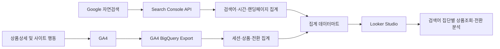

### 1. 결론


첨부된 설계는 **“검색어별 상품 유입·전환 성과를 집계 분석”하는 용도로는 구현 가능**하지만, 목표로 제시된 **“어느 익명 사용자가 어떤 Google 자연검색어로 유입되었는지 정확히 식별”하는 것은 구현할 수 없습니다.**
핵심 이유는 다음과 같습니다.

* GA4는 사용자의 사이트 내 행동과 상품 이동 경로를 세션 단위로 수집할 수 있습니다.
* Search Console은 검색어·페이지·시간대별 클릭 수를 제공하지만, **개별 클릭 ID, 사용자 ID, GA4 세션 ID를 제공하지 않습니다.**
* 따라서 `hhk_id`와 검색어 `hhk_q`를 직접 연결할 공통 키가 없습니다.
* 시간대와 클릭 건수가 일치하더라도 동일 사용자의 데이터라는 증거가 되지 않습니다.
  Search Console API는 `hour`, `query`, `page` 등의 차원으로 데이터를 그룹화할 수 있지만, 결과는 여전히 그룹별 클릭 수·노출 수를 담은 집계 행입니다. API가 모든 데이터 행을 반환하는 것도 아니며, 개별 클릭 시각이나 사용자 식별자는 제공하지 않습니다. ([Google for Developers][1])

### 2. 전체 흐름의 구현 가능성

| 단계      | 첨부 설계 내용                          |         판정 | 실무 판단                             |
| ------- | --------------------------------- | ---------: | --------------------------------- |
| PHASE 1 | 상품상세 유입 시 `hhk_start` 발생          |         가능 | GTM/GA4 이벤트로 수집 가능                |
| PHASE 1 | `sessionStorage`에 `hhk_id` 저장     |     조건부 가능 | 현재 탭 안에서 사용자를 임시 구분하는 용도로 가능      |
| PHASE 1 | `hhk_g`에 상품번호 저장                  |         가능 | 가능하지만 GA4 권장 전자상거래 이벤트 사용이 적절     |
| PHASE 2 | Search Console 검색어·클릭 수 수집        |         가능 | 검색어·페이지·시간대별 집계 데이터 수집 가능         |
| PHASE 2 | Search Console에서 1시간 단위 사용자 그룹 생성 |        불가능 | 시간별 클릭 집계이지 사용자 그룹이 아님            |
| PHASE 3 | 시간을 기준으로 `hhk_id ↔ 검색어` 연결        | 정확한 연결 불가능 | 확률적 추정만 가능                        |
| PHASE 3 | Pub/Sub·Sheets·Apps Script 처리     |   기술적으로 가능 | 처리 구조는 가능하지만 잘못된 매칭을 정확하게 만들지는 못함 |
| PHASE 4 | GA4 사용자별 `hhk_q` 검색어 차원 생성        |    사실상 불가능 | 사용자에게 입력할 실제 검색어 값이 없음            |
| PHASE 4 | `hhk_q → hhk_g → 사용자 이동 경로` 분석    | 사용자 단위 불가능 | 검색어 집단 단위로만 가능                    |
| PHASE 5 | Looker Studio 통합 리포트              |         가능 | 집계 단위 분석만 가능                      |

### 3. 쉽게 설명한 핵심 문제

Search Console 데이터는 다음과 같은 **시간대별 영수증 합계**에 가깝습니다.

-  10시부터 11시 사이에 검색어 “바이코리아 공구”로 상품 A에 2회 클릭이 발생했다.
 - GA4에서는 같은 시간에 다음과 같이 확인될 수 있습니다.

| GA4 임시 사용자 | 상품 유입 시각 | 상품   |
| ---------- | -------: | ---- |
| 사용자 A      |    10:12 | 상품 A |
| 사용자 B      |    10:43 | 상품 A |

- 이 경우 Search Console에는 검색어 클릭 2건, GA4에는 사용자 2명이 있지만 다음 연결은 알 수 없습니다.

| 사용자   | 실제 검색어            |
| ----- | ----------------- |
| 사용자 A | 바이코리아 공구인지 알 수 없음 |
| 사용자 B | 바이코리아 공구인지 알 수 없음 |

- 검색어가 2개라면 문제는 더 명확해집니다.

| Search Console 집계 | 클릭 수 |
| ----------------- | ---: |
| 바이코리아 공구          |    1 |
| 한국 공구 수출업체        |    1 |
| 합계                |    2 |
- 어떤 검색어를 사용자 A와 B에게 배정하더라도 **건수는 맞지만 실제 연결이라는 보장은 없습니다.**

### 4. 단계별 상세 분석

#### 4-1. PHASE 1. 사용자 유입 및 GA4 이벤트

상품상세 페이지에서 다음 정보는 정상적으로 수집할 수 있습니다.

| 정보               | 수집 가능 여부 | 권장 방식                              |
| ---------------- | -------: | ---------------------------------- |
| 상품번호             |       가능 | `view_item` 이벤트의 `items[].item_id` |
| 상품명·카테고리         |       가능 | `item_name`, `item_category`       |
| 유입 URL           |       가능 | `page_location`                    |
| Referrer         |       가능 | `page_referrer`                    |
| 유입 Source/Medium |       가능 | `google / organic`                 |
| GA4 익명 사용자       |       가능 | BigQuery의 `user_pseudo_id`         |
| GA4 세션           |       가능 | `ga_session_id`                    |
| Google 자연검색어     |  대부분 불가능 | Search Console 집계 데이터로만 확인         |

- 상품상세 조회는 별도 `hhk_g`만 만드는 것보다 GA4 권장 전자상거래 이벤트인 `view_item`과 `item_id`를 사용하는 편이 표준 보고서·퍼널·상품별 분석에 유리합니다. ([Google for Developers][2])
- Google 검색이 대부분 HTTPS로 이루어지기 때문에 일반 GA4 유입 데이터에서 자연검색 키워드는 통상 `(not provided)`로 처리됩니다. Referrer를 분석해도 Google 도메인 유입 여부는 알 수 있지만 사용자가 입력한 검색어를 복원할 수 없습니다. ([구글 도움말][3])
#### 4-2. `hhk_start ≒ Search Console 클릭` 가정의 문제

두 수치는 비슷할 수는 있지만 항상 같지 않습니다.

| 불일치 원인          | 설명                                           |
| --------------- | -------------------------------------------- |
| 분석 동의 거부        | Search Console 클릭은 있으나 GA4 이벤트는 발생하지 않을 수 있음 |
| 광고·추적 차단기       | GA4 태그가 차단될 수 있음                             |
| JavaScript 비활성화 | GA4 클라이언트 이벤트 누락                             |
| 중간 리다이렉트        | Search Console 랜딩 URL과 실제 GA4 URL이 달라질 수 있음  |
| 이벤트 중복 발생       | GTM 중복 설치 또는 SPA 처리 오류                       |
| 페이지 로드 전 이탈     | 클릭은 기록되지만 GA4 태그 실행 전에 종료                    |
| 봇·중복 처리 방식      | Search Console과 GA4의 처리 기준이 다름               |
| 시간대 차이          | Search Console은 미국 캘리포니아 시간, GA4는 속성 시간대     |

- Google도 Search Console과 GA4 간 수치가 JavaScript 사용 여부, 데이터 처리 방식, 지연, 시간대 등의 이유로 달라질 수 있다고 안내합니다. ([구글 도움말][4])

#### 4-3. `sessionStorage hhk_id`의 한계

`sessionStorage`는 동일 오리진이라도 브라우저 탭별로 분리되며 페이지 세션이 유지되는 동안만 존속합니다. 따라서 “사용자 ID”라기보다 **현재 탭의 임시 방문 ID**에 가깝습니다. ([MDN Web Docs][5])
또한 영문 대문자·숫자 8자리의 경우 가능한 조합은 약 `36^8 = 2.82조`개이지만 트래픽 누적량이 많아질수록 생일 문제 방식의 충돌 가능성이 증가합니다.

| 누적 ID 발급량 | 대략적인 충돌 발생 확률 |
| --------: | ------------: |
|     10만 개 |       약 0.18% |
|    100만 개 |         약 16% |

- 따라서 별도 ID가 필요하다면 UUID 또는 128비트 이상의 난수를 권장합니다. 다만 GA4 분석 목적으로는 별도 ID를 만들기보다 BigQuery의 `user_pseudo_id + ga_session_id` 조합을 사용하는 것이 더 자연스럽습니다. Google 공식 BigQuery 예제에서도 이 조합으로 세션을 구분합니다. ([Google for Developers][6])

### 5. PHASE 2. Search Console 데이터

Search Analytics API에서는 다음 구조의 데이터 수집이 가능합니다.

```text
date
hour
query
page
country
device
clicks
impressions
ctr
position
```

2026년 기준 API는 `hour` 차원과 `dataState=hourly_all`을 지원하므로 시간 단위 조회 자체는 가능합니다. 그러나 최근 시간대 데이터는 미완성일 수 있으며 `first_incomplete_hour` 이후 값은 변경될 수 있습니다. 시간 정보는 `America/Los_Angeles` 기준입니다. ([Google for Developers][1])
따라서 이미지의 다음 표기는 수정해야 합니다.

| 현재 표기                    | 정확한 표기                           |
| ------------------------ | -------------------------------- |
| 1시간 단위 유저 그룹핑            | 1시간 단위 검색어·페이지 클릭 집계             |
| Unix Timestamp 기준 사용자 보존 | Search Console 시간대를 내부 표준시각으로 변환 |
| 사용자별 검색어                 | 시간·페이지·검색어별 클릭 수                 |
| 클릭 ≒ `hhk_start` 이벤트     | 두 시스템의 집계 수치 비교                  |

- Search Console은 개인정보 보호를 위해 일부 저빈도·민감 검색어를 숨기며, 내부 제한으로 상위 데이터 행을 중심으로 제공합니다. 통상 데이터는 2~3일 정도 지연될 수 있습니다. ([구글 도움말][4])

### 6. PHASE 3. 크롤링 및 매핑

#### 6-1. 명칭 문제

여기서 수행하는 작업은 “크롤링”보다 다음 표현이 정확합니다.

```text
Search Console Search Analytics API 수집 배치
```

Search Console API는 웹페이지를 크롤링해 검색어를 얻는 구조가 아니라 Google이 이미 집계한 Search Console 데이터를 인증 후 조회하는 구조입니다.

#### 6-2. 매핑 가능 수준

| 매핑 대상                       |    가능 여부 |
| --------------------------- | -------: |
| 검색어 → Search Console 랜딩 페이지 |       가능 |
| 랜딩 페이지 → 상품번호               |       가능 |
| 검색어 → 최초 유입 상품              | 집계 수준 가능 |
| GA4 세션 → 이후 조회 상품 경로        |       가능 |
| 검색어 → 특정 GA4 세션             |      불가능 |
| 검색어 → 특정 익명 사용자             |      불가능 |
| 검색어 → 특정 로그인 회원             |      불가능 |

- 로그인 회원이라도 Search Console이 회원 ID나 GA4 세션 ID를 전달하지 않기 때문에 자연검색어와의 직접 연결은 되지 않습니다.

#### 6-3. 통계적 매핑을 사용하는 경우

업무상 추정 데이터가 반드시 필요하다면 다음 조건으로 제한해야 합니다.

```text
동일 시간대
+ 동일 canonical 랜딩 페이지
+ 동일 국가
+ 동일 기기 유형
+ Search Console 클릭 수
+ GA4 진입 세션 수
```

하지만 결과 컬럼은 `hhk_q`처럼 실제 검색어로 표현해서는 안 되고 다음처럼 별도 관리해야 합니다.

| 권장 컬럼              | 의미                    |
| ------------------ | --------------------- |
| `estimated_query`  | 추정 검색어                |
| `match_method`     | 시간·페이지·기기 기반 추정       |
| `confidence_level` | HIGH/MEDIUM/LOW       |
| `candidate_count`  | 매칭 후보 세션 수            |
| `is_observed`      | 실제 수집값 여부, 항상 `false` |

- 후보 세션이 하나이고 검색어 클릭도 하나인 경우조차 기술적으로는 “높은 확률의 추정”일 뿐 확정값은 아닙니다.

### 7. PHASE 4. GA4 사용자 경로 분석

GA4와 Search Console을 연결하면 다음 두 보고서가 제공됩니다.

| 보고서                           | 분석 내용                   |
| ----------------------------- | ----------------------- |
| Google Organic Search Queries | 검색어 및 Search Console 지표 |
| Google Organic Search Traffic | 랜딩 페이지와 GA4 행동 지표       |

- 그러나 검색어 보고서는 Analytics 차원으로 세부 분석할 수 없으며, Search Console 지표와 호환되는 GA4 차원은 랜딩 페이지·기기·국가로 제한됩니다. 따라서 Search Console 검색어를 `hhk_id`, `ga_session_id`, 사용자 정의 사용자 차원과 결합하는 것은 GA4 표준 보고서에서 지원되지 않습니다. ([구글 도움말][7])
- 따라서 이미지의 다음 구조는 성립하지 않습니다.

```text
hhk_q 검색어 차원
→ hhk_g 상품번호 차원
→ 특정 사용자 이동 경로
```

다음 구조로 바꾸는 것이 맞습니다.

```text
Search Console 검색어 집계
→ 검색어별 최초 랜딩 상품
→ 해당 랜딩 상품 유입 집단의 GA4 행동·전환
```

### 8. PHASE 5. Looker Studio 통합 분석

Looker Studio에서 GA4와 Search Console 또는 별도 데이터마트를 연결하는 것은 가능합니다. 다만 조인 기준은 사용자 ID가 아니라 집계 키여야 합니다.





중요한 점은 `C`와 `G` 사이에 **사용자 ID 기반 연결선이 존재하지 않는다**는 것입니다.

### 9. 실무적으로 가능한 분석

| 분석 항목                      |        가능 수준 |
| -------------------------- | -----------: |
| 어떤 검색어가 어떤 상품상세 페이지로 유입되는가 |           가능 |
| 검색어별 노출·클릭·CTR·평균순위        |           가능 |
| 검색어 유입 상품별 이탈·참여·구매율       |     집계 수준 가능 |
| 특정 상품 랜딩 집단의 후속 상품 이동      |           가능 |
| 검색어별 상품군 관심도               |     집계 수준 가능 |
| 검색어별 전환 기여도                |     집계·추정 가능 |
| 특정 익명 사용자의 실제 Google 검색어   |          불가능 |
| 특정 회원의 실제 Google 검색어       |          불가능 |
| 검색어를 개인별 GA4 이벤트에 사후 입력    | 근거 없는 데이터 생성 |

### 10. 구현상 반드시 확인할 사항

#### 10-1. GA4·GTM

| 확인 항목  | 확인 내용                                          |
| ------ | ---------------------------------------------- |
| 이벤트 중복 | `hhk_start`가 동일 세션에서 여러 번 발생하지 않는지             |
| 이벤트 시점 | 모든 상품 조회인지 최초 랜딩 상품만인지 정의                      |
| 상품 이벤트 | `hhk_g` 대신 `view_item/items.item_id` 사용 검토     |
| 세션 식별  | BigQuery에서 `user_pseudo_id + ga_session_id` 사용 |
| 유입 판정  | `session source/medium = google/organic` 기준 확인 |
| SPA 여부 | History Change 시 중복 `page_view` 발생 여부          |
| 리다이렉트  | Google 클릭 후 최종 상품 페이지까지의 경로 확인                 |
| 동의 모드  | 분석 동의 거부 시 이벤트 미수집 처리                          |
| 교차 도메인 | 별도 도메인 이동 시 세션 단절 여부                           |

#### 10-2. Search Console API

| 확인 항목        | 확인 내용                                |
| ------------ | ------------------------------------ |
| 속성 유형        | Domain Property 또는 URL-prefix 범위     |
| 페이지 기준       | Search Console canonical URL 기준      |
| 시간대          | PT/PDT를 KST 또는 UTC로 변환               |
| DST          | 미국 서머타임에 따른 UTC 오프셋 변화               |
| 데이터 상태       | `final`, `all`, `hourly_all` 구분      |
| 미완성 데이터      | `first_incomplete_date/hour` 확인      |
| 페이지네이션       | `rowLimit` 최대 25,000과 `startRow` 처리  |
| 누락 검색어       | 익명화·저빈도 검색어 누락 허용                    |
| URL 정규화      | 프로토콜, 호스트, 포트, 쿼리스트링, trailing slash |
| canonical 매핑 | 실제 상품 URL과 Google canonical URL 매핑   |

#### 10-3. 데이터 저장 구조

Google Sheets와 Apps Script는 초기 검증용으로는 가능하지만 운영 데이터마트로는 다음 문제가 있습니다.

| 문제                | 영향                      |
| ----------------- | ----------------------- |
| 행 수 증가            | 조회·조인 성능 저하             |
| 동시 실행             | Apps Script 실행 충돌 가능    |
| 재처리               | 과거 데이터 보정과 중복 제거가 어려움   |
| 스키마 관리            | 컬럼 변경 및 버전 관리가 어려움      |
| 접근 통제             | 사용자·검색어 추정 데이터 권한 관리 취약 |
| 운영 구조는 다음이 적절합니다. |                         |

```text
Cloud Scheduler
→ Cloud Run 또는 배치 Application
→ Search Console API
→ BigQuery 또는 내부 분석 DB
→ GA4 BigQuery 데이터와 집계 조인
→ Looker Studio
```

Pub/Sub은 실시간 메시지가 발생하는 구조에서 유용하지만 Search Console API는 기본적으로 조회형 API이므로 단순 정기 수집만 한다면 필수 구성요소는 아닙니다.

### 11. 권장 데이터마트

#### 11-1. Search Console 집계 테이블

```text
gsc_query_hourly
- search_date
- search_hour_pt
- search_hour_utc
- query
- canonical_page
- country
- device
- clicks
- impressions
- ctr
- position
- data_state
```

#### 11-2. GA4 상품 행동 집계 테이블

```text
ga4_product_hourly
- event_date
- event_hour_utc
- canonical_landing_page
- landing_item_id
- country
- device
- sessions
- engaged_sessions
- view_item_count
- add_to_cart_count
- purchase_sessions
- revenue
```

#### 11-3. 최종 조인 결과

```text
query_product_cohort
- query
- canonical_landing_page
- landing_item_id
- hour
- gsc_clicks
- ga4_sessions
- engaged_sessions
- purchases
- estimated_conversion_rate
- match_quality
```

### 12. GA4 사용자 정의 차원 관련 주의

`hhk_id`처럼 사용자마다 다른 값은 고유값이 매우 많은 고카디널리티 차원입니다. GA4 보고서에서는 하루 고유값이 많은 차원이 행 제한에 걸려 `(other)`로 묶일 가능성이 커집니다. Google도 사용자 ID 같은 값을 일반 사용자 정의 차원으로 등록하지 말 것을 권고합니다. ([구글 도움말][8])
권장 구분은 다음과 같습니다.

| 값           | 저장 위치                     |
| ----------- | ------------------------- |
| 검색어 집계      | Search Console 데이터마트      |
| 상품번호        | GA4 `item_id`             |
| 익명 세션 식별자   | GA4 BigQuery              |
| 로그인 사용자 ID  | GA4 공식 User-ID 기능 및 내부 DB |
| 추정 검색어      | 외부 데이터마트, GA4 전송 금지 권장    |
| 이메일·전화번호·이름 | GA4 전송 금지                 |

- Google Analytics에는 Google이 개인 식별 정보로 인식할 수 있는 데이터를 전송해서는 안 됩니다. 임시 식별자를 회원정보와 연결하는 경우에는 내부 개인정보 처리 기준과 접근 권한을 별도로 검토해야 합니다. ([구글 도움말][9])

### 13. 최종 판단

| 설계 목적                    |              판정 |
| ------------------------ | --------------: |
| 검색어별 유입 상품 분석            |           구현 가능 |
| 검색어별 상품 성과·전환 분석         |     집계 수준 구현 가능 |
| 검색어 유입 집단의 후속 행동 분석      |       제한적 구현 가능 |
| 특정 사용자의 정확한 자연검색어 식별     |          구현 불가능 |
| 시간과 클릭 수를 이용한 사용자-검색어 확정 |   논리적으로 성립하지 않음 |
| 통계적 추정 모델                | 가능하지만 추정값 표시 필수 |

- 첨부 설계는 **“사용자별 검색어 추적 시스템”이 아니라 “검색어·랜딩 상품 코호트 분석 시스템”으로 요구사항과 명칭을 변경해야 실무적으로 타당합니다.**

[1]: https://developers.google.com/webmaster-tools/v1/searchanalytics/query "Search Analytics: query  |  Search Console API  |  Google for Developers"
[2]: https://developers.google.com/analytics/devguides/collection/ga4/ecommerce?utm_source=chatgpt.com "Analytics - Measure ecommerce"
[3]: https://support.google.com/analytics/answer/11242841?hl=en&utm_source=chatgpt.com "Campaigns and traffic sources - Analytics Help"
[4]: https://support.google.com/webmasters/answer/96568?hl=en "About Search Console data - Search Console Help"
[5]: https://developer.mozilla.org/en-US/docs/Web/API/Window/sessionStorage?utm_source=chatgpt.com "Window: sessionStorage property - Web APIs | MDN"
[6]: https://developers.google.com/analytics/bigquery/advanced-queries?utm_source=chatgpt.com "Advanced queries - Analytics"
[7]: https://support.google.com/analytics/answer/10737381?hl=en "Connect Search Console to Google Analytics - Analytics Help"
[8]: https://support.google.com/analytics/answer/12675187?hl=en&utm_source=chatgpt.com "[GA4] Best practices for User-ID - Analytics Help"
[9]: https://support.google.com/analytics/answer/6004245?hl=en&utm_source=chatgpt.com "Safeguarding your data - Analytics Help"
<details>
  <summary>참고</summary>  
  <pre>
  </pre>
</details>
