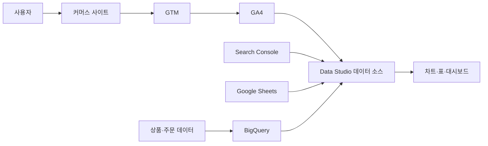

### 1. 먼저 용어 정리

사용자가 말한 **GA4 데이터 스튜디오**는 보통 다음 두 제품을 연결해 사용하는 것을 뜻합니다.

| 제품          | 역할                             |
| ----------- | ------------------------------ |
| GA4         | 웹사이트·앱에서 발생한 사용자 행동 데이터를 수집·가공 |
| Data Studio | GA4 데이터를 표·그래프·대시보드로 시각화       |

- Google은 2022년 Data Studio를 Looker Studio로 변경했지만, **2026년 4월 다시 Data Studio라는 이름으로 변경**했습니다. 기존 보고서와 데이터 소스는 그대로 유지되며, 과거 문서나 화면에는 Looker Studio라는 명칭이 남아 있을 수 있습니다. ([Google Cloud][1])

### 2. 한 문장으로 이해하기

> **GA4는 데이터를 모으는 시스템이고, Data Studio는 모인 데이터를 보기 쉽게 보여주는 보고서 시스템입니다.**
> 예를 들어 상품상세 페이지에 1,000명이 방문했다면:

```text
GA4
→ 누가 어떤 경로로 들어왔는지
→ 어떤 상품을 봤는지
→ 장바구니에 담았는지
→ 구매했는지를 수집
Data Studio
→ 위 데이터를 일별 그래프
→ 상품별 순위
→ 유입경로별 구매율
→ 대시보드 형태로 표시
```

### 3. 전체 데이터 흐름





실제 처리 흐름은 다음과 같습니다.

```text
상품상세 페이지 접속
→ GTM 태그 실행
→ view_item 이벤트를 GA4로 전송
→ GA4가 이벤트와 상품정보 처리
→ Data Studio가 GA4 커넥터로 데이터 조회
→ 상품 조회수·장바구니·구매수 그래프 표시
```

Data Studio의 커넥터는 GA4, BigQuery, Google Sheets, MySQL 등 실제 데이터가 있는 시스템에 연결되며, 연결된 특정 GA4 속성이나 BigQuery 테이블 등이 Data Studio의 `데이터 소스`가 됩니다. ([Google Cloud Documentation][2])

### 4. GA4와 Data Studio의 역할 차이

| 구분       | GA4            | Data Studio                 |
| -------- | -------------- | --------------------------- |
| 주요 목적    | 데이터 수집·처리·분석   | 시각화·공유·정기 보고                |
| 데이터 발생   | 웹사이트·앱 이벤트     | 직접 발생시키지 않음                 |
| 주요 사용자   | 분석가, 마케터, 개발자  | 경영진, 운영자, 마케터               |
| 표현 방식    | 기본 보고서, 탐색 분석  | 자유로운 표·그래프·대시보드             |
| 데이터 연결   | 웹·앱 데이터 스트림    | GA4, BigQuery, Sheets, DB 등 |
| 커스터마이징   | GA4 범위 안에서 제한적 | 레이아웃·필터·계산식 자유도가 높음         |
| 실시간성     | 실시간 보고서 별도 제공  | 일반적으로 실시간 모니터링 도구는 아님       |
| 정산 기준 사용 | 부적합            | 부적합                         |

- Data Studio는 자체적으로 원본 데이터를 새로 만드는 시스템이 아닙니다. 연결된 데이터 소스를 조회해 결과를 보여주며, 성능과 쿼터 절약을 위해 조회 결과를 일정 시간 메모리에 보관할 수 있습니다. ([Google Cloud Documentation][3])

### 5. Data Studio의 주요 목적

#### 5-1. 반복 보고서 자동화

매일 또는 매주 다음 데이터를 수작업으로 엑셀에 정리하는 대신 대시보드를 만들어 자동으로 조회합니다.

```text
방문자 수
상품 조회 수
장바구니 수
구매 건수
매출
유입 채널별 실적
기기별 실적
```

날짜가 변경되면 연결된 데이터가 갱신되므로 매번 보고서를 새로 만들 필요가 없습니다.

#### 5-2. 여러 사람이 동일한 지표 확인

경영진, 마케팅, 상품운영, 개발 부서가 동일한 대시보드를 보도록 만들 수 있습니다.

```text
경영진
→ 전체 방문·구매·매출 추이
마케팅
→ 광고·검색·캠페인별 성과
상품 담당자
→ 상품별 조회·장바구니·구매 성과
개발자
→ 이벤트 누락·비정상 데이터 확인
```

Data Studio는 보고서 링크 공유, 공동 편집, PDF 다운로드, 예약 전송, 웹페이지 삽입 등의 기능을 제공합니다. ([Google Cloud Documentation][4])

#### 5-3. 데이터를 의사결정 정보로 변환

단순히 숫자만 보여주는 것이 아니라 다음과 같은 질문에 답하도록 구성합니다.

| 업무 질문                  | 필요한 데이터          |
| ---------------------- | ---------------- |
| 어떤 상품이 많이 조회되는가?       | 상품별 `view_item`  |
| 조회는 많지만 구매가 적은 상품은?    | 상품 조회수와 구매수      |
| 어느 채널에서 구매 고객이 많이 오는가? | 세션 소스·매체와 구매     |
| 모바일에서 결제 이탈이 많은가?      | 기기별 구매 퍼널        |
| 검색 결과 품질이 좋은가?         | 내부 검색어와 상품 클릭·구매 |
| 광고비 대비 매출은 적절한가?       | 광고비와 구매 매출       |

### 6. GA4 데이터의 기본 구조

GA4의 핵심은 **이벤트 기반 데이터 모델**입니다. 페이지 조회, 상품 조회, 클릭, 장바구니, 구매 등을 각각 이벤트로 기록합니다. ([구글 도움말][5])

```text
이벤트
 ├─ 이벤트 이름
 ├─ 이벤트 발생 시각
 ├─ 사용자 정보
 ├─ 세션 정보
 └─ 이벤트 매개변수
```

상품상세 조회 이벤트 예:

```javascript
gtag('event', 'view_item', {
    currency: 'KRW',
    value: 35000,
    items: [{
        item_id: 'GOOD-10001',
        item_name: 'Sample Product',
        item_category: 'Electronics',
        price: 35000,
        quantity: 1
    }]
});
```

이 데이터가 GA4에서 처리되면 Data Studio에서는 다음처럼 사용됩니다.

| GA4 데이터         | Data Studio에서의 용도 |
| --------------- | ----------------- |
| `event_name`    | 이벤트 종류별 필터        |
| `item_id`       | 상품번호별 분석          |
| `item_name`     | 상품명별 표·그래프        |
| `item_category` | 카테고리별 실적          |
| `price`         | 상품 금액             |
| `currency`      | 통화                |
| `value`         | 이벤트 총금액           |

### 7. 이벤트·매개변수·측정기준·측정항목

이 네 가지를 구분하는 것이 가장 중요합니다.

| 개념             | 쉽게 설명        | 예시                                     |
| -------------- | ------------ | -------------------------------------- |
| 이벤트 Event      | 사용자가 한 행동    | `view_item`, `add_to_cart`, `purchase` |
| 매개변수 Parameter | 행동에 포함된 상세정보 | 상품번호, 가격, 카테고리                         |
| 측정기준 Dimension | 데이터를 나누는 기준  | 상품명, 국가, 기기, 유입경로                      |
| 측정항목 Metric    | 계산할 숫자       | 사용자 수, 세션 수, 구매수, 매출                   |

- Google은 측정기준을 데이터의 속성, 측정항목을 수치 데이터로 구분합니다. 이벤트 매개변수는 GA4에서 사전 정의된 측정기준·측정항목이나 사용자 정의 측정기준·측정항목으로 처리될 수 있습니다. ([구글 도움말][6])
- 예를 들어:
```text
측정기준: 상품명
측정항목: 상품 조회 이벤트 수
```

그러면 다음 표를 만들 수 있습니다.

| 상품명  |  상품 조회 | 장바구니 |  구매 |
| ---- | -----: | ---: | --: |
| 상품 A | 10,000 |  800 | 120 |
| 상품 B |  5,000 |  900 | 250 |
| 상품 C | 15,000 |  300 |  40 |

- 이 데이터에서 단순히 조회수가 높은 상품뿐 아니라 **조회 대비 구매 성과가 좋은 상품**을 구분할 수 있습니다.
### 8. 주요 GA4 데이터의 의미

#### 8-1. 사용자 관련 지표

| 지표      | 의미                                     | 해석 시 주의점                    |
| ------- | -------------------------------------- | --------------------------- |
| 활성 사용자  | 사이트나 앱과 실제로 참여한 고유 사용자                 | 회원 수와 동일하지 않음               |
| 총 사용자   | 기간 중 하나 이상의 이벤트를 발생시킨 사용자              | 활성 사용자보다 클 수 있음             |
| 신규 사용자  | `first_visit` 또는 `first_open`이 발생한 사용자 | 브라우저·쿠키 변경 시 다시 신규로 잡힐 수 있음 |
| 재방문 사용자 | 이전 세션 기록이 있는 사용자                       | 회원 로그인 여부와 별개               |

- GA4의 사용자는 회원 DB의 회원번호가 아니라 User-ID, 브라우저의 Device ID, 모델링 등 설정된 보고 ID 방식으로 계산됩니다. 따라서 `GA4 사용자 10,000명`을 `실제 사람 10,000명` 또는 `회원 10,000명`으로 단정해서는 안 됩니다. ([구글 도움말][7])

#### 8-2. 세션과 참여 지표

| 지표       | 의미                                                |
| -------- | ------------------------------------------------- |
| 세션       | 사용자가 사이트에 들어와 활동한 방문 묶음                           |
| 참여 세션    | 10초 이상 지속되거나, 핵심 이벤트가 발생했거나, 페이지·화면 조회가 2회 이상인 세션 |
| 참여율      | 전체 세션 중 참여 세션의 비율                                 |
| 평균 참여 시간 | 사이트가 실제 포커스를 가진 상태에서 사용자가 참여한 평균 시간               |

- 참여 세션은 단순 페이지 접속보다 실제 상호작용이 있었는지를 판단하는 지표입니다. ([구글 도움말][8])

#### 8-3. 이벤트 지표

| 지표         | 의미                    |
| ---------- | --------------------- |
| 이벤트 수      | 이벤트가 발생한 전체 횟수        |
| 이벤트별 사용자 수 | 해당 이벤트를 실행한 사용자 수     |
| 사용자당 이벤트 수 | 한 사용자가 평균 몇 번 실행했는지   |
| 핵심 이벤트     | 비즈니스상 중요한 것으로 지정한 이벤트 |

- 예를 들어 한 사용자가 상품 상세를 세 번 열었다면:
```text
활성 사용자 = 1
view_item 이벤트 수 = 3
```

따라서 `이벤트 수`와 `사용자 수`를 같은 의미로 해석하면 안 됩니다.
GA4에서는 구매, 회원가입, 문의 완료처럼 비즈니스상 중요한 이벤트를 `핵심 이벤트`로 지정할 수 있습니다. 과거 GA4의 `전환`이라는 표현은 현재 행동 분석에서는 주로 `핵심 이벤트`로 변경됐으며, 광고 캠페인 최적화에 사용하는 전환과 구분됩니다. ([구글 도움말][9])

#### 8-4. 유입경로 데이터

| 측정기준                     | 의미             | 예시                                    |
| ------------------------ | -------------- | ------------------------------------- |
| Source                   | 어디에서 왔는지       | `google`, `naver`, `newsletter`       |
| Medium                   | 어떤 방식으로 왔는지    | `organic`, `cpc`, `email`, `referral` |
| Campaign                 | 어떤 캠페인인지       | `summer_sale_2026`                    |
| First user source/medium | 사용자를 처음 획득한 경로 | 최초 유입 분석                              |
| Session source/medium    | 현재 방문 세션의 유입경로 | 이번 방문 성과 분석                           |
| 예:                       |                |                                       |

```text
최초 방문
google / organic
두 번째 방문
newsletter / email
세 번째 방문 후 구매
google / cpc
```

이 사용자는:

```text
First user source / medium = google / organic
현재 구매 세션의 Session source / medium = google / cpc
```

사용자 획득 보고서는 최초 유입 기준이고, 트래픽 획득 보고서는 각 세션의 유입 기준입니다. ([구글 도움말][10])

### 9. 커머스에서 사용하는 주요 이벤트

GA4는 커머스에 다음 추천 이벤트를 제공합니다. 이 이벤트들은 자동으로 전송되는 것이 아니므로 사이트나 GTM에서 지정된 매개변수와 함께 구현해야 합니다. ([구글 도움말][11])

| 이벤트                 | 발생 시점      | 실무 의미     |
| ------------------- | ---------- | --------- |
| `view_item_list`    | 상품 목록 노출   | 목록 노출 성과  |
| `select_item`       | 목록에서 상품 클릭 | 상품 클릭률    |
| `view_item`         | 상품상세 조회    | 상품 관심도    |
| `add_to_cart`       | 장바구니 추가    | 구매 의향     |
| `remove_from_cart`  | 장바구니 삭제    | 구매 포기 가능성 |
| `view_cart`         | 장바구니 조회    | 결제 전 검토   |
| `begin_checkout`    | 주문 시작      | 결제 퍼널 진입  |
| `add_shipping_info` | 배송정보 입력    | 주문 단계 진행  |
| `add_payment_info`  | 결제정보 입력    | 결제 직전 단계  |
| `purchase`          | 구매 완료      | 주문·매출 발생  |
| `refund`            | 환불 처리      | 환불 매출 반영  |

### 10. 구매·매출 데이터의 의미

`purchase` 이벤트에는 주문 전체 정보와 상품별 정보가 함께 들어갈 수 있습니다.

```javascript
gtag('event', 'purchase', {
    transaction_id: 'ORDER-20260730-10001',
    currency: 'KRW',
    value: 72000,
    tax: 6000,
    shipping: 3000,
    items: [
        {
            item_id: 'GOOD-10001',
            item_name: '상품 A',
            price: 35000,
            quantity: 1
        },
        {
            item_id: 'GOOD-10002',
            item_name: '상품 B',
            price: 34000,
            quantity: 1
        }
    ]
});
```

| 데이터              | 의미           |
| ---------------- | ------------ |
| `transaction_id` | 주문 식별값       |
| `value`          | 주문 이벤트 전체 금액 |
| `currency`       | 통화           |
| `tax`            | 세금           |
| `shipping`       | 배송비          |
| `items`          | 구매 상품 목록     |
| `price`          | 상품 단가        |
| `quantity`       | 수량           |

- GA4의 이벤트 수준 매출은 주로 `value`와 `currency`를 사용하고, 상품 수준 매출은 `price`, `quantity`, `currency` 등 상품 배열 정보를 사용합니다. 상품 매출은 일반적으로 상품 자체의 매출이며 세금과 배송비를 제외해 해석해야 합니다. ([구글 도움말][12])
### 11. 커머스 Data Studio 실무 대시보드 구성

#### 11-1. 1페이지: 경영 요약

| 지표      | 목적           |
| ------- | ------------ |
| 활성 사용자  | 전체 이용 규모     |
| 세션      | 방문량          |
| 상품 조회   | 상품 관심 규모     |
| 장바구니 추가 | 구매 의향        |
| 구매 수    | 구매 성과        |
| 총매출     | 매출 성과        |
| 구매율     | 트래픽 대비 구매 효율 |
| 객단가     | 구매당 평균 매출    |

- 권장 화면 :
```text
상단: 핵심 KPI 카드
중단: 일별 사용자·구매·매출 추이
하단: 채널별·기기별·국가별 실적
```

#### 11-2. 2페이지: 유입 채널 분석

| 분석 항목                    | 확인 목적         |
| ------------------------ | ------------- |
| Session source/medium    | 현재 방문을 만든 채널  |
| First user source/medium | 신규 고객을 획득한 채널 |
| 캠페인                      | 광고·이메일 캠페인 비교 |
| 랜딩 페이지                   | 첫 유입 페이지 성과   |
| 채널별 구매·매출                | 실질적인 매출 기여    |

- 예 :

| 유입 채널          | 세션     | 구매  | 매출         |
| -------------- | ------ | --- | ---------- |
| Google Organic | 30,000 | 600 | 60,000,000 |
| Google CPC     | 10,000 | 400 | 50,000,000 |
| Email          | 5,000  | 500 | 70,000,000 |

- 이 경우 Organic은 트래픽이 가장 많지만 Email은 세션 대비 구매와 매출 효율이 높을 수 있습니다.

#### 11-3. 3페이지: 상품 퍼널





| 단계       | GA4 이벤트          |
| -------- | ---------------- |
| 상품 목록 노출 | `view_item_list` |
| 상품 선택    | `select_item`    |
| 상품상세 조회  | `view_item`      |
| 장바구니     | `add_to_cart`    |
| 결제 시작    | `begin_checkout` |
| 구매       | `purchase`       |

- 퍼널을 통해 다음 문제를 찾을 수 있습니다.
```text
상세 조회 → 장바구니 이탈이 큼
= 가격, 상품정보, 배송조건 문제 가능
장바구니 → 결제 시작 이탈이 큼
= 장바구니 UX, 배송비 노출 문제 가능
결제 시작 → 구매 이탈이 큼
= 로그인, 결제수단, 오류, 주문서 문제 가능
```

다만 데이터만으로 원인을 확정할 수는 없으며, 로그·사용자 테스트·오류 데이터와 함께 검증해야 합니다.

#### 11-4. 4페이지: 상품별 성과

| 상품번호  | 상품명  |   상세조회 | 장바구니 |  구매 |       상품매출 |
| ----- | ---- | -----: | ---: | --: | ---------: |
| 10001 | 상품 A | 10,000 |  800 | 120 | 12,000,000 |
| 10002 | 상품 B |  5,000 |  900 | 250 | 25,000,000 |
| 10003 | 상품 C | 15,000 |  300 |  40 |  4,000,000 |
| 활용 예: |      |        |      |     |            |

* 조회가 많고 구매가 낮은 상품 확인
* 조회는 적지만 구매율이 높은 상품 발굴
* 카테고리별 성과 비교
* 추천영역 노출 전후 성과 비교
* 품절·가격·배송조건과 구매율의 관계 분석

### 12. 내부 검색어 분석 응용

커머스 사이트 내부 검색 URL이 다음과 같다고 가정합니다.

```text
/search.do?keyword=laptop
```

GA4 향상된 측정은 `q`, `s`, `search`, `query`, `keyword` 등의 URL 쿼리 매개변수를 인식해 `view_search_results` 이벤트와 `search_term` 값을 수집할 수 있습니다. URL 방식이 아니거나 별도 검색 API를 사용한다면 GTM에서 이벤트를 명시적으로 전송하는 것이 안전합니다. ([구글 도움말][13])
Data Studio에서는 다음 보고서를 만들 수 있습니다.

| 검색어      | 검색 횟수 | 상품 클릭 | 장바구니 | 구매 |
| -------- | ----: | ----: | ---: | -: |
| laptop   | 1,000 |   600 |   80 | 20 |
| monitor  |   800 |   500 |  120 | 50 |
| keyboard |   500 |   200 |   20 |  5 |
| 응용 방법:   |       |       |      |    |

```text
검색은 많지만 클릭이 낮음
→ 검색결과 정확도 문제
클릭은 많지만 구매가 낮음
→ 상품·가격·재고 문제
검색량은 많지만 결과가 없음
→ 신규 상품 등록 후보
구매율이 높은 검색어
→ 추천·프로모션 키워드 후보
```

### 13. Google 검색 유입 키워드 분석

사이트 내부 검색어와 Google 검색 유입어는 서로 다른 데이터입니다.

| 구분               | 데이터 출처                                    |     |     |     |
| ---------------- | ----------------------------------------- | --- | --- | --- |
| 사이트 내부 검색어       | GA4 `view_search_results` 및 `search_term` |     |     |     |
| Google 검색 유입 검색어 | Google Search Console                     |     |     |     |

-  GA4와 Search Console을 연결하면 Google 자연검색 검색어, 노출, 클릭, 평균 검색 순위, 랜딩 페이지와 GA4 행동 데이터를 함께 분석할 수 있습니다. 다만 Search Console 검색어와 GA4 사용자 행동을 사용자 단위로 1:1 연결하는 구조는 아니며, 호환 가능한 측정기준에도 제한이 있습니다. Search Console 데이터는 수집 후 약 48시간 뒤 제공되며 최대 16개월 범위입니다. ([구글 도움말][14])

- 실무 보고서 예:

| 검색어              | Google 노출 | 클릭    | CTR  | 평균순위 |
| ---------------- | --------- | ----- | ---- | ---- |
| korean cosmetics | 100,000   | 3,000 | 3.0% | 8.2  |
| korean laptop    | 20,000    | 1,500 | 7.5% | 3.5  |
| korean food      | 80,000    | 800   | 1.0% | 12.1 |
-
### 14. 여러 데이터 결합 응용

Data Studio는 여러 데이터 소스를 연결하거나 관련 키를 기준으로 혼합할 수 있습니다. ([Google Cloud Documentation][4])
예:

```text
GA4
- 상품조회
- 장바구니
- 구매 행동
Search Console
- 검색어
- 노출
- 클릭
- 검색순위
Google Ads
- 광고비
- 클릭
- 캠페인
상품 DB
- 상품분류
- 판매기업
- 재고
- 마진
주문 DB
- 실제 주문
- 취소
- 환불
```

결합 결과:

| 분석             | 의미              |
| -------------- | --------------- |
| 광고비 + GA4 매출   | 광고 효율           |
| GA4 상품조회 + 재고  | 재고 부족 상품의 관심도   |
| GA4 구매 + 주문 DB | 분석 매출과 실제 매출 비교 |
| 검색어 + 상품 클릭    | 검색결과 품질         |
| 상품조회 + 마진      | 고마진 상품 추천 후보    |

### 15. 직접 GA4 연결과 BigQuery 연결 비교

| 구분           | GA4 직접 연결    | BigQuery 경유    |
| ------------ | ------------ | -------------- |
| 설정 난이도       | 낮음           | 높음             |
| 빠른 대시보드 제작   | 적합           | 상대적으로 복잡       |
| 이벤트 원시 수준 분석 | 제한적          | 적합             |
| 주문·상품 DB 결합  | 제한적          | 적합             |
| SQL 가공       | 불가 또는 제한적    | 가능             |
| 비용           | 대부분 낮음       | 저장·쿼리 비용 발생 가능 |
| 권장 용도        | 일반 운영·마케팅 보고 | 고급 분석·데이터웨어하우스 |

- GA4 직접 연결은 빠르게 대시보드를 만드는 데 적합합니다.
```text
Data Studio
→ Google Analytics 커넥터
→ GA4 계정
→ 속성 선택
→ 데이터 소스 생성
```

BigQuery 방식은 GA4 이벤트 수준 데이터와 상품·주문·CRM 데이터를 SQL로 결합해야 할 때 적합합니다. GA4 BigQuery 스트리밍 내보내기는 당일 이벤트를 몇 분 내 사용할 수 있지만, 별도 비용·스키마·SQL·운영 관리가 필요합니다. ([구글 도움말][15])
커머스 시스템에서는 운영 MariaDB를 Data Studio에 직접 연결하기보다 다음 구조가 안전합니다.

```text
운영 MariaDB
→ 읽기 복제본 또는 배치 집계
→ BigQuery·분석 DB
→ Data Studio
```

운영 DB에 대시보드 조회 쿼리가 직접 유입되면 DB 부하와 보안 문제가 생길 수 있기 때문입니다.

### 16. Data Studio 연결 절차

```text
1. Data Studio 접속
2. 새 보고서 생성
3. 데이터 추가
4. Google Analytics 커넥터 선택
5. GA4 계정 선택
6. GA4 속성 선택
7. 데이터 소스 추가
8. 차트와 표 생성
```

GA4 속성에 접근할 권한이 있는 Google 계정으로 연결해야 하며, 처음 연결할 때 Data Studio의 데이터 접근 권한을 승인합니다. ([Google Cloud][16])
차트 생성 예:

```text
차트 유형: 시계열 그래프
측정기준: 날짜
측정항목:
- 활성 사용자
- 세션
- 구매
- 총매출
```

상품 표:

```text
차트 유형: 표
측정기준:
- 상품 ID
- 상품명
측정항목:
- 상품 조회
- 장바구니 추가
- 구매수
- 상품매출
```

필터:

```text
날짜
국가
기기
상품 카테고리
유입 채널
캠페인
```

### 17. 계산식 응용

Data Studio 계산 필드를 이용해 업무 지표를 만들 수 있습니다. 다만 분자와 분모의 범위를 동일하게 사용해야 합니다.

| 지표       | 개념 계산식                   |
| -------- | ------------------------ |
| 상품 클릭률   | 상품 클릭 사용자 ÷ 상품 목록 노출 사용자 |
| 장바구니 전환율 | 장바구니 사용자 ÷ 상품상세 사용자      |
| 구매 진행률   | 구매 사용자 ÷ 장바구니 사용자        |
| 객단가      | 구매 매출 ÷ 구매 건수            |
| 광고수익률    | 광고 기여 매출 ÷ 광고비           |
| 환불률      | 환불 주문 ÷ 구매 주문            |

- 잘못된 계산 예:
```text
add_to_cart 이벤트 수 ÷ 활성 사용자
```

한 사용자가 장바구니 버튼을 여러 번 누를 수 있으므로 이를 장바구니 사용자 전환율이라고 부르면 의미가 왜곡됩니다.
권장:

```text
장바구니 이벤트를 발생시킨 사용자 수
÷
상품상세 이벤트를 발생시킨 사용자 수
```

또는 동일하게 세션 기준으로 계산합니다.

### 18. 데이터가 `(not set)`으로 나오는 의미

`(not set)`은 숫자 0이 아니라 **해당 측정기준에 필요한 값이 수집되지 않았거나 적용할 수 없는 상태**입니다. ([구글 도움말][17])
예:

| 표시                  | 가능한 원인             |
| ------------------- | ------------------ |
| 상품명 `(not set)`     | `item_name` 미전송    |
| 캠페인 `(not set)`     | 캠페인 값 없음           |
| 유입경로 `(not set)`    | 세션 유입정보 처리 불가      |
| 검색어 `(not set)`     | `search_term` 미전송  |
| 상품 카테고리 `(not set)` | `item_category` 누락 |

- 따라서 `(not set)`이 증가하면 먼저 GTM과 GA4 이벤트 매개변수 전송 상태를 검증해야 합니다.
### 19. 데이터 갱신 시간

Data Studio의 GA4 데이터 소스는 데이터 새로고침 주기를 1시간, 4시간, 12시간으로 설정할 수 있으며 기본값은 12시간입니다. 수동 새로고침도 가능하지만, Data Studio가 새로 조회하더라도 GA4 자체에서 아직 처리되지 않은 데이터는 표시되지 않을 수 있습니다. ([Google Cloud Documentation][3])
따라서 Data Studio는 일반적으로 다음 용도에 적합합니다.

```text
일별 운영 보고
주간 마케팅 보고
월간 경영 보고
상품 성과 분석
```

다음 용도에는 별도 시스템이 필요합니다.

```text
결제 장애 실시간 감지
주문 발생 즉시 알림
실시간 재고 감시
초 단위 트래픽 모니터링
```

### 20. GA4 데이터를 해석할 때 주의할 점

| 주의점                  | 설명                        |
| -------------------- | ------------------------- |
| 사용자 수 ≠ 회원 수         | 브라우저·기기·User-ID 기반 식별     |
| 이벤트 수 ≠ 사용자 수        | 한 사용자가 여러 번 실행 가능         |
| GA4 구매수 ≠ 주문 DB 주문수  | 태그 누락·중복·차단 가능성           |
| 상품 매출 ≠ 결제 총액        | 배송비·세금 포함 여부가 다를 수 있음     |
| 최초 유입 ≠ 현재 세션 유입     | First user와 Session 기준 차이 |
| 검색어 ≠ 개별 사용자 검색어     | Search Console은 집계 데이터    |
| Data Studio ≠ 원본 저장소 | 연결된 데이터 소스를 조회해 표현        |

### 21. 커머스에서의 권장 기준

```text
주문·결제·정산의 공식 수치
→ 주문 DB와 결제 DB
사용자 행동·유입·상품 관심 분석
→ GA4
시각화·공유·정기 보고
→ Data Studio
상세 이벤트 분석·데이터 결합
→ BigQuery
Google 검색어·노출·순위
→ Search Console
```

가장 중요한 원칙은 다음과 같습니다.

> **GA4와 Data Studio는 사용자의 행동을 분석하는 도구이지, 주문·결제·회계의 최종 원장 시스템이 아닙니다.**
> 커머스 실무에서는 주문 DB의 매출을 기준으로 하고 GA4 구매 데이터를 함께 비교해, 태그 누락·중복·유입경로·상품 행동을 분석하는 구조가 가장 안전합니다.

[1]: https://cloud.google.com/blog/products/data-analytics/looker-studio-is-data-studio "Looker Studio is Data Studio | Google Cloud Blog"
[2]: https://docs.cloud.google.com/looker/docs/studio/connector?utm_source=chatgpt.com "Connector  |  Looker Studio  |  Google Cloud Documentation"
[3]: https://docs.cloud.google.com/looker/docs/studio/manage-data-freshness "Manage data freshness  |  Data Studio  |  Google Cloud Documentation"
[4]: https://docs.cloud.google.com/data-studio/welcome?authuser=6 "Welcome to Data Studio  |  Google Cloud Documentation"
[5]: https://support.google.com/analytics/answer/10089681?hl=en&utm_source=chatgpt.com "Introducing the next generation of Analytics, Google Analytics"
[6]: https://support.google.com/analytics/answer/13818300?hl=en&utm_source=chatgpt.com "[GA4] Change dimensions in detail reports - Analytics Help"
[7]: https://support.google.com/analytics/answer/10976610?hl=en&utm_source=chatgpt.com "Reporting identity - Analytics Help"
[8]: https://support.google.com/analytics/answer/13391283?hl=en&utm_source=chatgpt.com "Engagement overview report - Analytics Help"
[9]: https://support.google.com/analytics/answer/9267568?hl=en&utm_source=chatgpt.com "About key events - Analytics Help"
[10]: https://support.google.com/analytics/answer/14731736?utm_source=chatgpt.com "User acquisition report vs. Traffic acquisition report - Analytics Help"
[11]: https://support.google.com/analytics/answer/14434488?hl=en-419&utm_source=chatgpt.com "Ecommerce events - Analytics Help"
[12]: https://support.google.com/analytics/answer/13800978?hl=en&utm_source=chatgpt.com "Fix missing revenue data - Analytics Help"
[13]: https://support.google.com/analytics/answer/9216061?hl=ko&utm_source=chatgpt.com "[GA4] 향상된 측정 이벤트 - 애널리틱스 고객센터"
[14]: https://support.google.com/analytics/answer/10737381?hl=en-EN&utm_source=chatgpt.com "Connect Search Console to Google Analytics - Analytics Help"
[15]: https://support.google.com/analytics/answer/9358801?hl=en&utm_source=chatgpt.com "BigQuery Export - Analytics Help"
[16]: https://cloud.google.com/looker/docs/studio/tutorial-create-a-google-analytics-data-source?rd=1&visit_id=638853904940792949-3421872557&utm_source=chatgpt.com "Tutorial: Create a Google Analytics data source  |  Looker Studio  |  Google Cloud"
[17]: https://support.google.com/analytics/answer/13947485?hl=en-EN&utm_source=chatgpt.com "Dimensions and metrics introduction - Analytics Help"
<details>
  <summary>참고</summary>  
  <pre>
  </pre>
</details>
