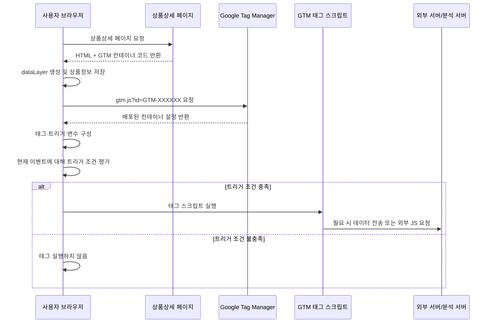

### 1. 핵심 개념
상품상세 JSP에 삽입하는 GTM 코드는 **직접 작성한 모든 태그 스크립트를 포함하는 코드가 아닙니다.**
이 코드는 다음 역할만 수행하는 **GTM 컨테이너 로더(loader)**입니다.
> “`GTM-XXXXXX` 컨테이너에 현재 배포되어 있는 설정을 Google 서버에서 받아와 실행하라.”
따라서 GTM 태그에 작성한 스크립트는 JSP 파일에 물리적으로 복사되는 것이 아니라, 사용자가 상품상세 페이지를 열 때 브라우저가 GTM 컨테이너를 다운로드한 후 **런타임에 동적으로 실행**합니다. GTM 컨테이너에는 태그, 트리거, 변수 등의 설정이 포함됩니다. citeturn146268search1turn146268search4
### 2. 전체 실행 흐름



### 3. 상품상세 페이지에 GTM 로더 코드가 존재
상품상세 JSP의 `<head>` 상단에는 보통 다음 코드가 들어갑니다.
```html
<script>
(function (w, d, s, l, i) {
    w[l] = w[l] || [];
    w[l].push({
        'gtm.start': new Date().getTime(),
        event: 'gtm.js'
    });
    var f = d.getElementsByTagName(s)[0];
    var j = d.createElement(s);
    var dl = l !== 'dataLayer' ? '&l=' + l : '';
    j.async = true;
    j.src = 'https://www.googletagmanager.com/gtm.js?id=' + i + dl;
    f.parentNode.insertBefore(j, f);
})(window, document, 'script', 'dataLayer', 'GTM-ABCDEF');
</script>
```
이 코드가 실행되면 브라우저 내부에서는 실질적으로 다음 동작이 수행됩니다.
```javascript
const script = document.createElement('script');
script.async = true;
script.src =
    'https://www.googletagmanager.com/gtm.js?id=GTM-ABCDEF';
document.head.appendChild(script);
```
즉, HTML에 새로운 `<script>` 요소를 동적으로 만들어 다음 파일을 요청합니다.
```text
https://www.googletagmanager.com/gtm.js?id=GTM-ABCDEF
```
Google 공식 설치 지침에서도 첫 번째 GTM 코드를 `<head>` 시작 부분에 배치하도록 안내합니다. citeturn146268search11
### 4. GTM 컨테이너 ID로 배포된 설정을 다운로드
브라우저가 다음 요청을 전송합니다.
```http
GET /gtm.js?id=GTM-ABCDEF
Host: www.googletagmanager.com
```
여기서 `GTM-ABCDEF`는 단순한 식별자가 아니라 다음 설정을 찾는 키입니다.
|구성요소|예시|
|---|---|
|태그|직접 작성한 Custom HTML 스크립트|
|트리거|상품상세 페이지에서만 실행|
|변수|상품번호, 상품명, 가격|
|예외 트리거|관리자 페이지 또는 테스트 페이지 제외|
|실행 순서|초기화, 페이지뷰, DOM Ready 등|
GTM 서버는 해당 컨테이너의 **현재 게시된 버전**을 JavaScript 형태로 반환합니다.
중요한 점은 GTM 화면에서 태그를 저장만 해서는 운영 페이지에 적용되지 않는다는 것입니다.
```text
태그 작성 → 저장 → 미리보기/검증 → 제출 → 게시
```
`게시`된 컨테이너 버전이 있어야 일반 사용자가 상품상세 페이지에 접속했을 때 해당 설정을 내려받습니다.
### 5. GTM 런타임이 브라우저 안에 구성됨
`gtm.js`가 다운로드되면 브라우저 안에 다음과 같은 GTM 실행 환경이 구성됩니다.
```text
GTM Runtime
 ├─ Tag 목록
 ├─ Trigger 목록
 ├─ Variable 목록
 ├─ dataLayer 이벤트 처리기
 └─ 태그 실행 제어 로직
```
따라서 직접 생성한 스크립트가 서버의 Java/Spring Controller에서 실행되는 것이 아닙니다.
```text
Spring/JSP 서버 측 실행: 아님
사용자 브라우저 JavaScript 실행: 맞음
```
Custom HTML 태그 또는 제3자 스크립트를 실행하려면 `GTM-`으로 시작하는 웹 컨테이너를 사용해야 합니다. Google의 제품별 ID인 `G-`, `AW-` 등은 Google 서비스용 기능으로 제한될 수 있습니다. citeturn146268search2
### 6. `dataLayer`에 들어온 이벤트를 순서대로 처리
GTM 설치 코드가 가장 먼저 수행하는 중요한 작업은 다음 코드입니다.
```javascript
window.dataLayer = window.dataLayer || [];
dataLayer.push({
    'gtm.start': new Date().getTime(),
    'event': 'gtm.js'
});
```
`dataLayer`는 상품상세 페이지와 GTM 사이에서 데이터를 전달하는 공용 메시지 큐입니다.
상품상세 페이지에서는 다음과 같이 상품정보를 전달할 수 있습니다.
```html
<script>
window.dataLayer = window.dataLayer || [];
window.dataLayer.push({
    event: 'product_detail_ready',
    pageType: 'productDetail',
    goodsSn: '1000001234',
    goodsName: 'Sample Product',
    salePrice: 35000
});
</script>
```
GTM은 `dataLayer`에 들어온 메시지를 입력 순서대로 처리합니다. `event`가 포함된 메시지를 처리할 때 해당 이벤트와 연결된 트리거를 평가하고, 조건이 일치하는 태그를 실행합니다. citeturn146268search0
### 7. GTM 트리거가 실행 여부를 결정
예를 들어 GTM에서 다음과 같이 설정했다고 가정합니다.
#### 7-1. 태그
```text
이름: 상품상세 추천 로그 스크립트
유형: Custom HTML
```
#### 7-2. 트리거
```text
트리거 유형: 맞춤 이벤트
이벤트 이름: product_detail_ready
추가 조건: pageType equals productDetail
```
브라우저에서 다음 코드가 실행되면:
```javascript
dataLayer.push({
    event: 'product_detail_ready',
    pageType: 'productDetail',
    goodsSn: '1000001234'
});
```
GTM은 내부적으로 다음과 같이 판단합니다.
```text
1. product_detail_ready 이벤트 발생
2. 이 이벤트를 사용하는 트리거 검색
3. pageType == productDetail 조건 확인
4. 조건 충족
5. 연결된 태그 실행
```
태그는 반드시 하나 이상의 트리거를 가져야 하며, 트리거 조건을 만족했을 때만 실행됩니다. citeturn146268search3turn146268search8
### 8. GTM의 Custom HTML 태그가 브라우저에 삽입되어 실행
GTM 태그에 다음 스크립트를 작성했다고 가정합니다.
```html
<script>
(function () {
    var goodsSn = '{{DLV - goodsSn}}';
    console.log('상품상세 태그 실행:', goodsSn);
    window.productTracking = window.productTracking || {};
    window.productTracking.goodsSn = goodsSn;
})();
</script>
```
트리거 조건이 충족되면 GTM 런타임은 이 코드를 현재 상품상세 페이지의 브라우저 환경에서 실행합니다.
개념적으로 다음과 유사합니다.
```javascript
const script = document.createElement('script');
script.textContent = `
    (function () {
        console.log('상품상세 태그 실행');
    })();
`;
document.body.appendChild(script);
```
실제로는 GTM 내부 실행 엔진이 태그 유형, 보안 정책 및 실행 순서에 따라 처리하지만 핵심은 동일합니다.
> GTM 서버에서 스크립트가 실행되는 것이 아니라, GTM이 스크립트를 브라우저로 전달하고 사용자의 브라우저에서 실행합니다.
### 9. 인라인 스크립트와 외부 스크립트 차이
#### 9-1. GTM 태그 안에 JavaScript를 직접 작성
```html
<script>
console.log('직접 작성한 GTM 태그 실행');
</script>
```
실행 흐름:
```text
상품상세 HTML
 → gtm.js 다운로드
 → 컨테이너 설정 로딩
 → 트리거 평가
 → GTM 태그 안의 JavaScript 직접 실행
```
별도 JavaScript 파일 다운로드가 발생하지 않을 수 있습니다.
#### 9-2. GTM 태그에서 외부 JavaScript 파일을 참조
```html
<script src="https://static.example.com/js/product-tracker.js"></script>
```
실행 흐름:
```text
상품상세 HTML
 → gtm.js 다운로드
 → 컨테이너 설정 로딩
 → 트리거 평가
 → 외부 script 태그 생성
 → product-tracker.js 추가 다운로드
 → 외부 JavaScript 실행
```
브라우저 Network 탭에서는 대략 다음 순서로 확인됩니다.
|순서|요청|역할|
|---:|---|---|
|1|`goodsDetail.do?goodsSn=...`|상품상세 HTML|
|2|`gtm.js?id=GTM-ABCDEF`|GTM 컨테이너 로딩|
|3|`product-tracker.js`|태그에서 참조한 외부 스크립트|
|4|`/tracking/product-view`|태그가 전송한 로그 또는 분석 데이터|
### 10. 실제 커머스 상품상세 적용 예시
#### 10-1. JSP에서 상품정보를 `dataLayer`에 설정
GTM보다 먼저 상품정보를 설정하면 컨테이너 초기 로딩 시 바로 사용할 수 있습니다.
```jsp
<script>
window.dataLayer = window.dataLayer || [];
window.dataLayer.push({
    event: 'product_detail_ready',
    pageType: 'productDetail',
    goodsSn: '<c:out value="${goods.goodsSn}"/>',
    goodsName: '<c:out value="${goods.goodsName}"/>',
    salePrice: Number('<c:out value="${goods.salePrice}"/>')
});
</script>
<!-- GTM Container -->
<script>
(function(w,d,s,l,i){
    w[l]=w[l]||[];
    w[l].push({
        'gtm.start':new Date().getTime(),
        event:'gtm.js'
    });
    var f=d.getElementsByTagName(s)[0];
    var j=d.createElement(s);
    var dl=l!='dataLayer'?'&l='+l:'';
    j.async=true;
    j.src='https://www.googletagmanager.com/gtm.js?id='+i+dl;
    f.parentNode.insertBefore(j,f);
})(window,document,'script','dataLayer','GTM-ABCDEF');
</script>
```
페이지 로드 시점부터 필요한 데이터는 GTM 컨테이너 코드보다 먼저 `dataLayer`에 넣는 것이 안전합니다. Google도 컨테이너가 로드될 때 즉시 사용해야 하는 값은 컨테이너 코드 위에서 `push()`하도록 안내합니다. citeturn146268search0
#### 10-2. GTM 변수 생성
|GTM 변수명|데이터 영역 변수 이름|
|---|---|
|`DLV - pageType`|`pageType`|
|`DLV - goodsSn`|`goodsSn`|
|`DLV - goodsName`|`goodsName`|
|`DLV - salePrice`|`salePrice`|
#### 10-3. GTM 트리거 생성
```text
트리거 이름: CE - 상품상세 준비 완료
트리거 유형: 맞춤 이벤트
이벤트 이름: product_detail_ready
조건:
  {{DLV - pageType}} equals productDetail
```
#### 10-4. GTM Custom HTML 태그 생성
```html
<script>
(function () {
    var trackingData = {
        goodsSn: '{{DLV - goodsSn}}',
        goodsName: '{{DLV - goodsName}}',
        salePrice: Number('{{DLV - salePrice}}')
    };
    console.log('[GTM] 상품상세 태그 실행', trackingData);
    fetch('/tracking/product-view', {
        method: 'POST',
        headers: {
            'Content-Type': 'application/json'
        },
        credentials: 'same-origin',
        body: JSON.stringify(trackingData)
    }).catch(function (error) {
        console.error('[GTM] 상품상세 로그 전송 실패', error);
    });
})();
</script>
```
#### 10-5. 해당 태그에 트리거 연결
```text
상품상세 추천 로그 태그
 └─ 실행 트리거: CE - 상품상세 준비 완료
```
#### 10-6. GTM 게시
```text
저장
 → 미리보기
 → 상품상세 페이지 접속
 → 태그 실행 여부 확인
 → 제출
 → 게시
```
### 11. 로딩 방식의 핵심 정리
|질문|답변|
|---|---|
|직접 만든 스크립트가 JSP 안에 저장되는가?|아니요|
|Spring 서버가 GTM 태그를 실행하는가?|아니요|
|누가 컨테이너를 다운로드하는가?|사용자의 브라우저|
|어떤 설정을 다운로드하는가?|게시된 GTM 컨테이너 버전|
|태그 실행 여부는 누가 판단하는가?|브라우저에 로딩된 GTM 런타임|
|실행 조건은 무엇인가?|태그에 연결된 트리거|
|상품정보는 어떻게 태그에 전달하는가?|`dataLayer.push()`와 GTM 변수|
|Custom HTML은 어디에서 실행되는가?|현재 상품상세 페이지의 브라우저|
|외부 JS를 참조하면 어떻게 되는가?|GTM 태그 실행 후 브라우저가 외부 JS를 추가 다운로드|
### 12. 실행 시점별 차이
페이지뷰 트리거는 실행 시점에 따라 구분됩니다. Google이 안내하는 초기 실행 순서는 `Consent Initialization` → `Initialization` → 일반 페이지뷰 계열 순서입니다. citeturn146268search9
|실행 시점|의미|상품상세 적용 예|
|---|---|---|
|Consent Initialization|동의 상태를 가장 먼저 설정|쿠키 동의 관리|
|Initialization|다른 일반 태그보다 먼저 실행|공통 라이브러리 초기화|
|Page View|GTM 컨테이너가 로딩된 시점|단순 페이지 조회|
|DOM Ready|HTML DOM 구성이 끝난 시점|상품명 DOM 조회|
|Window Loaded|이미지 등 리소스까지 로딩 완료|화면 전체 로딩 후 처리|
|Custom Event|업무 로직이 명시적으로 발생시킨 시점|`product_detail_ready`|
커머스 사이트에서는 단순한 `Page View`보다 다음 방식이 더 안정적입니다.
```javascript
dataLayer.push({
    event: 'product_detail_ready',
    goodsSn: '1000001234'
});
```
상품 데이터가 준비된 정확한 시점에 명시적인 이벤트를 발생시키면, GTM이 DOM이나 URL을 추측하여 상품번호를 찾지 않아도 됩니다.
### 13. 실제 실행을 막을 수 있는 요인
|원인|결과|
|---|---|
|GTM에서 저장만 하고 게시하지 않음|일반 사용자에게 적용되지 않음|
|트리거 조건 불일치|컨테이너는 로딩되지만 태그는 실행되지 않음|
|`dataLayer`를 다시 `[]`로 초기화|기존 이벤트와 GTM 연결이 손실될 수 있음|
|상품정보보다 GTM이 먼저 실행됨|태그 변수 값이 `undefined`가 될 수 있음|
|CSP에서 GTM 또는 인라인 스크립트 차단|컨테이너나 Custom HTML 실행 실패|
|광고 차단 프로그램|`googletagmanager.com` 요청 차단 가능|
|사용자 동의 미획득|동의 설정에 따라 분석·광고 태그 차단|
|JavaScript 오류|해당 태그 또는 이후 로직 실행 실패|
CSP를 사용하는 사이트에서는 `googletagmanager.com`과 필요한 외부 스크립트 출처가 허용되어야 합니다. 그렇지 않으면 브라우저가 GTM 또는 Custom HTML 실행을 차단할 수 있습니다. citeturn146268search21
### 14. 가장 쉽게 이해하는 비유
```text
상품상세 JSP의 GTM 코드 = 배달 요청 전화번호
GTM 컨테이너 ID       = 주문번호
게시된 GTM 컨테이너    = 현재 확정된 주문서
트리거                = 배달 조건
태그 스크립트          = 실제 배달할 물건
사용자 브라우저        = 물건을 받아 사용하는 장소
```
즉, 상품상세 페이지에 있는 GTM 코드는 직접 만든 스크립트 자체가 아니라 **GTM 서버에서 게시된 컨테이너를 가져오는 진입점**입니다.
```text
상품상세 페이지 열림
→ GTM 로더 실행
→ 게시된 컨테이너 다운로드
→ dataLayer 이벤트 확인
→ 트리거 조건 평가
→ 조건을 만족한 태그만 브라우저에서 실행
```
이 흐름이 GTM 태그에 생성한 특정 스크립트가 상품상세 페이지에 로딩되고 실행되는 기본 원리입니다.
<details>
  <summary>참고</summary>  
  <pre>
  </pre>
</details>
