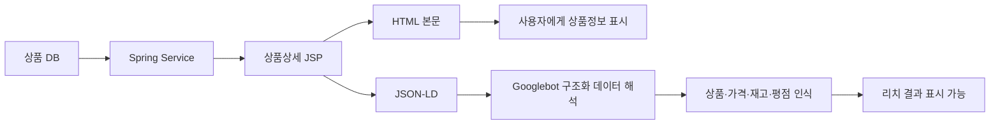
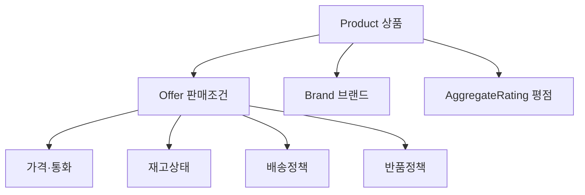
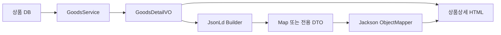
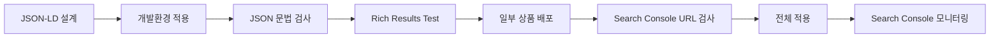

### 1. JSON-LD란?

`JSON-LD`는 **JSON for Linked Data**의 약자로, 웹페이지의 내용을 검색엔진이 이해할 수 있도록 JSON 형식으로 설명하는 구조화 데이터입니다.
사람은 상품상세 화면을 보고 다음 내용을 자연스럽게 구분합니다.

```text
상품명: 프리미엄 무선 이어폰
가격: 89,000원
재고: 판매 중
브랜드: Example Brand
평점: 4.7
리뷰: 128건
```

하지만 검색엔진은 화면에 표시된 숫자와 문장이 각각 상품명인지, 가격인지, 평점인지 정확하게 구별하기 어려울 수 있습니다. JSON-LD는 이를 다음처럼 명시적으로 알려줍니다.

```json
{
  "@type": "Product",
  "name": "프리미엄 무선 이어폰",
  "offers": {
    "@type": "Offer",
    "price": 89000,
    "priceCurrency": "KRW",
    "availability": "https://schema.org/InStock"
  }
}
```

Google은 구조화 데이터를 페이지 내용을 분류하고 의미를 명시적으로 전달하는 표준화된 형식으로 설명하며, 지원 형식 중 JSON-LD를 권장합니다. JSON-LD 자체는 W3C가 정의한 Linked Data의 JSON 직렬화 형식입니다. ([Google for Developers][1])

### 2. JSON-LD의 SEO 목적

JSON-LD를 적용한다고 검색 순위가 자동으로 상승하는 것은 아닙니다. 주요 목적은 Google이 페이지의 의미를 정확하게 이해하도록 만들고, 검색 결과에서 일반 텍스트보다 풍부한 형태로 표시될 수 있는 자격을 확보하는 것입니다.

| 적용하지 않은 검색 결과 | 적용 후 기대 가능한 검색 결과 |
| ------------- | ----------------- |
| 상품명과 설명       | 상품명               |
| 페이지 URL       | 상품 이미지            |
| 일반 설명 문구      | 가격                |
|               | 재고 상태             |
|               | 평점과 리뷰 수          |
|               | 배송·반품 정보          |
- 이러한 형태를 `리치 결과(Rich Result)`라고 합니다. 다만 JSON-LD가 문법적으로 정확해도 Google이 반드시 리치 결과를 표시하는 것은 아니며, 검색어·기기·지역·페이지 품질 등에 따라 일반 결과로 표시될 수 있습니다. ([Google for Developers][1])

### 3. 커머스 사이트에서의 데이터 처리 흐름





중요한 원칙은 다음과 같습니다.

```text
화면에 표시하는 상품 데이터
=
JSON-LD에 작성하는 상품 데이터
```

예를 들어 페이지에서는 `89,000원`인데 JSON-LD에는 `79,000원`이 들어가면 안 됩니다. Google은 구조화 데이터가 페이지의 실제 주요 콘텐츠를 정확하게 나타내야 하고, 사용자에게 보이지 않는 정보나 허위 리뷰를 포함해서는 안 된다고 규정합니다. ([Google for Developers][2])

### 4. 기본 작성 문법

JSON-LD는 HTML 문서에 다음 형태로 삽입합니다.

```html
<script type="application/ld+json">
{
  "@context": "https://schema.org",
  "@type": "Product",
  "name": "프리미엄 무선 이어폰"
}
</script>
```

일반적으로 `<head>` 안에 넣는 것이 관리하기 좋지만, HTML의 `<body>` 안에 존재해도 검색엔진이 처리할 수 있습니다. 커머스 상품 데이터는 가격과 재고의 신뢰성이 중요하므로, 가능하면 Spring/JSP가 생성하는 초기 HTML에 포함시키는 방식을 권장합니다. Google도 모든 쇼핑 검색 결과를 최적화하려는 판매자에게 `Product` 구조화 데이터를 초기 HTML에 포함하도록 권장하며, JavaScript로 동적 생성된 상품 마크업은 가격·재고처럼 빠르게 변경되는 데이터의 크롤링 신뢰성이 낮아질 수 있다고 안내합니다. ([Google for Developers][3])

### 5. JSON-LD 주요 예약어

| 항목          | 의미               | 예                        |
| ----------- | ---------------- | ------------------------ |
| `@context`  | 사용할 용어 체계        | `https://schema.org`     |
| `@type`     | 설명하는 대상의 종류      | `Product`, `Offer`       |
| `@id`       | 대상을 식별하는 고유 ID   | 상품 URL + `#product`      |
| `@graph`    | 한 페이지의 여러 객체를 묶음 | 상품+Breadcrumb            |
| 속성 Property | 대상의 실제 정보        | `name`, `image`, `price` |

#### 5-1. `@context`

```json
"@context": "https://schema.org"
```

`name`, `price`, `Product` 같은 단어를 Schema.org에서 정의한 의미로 해석하라는 뜻입니다.

#### 5-2. `@type`

```json
"@type": "Product"
```

현재 객체가 상품이라는 의미입니다.
중첩 객체는 별도의 타입을 가질 수 있습니다.

```json
{
  "@type": "Product",
  "offers": {
    "@type": "Offer"
  }
}
```

여기서:

```text
Product = 상품 자체
Offer   = 판매 조건
```

상품명, 브랜드, 이미지 등은 `Product`에 작성하고 가격, 통화, 재고, 배송조건 등은 주로 `Offer`에 작성합니다.

#### 5-3. `@id`

```json
"@id": "https://www.example.com/goods/10001#product"
```

`@id`는 JSON-LD 객체를 식별하는 ID입니다. HTML 요소의 `id`와는 다르며, 검색엔진에게 여러 객체가 같은 대상을 가리킨다는 관계를 알려주는 데 사용합니다.
예:

```json
{
  "@type": "Product",
  "@id": "https://www.example.com/goods/10001#product"
}
```

다른 객체에서 해당 상품을 참조할 수 있습니다.

```json
{
  "mainEntity": {
    "@id": "https://www.example.com/goods/10001#product"
  }
}
```

#### 5-4. `@graph`

상품상세 페이지에는 상품뿐만 아니라 Breadcrumb, 웹페이지 정보 등 여러 객체가 존재할 수 있습니다.

```json
{
  "@context": "https://schema.org",
  "@graph": [
    {
      "@type": "Product"
    },
    {
      "@type": "BreadcrumbList"
    }
  ]
}
```

Google은 한 페이지에 여러 구조화 데이터 객체가 존재하는 것을 지원하며, 관련 객체를 중첩하거나 `@id`로 연결할 수 있습니다. ([Google for Developers][2])

### 6. 커머스 페이지별 권장 구조

| 페이지     | 핵심 JSON-LD 타입               | 목적               |
| ------- | --------------------------- | ---------------- |
| 메인·회사소개 | `OnlineStore`               | 쇼핑몰·회사·로고·연락처 식별 |
| 상품상세    | `Product` + `Offer`         | 상품·가격·재고·판매조건    |
| 옵션 상품   | `ProductGroup` + `Product`  | 색상·사이즈 옵션 관계     |
| 상품상세 경로 | `BreadcrumbList`            | 카테고리 경로          |
| 리뷰 영역   | `AggregateRating`, `Review` | 실제 평점·리뷰 정보      |
| 배송정책    | `ShippingService`           | 배송비·배송기간·배송지역    |
| 반품정책    | `MerchantReturnPolicy`      | 반품기간·방법·비용       |
| 오프라인 매장 | `LocalBusiness` 하위 타입       | 주소·영업시간·연락처      |

### 7. 상품상세 페이지의 핵심 구조

커머스 상품상세에서는 다음 관계가 가장 중요합니다.





Google의 판매자 상품 리치 결과를 위한 `Product` 필수 핵심값은 `name`, `image`, `offers`이고, `Offer`에는 현재 판매가격과 통화가 필요합니다. 판매자가 직접 판매하는 상품 페이지에는 `AggregateOffer`가 아니라 개별 `Offer`를 사용해야 합니다. ([Google for Developers][3])

### 8. `Product` 주요 속성

| 속성                | 의미         |      권장 여부 |
| ----------------- | ---------- | ---------: |
| `name`            | 상품명        |         필수 |
| `image`           | 상품 이미지 URL |         필수 |
| `description`     | 상품 설명      |         권장 |
| `sku`             | 자체 상품관리번호  |         권장 |
| `gtin13` 등        | 국제상품식별번호   | 해당 시 적극 권장 |
| `brand`           | 브랜드        |         권장 |
| `category`        | 상품 카테고리    |         권장 |
| `color`           | 색상         |  옵션 상품에 권장 |
| `size`            | 크기·사이즈     |  옵션 상품에 권장 |
| `material`        | 재질         |    해당 시 권장 |
| `model`           | 모델명        |    해당 시 권장 |
| `offers`          | 가격·재고·판매조건 |         필수 |
| `aggregateRating` | 실제 평점 집계   |  리뷰가 있을 때만 |
| `review`          | 실제 리뷰      |  리뷰가 있을 때만 |

#### 8-1. 상품 식별번호

```json
{
  "sku": "GOOD-10001",
  "gtin13": "8801234567890"
}
```

| 값        | 용도          |
| -------- | ----------- |
| `sku`    | 쇼핑몰 내부 상품번호 |
| `gtin8`  | 8자리 GTIN    |
| `gtin12` | UPC         |
| `gtin13` | EAN-13      |
| `gtin14` | GTIN-14     |
| `isbn`   | 도서 ISBN     |
- GTIN이 존재하는 상품은 실제 발급된 값을 넣어야 하며, 임의로 생성해서는 안 됩니다. Google은 일반 `gtin`보다 실제 형식에 맞는 `gtin13`, `gtin14` 등 구체적인 속성 사용을 권장합니다. ([Google for Developers][3])

### 9. `Offer` 주요 속성

| 속성                                | 의미            | 예                |
| --------------------------------- | ------------- | ---------------- |
| `url`                             | 구매 가능한 상품 URL | 상품 canonical URL |
| `price`                           | 현재 실제 판매가격    | `89000`          |
| `priceCurrency`                   | ISO 4217 통화코드 | `KRW`            |
| `availability`                    | 재고 상태         | `InStock`        |
| `itemCondition`                   | 상품 상태         | `NewCondition`   |
| `priceValidUntil`                 | 가격 유효 종료일     | 할인 종료일           |
| `validFrom`                       | 가격 적용 시작일     | 프로모션 시작 시각       |
| `validThrough`                    | 가격 적용 종료일     | 프로모션 종료 시각       |
| `shippingDetails`                 | 배송조건          | 배송비·기간           |
| `hasMerchantReturnPolicy`         | 반품조건          | 반품기간·비용          |
| `price`에는 통화기호나 천 단위 쉼표를 넣지 않습니다. |               |                  |

```json
"price": 89000
```

다음 형태는 피해야 합니다.

```json
"price": "₩89,000"
```

판매자 목록에서는 현재 판매가격이 0보다 커야 하며 `priceCurrency`는 `KRW`, `USD`, `JPY` 같은 3자리 통화코드로 작성합니다. ([Google for Developers][3])

### 10. 재고 상태

```json
"availability": "https://schema.org/InStock"
```

| 상태    | 값                                 |
| ----- | --------------------------------- |
| 판매 가능 | `https://schema.org/InStock`      |
| 품절    | `https://schema.org/OutOfStock`   |
| 예약 판매 | `https://schema.org/PreOrder`     |
| 입고 대기 | `https://schema.org/BackOrder`    |
| 단종    | `https://schema.org/Discontinued` |
| 판매 종료 | `https://schema.org/SoldOut`      |
- 재고 상태는 한 가지 값만 지정하고, 상품 DB의 실제 판매 상태와 자동으로 동기화해야 합니다. ([Google for Developers][3])
### 11. 상품상세 전체 예제

```html
<script type="application/ld+json">
{
  "@context": "https://schema.org",
  "@graph": [
    {
      "@type": "Product",
      "@id": "https://www.example.com/goods/10001#product",
      "name": "프리미엄 노이즈 캔슬링 무선 이어폰",
      "description": "고음질 노이즈 캔슬링과 최대 30시간 재생을 지원하는 무선 이어폰입니다.",
      "image": [
        "https://cdn.example.com/goods/10001/image-1x1.jpg",
        "https://cdn.example.com/goods/10001/image-4x3.jpg",
        "https://cdn.example.com/goods/10001/image-16x9.jpg"
      ],
      "sku": "GOOD-10001",
      "gtin13": "8801234567890",
      "brand": {
        "@type": "Brand",
        "name": "Example Audio"
      },
      "category": "전자제품 > 오디오 > 무선 이어폰",
      "offers": {
        "@type": "Offer",
        "@id": "https://www.example.com/goods/10001#offer",
        "url": "https://www.example.com/goods/10001",
        "price": 89000,
        "priceCurrency": "KRW",
        "availability": "https://schema.org/InStock",
        "itemCondition": "https://schema.org/NewCondition",
        "shippingDetails": {
          "@type": "OfferShippingDetails",
          "shippingRate": {
            "@type": "MonetaryAmount",
            "value": 0,
            "currency": "KRW"
          },
          "shippingDestination": {
            "@type": "DefinedRegion",
            "addressCountry": "KR"
          },
          "deliveryTime": {
            "@type": "ShippingDeliveryTime",
            "handlingTime": {
              "@type": "QuantitativeValue",
              "minValue": 0,
              "maxValue": 1,
              "unitCode": "DAY"
            },
            "transitTime": {
              "@type": "QuantitativeValue",
              "minValue": 1,
              "maxValue": 3,
              "unitCode": "DAY"
            }
          }
        },
        "hasMerchantReturnPolicy": {
          "@type": "MerchantReturnPolicy",
          "applicableCountry": "KR",
          "returnPolicyCountry": "KR",
          "returnPolicyCategory": "https://schema.org/MerchantReturnFiniteReturnWindow",
          "merchantReturnDays": 7,
          "returnMethod": "https://schema.org/ReturnByMail",
          "returnFees": "https://schema.org/ReturnShippingFees"
        }
      },
      "aggregateRating": {
        "@type": "AggregateRating",
        "ratingValue": 4.7,
        "reviewCount": 128,
        "bestRating": 5,
        "worstRating": 1
      }
    },
    {
      "@type": "BreadcrumbList",
      "@id": "https://www.example.com/goods/10001#breadcrumb",
      "itemListElement": [
        {
          "@type": "ListItem",
          "position": 1,
          "name": "전자제품",
          "item": "https://www.example.com/category/electronics"
        },
        {
          "@type": "ListItem",
          "position": 2,
          "name": "오디오",
          "item": "https://www.example.com/category/audio"
        },
        {
          "@type": "ListItem",
          "position": 3,
          "name": "무선 이어폰",
          "item": "https://www.example.com/category/earphones"
        },
        {
          "@type": "ListItem",
          "position": 4,
          "name": "프리미엄 노이즈 캔슬링 무선 이어폰"
        }
      ]
    }
  ]
}
</script>
```

이 예제의 `aggregateRating`은 페이지에 실제 사용자 평점 4.7점과 리뷰 128건이 표시될 때만 포함해야 합니다. 리뷰가 없다면 0점 데이터를 만드는 것이 아니라 `aggregateRating` 객체 전체를 제거해야 합니다. Google은 사용자에게 보이지 않는 리뷰나 허위 평점을 구조화 데이터로 작성하는 것을 금지합니다. ([Google for Developers][4])

### 12. 이미지 최적화

```json
"image": [
  "https://cdn.example.com/goods/10001/image-1x1.jpg",
  "https://cdn.example.com/goods/10001/image-4x3.jpg",
  "https://cdn.example.com/goods/10001/image-16x9.jpg"
]
```

Google은 상품 구조화 데이터에서 제품이 명확하게 보이는 고해상도 이미지를 권장하며, 좋은 결과를 위해 `1:1`, `4:3`, `16:9` 비율의 여러 이미지를 제공하도록 안내합니다. 이미지 URL은 Googlebot이 로그인 없이 접근할 수 있고 크롤링·색인이 가능해야 합니다. ([Google for Developers][3])

| 점검 항목      | 권장 기준                |
| ---------- | -------------------- |
| URL        | HTTPS 절대 URL         |
| 접근 권한      | 로그인·세션 불필요           |
| robots.txt | 이미지 차단 금지            |
| 내용         | 실제 상품 이미지            |
| 해상도        | 고해상도                 |
| 비율         | 1:1, 4:3, 16:9 복수 제공 |
| 품절 이미지     | 오래된 가격·할인문구 포함 주의    |

### 13. 할인 가격 처리

현재 판매가격이 89,000원이고 기존 정상가격이 109,000원이라면 `UnitPriceSpecification`을 이용할 수 있습니다.

```json
{
  "@type": "Offer",
  "url": "https://www.example.com/goods/10001",
  "price": 89000,
  "priceCurrency": "KRW",
  "validFrom": "2026-07-30T00:00:00+09:00",
  "priceValidUntil": "2026-08-15T23:59:59+09:00",
  "priceSpecification": {
    "@type": "UnitPriceSpecification",
    "priceType": "https://schema.org/StrikethroughPrice",
    "price": 109000,
    "priceCurrency": "KRW"
  }
}
```

| 값                    | 의미               |
| -------------------- | ---------------- |
| `Offer.price`        | 현재 실제 판매가격       |
| `StrikethroughPrice` | 취소선으로 표시되는 기존 가격 |
| `validFrom`          | 할인 시작 시점         |
| `priceValidUntil`    | 할인 종료 시점         |
- 할인 기간에는 시작일과 종료일을 모두 제공하고 ISO 8601 형식에 시간대까지 포함하는 것이 권장됩니다. `priceValidUntil`이 과거 날짜로 남아 있으면 상품 목록이 표시되지 않을 수 있으므로, 프로모션 종료 후 즉시 갱신하거나 해당 속성을 제거해야 합니다. ([Google for Developers][3])

### 14. 상품 옵션 처리

색상이나 사이즈별로 가격·재고·상품번호가 달라지면 단순 `Product` 하나보다 `ProductGroup`을 고려해야 합니다.

```text
상위 상품: 무선 이어폰
 ├─ 블랙 / 128GB
 ├─ 화이트 / 128GB
 └─ 블랙 / 256GB
```

기본 구조:

```json
{
  "@context": "https://schema.org",
  "@type": "ProductGroup",
  "name": "프리미엄 무선 이어폰",
  "productGroupID": "GOOD-10001",
  "variesBy": [
    "https://schema.org/color",
    "https://schema.org/size"
  ],
  "hasVariant": [
    {
      "@type": "Product",
      "name": "프리미엄 무선 이어폰 블랙",
      "sku": "GOOD-10001-BK",
      "color": "Black",
      "offers": {
        "@type": "Offer",
        "price": 89000,
        "priceCurrency": "KRW",
        "availability": "https://schema.org/InStock"
      }
    },
    {
      "@type": "Product",
      "name": "프리미엄 무선 이어폰 화이트",
      "sku": "GOOD-10001-WH",
      "color": "White",
      "offers": {
        "@type": "Offer",
        "price": 89000,
        "priceCurrency": "KRW",
        "availability": "https://schema.org/OutOfStock"
      }
    }
  ]
}
```

Google은 옵션 상품을 `ProductGroup`, `variesBy`, `hasVariant`, `productGroupID`로 묶도록 지원합니다. 한 페이지에서 옵션만 변경하는 구조와 옵션별로 별도 URL을 사용하는 구조 모두 지원하지만, 각 옵션의 URL·가격·재고·SKU 관계를 일관되게 제공해야 합니다. ([Google for Developers][5])

### 15. Breadcrumb 적용

```json
{
  "@type": "BreadcrumbList",
  "itemListElement": [
    {
      "@type": "ListItem",
      "position": 1,
      "name": "전자제품",
      "item": "https://www.example.com/category/electronics"
    },
    {
      "@type": "ListItem",
      "position": 2,
      "name": "오디오",
      "item": "https://www.example.com/category/audio"
    },
    {
      "@type": "ListItem",
      "position": 3,
      "name": "무선 이어폰"
    }
  ]
}
```

Breadcrumb는 단순 URL 디렉터리 구조가 아니라 사용자가 실제로 이동하는 대표 카테고리 경로를 표현하는 것이 좋습니다. Google은 `BreadcrumbList`에 최소 두 개 이상의 `ListItem`을 요구하며, 마지막 항목은 현재 페이지 URL을 생략할 수 있습니다. ([Google for Developers][6])

### 16. 회사·쇼핑몰 정보

메인 페이지 또는 회사소개 페이지에는 일반 `Organization`보다 커머스 사이트에 구체적인 `OnlineStore`를 사용하는 것이 적합합니다.

```html
<script type="application/ld+json">
{
  "@context": "https://schema.org",
  "@type": "OnlineStore",
  "@id": "https://www.example.com/#organization",
  "name": "Example Store",
  "url": "https://www.example.com",
  "logo": "https://www.example.com/images/logo.png",
  "email": "support@example.com",
  "telephone": "+82-2-1234-5678",
  "contactPoint": {
    "@type": "ContactPoint",
    "contactType": "Customer Service",
    "telephone": "+82-2-1234-5678",
    "email": "support@example.com"
  }
}
</script>
```

Google은 조직 정보는 모든 페이지에 반복하기보다 홈페이지 또는 회사소개처럼 조직을 대표하는 한 페이지에 넣을 것을 권장하며, 온라인 쇼핑몰에는 `OnlineStore` 하위 타입을 권장합니다. ([Google for Developers][7])

### 17. 배송·반품 정책의 위치

대부분의 상품에 동일한 배송·반품 정책이 적용된다면 상품마다 전체 정책을 반복하기보다 `OnlineStore`에 글로벌 정책을 정의하는 것이 좋습니다.

```text
OnlineStore
 ├─ hasShippingService
 └─ hasMerchantReturnPolicy
Product > Offer
 ├─ 글로벌 정책 참조
 └─ 예외 상품만 별도 정책 정의
```

Google은 표준 배송·반품 정책을 조직 수준에 작성하고, 특정 상품만 다른 정책이 적용될 때 `Offer` 수준에서 재정의하는 방식을 권장합니다. 상품 수준 정책이 존재하면 상품 정책이 조직 수준 정책보다 우선합니다. ([Google for Developers][8])

### 18. 카테고리·상품목록 페이지 적용

카테고리 페이지에 있는 모든 상품카드에 `Product`를 대량 작성한다고 상품 리치 결과가 강화되는 것은 아닙니다.
Google의 상품 리치 결과는 다음 페이지를 중심으로 지원합니다.

```text
단일 상품 페이지
또는
동일 상품의 옵션들을 보여주는 페이지
```

다음과 같은 페이지에는 상품 리치 결과용 `Product`를 우선 적용하지 않는 것이 좋습니다.

```text
신발 전체 목록
인기 상품 100개
검색 결과 페이지
여러 카테고리 상품이 섞인 기획전
```

Google은 상품 목록·카테고리보다 한 상품 또는 동일 상품의 여러 옵션에 집중된 페이지에 `Product` 마크업을 적용하도록 권장합니다. 카테고리 페이지에는 우선 `BreadcrumbList`를 적용하고, 상세 상품 마크업은 각 상품상세 URL에서 제공하는 구조가 안정적입니다. ([Google for Developers][3])

### 19. Spring MVC/JSP 적용 구조

#### 19-1. 권장 구조





핵심은 화면용 데이터와 JSON-LD 데이터를 동일한 `GoodsDetailVO`에서 생성하는 것입니다.

```text
잘못된 구조
화면 가격 ← 상품 DB
JSON-LD 가격 ← GTM 변수 또는 별도 하드코딩
권장 구조
화면 가격 ┐
          ├─ 동일 GoodsDetailVO
JSON-LD 가격┘
```

#### 19-2. Controller 예시

```java
@GetMapping("/goods/{goodsSn}")
public String goodsDetail(
        @PathVariable Long goodsSn,
        Model model) throws JsonProcessingException {
    GoodsDetailVO goods = goodsService.selectGoodsDetail(goodsSn);
    Map<String, Object> jsonLd = productJsonLdBuilder.build(goods);
    String jsonLdText = objectMapper.writeValueAsString(jsonLd)
            .replace("<", "\\u003c")
            .replace(">", "\\u003e")
            .replace("&", "\\u0026");
    model.addAttribute("goods", goods);
    model.addAttribute("productJsonLd", jsonLdText);
    return "goods/goodsDetail";
}
```

#### 19-3. JSP 예시

```jsp
<head>
    <title>
        <c:out value="${goods.goodsName}"/> | Example Store
    </title>
    <script type="application/ld+json"><c:out value="${productJsonLd}" escapeXml="false"/></script>
</head>
```

`JSON-LD` 문자열을 JSP에서 직접 이어 붙이는 방법은 피하는 것이 좋습니다.

```jsp
<!-- 권장하지 않음 -->
<script type="application/ld+json">
{
  "name": "${goods.goodsName}",
  "description": "${goods.description}"
}
</script>
```

상품명이나 설명에 `"`, 줄바꿈 또는 `</script>` 문자열이 포함되면 JSON 문법이 깨지거나 스크립트 종료 태그가 주입될 수 있습니다. Jackson 같은 JSON 직렬화 라이브러리를 사용하고 `<`, `>`, `&`를 유니코드 이스케이프한 뒤 출력하는 편이 안전합니다.

### 20. GTM으로 생성하는 방법

GTM Custom HTML 태그에서도 JSON-LD를 추가할 수 있습니다.

```html
<script type="application/ld+json">
{
  "@context": "https://schema.org",
  "@type": "Product",
  "name": "{{DLV - goodsName}}"
}
</script>
```

Google은 GTM이나 JavaScript로 생성한 JSON-LD도 처리할 수 있다고 안내합니다. 그러나 커머스 상품의 가격·재고는 변경이 잦고 페이지와 JSON-LD 값이 불일치할 위험이 크므로, 상품상세의 핵심 `Product`와 `Offer`는 Spring/JSP 서버 렌더링을 우선하는 것이 좋습니다. GTM은 임시 적용이나 정적 정책 태그에는 사용할 수 있지만, 운영 상품정보의 기준 데이터 소스로 사용하기에는 적합하지 않습니다. ([Google for Developers][9])

### 21. JSON-LD와 다른 SEO 요소의 관계

| 요소                   | 목적                    |
| -------------------- | --------------------- |
| `<title>`            | 검색 결과 제목 후보           |
| `meta description`   | 검색 결과 설명 후보           |
| `canonical`          | 대표 URL 지정             |
| OG 태그                | SNS·메신저 공유 정보         |
| JSON-LD              | 페이지 데이터의 의미와 관계 설명    |
| XML Sitemap          | 수집 대상 URL 전달          |
| Merchant Center Feed | 상품 데이터를 Google에 직접 공급 |

- 상품상세에서는 다음 값을 일치시키는 것이 중요합니다.

```text
<title> 상품명
=
og:title
=
화면의 H1 상품명
=
JSON-LD Product.name
```

```text
화면 판매가격
=
JSON-LD Offer.price
=
Merchant Center feed 가격
```

Google은 상품 구조화 데이터와 Merchant Center를 함께 사용할 수 있으며, 가격·재고 불일치는 상품 노출과 데이터 검증에 문제를 일으킬 수 있다고 설명합니다. Merchant Center는 Shopping 탭 같은 일부 노출 위치에서 필수이며, 재고처럼 변경이 잦은 데이터는 피드나 API를 통해 더 빠르게 갱신할 수 있습니다. ([Google for Developers][10])

### 22. 최적화 우선순위

| 순위 | 최적화 항목     | 핵심 조치                      |
| -: | ---------- | -------------------------- |
|  1 | 데이터 정확성    | 화면·DB·JSON-LD 값 일치         |
|  2 | 초기 HTML 생성 | Spring/JSP에서 서버 렌더링        |
|  3 | 상품 식별      | SKU·GTIN·브랜드 정확히 입력        |
|  4 | 가격·재고 동기화  | 실시간 또는 상품 변경 시 즉시 반영       |
|  5 | 이미지        | 고해상도·다중 비율·크롤링 허용          |
|  6 | 상품 옵션      | `ProductGroup` 적용          |
|  7 | 리뷰 신뢰성     | 실제 노출 리뷰만 적용               |
|  8 | 배송·반품      | 글로벌 정책과 상품 예외 분리           |
|  9 | Breadcrumb | 사용자 중심 카테고리 경로             |
| 10 | 검증 자동화     | 배포 전 JSON 및 Rich Result 검사 |

### 23. 배포 및 검증 절차





| 단계                                                                                                                                                                                            | 확인 내용                   |
| --------------------------------------------------------------------------------------------------------------------------------------------------------------------------------------------- | ----------------------- |
| JSON 문법 검사                                                                                                                                                                                    | 쉼표·따옴표·객체 구조            |
| Rich Results Test                                                                                                                                                                             | Google 지원 타입과 필수 속성     |
| Schema.org Validator                                                                                                                                                                          | Schema.org 전체 문법        |
| URL 검사                                                                                                                                                                                        | Google이 렌더링한 실제 HTML    |
| 페이지 소스 보기                                                                                                                                                                                     | 초기 HTML에 JSON-LD 존재 여부  |
| Search Console                                                                                                                                                                                | 상품·Breadcrumb 개선사항 오류   |
| 운영 비교                                                                                                                                                                                         | 화면 가격·재고와 JSON-LD 일치 여부 |
| Google은 필수 속성 추가 후 Rich Results Test로 치명적 오류를 수정하고, 일부 페이지에 먼저 배포한 뒤 URL 검사 도구로 Google이 실제 페이지를 어떻게 보는지 확인할 것을 권장합니다. 정상 확인 후 사이트맵을 제출하고 전체 페이지로 확대하는 방식이 안전합니다. ([Google for Developers][3]) |                         |

### 24. 자주 발생하는 오류

| 오류                      | 영향               | 개선                |
| ----------------------- | ---------------- | ----------------- |
| 가격에 `₩`, 쉼표 포함          | 가격 해석 실패 가능      | 숫자만 입력            |
| 통화코드 `원` 사용             | 표준 통화로 인식 안 됨    | `KRW` 사용          |
| 품절인데 `InStock` 유지       | 데이터 불일치          | DB 상태 연동          |
| 과거 `priceValidUntil` 유지 | 상품 표시 제한 가능      | 종료 후 갱신·삭제        |
| 리뷰가 없는데 평점 생성           | 허위 데이터 정책 위반     | 평점 객체 제거          |
| 화면에 없는 설명 작성            | 숨겨진 구조화 데이터      | 화면 콘텐츠와 일치        |
| 상대 이미지 URL              | 크롤러 접근 문제        | HTTPS 절대 URL      |
| 로그인 필요 이미지              | Google 이미지 수집 실패 | 공개 CDN URL 사용     |
| 카테고리에 상품 수백 개 마크업       | 상품 리치 결과 대상 부적합  | 상세 페이지 중심 적용      |
| GTM에서 가격 하드코딩           | 화면과 불일치          | 서버 데이터로 생성        |
| 옵션별 SKU·재고 미분리          | 옵션 관계 오인식        | `ProductGroup` 적용 |
| JSON 문자열 직접 조립          | 문법·XSS 위험        | Jackson 직렬화       |
| Schema.org 속성만 보고 적용    | Google 미지원 가능    | Google 지원 문서 병행   |

### 25. Schema.org와 Google 지원 범위의 차이

Schema.org에 정의된 타입과 속성이 모두 Google 검색 결과에 사용되는 것은 아닙니다.

```text
Schema.org
= 구조화 데이터 전체 용어 체계
Google Search 문서
= Google이 실제 검색 기능에서 지원하는 일부 타입과 속성
```

따라서 구현할 때는 다음 순서로 검토해야 합니다.

```text
1. Google Search가 해당 리치 결과를 지원하는가?
2. Google이 요구하는 필수 속성은 무엇인가?
3. Schema.org에서 추가로 표현할 유용한 속성이 있는가?
```

Google도 Schema.org의 여러 타입 중 일부만 검색 기능으로 지원한다고 명시합니다. ([Google for Developers][11])

### 26. 커머스 사이트 권장 최종 구성

```text
홈페이지 또는 회사소개
└─ OnlineStore
   ├─ logo
   ├─ contactPoint
   ├─ hasShippingService
   └─ hasMerchantReturnPolicy
상품상세
├─ Product
│  ├─ name
│  ├─ image
│  ├─ sku / gtin
│  ├─ brand
│  ├─ aggregateRating
│  └─ Offer
│     ├─ price
│     ├─ priceCurrency
│     ├─ availability
│     └─ itemCondition
└─ BreadcrumbList
옵션 상품
└─ ProductGroup
   ├─ productGroupID
   ├─ variesBy
   └─ hasVariant
```

가장 중요한 최적화 원칙은 **많은 속성을 넣는 것보다 실제 상품 DB와 정확히 동기화된 구조화 데이터를 초기 HTML에 안정적으로 출력하는 것**입니다. JSON-LD는 별도의 광고문구를 작성하는 영역이 아니라, 사용자가 현재 페이지에서 확인할 수 있는 상품명·가격·재고·평점·배송조건을 검색엔진이 이해할 수 있는 구조로 다시 표현하는 계층입니다.

[1]: https://developers.google.com/search/docs/appearance/structured-data/intro-structured-data "Intro to How Structured Data Markup Works | Google Search Central  |  Documentation  |  Google for Developers"
[2]: https://developers.google.com/search/docs/appearance/structured-data/sd-policies "General Structured Data Guidelines | Google Search Central  |  Documentation  |  Google for Developers"
[3]: https://developers.google.com/search/docs/appearance/structured-data/merchant-listing "How To Add Merchant Listing Structured Data | Google Search Central  |  Documentation  |  Google for Developers"
[4]: https://developers.google.com/search/docs/appearance/structured-data/review-snippet?utm_source=chatgpt.com "Review Snippet (Review, AggregateRating) Structured Data"
[5]: https://developers.google.com/search/docs/appearance/structured-data/product-variants "Product Variant Structured Data (ProductGroup, Product) | Google Search Central  |  Documentation  |  Google for Developers"
[6]: https://developers.google.com/search/docs/appearance/structured-data/breadcrumb "How To Add Breadcrumb (BreadcrumbList) Markup | Google Search Central  |  Documentation  |  Google for Developers"
[7]: https://developers.google.com/search/docs/appearance/structured-data/organization "Organization Schema Markup | Google Search Central  |  Documentation  |  Google for Developers"
[8]: https://developers.google.com/search/docs/appearance/structured-data/return-policy "Merchant Return Policy Structured Data (MerchantReturnPolicy) | Google Search Central  |  Documentation  |  Google for Developers"
[9]: https://developers.google.com/search/docs/appearance/structured-data/generate-structured-data-with-javascript "Generate Structured Data with JavaScript | Google Search Central  |  Documentation  |  Google for Developers"
[10]: https://developers.google.com/search/docs/specialty/ecommerce/share-your-product-data-with-google "Share Your Product Data With Google | Google Search Central  |  Documentation  |  Google for Developers"
[11]: https://developers.google.com/search/docs/specialty/ecommerce/include-structured-data-relevant-to-ecommerce "Structured Data for Ecommerce Sites | Google Search Central  |  Documentation  |  Google for Developers"
<details>
  <summary>참고</summary>  
  <pre>
  </pre>
</details>
