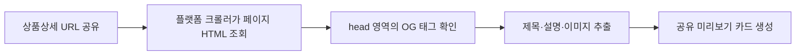

### 1. OG 태그란?

**OG(Open Graph) 태그**는 상품상세 URL을 카카오톡, 페이스북, 링크드인, 슬랙 등에서 공유할 때 표시되는 다음 정보를 지정하는 `<meta>` 태그입니다.

* 공유 제목
* 설명
* 대표 이미지
* 대상 URL
* 사이트명
  예를 들어 상품 URL을 카카오톡에 붙여 넣었을 때 보이는 이미지와 제목은 페이지 본문이 아니라 주로 OG 태그를 기반으로 만들어집니다.





Open Graph Protocol은 웹페이지를 소셜 그래프에서 표현할 수 있도록 설계됐으며, 기본 필수 속성은 `og:title`, `og:type`, `og:image`, `og:url`입니다. ([Open Graph][1])

### 2. OG 태그는 SEO 태그인가?

정확히 말하면 OG 태그의 주목적은 **검색 순위 최적화가 아니라 소셜 공유 미리보기 최적화**입니다.

| 항목                                                                                                                                                                                      | 주요 목적               |
| --------------------------------------------------------------------------------------------------------------------------------------------------------------------------------------- | ------------------- |
| `<title>`                                                                                                                                                                               | Google 검색 결과 제목     |
| `meta description`                                                                                                                                                                      | Google 검색 결과 설명 후보  |
| `canonical`                                                                                                                                                                             | 대표 URL 지정           |
| `Product` JSON-LD                                                                                                                                                                       | 가격·재고·평점 등 상품 리치 결과 |
| OG 태그                                                                                                                                                                                   | SNS·메신저 공유 미리보기     |
| OG 태그가 Google 검색 순위를 직접 높이는 핵심 태그라고 보기는 어렵습니다. 다만 공유 카드의 품질이 좋아지면 클릭과 재공유가 증가할 수 있으므로 **간접적인 트래픽 개선 효과**는 기대할 수 있습니다.                                                                   |                     |
| Google 검색 설명은 페이지 본문과 `<meta name="description">`을 주로 사용하며, 상품 가격·재고·평점 노출에는 `Product` 구조화 데이터가 사용됩니다. 따라서 OG 태그를 일반 SEO 메타 태그나 상품 구조화 데이터 대신 사용해서는 안 됩니다. ([Google for Developers][2]) |                     |

### 3. OG 태그 기본 문법

```html
<meta property="og:title" content="상품명">
```

이 코드는 `<meta>` 요소와 두 개의 Attribute로 구성됩니다.

| Attribute  | 의미                 | 예시            |
| ---------- | ------------------ | ------------- |
| `property` | 어떤 OG 정보를 정의하는지 지정 | `og:title`    |
| `content`  | 실제로 전달할 값          | `삼성 OLED 모니터` |

#### 3-1. `property`

```html
property="og:title"
```

OG 속성의 종류를 지정합니다.
OG 태그는 일반 메타 태그의 `name`이 아니라 주로 `property`를 사용합니다.

```html
<!-- OG 태그 -->
<meta property="og:title" content="상품명">
<!-- 일반 SEO 설명 태그 -->
<meta name="description" content="상품 설명">
```

#### 3-2. `content`

```html
content="삼성 OLED 모니터"
```

크롤러에게 전달할 실제 값입니다.
상품상세 페이지에서는 상품명, 상품설명, 상품 이미지 URL 등이 동적으로 들어갑니다.

### 4. 기본 OG 속성

#### 4-1. 필수 핵심 속성

| OG 속성      | 의미         | 상품상세 예      |
| ---------- | ---------- | ----------- |
| `og:title` | 공유 카드 제목   | 상품명         |
| `og:type`  | 페이지 콘텐츠 유형 | `website`   |
| `og:image` | 대표 이미지 URL | 상품 대표 이미지   |
| `og:url`   | 대표 상품 URL  | 상품상세 정규 URL |

- Open Graph 공식 규격은 이 네 가지를 기본 필수 속성으로 정의합니다. ([Open Graph][1])

#### 4-2. 권장 추가 속성

| OG 속성                 | 의미          | 예            |
| --------------------- | ----------- | ------------ |
| `og:description`      | 공유 카드 설명    | 상품 특징, 가격 정보 |
| `og:site_name`        | 사이트명        | `buyKOREA`   |
| `og:locale`           | 기본 언어·지역    | `ko_KR`      |
| `og:locale:alternate` | 대체 언어       | `en_US`      |
| `og:image:width`      | 이미지 너비      | `1200`       |
| `og:image:height`     | 이미지 높이      | `630`        |
| `og:image:type`       | 이미지 MIME 타입 | `image/jpeg` |
| `og:image:alt`        | 이미지 대체 설명   | 상품 이미지 설명    |

- `og:description`, `og:locale`, `og:site_name` 등은 권장 선택 속성이고, 이미지에는 너비·높이·타입·대체 설명 등의 구조화 속성을 추가할 수 있습니다. ([Open Graph][1])

### 5. 커머스 상품상세 페이지 적용 예시

```html
<head>
    <title>프리미엄 무선 이어폰 | buyKOREA</title>
    <meta name="description"
          content="고음질 노이즈 캔슬링을 지원하는 프리미엄 무선 이어폰입니다.">
    <link rel="canonical"
          href="https://www.example.com/goods/detail/10001">
    <meta property="og:title"
          content="프리미엄 무선 이어폰">
    <meta property="og:description"
          content="고음질 노이즈 캔슬링과 최대 30시간 재생을 지원합니다.">
    <meta property="og:type"
          content="website">
    <meta property="og:url"
          content="https://www.example.com/goods/detail/10001">
    <meta property="og:site_name"
          content="buyKOREA">
    <meta property="og:locale"
          content="ko_KR">
    <meta property="og:image"
          content="https://cdn.example.com/goods/10001/og-main.jpg">
    <meta property="og:image:secure_url"
          content="https://cdn.example.com/goods/10001/og-main.jpg">
    <meta property="og:image:type"
          content="image/jpeg">
    <meta property="og:image:width"
          content="1200">
    <meta property="og:image:height"
          content="630">
    <meta property="og:image:alt"
          content="프리미엄 무선 이어폰 제품 이미지">
</head>
```

### 6. 속성별 최적화 방법

### 7. `og:title`

공유 카드에서 가장 눈에 띄는 제목입니다.

```html
<meta property="og:title"
      content="프리미엄 무선 이어폰 | 최대 30시간 재생">
```

권장 기준:

* 페이지마다 고유한 제목 사용
* 상품명을 제목 앞부분에 배치
* 사이트명, 카테고리, 상품명을 과도하게 반복하지 않음
* 검색 키워드를 나열하지 않음
* 사용자가 실제 페이지에서 확인할 수 있는 내용만 작성
  좋지 않은 예:

```html
<meta property="og:title"
      content="이어폰 무선이어폰 블루투스이어폰 최저가 할인 추천 인기">
```

개선 예:

```html
<meta property="og:title"
      content="프리미엄 노이즈 캔슬링 무선 이어폰">
```

플랫폼과 화면 크기에 따라 제목이 잘릴 수 있으므로 절대적인 글자 수보다 **핵심 상품명을 앞쪽에 배치하는 것**이 중요합니다.

### 8. `og:description`

상품의 핵심 장점과 공유 클릭 이유를 설명합니다.

```html
<meta property="og:description"
      content="고음질 노이즈 캔슬링과 최대 30시간 재생을 지원하는 무선 이어폰입니다.">
```

권장 구성:

```text
상품 핵심 특징
+ 주요 장점
+ 배송·혜택 등 유효한 정보
```

예:

```html
<meta property="og:description"
      content="고음질 노이즈 캔슬링, 최대 30시간 재생. 국내 무료배송 상품입니다.">
```

주의:

* 모든 상품에 같은 설명 사용 금지
* 키워드만 나열하지 않음
* 실제 가격·재고와 불일치하는 문구 금지
* 기간이 끝난 할인 문구를 장기간 유지하지 않음
  Google도 대규모 상품 사이트에서 페이지별 데이터를 이용해 설명을 자동 생성하는 것을 허용하고 권장하지만, 사람이 읽을 수 있고 상품별로 달라야 한다고 안내합니다. ([Google for Developers][2])

### 9. `og:type`

페이지의 콘텐츠 유형을 지정합니다.

```html
<meta property="og:type" content="website">
```

Open Graph 공식 전역 유형에는 `website`, `article`, `profile`, `book` 등이 있지만, 현재 핵심 규격에는 범용적인 `product` 유형이 정의되어 있지 않습니다. 별도 플랫폼 요구사항이 없다면 일반 상품상세 페이지에 `website`를 사용하는 것이 호환성 측면에서 안전합니다. ([Open Graph][1])
상품이라는 의미와 가격·재고 정보는 OG 타입보다는 Google `Product` JSON-LD로 전달하는 것이 적절합니다.

```html
<script type="application/ld+json">
{
  "@context": "https://schema.org",
  "@type": "Product",
  "name": "프리미엄 무선 이어폰",
  "image": [
    "https://cdn.example.com/goods/10001/main.jpg"
  ],
  "sku": "10001",
  "offers": {
    "@type": "Offer",
    "priceCurrency": "KRW",
    "price": "89000",
    "availability": "https://schema.org/InStock",
    "url": "https://www.example.com/goods/detail/10001"
  }
}
</script>
```

Google 상품 검색에서 가격, 재고, 평점 등을 풍부하게 표현하려면 `Product` 구조화 데이터를 별도로 구현해야 합니다. ([Google for Developers][3])

### 10. `og:url`

공유 대상 페이지의 대표 URL입니다.

```html
<meta property="og:url"
      content="https://www.example.com/goods/detail/10001">
```

다음 URL을 그대로 넣으면 안 됩니다.

```text
https://www.example.com/goods/detail/10001
?utm_source=facebook
&sessionId=ABC123
&sort=popular
```

권장:

```text
https://www.example.com/goods/detail/10001
```

최적화 원칙:

* 절대 URL 사용
* HTTPS 사용
* 세션 ID 제거
* 광고·추적 파라미터 제거
* 동일 상품은 하나의 고정 URL 사용
* `<link rel="canonical">`과 동일하게 맞춤

```html
<link rel="canonical"
      href="https://www.example.com/goods/detail/10001">
<meta property="og:url"
      content="https://www.example.com/goods/detail/10001">
```

`og:url`은 Open Graph 객체를 식별하는 영구적인 대표 URL 역할을 합니다. ([Open Graph][1])

### 11. `og:image`

공유 카드의 대표 이미지입니다.

```html
<meta property="og:image"
      content="https://cdn.example.com/goods/10001/og-main.jpg">
```

#### 11-1. 권장 이미지 기준

| 항목                                                                                         | 권장값                 |
| ------------------------------------------------------------------------------------------ | ------------------- |
| 크기                                                                                         | `1200 × 630px`      |
| 비율                                                                                         | 약 `1.91:1`          |
| 프로토콜                                                                                       | HTTPS               |
| URL 형식                                                                                     | 절대 URL              |
| 접근 권한                                                                                      | 로그인 없이 접근 가능        |
| 이미지 내용                                                                                     | 상품이 중앙에 명확히 보이도록 구성 |
| Meta는 고해상도 공유 표시를 위해 최소한의 일반 이미지보다 `1200×630px` 수준의 이미지를 권장합니다. ([Facebook Developers][4]) |                     |
| 상품 원본 이미지가 정사각형이라면 OG 전용 이미지를 별도로 만드는 것이 좋습니다.                                             |                     |

```text
1200×630 캔버스
 ├─ 중앙: 상품 이미지
 ├─ 좌측 또는 하단: 상품명
 ├─ 작은 영역: 브랜드명
 └─ 충분한 여백
```

주의:

* 이미지 안에 너무 작은 글자 사용 금지
* 가격을 이미지에 박아 넣으면 가격 변경 시 불일치 발생
* 품절·할인 종료 후 오래된 이미지가 공유될 수 있음
* 인증 쿠키가 필요한 이미지 URL 사용 금지
* 상대 경로보다 완전한 HTTPS URL 사용
  좋지 않은 예:

```html
<meta property="og:image"
      content="/images/goods/10001.jpg">
```

권장:

```html
<meta property="og:image"
      content="https://cdn.example.com/images/goods/10001/og.jpg">
```

### 12. `og:image:width`, `og:image:height`

크롤러가 이미지를 직접 다운로드하기 전에 이미지 크기를 파악하도록 도와줍니다.

```html
<meta property="og:image:width" content="1200">
<meta property="og:image:height" content="630">
```

단위는 작성하지 않습니다.

```html
<!-- 잘못된 예 -->
<meta property="og:image:width" content="1200px">
<!-- 올바른 예 -->
<meta property="og:image:width" content="1200">
```

### 13. `og:image:alt`

이미지에 어떤 내용이 있는지 설명합니다.

```html
<meta property="og:image:alt"
      content="검은색 프리미엄 무선 이어폰과 충전 케이스">
```

Open Graph 규격은 `og:image`가 있다면 `og:image:alt`도 함께 지정할 것을 권장합니다. 캡션이나 광고 문구가 아니라 이미지 자체의 내용을 설명해야 합니다. ([Open Graph][5])

### 14. `og:site_name`

서비스 또는 쇼핑몰 이름입니다.

```html
<meta property="og:site_name" content="buyKOREA">
```

모든 상품에 동일하게 사용하고 상품명을 넣지 않습니다.

```html
<!-- 잘못된 예 -->
<meta property="og:site_name"
      content="프리미엄 무선 이어폰">
```

### 15. `og:locale`

페이지 언어와 지역을 지정합니다.

```html
<meta property="og:locale" content="ko_KR">
<meta property="og:locale:alternate" content="en_US">
```

형식은 하이픈이 아닌 언더스코어를 사용합니다.

```text
ko_KR
en_US
ja_JP
```

다국어 사이트에서는 언어별 URL의 실제 OG 제목과 설명도 해당 언어로 출력해야 합니다.

### 16. 여러 이미지 설정

OG 이미지는 여러 개 지정할 수 있습니다.

```html
<meta property="og:image"
      content="https://cdn.example.com/goods/10001/og-main.jpg">
<meta property="og:image:width" content="1200">
<meta property="og:image:height" content="630">
<meta property="og:image"
      content="https://cdn.example.com/goods/10001/og-sub.jpg">
<meta property="og:image:width" content="1200">
<meta property="og:image:height" content="630">
```

Open Graph 규격에서는 동일 속성이 여러 개 있으면 **먼저 선언된 값을 우선적으로 처리**합니다. 따라서 가장 중요한 대표 이미지를 첫 번째에 둬야 합니다. ([Open Graph][5])

### 17. Spring MVC/JSP 적용 예

#### 17-1. Controller

```java
@GetMapping("/goods/detail.do")
public String goodsDetail(
        @RequestParam("goodsSn") Long goodsSn,
        Model model) {
    GoodsDetail goods = goodsService.getGoodsDetail(goodsSn);
    String canonicalUrl =
            siteProperties.getBaseUrl()
            + "/goods/detail.do?goodsSn="
            + goodsSn;
    model.addAttribute("goods", goods);
    model.addAttribute("canonicalUrl", canonicalUrl);
    return "goods/goodsDetail";
}
```

운영 도메인은 요청의 `Host` 헤더로 직접 조합하기보다 환경 설정값으로 관리하는 것이 안전합니다.

```properties
site.base-url=https://www.example.com
```

#### 17-2. JSP

```jsp
<head>
    <title>
        <c:out value="${goods.goodsName}"/> | buyKOREA
    </title>
    <meta name="description"
          content="<c:out value='${goods.metaDescription}'/>">
    <link rel="canonical"
          href="<c:out value='${canonicalUrl}'/>">
    <meta property="og:title"
          content="<c:out value='${goods.goodsName}'/>">
    <meta property="og:description"
          content="<c:out value='${goods.ogDescription}'/>">
    <meta property="og:type"
          content="website">
    <meta property="og:url"
          content="<c:out value='${canonicalUrl}'/>">
    <meta property="og:site_name"
          content="buyKOREA">
    <meta property="og:locale"
          content="ko_KR">
    <meta property="og:image"
          content="<c:out value='${goods.ogImageUrl}'/>">
    <meta property="og:image:width"
          content="1200">
    <meta property="og:image:height"
          content="630">
    <meta property="og:image:alt"
          content="<c:out value='${goods.goodsName}'/> 상품 이미지">
</head>
```

동적 데이터에는 반드시 HTML Escape를 적용해야 합니다. 상품명에 따옴표나 HTML 문자가 포함되면 태그 구조가 깨지거나 HTML 주입 문제가 발생할 수 있습니다.

### 18. 서버 렌더링이 중요한 이유

권장 결과는 브라우저의 `페이지 소스 보기`에서 다음 태그가 바로 확인되는 구조입니다.

```html
<meta property="og:title"
      content="프리미엄 무선 이어폰">
```

다음처럼 JavaScript가 실행된 후 OG 태그를 추가하는 방법은 피하는 것이 좋습니다.

```javascript
const meta = document.createElement('meta');
meta.setAttribute('property', 'og:title');
meta.setAttribute('content', '상품명');
document.head.appendChild(meta);
```

소셜 크롤러가 모든 JavaScript 실행을 동일하게 보장하지 않으므로, Spring/JSP에서 HTML을 반환할 때 `<head>`에 OG 태그가 이미 포함되어 있는 **서버 사이드 렌더링 방식**이 가장 안정적입니다.
Google 또한 페이지 메타데이터는 유효한 HTML의 `<head>` 영역에 배치해야 하며, 잘못된 요소가 들어가면 이후 메타데이터가 무시될 수 있다고 설명합니다. ([Google for Developers][6])

### 19. 품절 상품 처리

품절됐다고 OG 태그를 즉시 제거할 필요는 없습니다.

| 상태                                                | 권장 처리                         |
| ------------------------------------------------- | ----------------------------- |
| 일시 품절                                             | 상품 제목·이미지 유지, 설명에 품절 상태 반영 가능 |
| 판매 종료지만 상세 유지                                     | 상품 정보와 대체 상품 링크 제공            |
| 완전 삭제                                             | 적절한 후속 상품이나 카테고리로 처리 검토       |
| 잘못된 상품 URL                                        | 404 또는 410 처리                 |
| OG 설명에 가격이나 재고를 포함한다면 페이지의 실제 상태와 동일하게 동기화해야 합니다. |                               |

### 20. 검증 방법

#### 20-1. 페이지 소스에서 확인

```text
상품상세 페이지 접속
→ Ctrl+U
→ og:title 검색
```

다음을 확인합니다.

* 태그가 `<head>` 안에 있는지
* 동일 속성이 의도하지 않게 중복됐는지
* 상품별 값이 정확한지
* URL이 절대 URL인지
* HTML 특수문자가 정상 처리됐는지

#### 20-2. Chrome 개발자 도구

```text
F12
→ Elements
→ head
→ og: 검색
```

단, `Elements`는 JavaScript 실행 후 DOM이므로 반드시 `페이지 소스 보기` 결과도 같이 확인해야 합니다.

#### 20-3. Meta Sharing Debugger

Meta Sharing Debugger에서 URL을 입력하면 다음을 확인할 수 있습니다.

* Facebook이 읽은 제목
* 설명
* 대표 이미지
* OG 태그 경고
* 기존 캐시 정보
* 변경된 OG 정보 재수집
  Meta 공식 Sharing Debugger는 Facebook 공유 화면을 미리 보고 Open Graph 태그 문제를 진단하는 도구입니다. ([Facebook Developers][7])

### 21. OG 태그 변경이 즉시 반영되지 않는 이유

SNS와 메신저는 공유할 때마다 원본 페이지를 매번 읽지 않고 결과를 캐시할 수 있습니다.

```text
최초 공유
→ 플랫폼이 OG 태그 수집
→ 제목·이미지 캐시
→ 이후 동일 URL 공유
→ 기존 캐시 재사용 가능
```

따라서 이미지를 교체해도 이전 이미지가 계속 보일 수 있습니다.
대응 방법:

1. Meta Sharing Debugger로 다시 수집
2. 이미지 URL에 버전을 부여
3. CDN 캐시 갱신
4. 원본 이미지가 외부에서 정상 접근되는지 확인
   예:

```text
기존
/goods/10001/og.jpg
변경
/goods/10001/og-v2.jpg
```

`og:url`은 안정적으로 유지하고, 변경된 이미지 URL만 버전화하는 방식이 좋습니다.

### 22. 자주 발생하는 오류

| 오류                        | 문제                      |
| ------------------------- | ----------------------- |
| 모든 상품의 `og:title`이 동일     | 공유 카드가 상품을 구분하지 못함      |
| 상대 이미지 URL 사용             | 일부 플랫폼에서 이미지 조회 실패      |
| 로그인 필요한 이미지 사용            | 크롤러 접근 실패               |
| 저해상도 이미지 사용               | 공유 카드가 흐리게 표시           |
| OG 태그를 JavaScript로 생성     | 크롤러가 읽지 못할 가능성          |
| `og:url`에 세션 ID 포함        | 같은 상품이 여러 객체로 분리        |
| `canonical`과 `og:url` 불일치 | 대표 URL 관리가 혼란스러움        |
| 오래된 가격을 설명에 고정            | 실제 페이지와 공유 정보 불일치       |
| 동일 OG 태그 중복 선언            | 플랫폼마다 다른 값 선택 가능        |
| GTM으로 OG 태그 삽입            | 공유 크롤러가 GTM 실행을 보장하지 않음 |

- 특히 **OG 태그는 GTM으로 동적 삽입하기보다 Spring/JSP 서버 렌더링 단계에서 출력하는 것이 적합**합니다.

### 23. 커머스 사이트 최적 구성

```html
<head>
    <!-- Google 검색 기본 정보 -->
    <title>상품명 | 사이트명</title>
    <meta name="description" content="상품별 고유 설명">
    <link rel="canonical" href="대표 상품 URL">
    <!-- SNS·메신저 공유 -->
    <meta property="og:title" content="상품별 공유 제목">
    <meta property="og:description" content="상품별 공유 설명">
    <meta property="og:type" content="website">
    <meta property="og:url" content="대표 상품 URL">
    <meta property="og:image" content="1200×630 상품 이미지 URL">
    <meta property="og:image:width" content="1200">
    <meta property="og:image:height" content="630">
    <meta property="og:image:alt" content="상품 이미지 설명">
    <meta property="og:site_name" content="사이트명">
    <meta property="og:locale" content="ko_KR">
    <!-- Google 상품 리치 결과 -->
    <script type="application/ld+json">
    {
      "@context": "https://schema.org",
      "@type": "Product"
    }
    </script>
</head>
```

### 24. 최종 정리

| 목적           | 필수 구현              |
| ------------ | ------------------ |
| SNS 공유 제목    | `og:title`         |
| SNS 공유 설명    | `og:description`   |
| SNS 대표 이미지   | `og:image`         |
| 대표 공유 URL    | `og:url`           |
| 검색 결과 제목     | `<title>`          |
| 검색 결과 설명     | `meta description` |
| 중복 URL 정리    | `canonical`        |
| 가격·재고·평점 SEO | `Product` JSON-LD  |

- 상품상세 페이지에서는 다음 네 가지를 가장 중요하게 관리해야 합니다.

```text
상품별 고유한 제목과 설명
+
1200×630 수준의 OG 전용 이미지
+
canonical과 동일한 안정적인 og:url
+
JSP에서 서버 사이드로 생성된 head 메타데이터
```

[1]: https://ogp.me/ "The Open Graph protocol"
[2]: https://developers.google.com/search/docs/appearance/snippet "How to Write Meta Descriptions | Google Search Central  |  Documentation  |  Google for Developers"
[3]: https://developers.google.com/search/docs/appearance/structured-data/product "Intro to Product Structured Data on Google | Google Search Central  |  Documentation  |  Google for Developers"
[4]: https://developers.facebook.com/documentation/sharing/webmasters/images?utm_source=chatgpt.com "Images in Link Shares - Meta for Developers - Facebook"
[5]: https://ogp.me/?utm_source=chatgpt.com "The Open Graph protocol"
[6]: https://developers.google.com/search/docs/crawling-indexing/valid-page-metadata "Valid Page Metadata for Google Search | Google Search Central  |  Documentation  |  Google for Developers"
[7]: https://developers.facebook.com/tools/debug/?utm_source=chatgpt.com "Sharing Debugger - Meta for Developers - Facebook"
<details>
  <summary>참고</summary>  
  <pre>
  </pre>
</details>
