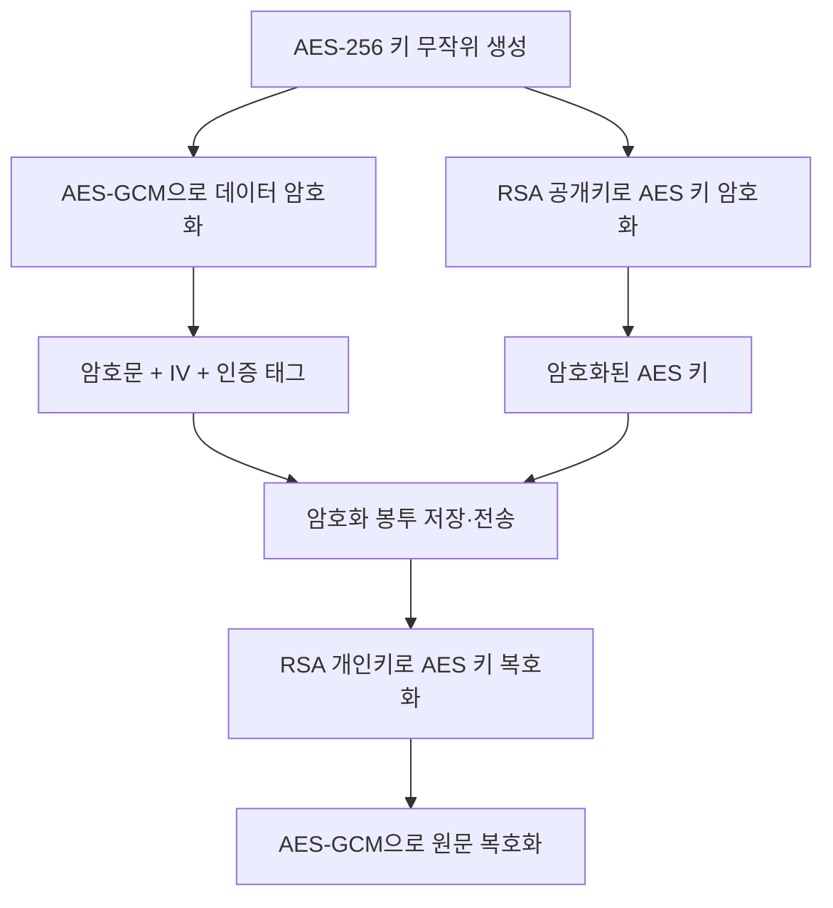

### 1. 핵심 결론

AES-256과 RSA/ECC를 항상 조합해야 하는 것은 아닙니다. 다만 서로 다른 시스템이 데이터를 교환하거나 DB에 저장된 암호문별 키를 안전하게 관리해야 한다면 다음과 같은 하이브리드 암호화가 실무 표준에 가깝습니다.

| 구분                   | 역할                            |
| -------------------- | ----------------------------- |
| AES-256-GCM          | 실제 개인정보·주문정보·파일 등 대용량 데이터 암호화 |
| RSA-OAEP 또는 ECDH/ECC | AES 키를 안전하게 전달하거나 보호          |
| 공개키                  | AES 키 암호화에 사용, 상대 시스템에 배포 가능  |
| 개인키                  | AES 키 복호화에 사용, 복호화 시스템만 보관    |





이 방식을 `Envelope Encryption`, `Hybrid Encryption`, 즉 봉투 암호화라고 합니다.

### 2. AES만 사용했을 때의 문제

AES는 암호화와 복호화에 동일한 키를 사용하는 대칭키 방식입니다.

```text
암호화 시스템 ── 동일한 AES 키 ── 복호화 시스템
```

AES 자체의 보안 문제가 아니라 다음과 같은 키 전달·보관 문제가 발생합니다.

| 문제      | 설명                                     |
| ------- | -------------------------------------- |
| 키 전달    | AES 키를 상대 시스템에 어떻게 안전하게 전달할 것인지 필요     |
| 키 유출 범위 | 여러 데이터가 동일 키를 사용하면 키 하나 유출 시 전체 데이터 노출 |
| 서버 간 공유 | 송신·수신 시스템 모두 동일한 비밀키를 가져야 함            |
| 키 교체    | AES 키 변경 시 기존 암호문의 복호화 키를 구분해야 함       |
| 운영자 접근  | 설정 파일에 AES 키를 평문으로 두면 서버 접근자가 확인 가능    |

### 3. RSA/ECC와 조합하는 이유

#### 3-1. AES 키를 안전하게 전달

송신자는 수신자의 공개키만 가지고 AES 키를 암호화할 수 있습니다.

```text
송신자:
1. 임시 AES 키 생성
2. AES 키로 데이터 암호화
3. 수신자의 RSA 공개키로 AES 키 암호화

수신자:
1. RSA 개인키로 AES 키 복호화
2. AES 키로 데이터 복호화
```

RSA 개인키는 송신자에게 전달할 필요가 없습니다.

#### 3-2. 대용량 데이터 처리 성능 확보

RSA는 처리 속도가 느리고 암호화할 수 있는 데이터 크기도 제한됩니다. RSA-OAEP는 주문 JSON이나 파일 전체를 암호화하는 용도가 아니라 짧은 AES 키를 보호하는 용도입니다.

| 방식       | 적합한 대상               |
| -------- | -------------------- |
| AES-GCM  | JSON, 개인정보, 주문정보, 파일 |
| RSA-OAEP | AES 키와 같은 작은 키 데이터   |
| ECC/ECDH | 공유 비밀 생성 후 AES 키 파생  |

#### 3-3. 데이터마다 다른 AES 키 사용

주문이나 파일마다 새로운 AES 키를 만들면 한 AES 키가 노출돼도 해당 데이터만 영향을 받습니다.

#### 3-4. 마스터키 교체 용이

데이터 본문은 다시 암호화하지 않고, AES 키를 감싼 RSA/ECC 계층만 교체할 수 있습니다. 이를 위해 암호문에 `keyId`를 함께 저장합니다.

### 4. 반드시 비대칭키가 필요한 것은 아닌 경우

| 상황                       | 권장 방식                                           |
| ------------------------ | ----------------------------------------------- |
| 단일 서버 내부에서만 사용           | KMS/HSM에 보관된 AES 키로 직접 암호화 가능                   |
| DB 컬럼 암호화                | KMS 기반 Envelope Encryption 권장, RSA 직접 운용은 선택 사항 |
| 서버 간 통신 보호만 필요           | TLS가 우선이며 추가 애플리케이션 암호화는 요구사항에 따라 결정            |
| 사용자 비밀번호                 | AES/RSA로 암호화하지 않고 Argon2 또는 bcrypt 해시 사용        |
| 이미 안전한 KMS가 데이터 키를 발급·보호 | 애플리케이션에서 RSA/ECC 직접 구현 불필요                      |

따라서 “AES-256을 쓰려면 RSA가 반드시 필요하다”는 설명은 정확하지 않습니다. 핵심은 AES 키를 누가, 어디에, 어떤 방법으로 보관하고 전달하느냐입니다.

### 5. Spring 5.3 권장 구성

JDK 11과 Spring Framework 5.3 환경에서는 외부 라이브러리 없이 다음 조합을 사용할 수 있습니다.

| 항목        | 설정                           |
| --------- | ---------------------------- |
| 데이터 암호화   | `AES/GCM/NoPadding`          |
| AES 키 크기  | 256비트                        |
| GCM IV    | 매 암호화마다 새로 생성한 12바이트         |
| GCM 인증 태그 | 128비트                        |
| 키 암호화     | `RSA/ECB/OAEPPadding`        |
| OAEP 해시   | SHA-256                      |
| RSA 키 크기  | 최소 2048비트, 신규 구축 시 3072비트 권장 |
| 키 저장      | PKCS12, HSM 또는 외부 KMS        |
| 문자열 인코딩   | Base64                       |

GCM은 암호화와 위변조 검증을 함께 제공하는 AEAD 방식입니다. Java 11은 `GCMParameterSpec`, `OAEPParameterSpec`을 표준 API로 제공합니다. [NIST SP 800-38D](https://csrc.nist.gov/pubs/sp/800/38/d/final), [Java 11 암호 파라미터 API](https://docs.oracle.com/en/java/javase/11/docs/api/java.base/javax/crypto/spec/package-summary.html)

### 6. 암호화 결과 DTO

GCM의 인증 태그는 Java `Cipher.doFinal()` 결과인 `cipherText` 뒤에 포함됩니다.

```java
package com.example.crypto;

public class EncryptedEnvelope {
    private final String version;
    private final String algorithm;
    private final String keyId;
    private final String encryptedKey;
    private final String iv;
    private final String cipherText;

    public EncryptedEnvelope(
            String version,
            String algorithm,
            String keyId,
            String encryptedKey,
            String iv,
            String cipherText) {
        this.version = version;
        this.algorithm = algorithm;
        this.keyId = keyId;
        this.encryptedKey = encryptedKey;
        this.iv = iv;
        this.cipherText = cipherText;
    }

    public String getVersion() {
        return version;
    }

    public String getAlgorithm() {
        return algorithm;
    }

    public String getKeyId() {
        return keyId;
    }

    public String getEncryptedKey() {
        return encryptedKey;
    }

    public String getIv() {
        return iv;
    }

    public String getCipherText() {
        return cipherText;
    }
}
```

### 7. AES-256-GCM + RSA-OAEP 서비스

```java
package com.example.crypto;

import org.springframework.stereotype.Service;

import javax.crypto.Cipher;
import javax.crypto.KeyGenerator;
import javax.crypto.SecretKey;
import javax.crypto.spec.GCMParameterSpec;
import javax.crypto.spec.OAEPParameterSpec;
import javax.crypto.spec.PSource;
import java.nio.charset.StandardCharsets;
import java.security.KeyPair;
import java.security.SecureRandom;
import java.security.spec.MGF1ParameterSpec;
import java.util.Base64;

@Service
public class HybridCryptoService {
    private static final String AES_TRANSFORMATION = "AES/GCM/NoPadding";
    private static final String RSA_TRANSFORMATION = "RSA/ECB/OAEPPadding";

    private static final int AES_KEY_SIZE = 256;
    private static final int GCM_IV_SIZE = 12;
    private static final int GCM_TAG_SIZE = 128;

    private static final OAEPParameterSpec OAEP_SHA256 =
            new OAEPParameterSpec(
                    "SHA-256",
                    "MGF1",
                    MGF1ParameterSpec.SHA256,
                    PSource.PSpecified.DEFAULT
            );

    private final KeyPair rsaKeyPair;
    private final SecureRandom secureRandom = new SecureRandom();

    public HybridCryptoService(KeyPair rsaKeyPair) {
        this.rsaKeyPair = rsaKeyPair;
    }

    public EncryptedEnvelope encrypt(
            String plainText,
            String keyId,
            String aad) throws Exception {

        // 1. 데이터마다 새로운 AES-256 키 생성
        KeyGenerator keyGenerator = KeyGenerator.getInstance("AES");
        keyGenerator.init(AES_KEY_SIZE, secureRandom);
        SecretKey aesKey = keyGenerator.generateKey();

        // 2. 데이터마다 새로운 12바이트 GCM IV 생성
        byte[] iv = new byte[GCM_IV_SIZE];
        secureRandom.nextBytes(iv);

        // 3. AES-256-GCM 데이터 암호화
        Cipher aesCipher = Cipher.getInstance(AES_TRANSFORMATION);
        aesCipher.init(
                Cipher.ENCRYPT_MODE,
                aesKey,
                new GCMParameterSpec(GCM_TAG_SIZE, iv)
        );

        if (aad != null) {
            aesCipher.updateAAD(aad.getBytes(StandardCharsets.UTF_8));
        }

        byte[] cipherText = aesCipher.doFinal(
                plainText.getBytes(StandardCharsets.UTF_8)
        );

        // 4. RSA 공개키로 AES 키 암호화
        Cipher rsaCipher = Cipher.getInstance(RSA_TRANSFORMATION);
        rsaCipher.init(
                Cipher.ENCRYPT_MODE,
                rsaKeyPair.getPublic(),
                OAEP_SHA256
        );

        byte[] encryptedAesKey =
                rsaCipher.doFinal(aesKey.getEncoded());

        Base64.Encoder encoder = Base64.getEncoder();

        return new EncryptedEnvelope(
                "1",
                "AES-256-GCM+RSA-OAEP-SHA256",
                keyId,
                encoder.encodeToString(encryptedAesKey),
                encoder.encodeToString(iv),
                encoder.encodeToString(cipherText)
        );
    }

    public String decrypt(
            EncryptedEnvelope envelope,
            String aad) throws Exception {

        Base64.Decoder decoder = Base64.getDecoder();

        byte[] encryptedAesKey =
                decoder.decode(envelope.getEncryptedKey());
        byte[] iv = decoder.decode(envelope.getIv());
        byte[] cipherText =
                decoder.decode(envelope.getCipherText());

        if (iv.length != GCM_IV_SIZE) {
            throw new IllegalArgumentException(
                    "GCM IV는 12바이트여야 합니다."
            );
        }

        // 1. RSA 개인키로 AES 키 복호화
        Cipher rsaCipher = Cipher.getInstance(RSA_TRANSFORMATION);
        rsaCipher.init(
                Cipher.DECRYPT_MODE,
                rsaKeyPair.getPrivate(),
                OAEP_SHA256
        );

        byte[] aesKeyBytes =
                rsaCipher.doFinal(encryptedAesKey);

        SecretKey aesKey =
                new javax.crypto.spec.SecretKeySpec(
                        aesKeyBytes,
                        "AES"
                );

        // 2. AES-256-GCM 데이터 복호화 및 위변조 검증
        Cipher aesCipher = Cipher.getInstance(AES_TRANSFORMATION);
        aesCipher.init(
                Cipher.DECRYPT_MODE,
                aesKey,
                new GCMParameterSpec(GCM_TAG_SIZE, iv)
        );

        if (aad != null) {
            aesCipher.updateAAD(aad.getBytes(StandardCharsets.UTF_8));
        }

        byte[] plainText = aesCipher.doFinal(cipherText);
        return new String(plainText, StandardCharsets.UTF_8);
    }
}
```

`Cipher`는 스레드 안전 객체로 취급하면 안 되므로 Spring 싱글톤 필드에 저장하지 않고 요청마다 생성한 것이 중요합니다.

### 8. PKCS12 RSA 키 로딩 설정

#### 8-1. `crypto.properties`

```properties
crypto.keystore.location=file:/opt/commerce/secret/commerce-crypto.p12
crypto.keystore.password=${CRYPTO_KEYSTORE_PASSWORD}
crypto.keystore.alias=commerce-rsa-2026
```

비밀번호와 개인키 파일을 Git, WAR, JAR, `application.properties`에 직접 포함하면 안 됩니다.

#### 8-2. Spring Java Config

```java
package com.example.crypto;

import org.springframework.beans.factory.annotation.Value;
import org.springframework.context.annotation.Bean;
import org.springframework.context.annotation.Configuration;
import org.springframework.context.annotation.PropertySource;
import org.springframework.context.support.PropertySourcesPlaceholderConfigurer;
import org.springframework.core.io.Resource;

import java.io.InputStream;
import java.security.Key;
import java.security.KeyPair;
import java.security.KeyStore;
import java.security.PrivateKey;
import java.security.PublicKey;

@Configuration
@PropertySource("classpath:crypto.properties")
public class CryptoConfig {
    @Bean
    public static PropertySourcesPlaceholderConfigurer propertyConfigurer() {
        return new PropertySourcesPlaceholderConfigurer();
    }

    @Bean
    public KeyPair rsaKeyPair(
            @Value("${crypto.keystore.location}") Resource keyStoreResource,
            @Value("${crypto.keystore.password}") String password,
            @Value("${crypto.keystore.alias}") String alias) throws Exception {

        char[] passwordChars = password.toCharArray();

        try (InputStream inputStream =
                     keyStoreResource.getInputStream()) {

            KeyStore keyStore = KeyStore.getInstance("PKCS12");
            keyStore.load(inputStream, passwordChars);

            Key key = keyStore.getKey(alias, passwordChars);

            if (!(key instanceof PrivateKey)) {
                throw new IllegalStateException(
                        "RSA 개인키를 찾을 수 없습니다: " + alias
                );
            }

            PublicKey publicKey =
                    keyStore.getCertificate(alias).getPublicKey();

            return new KeyPair(publicKey, (PrivateKey) key);
        } finally {
            java.util.Arrays.fill(passwordChars, '\0');
        }
    }
}
```

### 9. 사용 예

AAD는 암호화하지 않지만 암호문과 논리적으로 결합할 주문번호, 회원번호, 테넌트 ID 등에 사용할 수 있습니다.

```java
String aad = "tenant=BUY_KOREA|orderSn=202608030001";

EncryptedEnvelope encrypted = hybridCryptoService.encrypt(
        "{\"buyerName\":\"홍길동\",\"phone\":\"010-1234-5678\"}",
        "commerce-rsa-2026",
        aad
);

String plainText = hybridCryptoService.decrypt(
        encrypted,
        aad
);
```

복호화할 때 AAD가 암호화 당시와 다르거나 암호문·IV·인증 태그가 변조되면 `AEADBadTagException`이 발생합니다.

### 10. RSA 키 생성 예

```bash
keytool -genkeypair \
  -alias commerce-rsa-2026 \
  -keyalg RSA \
  -keysize 3072 \
  -sigalg SHA256withRSA \
  -validity 3650 \
  -storetype PKCS12 \
  -keystore commerce-crypto.p12
```

운영 환경에서는 자체 생성 PKCS12보다 AWS KMS, Azure Key Vault, GCP Cloud KMS 또는 HSM처럼 개인키를 외부로 노출하지 않는 구조가 더 안전합니다.

### 11. RSA 대신 ECC를 사용할 경우

ECC는 보통 RSA처럼 공개키로 AES 키를 직접 암호화하지 않습니다.

```text
송신자의 임시 EC 개인키
        +
수신자의 EC 공개키
        ↓
ECDH 공유 비밀 생성
        ↓
HKDF로 AES 키 파생
        ↓
AES-GCM 데이터 암호화
```

| 구분         | RSA 방식                | ECC 방식               |
| ---------- | --------------------- | -------------------- |
| 핵심 기능      | RSA-OAEP로 AES 키 암호화   | ECDH로 공유 비밀 생성       |
| 키 크기       | 3072비트 등 비교적 큼        | P-256 등 비교적 작음       |
| 구현 난이도     | JDK 11 표준 API로 비교적 단순 | 임시 키·KDF·공개키 검증까지 필요 |
| 전방향 안전성    | 단순 RSA 키 전송에는 없음      | 임시 ECDH 구성 시 가능      |
| JDK 11 실무성 | 높음                    | 프로토콜을 직접 설계하면 위험     |

JDK 11 표준 JCA에는 ECDH가 있지만 완성된 범용 `ECIES`나 `HPKE` API가 제공되는 것은 아닙니다. ECC가 필수라면 ECDH·HKDF 조합을 직접 설계하기보다는 검증된 암호 라이브러리나 KMS를 사용하는 편이 안전합니다.

### 12. 운영 시 필수 점검

| 점검 항목   | 권장사항                                 |
| ------- | ------------------------------------ |
| AES 모드  | ECB/CBC 대신 AES-GCM 사용                |
| GCM IV  | 동일 AES 키에서 절대 재사용 금지                 |
| AES 키   | 데이터 또는 작업 단위로 새로 생성                  |
| RSA 패딩  | PKCS#1 v1.5 대신 OAEP 사용               |
| OAEP 설정 | SHA-256과 MGF1 SHA-256을 명시            |
| 개인키     | 애플리케이션 소스·DB·설정 파일에 평문 보관 금지         |
| 키 식별    | 암호문에 `keyId`, 알고리즘 버전 저장             |
| 오류 처리   | 복호화 오류 원인을 외부 응답으로 상세 노출하지 않음        |
| 로그      | 평문, AES 키, 개인키, 전체 암호문 기록 금지         |
| 전송 보호   | 애플리케이션 암호화와 별도로 TLS 적용               |
| 키 교체    | 신규 암호화는 새 키, 기존 키는 복호화 전용으로 일정 기간 유지 |

주의할 점은 AES-256을 사용해도 RSA-3072나 P-256을 결합한 전체 시스템의 보안 강도는 가장 약한 구성요소 수준으로 결정된다는 것입니다. 또한 RSA 공개키 암호화는 기밀성을 제공하지만 송신자 신원까지 증명하지는 않으므로, 송신자 인증이 필요하면 TLS 상호 인증이나 전자서명을 별도로 적용해야 합니다. RSA 키 전송에 관한 기준은 [NIST SP 800-56B Rev.2](https://csrc.nist.gov/pubs/sp/800/56/b/r2/final)에서 확인할 수 있습니다.
<details>
  <summary>참고</summary>  
  <pre>
  </pre>
</details>
