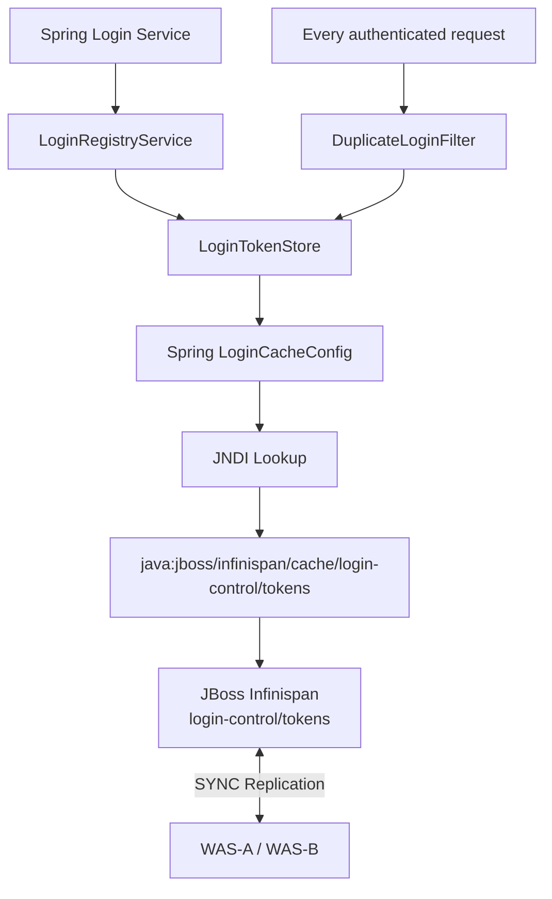

## 1. 핵심 결론

`java:jboss/infinispan/cache/login-control/tokens`는 **JBoss EAP 내부 Infinispan 캐시를 애플리케이션에서 JNDI로 참조하기 위한 이름**입니다.

```text
java:jboss/infinispan/cache/login-control/tokens
│                         │             │
│                         │             └─ Cache 이름
│                         └─ Cache Container 이름
└─ JBoss가 제공하는 Infinispan JNDI Namespace
```

즉 `LoginCacheConfig`에서 이 주소를 lookup하면 애플리케이션이 별도로 `new Cache()`를 생성하는 것이 아니라, **`standalone-ha.xml`에 JBoss가 생성·관리하고 있는 `login-control/tokens` 캐시 객체를 전달받아 사용하는 구조**입니다. JBoss EAP 7.4 공식 문서도 정확히 `java:jboss/infinispan/cache/foo/bar` 형식을 제공하며 `foo`는 cache-container, `bar`는 cache 이름이라고 정의합니다. 캐시 생명주기도 EAP가 관리합니다. ([레드햇 문서][1])
다만 **적용 전에 JBoss EAP 정확한 버전을 반드시 확인해야 합니다.**

| JBoss EAP                                                                                                                                                                                                           | 애플리케이션의 Infinispan 직접 사용         |
| ------------------------------------------------------------------------------------------------------------------------------------------------------------------------------------------------------------------- | -------------------------------- |
| 7.4                                                                                                                                                                                                                 | 공식 지원                            |
| 7.3                                                                                                                                                                                                                 | 공식 문서상 직접 사용 미지원(private module) |
| 7.2 이하                                                                                                                                                                                                              | 버전별 확인 필수                        |
| EAP 7.4는 Infinispan을 public module로 제공하고 애플리케이션에서 새로운 cache-container/cache 및 Infinispan API 사용을 공식 지원합니다. 반면 EAP 7.3 공식 문서는 Infinispan을 private module로 규정하고 애플리케이션 직접 사용을 지원하지 않는다고 명시합니다. ([docs.redhat.com][1]) |                                  |
| 따라서 **현재 서버가 EAP 7.4인지부터 확인하는 것이 1순위입니다.**                                                                                                                                                                          |                                  |

```bash
$JBOSS_HOME/bin/jboss-cli.sh --connect
```

```text
:read-attribute(name=product-name)
:read-attribute(name=product-version)
```

---

## 2. JNDI Lookup이 실제로 무엇을 하는가

먼저 JBoss에 다음 캐시가 있다고 가정합니다.

```xml
<cache-container name="login-control"
                 default-cache="tokens">
    <transport lock-timeout="60000"/>
    <replicated-cache name="tokens"
                      mode="SYNC"/>
</cache-container>
```

그러면 논리적인 구조가:

```text
JBoss Infinispan subsystem
│
├─ cache-container=web
│   └─ dist
│       └─ HttpSession
│
└─ cache-container=login-control
    └─ replicated-cache=tokens
        ├─ user01 → e840...TOKEN-A
        ├─ user02 → 7ce2...TOKEN-B
        └─ user03 → 12af...TOKEN-C
```

가 됩니다.
애플리케이션:

```java
Context context = new InitialContext();
Cache<String, String> cache =
        (Cache<String, String>) context.lookup(
            "java:jboss/infinispan/cache/login-control/tokens");
```

에서 lookup을 하면:

```text
Spring Application
        │
        │ JNDI lookup
        ▼
java:jboss/infinispan/cache/login-control/tokens
        │
        ▼
JBoss Naming
        │
        ▼
Infinispan subsystem
        │
        ▼
login-control
        │
        ▼
tokens
        │
        ▼
org.infinispan.Cache
```

## 3. 를 가져옵니다. JBoss EAP가 캐시의 lifecycle을 관리하기 때문에 애플리케이션이 캐시 매니저를 직접 start/stop할 필요가 없습니다. ([레드햇 문서][1])

## 4. 여기서 `login-control`과 `tokens`는 자동으로 만들어지는 것이 아님

다음 코드만 작성한다고:

```java
lookup(
    "java:jboss/infinispan/cache/login-control/tokens"
);
```

캐시가 생성되는 것은 아닙니다.
**먼저 JBoss 설정에**

```text
cache-container = login-control
cache           = tokens
```

가 존재해야 합니다.
즉 순서가:

```text
① JBoss 설정
   login-control/tokens 생성
          ↓
② JBoss reload
          ↓
③ JNDI resource 생성
          ↓
④ Spring Application 배포
          ↓
⑤ LoginCacheConfig JNDI lookup
```

- 입니다. 
- Red Hat 문서도 cache-container/cache는 Management Console 또는 CLI를 통해 생성할 수 있다고 설명합니다.
-----------------------------------------------------------------------------------------------

## 5. 서버 설정은 XML 직접 편집보다 CLI 권장

현재 A/B가 각각 standalone 서버라면 **두 서버에 동일하게** 적용해야 합니다.
JBoss EAP 공식 관리 방식도 XML 직접 수정보다 Management CLI/Console을 권장합니다. ([레드햇 문서][2])
WAS-A:

```bash
$JBOSS_HOME/bin/jboss-cli.sh --connect
```

다음과 같이 구성하는 것이 좋습니다.

```text
batch
/subsystem=infinispan/cache-container=login-control:add()
/subsystem=infinispan/cache-container=login-control/transport=jgroups:add(lock-timeout=60000)
/subsystem=infinispan/cache-container=login-control/replicated-cache=tokens:add(mode=SYNC)
/subsystem=infinispan/cache-container=login-control:write-attribute(name=default-cache,value=tokens)
run-batch
```

WAS-B에도 동일하게 구성합니다.
Red Hat EAP 문서는 cache-container 생성, replicated-cache 생성, default-cache 지정 명령을 공식적으로 제공합니다. 또한 EAP 7.1 이후 transport 관련 변경은 batch 방식으로 수행하는 것이 요구/권장되는 구성입니다. ([레드햇 문서][1])
적용 후:

```text
reload
```

이 필요할 수 있습니다.

### 5-1. 결과 XML

대략:

```xml
<cache-container name="login-control"
                 default-cache="tokens">
    <transport lock-timeout="60000"/>
    <replicated-cache name="tokens"
                      mode="SYNC"/>
</cache-container>
```

형태가 됩니다.

## 6. 왜 `replicated-cache`인가

현재 WAS가 2대이고 저장하는 데이터가:

```text
userId → UUID Token
```

뿐이므로 크기가 매우 작습니다.
Replicated Cache라면:

```text
                 JGroups
                   │
        ┌──────────┴──────────┐
        ▼                     ▼
      WAS-A                 WAS-B
login-control           login-control
   tokens                  tokens
user01=AAA              user01=AAA
user02=BBB              user02=BBB
```

- 모든 노드가 동일 데이터를 가집니다. 
- Red Hat 문서에서도 replication mode는 변경 내용을 cluster의 모든 노드로 복제하며, 데이터량 때문에 특히 작은 클러스터에 적합하다고 설명합니다. 현재 A/B 2노드 환경과 잘 맞습니다. ([레드햇 문서][3])
-----------------------------------------------------------------------------------------------------------------------------------

## 7. `SYNC`가 중요한 이유

```xml
<replicated-cache name="tokens"
                  mode="SYNC"/>
```

로그인 B에서:

```java
cache.put("user01", "TOKEN-B");
```

하면 개념적으로:

```text
WAS-B
  │
  │ PUT user01=TOKEN-B
  ▼
Infinispan
  │
  ├──────────▶ WAS-A 반영
  │
  └──────────▶ WAS-B 반영
               ↓
          완료 후 return
```

- 이 됩니다.
- 로그인 중복 제어 데이터는 일반적인 상품 캐시와 달리 **stale 상태를 최대한 허용하지 않는 것이 중요**하기 때문에 동기 복제가 적절합니다. 공식 문서도 SYNC는 복제가 완료될 때까지 호출이 완료되지 않으며 모든 노드에 변경이 적용됐음을 확인할 수 있다는 장점이 있다고 설명합니다. ([레드햇 문서][3])
-------------------------------------------------------------------------------------------------------------------------------------------------------------------------------

## 8. Spring `LoginCacheConfig`

Spring 5.3에서는 JNDI lookup 결과를 Spring Bean으로 감싸는 것이 좋습니다.
제가 권장하는 형태는 단순합니다.

```java
import javax.naming.InitialContext;
import javax.naming.NamingException;
import org.infinispan.Cache;
import org.springframework.context.annotation.Bean;
import org.springframework.context.annotation.Configuration;
@Configuration
public class LoginCacheConfig {
    private static final String LOGIN_CACHE_JNDI_NAME =
            "java:jboss/infinispan/cache/login-control/tokens";
    @Bean(name = "loginTokenCache")
    @SuppressWarnings("unchecked")
    public Cache<String, String> loginTokenCache()
            throws NamingException {
        InitialContext context = new InitialContext();
        return (Cache<String, String>)
                context.lookup(LOGIN_CACHE_JNDI_NAME);
    }
}
```

### 8-1. 이 Bean 생성 시점

Spring ApplicationContext 시작:

```text
LoginCacheConfig 로딩
       ↓
loginTokenCache() 실행
       ↓
InitialContext
       ↓
JBoss JNDI Lookup
       ↓
Infinispan Cache 반환
       ↓
Spring Bean 등록
name = loginTokenCache
```

장점은 **Fail Fast**입니다.
JBoss 설정이 잘못되어:

```text
login-control 없음
tokens 없음
JNDI binding 없음
```

- 이면 애플리케이션 시작 시 바로 오류가 나므로 운영 중 요청 시점에 뒤늦게 발견하지 않습니다.

## 9. Spring 코드에서는 JNDI를 다시 알 필요가 없음

다른 Service에서는:

```java
@Service
public class LoginRegistryService {
    private final Cache<String, String> loginTokenCache;
    public LoginRegistryService(
            @Qualifier("loginTokenCache")
            Cache<String, String> loginTokenCache) {
        this.loginTokenCache = loginTokenCache;
    }
}
```

로 사용합니다.
그러면:

```text
LoginRegistryService
       ↓
loginTokenCache Bean
       ↓
LoginCacheConfig
       ↓
JNDI
       ↓
JBoss Infinispan
```

의존관계가 됩니다.
Application Service가:

```text
java:jboss/infinispan/cache/...
```

라는 문자열을 직접 알지 않아도 되는 것이 좋습니다.

## 10. 실무에서는 한 단계 더 추상화 권장

Application 전체가 `org.infinispan.Cache`에 직접 의존하지 않게 만드는 것을 권장합니다.

### 10-1. Interface

```java
public interface LoginTokenStore {
    String get(String userId);
    void put(String userId, String token);
    boolean remove(String userId, String token);
}
```

### 10-2. Infinispan 구현

```java
import org.infinispan.Cache;
import org.springframework.beans.factory.annotation.Qualifier;
import org.springframework.stereotype.Repository;
@Repository
public class InfinispanLoginTokenStore
        implements LoginTokenStore {
    private final Cache<String, String> cache;
    public InfinispanLoginTokenStore(
            @Qualifier("loginTokenCache")
            Cache<String, String> cache) {
        this.cache = cache;
    }
    @Override
    public String get(String userId) {
        return cache.get(userId);
    }
    @Override
    public void put(String userId, String token) {
        cache.put(userId, token);
    }
    @Override
    public boolean remove(
            String userId,
            String token) {
        return cache.remove(userId, token);
    }
}
```

구조:

```text
DuplicateLoginFilter
        ↓
LoginRegistryService
        ↓
LoginTokenStore
        ↓
InfinispanLoginTokenStore
        ↓
org.infinispan.Cache
```

그러면 나중에:

```text
Infinispan
   ↓
Redis
```

또는:

```text
Infinispan
   ↓
DB
```

로 바뀌더라도 상위 로그인 로직은 거의 바뀌지 않습니다.

## 11. 실제 LoginRegistryService

```java
import java.util.UUID;
import org.springframework.stereotype.Service;
@Service
public class LoginRegistryService {
    private final LoginTokenStore loginTokenStore;
    public LoginRegistryService(
            LoginTokenStore loginTokenStore) {
        this.loginTokenStore = loginTokenStore;
    }
    /**
     * 신규 로그인을 현재 유효 로그인으로 등록한다.
     */
    public String register(String userId) {
        String token =
                UUID.randomUUID().toString();
        loginTokenStore.put(userId, token);
        return token;
    }
    /**
     * 현재 HttpSession의 Login Token이
     * 최신 Login Token인지 확인한다.
     */
    public boolean isValid(
            String userId,
            String sessionToken) {
        if (userId == null ||
                sessionToken == null) {
            return false;
        }
        String currentToken =
                loginTokenStore.get(userId);
        return sessionToken.equals(currentToken);
    }
    /**
     * 현재 자신이 최신 로그인일 때만 제거한다.
     */
    public void logout(
            String userId,
            String sessionToken) {
        if (userId == null ||
                sessionToken == null) {
            return;
        }
        loginTokenStore.remove(
                userId,
                sessionToken);
    }
}
```

### 11-1. 로그인

```java
String token =
        loginRegistryService.register(
                sessionVo.getUserId());
HttpSession session =
        request.getSession();
session.setAttribute(
        "sessionVo",
        sessionVo);
session.setAttribute(
        "LOGIN_TOKEN",
        token);
```

---

## 12. 실제 동작 예

처음 PC-A:

```text
WAS-A
user01 로그인
```

실행:

```java
loginTokenCache.put(
    "user01",
    "TOKEN-A");
```

결과:

```text
WAS-A Cache             WAS-B Cache
user01=TOKEN-A    →     user01=TOKEN-A
```

HttpSession:

```text
SESSION-A
├─ sessionVo.userId=user01
└─ LOGIN_TOKEN=TOKEN-A
```

PC-B가 WAS-B에서 다시 로그인:

```java
loginTokenCache.put(
    "user01",
    "TOKEN-B");
```

결과:

```text
WAS-A Cache             WAS-B Cache
user01=TOKEN-B    ←→    user01=TOKEN-B
```

PC-A 다음 요청:

```java
sessionToken = "TOKEN-A";
currentToken =
    cache.get("user01");    // TOKEN-B
```

따라서:

```text
TOKEN-A != TOKEN-B
```

→ 기존 세션 invalidate.

## 13. `get()` 성능이 중요한 이유

Replicated Cache에서는 정상 cluster 상태라면 각 노드가 entry 사본을 가지고 있기 때문에:

```java
cache.get(userId);
```

는 주로 해당 노드의 cache entry를 읽는 매우 가벼운 연산이 됩니다. Replication mode는 변경 내용을 각 cluster node에 복제하는 구조이므로, 2노드처럼 작은 cluster에서는 read-heavy 로그인 검증 데이터에 적합합니다. ([레드햇 문서][3])
즉 기존 DB 방식:

```text
Request
 ↓
DBCP
 ↓
MariaDB
 ↓
SELECT
```

에서:

```text
Request
 ↓
Infinispan Cache.get()
```

으로 변경되는 것이 핵심입니다.

## 14. JNDI 이름을 확인하는 방법

JBoss에서 JNDI tree를 볼 수 있습니다.
CLI:

```bash
$JBOSS_HOME/bin/jboss-cli.sh --connect
```

```text
/subsystem=naming:jndi-view
```

JBoss의 Naming subsystem은 JNDI 구현을 제공하며 `/subsystem=naming`의 `jndi-view` 관리 operation도 존재합니다. ([레드햇 문서][4])
결과에서:

```text
java:jboss
 └─ infinispan
     └─ cache
         └─ login-control
             └─ tokens
```

- 관련 binding을 확인합니다.
- 다만 cache가 lazy service로 아직 시작되지 않은 상황에서는 runtime 표시 방법이 버전/시점에 따라 달라질 수 있으므로 **최종 검증은 실제 application lookup + put/get 테스트까지 하는 것이 가장 확실합니다.**
---------------------------------------------------------------------------------------------------------------------------------------------

## 15. Cache 설정 자체 확인

WAS-A와 WAS-B 각각:

```text
/subsystem=infinispan/cache-container=login-control:read-resource(recursive=true)
```

정상:

```text
{
    "default-cache" => "tokens",
    ...
    "replicated-cache" => {
        "tokens" => {
            "mode" => "SYNC",
            ...
        }
    }
}
```

캐시만:

```text
/subsystem=infinispan/cache-container=login-control/replicated-cache=tokens:read-resource(include-runtime=true,recursive=true)
```

그리고 cluster transport도:

```text
/subsystem=infinispan/cache-container=login-control/transport=jgroups:read-resource(include-runtime=true)
```

등으로 확인할 수 있습니다. JBoss는 Infinispan subsystem의 named cache/container 설정 및 runtime metrics 조회를 공식 지원합니다. ([레드햇 문서][1])

## 16. 가장 확실한 동작 테스트용 Controller

운영 반영 전에 DEV/QA에서 임시 진단 Controller를 만드는 것이 좋습니다.

```java
@RestController
@RequestMapping("/internal/cache-test")
public class LoginCacheTestController {
    private final Cache<String, String>
            loginTokenCache;
    public LoginCacheTestController(
            @Qualifier("loginTokenCache")
            Cache<String, String> loginTokenCache) {
        this.loginTokenCache =
                loginTokenCache;
    }
    @GetMapping("/put")
    public Map<String, String> put(
            @RequestParam String userId,
            @RequestParam String token) {
        loginTokenCache.put(
                userId,
                token);
        Map<String, String> result =
                new HashMap<>();
        result.put(
                "node",
                System.getProperty(
                    "jboss.node.name"));
        result.put(
                "token",
                loginTokenCache.get(userId));
        return result;
    }
    @GetMapping("/get")
    public Map<String, String> get(
            @RequestParam String userId) {
        Map<String, String> result =
                new HashMap<>();
        result.put(
                "node",
                System.getProperty(
                    "jboss.node.name"));
        result.put(
                "token",
                loginTokenCache.get(userId));
        return result;
    }
}
```

 **이 Controller는 반드시 테스트 환경에서만 사용하고 운영 배포 전에 제거하거나 관리자 내부망으로 제한해야 합니다.**

## 17. WAS A/B 복제 테스트

가능하면 Nginx를 우회하여 WAS를 직접 호출합니다.

### 17-1. ① WAS-A에 PUT

```bash
curl \
"http://192.168.120.70:8080/app/internal/cache-test/put?userId=test01&token=AAA"
```

결과:

```json
{
  "node": "WAS-A",
  "token": "AAA"
}
```

### 17-2. ② WAS-B에서 GET

```bash
curl \
"http://192.168.120.71:8080/app/internal/cache-test/get?userId=test01"
```

기대:

```json
{
  "node": "WAS-B",
  "token": "AAA"
}
```

이게 가장 중요한 테스트입니다.

```text
WAS-A PUT
      ↓
JGroups
      ↓
Infinispan Replication
      ↓
WAS-B GET
      ↓
AAA
```

- 이면 A→B 복제가 정상입니다.
- Replication mode에서는 변경 내용이 cluster의 다른 노드로 복제됩니다. ([레드햇 문서][3])
---------------------------------------------------------------

## 18. 역방향도 반드시 테스트

WAS-B:

```bash
curl \
"http://192.168.120.71:8080/app/internal/cache-test/put?userId=test01&token=BBB"
```

WAS-A:

```bash
curl \
"http://192.168.120.70:8080/app/internal/cache-test/get?userId=test01"
```

기대:

```json
{
  "node": "WAS-A",
  "token": "BBB"
}
```

검증:

| 테스트               | 결과  |
| ----------------- | --- |
| A PUT → A GET     | AAA |
| A PUT → B GET     | AAA |
| B PUT → B GET     | BBB |
| B PUT → A GET     | BBB |
| 4가지가 모두 성공해야 합니다. |     |

---

## 19. Cluster View도 확인

기존 JGroups가 실제 A/B 두 노드를 보고 있는지도 확인합니다.

```bash
grep -i "ISPN000094" \
    $JBOSS_HOME/standalone/log/server.log
```

Red Hat 공식 문서에서 정상적인 cluster view 로그는 다음처럼 두 멤버를 표시합니다.

```text
Received new cluster view ...
(2) [node_1, node_2]
```

- 특히 `server`, `web` 같은 Infinispan channel의 cluster view 예를 공식 문서에서도 제공합니다. 
- 신규 `login-control` cache가 시작되면 관련 cache/container transport 로그도 확인하는 것이 좋습니다.
-----------------------------------------------------------------------------

## 20. 장애 테스트도 수행

복제 성공 다음에는 장애 테스트를 합니다.

```text
① A/B 정상
② A에서 user01=TOKEN-A PUT
③ B에서 TOKEN-A 확인
④ A shutdown
⑤ B에서 TOKEN-A 조회
⑥ B에서 TOKEN-B PUT
⑦ A 재기동
⑧ A에서 TOKEN-B 확인
```

기대:

```text
A 종료
     ↓
B 정상 사용
     ↓
TOKEN 변경
     ↓
A 재합류
     ↓
State Transfer
     ↓
동일 Cache 상태
```

Infinispan은 cluster node의 state replication/distribution과 state transfer 기능을 HA configuration에서 제공합니다. ([레드햇 문서][1])

## 21. 통계 기능은 테스트 때만 켜는 것을 권장

필요하면:

```text
/subsystem=infinispan/cache-container=login-control:write-attribute(name=statistics-enabled,value=true)
```

또는 cache 수준 통계를 켤 수 있습니다.
하지만 Red Hat은 **Infinispan statistics 활성화가 성능에 부정적 영향을 줄 수 있으므로 필요한 경우에만 활성화하라고 명시**합니다. ([레드햇 문서][1])
따라서:

```text
DEV/QA
→ statistics ON 가능
운영
→ 꼭 필요한 경우만
```

으로 권장합니다.

## 22. Maven/JBoss Module 측 주의

여기가 실제 구현 시 가장 자주 문제가 생길 수 있습니다.
Java 소스에서:

```java
import org.infinispan.Cache;
```

를 하기 위해 빌드 시 Infinispan API가 필요합니다.
하지만 **JBoss가 제공하는 Infinispan과 다른 버전의 `infinispan-core.jar`를 WAR의 `WEB-INF/lib`에 임의로 포함시키는 것은 피하는 것이 좋습니다.**
현재 EAP 버전에 맞는 API로 compile하고 runtime은 JBoss 모듈을 사용하도록 구성해야 class loading 충돌 위험을 줄일 수 있습니다. JBoss deployment에서는 필요할 경우 `jboss-deployment-structure.xml`을 통해 서버 module 의존성을 명시할 수 있습니다. ([레드햇 문서][5])
예를 들면 버전 검증 후:

```xml
<jboss-deployment-structure
    xmlns="urn:jboss:deployment-structure:1.2">
    <deployment>
        <dependencies>
            <module name="org.infinispan"/>
        </dependencies>
    </deployment>
</jboss-deployment-structure>
```

- 처럼 명시적인 module dependency를 검토할 수 있습니다.
- **단, 이것은 반드시 현재 EAP 세부 버전과 모듈 구성을 확인한 후 적용해야 합니다.**
---------------------------------------------------

## 23. EAP 7.3이면 특히 주의

현재 서버가 예를 들어:

```text
JBoss EAP 7.3.x
```

라면 제가 앞서 제안한:

```java
org.infinispan.Cache
+
java:jboss/infinispan/cache/login-control/tokens
```

직접 사용 방식을 **운영 표준안으로 채택하지 않는 것을 권장합니다.**
EAP 7.3 공식 문서는 내장 Infinispan을 private module로 정의하고 애플리케이션 직접 사용을 지원하지 않는다고 명시합니다. ([레드햇 문서][6])
그 경우:

```text
EAP 7.3 이하
     ↓
내장 web/session Infinispan은
JBoss 내부에서 계속 사용
     ↓
Application Login Registry
     ↓
MariaDB Token
또는
별도 지원 Cache 제품
```

처럼 분리하는 것이 좋습니다.
반면:

```text
EAP 7.4
```

라면 application-specific cache를 추가하여 직접 사용하는 방향이 공식 지원 범위입니다. ([레드햇 문서][1])

## 24. 구현 난이도

현재 환경을 기준으로 보면:

| 구간                                                                            |   난이도 | 비고            |
| ----------------------------------------------------------------------------- | ----: | ------------- |
| JBoss 버전 확인                                                                   | ★☆☆☆☆ | CLI           |
| Cache container 추가                                                            | ★★★☆☆ | A/B 동일 설정 필요  |
| JGroups 연동                                                                    | ★★☆☆☆ | 기존 cluster 활용 |
| JNDI Lookup                                                                   | ★★☆☆☆ | 코드 간단         |
| Spring Bean 등록                                                                | ★★☆☆☆ | 간단            |
| LoginTokenStore 구현                                                            | ★★☆☆☆ | CRUD 수준       |
| 중복 로그인 Filter                                                                 | ★★★☆☆ | 예외/AJAX 처리 필요 |
| A/B 복제 검증                                                                     | ★★★☆☆ | 직접 노드 테스트 필요  |
| 장애/재합류 테스트                                                                    | ★★★★☆ | 운영 전 중요       |
| Split Brain 정책                                                                | ★★★★☆ | 보안 정책 중요      |
| **EAP 7.4이고 현재 JGroups A/B cluster가 이미 정상이라면 전체 난이도는 약 `3/5` 정도**라고 볼 수 있습니다. |       |               |
| 새로운 Redis 설치나 Spring Security 전체 도입보다는 변경 범위가 작습니다.                           |       |               |

---

## 25. 실무에서 가장 신경 써야 하는 부분

### 25-1. ① 기존 `web` Cache는 절대 사용하지 않음

```text
web/dist
```

는 현재 `HttpSession` 관리용입니다.
여기에:

```text
userId → token
```

을 직접 넣지 않습니다.
반드시:

```text
login-control/tokens
```

를 별도로 둡니다.
JBoss의 기본 `web` cache-container는 웹 세션 클러스터링 용도라고 공식 정의되어 있습니다. ([레드햇 문서][1])

### 25-2. ② Login Token에는 개인정보를 넣지 않음

권장:

```text
key   = 내부 userId/회원PK
value = random UUID
```

비권장:

```text
value =
이름 + 이메일 + 전화번호 + 권한 + SessionVO 전체
```

로그인 검증은 단순할수록 좋습니다.

### 25-3. ③ Logout은 conditional remove

절대로:

```java
cache.remove(userId);
```

만 하지 않는 것이 좋습니다.
반드시:

```java
cache.remove(userId, sessionToken);
```

- 처럼 현재 Token과 일치하는 경우만 삭제합니다.
- 그렇지 않으면 오래된 PC-A가 logout하면서 PC-B의 신규 로그인 Token을 삭제할 수 있습니다.
-----------------------------------------------------------

## 26. 전체 동작을 최종적으로 보면





### 26-1. 최종적으로 확인해야 하는 순서

```text
1. JBoss 정확한 EAP Version 확인
        ↓
2. EAP 7.4 지원 여부 확인
        ↓
3. login-control Cache Container 생성
        ↓
4. tokens Replicated Cache(SYNC) 생성
        ↓
5. A/B reload
        ↓
6. A/B Cluster 정상 확인
        ↓
7. JNDI Lookup 성공 확인
        ↓
8. A PUT → B GET
        ↓
9. B PUT → A GET
        ↓
10. A shutdown 후 B 조회
        ↓
11. A 재기동 후 State 복구
        ↓
12. LoginRegistryService 연계
        ↓
13. DuplicateLoginFilter 적용
```

현재 단계에서 **가장 먼저 해야 할 것은 `LoginCacheConfig` 구현이 아니라 정확한 JBoss EAP 버전 확인**입니다. `standalone-ha.xml`의 Infinispan namespace가 `7.0`이라는 사실만으로 EAP 7.4라고 판단할 수는 없습니다. **EAP 7.4가 확인되면 `java:jboss/infinispan/cache/login-control/tokens` 방식은 공식 지원되는 구현 경로이고, EAP 7.3이라면 이 방식 대신 MariaDB 기반 Token Registry를 선택하는 쪽이 운영 지원성 측면에서 더 안전합니다.**
<details>
  <summary>참고</summary>  
  <pre>
  </pre>
</details>
