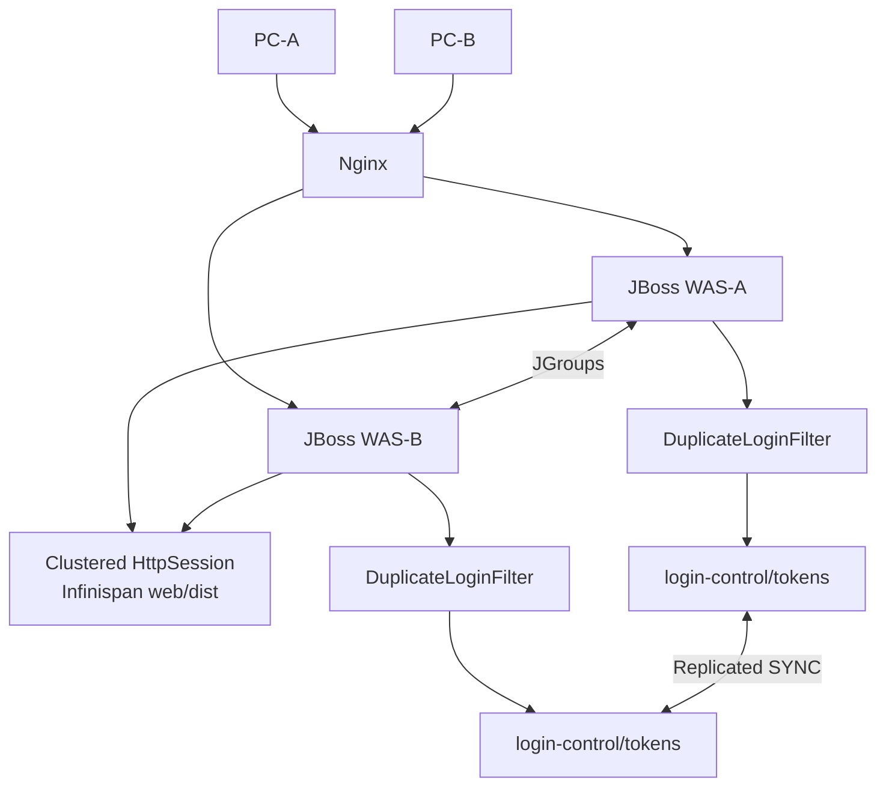
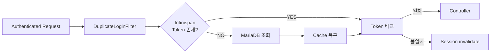

## 1. 결론

네. **매 인증 Request마다 MariaDB에서 Token을 SELECT하는 방식은 동작은 확실하지만, 현재 구조에서는 최적안은 아닙니다.**
예를 들어 로그인 사용자의 보호 URL 요청이 초당 1,000건이면 중복 로그인 검증만으로도 최대 초당 1,000회의 DB 조회가 추가됩니다. 쿼리가 PK 단건 조회라 빠르더라도 다음 비용은 계속 발생합니다.

```text
Request
  ↓
DBCP Connection borrow
  ↓
WAS → DB Network I/O
  ↓
SQL 실행/Index Lookup
  ↓
ResultSet 처리
  ↓
Connection return
  ↓
실제 업무 처리
```

특히 기존 업무 DB와 동일한 Connection Pool을 사용한다면 **중복 로그인 검증이 업무 SQL과 DB Connection을 경쟁하는 구조**가 되는 것이 더 큰 문제입니다.
현재 환경에서는 오히려 이미 존재하는:

```text
JBoss A/B
 + JGroups
 + Infinispan
 + standalone-ha.xml
 + <distributable/>
```

을 활용하여 **`userId → 현재 유효 loginToken`을 별도의 Infinispan Replicated Cache에 보관하는 방식**이 가장 효율적입니다.
Spring Framework 5.3의 Cache 기능도 사용할 수 있지만, 중요한 점은 **Spring Cache는 캐시 추상화이지 클러스터 캐시 자체가 아닙니다.** 다중 JVM의 동기화/복제는 backing cache provider가 담당해야 한다고 Spring 공식 문서도 명시합니다. ([Home][1])
따라서 현재 환경의 권장 구조는:

```text
Spring MVC / OncePerRequestFilter
        ↓
LoginRegistryService
        ↓
JBoss Infinispan Replicated Cache
        ↓
userId → loginToken
        ↓
WAS-A / WAS-B에 복제
```

입니다.
**매 Request 검증은 유지하되 DB 조회는 제거**하는 것이 핵심입니다.
--------------------------------------------

## 2. Spring Cache만 적용하면 해결되지 않는 이유

Spring 5.3에는:

```java
@EnableCaching
@Cacheable
@CachePut
@CacheEvict
```

가 있습니다. Spring 공식 문서에서도 `@Cacheable`, `@CachePut`, `@CacheEvict`를 제공하고, 실제 저장소는 별도의 cache provider가 담당한다고 설명합니다. ([Home][1])
예를 들어 다음처럼:

```java
@Cacheable(cacheNames = "loginToken", key = "#userId")
public String getLoginToken(String userId) {
    return loginSessionMapper.selectLoginToken(userId);
}
```

로 만들 수 있습니다.
그러면:

```text
첫 Request
  ↓
DB SELECT
  ↓
Spring Cache 저장
두 번째 이후
  ↓
Cache HIT
  ↓
DB 조회 없음
```

이 됩니다.
문제는 WAS가 두 대라는 점입니다.

```text
WAS-A
 └─ Local Cache
     user01 → TOKEN-A
WAS-B
 └─ Local Cache
     user01 → TOKEN-B
```

`ConcurrentMapCacheManager`, 단순 `ConcurrentHashMap`, 일반적인 JVM Local Cache를 사용하면 **A에서 Cache를 변경해도 B는 알지 못합니다.**
Spring 공식 문서도 multi-process 환경에서는 cache provider 자체가 노드 간 데이터 전파를 제공해야 한다고 명시합니다. ([Home][1])
따라서 다음은 부적합합니다.

```java
@Bean
public CacheManager cacheManager() {
    return new ConcurrentMapCacheManager("loginToken");
}
```

### 2-1. 단일 WAS에서는 가능하지만 현재 A/B 구조의 **엄격한 중복 로그인 제어에는 사용하면 안 됩니다.**

## 3. 현재 구조에서 가장 적합한 방식

JBoss EAP의 Infinispan subsystem은 `standalone-ha.xml` 환경에서 **상태 복제와 상태 분산 기능을 제공**하며, 애플리케이션이 자체 cache-container/cache를 만들어 사용하는 것도 공식 지원합니다. ([레드햇 문서][2])
따라서 기존:

```text
Infinispan
├─ server
├─ web
│   └─ dist        ← HttpSession
├─ ejb
└─ hibernate
```

를 건드리지 않고:

```text
Infinispan
├─ server
├─ web
│   └─ dist
├─ ejb
├─ hibernate
│
└─ login-control       ← 신규
    └─ tokens          ← 신규 Replicated Cache
```

를 추가하는 것을 권장합니다.
Red Hat도 기본 `server`, `web`, `ejb`, `hibernate` cache-container의 용도를 명확히 구분하며, 애플리케이션에서 새로운 cache-container/cache를 추가할 수 있도록 지원합니다. ([레드햇 문서][2])
-------------------------------------------------------------------------------------------------------------------------------------------------

## 4. 왜 Distributed Cache보다 Replicated Cache를 권장하는가

현재 구조는 WAS가:

```text
WAS-A
WAS-B
```

2대입니다.
그리고 로그인 Token 데이터는:

```text
user01 → TOKEN-A
user02 → TOKEN-X
user03 → TOKEN-Y
```

처럼 매우 작습니다.
반면 데이터 사용 패턴은:

```text
READ  : 모든 인증 Request
WRITE : 로그인 / 로그아웃할 때만
```

입니다.
즉 압도적인 **Read-heavy workload**입니다.
이 경우:

```text
             LOGIN TOKEN CACHE
              /          \
             ↓            ↓
          WAS-A          WAS-B
      user01→TOKEN-B  user01→TOKEN-B
```

처럼 양쪽 WAS가 모두 Token 사본을 갖는 `replicated-cache`가 매우 적합합니다.
Red Hat도 Replication mode에서는 변경사항이 cluster의 모든 노드로 복제되며, 이러한 방식은 소규모 cluster에 적합하다고 설명합니다. ([레드햇 문서][2])
따라서 Request 처리 시:

```text
Request
  ↓
Filter
  ↓
loginTokenCache.get(userId)
  ↓
WAS JVM Memory
```

가 됩니다.
정상적인 cluster 상태에서는 DB Network I/O가 없습니다.
----------------------------------------

## 5. 성능 차이

#### 5-1-1. 기존 DB 검증

```text
Request
 ↓
Filter
 ↓
DBCP Pool
 ↓
MariaDB
 ↓
SELECT LOGIN_TOKEN
 ↓
Result
 ↓
Filter
 ↓
Controller
```

#### 5-1-2. Infinispan 방식

```text
Request
 ↓
Filter
 ↓
Infinispan Cache GET
 ↓
Local Memory
 ↓
Filter
 ↓
Controller
```

비교하면:

| 항목                  |  DB 매 Request | Replicated Infinispan |
| ------------------- | ------------: | --------------------: |
| 검증 횟수               |  Request마다 1회 |          Request마다 1회 |
| DB SQL              | **Request마다** |                    없음 |
| DB Connection       |        **사용** |                    없음 |
| DB Network I/O      |        **발생** |           없음(일반 read) |
| JVM 내 조회            |            아님 |                 **O** |
| Login 시 cluster 통신  |            없음 |          **1회 정도 발생** |
| Logout 시 cluster 통신 |            없음 |                    발생 |
| WAS A/B 데이터 공유      |        DB가 담당 |     **Infinispan 담당** |
| 중복 로그인 반영           |            즉시 |  SYNC 구성 시 cluster 반영 |
| 핵심은:                |               |                       |

> **검증 횟수를 줄이는 것이 아니라 검증 비용을 극단적으로 낮추는 것**
> 입니다.
> 중복 로그인은 보안 기능이므로:

```text
Request마다 검증
```

### 5-2. 자체는 유지하는 편이 좋습니다.

## 6. 권장 Architecture





데이터 역할도 분리됩니다.

```text
web/dist
 └─ JSESSIONID
      ├─ sessionVo
      └─ LOGIN_TOKEN
login-control/tokens
 └─ user01 → 현재 LOGIN_TOKEN
```

---

## 7. JBoss 설정

기존 `web` cache를 수정하지 않는 것이 중요합니다.
새 cache-container를 추가합니다.
개념적으로:

```xml
<cache-container name="login-control"
                 default-cache="tokens">
    <transport lock-timeout="60000"/>
    <replicated-cache name="tokens"
                      mode="SYNC"/>
</cache-container>
```

JBoss EAP는 cache-container와 replicated-cache 추가를 공식 지원하며 CLI에서도 다음 형식으로 구성합니다. ([레드햇 문서][2])

#### 7-1-1. CLI 방식 권장

직접 XML 편집보다 CLI batch 방식이 안전합니다.

```bash
$JBOSS_HOME/bin/jboss-cli.sh --connect
```

```text
batch
/subsystem=infinispan/cache-container=login-control:add(default-cache=tokens)
/subsystem=infinispan/cache-container=login-control/transport=jgroups:add(lock-timeout=60000)
/subsystem=infinispan/cache-container=login-control/replicated-cache=tokens:add(mode=SYNC)
run-batch
```

JBoss EAP 7.1 이후 Infinispan transport 변경은 batch로 수행하는 것이 공식적으로 권장됩니다. ([레드햇 문서][3])
설정 적용에는 환경에 따라 reload가 필요하므로 운영 반영 전 QA 환경에서 먼저 확인해야 합니다.
---------------------------------------------------------

## 8. 왜 `mode="SYNC"`를 권장하는가

로그인 Token은 일반 캐시 데이터와 조금 다릅니다.

```text
상품 Cache
→ 잠깐 stale 되어도 큰 문제 없음
Login Token
→ stale 되면 기존 로그인 사용 가능
```

따라서:

```xml
<replicated-cache name="tokens" mode="SYNC"/>
```

를 권장합니다.
로그인:

```text
WAS-B
user01 → TOKEN-B
    ↓
Infinispan PUT
    ↓
WAS-A 반영 확인
    ↓
로그인 성공
```

을 기본 원칙으로 잡는 것입니다.
`ASYNC`라면 아주 짧은 시간이더라도:

```text
WAS-B = TOKEN-B
WAS-A = 아직 TOKEN-A
```

인 상태가 존재할 수 있습니다.
로그인 제어처럼 정합성이 중요한 데이터에서는 **성능보다 일관성을 우선하여 SYNC가 적합**합니다.
--------------------------------------------------------

## 9. Spring에서 JBoss Infinispan Cache 가져오기

JBoss EAP는 Infinispan cache를 다음 JNDI 형식으로 애플리케이션에 주입하는 것을 공식 지원합니다.

```text
java:jboss/infinispan/cache/{container}/{cache}
```

공식 예도:

```java
@Resource(
    lookup = "java:jboss/infinispan/cache/foo/bar"
)
private Cache<Integer, Object> cache;
```

형태입니다. ([레드햇 문서][2])
Spring Bean에서는 Spring의 JNDI 지원을 이용해 명시적으로 Bean으로 만들어 두는 것이 관리하기 편합니다.

```java
@Configuration
public class LoginCacheConfig {
    @Bean(name = "loginTokenCache")
    @SuppressWarnings("unchecked")
    public org.infinispan.Cache<String, String> loginTokenCache()
            throws NamingException {
        JndiTemplate jndiTemplate = new JndiTemplate();
        return (org.infinispan.Cache<String, String>)
                jndiTemplate.lookup(
                    "java:jboss/infinispan/cache/login-control/tokens"
                );
    }
}
```

### 9-1. Spring Framework는 `JndiObjectFactoryBean`/JNDI lookup 같은 Java EE 리소스 연동 기능을 제공합니다. ([Home][1])

## 10. Login Registry Service

핵심 로직은 매우 단순해집니다.

```java
@Service
public class LoginRegistryService {
    private final org.infinispan.Cache<String, String> loginTokenCache;
    public LoginRegistryService(
            @Qualifier("loginTokenCache")
            org.infinispan.Cache<String, String> loginTokenCache) {
        this.loginTokenCache = loginTokenCache;
    }
    /**
     * 새로운 Login Token 발급
     */
    public String register(String userId) {
        String token = UUID.randomUUID().toString();
        loginTokenCache.put(userId, token);
        return token;
    }
    /**
     * 현재 Session이 최신 Login인지 검사
     */
    public boolean isValid(
            String userId,
            String sessionToken) {
        if (userId == null || sessionToken == null) {
            return false;
        }
        String currentToken =
                loginTokenCache.get(userId);
        return sessionToken.equals(currentToken);
    }
    /**
     * 자신이 현재 Login일 때만 Logout 처리
     */
    public void unregister(
            String userId,
            String sessionToken) {
        if (userId == null || sessionToken == null) {
            return;
        }
        loginTokenCache.remove(
                userId,
                sessionToken);
    }
}
```

여기서 가장 중요한 코드가:

```java
loginTokenCache.get(userId);
```

입니다.
이것이 기존의:

```java
SELECT LOGIN_TOKEN
FROM TB_LOGIN_SESSION_CTRL
WHERE USER_ID = ?
```

### 10-1. 를 대체합니다.

## 11. Login 처리

```java
@PostMapping("/loginProc.do")
public String login(
        LoginVO loginVO,
        HttpServletRequest request) {
    SessionVO sessionVo =
            loginService.login(loginVO);
    if (sessionVo == null) {
        return "redirect:/login.do?error=auth";
    }
    /*
     * Session fixation 대응
     */
    HttpSession session =
            request.getSession(true);
    request.changeSessionId();
    session = request.getSession(false);
    /*
     * Cluster Login Registry 갱신
     */
    String loginToken =
            loginRegistryService.register(
                    sessionVo.getUserId());
    /*
     * Clustered HttpSession
     */
    session.setAttribute(
            "sessionVo",
            sessionVo);
    session.setAttribute(
            "LOGIN_TOKEN",
            loginToken);
    return "redirect:/main.do";
}
```

동작:

```text
PC-A 로그인
 ↓
user01 → TOKEN-A
 ↓
WAS-A Cache
WAS-B Cache
PC-B 재로그인
 ↓
user01 → TOKEN-B
 ↓
SYNC replication
 ↓
WAS-A TOKEN-B
WAS-B TOKEN-B
```

---

## 12. Filter는 여전히 Request마다 검사

```java
@Component("duplicateLoginFilter")
public class DuplicateLoginFilter
        extends OncePerRequestFilter {
    private final LoginRegistryService
            loginRegistryService;
    public DuplicateLoginFilter(
            LoginRegistryService loginRegistryService) {
        this.loginRegistryService =
                loginRegistryService;
    }
    @Override
    protected void doFilterInternal(
            HttpServletRequest request,
            HttpServletResponse response,
            FilterChain filterChain)
            throws ServletException, IOException {
        HttpSession session =
                request.getSession(false);
        if (session == null) {
            filterChain.doFilter(
                    request,
                    response);
            return;
        }
        SessionVO sessionVo =
                (SessionVO)
                session.getAttribute(
                    "sessionVo");
        if (sessionVo == null) {
            filterChain.doFilter(
                    request,
                    response);
            return;
        }
        String sessionToken =
                (String)
                session.getAttribute(
                    "LOGIN_TOKEN");
        boolean valid =
                loginRegistryService.isValid(
                    sessionVo.getUserId(),
                    sessionToken);
        if (!valid) {
            try {
                session.invalidate();
            } catch (IllegalStateException ignored) {
            }
            response.sendRedirect(
                    request.getContextPath()
                    + "/login.do?reason=duplicate");
            return;
        }
        filterChain.doFilter(
                request,
                response);
    }
}
```

Request 처리 비용은 이제:

```text
session.getAttribute()
        +
Infinispan Cache.get()
```

정도입니다.
DB connection을 획득하지 않습니다.
-------------------------

## 13. 정적 Resource와 비회원 요청은 Filter에서 제외

Cache lookup 자체가 가벼워도 불필요한 작업은 하지 않는 것이 좋습니다.

```java
@Override
protected boolean shouldNotFilter(
        HttpServletRequest request) {
    String uri = request.getRequestURI();
    String contextPath =
            request.getContextPath();
    String path =
            uri.substring(contextPath.length());
    return path.equals("/login.do")
        || path.equals("/loginProc.do")
        || path.startsWith("/css/")
        || path.startsWith("/js/")
        || path.startsWith("/images/")
        || path.startsWith("/favicon")
        || path.startsWith("/health/");
}
```

가능하면 더 나아가:

```text
비회원 URL
↓
Filter 제외
로그인 사용자 보호 URL만
↓
Token 확인
```

### 13-1. 으로 범위를 줄이는 것이 좋습니다.

## 14. Spring `@Cacheable`을 꼭 써야 하는가?

**이 구조에서는 굳이 사용할 필요가 없습니다.**
이미:

```java
loginTokenCache.get(userId)
```

자체가 Cache 조회이기 때문입니다.
여기에 다시:

```java
@Cacheable
```

을 붙이면:

```text
Spring Cache
   ↓
Infinispan Cache
```

추상화 계층이 하나 더 생길 뿐 실제 성능상 이점은 거의 없습니다.
Spring Cache abstraction의 주요 목적은 **cache provider로부터 Application 코드를 분리하는 것**이지 더 빠른 캐시를 하나 추가하는 것이 아닙니다. Spring 문서에서도 실제 cache storage/topology/TTL 같은 정책은 backing provider가 담당한다고 설명합니다. ([Home][1])
따라서 현재처럼:

```text
JBoss와 Infinispan이 이미 명확하게 운영 표준
```

이면 Native Cache API를 작은 Service 내부에 감추는 방법이 더 단순합니다.

```text
Controller / Filter
       ↓
LoginRegistryService
       ↓
Infinispan
```

### 14-1. Application 전체가 Infinispan API에 의존하는 것도 아닙니다.

## 15. Spring Cache abstraction을 사용한다면

향후:

```text
JBoss → Tomcat
Infinispan → Redis
```

같은 이전 가능성이 크다면 Spring Cache abstraction을 적용할 가치가 있습니다.
구조:

```text
DuplicateLoginFilter
       ↓
LoginRegistryService
       ↓
Spring Cache API
       ↓
CacheManager
       ↓
Infinispan
```

Spring 5.3은 JSR-107 호환 cache와 다양한 backing cache 연동을 지원합니다. ([Home][1])
그러나 **Spring의 Cache abstraction만 추가한다고 cluster consistency가 생기는 것은 아니며 Infinispan 같은 cluster-aware backing cache가 반드시 필요**합니다. ([Home][1])
------------------------------------------------------------------------------------------------------------------------------------------

## 16. Spring Session을 도입하는 것은 어떤가?

현재 상황에서는 **권장하지 않습니다.**
현재 이미:

```text
JBoss
 +
<distributable/>
 +
web/dist
```

로 `HttpSession` clustering을 하고 있습니다.
여기에 Spring Session을 도입하면:

```text
현재
JBoss Web Session Manager
     ↓
Infinispan
변경
Spring Session
     ↓
별도 Repository
```

로 세션 관리 주체 자체를 바꾸어야 합니다.
중복 로그인 하나를 해결하기 위해:

* 기존 JBoss Session Cluster 검증 재수행
* HttpSession 저장구조 변경
* serialization 영향
* session timeout 영향
* failover 영향
* 전체 회귀 테스트
  가 발생하므로 **현재 시스템에서는 변경 영향이 지나치게 큽니다.**

---

## 17. Spring Security 도입은?

Spring Security라면:

```java
.maximumSessions(1)
```

으로 훨씬 편하게 구현할 수 있습니다.
하지만 현재는 인증 자체가:

```java
HttpSession
    .setAttribute("sessionVo", sessionVo)
```

기반이므로 중복 로그인 하나 때문에 Spring Security 인증 Filter Chain 전체를 도입하는 것도 추천하지 않습니다.
즉 지금 요구사항만 놓고 보면:

```text
Spring Security 도입
          X
Spring Session 도입
          X
Local Spring Cache
          X
기존 JBoss Infinispan 활용
          O
```

### 17-1. 입니다.

## 18. 그런데 Cache만 사용하면 한 가지 문제가 있음

**전체 cluster restart**입니다.
현재 Token이:

```text
Infinispan Memory
```

에만 존재하고 WAS A/B가 모두 내려가면 Token이 사라집니다.
반면 현재 `web/dist`에는:

```xml
<file-store/>
```

가 존재하기 때문에 Session persistence 동작 방식에 따라 세션 데이터와 Token cache의 생명주기가 달라질 수 있습니다.
이 경우 정책을 선택해야 합니다.

#### 18-1-1. 방법 A — Cluster 전체 재기동 시 모두 재로그인

가장 단순하고 보안적으로 안전합니다.

```text
Cache Token 없음
    ↓
isValid=false
    ↓
기존 Session invalidate
    ↓
재로그인
```

### 18-2. 저는 이 정책을 선호합니다.

#### 18-2-1. 방법 B — DB를 Backup Repository로 사용

더 안정적인 방법입니다.

```text
              Infinispan
            /            \
Request → Cache HIT       Cache MISS
            ↓                ↓
          종료             MariaDB
                             ↓
                       Cache 재생성
```

정상 Request는:

```text
DB 조회 = 0
```

입니다.
WAS 재기동 등 Cache miss에서만:

```text
DB SELECT = 1회
```

입니다.
이게 운영적으로는 가장 완성도가 높은 구조입니다.
---------------------------

## 19. 제가 권장하는 최종안: Cache + DB Fallback

구조:





Login 시:

```text
1. UUID Token 생성
2. DB UPSERT
3. Infinispan PUT
4. HttpSession Token 설정
```

Request 시:

```text
1. Infinispan GET
2. HIT → 바로 비교
3. MISS → DB 1회 조회
4. Cache populate
```

Logout 시:

```text
1. Infinispan conditional remove
2. DB DELETE WHERE USER_ID + TOKEN
3. session.invalidate()
```

이렇게 하면:

| 상태                    |    DB 조회 |
| --------------------- | -------: |
| 정상 Request            |   **0회** |
| 로그인                   |  1 write |
| 로그아웃                  | 1 delete |
| Cache miss            |   1 read |
| WAS restart 후 최초 접근   |   1 read |
| 성능과 안정성의 균형이 가장 좋습니다. |          |

---

## 20. Cache + DB Fallback Service 예

```java
@Service
public class LoginRegistryService {
    private final Cache<String, String>
            loginTokenCache;
    private final LoginSessionMapper
            loginSessionMapper;
    public LoginRegistryService(
            @Qualifier("loginTokenCache")
            Cache<String, String> loginTokenCache,
            LoginSessionMapper loginSessionMapper) {
        this.loginTokenCache =
                loginTokenCache;
        this.loginSessionMapper =
                loginSessionMapper;
    }
    @Transactional
    public String register(String userId) {
        String token =
                UUID.randomUUID().toString();
        /*
         * Durable Store
         */
        loginSessionMapper.upsert(
                userId,
                token);
        /*
         * Fast Store
         */
        loginTokenCache.put(
                userId,
                token);
        return token;
    }
    @Transactional(readOnly = true)
    public boolean isValid(
            String userId,
            String sessionToken) {
        if (userId == null ||
            sessionToken == null) {
            return false;
        }
        /*
         * 1차: Memory Cluster Cache
         */
        String currentToken =
                loginTokenCache.get(userId);
        /*
         * Cache Miss인 경우에만 DB
         */
        if (currentToken == null) {
            currentToken =
                    loginSessionMapper
                        .selectLoginToken(userId);
            if (currentToken != null) {
                loginTokenCache.put(
                        userId,
                        currentToken);
            }
        }
        return sessionToken.equals(
                currentToken);
    }
}
```

정상 운영에서는:

```java
loginTokenCache.get(userId);
```

### 20-1. 에서 거의 끝납니다.

## 21. 한 가지 더 고려할 문제: Cluster Split

A/B의 JGroups 통신이 끊기면:

```text
WAS-A          WAS-B
TOKEN-A        TOKEN-A
   X JGroups X
```

상태가 될 수 있습니다.
이때 B에서 새 로그인:

```text
DB     → TOKEN-B
WAS-B  → TOKEN-B
WAS-A  → TOKEN-A
```

가 된다면 WAS-A의 기존 사용자가 잠시 계속 접근할 가능성이 있습니다.
따라서 **금융/관리자/고위험 업무처럼 절대적인 단일 로그인이 필요하다면 Cache만을 절대적 Source of Truth로 두어서는 안 됩니다.**
선택지는:

```text
일반 사용자
→ Infinispan Cache 검증
관리자 / 중요 요청
→ DB 추가 검증
```

또는:

```text
Cache 검증
+
일정 주기 DB 재검증
```

입니다.
예:

```text
0초    Cache
1초    Cache
...
30초   DB 재검증
```

### 21-1. 이 방식은 평소 DB 부하를 크게 낮추면서 partition 상황의 stale window를 제한할 수 있습니다.

## 22. 현재 시스템에서 권장 순위

| 방식                                    |    성능 | 다중 WAS |   즉시성 |     변경 영향 |         추천 |
| ------------------------------------- | ----: | -----: | ----: | --------: | ---------: |
| DB 매 Request                          |    ★★ |  ★★★★★ | ★★★★★ |        낮음 |        ★★★ |
| Spring Local Cache                    | ★★★★★ |      ★ |    ★★ |        낮음 |          ★ |
| Local Cache + TTL                     | ★★★★★ |     ★★ |    ★★ |        낮음 |         ★★ |
| Spring Session 신규 도입                  |  ★★★★ |  ★★★★★ | ★★★★★ |    **높음** |         ★★ |
| Spring Security 신규 도입                 |  ★★★★ |  ★★★★★ | ★★★★★ | **매우 높음** |         ★★ |
| **JBoss Infinispan Replicated Cache** | ★★★★★ |  ★★★★★ | ★★★★★ |        중간 |  **★★★★★** |
| **Infinispan + DB Fallback**          | ★★★★★ |  ★★★★★ | ★★★★★ |        중간 | **★★★★★+** |

#### 22-1-1. 최종 권장

현재 구조에서는 **“Request마다 Token을 검증하지 않는다”는 방향으로 최적화하지 않는 것을 권장**합니다.
대신:

```text
AS-IS 제안
Request
 ↓
DB SELECT             ← 제거
TO-BE
Request
 ↓
OncePerRequestFilter
 ↓
Infinispan local GET  ← 유지
 ↓
Token 비교
```

로 바꾸는 것이 좋습니다.
Spring Framework 관점에서도 가장 중요한 사실은:

> **Spring Cache는 캐시 접근 코드를 추상화해 주지만, 다중 WAS에서의 데이터 일관성은 cache provider가 제공해야 한다.** ([Home][1])
> 그리고 현재 서버에는 이미 그 역할을 수행할 **JBoss Infinispan + JGroups HA infrastructure가 존재**하며 JBoss는 애플리케이션 전용 cache-container/cache 생성과 JNDI injection을 공식 지원합니다. ([레드햇 문서][2])
> 따라서 이 환경에서는 **별도 Redis, Spring Session, Spring Security를 추가하는 것보다 `login-control` 전용 Replicated Infinispan Cache를 추가하고 Spring Service에서 감싸는 방식이 변경 범위와 성능 면에서 가장 적합합니다.**
> 특히 실운영 기준으로는 **`Replicated Cache(SYNC) + MariaDB fallback`** 조합을 가장 권장합니다. 평상시 인증 Request에서는 DB를 전혀 조회하지 않고, 로그인/로그아웃 또는 cache miss에서만 DB를 사용하기 때문에 현재 커머스 DB/DBCP 부하 증가를 최소화하면서 단일 로그인 기능을 유지할 수 있습니다.
<details>
  <summary>참고</summary>  
  <pre>
  </pre>
</details>
