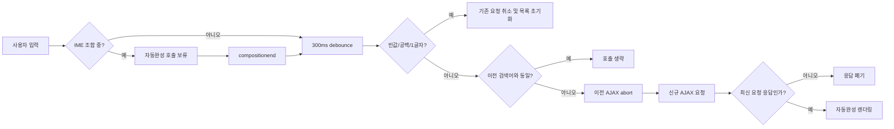
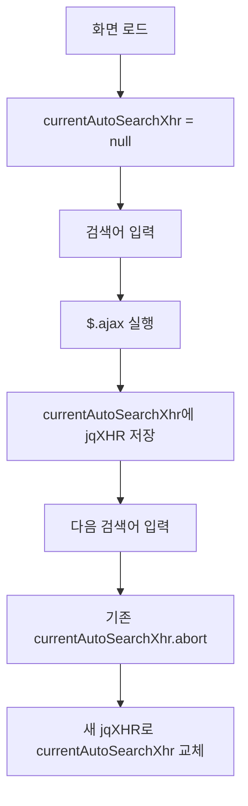

## 자동완성 
### AS-IS
```javascript
//연속 타이핑시 중간에 자동완성 호출방지를 위해 일정시간 term을 두어 최종키워드에 대한 것만 호출하도록 수정
let timeoutAutoSearch = null;
function fn_autoSearch() {
    if(timeoutAutoSearch != null) {
        clearTimeout(timeoutAutoSearch);
        timeoutAutoSearch = null;
    }
    timeoutAutoSearch = setTimeout(fn_autoSearchExe,300);
}

function fn_autoSearchExe() {
    let keyword = $("#keyword").val();
     if(keyword == '') { //키워드가 지워졌을경우
         // 로직 A

     } else {
          // 로직 B
         let params = {}
         params.text = keyword;
         params.size = 10;
            $.ajax({
                url: '/comm/buyer/ajax/autocomplete.do'
                , contentType : 'application/json'
                , method: 'post'
                , dataType: 'json'
                , data : JSON.stringify(params)
            }).done(function(data){
  
            }).fail(function(err){

            });
     }
}
```


# 정리 - Ge
현재 작성하신 코드는 연속 타이핑 시 서버에 가해지는 부하를 줄이기 위해 **디바운스(Debounce) 개념을 300ms로 아주 적절하게 적용**하셨습니다. 기본적인 퍼포먼스 대책은 훌륭히 마련되어 있습니다.

하지만 수많은 사용자가 이용하는 **커머스 사이트의 특성**과 한글 입력 환경(IME)을 고려했을 때, 프로덕션 환경에서 간헐적으로 발생할 수 있는 데이터 꼬임이나 불필요한 자원 낭비를 막기 위해 **반드시 개선해야 할 4가지 포인트**가 있습니다.

## 1. 핵심 개선 포인트 4가지
#### ① 비동기 응답 순서 꼬임 (Race Condition) 방지 ⚠️
사용자가 조금 느리게 타이핑을 이어 나갈 때 발생하는 가장 흔한 버그입니다.

- **문제점:** 만약 사용자가 '노트'라고 입력하여 1번 요청(노트)이 가고, 이어서 '노트북'을 입력하여 2번 요청(노트북)이 갔다고 가정해 봅시다. 만약 서버나 네트워크 사정으로 **1번 요청의 응답이 2번 요청의 응답보다 늦게 도착하면**, 화면에는 최종적으로 '노트북'이 아닌 과거에 입력한 '노트'의 자동완성 결과가 출력되는 치명적인 데이터 역전 현상이 발생합니다.
    
- **해결책:** 새로운 AJAX 요청을 보내기 전에, **기존에 진행 중이던(아직 응답이 안 온) AJAX 요청이 있다면 `abort()`로 강제 종료**해야 합니다.    
#### ② 한글(IME) 입력 특성 및 특수 키 처리 ⌨️

- **문제점:** 한글은 자음과 모음이 결합하는 문자(IME) 특성상 `keyup` 이벤트를 사용하면 글자가 완전히 조합되기 전에 이벤트가 오작동하거나 중복 트리거되는 경향이 있습니다. 또한, 사용자가 자동완성 목록을 선택하기 위해 방향키(위/아래)를 누르거나 **Enter**를 누를 때도 `keyup` 이벤트가 발생하여 불필요한 API 호출이 낭비됩니다.
    
- **해결책:** 이벤트 바인딩 시 `keyup` 대신 값이 실제로 변했을 때만 영리하게 동작하는 **`input` 이벤트**를 사용하고, 값이 변하지 않은 특수 키 입력은 걸러내야 합니다.
    

### ③ 불필요한 중복 호출 및 공백 처리 🚫

- **문제점:** 사용자가 글자를 치다가 뒤로 가기(Backspace)를 누른 뒤 다시 똑같은 글자를 쳤을 때, 값의 변화가 없음에도 300ms 뒤에 동일한 API를 또 호출합니다. 또한 의미 없는 공백( )을 입력했을 때도 조회가 발생할 수 있습니다.
    
- **해결책:** 앞뒤 공백을 제거하는 `.trim()`을 적용하고, **바로 직전에 검색했던 키워드와 완벽히 동일하다면 API 호출을 생략**하는 방어 코드가 필요합니다.

### ④ 최소 글자 수 제한 (선택 사항) 🔍

- **문제점:** 커머스 사이트에서 'ㅇ', 'ㄱ' 같은 자음 한 글자나 '아' 같은 모음 한 글자만 입력했을 때 자동완성을 쿼리하면, DB와 API 서버에 엄청난 양의 매칭 데이터가 잡혀 성능 저하를 유발합니다.
    
- **해결책:** 최소 2글자 이상 입력되었을 때만 자동완성이 돌도록 제한을 두는 것이 서버 자원 보호에 좋습니다.

## 2. 최적화된 리팩토링 소스 코드 변경안

위의 개선 사항들을 모두 반영하고, 전역 변수가 오염되지 않도록 하나의 네임스페이스(또는 즉시실행함수)로 깔끔하게 격리한 개선 코드입니다.

```JavaScript
// 전역 변수 오염을 막기 위해 객체 형태로 캡슐화합니다.
const AutoCompleteManager = {
    timeoutId: null,
    currentXHR: null,   // 진행 중인 AJAX 요청을 담을 변수
    lastKeyword: '',    // 직전 검색어를 저장할 변수

    // 초기화 함수 (페이지 로드 시 호출)
    init: function() {
        const $input = $("#keyword");
        
        // keyup 대신 한글 IME에 안전하고 부드러운 'input' 이벤트를 바인딩합니다.
        $input.on("input", () => {
            this.debounce(() => this.executeSearch($input.val()), 300);
        });
    },

    // 디바운스 공통 함수
    debounce: function(callback, delay) {
        if (this.timeoutId) clearTimeout(this.timeoutId);
        this.timeoutId = setTimeout(callback, delay);
    },

    // 실제 자동완성 로직 실행
    executeSearch: function(rawKeyword) {
        // 1. 앞뒤 공백 제거
        const keyword = rawKeyword.trim(); 

        // 2. 키워드가 비어있을 경우 처리
        if (keyword === '') {
            this.lastKeyword = '';
            // [로직 A] 기존 자동완성 창을 닫거나 초기화하는 코드 작성
            return;
        }

        // 3. [선택] 최소 글자 수 제한 (커머스 자원 보호용, 2글자 미만은 패스)
        if (keyword.length < 2) {
            return;
        }

        // 4. 직전 검색어와 동일하다면 중복 호출 차단
        if (keyword === this.lastKeyword) {
            return;
        }
        this.lastKeyword = keyword; // 현재 키워드를 최종 검색어로 업데이트

        // 5. [중요] 이전 요청이 아직 처리 중이라면 강제로 취소(Abort)하여 순서 꼬임 방지
        if (this.currentXHR && this.currentXHR.readyState !== 4) {
            this.currentXHR.abort();
        }

        const params = {
            text: keyword,
            size: 10
        };

        // AJAX 요청을 변수에 할당
        this.currentXHR = $.ajax({
            url: '/comm/buyer/ajax/autocomplete.do',
            contentType: 'application/json',
            method: 'post',
            dataType: 'json',
            data: JSON.stringify(params)
        }).done(function(data) {
            // [로직 B] 자동완성 UI 노출 및 데이터 렌더링
            // $("#aw-prd, #aw-trds,#aw-company").show();
        }).fail(function(err) {
            // abort()로 인해 발생한 취소 에러는 정상적인 흐름이므로 로그를 생략합니다.
            if (err.statusText === 'abort') return; 
            
            console.error("자동완성 호출 실패:", err);
        });
    }
};

// 문서 로드 완료 시 초기화 실행
$(document).ready(function() {
    AutoCompleteManager.init();
});
```


# 정리 - GPT

### 결론

현재 스크립트는 **300ms 디바운스 적용 자체는 적절**하지만, 커머스 검색 자동완성 입력란 기준으로는 **운영 안정성이 부족**합니다. 특히 다음 4가지는 반드시 보완하는 것이 좋습니다.

1. **이전 AJAX 요청 취소**
    
2. **이전 응답이 늦게 도착해 최신 검색어 결과를 덮는 문제 방지**
    
3. **한글 IME 조합 입력 처리**
    
4. **공백/짧은 검색어/중복 검색어 호출 방지**  
    `input` 이벤트는 사용자가 `<input>` 값을 직접 변경할 때 발생하며, `change`와 달리 값이 바뀔 때마다 발생합니다. 자동완성 검색에는 `keyup`보다 `input` 이벤트가 더 적합합니다. ([MDN 웹 문서](https://developer.mozilla.org/en-US/docs/Web/API/Element/input_event "Element: input event - Web APIs | MDN"))
    

### 현재 코드의 주요 문제점

|구분|현재 상태|문제 가능성|개선 방향|
|---|---|---|---|
|디바운스|300ms 지연|연속 입력 호출 감소는 가능|유지 가능|
|이전 AJAX|취소 없음|느린 이전 응답이 최신 결과를 덮을 수 있음|`jqXHR.abort()` 적용|
|응답 순서|검증 없음|`가방` 요청 후 `가방끈` 요청이 나갔는데 `가방` 응답이 늦게 와서 화면 오염 가능|요청 순번 또는 keyword 비교|
|한글 입력|IME 고려 없음|`ㄱ`, `가` 조합 중 불필요 호출 가능|`compositionstart/end`, `isComposing` 처리|
|빈값|`keyword == ''`만 체크|공백 `" "`은 호출됨|`trim()` 적용|
|최소 길이|없음|한 글자마다 서버 부하 증가|2자 이상 권장|
|중복 검색|없음|같은 키워드 반복 호출 가능|`lastKeyword` 비교|
|에러 처리|fail 무시|운영 장애 탐지 어려움|abort와 실제 오류 구분|

### 왜 AJAX 취소가 필요한가

`$.ajax()`는 `jqXHR` 객체를 반환하고, 이 객체는 `abort()`를 제공하여 완료 전 요청을 중단할 수 있습니다. 또한 AJAX는 비동기 동작이므로 완료 순서가 보장되지 않습니다. 따라서 자동완성에서는 **이전 요청 취소 + 최신 요청 여부 검증**을 같이 적용하는 것이 안전합니다. ([jQuery API](https://api.jquery.com/jQuery.ajax/ "jQuery.ajax() | jQuery API Documentation"))

### 한글 입력에서 주의할 점

한글, 일본어, 중국어 입력은 IME 조합 과정을 거칩니다. `compositionstart`는 조합 시작 시, `compositionend`는 조합 완료 또는 취소 시 발생합니다. `InputEvent.isComposing`은 `compositionstart` 이후 `compositionend` 이전에 발생한 입력인지 확인할 수 있습니다. 자동완성은 조합 중간값보다 **조합 완료 후 최종 문자열** 기준으로 호출하는 편이 안전합니다. ([MDN 웹 문서](https://developer.mozilla.org/en-US/docs/Web/API/Element/compositionstart_event "Element: compositionstart event - Web APIs | MDN"))

### 개선 코드 예시: jQuery 유지 기준

```javascript
let timeoutAutoSearch = null;
let currentAutoSearchXhr = null;
let lastKeyword = '';
let requestSeq = 0;
let isComposing = false;
const AUTO_SEARCH_DELAY = 300;
const MIN_KEYWORD_LENGTH = 2;
$(function () {
    const $keyword = $("#keyword");
    $keyword.on("compositionstart", function () {
        isComposing = true;
    });
    $keyword.on("compositionend", function () {
        isComposing = false;
        fn_autoSearch();
    });
    $keyword.on("input", function (e) {
        if (e.originalEvent && e.originalEvent.isComposing) {
            return;
        }
        if (isComposing) {
            return;
        }
        fn_autoSearch();
    });
});
function fn_autoSearch() {
    if (timeoutAutoSearch !== null) {
        clearTimeout(timeoutAutoSearch);
        timeoutAutoSearch = null;
    }
    timeoutAutoSearch = setTimeout(function () {
        timeoutAutoSearch = null;
        fn_autoSearchExe();
    }, AUTO_SEARCH_DELAY);
}
function fn_autoSearchExe() {
    const keyword = $.trim($("#keyword").val() || "");
    if (keyword.length === 0) {
        lastKeyword = "";
        abortCurrentAutoSearch();
        clearAutoCompleteView();
        return;
    }
    if (keyword.length < MIN_KEYWORD_LENGTH) {
        abortCurrentAutoSearch();
        clearAutoCompleteView();
        return;
    }
    if (keyword === lastKeyword) {
        return;
    }
    lastKeyword = keyword;
    abortCurrentAutoSearch();
    const mySeq = ++requestSeq;
    currentAutoSearchXhr = $.ajax({
        url: "/comm/buyer/ajax/autocomplete.do",
        method: "POST",
        contentType: "application/json; charset=UTF-8",
        dataType: "json",
        timeout: 3000,
        data: JSON.stringify({
            text: keyword,
            size: 10
        })
    }).done(function (data) {
        const currentKeyword = $.trim($("#keyword").val() || "");
        if (mySeq !== requestSeq) {
            return;
        }
        if (currentKeyword !== keyword) {
            return;
        }
        renderAutoCompleteView(data, keyword);
    }).fail(function (jqXHR, textStatus, errorThrown) {
        if (textStatus === "abort") {
            return;
        }
        // 운영에서는 console.log만 두지 말고 필요 시 서버 로그/프론트 오류 수집 도구와 연계
        clearAutoCompleteView();
    }).always(function () {
        if (mySeq === requestSeq) {
            currentAutoSearchXhr = null;
        }
    });
}
function abortCurrentAutoSearch() {
    if (currentAutoSearchXhr && currentAutoSearchXhr.readyState !== 4) {
        currentAutoSearchXhr.abort();
    }
    currentAutoSearchXhr = null;
}
function clearAutoCompleteView() {
    // 로직 A
    // 예: $("#aw-prd, #aw-trds, #aw-company").hide().empty();
}
function renderAutoCompleteView(data, keyword) {
    // 로직 B
    // 예: 자동완성 목록 렌더링
    // 주의: 서버 응답 문자열을 HTML로 직접 넣지 말고 escape 또는 text() 기반으로 처리
}
```

### 적용 우선순위

|순서|개선 항목|중요도|이유|
|--:|---|---|---|
|1|이전 AJAX `abort()`|높음|불필요 서버 처리와 응답 역전 감소|
|2|응답 시점 keyword 검증|높음|오래된 결과가 최신 화면을 덮는 문제 방지|
|3|`compositionstart/end` 처리|높음|한글 검색 UX 개선|
|4|`trim()` + 최소 글자 수|높음|공백/짧은 검색어 호출 방지|
|5|`lastKeyword` 중복 방지|중간|같은 검색어 반복 호출 감소|
|6|`timeout` 지정|중간|느린 검색 API가 UI 상태를 오래 점유하는 문제 방지|
|7|결과 escape 처리|높음|자동완성 영역 XSS 방지|

### 서버 측도 같이 점검해야 하는 부분

|항목|권장 기준|
|---|---|
|검색어 길이 제한|서버에서도 최소/최대 길이 검증|
|size 제한|클라이언트가 `size=1000`을 보내도 서버에서 상한 적용|
|특수문자 처리|검색엔진/DB 쿼리 escape 또는 파라미터 바인딩|
|속도 제한|동일 IP/세션 기준 과도 호출 제한|
|캐시|인기 키워드/동일 키워드 단기 캐시 검토|
|응답 크기|자동완성은 필요한 필드만 반환|
|장애 시 UX|오류 시 목록 닫기, 기존 목록 유지 여부 정책 결정|

### 입력 이벤트 흐름



### 최종 판단

현재 코드는 **“연속 타이핑 방지”까지만 해결**한 상태입니다. 실무 커머스 검색창에서는 `debounce + abort + 최신 응답 검증 + IME 처리 + 최소 검색어 제한`까지 적용해야 안정적입니다. 특히 상품 검색 자동완성은 사용자가 빠르게 입력·삭제·붙여넣기·한글 조합·모바일 키보드 입력을 반복하므로, 위 개선 코드를 기준으로 변경하는 것이 적절합니다.

## 참고
### 결론

`currentAutoSearchXhr`는 **JavaScript 변수가 선언된 실행 컨텍스트 단위**로 관리됩니다. 즉, **자동으로 “화면당 하나”가 되는 것이 아니라**, 어디에 선언했느냐에 따라 관리 범위가 결정됩니다.  
현재 예시처럼 전역에 선언하면 일반적으로 **브라우저의 현재 페이지 문서 1개당 1개**로 보면 됩니다.

```javascript
let currentAutoSearchXhr = null;
```

### 관리 단위 정리

|구분|관리 단위|설명|
|---|---|---|
|일반 JSP/HTML 화면|현재 브라우저 탭의 문서 1개|페이지가 로드될 때 변수 1개 생성|
|새로고침|초기화됨|`currentAutoSearchXhr = null` 상태로 다시 시작|
|다른 브라우저 탭|별도 관리|같은 URL이라도 탭마다 JavaScript 실행 공간이 다름|
|다른 사용자|별도 관리|서버 공유 객체가 아니라 각 사용자 브라우저 메모리|
|같은 화면의 여러 검색 input|공유됨|전역 변수 하나를 여러 input이 같이 쓰면 서로 요청을 취소할 수 있음|
|iframe 내부|iframe 문서별 별도|iframe은 별도 window/document 컨텍스트|
|SPA 화면|컴포넌트 생명주기 의존|전역이면 화면 이동 후에도 남을 수 있음|

### 현재 코드 기준 동작

```javascript
let currentAutoSearchXhr = null;
```

이렇게 선언하면 해당 화면에서 자동완성 요청이 발생할 때마다 다음처럼 동작합니다.



즉, `currentAutoSearchXhr`는 **요청 객체 자체를 계속 보관하는 저장소가 아니라 “현재 진행 중인 최신 AJAX 요청을 가리키는 참조 변수”**입니다.

### 중요한 실무 포인트

#### 1. 한 화면에 검색 입력란이 1개라면

현재 방식이 적절합니다.

```javascript
let currentAutoSearchXhr = null;
```

상품 검색창 하나만 있다면 **현재 화면의 자동완성 요청 1개만 관리**하면 되므로 충분합니다.

#### 2. 한 화면에 검색 입력란이 여러 개라면

전역 변수 하나를 공유하면 문제가 생길 수 있습니다.  
예를 들어:

- 상단 통합검색 input
    
- 레이어 팝업 상품검색 input
    
- 관리자 상품선택 input  
    이렇게 여러 검색창이 같은 `currentAutoSearchXhr`를 사용하면, **A 검색창 입력이 B 검색창의 AJAX를 abort할 수 있습니다.**
    

### 여러 input이 있을 때 권장 방식

검색창별로 AJAX 객체를 따로 관리하는 것이 안전합니다.

```javascript
const autoSearchXhrMap = {};
function abortAutoSearch(inputId) {
    const xhr = autoSearchXhrMap[inputId];
    if (xhr && xhr.readyState !== 4) {
        xhr.abort();
    }
    autoSearchXhrMap[inputId] = null;
}
function fn_autoSearchExe(inputId) {
    const keyword = $.trim($("#" + inputId).val() || "");
    if (keyword.length === 0) {
        abortAutoSearch(inputId);
        return;
    }
    abortAutoSearch(inputId);
    autoSearchXhrMap[inputId] = $.ajax({
        url: "/comm/buyer/ajax/autocomplete.do",
        method: "POST",
        contentType: "application/json; charset=UTF-8",
        dataType: "json",
        data: JSON.stringify({
            text: keyword,
            size: 10
        })
    }).done(function (data) {
        // inputId에 해당하는 자동완성 영역만 렌더링
    }).fail(function (jqXHR, textStatus) {
        if (textStatus === "abort") {
            return;
        }
    });
}
```

### 단일 검색창 vs 다중 검색창 판단 기준

| 상황                     | 권장 관리 방식                            |
| ---------------------- | ----------------------------------- |
| 상품 검색창 1개              | `currentAutoSearchXhr` 전역 변수 1개     |
| 같은 화면에 자동완성 input 여러 개 | input별 Map 관리                       |
| 공통 JS가 여러 화면에서 재사용됨    | input selector 또는 component 단위로 캡슐화 |
| SPA/레이어 팝업 반복 생성       | destroy/close 시 abort 및 변수 정리 필요    |

### 최종 판단

현재 커머스 상품 검색 입력란이 **화면에 1개만 존재**한다면 `currentAutoSearchXhr`는 사실상 **현재 브라우저 화면 1개당 1개**로 관리된다고 봐도 됩니다. 다만 이것은 브라우저가 자동으로 보장하는 개념이 아니라, **전역 변수 1개를 그렇게 사용하고 있기 때문**입니다.  
같은 화면에서 자동완성 검색창이 2개 이상 생길 가능성이 있다면 `currentAutoSearchXhr` 하나로 관리하지 말고, **검색 input 단위로 jqXHR을 분리 관리**하는 구조가 안전합니다.

## javaScript 키입력 이벤트 비교

결론부터 말씀드리면, **타이핑을 감지하여 자동완성 API를 호출하는 용도로는 `input` 이벤트가 압도적으로 좋습니다.** 다만, 현대 커머스 사이트의 베스트 프랙티스(Best Practice)는 **`input`과 `focus` 이벤트를 조합하여 하이브리드(Hybrid)로 운영**하는 것입니다. `keyup`은 단점이 많아 현대 웹 개발에서는 사용을 지양하는 추세입니다.

세 이벤트의 특징과 장단점을 직관적으로 비교해 드립니다.

### 1. 이벤트별 비교 요약

| **비교 항목**         | **focus**                                 | **keyup (과거 방식)**             | **input (강력 추천)**               |
| ----------------- | ----------------------------------------- | ----------------------------- | ------------------------------- |
| **발생 시점**         | 검색창을 마우스로 클릭하거나 Tab 키로 진입했을 때 **(최초 1회)** | 키보드의 키를 눌렀다가 **뗄 때마다**        | 검색창의 **텍스트 값이 실제로 변경될 때마다**     |
| **한글 (IME) 호환성**  | 해당 없음                                     | ❌ 조합 중 글자 깨짐이나 중복 발동 가능성 있음   | **완벽함** (글자 조합 상태를 정확히 인지)      |
| **마우스 붙여넣기/잘라내기** | 감지 불가                                     | ❌ 감지 불가 (우클릭 후 붙여넣기 하면 반응 없음) | **완벽 감지** (어떤 경로든 값만 바뀌면 발동)    |
| **방향키 / 엔터키 필터링** | 해당 없음                                     | ❌ 불필요하게 발동 (필터링 코드 필수)        | **자동 필터링** (값이 변하지 않으므로 발동 안 함) |
| **커머스 추천 용도**     | **최근 검색어 / 인기 검색어** 노출                    | 사용 안 함 (하위 호환성 전용)            | **실시간 자동완성 API 호출**             |

### 2. 왜 `input` 이벤트가 가장 좋을까?

#### ① 한글 입력(IME) 환경에 최적화

한글은 자음과 모음이 합쳐져 하나의 글자가 되는 특성(IME)이 있습니다. `keyup`은 글자가 조합되는 과정(예: 'ㄱ' -> '가' -> '감')에서 브라우저마다 이벤트를 다르게 뱉거나, 마지막 글자를 씹는 버그가 자주 일어납니다. 반면 **`input`은 오직 최종적으로 '변화된 결과 데이터'만 보기 때문에 한글 입력에 가장 안정적**입니다.

#### ② 마우스 조작(Copy & Paste) 완벽 대응

사용자가 키보드로 타이핑하지 않고, 메모장에서 상품명을 **마우스로 복사해서 검색창에 우클릭 -> 붙여넣기(Paste)** 하거나, 입력된 내용을 드래그해서 지울 때 `keyup`은 먹통이 됩니다. `input` 이벤트는 값의 변화를 감지하므로 마우스 조작도 완벽하게 잡아냅니다.

#### ③ 불필요한 API 호출 방지 (의미 없는 키 차단)

사용자가 자동완성 목록이 아래로 펼쳐졌을 때, 목록을 고르려고 키보드 방향키(↓, ↑)를 누르거나 대문자를 치려고 **Shift 키**를 누르는 순간에도 `keyup`은 계속 발동합니다. `input`은 이 과정에서 값이 변하지 않으면 동작하지 않으므로, 서버 자원을 알아서 보호해 줍니다.

### 3. 커머스 사이트를 위한 최종 이벤트 조합 가이드 (Best Practice)

훌륭한 UX(사용자 경험)를 가진 쿠팡, 네이버, 무신사 등의 커머스 사이트들은 아래 시나리오처럼 **`focus`와 `input`을 결합**하여 사용합니다.

#### 💡 권장 구현 시나리오
1. **[사용자가 검색창을 클릭했을 때 - `focus`]**
    - 아직 아무것도 타이핑하지 않았으므로 자동완성 API를 찌를 필요가 없습니다.
    - 대신, 로컬 스토리지에 저장된 "최근 검색어"나 서버에서 관리하는 **"실시간 인기 브랜드"** 레이어를 화면에 띄워줍니다.
        
2. **[사용자가 타이핑을 시작했을 때 - `input` (with 디바운스)]**
    - 글자가 입력되는 순간 `focus` 레이어를 닫고, **"실시간 상품 자동완성"** 레이어를 켜서 API 결과를 보여줍니다.
### 🛠️ 구현 예시 코드
```JavaScript
const $searchInput = $('#keyword');

// 1. 클릭했을 때는 최근 검색어 보여주기
$searchInput.on('focus', function() {
    const value = $(this).val().trim();
    if (value === '') {
        // 최근 검색어 / 추천 키워드 영역 show
        $('#recent-searches-layer').show();
        $('#autocomplete-layer').hide();
    }
});

// 2. 타이핑할 때는 자동완성 보여주기 (기존 작성하신 디바운스 로직 연결)
$searchInput.on('input', function() {
    $('#recent-searches-layer').hide();
    $('#autocomplete-layer').show();
    
    // 이전에 구현한 디바운스 함수 호출
    fn_autoSearch(); 
});

// 3. 바깥 영역 클릭 시 닫기
$(document).on('click', function(e) {
    if (!$(e.target).closest('.search-wrapper').length) {
        $('#recent-searches-layer').hide();
        $('#autocomplete-layer').hide();
    }
});
```

기존 코드의 `keyup` 관련 바인딩을 `input`으로 변경하는 것만으로도 수많은 간헐적 오류(마우스 붙여넣기 미작동, 방향키 버그 등)를 깔끔하게 해결할 수 있습니다.