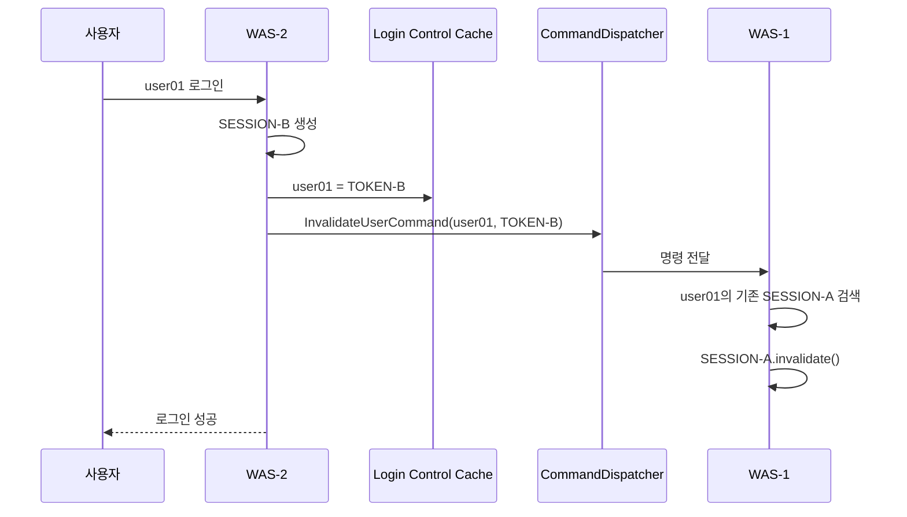

### 결론

**JBoss EAP 7.2에서 `CommandDispatcher`는 실제 사용 가능한 공식 Public Clustering API입니다.** 이전 답변에서 이 부분이 불명확했다면 정정할 수 있습니다.
Red Hat의 **JBoss EAP 7.2 Development Guide**가 `org.wildfly.clustering.dispatcher.CommandDispatcher`를 직접 **Public API for Clustering Services**로 설명하고 있으며, `CommandDispatcherFactory`를 이용해 다른 클러스터 노드에서 명령을 실행하는 예제까지 제공합니다. ([레드햇 문서][1])
또한 EAP 7 계열 모듈 목록에서 `org.wildfly.clustering.api`는 `PUBLIC`으로 분류되어 있습니다. ([Red Hat Customer Portal][2])

| 검증 항목                               | 결론         |
| ----------------------------------- | ---------- |
| EAP 7.2에 존재                         | ✅ 존재       |
| 애플리케이션에서 사용 가능                      | ✅ 가능       |
| JBoss 내부 Private SPI                | ❌ 아님       |
| Red Hat Public API                  | ✅ 맞음       |
| JGroups 기반 노드 간 명령 전달               | ✅          |
| Spring 5.3 애플리케이션에서 사용              | ✅          |
| 중복 로그인 처리에 활용                       | ✅ 가능       |
| `CommandDispatcher`만으로 완전한 중복로그인 보장 | ⚠️ 권장하지 않음 |
| 기존 Session Cluster와 병행              | ✅ 권장       |

### 1. `CommandDispatcher`란?

`CommandDispatcher`는 간단히 말하면:

> **현재 WAS에서 다른 JBoss Cluster WAS의 Java 코드를 실행시키는 RPC/Broadcast 기능**
> 입니다.
> 예를 들어 WAS가 2대라면:

```text
               JGroups Cluster
┌──────────── WAS-1 ────────────┐
│                               │
│ CommandDispatcher             │
│        │                      │
└────────┼──────────────────────┘
         │ InvalidateUserCommand("user01")
         ▼
┌──────────── WAS-2 ────────────┐
│ CommandDispatcher             │
│        │                      │
│        └─ SessionRegistry     │
│             │                 │
│             └─ session.invalidate()
└───────────────────────────────┘
```

Red Hat EAP 7.2 문서도 `CommandDispatcherFactory`를 **클러스터 노드에서 명령을 실행하기 위한 Dispatcher 생성 서비스**라고 정의합니다. ([레드햇 문서][1])

### 2. Session Cluster와 역할이 다르다

이 부분이 중복 로그인 구현에서 가장 중요합니다.

| 기능                    | Session Cluster         | CommandDispatcher |
| --------------------- | ----------------------- | ----------------- |
| 목적                    | HttpSession HA/Failover | 클러스터 노드 간 명령 실행   |
| 전송 기반                 | JGroups/Infinispan      | JGroups           |
| 세션 데이터 복제             | O                       | X                 |
| 다른 WAS의 코드 실행         | X                       | O                 |
| 특정 사용자 세션 종료 명령       | 직접 기능 아님                | O                 |
| 중복 로그인 제어             | 단독으로 부족                 | 구현 가능             |
| Session Cluster의 목적은: |                         |                   |

```text
WAS-1 장애
  ↓
WAS-2
  ↓
기존 HttpSession 복원
```

입니다.
EAP 7.2 공식 문서도 Session Replication은 노드 장애 시 다른 노드가 세션을 인계받을 수 있도록 클러스터 노드가 진행 중인 세션 정보를 공유하는 기능이라고 설명합니다. ([레드햇 문서][1])
반면 중복 로그인 문제는:

```text
user01
 ├─ Session-A ← PC 로그인
 └─ Session-B ← 모바일 로그인
```

처럼 **서로 다른 두 개의 HttpSession 중 어느 것이 유효한지 결정하는 문제**입니다.
따라서 `<distributable/>`만으로는 해결되지 않습니다.

### 3. `CommandDispatcher`를 중복 로그인에 적용하는 원리

예를 들어:

```text
WAS-1
user01 → SESSION-A
```

상태에서 동일 사용자가 WAS-2에 새로 로그인한다고 하겠습니다.



즉 `CommandDispatcher`가 세션을 직접 관리하는 것이 아닙니다.

```text
CommandDispatcher
      ↓
"다른 WAS에서 이 Java 코드를 실행해라"
      ↓
SessionRegistry.invalidate(userId)
      ↓
HttpSession.invalidate()
```

구조입니다.

### 4. EAP 7.2에서 확인된 주요 API

EAP 7.2 계열 Public API에는 다음 인터페이스가 존재합니다.

```java
org.wildfly.clustering.dispatcher.Command
org.wildfly.clustering.dispatcher.CommandDispatcher
org.wildfly.clustering.dispatcher.CommandDispatcherFactory
```

`CommandDispatcherFactory`에는 다음 형태의 생성 메서드가 존재합니다.

```java
<C> CommandDispatcher<C> createCommandDispatcher(
        Object id,
        C context);
```

동일한 `id`를 가진 Dispatcher끼리 통신합니다. Red Hat의 EAP 7.2 CD13 Public Javadoc도 이 동작을 명시합니다. ([Red Hat Customer Portal][3])
그리고 EAP 7.2 CD14 계열에서는:

```java
executeOnMember(...)
executeOnGroup(...)
```

가 존재합니다.

```java
Map<Node, CompletionStage<R>> executeOnGroup(
        Command<R, ? super C> command,
        Node... excludedMembers);
```

`executeOnGroup()`은 그룹 전체 WAS에 명령을 실행할 수 있습니다. ([Red Hat Customer Portal][4])

### 5. 현재 `server` cache-container를 이용할 수 있는 이유

앞서 확인했던 설정이 다음 계열이었습니다.

```xml
<cache-container name="server"
                 aliases="singleton cluster"
                 default-cache="default"
                 module="org.wildfly.clustering.server">
    <transport lock-timeout="60000"/>
    <replicated-cache name="default">
        <transaction mode="BATCH"/>
    </replicated-cache>
</cache-container>
```

여기에서 중요한 부분은:

```xml
<transport .../>
```

입니다.
WildFly 14/EAP 7.2 계열 HA 구현에서는 **각 Infinispan cache-container에 대해 `CommandDispatcherFactory` alias를 생성**하고, 해당 cache-container의 transport channel을 사용합니다.
공식 문서 예:

```java
@Resource(
    lookup = "java:jboss/clustering/dispatcher/server"
)
private CommandDispatcherFactory factory;
```

문서에도 이 `server` alias가 `"server" cache-container의 transport`를 사용한다고 정확히 나옵니다. ([docs.wildfly.org][5])
따라서 현재 구성에서는 가장 먼저 검토할 JNDI가:

```text
java:jboss/clustering/dispatcher/server
```

입니다.
별도의 JGroups 채널을 무조건 추가해야 하는 구조는 아닙니다.

### 6. Spring 5.3에서 실제 구현 형태

Spring Bean으로도 충분히 사용할 수 있습니다.

#### Dispatcher 생성

```java
@Configuration
public class LoginDispatcherConfig {
    @Bean
    public CommandDispatcherFactory loginCommandDispatcherFactory()
            throws NamingException {
        InitialContext context = new InitialContext();
        return (CommandDispatcherFactory) context.lookup(
            "java:jboss/clustering/dispatcher/server"
        );
    }
    @Bean(destroyMethod = "close")
    public CommandDispatcher<LoginCommandContext> loginCommandDispatcher(
            CommandDispatcherFactory factory,
            LoginCommandContext context) {
        return factory.createCommandDispatcher(
            "LOGIN_CONTROL_V1",
            context
        );
    }
}
```

여기서:

```text
LOGIN_CONTROL_V1
```

은 **모든 WAS에서 동일해야 합니다.**

### 7. 실제 전송할 Command

```java
public class InvalidateLoginCommand
        implements Command<Void, LoginCommandContext> {
    private static final long serialVersionUID = 1L;
    private final String userId;
    private final String keepToken;
    public InvalidateLoginCommand(
            String userId,
            String keepToken) {
        this.userId = userId;
        this.keepToken = keepToken;
    }
    @Override
    public Void execute(LoginCommandContext context) {
        context.invalidateOtherSessions(
            userId,
            keepToken
        );
        return null;
    }
}
```

중요한 점은 `Command` 객체는 다른 WAS로 전달되므로:

```text
userId
keepToken
```

같은 전달 데이터는 직렬화 가능해야 합니다.
반면 `LoginCommandContext`는 수신 WAS의 Local Context이므로 여기에 실제 Spring Service나 Session Registry를 연결할 수 있습니다.
이는 WildFly HA Guide에서 설명하는 **Sender supplied parameters / Receiver supplied local context** 구조와 동일합니다. ([docs.wildfly.org][5])

### 8. Command 실행

로그인 성공 후:

```java
@Component
@RequiredArgsConstructor
public class DuplicateLoginManager {
    private final CommandDispatcher<LoginCommandContext> dispatcher;
    public void invalidateOldSessions(
            String userId,
            String newToken) {
        InvalidateLoginCommand command =
            new InvalidateLoginCommand(userId, newToken);
        dispatcher.executeOnGroup(command)
            .forEach((node, stage) ->
                stage.whenComplete((result, error) -> {
                    if (error != null) {
                        // WARN logging
                    }
                })
            );
    }
}
```

실제 동작:

```text
WAS-1 ─┐
WAS-2 ─┼─ LOGIN_CONTROL_V1
WAS-3 ─┘
         ▲
         │
executeOnGroup(
    new InvalidateLoginCommand("USER01","TOKEN-B")
)
```

각 WAS에서:

```java
context.invalidateOtherSessions("USER01", "TOKEN-B");
```

가 실행됩니다.

### 9. `CommandDispatcher`만으로 구현하는 것은 왜 부족한가

여기가 실제 아키텍처 판단에서 가장 중요합니다.
다음 상황을 생각해야 합니다.

#### 동시 로그인

```text
10:00:00.001 WAS-1 → TOKEN-A
10:00:00.002 WAS-2 → TOKEN-B
```

두 WAS가 거의 동시에:

```text
WAS-1 → TOKEN-B 제거 명령
WAS-2 → TOKEN-A 제거 명령
```

을 보내면 순서 경쟁이 발생할 수 있습니다.
`CommandDispatcher` 자체에는:

```text
USER01의 최종 로그인은 TOKEN-B이다
```

라는 **Authoritative State(최종 상태)**가 없습니다.
또한 네트워크 단절 시:

```text
WAS-1 ── X ── WAS-2
```

명령을 받지 못한 WAS에서 기존 로그인 세션이 살아 있을 가능성도 고려해야 합니다.
따라서:

| 설계                                       |       안정성 |
| ---------------------------------------- | --------: |
| Session Cluster만                         |        낮음 |
| CommandDispatcher만                       |        중간 |
| DB Session 관리                            | 높음, DB 부하 |
| Infinispan Token만                        |        높음 |
| **Infinispan Token + CommandDispatcher** | **가장 권장** |

### 10. 권장 최종 구조

제가 현재 EAP 7.2 + Spring 5.3 구조라면 다음 방식으로 설계하는 것이 가장 적절합니다.

```text
                  ┌───────────────────────┐
                  │ Infinispan Login Cache│
                  │ USER01 → TOKEN-B      │
                  └───────────┬───────────┘
                              │ authoritative
                              │ login state
             ┌────────────────┴────────────────┐
             │                                 │
         WAS-1                              WAS-2
     SESSION-A                           SESSION-B
     TOKEN-A                             TOKEN-B
             ▲                                 │
             │                                 │
             └──── CommandDispatcher ──────────┘
                invalidate USER01
                except TOKEN-B
```

역할을 정확히 나누면:

| 구성요소                                                 | 역할                          |
| ---------------------------------------------------- | --------------------------- |
| HTTP Session Cluster                                 | Session HA / Failover       |
| Infinispan Login Cache                               | 현재 유효한 로그인 Token 결정         |
| CommandDispatcher                                    | 다른 WAS에 기존 Session 즉시 종료 명령 |
| Spring Session Registry                              | 로컬 HttpSession 검색/종료        |
| Interceptor/Filter                                   | 필요 시 Token 유효성 최종 검증        |
| 이렇게 하면 `CommandDispatcher`는 **request마다 호출하지 않습니다.** |                             |
| 주로:                                                  |                             |

```text
LOGIN
LOGOUT
강제 로그아웃
관리자 세션 종료
```

같은 이벤트가 발생할 때만 호출합니다.
따라서 이전에 우려했던:

> 매 요청마다 클러스터 조회하여 성능이 떨어지는 문제
> 를 크게 줄일 수 있습니다.

### 11. 운영 EAP 7.2에서 직접 사용 가능 여부를 100% 확인하는 방법

문서 검증과 별도로 현재 설치된 EAP에서 직접 확인하는 것이 가장 확실합니다.

#### ① 모듈 확인

```bash
ls $JBOSS_HOME/modules/system/layers/base/org/wildfly/clustering/api/main/
```

정상이라면:

```text
module.xml
wildfly-clustering-api-*.jar
```

등이 존재합니다.

#### ② 클래스 확인

```bash
jar tf \
$JBOSS_HOME/modules/system/layers/base/org/wildfly/clustering/api/main/wildfly-clustering-api-*.jar \
| grep dispatcher
```

다음 계열이 확인되어야 합니다.

```text
org/wildfly/clustering/dispatcher/Command.class
org/wildfly/clustering/dispatcher/CommandDispatcher.class
org/wildfly/clustering/dispatcher/CommandDispatcherFactory.class
```

#### ③ 실제 설치 버전의 메서드 signature 확인

이 검증은 특히 중요합니다.

```bash
javap -classpath \
$JBOSS_HOME/modules/system/layers/base/org/wildfly/clustering/api/main/wildfly-clustering-api-*.jar \
org.wildfly.clustering.dispatcher.CommandDispatcherFactory
```

그리고:

```bash
javap -classpath \
$JBOSS_HOME/modules/system/layers/base/org/wildfly/clustering/api/main/wildfly-clustering-api-*.jar \
org.wildfly.clustering.dispatcher.CommandDispatcher
```

를 실행하면 **현재 설치된 EAP 7.2 patch level에서 정확히 어떤 메서드가 존재하는지** 확인할 수 있습니다.
이 확인을 권하는 이유는 EAP 7.2 문서 예제와 CD13/CD14 Public Javadoc 사이에 `createCommandDispatcher(...)` 예제 표현 차이가 있기 때문입니다. 실제 개발 코드는 **운영 서버에 설치된 API signature를 기준**으로 맞추는 것이 안전합니다.

#### ④ JNDI 확인

JBoss CLI:

```bash
$JBOSS_HOME/bin/jboss-cli.sh --connect
```

후:

```text
/subsystem=naming:jndi-view
```

결과에서:

```text
java:jboss/clustering/dispatcher/server
```

또는:

```text
java:jboss/clustering/dispatcher/default
```

를 확인합니다.
WildFly 14 HA Guide에서 `default`, `ee`, `server` 형태의 JNDI가 공식적으로 정의되어 있습니다. ([docs.wildfly.org][5])

### 12. 최종 판단

현재 구조에 대한 판단은 다음과 같습니다.

```text
[확정]
JBoss EAP 7.2
   ↓
CommandDispatcher 사용 가능
   ↓
Public Clustering API
   ↓
JGroups Cluster Node 간 명령 실행 가능
   ↓
중복 로그인 강제 Session 종료에 활용 가능
```

다만:

```text
CommandDispatcher = 중복로그인 상태 저장소
```

는 **아닙니다.**
권장 구조는:

```text
             중복로그인 상태 결정
                    │
                    ▼
          Infinispan Login Cache
                    │
          USER_ID → LOGIN_TOKEN
                    │
        ┌───────────┴───────────┐
        ▼                       ▼
CommandDispatcher        Request 검증
        │
        ▼
기존 HttpSession 즉시 invalidate
```

입니다.
**따라서 앞서 논의했던 EAP 7.2 환경에서는 `CommandDispatcher`를 사용할 수 있으며, 오히려 현재의 `server` Infinispan transport를 활용해서 “새 로그인 발생 시 다른 WAS의 기존 세션을 즉시 종료”하는 용도로 상당히 적합합니다. 다만 엄격한 중복로그인 방지를 위해서는 `CommandDispatcher`를 단독 상태관리 수단으로 쓰지 말고 `userId → loginToken`의 Infinispan 공유 상태와 결합하는 것이 설계상 안전합니다.** ([레드햇 문서][1])
다음 단계에서는 **현재 확인된 `cache-container name="server"` 설정을 그대로 전제로 해서, 추가 JBoss 설정을 최소화한 `CommandDispatcher + Infinispan + Spring 5.3` 실제 운영용 전체 소스 구조**로 이어가는 것이 좋습니다.