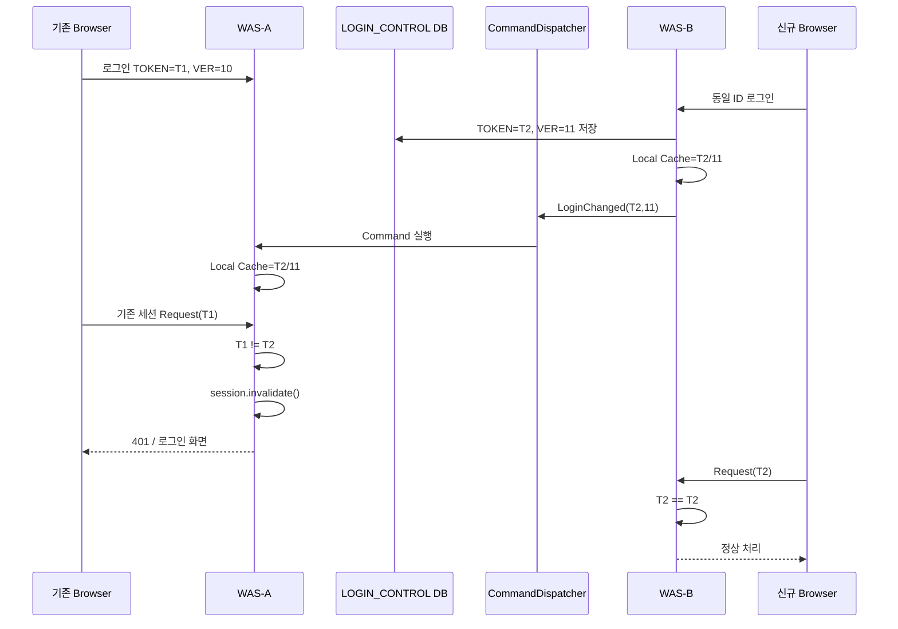

### 1. 재검증 결론

**JBoss EAP 7.2 + JDK 11.0.15 + Spring Framework 5.3 환경에서 `CommandDispatcher`를 이용한 중복 로그인 방지 구현은 가능합니다.**
단, 여기서 사용해야 하는 것은 JGroups 내부의 `org.jgroups.blocks.*`가 아니라 JBoss EAP가 애플리케이션용 Public API로 제공하는 다음 API입니다.

```java
org.wildfly.clustering.dispatcher.Command
org.wildfly.clustering.dispatcher.CommandDispatcher
org.wildfly.clustering.dispatcher.CommandDispatcherFactory
org.wildfly.clustering.group.Group
org.wildfly.clustering.group.Node
```

Red Hat EAP 7.2 Development Guide는 `CommandDispatcherFactory`를 **클러스터 노드에서 명령을 실행하기 위한 공식 Public Clustering API**로 명시하고 있습니다. ([레드햇 문서][1])
또한 EAP 7.2에서 JDK 11이 공식 지원되며, EAP 7.2부터 `CommandDispatcher`의 `executeOnGroup()`/`executeOnMember()`가 권장 API입니다. ([레드햇 문서][2])

| 항목                                | 판정                                                      |
| --------------------------------- | ------------------------------------------------------- |
| JBoss EAP 7.2 `CommandDispatcher` | ✅ 공식 Public API                                         |
| JDK 11                            | ✅ EAP 7.2 지원                                            |
| Spring 5.3에서 사용                   | ✅ 가능                                                    |
| JGroups Cluster 필요                | ✅ 필요                                                    |
| `<distributable/>`                | CommandDispatcher 자체에는 필수 아님, HTTP Session Cluster에는 필요 |
| Round-Robin L4                    | ✅ 가능                                                    |
| IP Hash L4                        | ✅ 가능                                                    |
| 매 Request Cluster RPC             | ❌ 권장하지 않음                                               |
| 중복로그인 제어                          | ✅ 구현 가능                                                 |
| CommandDispatcher만으로 완전한 상태 저장    | ❌ 권장하지 않음                                               |

### 2. 중요한 설계 수정: `CommandDispatcher = 세션 공유 기능`은 아님

`CommandDispatcher`의 기능은 정확하게:

```text
Node A
   │
   │ Command 전송
   ▼
JGroups
   │
   ├── Node B → Command.execute(localContext)
   └── Node C → Command.execute(localContext)
```

입니다.
즉 다음 기능을 자동 제공하지 않습니다.

```text
CommandDispatcher
   ├─ 사용자별 Session 검색      ❌
   ├─ HttpSession 공유           ❌
   ├─ 로그인 상태 저장           ❌
   ├─ 중복로그인 판단            ❌
   └─ Cluster Node 명령 실행      ✅
```

Red Hat도 `CommandDispatcherFactory`를 "cluster node에서 command를 실행하는 dispatcher 생성 기능"으로 설명합니다. ([레드햇 문서][1])
따라서 중복 로그인을 다음처럼 구현하는 것은 권장하지 않습니다.

```text
새 로그인
  ↓
CommandDispatcher
  ↓
다른 WAS에서 HttpSession ID 검색
  ↓
HttpSession.invalidate()
```

이유는 **Servlet 표준 API에는 Session ID로 임의의 `HttpSession`을 조회하는 API가 없기 때문**입니다. Undertow 내부 API를 직접 사용하면 JBoss 내부 구현에 강하게 종속됩니다.

### 3. 실무 권장 구조

가장 안정적인 설계는:

> **DB = 로그인 상태의 최종 기준(Source of Truth)**
> **CommandDispatcher = 변경 이벤트의 즉시 전파**
> **WAS Local Cache = Request마다 빠른 검증**
> 입니다.



이 구조의 가장 큰 장점은 **매 Request마다 JGroups/DB를 호출하지 않는다는 것**입니다.

### 4. Request 처리 성능

정상 Request에서는:

```text
HttpSession
   ↓
LOGIN_TOKEN 취득
   ↓
ConcurrentHashMap.get(userId)
   ↓
String 비교
```

만 수행합니다.
즉:

```java
LOGIN_TOKEN.equals(localLoginState.get(userId).getToken())
```

수준입니다.

| 구간                                                                           | 처리                               |
| ---------------------------------------------------------------------------- | -------------------------------- |
| 로그인 발생                                                                       | DB Update + CommandDispatcher 전송 |
| 일반 Request                                                                   | Local Memory 조회                  |
| 중복 로그인 발생                                                                    | 기존 세션의 다음 Request에서 즉시 차단        |
| WAS Restart                                                                  | Local Cache miss → DB 1회 조회      |
| Cluster 메시지 장애                                                               | TTL 경과 후 DB 재검증                  |
| 따라서 이전에 우려했던 **Request마다 Infinispan/DB/Cluster RPC를 수행하는 구조보다 부하가 훨씬 작습니다.** |                                  |

### 5. JBoss EAP 사전 조건

EAP 7.2에서 JGroups channel이 존재해야 합니다.
기본 HA 구성에서는 보통 `ee` channel을 사용합니다. Red Hat EAP 7.2 Configuration Guide 역시 기본 JGroups channel을 `ee`로 설명합니다. ([레드햇 문서][3])
CLI에서 확인:

```bash
/subsystem=jgroups:read-children-names(child-type=channel)
```

예상:

```text
{
    "outcome" => "success",
    "result" => ["ee"]
}
```

상세 확인:

```bash
/subsystem=jgroups/channel=ee:read-resource(include-runtime=true)
```

그리고 각 WAS의:

```text
jboss.node.name
```

은 반드시 달라야 합니다.
예:

```text
WAS-A : -Djboss.node.name=was-a
WAS-B : -Djboss.node.name=was-b
```

### 6. JNDI Resource

EAP는 JGroups channel별 `CommandDispatcherFactory`를 제공합니다.
`ee` channel이라면:

```text
java:jboss/clustering/dispatcher/ee
```

를 사용합니다.
공식 문서는 일반적으로:

```java
@Resource(lookup = "java:jboss/clustering/dispatcher/channel-name")
private CommandDispatcherFactory factory;
```

형태로 설명합니다. ([레드햇 문서][1])

### 7. Maven 의존성

JBoss에서 제공하는 API를 사용하므로 **WAR에 clustering API JAR를 포함시키지 않고 `provided`**로 두는 것을 권장합니다.

```xml
<dependency>
    <groupId>org.jboss.eap</groupId>
    <artifactId>wildfly-clustering-api</artifactId>
    <version>${jboss.eap.version}</version>
    <scope>provided</scope>
</dependency>
```

여기서 `${jboss.eap.version}`은 실제 운영 EAP patch level과 맞추는 것이 중요합니다.
Red Hat EAP 7 계열에서 `org.wildfly.clustering.api`는 PUBLIC module로 분류됩니다. ([Red Hat Customer Portal][4])
`jboss-deployment-structure.xml`:

```xml
<?xml version="1.0" encoding="UTF-8"?>
<jboss-deployment-structure>
    <deployment>
        <dependencies>
            <module name="org.wildfly.clustering.api"/>
        </dependencies>
    </deployment>
</jboss-deployment-structure>
```

### 8. DB 로그인 제어 테이블

예제는 **신규 로그인 우선(Last Login Wins)** 정책입니다.
MariaDB 기준:

```sql
CREATE TABLE TB_LOGIN_CONTROL (
    USER_ID      VARCHAR(100) NOT NULL,
    LOGIN_TOKEN  VARCHAR(64)  NOT NULL,
    LOGIN_VER    BIGINT       NOT NULL DEFAULT 0,
    UPDT_DT      DATETIME     NOT NULL,
    PRIMARY KEY (USER_ID)
);
```

핵심은 단순 Session ID보다:

```text
USER_ID
LOGIN_TOKEN
LOGIN_VER
```

를 사용하는 것입니다.
예:

```text
USER_ID = user01
TOKEN   = 550e8400-e29b-41d4-a716-446655440000
VER     = 51
```

다음 로그인이 발생하면:

```text
TOKEN = 새로운 UUID
VER   = 52
```

가 됩니다.
`LOGIN_VER`가 중요한 이유는 **두 WAS에서 동시에 로그인했을 때 Cluster Command 도착 순서가 뒤바뀌는 문제를 방지**하기 위해서입니다.

### 9. LoginState

```java
public final class LoginState {
    private final String userId;
    private final String token;
    private final long version;
    private final long loadedAt;
    public LoginState(String userId, String token, long version) {
        this.userId = userId;
        this.token = token;
        this.version = version;
        this.loadedAt = System.currentTimeMillis();
    }
    public String getUserId() {
        return userId;
    }
    public String getToken() {
        return token;
    }
    public long getVersion() {
        return version;
    }
    public long getLoadedAt() {
        return loadedAt;
    }
}
```

### 10. 각 WAS의 Local Context

이 객체는 **각 WAS JVM에 하나씩 존재**합니다.

```java
import java.util.concurrent.ConcurrentHashMap;
import java.util.concurrent.ConcurrentMap;
import org.springframework.stereotype.Component;
@Component
public class LoginClusterContext {
    private final ConcurrentMap<String, LoginState> states =
            new ConcurrentHashMap<>();
    public void update(LoginState newState) {
        states.compute(newState.getUserId(), (userId, oldState) -> {
            if (oldState == null) {
                return newState;
            }
            if (newState.getVersion() > oldState.getVersion()) {
                return newState;
            }
            if (newState.getVersion() == oldState.getVersion()
                    && newState.getToken().equals(oldState.getToken())) {
                // 동일 상태 재수신 → refresh 용도
                return newState;
            }
            // 오래된 Command가 뒤늦게 도착한 경우 무시
            return oldState;
        });
    }
    public LoginState get(String userId) {
        return states.get(userId);
    }
    public void remove(String userId) {
        states.remove(userId);
    }
}
```

여기서 `version` 비교가 매우 중요합니다.
다음 상황을 막습니다.

```text
Node A 로그인 → VER 100
Node B 로그인 → VER 101
Cluster Network 순서 역전
Node C:
    VER 101 수신
        ↓
    VER 100 뒤늦게 수신
```

단순 `put()`이면:

```text
101 → 100
```

으로 잘못 돌아갈 수 있지만:

```java
newVersion > oldVersion
```

만 허용하면 방지됩니다.

### 11. Command 구현

`Command`는 원격 WAS로 전달되므로 전달되는 데이터는 Serializable이어야 합니다.
EAP 7.2 API에서도 `Command`는 `Serializable` 계열 Public API입니다. ([Red Hat Customer Portal][5])

```java
import org.wildfly.clustering.dispatcher.Command;
public class LoginChangedCommand
        implements Command<Boolean, LoginClusterContext> {
    private static final long serialVersionUID = 1L;
    private final String userId;
    private final String token;
    private final long version;
    public LoginChangedCommand(
            String userId,
            String token,
            long version) {
        this.userId = userId;
        this.token = token;
        this.version = version;
    }
    @Override
    public Boolean execute(LoginClusterContext context) {
        context.update(
            new LoginState(userId, token, version)
        );
        return Boolean.TRUE;
    }
}
```

여기서 매우 중요한 구조가:

```java
execute(LoginClusterContext context)
```

입니다.
`LoginClusterContext` Spring Bean 자체가 네트워크로 전달되는 것이 아닙니다.

```text
Node A
Command(userId,token,version)
        │
        │ 직렬화
        ▼
Node B
        │
        ▼
Node B의 LoginClusterContext
```

즉 **각 WAS의 로컬 Spring Bean을 Command 실행 Context로 사용하는 것**입니다.

### 12. Spring 5.3 CommandDispatcher 설정

```java
import javax.naming.InitialContext;
import javax.naming.NamingException;
import org.springframework.context.annotation.Bean;
import org.springframework.context.annotation.Configuration;
import org.wildfly.clustering.dispatcher.CommandDispatcher;
import org.wildfly.clustering.dispatcher.CommandDispatcherFactory;
@Configuration
public class LoginClusterConfig {
    public static final String DISPATCHER_ID =
            "ktr.single-login.control.v1";
    @Bean
    public CommandDispatcherFactory commandDispatcherFactory()
            throws NamingException {
        return (CommandDispatcherFactory)
                new InitialContext().lookup(
                    "java:jboss/clustering/dispatcher/ee"
                );
    }
    @Bean(destroyMethod = "close")
    public CommandDispatcher<LoginClusterContext> loginCommandDispatcher(
            CommandDispatcherFactory factory,
            LoginClusterContext context) {
        return factory.createCommandDispatcher(
                DISPATCHER_ID,
                context
        );
    }
}
```

여기서:

```java
"ktr.single-login.control.v1"
```

은 **모든 WAS에서 반드시 동일해야 합니다.**
`CommandDispatcherFactory.createCommandDispatcher(id, context)`의 동일 `id`를 사용하는 Dispatcher끼리 통신합니다. 공식 API도 dispatcher identifier와 local context를 받아 Dispatcher를 생성하도록 정의합니다. ([Red Hat Customer Portal][6])

### 13. DB에서 Login Version 발급

```java
import java.util.UUID;
import org.springframework.jdbc.core.JdbcTemplate;
import org.springframework.stereotype.Service;
import org.springframework.transaction.annotation.Transactional;
@Service
public class LoginVersionIssuer {
    private final JdbcTemplate jdbcTemplate;
    public LoginVersionIssuer(JdbcTemplate jdbcTemplate) {
        this.jdbcTemplate = jdbcTemplate;
    }
    @Transactional
    public LoginState issue(String userId) {
        String token = UUID.randomUUID().toString();
        jdbcTemplate.update(
            "INSERT INTO TB_LOGIN_CONTROL "
          + "(USER_ID, LOGIN_TOKEN, LOGIN_VER, UPDT_DT) "
          + "VALUES (?, ?, 1, NOW()) "
          + "ON DUPLICATE KEY UPDATE "
          + "LOGIN_TOKEN = VALUES(LOGIN_TOKEN), "
          + "LOGIN_VER = LOGIN_VER + 1, "
          + "UPDT_DT = NOW()",
            userId,
            token
        );
        return jdbcTemplate.queryForObject(
            "SELECT USER_ID, LOGIN_TOKEN, LOGIN_VER "
          + "FROM TB_LOGIN_CONTROL "
          + "WHERE USER_ID = ?",
            (rs, rowNum) -> new LoginState(
                rs.getString("USER_ID"),
                rs.getString("LOGIN_TOKEN"),
                rs.getLong("LOGIN_VER")
            ),
            userId
        );
    }
    public LoginState find(String userId) {
        return jdbcTemplate.queryForObject(
            "SELECT USER_ID, LOGIN_TOKEN, LOGIN_VER "
          + "FROM TB_LOGIN_CONTROL "
          + "WHERE USER_ID = ?",
            (rs, rowNum) -> new LoginState(
                rs.getString("USER_ID"),
                rs.getString("LOGIN_TOKEN"),
                rs.getLong("LOGIN_VER")
            ),
            userId
        );
    }
}
```

`USER_ID` PK에 대한 `INSERT ... ON DUPLICATE KEY UPDATE`이기 때문에 동시에 여러 WAS에서 로그인해도 DB row update가 직렬화됩니다.

### 14. Cluster 전파 Service

```java
import java.util.Map;
import java.util.concurrent.CompletionStage;
import org.slf4j.Logger;
import org.slf4j.LoggerFactory;
import org.springframework.stereotype.Service;
import org.wildfly.clustering.dispatcher.CommandDispatcher;
import org.wildfly.clustering.dispatcher.CommandDispatcherFactory;
import org.wildfly.clustering.group.Node;
@Service
public class LoginClusterPublisher {
    private static final Logger log =
            LoggerFactory.getLogger(LoginClusterPublisher.class);
    private final CommandDispatcherFactory factory;
    private final CommandDispatcher<LoginClusterContext> dispatcher;
    private final LoginClusterContext context;
    public LoginClusterPublisher(
            CommandDispatcherFactory factory,
            CommandDispatcher<LoginClusterContext> dispatcher,
            LoginClusterContext context) {
        this.factory = factory;
        this.dispatcher = dispatcher;
        this.context = context;
    }
    public void publish(LoginState state) {
        // 1. Local WAS 우선 반영
        context.update(state);
        Node localNode = factory.getGroup().getLocalNode();
        LoginChangedCommand command =
                new LoginChangedCommand(
                        state.getUserId(),
                        state.getToken(),
                        state.getVersion()
                );
        try {
            Map<Node, CompletionStage<Boolean>> responses =
                    dispatcher.executeOnGroup(
                            command,
                            localNode
                    );
            responses.forEach((node, stage) ->
                stage.whenComplete((result, throwable) -> {
                    if (throwable != null) {
                        log.warn(
                            "Login state propagation failed. node={}, "
                          + "userId={}, version={}",
                            node,
                            state.getUserId(),
                            state.getVersion(),
                            throwable
                        );
                    } else {
                        log.debug(
                            "Login state propagated. node={}, "
                          + "userId={}, version={}",
                            node,
                            state.getUserId(),
                            state.getVersion()
                        );
                    }
                })
            );
        } catch (Exception e) {
            /*
             * Cluster propagation 실패가 로그인 자체 실패로
             * 이어지게 하지 않는다.
             *
             * DB가 Source of Truth이며,
             * Validator의 DB fallback으로 보완한다.
             */
            log.error(
                "Login cluster command failed. userId={}, version={}",
                state.getUserId(),
                state.getVersion(),
                e
            );
        }
    }
}
```

EAP 7.2는 기존 `executeOnCluster()` 대신 `executeOnGroup()`을 권장하며 CompletableFuture/CompletionStage 기반 비동기 처리를 지원합니다. ([레드햇 문서][7])

### 15. 실제 로그인 성공 처리

중요한 점은 **DB Transaction Commit 이후 Cluster 전파**입니다.
다음처럼 Bean을 분리하면:

```java
LoginVersionIssuer.issue()
```

의 트랜잭션이 종료된 후 `publish()`가 실행됩니다.

```java
import javax.servlet.http.HttpSession;
import org.springframework.stereotype.Service;
@Service
public class DuplicateLoginCoordinator {
    public static final String ATTR_USER_ID =
            "LOGIN_USER_ID";
    public static final String ATTR_LOGIN_TOKEN =
            "LOGIN_TOKEN";
    public static final String ATTR_LOGIN_VERSION =
            "LOGIN_VERSION";
    private final LoginVersionIssuer issuer;
    private final LoginClusterPublisher publisher;
    public DuplicateLoginCoordinator(
            LoginVersionIssuer issuer,
            LoginClusterPublisher publisher) {
        this.issuer = issuer;
        this.publisher = publisher;
    }
    public void loginSucceeded(
            String userId,
            HttpSession session) {
        /*
         * @Transactional Bean 호출.
         * 메소드 반환 시 DB Commit 완료.
         */
        LoginState state = issuer.issue(userId);
        /*
         * String/Long은 Serializable이므로
         * distributable session에도 적합.
         */
        session.setAttribute(
                ATTR_USER_ID,
                userId
        );
        session.setAttribute(
                ATTR_LOGIN_TOKEN,
                state.getToken()
        );
        session.setAttribute(
                ATTR_LOGIN_VERSION,
                state.getVersion()
        );
        /*
         * DB commit 후 cluster propagation
         */
        publisher.publish(state);
    }
}
```

### 16. Request 검증 Service

Cluster 장애까지 고려하려면 Local Cache에 TTL을 두는 것을 권장합니다.
예: `60초`

```java
import org.springframework.stereotype.Service;
@Service
public class LoginStateValidator {
    private static final long CACHE_TTL_MILLIS = 60_000L;
    private final LoginClusterContext context;
    private final LoginVersionIssuer repository;
    public LoginStateValidator(
            LoginClusterContext context,
            LoginVersionIssuer repository) {
        this.context = context;
        this.repository = repository;
    }
    public boolean isValid(
            String userId,
            String sessionToken) {
        LoginState state = context.get(userId);
        if (state == null || isExpired(state)) {
            /*
             * WAS restart 또는 JGroups 메시지 누락 보완
             */
            state = repository.find(userId);
            context.update(state);
        }
        return state != null
                && state.getToken().equals(sessionToken);
    }
    private boolean isExpired(LoginState state) {
        return System.currentTimeMillis()
                - state.getLoadedAt()
                >= CACHE_TTL_MILLIS;
    }
}
```

### 17. Spring `OncePerRequestFilter`

Spring Security가 없어도 `spring-web`의 `OncePerRequestFilter`를 사용할 수 있습니다.

```java
import java.io.IOException;
import javax.servlet.FilterChain;
import javax.servlet.ServletException;
import javax.servlet.http.HttpServletRequest;
import javax.servlet.http.HttpServletResponse;
import javax.servlet.http.HttpSession;
import org.springframework.stereotype.Component;
import org.springframework.web.filter.OncePerRequestFilter;
@Component
public class DuplicateLoginFilter
        extends OncePerRequestFilter {
    private final LoginStateValidator validator;
    public DuplicateLoginFilter(
            LoginStateValidator validator) {
        this.validator = validator;
    }
    @Override
    protected void doFilterInternal(
            HttpServletRequest request,
            HttpServletResponse response,
            FilterChain filterChain)
            throws ServletException, IOException {
        HttpSession session =
                request.getSession(false);
        if (session == null) {
            filterChain.doFilter(request, response);
            return;
        }
        String userId = (String) session.getAttribute(
                DuplicateLoginCoordinator.ATTR_USER_ID);
        String loginToken = (String) session.getAttribute(
                DuplicateLoginCoordinator.ATTR_LOGIN_TOKEN);
        /*
         * 로그인되지 않은 세션
         */
        if (userId == null || loginToken == null) {
            filterChain.doFilter(request, response);
            return;
        }
        if (!validator.isValid(userId, loginToken)) {
            try {
                session.invalidate();
            } catch (IllegalStateException ignored) {
                // 이미 invalidated
            }
            response.sendError(
                    HttpServletResponse.SC_UNAUTHORIZED,
                    "DUPLICATE_LOGIN"
            );
            return;
        }
        filterChain.doFilter(request, response);
    }
}
```

실제 서비스에서는 AJAX/API와 일반 화면을 분리해서:

```text
일반 Page → 로그인 페이지 Redirect
AJAX/API   → HTTP 401 / 특정 JSON Code
```

로 처리하면 됩니다.

### 18. 실제 동작

초기 로그인:

```text
user01
WAS-A
Session-A
TOKEN = AAA
VERSION = 100
```

Local Cache:

```text
WAS-A : user01 → AAA / 100
WAS-B : user01 → AAA / 100
```

다른 PC에서 재로그인:

```text
user01
WAS-B
Session-B
TOKEN = BBB
VERSION = 101
```

CommandDispatcher:

```text
WAS-B
  │
  ├─ Local Cache → BBB/101
  │
  └─ CommandDispatcher
          ↓
       WAS-A
          ↓
       BBB/101
```

기존 브라우저 요청:

```text
Session-A
TOKEN AAA
      ↓
WAS-A Local Cache
TOKEN BBB
      ↓
AAA != BBB
      ↓
session.invalidate()
      ↓
중복 로그인 차단
```

신규 브라우저:

```text
Session-B
TOKEN BBB
      ↓
WAS-B Local Cache
TOKEN BBB
      ↓
정상
```

### 19. 기존 HTTP Session Cluster와 역할 구분

이미 `<distributable/>` 및 HTTP Session Cluster가 구성되어 있더라도 **중복 로그인 제어 기능을 자동으로 제공하는 것은 아닙니다.**
Red Hat 문서상 distributable application의 HTTP Session은 cluster node 간 복제되어 failover가 가능합니다. ([레드햇 문서][8])
역할은 정확히:

| 구성                        | 역할                  |
| ------------------------- | ------------------- |
| `<distributable/>`        | HttpSession Cluster |
| Infinispan Web Cache      | Session 데이터 복제      |
| JGroups                   | Cluster Node 통신     |
| CommandDispatcher         | 로그인 변경 이벤트 전파       |
| DB `TB_LOGIN_CONTROL`     | 최종 로그인 상태           |
| Local `ConcurrentHashMap` | 고속 Request 검증       |
| Filter                    | 구 세션 실제 차단          |
| 즉:                        |                     |

```text
Session Cluster
≠
중복 로그인 제어
```

입니다.

### 20. 왜 직접 `HttpSession`을 Map에 넣지 않았는가

다음 구현은 피하는 것이 좋습니다.

```java
ConcurrentHashMap<String, HttpSession> sessionMap;
```

이유:

| 문제                                                                                                                                   | 설명                                          |
| ------------------------------------------------------------------------------------------------------------------------------------ | ------------------------------------------- |
| 메모리 참조 유지                                                                                                                            | HttpSession GC/Passivation 방해 가능            |
| Cluster 이동                                                                                                                           | 실제 Request 처리 node와 session 객체 위치가 달라질 수 있음 |
| WAS Restart                                                                                                                          | Map 전체 소실                                   |
| DIST Cache                                                                                                                           | 모든 session이 모든 node에 존재하지 않을 수 있음           |
| JBoss 내부 종속                                                                                                                          | 임의 session 검색을 위해 Undertow 내부 API 사용 가능성    |
| Race condition                                                                                                                       | 동시 invalidate 문제                            |
| 특히 EAP 7.2의 DIST session cache는 모든 노드가 모든 세션을 보관하는 구조가 아닙니다. Red Hat 문서도 DIST 모드에서는 `owners` 수만큼 session이 저장된다고 설명합니다. ([레드햇 문서][9]) |                                             |
| 따라서:                                                                                                                                 |                                             |

```text
"모든 WAS에 Command를 보내
 sessionId를 찾아 invalidate"
```

보다:

```text
"현재 유효 LOGIN_TOKEN을 모든 WAS에 알려
 다음 요청을 차단"
```

하는 것이 훨씬 안정적입니다.

### 21. 성능 평가

WAS 2대 기준 한 번의 로그인에:

```text
DB
 INSERT/UPDATE   1
 SELECT          1
JGroups Command  1
```

정도입니다.
일반 요청:

```text
ConcurrentHashMap.get()
+
String.equals()
```

가 대부분입니다.
예를 들어 TTL 60초를 사용하면 정상적으로 Command가 전달되는 동안에는 캐시가 즉시 갱신되고, TTL은 **메시지 유실/Node Restart를 복구하기 위한 안전장치**가 됩니다.

| 설계                                            | Request 부하 |   정합성 |       권장 |
| --------------------------------------------- | ---------: | ----: | -------: |
| 매 Request DB 확인                               |         높음 |    높음 |        △ |
| 매 Request Infinispan Remote 확인                |         중간 |    높음 |        △ |
| 매 Request JGroups RPC                         |         높음 |    높음 |        ❌ |
| CommandDispatcher + Local Cache               |      매우 낮음 |    높음 |        ✅ |
| CommandDispatcher + Local Cache + DB fallback |      매우 낮음 | 매우 높음 | **✅ 권장** |

### 22. 단 하나의 한계: Network Partition

CommandDispatcher만 사용하는 구조:

```text
WAS-A ←X→ WAS-B
```

에서 Cluster 통신이 끊긴 상태로 두 WAS 모두 L4 Request를 받으면:

```text
WAS-A Cache = TOKEN A
WAS-B Cache = TOKEN B
```

라는 Split-Brain 가능성이 있습니다.
그래서 실무에서는 **CommandDispatcher만으로 최종 로그인 상태를 관리하면 안 됩니다.**
제가 DB + version을 추가한 가장 중요한 이유입니다.

```text
CommandDispatcher
      ↓
빠른 Event 전파

DB
      ↓
최종 Source of Truth
```

Network Partition 중 Command를 못 받더라도:

```text
Local Cache TTL 만료
      ↓
DB 조회
      ↓
최신 Version 확인
      ↓
복구
```

됩니다.
보안을 더 엄격하게 하고 싶으면 TTL:

```text
60초 → 10초
```

로 줄일 수 있지만 DB 조회량은 증가합니다.
**0초 수준의 강한 일관성을 요구한다면 CommandDispatcher + Local Cache 방식이 아니라 매 Request에서 중앙화된 상태 저장소를 조회해야 합니다.**

### 23. L4 Round-Robin/IP Hash와의 관계

이 설계는 둘 다 가능합니다.

#### IP Hash

```text
Browser-A → WAS-A
Browser-B → WAS-B
```

CommandDispatcher가:

```text
WAS-A ↔ WAS-B
```

를 연결하므로 문제없습니다.

#### Round-Robin

```text
Request 1 → WAS-A
Request 2 → WAS-B
Request 3 → WAS-A
```

라면 HTTP Session Cluster가 정상 구성되어 있어야 합니다.
각 노드의 Login Local Cache 역시 동일 Token으로 유지되므로:

```text
WAS-A → Token 검증
WAS-B → Token 검증
```

모두 동일한 결과를 냅니다.

### 24. 운영 전 반드시 수행할 테스트

|                       TC | 시험                               | 기대 결과                 |
| -----------------------: | -------------------------------- | --------------------- |
|                        1 | WAS-A 로그인                        | 정상                    |
|                        2 | 동일 ID WAS-B 재로그인                 | 신규 로그인 정상             |
|                        3 | 기존 WAS-A Session Request         | 401 + invalidate      |
|                        4 | 신규 WAS-B Request                 | 정상                    |
|                        5 | L4 Round-Robin                   | 모든 node 동일 판정         |
|                        6 | WAS-A Restart                    | DB fallback으로 상태 복구   |
|                        7 | WAS-B Restart                    | DB fallback으로 상태 복구   |
|                        8 | 동시 로그인 10회                       | 가장 높은 LOGIN_VER만 유효   |
|                        9 | Command 순서 역전                    | 낮은 Version 무시         |
|                       10 | JGroups 일시 단절                    | TTL 후 DB로 복구          |
|                       11 | Session Cluster Failover         | 새 Token session 정상 유지 |
|                       12 | CommandDispatcher close/redeploy | resource leak 없어야 함   |
| 특히 서버 로그에서 다음을 확인해야 합니다. |                                  |                       |

```text
WAS-A Login version=100
WAS-B Command received version=100

WAS-B Login version=101
WAS-A Command received version=101

WAS-A old session
sessionVersion=100
currentVersion=101
DUPLICATE_LOGIN
```

### 25. 최종 권고 구조

현재 조건에서는 아래 구조를 가장 권장합니다.

```text
                  ┌───────────────────────┐
                  │ TB_LOGIN_CONTROL      │
                  │ USER_ID               │
                  │ LOGIN_TOKEN           │
                  │ LOGIN_VER             │
                  └───────────┬───────────┘
                              │
                        Source of Truth
                              │
              ┌───────────────┴───────────────┐
              ▼                               ▼
          WAS-A                           WAS-B
    ┌────────────────┐              ┌────────────────┐
    │ HttpSession    │              │ HttpSession    │
    │ Local Cache    │◀──JGroups──▶│ Local Cache    │
    │ Spring Filter  │ CommandDisp. │ Spring Filter  │
    └────────────────┘              └────────────────┘
              ▲                               ▲
              └──────── HTTP Session ─────────┘
                         Cluster
```

### 최종 판단

**`CommandDispatcher`를 이용한 중복 로그인 방지 구현은 EAP 7.2에서 공식적으로 가능한 접근입니다.** 특히 EAP 7.2가 `CommandDispatcher`를 Application용 Public Clustering API로 명시하고 있으므로 `org.jgroups.blocks.RpcDispatcher` 같은 JGroups 내부 API를 직접 사용하는 것보다 훨씬 적절합니다. ([레드햇 문서][1])
다만 실무 설계에서 핵심은:

```text
CommandDispatcher = 중복 로그인 상태 자체를 저장하는 곳 ❌
CommandDispatcher = 로그인 상태 변경을 WAS 전체에 빠르게 전파 ✅
```

로 사용하는 것입니다.
**권장 최종안은 `DB LOGIN_TOKEN/LOGIN_VER + CommandDispatcher + WAS Local Cache + OncePerRequestFilter`입니다.** 이렇게 하면 이전에 문제였던 **매 Request 원격 Cache/DB 조회 부하를 제거하면서**, Round-Robin/IP Hash 및 WAS Restart/Cluster 메시지 누락까지 대응할 수 있습니다.
