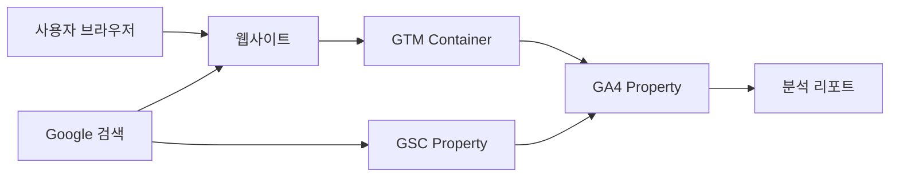
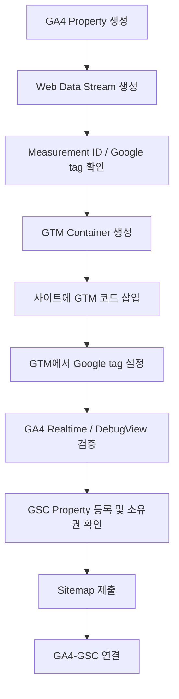
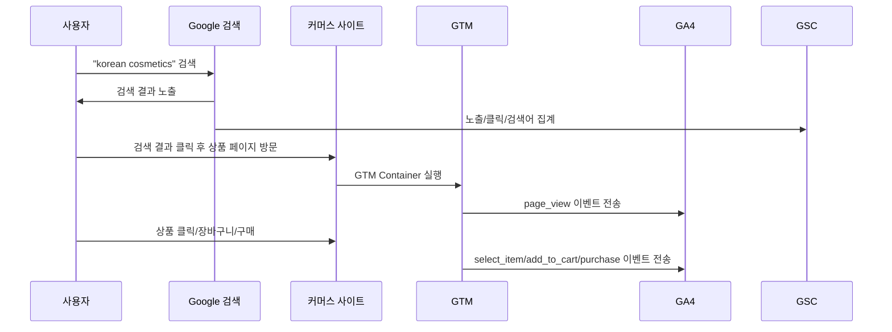
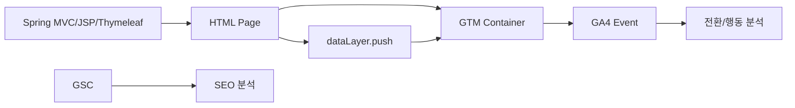
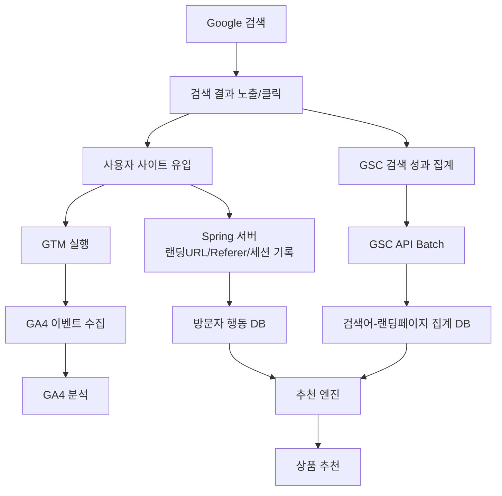
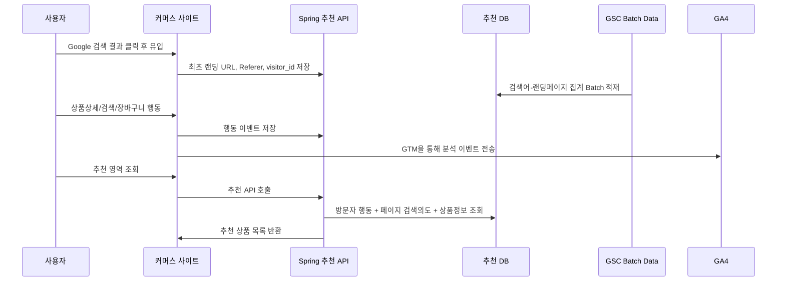

### GA, GTM, GSC 관계

| 도구      | 한 줄 역할          | 쉽게 말하면                                   |
| ------- | --------------- | ---------------------------------------- |
| **GA4** | 사이트 방문자 행동 분석   | “사용자가 우리 사이트 안에서 무엇을 했는지 보는 도구”          |
| **GTM** | 분석/광고 태그 설치·관리  | “개발 배포 없이 GA4 이벤트 태그를 넣고 수정하는 관리 도구”     |
| **GSC** | Google 검색 성과 분석 | “Google 검색에서 우리 사이트가 어떻게 노출·클릭되는지 보는 도구” |

- 실무에서는 **GTM으로 GA4 태그를 설치하고**, **GA4에서 방문·이벤트·전환 행동을 분석하고**, **GSC에서 Google 검색어·노출·클릭·평균 순위를 분석**합니다. GA4와 GSC를 연결하면 GA4 안에서 Search Console 기반의 검색어·랜딩페이지 리포트를 함께 볼 수 있습니다. Google 공식 문서도 Search Console 연동을 통해 검색 순위, 클릭을 유발한 검색어, 랜딩페이지 행동, key event 상호작용을 분석할 수 있다고 설명합니다. ([구글 도움말](https://support.google.com/analytics/answer/10737381?hl=en "Connect Search Console to Google Analytics - Analytics Help"))

---

### 1. GA, GTM, GSC 관계도



|흐름|설명|
|---|---|
|`웹사이트 → GTM`|사이트에 GTM 스크립트를 설치|
|`GTM → GA4`|GTM 안의 Google tag/GA4 Event Tag가 GA4로 이벤트 전송|
|`Google 검색 → GSC`|Google 검색 노출, 클릭, 검색어, 평균 순위 데이터가 GSC에 집계|
|`GSC → GA4`|GSC와 GA4를 연결하면 GA4에서 Search Console 리포트 확인 가능|
|`GA4 → 분석`|방문자 행동, 이벤트, 전환, 유입경로 분석|

---

### 2. GA4란?

GA4는 웹사이트나 앱에서 발생한 사용자 행동을 **이벤트 중심으로 수집·분석하는 도구**입니다. GA4에서는 `page_view`, `session_start` 같은 자동 수집 이벤트가 있고, 스크롤·클릭 등 향상된 측정 이벤트, 직접 구현하는 추천 이벤트·맞춤 이벤트를 사용할 수 있습니다. ([구글 도움말](https://support.google.com/analytics/answer/9322688?hl=en "About events - Analytics Help"))

| 분석 대상        | 예시                          |
| ------------ | --------------------------- |
| 방문           | 사용자 수, 세션 수, 신규 방문자         |
| 페이지 행동       | 페이지 조회, 체류, 랜딩페이지           |
| 이벤트          | 검색, 상품 클릭, 장바구니 추가, 구매 클릭   |
| 전환/Key Event | 회원가입, 문의, 주문완료, 견적요청        |
| 유입 채널        | Google 검색, 광고, 직접 유입, 외부 링크 |
| 전자상거래        | 상품 조회, 장바구니, 결제 시작, 구매      |

- GA4에서 중요한 이벤트는 **Key Event**로 지정할 수 있습니다. Google 공식 문서 기준으로 Key Event는 비즈니스 성공에 중요한 행동을 측정하는 이벤트이며, 어떤 이벤트든 Key Event로 표시할 수 있습니다. ([구글 도움말](https://support.google.com/analytics/answer/9267568?hl=en "About key events - Analytics Help"))

#### 커머스 기준 GA4 주요 이벤트 예

| 업무        | GA4 이벤트 예                         |
| --------- | --------------------------------- |
| 상품 상세 조회  | `view_item`                       |
| 상품 목록 조회  | `view_item_list`                  |
| 상품 클릭     | `select_item`                     |
| 장바구니 추가   | `add_to_cart`                     |
| 결제 시작     | `begin_checkout`                  |
| 구매 완료     | `purchase`                        |
| 사이트 내부 검색 | `search` 또는 `view_search_results` |
| 문의/견적 요청  | `generate_lead` 또는 custom event   |

---

### 3. GTM이란?

GTM은 사이트나 앱에 설치되는 **태그 관리 도구**입니다. Google 공식 문서 기준으로 GTM의 컨테이너는 사이트나 앱에 설치된 태그, 트리거, 변수, 관련 설정의 모음이며, Google Analytics, Google Ads, Floodlight, 서드파티 태그를 직접 코드로 심는 방식을 대체할 수 있습니다. ([구글 도움말](https://support.google.com/tagmanager/answer/6102821?hl=en "Introduction to Tag Manager - Tag Manager Help"))

| GTM 구성요소   | 역할              | 예시                                      |
| ---------- | --------------- | --------------------------------------- |
| Tag        | 데이터를 보내는 코드     | GA4 Event Tag, Google Ads Tag           |
| Trigger    | 태그 실행 조건        | 페이지 로드, 버튼 클릭, 폼 제출                     |
| Variable   | 태그에 전달할 값       | 상품ID, 상품명, 가격, 페이지 URL                  |
| Data Layer | 화면/서버 데이터 전달 영역 | `dataLayer.push({event:'add_to_cart'})` |

- Google 공식 문서도 GTM은 태그, 트리거, 변수, 데이터 레이어를 사용해 태그가 어떻게 설정되고 실행되는지 관리한다고 설명합니다. 태그는 GA 같은 시스템으로 데이터를 보내는 코드이고, 트리거는 클릭·폼 제출·페이지 로드 같은 이벤트를 감지해 태그를 실행합니다. ([구글 도움말](https://support.google.com/tagmanager/answer/6103657?hl=en "Components of Google Tag Manager - Tag Manager Help"))

---

#### GTM의 실무 가치

| 상황        | GTM 없이 처리                  | GTM 사용 시                     |
| --------- | -------------------------- | ---------------------------- |
| GA4 설치    | 소스에 직접 `gtag.js` 삽입        | GTM 컨테이너 1개 삽입 후 관리          |
| 이벤트 추가    | Java/Spring/JSP/JS 수정 후 배포 | GTM에서 태그/트리거 추가 후 Publish    |
| 광고 태그 추가  | 개발 배포 필요                   | GTM에서 태그 추가                  |
| 클릭 이벤트 추적 | 프론트 코드 수정 필요               | Click Trigger로 일부 처리 가능      |
| 운영 검증     | 브라우저 로그 중심                 | GTM Preview/Tag Assistant 사용 |

- GA4를 GTM으로 설정할 때는 GTM 안에 **Google tag**를 구성합니다. Google 공식 문서에 따르면 Google tag는 웹사이트에서 Google Analytics와 지정된 목적지로 데이터가 흐르게 하며, 공통 설정 선언, GA 쿠키 설정, 자동 수집·향상된 측정 이벤트 전송을 수행합니다. ([구글 도움말](https://support.google.com/tagmanager/answer/9442095?hl=en "Set up Google Analytics in Tag Manager - Tag Manager Help"))

---
### 4. GSC란?

GSC는 Google Search Console이며, Google 검색에서 우리 사이트가 어떻게 노출되고 클릭되는지 확인하는 도구입니다. Google 공식 문서 기준으로 Search Console 성과 보고서는 Google 검색 결과에서 사이트가 어떻게 성과를 내는지 보여주며, 검색 트래픽 변화, 어떤 검색어가 사이트를 노출·클릭하게 했는지, 어떤 페이지의 CTR이 높은지 확인할 수 있습니다. ([구글 도움말](https://support.google.com/webmasters/answer/7576553?hl=en "Performance report (Search results): Overview and basic setup - Search Console Help"))

| GSC에서 보는 항목    | 설명                    |
| -------------- | --------------------- |
| 검색어 Query      | 사용자가 Google에서 검색한 질의어 |
| 클릭 Clicks      | 검색 결과에서 우리 사이트를 클릭한 수 |
| 노출 Impressions | 검색 결과에 우리 사이트가 노출된 수  |
| CTR            | 클릭 수 / 노출 수           |
| 평균 게재순위        | 검색 결과에서 평균적으로 노출된 위치  |
| 페이지 Pages      | 검색 유입이 발생한 랜딩페이지      |
| 국가/기기          | 국가, PC/모바일 등          |
| 색인 상태          | Google이 페이지를 수집·색인했는지 |
| 사이트맵           | Google에 URL 구조 제출     |

#### 중요한 한계

GSC의 검색어 데이터는 **개별 사용자 단위 데이터가 아닙니다.** Google 공식 문서에 따르면 개인정보 보호를 위해 Performance report는 모든 데이터를 보여주지 않으며, 매우 적은 횟수의 검색어나 개인·민감 정보를 포함한 검색어는 추적되지 않을 수 있고, 내부 제한으로 모든 데이터 행이 저장되는 것도 아닙니다. ([구글 도움말](https://support.google.com/webmasters/answer/96568?hl=en "About Search Console data - Search Console Help"))  
따라서 GSC의 검색어를 다음처럼 해석하면 안 됩니다.

| 잘못된 해석                            | 이유                                                          |
| --------------------------------- | ----------------------------------------------------------- |
| “이 비회원 사용자가 Google에서 이 키워드를 검색했다” | GSC는 사용자/세션 단위 매핑 데이터를 제공하지 않음                              |
| “GSC 검색어 = 특정 방문자의 실제 검색어”        | 검색어는 집계 데이터이며 일부 검색어는 익명화/누락 가능                             |
| “GA 세션ID와 GSC 검색어를 1:1 연결”        | GA4와 GSC 연결 후에도 Search Console 차원과 Analytics 차원 결합에는 제한이 있음 |

---
### 5. 세 도구의 차이

| 구분        | GA4                   | GTM                            | GSC                     |
| --------- | --------------------- | ------------------------------ | ----------------------- |
| 주 목적      | 사이트 내부 행동 분석          | 태그 설치/관리                       | Google 검색 성과 분석         |
| 데이터 발생 위치 | 웹사이트/앱 방문 후           | 웹사이트/앱에서 태그 실행 시               | Google 검색 결과 화면         |
| 수집 데이터    | 방문, 이벤트, 전환, 유입경로     | 직접 데이터를 분석하지 않음. 태그를 실행함       | 검색어, 노출, 클릭, CTR, 평균 순위 |
| 사용자 행동 추적 | 가능                    | 직접 분석 도구는 아님                   | 개별 사용자 추적 불가            |
| 설정 변경     | GA4 관리 화면             | GTM Workspace에서 태그/트리거 수정      | GSC 속성, 사이트맵, 색인 관리     |
| 개발 배포 필요성 | 직접 설치 시 필요            | 초기 컨테이너 설치 후 이벤트 추가는 배포 최소화 가능 | 별도 사이트 소스 배포는 보통 불필요    |
| 커머스 활용    | 구매 전환, 장바구니, 상품 클릭 분석 | 상품/주문 이벤트 태깅 관리                | SEO 키워드, 검색 랜딩페이지 개선    |

---
### 6. 실무 사용 흐름

#### 6-1. 초기 구축 순서



- GA4와 GSC를 연결할 때는 GA4의 웹 데이터 스트림과 Search Console의 웹사이트 속성을 연결합니다. Google 공식 문서도 Analytics에서 GA 웹 데이터 스트림과 Search Console 웹사이트 속성을 링크하거나, Search Console에서 링크를 생성할 수 있다고 설명합니다. ([구글 도움말](https://support.google.com/analytics/answer/10737381?hl=en "Connect Search Console to Google Analytics - Analytics Help"))

#### 6-2. 커머스 사이트 운영 흐름

| 단계  | 해야 할 일                           | 사용 도구                           |
| --- | -------------------------------- | ------------------------------- |
| 1   | 전체 방문, 채널, 랜딩페이지 확인              | GA4                             |
| 2   | Google 검색 유입 검색어·노출·CTR 확인       | GSC                             |
| 3   | 주요 상품/카테고리 검색 유입 페이지 확인          | GSC + GA4                       |
| 4   | 상품 클릭, 장바구니, 구매 이벤트 수집           | GTM → GA4                       |
| 5   | 구매완료, 견적요청, 회원가입을 Key Event 지정   | GA4                             |
| 6   | 검색어별 랜딩페이지 성과 분석                 | GSC / GA4 Search Console Report |
| 7   | CTR 낮은 페이지의 title/description 개선 | GSC                             |
| 8   | 전환 낮은 페이지의 UX/상품추천 개선            | GA4                             |

---
### 7. GA4와 GSC를 연결하면 무엇이 좋아지는가?

GA4와 GSC를 연결하면 GA4 안에서 **Google Organic Search Queries**와 **Google Organic Search Traffic** 리포트를 볼 수 있습니다. 공식 문서 기준으로 Queries 리포트는 연결된 Search Console 속성의 검색어와 Search Console 지표를 표시하고, Organic Search Traffic 리포트는 랜딩페이지와 Search Console·Analytics 지표를 함께 표시합니다. ([구글 도움말](https://support.google.com/analytics/answer/10737381?hl=en "Connect Search Console to Google Analytics - Analytics Help"))

| 연결 전                  | 연결 후                             |
| --------------------- | -------------------------------- |
| GSC에서 검색어·노출·클릭 확인    | GA4에서도 Search Console 검색어 리포트 확인 |
| GA4에서 사이트 내부 행동 확인    | 검색 유입 랜딩페이지의 행동 일부 연결 분석 가능      |
| 검색 성과와 전환 분석이 분리됨     | 검색 유입 후 랜딩페이지 참여/Key Event 확인 가능 |
| SEO 담당자와 GA 담당자 화면 분리 | GA4에서 통합 리포트 구성 가능               |

- 단, GA4의 Queries 리포트는 Search Console 차원으로 더 깊게 볼 수 있지만 Analytics 차원으로 drill down할 수는 없습니다. 또한 Search Console 데이터는 최대 16개월까지 포함되고, Search Console이 수집한 뒤 Search Console과 Analytics에서 확인되기까지 48시간이 걸립니다. ([구글 도움말](https://support.google.com/analytics/answer/13682862?co=GENIE.Platform%3DDesktop&hl=en-EN "[GA4] Queries report - Computer - Analytics Help"))
---
### 8. 실제 예시: Google 검색 유입 사용자의 흐름



| 질문                             | 확인 위치                           |
| ------------------------------ | ------------------------------- |
| Google에서 어떤 검색어로 우리 사이트가 노출됐나? | GSC                             |
| 어떤 검색어가 클릭을 만들었나?              | GSC                             |
| 검색 유입 후 사용자가 어떤 페이지를 봤나?       | GA4                             |
| 검색 유입 후 장바구니/구매까지 갔나?          | GA4                             |
| 특정 버튼 클릭을 수집하고 싶나?             | GTM에서 이벤트 태그 설정                 |
| 검색어와 랜딩페이지를 함께 보고 싶나?          | GA4-GSC 연결 후 Search Console 리포트 |

---
### 9. Spring/Java 커머스 시스템에서의 설계 관점

#### 9-1. 권장 구조



#### 9-2. 서버에서 내려줘야 하는 데이터

| 화면   | dataLayer 전달 값 예                                 | GA4 이벤트                  |
| ---- | ------------------------------------------------ | ------------------------ |
| 상품상세 | `item_id`, `item_name`, `category`, `price`      | `view_item`              |
| 상품목록 | `item_list_id`, `items[]`                        | `view_item_list`         |
| 상품클릭 | `item_id`, `item_name`, `position`               | `select_item`            |
| 장바구니 | `item_id`, `quantity`, `price`                   | `add_to_cart`            |
| 주문완료 | `transaction_id`, `value`, `currency`, `items[]` | `purchase`               |
| 내부검색 | `search_term`, `result_count`                    | `search` 또는 custom event |

#### 9-3. JSP/HTML 예시

```html
<script>
window.dataLayer = window.dataLayer || [];
window.dataLayer.push({
  event: 'view_item',
  ecommerce: {
    currency: 'USD',
    value: 120.00,
    items: [{
      item_id: 'P10001',
      item_name: 'Korean Cosmetic Set',
      item_category: 'Beauty',
      price: 120.00,
      quantity: 1
    }]
  }
});
</script>
```

| 주의사항       | 설명                                               |
| ---------- | ------------------------------------------------ |
| 개인정보 전송 금지 | 이메일, 전화번호, 이름, 로그인ID 등 직접 식별정보를 GA4/GTM에 보내면 안 됨 |
| 서버 기준값 사용  | 가격, 주문번호, 상품ID는 화면 조작값보다 서버 렌더링 값을 우선 사용         |
| 이벤트명 표준화   | GA4 권장 이벤트명을 우선 사용                               |
| 중복 전송 방지   | JSP include, SPA 라우팅, 중복 GTM 설치 여부 확인            |
| 운영 배포 관리   | GTM Publish 권한은 내부 승인 절차로 통제                     |

---
### 10. 권한 관리 기준

| 작업         | GA4 권한          | GTM 권한      | GSC 권한          |
| ---------- | --------------- | ----------- | --------------- |
| 리포트 조회     | Viewer/Analyst  | 불필요 또는 Read | Restricted/Full |
| GA4 이벤트 확인 | Viewer/Analyst  | Read        | 불필요             |
| GA4 설정 변경  | Editor 이상       | 불필요         | 불필요             |
| GTM 태그 수정  | Viewer 이상 권장    | Edit        | 불필요             |
| GTM 운영 배포  | Viewer 이상 권장    | Publish     | 불필요             |
| GSC 성과 분석  | 불필요 또는 Viewer   | 불필요         | Full 권장         |
| GA4-GSC 연결 | Editor 이상 필요 가능 | 불필요         | Owner 필요 가능     |

- 외부 업체에는 처음부터 `Administrator`, `Publish`, `Owner`를 모두 주기보다, **조회는 Viewer/Read/Full**, **설정 변경은 기간 한정 Editor/Edit**, **운영 배포는 내부 담당자가 Publish**하는 방식이 안전합니다.
---
### 11. 실무에서 자주 생기는 오해

| 오해                            | 정확한 설명                                     |
| ----------------------------- | ------------------------------------------ |
| GTM이 데이터를 분석한다                | GTM은 분석 도구가 아니라 태그 실행/관리 도구                |
| GA4에서 Google 검색어를 항상 볼 수 있다   | GA4 단독으로는 제한적이며, GSC 연결이 필요                |
| GSC 검색어는 특정 방문자의 검색어다         | 아님. GSC 검색어는 집계 데이터이며 개인정보 보호로 일부 누락/익명화됨  |
| GA4 세션과 GSC 검색어를 1:1 연결할 수 있다 | 일반적으로 불가능하다고 보는 것이 안전                      |
| GTM 설치만 하면 모든 클릭이 자동 분석된다     | 기본 수집 외 업무 이벤트는 태그/트리거/변수 설계 필요            |
| GSC 클릭 수와 GA4 세션 수는 같아야 한다    | 수집 기준, 지연, 차단, 쿠키, 브라우저, 집계 기준 차이로 다를 수 있음 |

---
### 12. 운영 점검 체크리스트

| 점검 항목                         | 확인 방법                                             |
| ----------------------------- | ------------------------------------------------- |
| GTM 코드가 모든 페이지에 설치되어 있는가      | 페이지 소스, Tag Assistant, Network 확인                 |
| GA4 Measurement ID가 맞는가       | GA4 `관리 > 데이터 스트림 > Web` 확인                       |
| GTM에서 Google tag가 발화되는가       | GTM Preview 확인                                    |
| GA4에 실시간 이벤트가 들어오는가           | GA4 Realtime / DebugView 확인                       |
| 중복 page_view가 발생하지 않는가        | Realtime, DebugView, Network `collect` 요청 확인      |
| GSC 소유권이 확인되었는가               | GSC Property 확인                                   |
| 사이트맵이 제출되었는가                  | GSC Sitemap 메뉴 확인                                 |
| GA4-GSC 연결이 되었는가              | GA4 Admin Product links / Search Console links 확인 |
| Search Console 리포트가 GA4에 보이는가 | GA4 Reports > Search Console collection 확인        |
| 검색어 데이터 지연을 고려했는가             | GSC 데이터는 수집 후 Analytics 반영까지 지연 가능                |

---
### 최종 정리

| 구분            | 가장 중요한 역할                                                                        |
| ------------- | -------------------------------------------------------------------------------- |
| **GA4**       | 사이트 안에서 사용자가 무엇을 했는지 분석                                                          |
| **GTM**       | 그 행동 데이터를 GA4로 보내는 태그를 관리                                                        |
| **GSC**       | Google 검색에서 어떤 검색어로 노출·클릭됐는지 분석                                                  |
| **GA4 + GTM** | 사이트 내부 행동 이벤트 수집 구조                                                              |
| **GSC + GA4** | 검색 유입 성과와 사이트 행동을 함께 보는 구조                                                       |
| **커머스 실무 핵심** | GSC로 검색 유입 키워드/페이지를 찾고, GA4로 해당 페이지의 상품 클릭·장바구니·구매 전환을 분석하며, GTM으로 이벤트 수집 구조를 관리 |

- 실무적으로는 **GTM은 설치/수집 관리**, **GA4는 행동/전환 분석**, **GSC는 검색 노출/클릭/SEO 분석**으로 역할을 명확히 분리해야 합니다. 특히 GSC 검색어는 특정 비회원이나 특정 세션의 실제 검색어로 사용하면 안 되고, **SEO 개선을 위한 집계 데이터**로만 사용하는 것이 안전합니다.

---
## 유입 Keyword 취득과 상품 추천

### 결론

| 질문                                        | 실무 답변                                                                                           |
| ----------------------------------------- | ----------------------------------------------------------------------------------------------- |
| 1. Google 검색 유입자의 **검색어 키워드**를 취득할 수 있는가? | **특정 사용자/세션 단위로는 불가능**. GSC/GA4 연동으로는 **집계된 검색어**만 확인 가능                                        |
| 2. 상품 추천에 사용할 수 있는가?                      | 가능하지만, **“이 사용자가 Google에서 입력한 정확한 검색어”**가 아니라 **GSC 집계 검색어 + 랜딩페이지 + 사이트 내 행동 데이터**를 조합해 추천해야 함 |
| 핵심 설계 원칙                                  | GSC는 SEO/검색의도 분석용, GA4는 행동 분석용, GTM은 이벤트 수집 설정용, 실제 추천은 Spring 서버/추천 DB에서 처리                    |

---
### 1. Google 검색어 취득의 현실

#### 1-1. 불가능한 것

Google에서 사용자가 `korean cosmetics`를 검색하고 내 사이트에 들어온 경우, 사이트 서버나 GA4/GTM에서 아래처럼 알 수 없습니다.

```text
guest1 사용자가 Google에서 "korean cosmetics"를 검색해서 들어왔다.
```

Google Analytics 공식 도움말에서도 대부분의 Google 검색은 HTTPS로 수행되기 때문에 keyword dimension이 `(not provided)`로 설정된다고 설명합니다. 즉, GA4/GTM만으로 Google Organic 검색어를 사용자 단위로 직접 취득하는 구조는 아닙니다. ([구글 도움말](https://support.google.com/analytics/answer/11242841?hl=en&utm_source=chatgpt.com "Campaigns and traffic sources - Analytics Help"))

#### 1-2. 가능한 것

| 구분                   | 취득 가능 여부 | 설명                                       |
| -------------------- | -------: | ---------------------------------------- |
| Google Organic 유입 여부 |       가능 | `google / organic`, `referrer=google` 수준 |
| 랜딩페이지 URL            |       가능 | 사용자가 처음 들어온 내 사이트 URL                    |
| GSC 검색어              |       가능 | 단, 사용자 단위가 아닌 집계 데이터                     |
| 검색어별 클릭/노출/CTR/평균순위  |       가능 | GSC Performance Report 또는 API            |
| 특정 사용자의 Google 검색어   |      불가능 | GSC/GA4에서 1:1 매핑 제공 안 함                  |
| 사이트 내부 검색어           |       가능 | 내 사이트 검색창에서 입력한 키워드                      |

- GSC Performance Report는 Google 검색 결과에서 사이트가 어떤 검색어로 노출·클릭되었는지 확인하는 용도입니다. Google 공식 문서도 검색 트래픽 변화, 검색어, 클릭, CTR 등을 SEO 개선에 활용할 수 있다고 설명합니다. ([구글 도움말](https://support.google.com/webmasters/answer/7576553?hl=en&utm_source=chatgpt.com "Performance report (Search results): Overview and basic ..."))
---
### 2. GA4-GSC 연동으로 확인 가능한 검색어

GA4와 GSC를 연결하면 GA4 안에서 Search Console 기반의 **Queries report**와 **Google organic search traffic report**를 볼 수 있습니다. Queries report는 연결된 Search Console 속성의 검색어와 Search Console 지표를 보여주며, Analytics 차원으로 세부 drill-down은 제한됩니다. ([구글 도움말](https://support.google.com/analytics/answer/13682862?co=GENIE.Platform%3DDesktop&hl=en-EN&utm_source=chatgpt.com "[GA4] Queries report - Computer - Analytics Help"))

| GA4 내 Search Console 리포트             | 볼 수 있는 것                                                  | 주의점                        |
| ------------------------------------ | --------------------------------------------------------- | -------------------------- |
| Queries report                       | 검색어, Organic Google Search Clicks, Impressions, CTR, 평균순위 | 사용자/세션 단위 아님               |
| Google organic search traffic report | 랜딩페이지 + Search Console/GA4 지표                             | 검색어와 사용자 행동의 완전한 1:1 연결 아님 |
| GA4 일반 Acquisition                   | source/medium, campaign, landing page                     | Organic 검색어는 대부분 직접 제공 안 됨 |

- Search Console 데이터는 개인정보 보호를 위해 일부 검색어가 익명화되거나 누락될 수 있습니다. Google 공식 문서도 일부 query가 사용자 개인정보 보호를 위해 보고서에서 생략된다고 설명합니다. ([구글 도움말](https://support.google.com/webmasters/answer/17011259?hl=en&utm_source=chatgpt.com "Performance report (Search results): Dimensions and data ..."))
---
### 3. 실무적인 검색어 취득 구조

#### 3-1. 전체 구조



---
### 4. 방법 1: GSC에서 검색어-랜딩페이지 집계 취득

#### 4-1. GSC API 사용

Search Console API의 `searchanalytics.query`는 날짜 범위와 dimension을 지정해 검색 트래픽 데이터를 조회합니다. 공식 문서 기준으로 `query`, `page`, `country`, `device`, `date`, `hour` 등의 dimension을 사용할 수 있고, 결과는 클릭 수 기준으로 정렬되며 내부 제한으로 모든 row를 보장하지는 않습니다. ([Google for Developers](https://developers.google.com/webmaster-tools/v1/searchanalytics/query?utm_source=chatgpt.com "Search Analytics: query | Search Console API"))

#### 예시 요청

```bash
curl -X POST "https://www.googleapis.com/webmasters/v3/sites/sc-domain%3Abuykorea.org/searchAnalytics/query" \
-H "Authorization: Bearer {ACCESS_TOKEN}" \
-H "Content-Type: application/json" \
-d '{
  "startDate": "2026-07-01",
  "endDate": "2026-07-07",
  "dimensions": ["query", "page", "country", "device"],
  "rowLimit": 25000,
  "startRow": 0
}'
```

#### 응답 예시

```json
{
  "rows": [
    {
      "keys": [
        "korean cosmetics",
        "https://buykorea.org/product/10001",
        "usa",
        "MOBILE"
      ],
      "clicks": 120,
      "impressions": 2500,
      "ctr": 0.048,
      "position": 4.2
    }
  ]
}
```

---
### 5. 방법 2: 내 사이트 최초 유입 정보 저장

Google 검색어 자체는 못 받지만, **사용자가 어느 페이지로 들어왔는지**는 서버에서 저장할 수 있습니다.

#### 저장 가능한 값

| 항목                | 예시                        | 용도              |
| ----------------- | ------------------------- | --------------- |
| visitor_id        | 랜덤 퍼스트파티 쿠키 ID            | 비회원 행동 연결       |
| session_id        | WAS 세션 ID 또는 자체 세션 ID     | 방문 단위 분석        |
| first_landing_url | `/product/10001`          | 검색 의도 추정        |
| referer           | `https://www.google.com/` | Google 유입 여부 판단 |
| user_agent        | 브라우저/기기 정보                | 분석 보조           |
| first_visit_at    | 최초 방문 시각                  | GSC 날짜 데이터와 매칭  |
| utm_source        | 광고/캠페인 유입 시               | 캠페인 분석          |

#### Spring Interceptor 예시

```java
public class FirstVisitTrackingInterceptor implements HandlerInterceptor {
    private final VisitLogService visitLogService;
    public FirstVisitTrackingInterceptor(VisitLogService visitLogService) {
        this.visitLogService = visitLogService;
    }
    @Override
    public boolean preHandle(HttpServletRequest request,
                             HttpServletResponse response,
                             Object handler) {
        String visitorId = CookieUtils.getOrCreateVisitorId(request, response);
        String referer = request.getHeader("Referer");
        String landingUrl = request.getRequestURI();
        String queryString = request.getQueryString();
        String userAgent = request.getHeader("User-Agent");
        if (!visitLogService.existsFirstVisit(visitorId)) {
            visitLogService.saveFirstVisit(
                visitorId,
                landingUrl,
                queryString,
                referer,
                userAgent
            );
        }
        return true;
    }
}
```

> 단, 비회원 식별용 쿠키를 발급하고 행동 데이터를 저장하는 경우 국가별 개인정보/쿠키 고지·동의 정책 검토가 필요합니다.

---
### 6. 방법 3: GSC 검색어를 랜딩페이지 기준으로 매핑

특정 사용자의 검색어는 알 수 없으므로, 실무에서는 다음처럼 **추정 모델**을 만듭니다.

#### 예시

| GSC 집계 데이터                                             | 의미  |
| ------------------------------------------------------ | --- |
| `korean cosmetics` → `/product/10001` 클릭 120           |     |
| `k beauty set` → `/product/10001` 클릭 80                |     |
| `korean skincare wholesale` → `/category/beauty` 클릭 60 |     |
| 사용자가 Google Organic으로 `/product/10001`에 최초 유입되었다면:     |     |

```text
이 사용자의 정확한 검색어는 알 수 없음.
다만 /product/10001 페이지는 최근 GSC 기준
"korean cosmetics", "k beauty set" 검색 의도가 강한 페이지로 볼 수 있음.
```

#### 검색 의도 점수화 예시

| 요소       |                     점수 반영 |
| -------- | ------------------------: |
| 클릭 수     |               높을수록 가중치 증가 |
| CTR      |             높을수록 검색 의도 적합 |
| 평균순위     |   낮을수록, 즉 상위 노출일수록 가중치 증가 |
| 최근성      |          최근 데이터일수록 가중치 증가 |
| 랜딩페이지 일치 | 사용자 최초 랜딩페이지와 일치 시 가중치 증가 |

#### 간단한 점수식

```text
intent_score =
  clicks * 0.4
+ ctr * 100 * 0.3
+ (1 / position) * 100 * 0.2
+ recency_score * 0.1
```

---
### 7. 검색어 취득 테이블 설계 예시

#### GSC 집계 테이블

```sql
CREATE TABLE gsc_query_page_daily (
    stat_date DATE NOT NULL,
    query VARCHAR(500) NOT NULL,
    page_url VARCHAR(1000) NOT NULL,
    country VARCHAR(20),
    device VARCHAR(20),
    clicks INT NOT NULL DEFAULT 0,
    impressions INT NOT NULL DEFAULT 0,
    ctr DECIMAL(10,6),
    position DECIMAL(10,3),
    created_at DATETIME NOT NULL,
    PRIMARY KEY (stat_date, query, page_url, country, device)
);
```

#### 방문자 최초 유입 테이블

```sql
CREATE TABLE visitor_first_visit (
    visitor_id VARCHAR(100) NOT NULL PRIMARY KEY,
    session_id VARCHAR(100),
    first_landing_url VARCHAR(1000),
    first_query_string VARCHAR(1000),
    referer VARCHAR(1000),
    user_agent VARCHAR(1000),
    source_type VARCHAR(50),
    first_visit_at DATETIME NOT NULL
);
```

#### 검색의도 매핑 테이블

```sql
CREATE TABLE page_search_intent (
    page_url VARCHAR(1000) NOT NULL,
    query VARCHAR(500) NOT NULL,
    intent_keyword VARCHAR(200),
    intent_category VARCHAR(100),
    score DECIMAL(10,4) NOT NULL,
    updated_at DATETIME NOT NULL,
    PRIMARY KEY (page_url, query)
);
```

---
### 8. 상품 추천을 위한 실무 구조

#### 핵심 원칙

| 데이터          | 추천 사용 방식           |
| ------------ | ------------------ |
| GSC 검색어      | 페이지/카테고리의 검색 의도 분석 |
| GA4 이벤트      | 사용자 행동 분석, 리포트 검증  |
| GTM          | 이벤트 수집 설정          |
| Spring 서버 로그 | 실시간 추천용 핵심 데이터     |
| 주문/장바구니 DB   | 가장 신뢰도 높은 추천 데이터   |
| 상품 마스터       | 추천 후보군 생성          |

- **GA4/GSC를 실시간 추천 API의 직접 데이터 소스로 쓰는 것은 비권장**입니다. GA4와 GSC는 분석 도구이고, 추천은 Spring 서버에서 자체 DB 기반으로 처리하는 것이 안정적입니다.
---
### 9. 추천 처리 흐름



---
### 10. 추천에 사용할 데이터 우선순위

| 우선순위 | 데이터                  | 추천 신뢰도 | 예시                        |
| ---: | -------------------- | -----: | ------------------------- |
|    1 | 현재 보고 있는 상품/카테고리     |  매우 높음 | 화장품 상세 → 관련 화장품 추천        |
|    2 | 사이트 내부 검색어           |  매우 높음 | 사용자가 사이트에서 `mask pack` 검색 |
|    3 | 장바구니/구매 이력           |  매우 높음 | 같이 구매한 상품 추천              |
|    4 | 최근 본 상품              |     높음 | 최근 5개 상품 기준 유사 상품 추천      |
|    5 | Google Organic 랜딩페이지 |     중간 | 검색 유입 첫 페이지 기준 추천         |
|    6 | GSC 검색어-페이지 집계       |     중간 | 해당 페이지의 대표 검색의도 반영        |
|    7 | 전체 인기상품              |     낮음 | 데이터 부족 시 fallback         |

---
### 11. GTM/GA4 이벤트 수집 설계

#### 상품 상세 조회

```html
<script>
window.dataLayer = window.dataLayer || [];
window.dataLayer.push({
  event: 'view_item',
  ecommerce: {
    currency: 'USD',
    value: 120.00,
    items: [{
      item_id: 'P10001',
      item_name: 'Korean Cosmetic Set',
      item_category: 'Beauty',
      price: 120.00
    }]
  }
});
</script>
```

#### 사이트 내부 검색

GA4의 향상된 측정은 URL query parameter를 기준으로 `view_search_results` 이벤트를 수집할 수 있습니다. 공식 문서도 Site search가 검색 결과 페이지가 표시될 때 발생하며, 기본적으로 `q`, `s`, `search`, `query`, `keyword` 같은 URL 파라미터를 기준으로 트리거된다고 설명합니다. ([구글 도움말](https://support.google.com/analytics/answer/9216061?hl=en&utm_source=chatgpt.com "Enhanced measurement events - Analytics Help"))

```html
<script>
window.dataLayer = window.dataLayer || [];
window.dataLayer.push({
  event: 'site_search',
  search_term: 'mask pack',
  result_count: 120
});
</script>
```

#### 장바구니 추가

```html
<script>
window.dataLayer = window.dataLayer || [];
window.dataLayer.push({
  event: 'add_to_cart',
  ecommerce: {
    currency: 'USD',
    value: 120.00,
    items: [{
      item_id: 'P10001',
      item_name: 'Korean Cosmetic Set',
      item_category: 'Beauty',
      price: 120.00,
      quantity: 1
    }]
  }
});
</script>
```

---
### 12. Spring 서버 추천 이벤트 저장

GTM/GA4는 분석용으로 보내고, 추천에 필요한 실시간 이벤트는 서버에도 저장하는 것이 좋습니다.

#### 이벤트 테이블

```sql
CREATE TABLE visitor_event (
    event_id BIGINT AUTO_INCREMENT PRIMARY KEY,
    visitor_id VARCHAR(100) NOT NULL,
    session_id VARCHAR(100),
    event_name VARCHAR(100) NOT NULL,
    item_id VARCHAR(100),
    category_id VARCHAR(100),
    search_term VARCHAR(500),
    page_url VARCHAR(1000),
    referrer VARCHAR(1000),
    event_at DATETIME NOT NULL,
    INDEX idx_visitor_event_01 (visitor_id, event_at),
    INDEX idx_visitor_event_02 (event_name, event_at),
    INDEX idx_visitor_event_03 (item_id)
);
```

#### 추천 API 예시

```java
@RestController
@RequestMapping("/api/recommend")
public class RecommendController {
    private final RecommendService recommendService;
    public RecommendController(RecommendService recommendService) {
        this.recommendService = recommendService;
    }
    @GetMapping("/products")
    public List<RecommendProductDto> recommendProducts(
            @CookieValue(value = "visitor_id", required = false) String visitorId,
            @RequestParam(required = false) String currentItemId,
            @RequestParam(required = false) String categoryId,
            HttpServletRequest request) {
        RecommendRequest recommendRequest = RecommendRequest.builder()
                .visitorId(visitorId)
                .currentItemId(currentItemId)
                .categoryId(categoryId)
                .pageUrl(request.getRequestURI())
                .build();
        return recommendService.recommend(recommendRequest);
    }
}
```

---
### 13. 추천 로직 예시

#### 13-1. 추천 후보 생성

| 후보군        | 생성 기준                          |
| ---------- | ------------------------------ |
| 유사 상품      | 현재 상품의 카테고리, 브랜드, 속성 기반        |
| 검색의도 상품    | GSC query-page 매핑 기준           |
| 최근 본 상품 관련 | visitor_event의 최근 view_item 기준 |
| 장바구니 연관 상품 | 같이 담긴 상품 기준                    |
| 인기 상품      | 카테고리별 클릭/구매 상위                 |
| 신상품/프로모션   | 운영 정책 기반                       |

#### 13-2. 추천 점수식 예시

```text
recommend_score =
  current_item_similarity_score * 0.35
+ recent_view_score * 0.20
+ site_search_score * 0.20
+ gsc_landing_intent_score * 0.15
+ popularity_score * 0.10
```

#### 13-3. Java 예시

```java
@Service
public class RecommendService {
    private final VisitorEventRepository visitorEventRepository;
    private final ProductRepository productRepository;
    private final SearchIntentRepository searchIntentRepository;
    public List<RecommendProductDto> recommend(RecommendRequest request) {
        List<VisitorEvent> recentEvents =
                visitorEventRepository.findRecentEvents(request.getVisitorId(), 20);
        List<SearchIntent> pageIntents =
                searchIntentRepository.findByPageUrl(request.getPageUrl());
        List<ProductCandidate> candidates = new ArrayList<>();
        candidates.addAll(productRepository.findSimilarProducts(request.getCurrentItemId()));
        candidates.addAll(productRepository.findPopularProductsByCategory(request.getCategoryId()));
        candidates.addAll(productRepository.findProductsBySearchIntents(pageIntents));
        return candidates.stream()
                .collect(Collectors.toMap(
                        ProductCandidate::getItemId,
                        candidate -> score(candidate, recentEvents, pageIntents),
                        Math::max
                ))
                .entrySet()
                .stream()
                .sorted(Map.Entry.<String, Double>comparingByValue().reversed())
                .limit(10)
                .map(entry -> productRepository.findRecommendDto(entry.getKey()))
                .toList();
    }
    private double score(ProductCandidate candidate,
                         List<VisitorEvent> recentEvents,
                         List<SearchIntent> pageIntents) {
        double score = 0.0;
        score += candidate.getSimilarityScore() * 0.35;
        score += candidate.getPopularityScore() * 0.10;
        score += hasRecentCategory(candidate, recentEvents) ? 20.0 : 0.0;
        score += hasMatchedIntent(candidate, pageIntents) ? 15.0 : 0.0;
        return score;
    }
}
```

---
### 14. 추천 시나리오 예시

#### 상황

```text
사용자가 Google에서 검색 후 /product/P10001 로 유입
Referer = google
GSC 기준 /product/P10001의 주요 검색어:
- korean cosmetics
- k beauty set
- korean skincare wholesale
```

#### 추천 판단

| 판단 요소      | 추천 반영                                     |
| ---------- | ----------------------------------------- |
| 최초 랜딩페이지   | `P10001` 관련 상품 추천                         |
| GSC 검색의도   | K-Beauty, cosmetics, skincare 카테고리 가중치 증가 |
| 사용자 사이트 행동 | 다른 화장품 상품 조회 시 해당 카테고리 강화                 |
| 장바구니 추가    | 같이 구매한 상품, 세트 상품 추천                       |
| 행동 데이터 부족  | 카테고리 인기상품 fallback                        |

#### 추천 결과 예시

| 추천 영역              | 추천 기준            |
| ------------------ | ---------------- |
| 함께 많이 본 상품         | 현재 상품 기반         |
| Google 검색 유입 관심 상품 | GSC 검색의도 기반      |
| 최근 본 상품과 유사한 상품    | visitor_event 기반 |
| 인기 K-Beauty 상품     | 카테고리 인기 기반       |

---
### 15. 하면 안 되는 설계

| 잘못된 설계                             | 문제                          |
| ---------------------------------- | --------------------------- |
| GSC 검색어를 특정 비회원의 실제 검색어로 저장        | 기술적으로 부정확하고 개인정보 관점에서도 위험   |
| GA4 리포트를 실시간 추천 API처럼 사용           | 지연, 샘플링/제한, API 쿼터, 실시간성 문제 |
| GTM만으로 추천 로직 구현                    | GTM은 태그 관리 도구이지 추천 엔진이 아님   |
| Google Organic 검색어를 GA4 세션과 1:1 매핑 | GA4-GSC 연동 구조상 불가능에 가까움     |
| 사용자 식별 쿠키를 고지 없이 장기간 사용            | 개인정보/쿠키 규제 리스크              |

---
### 16. 가장 현실적인 구축안

|  단계 | 구축 내용                                        | 사용 도구           |
| --: | -------------------------------------------- | --------------- |
|   1 | GA4 Property, GTM Container, GSC Property 구성 | GA4/GTM/GSC     |
|   2 | GTM으로 GA4 기본 태그 설치                           | GTM → GA4       |
|   3 | 상품조회, 상품클릭, 장바구니, 구매, 내부검색 이벤트 설계            | GTM + dataLayer |
|   4 | Spring 서버에서 visitor_id, 최초 랜딩URL, referer 저장 | Spring          |
|   5 | GSC API로 query-page 데이터를 일 단위 수집             | Batch           |
|   6 | GSC query를 카테고리/상품 intent로 매핑                | 추천 DB           |
|   7 | 사용자 행동 이벤트를 서버 DB에 저장                        | Spring API      |
|   8 | 추천 API에서 행동 + 랜딩페이지 + 검색의도 + 인기상품 조합         | Spring 추천 서비스   |
|   9 | GA4에서 추천 영역 클릭/구매 성과 검증                      | GA4             |

---
### 최종 정리

| 항목               | 정리                                             |
| ---------------- | ---------------------------------------------- |
| Google 검색어 직접 취득 | 특정 사용자 단위로는 불가능                                |
| GSC 검색어 활용       | 검색어-랜딩페이지 집계 데이터로 활용                           |
| GA4 활용           | 유입 채널, 랜딩페이지, 이벤트, 전환 분석                       |
| GTM 활용           | 상품조회/검색/장바구니/구매 이벤트 수집 설정                      |
| 추천 핵심 데이터        | 사이트 내부 행동, 현재 상품, 랜딩페이지, GSC 검색의도              |
| 추천 구현 위치         | GA/GTM/GSC가 아니라 Spring 서버와 추천 DB               |
| 실무 판단            | “정확한 검색어 추천”이 아니라 “검색의도 기반 추천”으로 설계해야 안전하고 현실적 |

- 따라서 커머스 시스템에서는 **Google 검색어를 사용자 단위로 취득하려는 설계는 폐기**하고, **GSC 집계 검색어로 랜딩페이지의 검색의도를 만들고, GA4/GTM으로 사이트 내부 행동을 수집하며, Spring 서버에서 추천을 수행하는 구조**가 가장 현실적입니다.