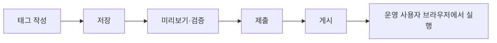
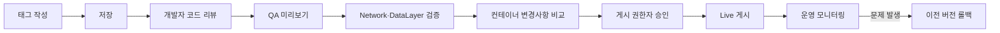

### 전체 흐름 요약

GTM의 변경 절차는 다음과 같이 이해하면 쉽습니다.



| 단계                                                                                                                                                                               | 쉽게 표현하면             |    운영 사이트 반영 여부 |
| -------------------------------------------------------------------------------------------------------------------------------------------------------------------------------- | ------------------- | --------------: |
| 태그 작성                                                                                                                                                                            | 실행할 기능과 조건을 만든다     |          반영 안 됨 |
| 저장                                                                                                                                                                               | 현재 작업공간에 초안을 보관한다   |          반영 안 됨 |
| 미리보기·검증                                                                                                                                                                          | 내 브라우저에서만 운영처럼 시험한다 | 일반 사용자에게 반영 안 됨 |
| 제출                                                                                                                                                                               | 게시할 변경 내용을 최종 검토한다  |       아직 반영 안 됨 |
| 게시                                                                                                                                                                               | 컨테이너 버전을 운영에 적용한다   |             반영됨 |
| 가장 중요한 점은 **태그 하나를 개별적으로 게시하는 것이 아니라, 태그·트리거·변수를 포함한 컨테이너 버전 전체를 게시한다는 것**입니다. 작업공간에 보이는 태그와 현재 운영 중인 태그가 서로 다를 수 있습니다. GTM은 게시할 때 컨테이너 설정 전체의 스냅샷인 버전을 생성합니다. ([Google 도움말][1]) |                     |                 |

### 1. 태그 작성

#### 의미

GTM에서 실행하려는 기능을 만드는 단계입니다.
예를 들어 상품상세 페이지에서 추천 로그를 전송하려면 다음 세 가지를 설정합니다.

| 설정  | 내용                        |
| --- | ------------------------- |
| 태그  | 실제로 실행할 기능 또는 스크립트        |
| 트리거 | 언제 실행할지 결정하는 조건           |
| 변수  | 상품번호, 상품명, 가격처럼 태그가 사용할 값 |
| 예시: |                           |

```text
태그 이름
PD - 상품상세 추천 로그
태그 유형
Custom HTML
스크립트
상품번호를 분석 서버로 전송
트리거
product_detail_ready 이벤트가 발생한 경우
```

Custom HTML 태그를 사용하는 경우 다음과 같이 직접 JavaScript를 작성할 수도 있습니다.

```html
<script>
(function () {
    console.log('상품상세 추천 로그 실행');
})();
</script>
```

#### 목적

* 어떤 코드를 실행할지 정의
* 어떤 페이지와 이벤트에서 실행할지 제한
* 태그에 전달할 데이터 정의

#### 주의점

태그 작성 화면에서 코드를 입력했다고 바로 상품상세 페이지에 적용되는 것은 아닙니다.

```text
태그 작성 상태 = 아직 작업 중인 초안
```

특히 `All Pages` 트리거를 잘못 연결하면 상품상세뿐 아니라 로그인, 장바구니, 주문, 결제 페이지에서도 실행될 수 있으므로 트리거 조건을 명확히 제한해야 합니다.

### 2. 저장

#### 의미

`저장`은 현재 작성한 태그를 **GTM 작업공간(Workspace)에 보관하는 것**입니다.

```text
저장
→ GTM 작업공간에 기록
→ 운영 사이트에는 아직 미반영
```

예를 들어 `PD - 상품상세 추천 로그`를 작성하고 저장하면 다음 상태가 됩니다.

```text
작업공간
 ├─ 신규 태그: PD - 상품상세 추천 로그
 ├─ 신규 트리거: CE - product_detail_ready
 └─ 변경사항: 게시되지 않음
```

작업공간은 실제 운영 컨테이너와 분리된 편집 공간입니다. 일반 GTM 계정은 기본 작업공간 외에 추가 작업공간을 사용할 수 있으며, 관련 변경사항을 한 묶음으로 관리할 수 있습니다. ([Google 도움말][2])

#### 목적

* 작성 중인 내용을 잃지 않도록 저장
* 다른 태그, 트리거, 변수와 연결
* 미리보기 전에 작업 내용을 확정
* 게시 전 변경사항 목록에 포함

#### 저장만 한 상태에서 발생하지 않는 것

| 항목                    | 발생 여부 |
| --------------------- | ----: |
| 일반 사용자 브라우저에서 태그 실행   |   아니요 |
| 운영 GTM 컨테이너 변경        |   아니요 |
| 새 컨테이너 버전 생성          |   아니요 |
| Tag Assistant 미리보기 가능 |     예 |

### 3. 미리보기와 검증

#### 의미

`미리보기`는 현재 작업공간의 게시되지 않은 초안을 **내 브라우저에서만 임시로 운영에 적용한 것처럼 실행**하는 기능입니다.
GTM에서 `미리보기`를 누르면 Tag Assistant가 열리고, 입력한 사이트와 디버그 세션을 연결합니다. 이 상태에서는 게시되지 않은 현재 작업공간을 기준으로 어떤 태그가 실행됐고 어떤 태그가 실행되지 않았는지 확인할 수 있습니다. 일반 사이트 방문자에게는 이 디버그 화면과 초안이 적용되지 않습니다. ([Google 도움말][3])

#### 실행 절차

```text
1. GTM 컨테이너 접속
2. 우측 상단 미리보기 클릭
3. 상품상세 URL 입력
4. Connect 클릭
5. 새 창에서 상품상세 페이지 열림
6. Tag Assistant에서 실행 결과 확인
```

예:

```text
https://commerce.example.com/goods/detail.do?goodsSn=10001
```

#### Tag Assistant에서 확인할 항목

| 확인 항목                          | 의미                                          |
| ------------------------------ | ------------------------------------------- |
| Tags Fired                     | 실제로 실행된 태그                                  |
| Tags Not Fired                 | 조건이 맞지 않아 실행되지 않은 태그                        |
| Variables                      | 해당 이벤트 시점의 변수 값                             |
| Data Layer                     | 페이지가 GTM에 전달한 데이터                           |
| Consent                        | 사용자 동의 상태                                   |
| 이벤트 목록                         | Container Loaded, DOM Ready, Custom Event 등 |
| 상품상세 이벤트를 선택했을 때 다음처럼 보여야 합니다. |                                             |

```text
Event: product_detail_ready
Tags Fired:
  - PD - 상품상세 추천 로그
Variables:
  goodsSn = 10001
  pageType = productDetail
```

#### 검증해야 할 핵심

| 검증 내용               | 정상 기준                   |
| ------------------- | ----------------------- |
| 상품상세에서 실행되는가?       | Tags Fired에 표시          |
| 다른 페이지에서 실행되지 않는가?  | Tags Not Fired 또는 태그 없음 |
| 상품번호가 정상인가?         | `goodsSn` 값이 실제 상품과 일치  |
| 중복 실행되지 않는가?        | 이벤트 1회당 태그 1회 실행        |
| 외부 서버 호출이 성공하는가?    | Network 응답이 정상          |
| JavaScript 오류가 없는가? | Console 오류 없음           |

#### 미리보기의 중요한 위험

미리보기는 단순히 화면만 보여주는 것이 아니라 실제 JavaScript를 실행합니다. 따라서 태그 안에 `fetch()`, `XMLHttpRequest`, `sendBeacon()` 또는 외부 스크립트 로딩 코드가 있으면 실제 외부 서버 호출이나 데이터 적재가 발생할 수 있습니다.
따라서 검증 시에는 다음 중 하나를 적용하는 것이 안전합니다.

```text
개발·QA 사이트에서 테스트
또는
테스트용 GA4 속성 및 분석 서버 사용
또는
GTM Preview 변수를 이용해 운영 데이터 저장 차단
```

### 4. 제출

#### 의미

GTM의 `제출(Submit)`은 지금까지 작업한 변경사항을 대상으로 **버전 생성 또는 게시 절차를 시작하는 버튼**입니다.
`제출` 버튼을 클릭하면 일반적으로 다음 선택지가 표시됩니다.

| 선택지                                                                                           | 의미                    |
| --------------------------------------------------------------------------------------------- | --------------------- |
| Publish and Create Version                                                                    | 버전을 만들고 바로 게시         |
| Create Version                                                                                | 버전만 생성하고 운영에는 미반영     |
| Request Approval                                                                              | 승인을 요청하며 GTM 360에서 제공 |
| GTM 공식 절차에서도 `Submit`을 누른 뒤 작업공간 변경사항을 검토하고, 버전 이름과 설명을 입력한 다음 게시하도록 안내합니다. ([Google 도움말][1]) |                       |

#### 제출 화면에서 확인할 내용

```text
Workspace Changes
 ├─ 신규 태그 1개
 ├─ 수정된 트리거 1개
 ├─ 신규 변수 2개
 └─ 삭제된 태그 0개
```

다음 항목을 반드시 검토해야 합니다.

| 검토 항목  | 확인 내용                  |
| ------ | ---------------------- |
| 추가된 태그 | 의도한 태그만 추가됐는가          |
| 수정된 태그 | 기존 운영 태그가 변경되지 않았는가    |
| 삭제된 항목 | 실수로 삭제된 태그가 없는가        |
| 트리거 변경 | `All Pages`로 확대되지 않았는가 |
| 외부 URL | 승인된 도메인만 호출하는가         |
| 변수     | 개인정보나 인증정보가 포함되지 않는가   |

#### 버전 이름 작성 예시

```text
버전 이름
2026-07-30 상품상세 추천 로그 추가
설명
- product_detail_ready 이벤트 신규 처리
- 상품번호, 상품명 전달
- 상품상세 페이지만 실행
- 검증 URL: /goods/detail.do
- 작업자: 홍길동
- 검토자: 김철수
```

버전 이름과 설명을 명확하게 작성하면 장애 발생 시 어떤 버전에서 어떤 변경이 있었는지 빠르게 확인할 수 있습니다. Google도 일관되고 구체적인 버전 이름과 설명을 권장합니다. ([Google 도움말][2])

### 5. 게시

#### 의미

`게시(Publish)`는 선택한 컨테이너 버전을 실제 환경에 적용하는 단계입니다.

```text
게시 전
운영 사용자 → 기존 컨테이너 버전 사용
게시 후
운영 사용자 → 새 컨테이너 버전 사용
```

게시된 이후 사용자가 상품상세 페이지를 열면 브라우저가 다음 컨테이너를 가져옵니다.

```text
gtm.js?id=GTM-XXXXXX
```

이 컨테이너 안에는 새로 게시한 태그, 트리거, 변수 설정이 포함되어 있으므로 조건이 맞으면 태그가 실행됩니다.
GTM의 기본 `Live` 환경은 현재 게시된 컨테이너 버전을 가리키며, 개발·QA 등의 사용자 정의 환경에는 서로 다른 버전을 게시할 수 있습니다. 사용자 정의 환경에 게시해도 Live 버전에는 자동으로 반영되지 않습니다. ([Google 도움말][4])

#### 게시 시 발생하는 일

| 항목               | 결과 |
| ---------------- | -- |
| 컨테이너 버전 생성       | 예  |
| 운영 환경 변경         | 예  |
| 일반 사용자 브라우저에서 실행 | 예  |
| 버전 이력 기록         | 예  |
| 게시자와 게시 시각 기록    | 예  |

#### 장애가 발생한 경우

이전 정상 버전을 다시 게시하여 롤백할 수 있습니다.

```text
Versions
→ 이전 정상 버전 선택
→ Publish To...
→ Live 선택
→ Publish
```

GTM 버전은 특정 시점의 컨테이너 설정 스냅샷이므로 실수로 잘못된 버전을 게시했을 때 이전 버전을 복구하는 데 사용할 수 있습니다. ([Google 도움말][1])

### 현재 게시된 태그 확인 방법

### 방법 1. Versions에서 현재 Live 버전 확인

가장 정확한 방법입니다.

```text
1. GTM 컨테이너 접속
2. 상단 Versions 선택
3. Environments 또는 Published 항목 확인
4. Live에 연결된 버전 선택
5. 해당 버전의 Tags 목록 확인
```

기본 `Live` 환경은 항상 현재 운영에 게시된 컨테이너 버전을 가리킵니다. Versions 화면에서는 게시일과 게시 환경을 확인할 수 있습니다. ([Google 도움말][1])
예:

```text
Version 18
환경: Live
게시일: 2026-07-30
게시자: admin@example.com
```

`Version 18`을 클릭한 후 태그 목록에서 다음 태그가 있는지 확인합니다.

```text
PD - 상품상세 추천 로그
```

여기에 태그가 존재해야 현재 운영 버전에 포함된 것입니다.

#### 주의

다음 메뉴만 보고 판단하면 안 됩니다.

```text
Workspace → Tags
```

이 화면에는 게시되지 않은 초안도 함께 보이므로 태그가 목록에 있다고 해서 현재 운영 중이라는 의미는 아닙니다.

### 방법 2. 게시된 버전을 Tag Assistant로 검증

```text
1. Versions에서 Live 버전 선택
2. 해당 버전의 Preview 실행
3. 상품상세 페이지 접속
4. product_detail_ready 이벤트 선택
5. Tags Fired 확인
```

이 방법은 다음 두 가지를 동시에 확인할 수 있습니다.

```text
현재 운영 버전에 태그가 포함됐는가
+
실제 상품상세에서 해당 태그가 실행되는가
```

GTM은 특정 과거 버전도 Versions 화면에서 선택하여 미리보기할 수 있습니다. ([Google 도움말][3])

### 방법 3. 브라우저 개발자 도구로 실행 결과 확인

Chrome 개발자 도구의 `Network` 탭에서 확인합니다.

```text
1. F12
2. Network 선택
3. 상품상세 페이지 새로고침
4. gtm.js 검색
5. 분석 서버 URL 또는 태그 외부 URL 검색
```

예:

```text
gtm.js?id=GTM-ABCDEF
product-tracker.js
/tracking/product-view
```

| 확인 결과                                                                                                        | 의미              |
| ------------------------------------------------------------------------------------------------------------ | --------------- |
| `gtm.js` 있음                                                                                                  | GTM 컨테이너 로딩됨    |
| 태그 외부 JS 있음                                                                                                  | 해당 외부 스크립트가 요청됨 |
| 로그 API 요청 있음                                                                                                 | 태그 스크립트가 서버 호출함 |
| 단, `gtm.js`가 로딩됐다고 해서 특정 태그가 실행됐다는 의미는 아닙니다. 태그 실행 여부는 Tag Assistant의 `Tags Fired`와 Network 요청을 함께 확인해야 합니다. |                 |

### 악성 의도 스크립트의 위험

GTM의 Custom HTML 태그는 현재 페이지의 브라우저에서 JavaScript를 실행할 수 있으므로 악성 코드가 들어가면 다음과 같은 문제가 발생할 수 있습니다.

| 악성 행위                                                           | 예시                           |
| --------------------------------------------------------------- | ---------------------------- |
| 쿠키 탈취                                                           | `document.cookie`를 외부 서버로 전송 |
| 입력정보 수집                                                         | 로그인·주문 폼 입력값 감시              |
| 데이터 유출                                                          | `fetch()`로 외부 서버 전송          |
| 외부 악성 JS 로딩                                                     | 신뢰하지 않는 도메인의 스크립트 삽입         |
| 페이지 변조                                                          | 상품가격, 버튼, 링크 변경              |
| 강제 이동                                                           | 피싱 사이트로 리다이렉트                |
| 사용자 추적                                                          | 동의 없이 식별정보 수집                |
| 따라서 GTM 계정의 게시 권한은 사실상 **사이트 JavaScript 배포 권한**과 유사하게 취급해야 합니다. |                              |

### GTM 자체 악성코드 탐지 기능

Google은 GTM 컨테이너를 자동으로 악성코드 검사합니다. 악성코드가 탐지되면 컨테이너 또는 태그에 경고가 표시되고, 알려진 악성 사이트를 가리키는 태그는 실행되지 않습니다. 운영 버전에서 탐지되면 컨테이너 소유자에게 알림이 전송되고 버전 이력에도 표시됩니다. 문제 태그를 비활성화하고 다시 게시하면 재검사됩니다. ([Google 도움말][5])
하지만 이 기능만으로는 충분하지 않습니다.

```text
Google 자동 검사
= 알려진 악성코드·악성 URL 탐지 보조 수단
≠ 사내 업무 목적에 맞는 코드인지 검토
≠ 개인정보 유출 의도를 완벽히 판단
≠ 새로 생성된 악성 서버를 항상 즉시 탐지
```

즉, 정상 도메인처럼 보이는 외부 서버로 고객정보를 전송하는 코드나 내부 정책을 위반하는 코드는 자동 악성코드 탐지에서 놓칠 가능성이 있습니다. 이는 자동 탐지를 보조 수단으로 보고 별도의 권한·코드 검토·브라우저 보안 정책을 적용해야 한다는 의미입니다.

### 악성 스크립트 필터링 권장 구조

### 1단계. 게시 권한 최소화

| 역할            | 권한         |
| ------------- | ---------- |
| 마케팅 담당자       | 조회 또는 편집   |
| 개발 담당자        | 편집 및 기술 검토 |
| 보안·운영 담당자     | 게시         |
| 외부 대행사        | 필요한 범위만 편집 |
| 핵심은 다음과 같습니다. |            |

```text
태그 작성자 ≠ 최종 게시자
```

일반 GTM에서는 게시 권한을 소수에게만 부여하고 수동 검토 절차를 운영해야 합니다. GTM 360에서는 변경 승인 요청과 Approve/Publish 권한을 이용한 승인 절차를 제공하며, Google도 Publish 권한을 소수의 숙련된 사용자에게 제한하는 방식을 권장합니다. ([Google 도움말][1])

### 2단계. Custom HTML 사용 최소화

우선순위는 다음과 같이 권장합니다.

```text
1순위: GTM 기본 제공 태그
2순위: 검증된 공식 템플릿
3순위: 사내 Custom Template
4순위: Custom HTML
```

Google도 악성코드 위험을 줄이기 위해 GTM 기본 태그 템플릿 사용을 권장합니다. Custom Template은 Sandboxed JavaScript와 권한 모델을 사용하여 읽을 수 있는 데이터, 호출할 수 있는 URL, 주입할 수 있는 스크립트 범위를 제한할 수 있습니다. ([Google 도움말][5])
예를 들어 Custom Template에는 다음과 같은 권한을 개별 설정할 수 있습니다.

| 권한                                                                                                 | 제어 내용                |
| -------------------------------------------------------------------------------------------------- | -------------------- |
| `read_data_layer`                                                                                  | 읽을 수 있는 dataLayer 항목 |
| `access_globals`                                                                                   | 접근할 수 있는 전역 변수       |
| `inject_script`                                                                                    | 스크립트를 로딩할 수 있는 URL   |
| `inject_hidden_iframe`                                                                             | iframe을 생성할 수 있는 URL |
| 쿠키·스토리지 권한                                                                                         | 읽기·쓰기 가능한 키          |
| 특히 `inject_script`는 허용된 URL 패턴에 대해서만 외부 JavaScript를 로딩하도록 제한할 수 있습니다. ([Google for Developers][6]) |                      |

### 3단계. Custom HTML 자체 차단

커머스 사이트의 로그인, 회원정보, 주문, 결제 페이지에서는 Custom HTML과 외부 스크립트를 차단하는 방식을 고려할 수 있습니다.
GTM 컨테이너 코드보다 먼저 다음 값을 설정합니다.

```html
<script>
window.dataLayer = window.dataLayer || [];
window.dataLayer.push({
    'gtm.blocklist': [
        'customScripts',
        'customPixels',
        'nonGoogleScripts',
        'nonGooglePixels',
        'nonGoogleIframes'
    ]
});
</script>
```

이 설정은 다음 기능을 차단합니다.

| 차단 클래스                                                                                                                                                                                                                    | 효과                                  |
| ------------------------------------------------------------------------------------------------------------------------------------------------------------------------------------------------------------------------- | ----------------------------------- |
| `customScripts`                                                                                                                                                                                                           | Custom HTML·Custom JavaScript 계열 차단 |
| `customPixels`                                                                                                                                                                                                            | 사용자 지정 이미지 픽셀 차단                    |
| `nonGoogleScripts`                                                                                                                                                                                                        | 비Google 외부 스크립트 차단                  |
| `nonGooglePixels`                                                                                                                                                                                                         | 비Google 도메인 픽셀 전송 차단                |
| `nonGoogleIframes`                                                                                                                                                                                                        | 비Google iframe 삽입 차단                |
| `gtm.allowlist`와 `gtm.blocklist`는 컨테이너 설정보다 우선하며, 차단된 유형은 GTM에 태그가 설정되어 있어도 실행되지 않습니다. Google은 현재 더 강한 보안 방식으로 Custom Template과 Template Policy 사용을 권장하지만, 기존 웹 컨테이너의 추가 방어 수단으로 사용할 수 있습니다. ([Google for Developers][7]) |                                     |
| 단, 이 설정은 정상적인 제3자 분석·광고 태그도 차단할 수 있으므로 페이지별로 정책을 분리해야 합니다.                                                                                                                                                                |                                     |

```text
상품상세
→ 승인된 분석·추천 태그 허용
주문·결제
→ Custom HTML 및 비Google 외부 태그 차단
회원정보
→ 필요한 최소 태그만 허용
```

### 4단계. CSP 적용

Content Security Policy를 사용하면 브라우저가 로딩하거나 호출할 수 있는 외부 도메인을 제한할 수 있습니다.
개념적인 정책 예시는 다음과 같습니다.

```http
Content-Security-Policy:
  script-src-elem 'self' 'nonce-{RANDOM_NONCE}'
    https://www.googletagmanager.com;
  connect-src 'self'
    https://www.google-analytics.com
    https://region1.google-analytics.com;
  img-src 'self' data:
    https://www.googletagmanager.com
    https://*.google-analytics.com;
  frame-src 'none';
```

적용 효과:

```text
승인되지 않은 외부 JavaScript 로딩 차단
승인되지 않은 외부 서버 fetch/XHR 전송 차단
승인되지 않은 iframe 삽입 차단
인라인 스크립트 임의 실행 제한
```

Google은 GTM 사용 시 CSP nonce 방식을 권장하며, `'unsafe-inline'` 사용은 보안상 권장하지 않습니다. Custom JavaScript 변수를 위해 필요한 `'unsafe-eval'` 역시 꼭 필요한 경우가 아니면 사용하지 않도록 안내합니다. ([Google for Developers][8])
다만 CSP도 완전한 해결책은 아닙니다. 승인된 도메인으로 데이터를 빼돌리는 코드까지 업무 목적 관점에서 판별하지는 못하므로 코드 검토와 함께 사용해야 합니다.

### 5단계. 게시 전 코드 리뷰

Custom HTML 또는 Custom JavaScript에서 다음 패턴을 반드시 확인합니다.

| 위험 패턴                             | 검토 내용            |
| --------------------------------- | ---------------- |
| `document.cookie`                 | 쿠키 읽기 여부         |
| `localStorage`, `sessionStorage`  | 인증정보·사용자정보 접근 여부 |
| `fetch`, `XMLHttpRequest`         | 전송 대상 도메인        |
| `navigator.sendBeacon`            | 백그라운드 데이터 전송 여부  |
| `new Image().src`                 | 픽셀 방식 데이터 유출 여부  |
| `document.querySelector('input')` | 입력 폼 감시 여부       |
| `addEventListener('input')`       | 키 입력 수집 여부       |
| `eval`, `new Function`            | 동적 코드 실행 여부      |
| `atob`, 긴 난독화 문자열                 | 난독화 코드 여부        |
| 외부 `<script src>`                 | 승인된 CDN인지        |
| `location.href`                   | 강제 리다이렉트 여부      |
| 권장 리뷰 원칙:                         |                  |

```text
외부 호출 도메인은 사전 등록된 목록과 비교
개인정보·카드정보·비밀번호 접근 금지
난독화된 코드는 게시 금지
외부 CDN 파일은 버전 고정
태그 소유자와 업무 목적 명시
만료일 없는 캠페인 태그 금지
```

### 6단계. 버전 JSON을 Git으로 관리

GTM 컨테이너는 JSON 파일로 내보낼 수 있습니다.

```text
Admin
→ Export Container
→ 현재 Live 버전 선택
→ Download
→ Git 저장소 등록
→ 이전 버전과 diff 검토
```

Google도 컨테이너 버전을 JSON으로 내보내 버전 관리 시스템에 저장하고, 게시 전 변경사항을 비교하는 방식을 지원합니다. ([Google 도움말][9])
권장 운영 구조:

```text
GTM 작업자 태그 작성
→ 컨테이너 JSON Export
→ Git Merge Request
→ 개발·보안 리뷰
→ 승인된 담당자만 GTM Publish
```

### 7단계. 게시 후 실시간 감시

게시 직후 다음 항목을 확인합니다.

| 도구             | 확인 내용           |
| -------------- | --------------- |
| Tag Assistant  | 실행 태그와 트리거      |
| Chrome Network | 외부 통신 도메인       |
| Chrome Console | JavaScript 오류   |
| CSP Report     | 차단된 스크립트와 통신    |
| WAF·Proxy 로그   | 비정상 외부 호출       |
| GTM Versions   | 게시자, 게시일, 변경 버전 |

### 권장 최종 운영 절차



| 보안 수준                                                                                                                                                          | 필수 조치                                 |
| -------------------------------------------------------------------------------------------------------------------------------------------------------------- | ------------------------------------- |
| 최소                                                                                                                                                             | 게시 권한 제한, 미리보기 검증                     |
| 권장                                                                                                                                                             | Custom HTML 최소화, CSP 적용, JSON diff    |
| 강화                                                                                                                                                             | Custom Template 권한 제한, 페이지별 blocklist |
| 결제·회원 페이지                                                                                                                                                      | 임의 Custom HTML 차단 또는 GTM 자체 미사용       |
| 결론적으로 GTM의 자동 악성코드 검사는 보조 장치이며, 실제 커머스 운영에서는 **게시 권한 분리, Custom HTML 제한, Custom Template 사용, CSP, 외부 통신 허용목록, 버전 코드 리뷰**를 결합해야 악성 의도를 가진 태그를 실질적으로 차단할 수 있습니다. |                                       |

[1]: https://support.google.com/tagmanager/answer/6107163?hl=en "Publishing, versions, and approvals - Tag Manager Help"
[2]: https://support.google.com/tagmanager/answer/7059647?hl=en "Workspaces - Tag Manager Help"
[3]: https://support.google.com/tagmanager/answer/6107056?hl=en "Preview and debug containers - Tag Manager Help"
[4]: https://support.google.com/tagmanager/answer/6311518?hl=en "Environments - Tag Manager Help"
[5]: https://support.google.com/tagmanager/answer/6328489?hl=en&ref_topic=15191151 "Malware detection - Tag Manager Help"
[6]: https://developers.google.com/tag-platform/tag-manager/templates/permissions "Custom template permissions  |  Google Tag Manager Templates  |  Google for Developers"
[7]: https://developers.google.com/tag-platform/tag-manager/restrict "Restrict tag deployment  |  Tag Platform  |  Google for Developers"
[8]: https://developers.google.com/tag-platform/security/guides/csp "Use Tag Manager with a Content Security Policy  |  Tag Platform  |  Google for Developers"
[9]: https://support.google.com/tagmanager/answer/6106997?hl=en&ref_topic=9002095 "Container export and import - Tag Manager Help"
