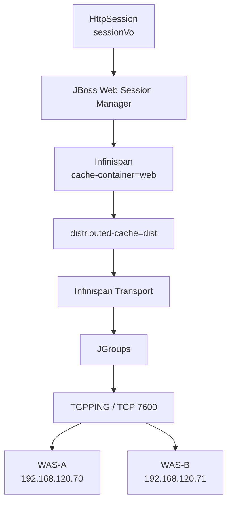

### 결론

이번 설정은 **HTTP `HttpSession` 세션 클러스터링과 직접적으로 관련된 핵심 설정**입니다.
특히 아래 부분이 결정적입니다.

```xml
<cache-container name="web"
                 default-cache="dist"
                 module="org.wildfly.clustering.web.infinispan">
```

Red Hat JBoss EAP 7 공식 문서에서도 `web` cache container는 **Web Session Clustering 용도**라고 명시하고 있고, `default-cache="dist"`이면 웹 세션 클러스터링 시 `dist` distributed cache가 사용됩니다. ([레드햇 문서][1])
따라서 지금까지 제공하신 설정을 종합하면:

```text
JGroups TCPPING
192.168.120.70 ↔ 192.168.120.71
        ↓
Infinispan
        ↓
cache-container="web"
        ↓
distributed-cache="dist"
        ↓
HttpSession Cluster 저장소
```

까지 **JBoss 측 세션 클러스터링 인프라는 상당 부분 구성되어 있다고 판단할 수 있습니다.**
다만 애플리케이션 WAR의 `web.xml`에 `<distributable/>`이 있는지와 실제 A/B가 하나의 cluster view를 형성하고 있는지는 별도로 확인해야 최종적으로 `HttpSession` 공유를 확정할 수 있습니다.
-----------------------------------------------------------------------------------------------------------------------------------

### 1. 설정을 두 부분으로 분리해서 봐야 함

전체 설정은 크게 다음 두 cache container입니다.

```xml
<cache-container name="server" ...>
    ...
</cache-container>
<cache-container name="web" ...>
    ...
</cache-container>
```

용도가 완전히 다릅니다.

| Cache Container                                                                                                         | 용도                              | HttpSession 관련 |
| ----------------------------------------------------------------------------------------------------------------------- | ------------------------------- | -------------: |
| `server`                                                                                                                | JBoss Singleton/Cluster 내부 서비스용 |       직접 관련 없음 |
| `web`                                                                                                                   | **Web Session Clustering**      |   **직접 관련 있음** |
| JBoss EAP 7은 기본 Infinispan container를 `server`, `web`, `ejb`, `hibernate` 등으로 구분하며 `web`은 웹 세션 클러스터링용입니다. ([레드햇 문서][1]) |                                 |                |

---

# 2. `server` Cache Container

```xml
<cache-container
    name="server"
    aliases="singleton cluster"
    default-cache="default"
    module="org.wildfly.clustering.server">
```

이 부분은 **HttpSession을 저장하는 영역이 아닙니다.**
`server` cache-container는 JBoss 내부의 clustered singleton 등의 기능에 사용됩니다. 공식 문서에서도 `server`는 singleton caching 용도로 구분합니다. ([레드햇 문서][1])
따라서 현재 로그인 코드:

```java
HttpSession session = request.getSession();
session.setAttribute("sessionVo", sessionVo);
```

## 와 직접적인 관계는 없습니다.

### 3. `<transport lock-timeout="60000"/>`

```xml
<transport lock-timeout="60000"/>
```

이것은 해당 cache container가 **클러스터 통신 Transport를 사용한다는 의미**입니다.
앞서 확인한:

```xml
<subsystem xmlns="urn:jboss:domain:jgroups:6.0">
    <channel name="ee" stack="tcpping" .../>
```

및:

```xml
192.168.120.70[7600]
192.168.120.71[7600]
```

의 JGroups 설정과 연결되는 계층입니다.
개념적으로:

```text
Infinispan
   ↓
transport
   ↓
JGroups
   ↓
TCPPING
   ↓
TCP 7600
   ↓
WAS-A ↔ WAS-B
```

입니다.
HA profile/`standalone-ha.xml`에서 Infinispan은 상태 replication/distribution을 지원합니다. ([레드햇 문서][1])
`lock-timeout="60000"`은 클러스터 관련 lock을 획득할 때의 timeout 설정으로 60초입니다.
-----------------------------------------------------------------

# 4. `replicated-cache name="default"`

```xml
<replicated-cache name="default">
    <transaction mode="BATCH"/>
</replicated-cache>
```

이 설정은 `server` cache container의 기본 cache입니다.

```text
server
 └─ default
      └─ replicated-cache
```

Replicated Cache는 논리적으로:

```text
Cache Entry X
       ↓
WAS-A : X
WAS-B : X
```

처럼 모든 cluster member에 데이터를 복제하는 방식입니다.
하지만 다시 강조하면 이것은:

```text
cache-container="server"
```

## 내부이므로 **웹 세션 저장소가 아닙니다.**

# 5. 가장 중요한 부분: `cache-container name="web"`

```xml
<cache-container
    name="web"
    default-cache="dist"
    module="org.wildfly.clustering.web.infinispan">
```

이것이 현재 확인하려는 **HttpSession clustering 핵심 설정**입니다.
각 항목을 보면:

| 설정                                               | 의미                                      |
| ------------------------------------------------ | --------------------------------------- |
| `name="web"`                                     | Web Session용 Infinispan container       |
| `default-cache="dist"`                           | 기본 Session cache로 `dist` 사용             |
| `module="org.wildfly.clustering.web.infinispan"` | WildFly/JBoss Web Session clustering 모듈 |
| 공식 문서에서도 정확하게:                                   |                                         |

> `web` cache container의 `dist` distributed cache가 Web Session clustering에 사용된다
> 고 설명합니다. ([레드햇 문서][1])
> 즉 이번 설정은 앞서 확인한 EJB 설정보다 **훨씬 직접적인 HttpSession clustering 증거**입니다.

---

# 6. `distributed-cache name="dist"`

```xml
<distributed-cache name="dist">
```

여기서 중요한 것이 `distributed`입니다.
JBoss에서는 Web Session을:

```text
Replicated Cache
```

또는:

```text
Distributed Cache
```

방식으로 관리할 수 있습니다.
현재는:

```text
Distributed Cache
```

입니다.
공식 JBoss EAP 7 기본 Web Session cache 역시 `dist` distributed cache를 포함하며, 기본적으로 Web Session clustering에 사용됩니다. ([레드햇 문서][1])
-------------------------------------------------------------------------------------------------------------------------

## 7. Distributed와 Replicated의 차이

예를 들어 WAS가 4대라고 가정하면:

### Replicated

```text
Session-A
 ↓
WAS-1 : Session-A
WAS-2 : Session-A
WAS-3 : Session-A
WAS-4 : Session-A
```

모든 서버가 복사본을 가집니다.

### Distributed

```text
Session-A
      ↓
Primary Owner
WAS-1
      +
Backup Owner
WAS-2
WAS-3 : 없음
WAS-4 : 없음
```

즉 전체 노드 중 설정된 `owners` 수만큼 Session 데이터를 보유합니다.
JBoss EAP의 `dist` Web Session cache에서 기본 `owners` 값은 `2`입니다. ([레드햇 문서][1])
--------------------------------------------------------------------------

# 8. 현재 WAS가 정확히 2대라는 점이 중요

현재:

```text
WAS-A
WAS-B
```

두 대라고 하셨습니다.
그리고 별도의:

```xml
owners="..."
```

설정이 없습니다.
JBoss EAP 7 공식 기본값은:

```text
owners = 2
```

입니다. ([레드햇 문서][1])
따라서 실제 runtime 값도 2라면:

```text
Session-ABC
       │
       ├── Primary → WAS-A
       │
       └── Backup  → WAS-B
```

또는 반대로:

```text
Session-XYZ
       │
       ├── Primary → WAS-B
       │
       └── Backup  → WAS-A
```

형태가 됩니다.
즉 **노드가 2대이고 owners=2이면 결과적으로 각 웹 세션 데이터가 두 WAS에 모두 존재하게 되는 형태**가 됩니다.
다만 `owners`를 XML에 명시하지 않았으므로 실무적으로는 추정에 머물지 말고 runtime 값을 확인하는 것이 안전합니다.

```bash
$JBOSS_HOME/bin/jboss-cli.sh --connect
```

```text
/subsystem=infinispan/cache-container=web/distributed-cache=dist:read-resource(include-runtime=true)
```

여기서:

```text
"owners" => 2
```

## 인지 확인하십시오.

# 9. `locking isolation="READ_COMMITTED"`

```xml
<locking isolation="READ_COMMITTED"/>
```

Infinispan cache entry에 대한 동시 접근 시 isolation level입니다.
개념적으로:

```text
Request-A
        \
         Session Cache Entry
        /
Request-B
```

처럼 여러 요청 또는 cluster node가 동일 cache entry에 접근할 때의 일관성 정책과 관계됩니다.
현재 설정:

```text
READ_COMMITTED
```

은 커밋되지 않은 변경을 다른 실행 흐름에서 읽지 않도록 하는 isolation 정책입니다.
이 설정 자체가 세션 클러스터링을 활성화시키는 것은 아니지만 **distributed session cache의 동시성 처리 방식**에 영향을 줍니다.
참고로 공식 EAP 7.4 기본 예에서는 버전에 따라 `REPEATABLE_READ`/`BATCH` 형태가 제시되므로 현재 설정은 설치 버전 또는 운영 환경에 맞게 조정된 구성일 가능성이 있습니다. ([레드햇 문서][1])
----------------------------------------------------------------------------------------------------------------------------

# 10. `transaction mode="NONE"`

```xml
<transaction mode="NONE"/>
```

해당 distributed cache에 Infinispan transaction을 사용하지 않도록 설정한 것입니다.
즉:

```text
HttpSession 변경
    ↓
Infinispan cache update
    ↓
별도 cache transaction 없음
```

입니다.
이 역시:

```text
Session Clustering ON/OFF
```

를 결정하는 설정은 아닙니다.
클러스터링 여부에서 훨씬 중요한 것은:

```xml
<cache-container name="web">
    <transport .../>
    <distributed-cache name="dist">
```

## 입니다.

# 11. `<file-store/>`는 무엇인가

```xml
<file-store/>
```

Infinispan Cache의 내용을 **파일 기반 persistent store에도 기록할 수 있도록 하는 설정**입니다.
JBoss 관리 모델에서도 `file` store는 persistent cache store의 한 종류로 정의되어 있습니다. ([Red Hat Customer Portal][2])
여기서 중요한 점은:

> `file-store`가 WAS-A와 WAS-B가 공유하는 파일시스템이라는 뜻은 아닙니다.
> 일반적으로:

```text
WAS-A
 └─ Local Infinispan File Store
WAS-B
 └─ Local Infinispan File Store
```

이며,
노드 간 Session 분산을 담당하는 것은:

```text
file-store
```

가 아니라:

```text
Infinispan Distributed Cache
       +
JGroups
```

입니다.
따라서:

```text
file-store = 세션 클러스터링
```

## 으로 해석하면 안 됩니다.

# 12. 앞서 제공한 JGroups 설정과 완전히 연결해 보면

현재까지 확인한 설정은 다음과 같습니다.

### JGroups

```xml
<channel name="ee"
         stack="tcpping"
         cluster="ejb"/>
<protocol type="org.jgroups.protocols.TCPPING">
    <property name="initial_hosts">
        192.168.120.70[7600],
        192.168.120.71[7600]
    </property>
</protocol>
```

### Infinispan

```xml
<cache-container
    name="web"
    default-cache="dist"
    module="org.wildfly.clustering.web.infinispan">
    <transport lock-timeout="60000"/>
    <distributed-cache name="dist">
        ...
    </distributed-cache>
</cache-container>
```

이 둘의 관계는:



## 즉 **JBoss 측에서는 웹 세션 클러스터링을 위한 서버 인프라가 거의 완성된 형태**로 보입니다. ([레드햇 문서][1])

# 13. 현재 `sessionVo`와 연결

현재 애플리케이션 코드가:

```java
HttpSession session = request.getSession();
session.setAttribute("sessionVo", sessionVo);
```

라면 Web Session clustering이 실제 활성화되었을 경우 논리적으로:

```text
sessionId = ABC123
        │
        ├── sessionVo
        │      ├── userId
        │      ├── userName
        │      └── ...
        │
        ▼
Infinispan web.dist
        │
        ├── WAS-A
        └── WAS-B
```

로 관리됩니다.
JBoss EAP 7에서는 세션 또는 mutable session attribute가 변경될 때 session replication이 발생할 수 있습니다. ([레드햇 문서][3])
따라서:

```java
session.setAttribute("sessionVo", sessionVo);
```

## 는 분산 Web Session 환경에서는 cache state 변경으로 처리되는 핵심 코드입니다.

# 14. 그런데 아직 마지막 조건 하나가 남음

서버 설정이 아무리 완벽하더라도 **Web Application 자체가 distributable이어야 합니다.**
`WEB-INF/web.xml`:

```xml
<web-app ...>
    <distributable/>
</web-app>
```

를 확인해야 합니다.

```bash
grep -n "<distributable" \
    WEB-INF/web.xml
```

또는 소스:

```bash
grep -n "<distributable" \
    src/main/webapp/WEB-INF/web.xml
```

JBoss의 Web clustering 기능은 distributable Web Application의 세션을 대상으로 동작합니다. Web Session replication 설정 및 replication granularity도 distributable web session을 대상으로 합니다. ([레드햇 문서][3])
따라서 현재 판단은:

| 조건                         |     현재 확인 |
| -------------------------- | --------: |
| `standalone-ha.xml` 사용     |         ✅ |
| JGroups subsystem          |         ✅ |
| A/B TCPPING 설정             |         ✅ |
| Infinispan subsystem       |         ✅ |
| `cache-container="web"`    |         ✅ |
| `default-cache="dist"`     |         ✅ |
| Web distributed cache      |         ✅ |
| Infinispan transport       |         ✅ |
| `web.xml <distributable/>` | **확인 필요** |
| A/B 실제 cluster membership  | **확인 필요** |
| 실제 Session Failover        | **확인 필요** |

---

# 15. 현재 상태에서 세션 클러스터링 가능성

앞에서 제공하신 설정까지 종합하면 단순히 "JBoss HA 파일을 쓰고 있다" 수준보다 훨씬 강한 상태입니다.

```text
① standalone-ha.xml
       ↓
② JGroups TCPPING
       ↓
③ WAS-A / WAS-B 지정
       ↓
④ Infinispan
       ↓
⑤ web cache-container
       ↓
⑥ distributed-cache dist
```

여기까지 모두 확인되었습니다.
따라서 **서버 구성 자체는 HTTP Session clustering을 사용하도록 만들어져 있다고 판단하는 것이 타당합니다.**
남은 핵심은:

```text
Application이 <distributable/>인가?
        +
A/B가 실제 Cluster를 형성했는가?
```

## 입니다.

# 16. 지금 바로 실행하면 좋은 확인 명령

### ① 애플리케이션

```bash
grep -R "<distributable" \
    $JBOSS_HOME/standalone/deployments/
```

WAR가 압축되어 있다면 소스의 `WEB-INF/web.xml`을 확인합니다.

### ② `web` cache runtime

```bash
$JBOSS_HOME/bin/jboss-cli.sh --connect
```

```text
/subsystem=infinispan/cache-container=web:read-resource(recursive=true,include-runtime=true)
```

특히:

```text
default-cache
transport
dist
owners
```

를 봅니다.

### ③ `owners`

```text
/subsystem=infinispan/cache-container=web/distributed-cache=dist:read-attribute(name=owners)
```

기대:

```text
result => 2
```

### ④ Cluster runtime 로그

```bash
grep -iE \
"ISPN000094|cluster view|JGroups|channel web" \
$JBOSS_HOME/standalone/log/server.log
```

A/B 두 node가 보이는지 확인합니다.

### ⑤ 실제 Failover 테스트

가장 결정적입니다.

```text
1. WAS-A로 로그인
2. sessionVo 확인
3. JSESSIONID 기록
4. WAS-A 종료
5. WAS-B에서 같은 Cookie로 요청
6. 동일 JSESSIONID + sessionVo 유지 여부 확인
```

---

### 17. 중복 로그인 문제와의 관계

여기서 중요한 결론이 하나 더 있습니다.
이번 설정이 실제 동작하고 있다면 **Redis나 Spring Session을 새로 도입하지 않고도 다중 WAS에서 HttpSession 자체는 JBoss가 클러스터링해 줄 수 있습니다.**
하지만:

```text
user01
├── SESSION-A
└── SESSION-B
```

처럼 동일 ID로 서로 다른 브라우저에서 만들어진 **두 개의 독립 HttpSession 중 하나를 자동으로 제거하는 기능은 아닙니다.**
즉:

```text
JBoss Session Clustering
=
SESSION-A를 A/B에서 사용할 수 있도록 함
```

이지:

```text
JBoss Session Clustering
≠
user01은 SESSION 하나만 허용
```

입니다.
현재 중복 로그인 설계 관점에서는 오히려 이렇게 정리하는 것이 정확합니다.

```text
[이미 갖고 있는 것]
JBoss Infinispan + JGroups
      ↓
HttpSession A/B 분산
[추가로 필요한 것]
userId → 현재 유효 Session 식별
      ↓
새 로그인 시 기존 로그인 무효화
```

따라서 **`<distributable/>`과 실제 Cluster runtime까지 확인된다면, 다음 단계에서는 Redis/Spring Session 도입보다는 현재 JBoss 분산 HttpSession 위에서 동일 `userId`의 기존 세션을 어떻게 식별·무효화할 것인지를 설계하는 편이 현재 시스템 변경 범위를 최소화하는 방향**입니다.