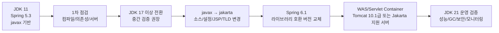
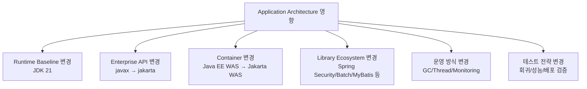
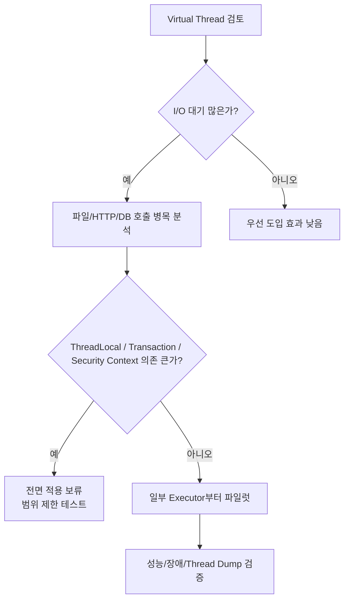
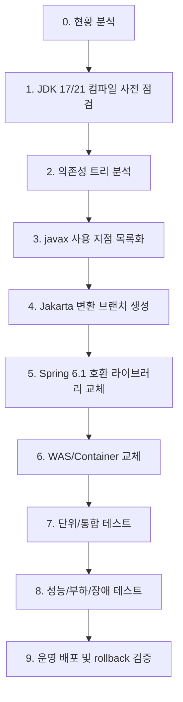

### JDK 11, Spring Framework 5.3을 JDK 21, Spring Framework 6.1 Conversion 전체 판단

현재 구조가 **Spring Framework 5.3 기반의 전통적인 Servlet MVC / XML 설정 / JSP / MyBatis / DBCP2 / JBoss 또는 외부 WAS 배포형 애플리케이션**이라는 전제로 정리합니다. 실제 POM, `web.xml`, WAS 버전, 보안/배치/ORM 사용 여부에 따라 세부 난이도는 달라집니다. 핵심은 단순 JDK 업그레이드가 아니라 **Java EE `javax.*` 기반 애플리케이션을 Jakarta EE `jakarta.*` 기반 애플리케이션으로 바꾸는 전환**입니다. Spring Framework 6.0부터 Jakarta EE 9 수준으로 올라가며 Servlet, JPA, Validation 등이 기존 `javax.*`가 아니라 `jakarta.*` 네임스페이스를 사용합니다. Spring 공식 문서도 Spring 6.0이 Servlet 5.0+, JPA 3.0+ 등 Jakarta EE 9 레벨로 업그레이드되었고, Tomcat 10.1, Jetty 11, Hibernate ORM 6.1과 호환된다고 설명합니다. ([Home](https://docs.spring.io/spring-framework/reference/overview.html "Spring Framework Overview :: Spring Framework"))



### 1. 한 줄 결론

|구분|판단|
|---|---|
|Java 업무 로직|대부분 재사용 가능|
|Spring Bean 설계|대부분 재사용 가능|
|Controller/Service/DAO 계층|구조는 재사용 가능, import/라이브러리 변경 필요|
|Servlet/JSP/Filter/Listener|수정 영향 큼|
|`javax.*` 기반 코드|대부분 `jakarta.*`로 변경 필요|
|WAS|기존 Java EE 서버면 교체 또는 대규모 업그레이드 필요|
|JSP/Tiles|JSP는 가능, Tiles는 Spring 6에서 사실상 교체 대상|
|Transaction/AOP|개념은 유지, 설정 위치와 라이브러리 호환성 재검증 필요|
|난이도|중~상. 레거시 JSP/XML/외부 WAS/보안/배치가 많으면 상|

### 2. 가장 큰 변경점 5개

|No|변경점|영향|
|--:|---|---|
|1|JDK 11 → JDK 21|컴파일, 빌드 플러그인, 테스트 도구, JVM 옵션 변경|
|2|Spring 5.3 → 6.1|Java 17+ 필요, Jakarta 기반으로 전환|
|3|`javax.*` → `jakarta.*`|Servlet, Filter, Validation, JPA, Transaction API 영향|
|4|WAS/Servlet Container 변경|Tomcat 9/JBoss 구버전 등 Java EE 서버는 직접 호환 어려움|
|5|서드파티 라이브러리 교체|MyBatis-Spring, Spring Security, Spring Batch, Hibernate Validator, JSTL 등|

Spring 6.0은 Java 17+와 Jakarta EE 9+를 기준으로 하며, Servlet/JPA 등에서 `javax` → `jakarta` 전환이 핵심입니다. Spring 6.0 Release Notes도 전체 프레임워크 코드베이스가 Java 17 소스 레벨 기반이고, Servlet/JPA 등이 `jakarta` 네임스페이스로 전환되었다고 명시합니다. ([GitHub](https://github.com/spring-projects/spring-framework/wiki/Spring-Framework-6.0-Release-Notes "Spring Framework 6.0 Release Notes · spring-projects/spring-framework Wiki · GitHub"))

### 3. 현재 사용 가능성이 높은 부분

#### 3-1. 거의 그대로 재사용 가능한 부분

|구분|재사용 가능성|설명|
|---|--:|---|
|순수 Java 업무 로직|높음|도메인 계산, 문자열 처리, 금액 계산, 정책 판단 로직은 대부분 유지 가능|
|Service 계층 구조|높음|`@Service`, 생성자 주입, 인터페이스 기반 설계는 유지 가능|
|DAO/Mapper SQL|높음|SQL 자체는 DB가 같다면 대부분 유지 가능|
|트랜잭션 경계 개념|높음|`@Transactional`, AOP 기반 트랜잭션 사상은 유지 가능|
|Spring DI 개념|높음|Bean 등록, 의존성 주입, 계층 구조는 유지 가능|
|MyBatis Mapper XML|중~높음|MyBatis 버전 호환성만 맞추면 SQL Mapper는 대체로 유지 가능|
|DBCP2 설정 개념|중|옵션 개념은 유지 가능하나 버전과 운영값 재검증 필요|
|로그 정책|중|Log4j2/SLF4J 구조는 유지 가능하나 버전 업그레이드 필요|
|Jenkins/GitLab 배포 흐름|중|흐름은 유지 가능, JDK/Maven/빌드 이미지 변경 필요|

#### 3-2. 재사용 가능하지만 수정이 필요한 부분

|구분|수정 이유|
|---|---|
|Controller|`javax.servlet.*`, Validation, Multipart 사용 시 수정 필요|
|Filter/Listener|`javax.servlet.Filter`, `ServletContextListener` 등은 `jakarta.servlet.*`로 변경 필요|
|Interceptor|Servlet 객체 참조 시 수정 필요|
|JSP|JSTL, taglib, Servlet/JSP API 버전 영향|
|XML 설정|클래스명 변경, 제거된 Bean, XSD 참조, 라이브러리 변경 영향|
|Validation|`javax.validation.*` → `jakarta.validation.*`|
|JPA 사용 코드|`javax.persistence.*` → `jakarta.persistence.*`|
|Transaction API 직접 사용|`javax.transaction.*` → `jakarta.transaction.*`|
|테스트 코드|JUnit/Mockito/MockMvc/Servlet API 변경 영향|

### 4. 반드시 변경해야 하는 부분

#### 4-1. Java/JDK 영역

|항목|현재|변경 후|난이도|
|---|---|---|---|
|JDK|11|21|중|
|컴파일 옵션|`source/target 11`|`--release 21` 또는 `source/target 21`|중|
|Maven/Gradle|구버전 가능성|JDK 21 지원 버전으로 업그레이드|중|
|JVM 옵션|JDK 8/11식 옵션 혼재 가능|JDK 21에서 제거/변경된 옵션 정리|중|
|GC|G1 기본 사용 가능|G1/ZGC 등 재검토|중|
|Removed API|일부 내부 API 사용 가능성|대체 API로 변경|중~상|
|테스트/커버리지|구버전 JaCoCo/Mockito 가능성|Java 21 지원 버전 필요|중|

Oracle JDK 21 Migration Guide는 JDK 21로 가기 전에 제거된 API, 도구, 컴포넌트를 확인하라고 안내합니다. 예를 들어 JDK 15에서 Nashorn JavaScript Engine이 제거되었고, JDK 14에서 Pack200이 제거되었으며, JDK 11에서 Java EE/CORBA 모듈이 제거되었습니다. ([Oracle Documentation](https://docs.oracle.com/en/java/javase/21/migrate/getting-started.html "Getting Started")) ([Oracle Documentation](https://docs.oracle.com/en/java/javase/21/migrate/removed-tools-and-components.html "Removed Tools and Components"))

#### 4-2. Spring/Jakarta 영역

|항목|현재|변경 후|난이도|
|---|---|---|---|
|Spring Framework|5.3|6.1|상|
|Servlet API|`javax.servlet`|`jakarta.servlet`|상|
|Validation|`javax.validation`|`jakarta.validation`|중|
|JPA|`javax.persistence`|`jakarta.persistence`|상|
|JTA|`javax.transaction`|`jakarta.transaction`|중|
|Annotation|일부 `javax.annotation`|`jakarta.annotation`|중|
|WAS|Java EE 8 계열|Jakarta EE 9/10 계열|상|

Apache Tomcat의 Jakarta migration tool 설명에 따르면 Java EE 8의 `javax.*` 패키지는 Jakarta EE 9에서 `jakarta.*`로 이동했으며, 도구는 클래스, 문자열 상수, 설정 파일, JSP, TLD까지 변환할 수 있습니다. 단, 모든 `javax.*`가 Jakarta로 이동한 것은 아니며 Java SE의 `javax.sql`, `javax.crypto`, `javax.net` 등은 그대로입니다. ([GitHub](https://github.com/apache/tomcat-jakartaee-migration "GitHub - apache/tomcat-jakartaee-migration: Apache Tomcat migration tool for Jakarta EE · GitHub"))

### 5. `javax` → `jakarta` 변경 기준

#### 5-1. 바꿔야 하는 대표 패키지

```java
// before
import javax.servlet.http.HttpServletRequest;
import javax.servlet.http.HttpServletResponse;
import javax.servlet.Filter;
import javax.validation.constraints.NotNull;
import javax.persistence.Entity;
import javax.transaction.Transactional;
import javax.annotation.PostConstruct;

// after
import jakarta.servlet.http.HttpServletRequest;
import jakarta.servlet.http.HttpServletResponse;
import jakarta.servlet.Filter;
import jakarta.validation.constraints.NotNull;
import jakarta.persistence.Entity;
import jakarta.transaction.Transactional;
import jakarta.annotation.PostConstruct;
```

#### 5-2. 바꾸면 안 되는 대표 패키지

```java
import javax.sql.DataSource;
import javax.crypto.Cipher;
import javax.net.ssl.SSLContext;
import javax.naming.InitialContext;
```

`javax.sql`, `javax.crypto`, `javax.net`, `javax.naming` 등 Java SE 또는 별도 표준에 속한 패키지는 무조건 `jakarta`로 바꾸면 안 됩니다. 변환 자동화 도구를 쓰더라도 결과를 반드시 검토해야 합니다.

### 6. Spring Framework 6.1 전환 시 기술 사상 변화

|영역|Spring 5.3 관점|Spring 6.1 관점|
|---|---|---|
|기본 Java|Java 8/11/17 폭넓은 지원|Java 17+ 기준, JDK 21 호환 강화|
|Enterprise API|Java EE `javax`|Jakarta EE `jakarta`|
|서버|Tomcat 9, Java EE 서버 가능|Tomcat 10.1급 Jakarta 서버 필요|
|설정 방식|XML + Annotation 혼재 많음|Java Config, 명시적 Bean 구성 선호|
|관측성|로그 중심|Micrometer/Observation 연계 강화 가능|
|동시성|Thread Pool 중심|JDK 21 Virtual Thread 선택 가능|
|Native/AOT|제한적|AOT/Native 기반 강화|
|레거시 통합|Tiles, Commons FileUpload 등 사용 가능|일부 제거 또는 교체 필요|

Spring Framework 6.1 Release Notes에는 JDK 21 및 Virtual Thread와의 전반적 호환성, `VirtualThreadTaskExecutor`, `SimpleAsyncTaskExecutor`의 virtual threads mode, `SimpleAsyncTaskScheduler` 지원이 명시되어 있습니다. ([GitHub](https://github.com/spring-projects/spring-framework/wiki/Spring-Framework-6.1-Release-Notes "Spring Framework 6.1 Release Notes · spring-projects/spring-framework Wiki · GitHub"))

### 7. Application Architecture 관점 영향도



|영역|영향도|설명|
|---|--:|---|
|소스 코드|상|`javax` 참조, deprecated API, 제거 API 확인 필요|
|빌드|상|Maven/Gradle, compiler, surefire, jacoco, annotation processor 변경|
|서버|상|기존 JBoss/Tomcat 9 계열이면 Jakarta 호환 서버로 전환 필요|
|DB 접근|중|JDBC/DBCP/MyBatis 버전 호환성 점검|
|트랜잭션|중|개념 유지, 라이브러리와 설정 위치 재검증|
|보안|상|Spring Security 사용 시 5.x → 6.x 변경 영향 큼|
|배치|상|Spring Batch 사용 시 4.x → 5.x 변경 영향 큼|
|화면/JSP|중~상|JSP/JSTL/Tiles/Taglib 영향|
|운영|중~상|GC, JVM 옵션, 모니터링, Thread Dump 해석 변화|

### 8. Web/WAS 전환

#### 8-1. 기존 WAS 유지 가능성

|현재 서버|Spring 6.1 전환 가능성|판단|
|---|--:|---|
|Tomcat 9|낮음|Java EE 8/`javax` 기반이라 Spring 6 MVC와 직접 호환 곤란|
|Tomcat 10.0|제한적|Jakarta EE 9이나 이미 EOL, 운영 권장 낮음|
|Tomcat 10.1|높음|Jakarta EE 10, Servlet 6.0 기반|
|JBoss 7 계열|낮음|대부분 Java EE/`javax` 기반이라 직접 호환 어려움|
|WildFly 최신 Jakarta 계열|가능|버전별 Jakarta EE 지원 확인 필요|
|Spring Boot Embedded Tomcat 10.1|가능|Boot 전환 시 운영 방식 변화 큼|

Tomcat 공식 버전 표에 따르면 Tomcat 10.1.x는 Servlet 6.0, JSP 3.1, EL 5.0 등 Jakarta EE 10 사양을 구현하고, Tomcat 9.x는 Servlet 4.0/JSP 2.3 등 Java EE 8 사양을 구현합니다. Tomcat 10.0.x는 Jakarta EE 9이지만 이미 EOL이므로 Tomcat 10.1 이상이 실무적으로 적절합니다. ([Tomcat](https://tomcat.apache.org/whichversion.html "Apache Tomcat® - Which Version Do I Want?"))

#### 8-2. JBoss 사용 시 실무 판단

현재 JBoss 7 계열이라면 Spring 6.1 전환의 가장 큰 병목은 Java 코드보다 **WAS 호환성**입니다. Spring 6.1은 Jakarta API를 요구하므로, 서버가 `javax.servlet` 기반이면 애플리케이션이 컴파일되어도 배포 시 `ClassNotFoundException`, `NoSuchMethodError`, `LinkageError`가 발생할 수 있습니다.  
권장 판단:

```text
기존 JBoss 유지 필수
  → Spring 5.3 유지 + 보안 보완 또는 상용 지원 검토
  → 단, OSS 지원 종료 리스크 존재

Spring 6.1 전환 필수
  → Jakarta EE 지원 서버로 전환
  → Tomcat 10.1 / 최신 WildFly / Spring Boot 내장 Tomcat 등 검토
```

Spring 5.3.x와 6.0.x의 OSS 지원은 2024년 8월 31일 종료되었다고 Spring 팀이 공지했습니다. 따라서 Spring 5.3을 장기 유지하는 경우 보안 패치/장애 대응 체계가 별도로 필요합니다. ([Home](https://spring.io/blog/2024/03/01/support-timeline-announcement-for-spring-framework-6-0-x-and-5-3-x?utm_source=chatgpt.com "Support timeline announcement for Spring Framework 6.0. ..."))

### 9. Spring MVC 영역 변경

#### 9-1. 유지 가능한 것

|항목|판단|
|---|---|
|`@Controller`|유지 가능|
|`@RestController`|유지 가능|
|`@RequestMapping`|유지 가능|
|`HandlerInterceptor` 구조|유지 가능, import 변경 필요|
|`@RequestBody`, `@ResponseBody`|유지 가능|
|MessageConverter 개념|유지 가능|
|ViewResolver 개념|유지 가능|

#### 9-2. 변경/점검 필요한 것

|항목|변경 필요성|
|---|---|
|`HttpServletRequest`|`jakarta.servlet.http.HttpServletRequest`로 변경|
|`HttpServletResponse`|`jakarta.servlet.http.HttpServletResponse`로 변경|
|Filter|`jakarta.servlet.Filter`로 변경|
|Listener|`jakarta.servlet.*`로 변경|
|Multipart|CommonsMultipartResolver 제거 영향 확인|
|Tiles|Spring 6에서 통합 제거, 교체 필요|
|JSP taglib|Jakarta JSTL 버전 확인|
|web.xml|Servlet 스펙 및 클래스명 확인|

Spring 6.0 Release Notes는 Jakarta 전환 때문에 Tomcat 10, Jetty 11, Undertow의 Jakarta 대응 버전으로 업그레이드하고, `javax.servlet` import를 `jakarta.servlet`로 바꾸라고 설명합니다. 또한 Apache Commons FileUpload 기반 `CommonsMultipartResolver`, Apache Tiles, FreeMarker JSP 지원 등 오래된 Servlet 기반 통합이 제거되었다고 명시합니다. ([GitHub](https://github.com/spring-projects/spring-framework/wiki/Spring-Framework-6.0-Release-Notes "Spring Framework 6.0 Release Notes · spring-projects/spring-framework Wiki · GitHub"))

### 10. JSP/Tiles 사용 시 영향

|항목|현재|Spring 6.1 전환 판단|
|---|---|---|
|JSP|사용 가능|Jakarta JSP/JSTL 호환 버전으로 교체 필요|
|JSTL|`javax.servlet.jsp.jstl` 계열 가능성|Jakarta JSTL 필요|
|Tiles|Spring MVC 통합 가능|Spring 6에서 제거되어 교체 대상|
|SiteMesh류|버전별 확인 필요|Jakarta 대응 여부 확인|
|JSP 커스텀 태그|`javax.servlet.jsp.*` 사용 가능성|`jakarta.servlet.jsp.*` 확인 필요|

실무적으로 Tiles를 쓰고 있다면 단순 import 변경으로 끝나지 않습니다. 화면 레이아웃 프레임워크를 JSP include, Thymeleaf, 자체 layout tag, frontend 분리 등으로 교체하는 별도 작업이 필요합니다. 이 부분은 전환 난이도를 크게 올립니다.

### 11. Transaction/AOP 영역

#### 11-1. 유지되는 개념

|항목|유지 여부|
|---|---|
|`@Transactional` 선언적 트랜잭션|유지|
|AOP Proxy 기반 트랜잭션|유지|
|`DataSourceTransactionManager`|유지|
|Propagation 개념|유지|
|Rollback rule 개념|유지|
|Root/Servlet ApplicationContext 구분|유지|

#### 11-2. 점검해야 할 부분

|항목|점검 내용|
|---|---|
|`javax.transaction.Transactional`|사용 중이면 `jakarta.transaction.Transactional` 또는 Spring `org.springframework.transaction.annotation.Transactional`로 정리|
|XML `<tx:annotation-driven>`|Spring 6 XSD/Bean 호환성 확인|
|ChainedTransactionManager|Spring Data Commons 쪽 deprecated 이슈가 있으면 대안 검토|
|AOP pointcut|패키지 변경, 클래스명 변경 후 정상 적용 확인|
|Proxy 방식|JDK proxy/CGLIB 차이 재검증|
|Self-invocation|기존과 동일하게 주의 필요|

Spring 6.0의 Data Access/Transaction 변경 중 하나로 기본 JDBC 예외 변환기가 `SQLExceptionSubclassTranslator` 기반으로 변경되었습니다. DB 오류 매핑을 기존 `SQLErrorCodeSQLExceptionTranslator` 동작에 강하게 의존했다면 예외 타입 차이를 테스트해야 합니다. ([GitHub](https://github.com/spring-projects/spring-framework/wiki/Spring-Framework-6.0-Release-Notes "Spring Framework 6.0 Release Notes · spring-projects/spring-framework Wiki · GitHub"))

### 12. DB/MyBatis/DBCP2 영역

#### 12-1. MyBatis

|항목|현재 가능성|변경 후|
|---|---|---|
|MyBatis Core|3.5.x 가능성|최신 3.5.x 계열 권장|
|MyBatis-Spring|2.x 가능성|Spring 6 지원을 위해 3.0.x 계열 필요|
|Mapper XML|대부분 유지|동적 SQL, TypeHandler는 테스트 필요|
|SqlSessionFactoryBean|유지|패키지/버전 호환성 확인|
|Transaction 연동|유지|Spring 6 compatible 버전 필요|

MyBatis-Spring 공식 저장소는 `3.0.x`가 Spring 6과 Spring Batch 5를 지원하고, `2.1.x`는 Spring 5 유지보수 라인이라고 설명합니다. 따라서 Spring 6.1로 가려면 MyBatis-Spring 3.0.x 계열 사용이 기본 판단입니다. ([GitHub](https://github.com/mybatis/spring?utm_source=chatgpt.com "Spring integration for MyBatis 3"))

#### 12-2. DBCP2

|항목|판단|
|---|---|
|DBCP2 계속 사용|가능|
|설정값 재검증|필수|
|JDK 21 호환|최신 DBCP2 사용 권장|
|대안|HikariCP 검토 가능|
|주의|Connection validation, idle eviction, maxTotal, maxWait 재튜닝|

Apache Commons DBCP 문서는 DBCP 2.5.0 이상이 Java 8 이상에서 컴파일/실행된다고 설명합니다. JDK 21 운영에서는 가급적 최신 안정 버전으로 올리고, DBCP2 자체보다 JDBC Driver, DB wait_timeout, pool 설정 조합을 함께 검증해야 합니다. ([Apache Commons](https://commons.apache.org/dbcp/?utm_source=chatgpt.com "Overview – Apache Commons DBCP"))

#### 12-3. MariaDB Connector/J

|항목|판단|
|---|---|
|MariaDB Connector/J 2.7.x|기존 시스템에서 흔함|
|JDK 21 전환|최신 3.x 계열 검토 권장|
|주의|URL 옵션, timezone, SSL, failover, batch rewrite 동작 확인|
|검증|대량 조회, 배치 insert, timeout, connection reset 재현 테스트|

MariaDB Connector/J는 Java 애플리케이션이 MariaDB/MySQL에 JDBC API로 연결하기 위한 Type 4 JDBC Driver입니다. 최신 JDK 전환 시 드라이버 버전과 서버 버전의 조합을 별도 검증해야 합니다. ([MariaDB](https://mariadb.com/docs/connectors/mariadb-connector-j/about-mariadb-connector-j?utm_source=chatgpt.com "About MariaDB Connector/J Guide"))

### 13. Spring Security 사용 시 영향

|항목|Spring Security 5.x|Spring Security 6.x|
|---|---|---|
|Java 기준|Java 8/11 사용 가능|JDK 17 필요|
|네임스페이스|`javax` 기반 가능|`jakarta` 기반|
|설정 방식|`WebSecurityConfigurerAdapter` 사용 가능성|제거/대체 필요|
|Filter|Servlet API 변경 영향|`jakarta.servlet`|
|권한 설정|기존 ant matcher 방식 사용 가능성|새 matcher 방식으로 정리 필요|
|난이도|중|중~상|

Spring Security 6은 JDK 17이 필요하고 `jakarta` 네임스페이스를 사용한다고 Spring 공식 블로그가 설명합니다. 보안 설정은 API 변경이 많기 때문에 단순 라이브러리 버전 변경으로 끝나지 않을 가능성이 큽니다. ([Home](https://spring.io/blog/2022/11/21/spring-security-5-8-and-6-0-are-now-ga?utm_source=chatgpt.com "Spring Security 5.8 and 6.0 are now GA"))

### 14. Spring Batch 사용 시 영향

|항목|Spring Batch 4.x|Spring Batch 5.x|
|---|---|---|
|Spring 기반|Spring 5.x|Spring 6.x|
|Java 기준|Java 8/11 가능|Java 17+ 필요|
|Jakarta|아님|Jakarta EE 9 기반|
|메타 테이블|변경 가능성 있음|마이그레이션 확인 필요|
|JobRepository|설정 변경 가능성|재검증 필요|
|난이도|중|상|

Spring Batch 5 Migration Guide는 Spring Batch 5가 Spring Framework 6 기반이며 Java 17 이상이 필요하다고 설명합니다. Batch가 있다면 Spring Framework 전환과 별도로 Batch 메타 테이블, JobParameter, 트랜잭션, 재시작 정책까지 회귀 테스트해야 합니다. ([GitHub](https://github.com/spring-projects/spring-batch/wiki/Spring-Batch-5.0-Migration-Guide?utm_source=chatgpt.com "Spring Batch 5.0 Migration Guide"))

### 15. Build Tool 변경

#### 15-1. Maven 기준 예시

```xml
<properties>
    <java.version>21</java.version>
    <maven.compiler.release>21</maven.compiler.release>
    <spring.framework.version>6.1.x</spring.framework.version>
</properties>

<build>
    <plugins>
        <plugin>
            <groupId>org.apache.maven.plugins</groupId>
            <artifactId>maven-compiler-plugin</artifactId>
            <version>3.13.0</version>
            <configuration>
                <release>21</release>
            </configuration>
        </plugin>
    </plugins>
</build>
```

Maven Compiler Plugin은 `javac`를 사용해 소스를 컴파일하는 플러그인이며, `source/target` 또는 `release` 설정을 통해 컴파일 Java 버전을 지정할 수 있습니다. JDK 21 전환 시 Maven 자체, compiler, surefire, failsafe, jacoco 등 빌드 플러그인도 함께 올려야 합니다. ([Apache Maven](https://maven.apache.org/plugins/maven-compiler-plugin/?utm_source=chatgpt.com "Introduction – Apache Maven Compiler Plugin")) ([Apache Maven](https://maven.apache.org/plugins/maven-compiler-plugin/examples/set-compiler-source-and-target.html?utm_source=chatgpt.com "Setting the -source and -target of the Java Compiler"))

#### 15-2. 반드시 점검할 빌드 항목

|항목|점검|
|---|---|
|Maven 버전|JDK 21에서 실행 가능한 버전인지|
|maven-compiler-plugin|Java 21 컴파일 지원|
|maven-surefire-plugin|JUnit 실행 정상 여부|
|maven-war-plugin|WAR 패키징 정상 여부|
|JaCoCo|Java 21 class file 지원|
|Lombok|JDK 21 지원 버전|
|MapStruct|Annotation processor 호환성|
|PMD/Checkstyle/SpotBugs|Java 21 문법/바이트코드 지원|
|SonarQube Scanner|Java 21 분석 지원|
|Jenkins JDK Tool|JDK 21 등록 및 PATH 변경|

JaCoCo 0.8.11은 Java 21을 공식 지원한다고 릴리스 노트에 명시되어 있습니다. 기존 커버리지 플러그인이 낮은 버전이면 테스트 단계에서 class file version 오류가 날 수 있습니다. ([GitHub](https://github.com/jacoco/jacoco/releases?utm_source=chatgpt.com "Releases · jacoco/jacoco"))

### 16. XML 설정 사용 시 영향

|설정|전환 판단|
|---|---|
|`applicationContext.xml`|유지 가능|
|`dispatcher-servlet.xml`|유지 가능|
|`web.xml`|Jakarta 서버에 맞게 검토 필요|
|`<context:component-scan>`|유지 가능|
|`<tx:annotation-driven>`|유지 가능, manager 참조 재검증|
|`<mvc:annotation-driven>`|유지 가능|
|`CommonsMultipartResolver`|교체 필요 가능성 높음|
|Tiles ViewResolver|교체 필요|
|Hibernate/JPA Bean|Jakarta 버전으로 변경 필요|

Spring 6에서도 XML 설정 자체가 전부 사라진 것은 아닙니다. 다만 XML 안에 적힌 클래스가 제거되었거나 패키지가 바뀌었거나, 대상 라이브러리가 Jakarta 대응 버전으로 바뀐 경우는 직접 수정해야 합니다.

### 17. Java 21에서 새로 도입 가능한 것과 바로 쓰면 안 되는 것

|기능|도입 판단|실무 의견|
|---|---|---|
|Record|선택|DTO/불변 값 객체에 유용하나 MyBatis/Jackson 호환성 검증 필요|
|Switch expression|선택|정책 분기 코드 단순화 가능|
|Text block|선택|긴 SQL/JSON 테스트 데이터에 유용|
|Pattern matching|선택|도메인 분기 코드 개선 가능|
|Virtual Thread|선택|I/O blocking 많은 서비스에 유용 가능, 즉시 전면 적용은 비권장|
|Sequenced Collections|선택|JDK 21 API 사용 시 하위 호환성 포기|
|Deprecated API 제거 대응|필수|컴파일/런타임 오류 방지|

Java 21 전환의 1차 목표는 새 문법 도입이 아니라 **기존 기능의 동일 동작 보장**이어야 합니다. 신규 Java 기능은 마이그레이션 안정화 이후 단계적으로 적용하는 것이 안전합니다.

### 18. Virtual Thread 도입 판단



|항목|판단|
|---|---|
|Spring MVC + blocking I/O|효과 가능|
|DB Connection Pool 병목|Virtual Thread로 해결 안 됨|
|ThreadLocal 의존 코드|주의 필요|
|`@Transactional`|Thread 경계 유지 필요|
|외부 API 호출|효과 가능|
|CPU 연산 중심|효과 제한|
|운영 도입|파일럿 후 부분 적용 권장|

Spring 6.1은 JDK 21 및 Virtual Thread와의 전반적인 호환성과 관련 Executor/Scheduler 옵션을 제공합니다. 다만 Virtual Thread는 DB Connection 수를 늘려주는 기능이 아니므로, DBCP `maxTotal`, DB `max_connections`, 외부 API rate limit을 함께 설계해야 합니다. ([GitHub](https://github.com/spring-projects/spring-framework/wiki/Spring-Framework-6.1-Release-Notes "Spring Framework 6.1 Release Notes · spring-projects/spring-framework Wiki · GitHub"))

### 19. 라이브러리 변경 매트릭스

|영역|기존 가능성|변경 방향|난이도|
|---|---|---|---|
|Spring Core|5.3.x|6.1.x|상|
|Spring MVC|5.3.x|6.1.x + Jakarta Servlet|상|
|Spring Security|5.x|6.x|상|
|Spring Batch|4.x|5.x|상|
|MyBatis-Spring|2.x|3.0.x|중|
|Hibernate|5.x|6.x 또는 jakarta 대응 5.6|상|
|Hibernate Validator|6.x|7.x/8.x|중|
|JSTL|javax 계열|jakarta 계열|중|
|Servlet API|javax|jakarta|상|
|DBCP2|2.x|최신 2.x|중|
|MariaDB Driver|2.7.x 가능성|최신 3.x 검토|중|
|Jackson|2.x|Spring 6 호환 버전|중|
|Log4j2|2.x|최신 2.x|중|
|JUnit|4/5 혼재|JUnit 5 중심 권장|중|
|Mockito|구버전|Java 21 지원 버전|중|
|JaCoCo|구버전|0.8.11 이상 권장|중|

### 20. 제거 또는 교체 가능성이 큰 기술

|기술|판단|대안|
|---|---|---|
|Apache Tiles|교체 필요 가능성 높음|JSP include, Thymeleaf, Frontend 분리|
|CommonsMultipartResolver|교체 필요|StandardServletMultipartResolver|
|`javax.servlet.*` 직접 참조|변경 필수|`jakarta.servlet.*`|
|`javax.validation.*`|변경 필수|`jakarta.validation.*`|
|`javax.persistence.*`|변경 필수|`jakarta.persistence.*`|
|Nashorn 사용|JDK 21에서 불가|GraalJS 등 별도 엔진|
|Pack200 사용|불가|배포 방식 변경|
|구 JVM 옵션|불가 가능성|JDK 21 옵션으로 재정리|
|내부 JDK API|위험|공식 API로 대체|

### 21. 운영 JVM 옵션 점검

#### 21-1. 제거/변경 가능성이 있는 옵션

```bash
# 예: 제거 또는 변경 검토 대상
-XX:+UseConcMarkSweepGC
-XX:+TraceClassLoading
-XX:+TraceClassUnloading
-XX:PermSize
-XX:MaxPermSize
```

JDK 14에서 CMS GC가 제거되었고, JDK 17에서 일부 tracing flag는 Unified Logging 옵션으로 대체해야 합니다. 기존 운영 스크립트에 JDK 8/11 시절 옵션이 남아 있으면 JVM이 기동 실패할 수 있습니다. ([Oracle Documentation](https://docs.oracle.com/en/java/javase/21/migrate/removed-tools-and-components.html "Removed Tools and Components"))

#### 21-2. JDK 21 기준 예시

```bash
-Xms4g
-Xmx4g
-XX:+UseG1GC
-Xlog:gc*:file=/logs/app/gc.log:time,uptime,level,tags:filecount=10,filesize=100M
-XX:+HeapDumpOnOutOfMemoryError
-XX:HeapDumpPath=/logs/app/heapdump
```

운영 옵션은 그대로 복사하지 말고, 기존 GC 로그, Full GC 빈도, heap 사용률, thread 수, DB connection pool 사용률을 기준으로 재산정해야 합니다.

### 22. 배포 구조 영향

|항목|기존|전환 후 고려|
|---|---|---|
|WAR 배포|외부 WAS 의존|Jakarta 지원 WAS 필요|
|내장 서버|없을 수 있음|Spring Boot 전환 시 가능|
|Jenkins|JDK 11 빌드|JDK 21 빌드 노드 필요|
|Nexus|기존 artifact|Jakarta 대응 dependency 캐시 필요|
|SonarQube|기존 Java 분석|Java 21 분석 지원 버전 필요|
|운영 서버|JDK 11 설치|JDK 21 설치 및 환경변수 변경|
|Rollback|기존 WAR 재배포|서버/WAS가 바뀌면 rollback 복잡|

실무적으로는 애플리케이션만 바꾸는 것보다 **빌드 서버 → 테스트 서버 → WAS → 운영 스크립트 → 모니터링**이 함께 바뀌는 작업으로 봐야 합니다.

### 23. 도입 난이도 분류

|구분|난이도|이유|
|---|---|---|
|JDK 11 → 21만 변경|중|컴파일/런타임/옵션/라이브러리만 맞으면 가능|
|Spring 5.3 → 6.1|상|Jakarta 전환 때문에 영향 큼|
|Servlet/JSP 기반|상|WAS/JSP/JSTL/Taglib 영향|
|MyBatis 중심|중|MyBatis-Spring 3.0.x로 맞추면 비교적 단순|
|JPA/Hibernate 중심|상|Hibernate 6/JPA 3 영향 큼|
|Spring Security 사용|상|Security 6 API 변경 영향 큼|
|Spring Batch 사용|상|Batch 5 전환 및 메타 테이블 영향|
|Tiles 사용|상|Spring 6에서 제거된 통합 교체 필요|
|외부 JBoss 고정|상|Jakarta 대응 여부가 핵심 병목|
|Spring Boot 전환 포함|상|구동/설정/배포 방식까지 변경|

### 24. 권장 전환 순서



#### 단계별 작업

|단계|작업|산출물|
|---|---|---|
|0|POM, dependency tree, WAS, JDK 옵션 조사|전환 영향도 목록|
|1|JDK 21로 컴파일 시도|컴파일 오류 목록|
|2|`javax.*` 사용 위치 검색|변경 대상 목록|
|3|Spring 6.1 dependency set 구성|신규 POM|
|4|Jakarta import 변경|변경 브랜치|
|5|제거된 Spring 기능 교체|대체 설계|
|6|Jakarta 지원 서버 배포|기동 검증 결과|
|7|트랜잭션/DB/파일/엑셀/이미지 다운로드 테스트|회귀 테스트 결과|
|8|성능/Thread/Connection Pool 테스트|운영 튜닝값|
|9|Blue-Green 또는 병행 배포|롤백 절차|

### 25. 사전 점검 명령어

#### 25-1. Java 버전 확인

```bash
java -version
javac -version
mvn -version
```

#### 25-2. 의존성 트리 확인

```bash
mvn dependency:tree > dependency-tree.txt
```

#### 25-3. `javax` 사용 위치 검색

```bash
grep -R "import javax\." ./src/main/java
grep -R "javax\." ./src/main/resources ./src/main/webapp
```

#### 25-4. 제거 API 점검

```bash
jdeps --multi-release 21 -summary target/*.war
jdeprscan --release 21 target/classes
```

Oracle JDK Migration Guide는 deprecated API 사용 여부를 확인하기 위해 `jdeprscan` 같은 정적 분석 도구를 사용할 수 있다고 설명합니다. ([Oracle Documentation](https://docs.oracle.com/en/java/javase/21/migrate/removed-apis.html "Removed APIs"))

### 26. 코드 변경 예시

#### 26-1. Filter

```java
// before
import javax.servlet.Filter;
import javax.servlet.FilterChain;
import javax.servlet.ServletRequest;
import javax.servlet.ServletResponse;

// after
import jakarta.servlet.Filter;
import jakarta.servlet.FilterChain;
import jakarta.servlet.ServletRequest;
import jakarta.servlet.ServletResponse;
```

#### 26-2. Controller

```java
// before
import javax.servlet.http.HttpServletRequest;

// after
import jakarta.servlet.http.HttpServletRequest;
```

#### 26-3. Validation

```java
// before
import javax.validation.constraints.NotBlank;

// after
import jakarta.validation.constraints.NotBlank;
```

#### 26-4. JPA

```java
// before
import javax.persistence.Entity;
import javax.persistence.Id;

// after
import jakarta.persistence.Entity;
import jakarta.persistence.Id;
```

### 27. Maven 의존성 예시

#### 27-1. Servlet API

```xml
<dependency>
    <groupId>jakarta.servlet</groupId>
    <artifactId>jakarta.servlet-api</artifactId>
    <version>6.0.0</version>
    <scope>provided</scope>
</dependency>
```

#### 27-2. Validation API

```xml
<dependency>
    <groupId>jakarta.validation</groupId>
    <artifactId>jakarta.validation-api</artifactId>
    <version>3.0.2</version>
</dependency>
```

#### 27-3. MyBatis-Spring

```xml
<dependency>
    <groupId>org.mybatis</groupId>
    <artifactId>mybatis-spring</artifactId>
    <version>3.0.4</version>
</dependency>
```

버전 번호는 예시입니다. 실제 적용 시에는 사내 Nexus, 보안 취약점, Spring 6.1.x 패치 버전, MyBatis Core 버전과 함께 고정해야 합니다.

### 28. 테스트 전략

|테스트|필수 여부|검증 포인트|
|---|---|---|
|컴파일 테스트|필수|`javax` 잔존, 제거 API, plugin 오류|
|단위 테스트|필수|Service/Util/정책 로직 동일성|
|Controller 테스트|필수|요청/응답/Validation/ExceptionHandler|
|트랜잭션 테스트|필수|commit/rollback/propagation|
|DB 테스트|필수|MyBatis Mapper, TypeHandler, batch insert|
|파일 업로드|필수|Multipart 교체 영향|
|파일 다운로드|필수|Excel, image/png, attachment 응답|
|로그 테스트|필수|MDC, traceId, 인코딩|
|보안 테스트|필수|인증/인가/세션/CSRF|
|배치 테스트|조건부 필수|재시작, skip, retry, metadata|
|성능 테스트|필수|응답시간, TPS, pool, GC|
|장애 테스트|필수|DB down, timeout, connection reset|

### 29. 실무 리스크

|리스크|설명|대응|
|---|---|---|
|컴파일 오류 대량 발생|`javax` import, 제거 API|자동 변환 + 수동 검토|
|기동 실패|WAS가 Jakarta 미지원|서버 선전환|
|런타임 LinkageError|라이브러리 javax/jakarta 혼재|dependency tree 정리|
|JSP 오류|JSTL/Taglib 호환 문제|화면 단위 테스트|
|Multipart 오류|CommonsMultipartResolver 제거|StandardServletMultipartResolver 전환|
|Tiles 오류|Spring 6 통합 제거|레이아웃 대체|
|트랜잭션 오작동|AOP pointcut/Context 위치 오류|트랜잭션 테스트|
|DB Pool 고갈|JDK/Virtual Thread 전환 후 동시성 증가|pool/DB max_connections 재설계|
|보안 정책 변경|Spring Security 6 API 변경|보안 회귀 테스트|
|배포 롤백 어려움|WAS까지 변경|Blue-Green 또는 병행 서버|

### 30. 난이도별 예상 판단

|현재 상태|도입 난이도|
|---|---|
|REST API 중심, Java Config, MyBatis, 보안 단순|중|
|JSP + XML + MyBatis + DBCP2|중~상|
|JSP + Tiles + Spring Security + Batch|상|
|JBoss 구버전 고정 + WAR 배포|상|
|JPA/Hibernate 복잡 + 커스텀 Validator 많음|상|
|다중 DB + ChainedTransactionManager + 배치|상|
|Spring Boot 전환까지 포함|상|

### 31. 가장 안전한 실무 전환안

#### 31-1. Big Bang 전환은 비권장

```text
JDK 11 + Spring 5.3 + 기존 WAS
        ↓ 한 번에 변경
JDK 21 + Spring 6.1 + Jakarta WAS
```

이 방식은 장애 원인을 분리하기 어렵습니다.

#### 31-2. 권장 단계

```text
1. 현재 Spring 5.3 상태에서 테스트 보강
2. JDK 17 또는 21 컴파일 사전 점검
3. javax 사용 지점과 제거 API 목록화
4. 별도 브랜치에서 Jakarta 변환
5. Spring 6.1 dependency set 구성
6. WAS를 Jakarta 지원 버전으로 별도 구성
7. 업무 기능별 회귀 테스트
8. 성능/장애/롤백 검증
9. 운영 반영
```

JDK 21을 최종 목표로 하더라도 Spring 6의 최소 기준은 Java 17+입니다. 따라서 실무에서는 **JDK 17 중간 검증 → JDK 21 최종 검증** 방식이 오류 원인 분리에 유리합니다.

### 32. Application Architecture 의사결정 포인트

|결정 항목|선택지|권장 판단|
|---|---|---|
|서버 방식|외부 WAS 유지 / Boot 내장 서버|신규 운영 표준에 맞춰 결정|
|화면 기술|JSP 유지 / Thymeleaf / Front 분리|Tiles 사용 시 대체 설계 필요|
|DB Pool|DBCP2 유지 / HikariCP 전환|우선 DBCP2 유지 후 별도 성능 검토|
|설정 방식|XML 유지 / Java Config 전환|마이그레이션 중에는 XML 유지가 안전|
|Security|기존 방식 수정 / 재설계|Security 6 방식으로 재정리 권장|
|Batch|기존 유지 / Batch 5 전환|Spring 6과 함께 Batch 5 전환 필요|
|Virtual Thread|즉시 도입 / 보류|초기 전환에서는 보류 또는 일부 파일럿|
|Java 21 문법|즉시 사용 / 안정화 후 사용|안정화 후 점진 도입|

### 33. `현재 사용 가능` vs `꼭 변경` 최종 정리

#### 33-1. 사용 가능한 부분

```text
- 업무 도메인 로직
- Service/DAO 계층 구조
- Spring DI/AOP/Transaction 개념
- MyBatis SQL Mapper 대부분
- DB 스키마와 SQL 대부분
- Jenkins/GitLab 배포 흐름의 큰 틀
- DBCP2 Pooling 개념
- Controller-Service-Repository 계층 사상
```

#### 33-2. 꼭 변경해야 하는 부분

```text
- JDK 21 빌드/실행 환경
- Spring Framework 6.1 의존성
- javax.servlet → jakarta.servlet
- javax.validation → jakarta.validation
- javax.persistence → jakarta.persistence
- javax.annotation → jakarta.annotation
- javax.transaction → jakarta.transaction
- Jakarta 지원 WAS/Servlet Container
- MyBatis-Spring 3.0.x 계열
- Spring Security 6.x 사용 여부 검토
- Spring Batch 5.x 사용 여부 검토
- JSP/JSTL/Tiles/Multipart 관련 설정
- Maven/Gradle plugin, JaCoCo, Mockito, Lombok 등 빌드 도구
- JVM 옵션, GC 로그, 모니터링 스크립트
```

### 34. 최종 체크리스트

```text
[소스]
□ javax.* 전체 검색 완료
□ jakarta 변경 대상/비대상 분리
□ Servlet/Filter/Listener/Interceptor 수정
□ Validation/JPA/Transaction import 수정
□ 제거된 Spring 클래스 사용 여부 확인
□ Tiles/CommonsMultipartResolver 사용 여부 확인

[빌드]
□ JDK 21 설치
□ Maven/Gradle 버전 확인
□ compiler/surefire/war/jacoco plugin 업데이트
□ dependency tree에서 javax/jakarta 혼재 확인
□ Nexus repository dependency 확보

[서버]
□ Jakarta 지원 WAS 선정
□ Servlet/JSP/JSTL 버전 확인
□ web.xml 배포 테스트
□ context root/session/cookie 설정 확인
□ SSL/Proxy/Encoding 설정 확인

[DB]
□ JDBC Driver 업데이트
□ DBCP2 설정 재검증
□ Connection reset/timeout 테스트
□ Transaction rollback 테스트
□ 대량 배치 처리 테스트

[운영]
□ JVM 옵션 JDK 21 기준 재작성
□ GC 로그 경로/포맷 변경
□ Thread dump/Heap dump 수집 확인
□ Jenkins 빌드 노드 JDK 변경
□ Blue-Green 또는 rollback 절차 확보
```

### 35. 최종 판단

JDK 11 + Spring Framework 5.3 애플리케이션을 JDK 21 + Spring Framework 6.1로 전환하는 작업은 **단순 버전 업그레이드가 아니라 Java EE 기반에서 Jakarta EE 기반으로 넘어가는 플랫폼 전환 작업**입니다. 업무 로직과 계층 구조는 상당 부분 재사용 가능하지만, `javax.*` 기반 웹/검증/영속성/트랜잭션 API, WAS, JSP/Tiles, Spring Security, Spring Batch, 빌드 도구, 테스트 도구는 반드시 영향 분석이 필요합니다. 가장 큰 실무 리스크는 **서버 호환성**, **javax/jakarta 라이브러리 혼재**, **제거된 Spring MVC 통합 기능**, **JDK 21에서 빌드/테스트 도구 미지원**, **운영 JVM 옵션 불일치**입니다. 전환은 한 번에 하지 말고, `현황 분석 → JDK 컴파일 검증 → javax/jakarta 전환 → Spring 6.1 의존성 교체 → Jakarta WAS 배포 → 회귀/성능/운영 검증` 순서로 진행하는 것이 안전합니다.