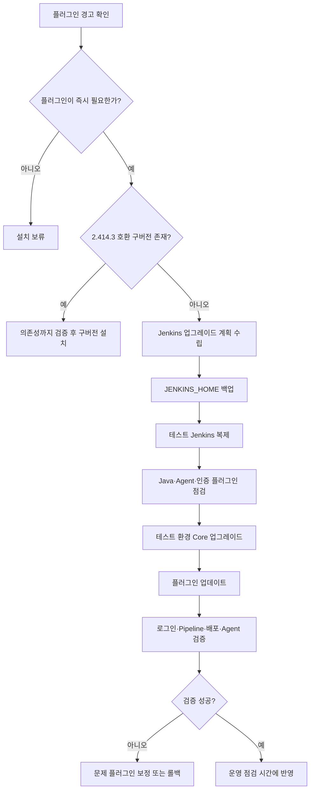
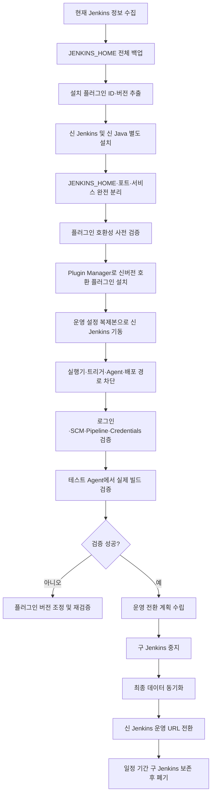
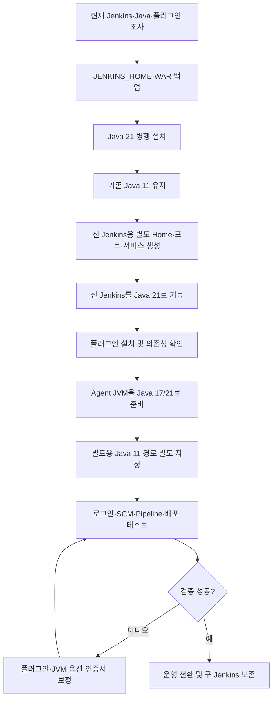

### 결론
해당 경고는 **네트워크 오류가 아니라 Jenkins Core와 플러그인의 최소 요구 버전이 맞지 않는다는 호환성 경고**입니다.
현재 프로젝트 환경이 **Jenkins 2.414.3**이라면 다음 관계입니다.
|구분|버전|
|---|---:|
|현재 Jenkins Core|2.414.3|
|플러그인이 요구하는 최소 Jenkins|2.479.3 이상|
|판정|현재 Jenkins에서 호환성 보장 안 됨|
따라서 최신 플러그인을 바로 설치하면 안 됩니다. 설치 자체가 차단되거나, 설치 후 Jenkins 재시작 시 플러그인이 로딩되지 않거나, 관련 의존 플러그인까지 비활성화될 수 있습니다.
### 경고 발생 원인
Jenkins 플러그인에는 다음과 같은 메타정보가 포함됩니다.
```text
Short-Name: 플러그인 ID
Plugin-Version: 플러그인 버전
Jenkins-Version: 플러그인이 요구하는 최소 Jenkins Core 버전
Plugin-Dependencies: 의존 플러그인과 최소 버전
```
플러그인 관리자는 Update Center에서 받은 메타정보의 `requiredCore` 또는 플러그인 내부의 `Jenkins-Version`을 현재 Jenkins 버전과 비교합니다.
```text
플러그인 요구 Jenkins: 2.479.3
현재 Jenkins:          2.414.3
                       ─────────
결과: 최소 버전 미충족
```
따라서 이 경고가 표시된다는 것은 오히려 Jenkins가 Update Center 메타정보를 어느 정도 정상적으로 읽었다는 의미입니다. 다만 실제 플러그인 파일 다운로드는 별도의 미러 서버로 리다이렉트될 수 있으므로 다운로드 네트워크까지 정상이라는 뜻은 아닙니다. Jenkins는 기본적으로 Update Center 정보를 주기적으로 확인하며 관리자가 수동으로 갱신할 수도 있습니다. citeturn453622search8turn453622search26
### 발생 가능한 장애
호환되지 않는 플러그인을 강제로 설치하면 다음 문제가 발생할 수 있습니다.
|문제|대표 증상|
|---|---|
|플러그인 로딩 실패|`Failed Loading plugin`|
|Core 버전 부족|`Jenkins 2.479.3 or higher required`|
|Java 버전 부족|`UnsupportedClassVersionError`|
|API 불일치|`NoSuchMethodError`, `ClassNotFoundException`|
|의존 플러그인 불일치|해당 플러그인과 연결된 플러그인들이 연쇄 비활성화|
|인증 플러그인 장애|Jenkins 로그인 불가|
|에이전트 연결 장애|Agent offline, Remoting version 오류|
|Pipeline 장애|기존에는 정상인 Jenkinsfile이 실행 중 실패|
특히 Jenkins 2.479.x는 Java 17 이상을 요구하며, Spring Security 6, Spring Framework 6, Jakarta EE 9 기반 변경이 포함됐습니다. LDAP, Reverse Proxy Auth, CAS, Windows SSO 등의 인증 플러그인은 Jenkins Core와 함께 특정 버전으로 올려야 하는 주의사항도 있습니다. citeturn453622search4turn453622search5turn864000search2
### 대응 방법
|대응|적용 상황|권장도|
|---|---|---:|
|Jenkins Core 업그레이드|장기 운영 및 보안 업데이트가 필요한 경우|가장 권장|
|현재 Core와 호환되는 구버전 플러그인 설치|Jenkins를 당장 올릴 수 없는 경우|단기 대응|
|해당 플러그인 설치 보류|필수 플러그인이 아닌 경우|안전|
|경고를 무시하고 최신 버전 강제 설치|어떤 경우에도 비권장|금지 수준|
#### 방법 1. 호환 가능한 이전 플러그인 버전 설치
Jenkins Core를 즉시 업그레이드하기 어렵다면 플러그인 사이트의 버전 이력에서 다음 조건을 모두 만족하는 버전을 찾아야 합니다.
```text
플러그인 Jenkins-Version <= 2.414.3
모든 의존 플러그인 Jenkins-Version <= 2.414.3
현재 설치된 의존 플러그인 버전 >= 요구 버전
```
Update Center JSON에서 플러그인의 요구사항을 확인할 수 있습니다.
```bash
PLUGIN_ID="git"
curl -fsSL \
  https://updates.jenkins.io/update-center.actual.json \
  | jq --arg id "$PLUGIN_ID" \
  '.plugins[$id] | {
      name,
      version,
      requiredCore,
      dependencies
   }'
```
`update-center.json`은 JSONP 형식이고, 명령어 분석에는 일반 JSON인 `update-center.actual.json`이 적합합니다. citeturn453622search8
다운로드한 플러그인 파일에서도 직접 확인할 수 있습니다.
```bash
PLUGIN_FILE="/tmp/example-plugin.hpi"
unzip -p "$PLUGIN_FILE" META-INF/MANIFEST.MF \
  | egrep '^(Short-Name|Plugin-Version|Jenkins-Version|Plugin-Dependencies):'
```
예상 출력:
```text
Short-Name: example-plugin
Plugin-Version: 1.20.0
Jenkins-Version: 2.479.3
Plugin-Dependencies: credentials:1408...,workflow-step-api:...
```
단, 구버전 플러그인은 최신 보안 패치가 적용되지 않을 수 있으므로 영구적인 해결책으로 사용하기 어렵습니다.
#### 방법 2. Jenkins Core 업그레이드
현재 2.414.3에서 최소 2.479.3 이상으로 올리려면 Jenkins Core만 교체해서는 안 됩니다.
Jenkins 2.479.x부터 Controller와 Agent 모두 Java 17 이상이 필요합니다. 또한 Spring 6와 Jakarta EE 9 전환에 따른 플러그인 호환성 점검이 필요합니다. Jenkins 공식 가이드는 Core 업그레이드 전후에 플러그인을 각각 업데이트하고, 건너뛰는 모든 LTS 구간의 업그레이드 가이드를 확인하도록 권장합니다. citeturn453622search5turn453622search10turn864000search2
2026년 7월 기준 최신 LTS 계열인 2.555.x는 Java 21 또는 Java 25가 필요하므로, 단순히 “최신 LTS로 바로 변경”하기보다 Java 및 플러그인 호환성을 포함한 별도 전환 계획이 필요합니다. citeturn864000search1
### 업그레이드 전에 반드시 확인할 사항
#### 1. 현재 Jenkins·Java 실행 정보
```bash
java -version
ps -ef | grep -i '[j]enkins'
systemctl status jenkins
systemctl cat jenkins
systemctl show jenkins -p Environment
```
Jenkins HTTP 응답 헤더로 버전을 확인할 수도 있습니다.
```bash
curl -sI http://127.0.0.1:8080/login \
  | grep -iE '^(X-Jenkins|X-Hudson):'
```
확인해야 할 항목:
|항목|확인 내용|
|---|---|
|Jenkins Core|정확한 버전|
|Controller Java|Java 11, 17, 21 중 무엇인지|
|JAVA_HOME|실제 Jenkins 서비스가 참조하는 경로|
|실행 방식|RPM/DEB, WAR, Docker, Tomcat 등|
|JENKINS_HOME|실제 데이터 디렉터리|
|서비스 계정|일반적으로 `jenkins`|
|JVM 옵션|Heap, Proxy, TLS, 추가 `--add-opens` 설정|
주의할 점은 로그인 쉘에서 실행한 `java -version`과 Jenkins 서비스가 사용하는 Java가 다를 수 있다는 것입니다. 반드시 `systemctl cat`, 실행 프로세스, `/proc` 정보를 함께 확인해야 합니다.
```bash
PID=$(pgrep -f 'jenkins.war' | head -1)
readlink -f /proc/"$PID"/exe
tr '\0' '\n' < /proc/"$PID"/environ \
  | grep -E '^(JAVA_HOME|JENKINS_HOME|HTTP_PROXY|HTTPS_PROXY|NO_PROXY)='
```
#### 2. Agent Java 및 연결 방식
Jenkins 2.479.x 업그레이드 시 Controller뿐 아니라 Agent도 Java 17 이상이어야 합니다. 또한 최소 Remoting 버전이 올라가므로 오래된 `agent.jar`를 사용하는 Agent는 접속이 거부될 수 있습니다. citeturn453622search5turn864000search2
각 Agent에서 확인합니다.
```bash
java -version
ps -ef | grep -E '[a]gent.jar|[r]emoting'
```
확인 대상:
|Agent 방식|확인 사항|
|---|---|
|SSH Agent|원격 서버 기본 Java 경로|
|Inbound Agent|`agent.jar` 실행 Java와 agent.jar 버전|
|Docker Agent|Agent 이미지 내부 Java 버전|
|Kubernetes Agent|Pod Template의 Agent 이미지|
|Windows Agent|Windows Service가 사용하는 Java 경로|
#### 3. 전체 플러그인 목록 백업
Jenkins 관리 화면의 Script Console에서 다음 스크립트로 플러그인 목록을 추출할 수 있습니다.
```groovy
Jenkins.get().pluginManager.plugins
    .sort { it.shortName }
    .each { p ->
        println String.format(
            "%-45s %-25s enabled=%s active=%s",
            p.shortName,
            p.version,
            p.isEnabled(),
            p.isActive()
        )
    }
```
Linux 파일 수준에서도 보관합니다.
```bash
JENKINS_HOME="/var/lib/jenkins"
find "$JENKINS_HOME/plugins" -maxdepth 1 \
  \( -name '*.jpi' -o -name '*.hpi' \) \
  -printf '%f\n' | sort \
  > /tmp/jenkins-plugin-files.txt
```
특히 우선 점검할 플러그인은 다음과 같습니다.
```text
LDAP / Active Directory / SSO
Git / Git Client / GitLab
Credentials / SSH Credentials
Pipeline / Workflow 계열
Mailer / Email Extension
Role Strategy / Matrix Authorization
Configuration as Code
Docker / Kubernetes
Maven / Gradle / SonarQube
배포 관련 사내 플러그인
```
#### 4. 인증 방식 확인
Jenkins 업그레이드에서 가장 위험한 장애는 로그인 자체가 불가능해지는 경우입니다.
```text
Manage Jenkins
→ Security
→ Security Realm
→ Authorization
```
확인해야 할 항목:
|항목|예시|
|---|---|
|Security Realm|LDAP, Active Directory, Jenkins 자체 사용자|
|Authorization|Matrix, Role Strategy|
|Reverse Proxy 인증|Nginx/Apache에서 사용자 헤더 전달 여부|
|SSO|CAS, SAML, OAuth, Windows SSO|
|비상 관리자 계정|외부 LDAP 장애 시 로그인 가능한 로컬 계정|
Jenkins 2.479.x 업그레이드 가이드에는 LDAP, Reverse Proxy Auth, CAS, Windows Negotiate SSO 플러그인에 대한 동시 업그레이드 요구사항이 명시돼 있습니다. citeturn864000search2
#### 5. JENKINS_HOME 전체 백업
최소한 다음 항목이 포함돼야 합니다.
```text
config.xml
credentials.xml
secrets/
jobs/
nodes/
plugins/
users/
userContent/
fingerprints/
특수 플러그인의 별도 설정 파일
```
서비스를 중지한 일관된 백업이 가장 안전합니다.
```bash
sudo systemctl stop jenkins
sudo tar -C /var/lib \
  -czpf /backup/jenkins-home-$(date +%Y%m%d-%H%M).tar.gz \
  jenkins
sudo systemctl start jenkins
```
백업 파일 검증:
```bash
tar -tzf /backup/jenkins-home-YYYYMMDD-HHMM.tar.gz >/dev/null
sha256sum /backup/jenkins-home-YYYYMMDD-HHMM.tar.gz
```
Jenkins 공식 Java 업그레이드 문서도 `JENKINS_HOME` 백업, 백업을 사용한 테스트 업그레이드, 테스트 성공 후 운영 반영 순서를 권장합니다. citeturn453622search30turn453622search9
#### 6. 디스크·메모리·권한
```bash
df -h
df -i
free -m
ulimit -a
ls -ld /var/lib/jenkins
du -sh /var/lib/jenkins
```
다음 공간이 필요합니다.
```text
JENKINS_HOME 백업 공간
플러그인 다운로드 임시 공간
Core WAR/RPM 교체 공간
업그레이드 후 로그 증가 공간
롤백용 기존 WAR 및 플러그인 보관 공간
```
### 서버 네트워크 확인 방법
플러그인 설치는 Jenkins Controller 서버가 외부 Jenkins Update Center에 접근하는 구조입니다. 사용자 PC 브라우저에서 Jenkins 사이트가 열리는지 여부는 플러그인 다운로드 가능 여부와 관계가 없습니다.
#### 1. Jenkins 서비스 계정으로 DNS 확인
```bash
sudo -u jenkins getent ahosts updates.jenkins.io
```
정상 예:
```text
104.xxx.xxx.xxx STREAM updates.jenkins.io
```
오류 해석:
|결과|원인|
|---|---|
|출력 없음|DNS 설정 또는 DNS 방화벽 문제|
|`Temporary failure in name resolution`|DNS 서버 접근 실패|
|IP 정상 출력|DNS 단계 정상|
#### 2. TCP 443 포트 확인
```bash
sudo -u jenkins nc -vz -w 5 updates.jenkins.io 443
```
`nc`가 없다면:
```bash
sudo -u jenkins timeout 5 bash -c \
  'cat < /dev/null > /dev/tcp/updates.jenkins.io/443' \
  && echo "TCP 443 OK" \
  || echo "TCP 443 FAIL"
```
#### 3. Update Center HTTPS 확인
```bash
sudo -u jenkins curl -fsSIL --max-time 15 \
  https://updates.jenkins.io/update-center.json
```
본문 다운로드까지 확인:
```bash
sudo -u jenkins curl -fsSL --max-time 30 \
  https://updates.jenkins.io/update-center.actual.json \
  -o /tmp/update-center.actual.json
jq '.updateCenterVersion' /tmp/update-center.actual.json
```
Jenkins 기본 Update Center 주소는 다음입니다. citeturn453622search8
```text
https://updates.jenkins.io/update-center.json
```
#### 4. 플러그인 파일과 리다이렉트 확인
플러그인 파일은 실제 미러 서버로 리다이렉트될 수 있습니다.
```bash
PLUGIN_ID="git"
sudo -u jenkins curl -IL --max-time 30 \
  "https://updates.jenkins.io/latest/${PLUGIN_ID}.hpi"
```
다운로드까지 검증:
```bash
sudo -u jenkins curl -fL --max-time 60 \
  "https://updates.jenkins.io/latest/${PLUGIN_ID}.hpi" \
  -o "/tmp/${PLUGIN_ID}.hpi"
file "/tmp/${PLUGIN_ID}.hpi"
unzip -t "/tmp/${PLUGIN_ID}.hpi"
```
방화벽에 `updates.jenkins.io`만 허용하면 첫 연결은 성공하지만, 이후 리다이렉트되는 지역 미러 서버가 차단돼 다운로드가 실패할 수 있습니다. Jenkins 다운로드 서버는 여러 미러를 선택하여 파일을 전달합니다. citeturn534269search1turn534269search4
따라서 방화벽에서는 다음을 확인해야 합니다.
```text
updates.jenkins.io:443
curl -IL 결과의 Location 헤더에 표시되는 실제 미러 도메인:443
OS 패키지 방식으로 Core를 업그레이드한다면 Jenkins 패키지 저장소 도메인:443
```
#### 5. TLS 인증서 확인
```bash
openssl s_client \
  -connect updates.jenkins.io:443 \
  -servername updates.jenkins.io \
  </dev/null 2>/dev/null \
  | openssl x509 -noout -subject -issuer -dates
```
Java TrustStore 기준 확인:
```bash
keytool -list -cacerts -storepass changeit \
  | head
```
사내 SSL Inspection 장비가 있는 경우 `curl`은 정상인데 Jenkins Java에서 다음 오류가 날 수 있습니다.
```text
javax.net.ssl.SSLHandshakeException
PKIX path building failed
unable to find valid certification path
```
이 경우 사내 Proxy 또는 SSL Inspection 장비의 Root CA를 Jenkins가 사용하는 Java TrustStore에 추가해야 합니다. 단, 운영 Java의 기본 `cacerts`를 바로 수정하기보다 별도 TrustStore를 만들어 JVM 옵션으로 지정하는 방식이 관리상 안전합니다.
```bash
keytool -importcert \
  -alias company-proxy-root \
  -file company-proxy-root.crt \
  -keystore /etc/jenkins/jenkins-truststore.jks
```
Jenkins JVM 옵션 예:
```text
-Djavax.net.ssl.trustStore=/etc/jenkins/jenkins-truststore.jks
-Djavax.net.ssl.trustStorePassword=********
```
#### 6. Proxy 설정 확인
운영 서버가 외부 인터넷에 직접 연결되지 않는다면 Jenkins 관리 화면에서 Proxy 설정이 필요합니다.
```text
Jenkins 관리
→ 플러그인 관리
→ 고급 설정
→ HTTP Proxy Configuration
```
확인 대상:
```text
Proxy Host
Proxy Port
Username
Password
No Proxy Host
Test URL
```
OS 환경변수 확인:
```bash
env | grep -i proxy
systemctl show jenkins -p Environment \
  | grep -i proxy
```
Proxy를 직접 이용한 테스트:
```bash
sudo -u jenkins curl -x http://PROXY_IP:PROXY_PORT \
  -fsSIL https://updates.jenkins.io/update-center.json
```
Proxy 인증이 있다면:
```bash
sudo -u jenkins curl \
  -x http://PROXY_IP:PROXY_PORT \
  -U 'USER:PASSWORD' \
  -fsSIL https://updates.jenkins.io/update-center.json
```
운영 명령 이력에 비밀번호가 남을 수 있으므로 실제 비밀번호를 명령행에 직접 입력하는 방식은 테스트 후 즉시 폐기해야 합니다.
#### 7. Jenkins 로그 확인
RPM/DEB 설치:
```bash
journalctl -u jenkins --since "1 hour ago" \
  | egrep -i \
  'update|plugin|proxy|SSL|PKIX|UnknownHost|ConnectException|timeout|403|407'
```
실시간 확인:
```bash
journalctl -fu jenkins
```
Docker:
```bash
docker logs --since 1h -f jenkins
```
Tomcat:
```bash
tail -f /경로/tomcat/logs/catalina.out
```
대표 오류별 원인:
|오류|추정 원인|
|---|---|
|`UnknownHostException`|DNS 장애|
|`Connect timed out`|방화벽, 라우팅, Proxy 미설정|
|`Connection refused`|Proxy 또는 목적지 포트 거부|
|`407 Proxy Authentication Required`|Proxy 인증정보 오류|
|`403 Forbidden`|방화벽·보안장비 정책 차단|
|`PKIX path building failed`|Java TrustStore에 인증서 없음|
|`SSLHandshakeException`|TLS 버전 또는 인증서 문제|
|`Read timed out`|Proxy 지연, 패킷 손실, 회선 문제|
|302 이후 다운로드 실패|리다이렉트된 미러 도메인 차단|
|`Jenkins 2.479.3 or higher required`|네트워크가 아닌 Core 버전 불일치|
### Jenkins 2.414.3 환경의 권장 대응 순서

실무적으로는 다음 순서가 가장 안전합니다.
1. 현재 최신 플러그인은 설치하지 않습니다.
2. 해당 플러그인의 ID와 요구 Core 버전, 의존성을 확인합니다.
3. Jenkins 2.414.3에서 동작하는 마지막 플러그인 버전이 있으면 단기적으로 사용합니다.
4. `JENKINS_HOME`을 복제하여 별도의 테스트 Jenkins를 만듭니다.
5. 최소 2.479.3을 목표로 한다면 Controller와 Agent Java를 17 이상으로 준비합니다.
6. LDAP·SSO·권한·GitLab·Pipeline 계열 플러그인을 우선 점검합니다.
7. 로그인, GitLab Webhook, SCM Checkout, Credentials, Pipeline, 빌드, 배포, Agent 재접속을 모두 테스트합니다.
8. 운영 반영 전 복구 가능한 Core 파일과 `JENKINS_HOME` 백업을 확보합니다.
### 최종 판단
|상황|판단|
|---|---|
|경고만 표시되고 플러그인을 설치하지 않음|즉시 장애 없음|
|최신 플러그인을 강제로 설치|위험|
|구버전 플러그인 설치|Core·의존성 검증 후 가능|
|Jenkins 2.479.3으로 업그레이드|Java 17, Agent, 인증 플러그인 동시 검토 필요|
|최신 LTS로 직접 업그레이드|별도 테스트 환경과 단계별 호환성 검증 필수|
|Update Center 접속 테스트 성공|메타정보 접근 정상|
|실제 플러그인 다운로드 실패|Proxy, TLS, 미러 리다이렉트, 방화벽 추가 점검|
가장 중요한 원칙은 **플러그인 하나를 설치하기 위해 운영 Jenkins Core를 즉시 올리지 않고, 먼저 현재 Core와 호환되는 플러그인 버전 존재 여부를 확인하는 것**입니다. 플러그인명과 현재 Controller·Agent의 Java 버전을 기준으로 정확한 호환 버전과 업그레이드 영향 범위를 별도로 산출할 수 있습니다.

## 플러그 인 확인 및 신버전 설치 방법
### 결론

한 서버에 Jenkins 구버전과 신버전을 동시에 실행할 수 있습니다. 다만 다음 항목을 반드시 분리해야 합니다.

| 분리 대상                                                                                                                                                                                       | 구버전 예시                 | 신버전 예시                 |
| ------------------------------------------------------------------------------------------------------------------------------------------------------------------------------------------- | ---------------------- | ---------------------- |
| 서비스명                                                                                                                                                                                        | `jenkins-old`          | `jenkins-new`          |
| JENKINS_HOME                                                                                                                                                                                | `/var/lib/jenkins-old` | `/var/lib/jenkins-new` |
| HTTP 포트                                                                                                                                                                                     | `8080`                 | `8180`                 |
| Java                                                                                                                                                                                        | Java 11 또는 17          | 대상 Jenkins가 요구하는 Java  |
| WAR 파일                                                                                                                                                                                      | `jenkins-2.414.3.war`  | 신버전 `jenkins.war`      |
| 로그                                                                                                                                                                                          | `jenkins-old.log`      | `jenkins-new.log`      |
| Agent 연결                                                                                                                                                                                    | 운영 Agent               | 테스트 Agent 또는 연결 차단     |
| Reverse Proxy URL                                                                                                                                                                           | 기존 URL                 | 별도 테스트 URL             |
| 동일한 `JENKINS_HOME`을 두 Jenkins가 동시에 사용하면 안 됩니다. Jenkins WAR 실행 시 `JENKINS_HOME`과 `--httpPort`를 별도로 지정할 수 있으므로, 병행 검증은 패키지 중복 설치보다 **별도 WAR와 별도 systemd 서비스로 구성하는 방식**이 안전합니다. ([Jenkins][1]) |                        |                        |

### 1. 현재 Jenkins 기본 정보 확인

```bash
# 실행 중인 Jenkins 프로세스
ps -ef | grep -i '[j]enkins'
# systemd 서비스 상태
sudo systemctl status jenkins
sudo systemctl cat jenkins
# 실제 실행 Java 확인
PID=$(pgrep -f 'jenkins.war' | head -1)
readlink -f /proc/"$PID"/exe
tr '\0' '\n' < /proc/"$PID"/environ \
  | grep -E '^(JAVA_HOME|JENKINS_HOME|JENKINS_WAR|JENKINS_PORT|HTTP_PORT)='
# Jenkins HTTP 헤더에서 버전 확인
curl -sI http://127.0.0.1:8080/login \
  | grep -iE '^(X-Jenkins|X-Hudson):'
# 설치 패키지 확인
rpm -qa | grep -i jenkins       # RHEL/CentOS/Rocky
dpkg -l | grep -i jenkins       # Ubuntu/Debian
```

Jenkins 2.414.3은 Jenkins Java 지원 정책상 Java 11 또는 17 계열에서 운용되는 경우가 일반적입니다. 반면 Jenkins 2.479.1 이상 계열은 Java 17 또는 21이 필요합니다. Controller뿐 아니라 Jenkins CLI 및 Agent에도 Java 요구사항이 적용됩니다. ([Jenkins][2])

### 2. 현재 설치된 플러그인 목록 확인

#### 2.1 플러그인 파일명만 확인

```bash
JENKINS_HOME=/var/lib/jenkins
find "$JENKINS_HOME/plugins" -maxdepth 1 \
  \( -name '*.jpi' -o -name '*.hpi' \) \
  -printf '%f\n' | sort
```

#### 2.2 플러그인 ID와 버전 확인

플러그인 파일의 `META-INF/MANIFEST.MF`에서 다음 정보를 읽을 수 있습니다.

```bash
JENKINS_HOME=/var/lib/jenkins
for plugin in "$JENKINS_HOME"/plugins/*.{jpi,hpi}; do
  [ -f "$plugin" ] || continue
  manifest=$(unzip -p "$plugin" META-INF/MANIFEST.MF 2>/dev/null | tr -d '\r')
  id=$(printf '%s\n' "$manifest" |
       sed -n 's/^Short-Name: //p' | head -1)
  version=$(printf '%s\n' "$manifest" |
            sed -n 's/^Plugin-Version: //p' | head -1)
  required=$(printf '%s\n' "$manifest" |
             sed -n 's/^Jenkins-Version: //p' | head -1)
  printf '%-45s %-28s required-core=%s\n' \
    "${id:-$(basename "$plugin")}" \
    "${version:-UNKNOWN}" \
    "${required:-UNKNOWN}"
done | sort
```

CSV 파일로 저장:

```bash
JENKINS_HOME=/var/lib/jenkins
OUTPUT=/tmp/jenkins-plugins.csv
echo '"plugin_id","version","required_core","file"' > "$OUTPUT"
for plugin in "$JENKINS_HOME"/plugins/*.{jpi,hpi}; do
  [ -f "$plugin" ] || continue
  manifest=$(unzip -p "$plugin" META-INF/MANIFEST.MF 2>/dev/null | tr -d '\r')
  id=$(printf '%s\n' "$manifest" |
       sed -n 's/^Short-Name: //p' | head -1)
  version=$(printf '%s\n' "$manifest" |
            sed -n 's/^Plugin-Version: //p' | head -1)
  required=$(printf '%s\n' "$manifest" |
             sed -n 's/^Jenkins-Version: //p' | head -1)
  printf '"%s","%s","%s","%s"\n' \
    "$id" "$version" "$required" "$(basename "$plugin")" >> "$OUTPUT"
done
column -s, -t "$OUTPUT" | less -S
```

#### 2.3 `plugins.txt` 생성

신규 Jenkins 설치에 사용할 수 있는 `플러그인ID:버전` 형식입니다.

```bash
JENKINS_HOME=/var/lib/jenkins
OUTPUT=/tmp/plugins-old-pinned.txt
: > "$OUTPUT"
for plugin in "$JENKINS_HOME"/plugins/*.{jpi,hpi}; do
  [ -f "$plugin" ] || continue
  manifest=$(unzip -p "$plugin" META-INF/MANIFEST.MF 2>/dev/null | tr -d '\r')
  id=$(printf '%s\n' "$manifest" |
       sed -n 's/^Short-Name: //p' | head -1)
  version=$(printf '%s\n' "$manifest" |
            sed -n 's/^Plugin-Version: //p' | head -1)
  if [ -n "$id" ] && [ -n "$version" ]; then
    printf '%s:%s\n' "$id" "$version"
  fi
done | sort -u > "$OUTPUT"
cat "$OUTPUT"
```

이 목록은 **현재 설치 버전을 그대로 고정한 목록**입니다.
신버전 Jenkins에서는 구 플러그인 버전을 그대로 설치하는 것보다 다음 두 목록을 분리하는 것이 좋습니다.

```text
plugins-old-pinned.txt    현재 설치 버전 보존용
plugins-new-latest.txt    신 Jenkins 호환 최신 버전 설치용
```

### 3. Jenkins 2.414.3보다 높은 Core를 요구하는 플러그인 찾기

현재 Jenkins Core를 `2.414.3`으로 두고 각 플러그인의 `Jenkins-Version`을 비교합니다.

```bash
#!/usr/bin/env bash
set -euo pipefail
JENKINS_HOME="${JENKINS_HOME:-/var/lib/jenkins}"
CURRENT_CORE="${CURRENT_CORE:-2.414.3}"
printf '%-42s %-25s %-18s %s\n' \
  "PLUGIN" "PLUGIN_VERSION" "REQUIRED_CORE" "RESULT"
printf '%-42s %-25s %-18s %s\n' \
  "------" "--------------" "-------------" "------"
find "$JENKINS_HOME/plugins" -maxdepth 1 \
  \( -name '*.jpi' -o -name '*.hpi' \) -print0 |
while IFS= read -r -d '' plugin; do
  manifest=$(unzip -p "$plugin" META-INF/MANIFEST.MF 2>/dev/null |
             tr -d '\r')
  id=$(printf '%s\n' "$manifest" |
       sed -n 's/^Short-Name: //p' | head -1)
  version=$(printf '%s\n' "$manifest" |
            sed -n 's/^Plugin-Version: //p' | head -1)
  required=$(printf '%s\n' "$manifest" |
             sed -n 's/^Jenkins-Version: //p' | head -1)
  [ -n "$id" ] || id=$(basename "$plugin")
  [ -n "$version" ] || version="UNKNOWN"
  if [ -z "$required" ]; then
    result="UNKNOWN"
  elif [ "$(printf '%s\n%s\n' "$CURRENT_CORE" "$required" |
             sort -V | tail -1)" = "$required" ] &&
       [ "$required" != "$CURRENT_CORE" ]; then
    result="INCOMPATIBLE"
  else
    result="OK"
  fi
  printf '%-42s %-25s %-18s %s\n' \
    "$id" "$version" "${required:-UNKNOWN}" "$result"
done | sort
```

실행:

```bash
chmod +x check-plugin-core.sh
sudo -u jenkins \
  JENKINS_HOME=/var/lib/jenkins \
  CURRENT_CORE=2.414.3 \
  ./check-plugin-core.sh
```

불일치 항목만 출력:

```bash
sudo -u jenkins \
  JENKINS_HOME=/var/lib/jenkins \
  CURRENT_CORE=2.414.3 \
  ./check-plugin-core.sh |
grep 'INCOMPATIBLE'
```

이 검사는 플러그인 자체의 최소 Jenkins Core만 비교합니다. 다음 항목까지 모두 검증하는 것은 아닙니다.

| 검사 대상                                                                                     | 위 스크립트 검사 여부 |
| ----------------------------------------------------------------------------------------- | -----------: |
| 플러그인 자체의 `Jenkins-Version`                                                                |           검사 |
| 의존 플러그인 최소 버전                                                                             |          미검사 |
| Java 버전 호환성                                                                               |          미검사 |
| 삭제·중단된 플러그인                                                                               |          미검사 |
| 보안 취약점                                                                                    |          미검사 |
| 신 Jenkins에서 제거된 API 사용                                                                    |          미검사 |
| Jenkins 플러그인은 명시적·암시적 의존성을 가질 수 있으므로 단순 Manifest 비교만으로 전체 호환성을 보장할 수 없습니다. ([Jenkins][3]) |              |

### 4. Jenkins 관리에 유용한 Linux 명령

#### 서비스 및 로그

```bash
sudo systemctl status jenkins
sudo systemctl restart jenkins
sudo systemctl stop jenkins
sudo systemctl start jenkins
sudo journalctl -u jenkins -n 300 --no-pager
sudo journalctl -fu jenkins
sudo journalctl -u jenkins --since "1 hour ago" |
  grep -Ei 'plugin|failed|error|exception|dependency|Jenkins-Version|PKIX'
```

#### 포트 및 프로세스

```bash
sudo ss -lntp | grep -E ':8080|:8180'
sudo lsof -iTCP:8080 -sTCP:LISTEN
ps -eo pid,user,lstart,cmd | grep -i '[j]enkins'
```

#### 디스크 및 inode

```bash
df -h
df -i
du -sh /var/lib/jenkins
du -sh /var/lib/jenkins/{jobs,plugins,workspace,builds} 2>/dev/null
```

#### 플러그인 로딩 실패 파일 확인

Jenkins는 플러그인 로딩 실패 시 `.disabled`, `.bak`, `.pinned` 등의 관련 파일을 남길 수 있습니다.

```bash
find /var/lib/jenkins/plugins -maxdepth 1 \
  \( -name '*.disabled' -o -name '*.bak' -o -name '*.pinned' \) \
  -ls
```

#### 최근 변경된 플러그인 확인

```bash
find /var/lib/jenkins/plugins -maxdepth 1 \
  \( -name '*.jpi' -o -name '*.hpi' \) \
  -printf '%TY-%Tm-%Td %TH:%TM %f\n' |
sort -r |
head -30
```

#### Jenkins 설정 및 플러그인 백업

```bash
sudo systemctl stop jenkins
sudo tar -C /var/lib \
  -czpf "/backup/jenkins-$(date +%Y%m%d-%H%M).tar.gz" \
  jenkins
sudo systemctl start jenkins
sha256sum /backup/jenkins-*.tar.gz
tar -tzf /backup/jenkins-YYYYMMDD-HHMM.tar.gz >/dev/null
```

#### 네트워크 확인

```bash
sudo -u jenkins getent ahosts updates.jenkins.io
sudo -u jenkins nc -vz -w 5 updates.jenkins.io 443
sudo -u jenkins curl -fsSIL --max-time 15 \
  https://updates.jenkins.io/update-center.json
sudo -u jenkins curl -IL --max-time 30 \
  https://updates.jenkins.io/latest/git.hpi
```

### 5. 새 Jenkins 설치 전 Java 선정

대상 Jenkins 버전을 먼저 확정해야 합니다.

| Jenkins 계열                                                                                                                              | 지원 Java             |
| --------------------------------------------------------------------------------------------------------------------------------------- | ------------------- |
| 2.414.3 주변 구버전                                                                                                                          | Java 11 또는 17 환경 가능 |
| 2.479.1 이상                                                                                                                              | Java 17 또는 21       |
| 2.541.1 이상                                                                                                                              | Java 17, 21 또는 25   |
| 2.555.1 이상                                                                                                                              | Java 21 또는 25       |
| 2026년 7월의 최신 Jenkins를 무조건 선택하면 현재 서버의 Java 11 또는 17로 실행되지 않을 수 있습니다. Jenkins 2.479.1 이상을 선택한다면 최소 Java 17을 별도로 준비해야 합니다. ([Jenkins][2]) |                     |
| Java 병행 설치 예:                                                                                                                           |                     |

```bash
# RHEL/Rocky 계열 예
sudo dnf install java-17-openjdk java-17-openjdk-devel
sudo dnf install java-21-openjdk java-21-openjdk-devel
# 설치 Java 확인
ls -l /usr/lib/jvm/
# 기본 Java를 변경하지 않고 특정 Java 직접 사용
/usr/lib/jvm/java-17-openjdk/bin/java -version
/usr/lib/jvm/java-21-openjdk/bin/java -version
```

구 Jenkins가 Java 11을 사용한다면 시스템 기본 Java를 `alternatives`로 일괄 변경하지 말고, 각 systemd 서비스의 `JAVA_HOME`과 실행 경로를 개별 지정하는 것이 안전합니다.

### 6. 구버전·신버전 Jenkins 병행 설치 방법

#### 권장 디렉터리

```bash
sudo mkdir -p /opt/jenkins-old
sudo mkdir -p /opt/jenkins-new
sudo mkdir -p /var/lib/jenkins-old
sudo mkdir -p /var/lib/jenkins-new
sudo mkdir -p /var/log/jenkins-old
sudo mkdir -p /var/log/jenkins-new
sudo chown -R jenkins:jenkins \
  /opt/jenkins-old \
  /opt/jenkins-new \
  /var/lib/jenkins-old \
  /var/lib/jenkins-new \
  /var/log/jenkins-old \
  /var/log/jenkins-new
```

#### 구버전 WAR 보관

```bash
sudo cp /usr/share/java/jenkins.war \
  /opt/jenkins-old/jenkins-2.414.3.war
sudo chown jenkins:jenkins \
  /opt/jenkins-old/jenkins-2.414.3.war
```

#### 신버전 WAR 배치

보안 정책에 따라 승인된 버전을 내려받아 배치합니다.

```bash
sudo cp /tmp/jenkins-new.war \
  /opt/jenkins-new/jenkins.war
sudo chown jenkins:jenkins \
  /opt/jenkins-new/jenkins.war
```

Jenkins는 WAR 파일로 직접 실행할 수 있고 `--httpPort`와 `JENKINS_HOME`을 다르게 설정할 수 있습니다. ([Jenkins][1])

#### 우선 수동 테스트

```bash
sudo -u jenkins env \
  JENKINS_HOME=/var/lib/jenkins-new \
  /usr/lib/jvm/java-17-openjdk/bin/java \
  -jar /opt/jenkins-new/jenkins.war \
  --httpPort=8180
```

확인:

```bash
curl -sI http://127.0.0.1:8180/login |
grep -i X-Jenkins
sudo ss -lntp | grep ':8180'
```

### 7. 신버전 Jenkins systemd 서비스 작성

`/etc/systemd/system/jenkins-new.service`

```ini
[Unit]
Description=Jenkins New Test Controller
After=network-online.target
Wants=network-online.target
[Service]
Type=simple
User=jenkins
Group=jenkins
Environment="JENKINS_HOME=/var/lib/jenkins-new"
Environment="JAVA_HOME=/usr/lib/jvm/java-17-openjdk"
WorkingDirectory=/var/lib/jenkins-new
ExecStart=/usr/lib/jvm/java-17-openjdk/bin/java \
  -Xms1g \
  -Xmx2g \
  -Djava.awt.headless=true \
  -jar /opt/jenkins-new/jenkins.war \
  --httpPort=8180
Restart=on-failure
RestartSec=10
SuccessExitStatus=143
LimitNOFILE=8192
[Install]
WantedBy=multi-user.target
```

적용:

```bash
sudo systemctl daemon-reload
sudo systemctl enable --now jenkins-new
sudo systemctl status jenkins-new
sudo journalctl -fu jenkins-new
```

두 인스턴스 확인:

```bash
sudo systemctl status jenkins jenkins-new
sudo ss -lntp | grep -E ':8080|:8180'
curl -sI http://127.0.0.1:8080/login | grep -i X-Jenkins
curl -sI http://127.0.0.1:8180/login | grep -i X-Jenkins
```

### 8. 구 Jenkins의 플러그인을 신 Jenkins에 설치하는 방법

#### 방법 A. Plugin Installation Manager 사용

Jenkins Plugin Installation Manager는 플러그인 목록을 입력받아 의존성을 재귀적으로 계산하고 대상 Jenkins WAR에 맞게 플러그인을 내려받습니다. `--plugin-file`, `--war`, `--plugin-download-directory`, `--list`, `--available-updates` 등을 지원합니다. ([GitHub][4])
먼저 구 Jenkins의 설치 목록을 생성합니다.

```bash
JENKINS_HOME=/var/lib/jenkins-old
PLUGIN_FILE=/tmp/plugins-old-pinned.txt
: > "$PLUGIN_FILE"
for plugin in "$JENKINS_HOME"/plugins/*.{jpi,hpi}; do
  [ -f "$plugin" ] || continue
  manifest=$(unzip -p "$plugin" META-INF/MANIFEST.MF 2>/dev/null |
             tr -d '\r')
  id=$(printf '%s\n' "$manifest" |
       sed -n 's/^Short-Name: //p' | head -1)
  version=$(printf '%s\n' "$manifest" |
            sed -n 's/^Plugin-Version: //p' | head -1)
  [ -n "$id" ] && [ -n "$version" ] &&
    printf '%s:%s\n' "$id" "$version"
done | sort -u > "$PLUGIN_FILE"
```

Plugin Manager JAR 준비 후 검사:

```bash
PLUGIN_MANAGER=/opt/jenkins-tools/jenkins-plugin-manager.jar
NEW_WAR=/opt/jenkins-new/jenkins.war
NEW_PLUGIN_DIR=/var/lib/jenkins-new/plugins
sudo -u jenkins java -jar "$PLUGIN_MANAGER" \
  --war "$NEW_WAR" \
  --plugin-download-directory /tmp/jenkins-plugin-validation \
  --plugin-file /tmp/plugins-old-pinned.txt \
  --list \
  --no-download \
  --verbose
```

운영 플러그인 디렉터리를 조회용 대상으로 직접 지정하지 않는 것이 안전합니다. Plugin Installation Manager의 다운로드 디렉터리 처리 옵션은 버전에 따라 디렉터리를 정리할 수 있으므로 `/tmp` 검증 디렉터리를 사용한 후 실제 경로로 설치해야 합니다. 최신 도구는 `--clean-download-directory`를 명시할 때 디렉터리를 정리하지만, 과거 버전에는 `--list` 사용 시 다운로드 디렉터리를 지우던 이력도 있었습니다. ([GitHub][4])

#### 방법 B. 신 Jenkins용 최신 호환 플러그인 설치

구버전 플러그인 버전을 그대로 설치하는 대신 플러그인 ID만 추출합니다.

```bash
cut -d: -f1 /tmp/plugins-old-pinned.txt \
  | sort -u \
  > /tmp/plugins-new-latest.txt
```

예:

```text
git
git-client
credentials
workflow-aggregator
mailer
configuration-as-code
```

신 Jenkins WAR 기준으로 플러그인과 의존성을 다운로드:

```bash
sudo systemctl stop jenkins-new
sudo -u jenkins java -jar "$PLUGIN_MANAGER" \
  --war /opt/jenkins-new/jenkins.war \
  --plugin-download-directory /var/lib/jenkins-new/plugins \
  --plugin-file /tmp/plugins-new-latest.txt \
  --latest true \
  --verbose
sudo chown -R jenkins:jenkins /var/lib/jenkins-new/plugins
sudo systemctl start jenkins-new
sudo journalctl -u jenkins-new -n 300 --no-pager
```

플러그인 업데이트 가능 버전만 조회:

```bash
sudo -u jenkins java -jar "$PLUGIN_MANAGER" \
  --war /opt/jenkins-new/jenkins.war \
  --plugin-file /tmp/plugins-old-pinned.txt \
  --available-updates \
  --output txt \
  --no-download
```

신 Jenkins용 플러그인 목록 저장:

```bash
sudo -u jenkins java -jar "$PLUGIN_MANAGER" \
  --war /opt/jenkins-new/jenkins.war \
  --plugin-file /tmp/plugins-old-pinned.txt \
  --available-updates \
  --output txt \
  --no-download \
  > /tmp/plugins-new-versions.txt
```

#### 버전 고정 설치 권장

검증이 끝나면 `latest` 대신 정확한 버전을 기록합니다.

```text
git:5.x.x
git-client:6.x.x
credentials:14xx.xxxxx
workflow-aggregator:6xx.xxxxx
```

Plugin Installation Manager는 요청 플러그인의 의존성을 분석하고 필요한 플러그인을 함께 내려받지만, 운영 환경에서는 검증된 플러그인 버전을 고정하는 것이 재현성과 롤백 측면에서 유리합니다. ([GitHub][4])

### 9. 단순 플러그인 파일 복사를 권장하지 않는 이유

다음과 같은 직접 복사는 가능하지만 마이그레이션의 최종 방법으로 권장하지 않습니다.

```bash
cp -a /var/lib/jenkins-old/plugins/. \
      /var/lib/jenkins-new/plugins/
```

문제점:

| 문제                             | 내용                                     |
| ------------------------------ | -------------------------------------- |
| 구버전 고정                         | 신 Jenkins에서 너무 오래된 플러그인이 로딩될 수 있음      |
| 의존성 충돌                         | 일부 플러그인만 업데이트되면 버전 관계가 깨짐              |
| 비활성 파일 복사                      | `.disabled`, `.bak`, `.pinned`까지 복사 가능 |
| 캐시 복사                          | 불필요한 추출 디렉터리 및 임시 파일 포함                |
| 보안 취약점                         | 기존 취약 플러그인을 그대로 이관                     |
| 정말 복사해야 한다면 원본 플러그인 파일만 제한합니다. |                                        |

```bash
find /var/lib/jenkins-old/plugins -maxdepth 1 \
  \( -name '*.jpi' -o -name '*.hpi' \) \
  -exec cp -p {} /var/lib/jenkins-new/plugins/ \;
sudo chown -R jenkins:jenkins /var/lib/jenkins-new/plugins
```

이 방법은 일차 기동 확인용으로만 사용하고, 이후 Plugin Installation Manager를 사용해 신 Jenkins 호환 버전으로 다시 구성해야 합니다.

### 10. JENKINS_HOME을 복제하여 마이그레이션 테스트하는 방법

플러그인뿐 아니라 Job, Credentials, Node, View, Global 설정까지 검증하려면 구 Jenkins의 `JENKINS_HOME` 복제본으로 신 Jenkins를 기동하는 방법이 현실적입니다.

#### 안전한 복제

```bash
sudo systemctl stop jenkins
sudo rsync -aHAX --numeric-ids \
  /var/lib/jenkins-old/ \
  /var/lib/jenkins-new/
sudo systemctl start jenkins
sudo chown -R jenkins:jenkins /var/lib/jenkins-new
```

구 Jenkins를 중지할 수 없다면 스냅샷 또는 백업 솔루션을 사용하는 것이 좋습니다. 실행 중인 상태에서 단순 복사하면 빌드 기록이나 큐 상태의 일관성이 깨질 수 있습니다.

#### 매우 중요한 주의

신 Jenkins가 복제된 설정으로 시작되면 다음 작업을 실제로 수행할 수 있습니다.

```text
SCM Polling
Cron Pipeline
Webhook 수신
운영 서버 배포
운영 DB 변경
메일·메신저 발송
Agent 자동 연결
Artifact 업로드
SonarQube 분석
```

따라서 최초 기동 전 최소한 다음 중 하나를 적용해야 합니다.

1. 신 Jenkins 서버의 외부 네트워크와 배포 대상 접근 차단
2. Reverse Proxy에 등록하지 않음
3. Agent 포트 및 Agent 연결 차단
4. Job 트리거 설정 비활성화
5. 신 Jenkins의 실행기 수를 0으로 설정
6. 테스트 전용 Credentials로 교체
   신 Jenkins 기동 직후 Quiet Down:

```bash
curl -X POST \
  -u 'admin:API_TOKEN' \
  'http://127.0.0.1:8180/quietDown'
```

Quiet Down 해제:

```bash
curl -X POST \
  -u 'admin:API_TOKEN' \
  'http://127.0.0.1:8180/cancelQuietDown'
```

Quiet Down은 신규 빌드 시작을 억제하지만 모든 플러그인의 자체 스케줄러나 외부 동작을 완전히 차단한다고 보장할 수 없습니다. 네트워크 차단을 함께 적용하는 것이 안전합니다.

### 11. 한 서버에서 병행 설치할 때 주의할 점

#### 11.1 같은 JENKINS_HOME 사용 금지

```bash
# 잘못된 예
JENKINS_HOME=/var/lib/jenkins java -jar old.war --httpPort=8080
JENKINS_HOME=/var/lib/jenkins java -jar new.war --httpPort=8180
```

포트가 달라도 설정·빌드 큐·Credentials·플러그인 파일을 동시에 수정하므로 데이터 손상 위험이 있습니다.

#### 11.2 같은 포트 사용 금지

```bash
sudo ss -lntp | grep -E ':8080|:8180'
```

HTTP 외에도 Agent TCP 포트가 고정돼 있다면 별도로 충돌 여부를 확인해야 합니다.

#### 11.3 동일 Agent를 두 Controller에 연결하지 않기

동일한 Agent 작업 디렉터리를 양쪽 Jenkins가 함께 사용하면 다음 문제가 발생할 수 있습니다.

```text
workspace 충돌
동시 Git checkout
빌드 산출물 덮어쓰기
Maven·Gradle 캐시 충돌
배포 작업 중복 실행
```

신 Jenkins에서는 별도 Agent 또는 별도 Remote Root Directory를 사용합니다.

```text
/var/lib/jenkins-agent-old
/var/lib/jenkins-agent-new
```

#### 11.4 동일 Reverse Proxy Context 충돌

```nginx
location /jenkins-old/ {
    proxy_pass http://127.0.0.1:8080;
}
location /jenkins-new/ {
    proxy_pass http://127.0.0.1:8180;
}
```

테스트 중에는 신 Jenkins를 외부에 노출하지 않고 `127.0.0.1:8180`에만 바인딩하는 것이 더 안전합니다.

```bash
java -jar jenkins.war \
  --httpListenAddress=127.0.0.1 \
  --httpPort=8180
```

#### 11.5 메모리 부족

두 Jenkins Controller가 동시에 실행되면 Heap, Metaspace, 플러그인 클래스 로딩 메모리가 각각 필요합니다.

```bash
free -h
ps -eo pid,rss,vsz,cmd |
grep -i '[j]enkins'
```

예:

```text
구 Jenkins: -Xms1g -Xmx2g
신 Jenkins: -Xms1g -Xmx2g
```

OS와 빌드 프로세스 메모리까지 고려하지 않고 각각 `-Xmx2g`를 지정하면 메모리 부족과 Swap 증가가 발생할 수 있습니다.

#### 11.6 동일 패키지로 두 버전 설치하지 않기

`dnf install jenkins` 또는 `apt install jenkins` 패키지는 일반적으로 단일 패키지·단일 서비스·단일 기본 경로를 관리합니다. 동일 패키지 이름으로 두 버전을 병행 관리하기보다는 다음 조합이 좋습니다.

```text
구버전: 기존 RPM/DEB 서비스
신버전: 별도 WAR + 별도 systemd 서비스
```

### 12. 권장 마이그레이션 절차



### 최종 권장 구성

| 항목                                                                                                                                                                                       | 권장안                                 |
| ---------------------------------------------------------------------------------------------------------------------------------------------------------------------------------------- | ----------------------------------- |
| 구 Jenkins                                                                                                                                                                                | 현재 RPM/DEB 설치 유지                    |
| 신 Jenkins                                                                                                                                                                                | 별도 WAR 및 별도 systemd 서비스             |
| 구 Jenkins Home                                                                                                                                                                           | `/var/lib/jenkins-old`              |
| 신 Jenkins Home                                                                                                                                                                           | `/var/lib/jenkins-new`              |
| 구 포트                                                                                                                                                                                     | `8080`                              |
| 신 포트                                                                                                                                                                                     | `8180`, 가능하면 localhost만 바인딩         |
| 플러그인 목록                                                                                                                                                                                  | Manifest에서 `ID:버전` 추출               |
| 플러그인 설치                                                                                                                                                                                  | Jenkins Plugin Installation Manager |
| 초기 설치 정책                                                                                                                                                                                 | 신 Jenkins 호환 최신 버전 계산 후 버전 고정       |
| 설정 이관                                                                                                                                                                                    | 원본이 아닌 `JENKINS_HOME` 복제본 사용        |
| 테스트 안전장치                                                                                                                                                                                 | Agent·트리거·배포 네트워크 차단                |
| 전환 후 롤백                                                                                                                                                                                  | 구 Jenkins Home과 WAR를 변경 없이 보존       |
| 가장 안전한 방법은 **구 Jenkins를 그대로 유지하고, 같은 서버에 신 Jenkins를 별도 WAR·Java·포트·JENKINS_HOME으로 기동한 뒤 플러그인과 Job을 검증하는 방식**입니다. 단, 복제된 Job이 운영 배포를 중복 실행하지 않도록 신 Jenkins의 네트워크·Agent·스케줄러를 먼저 차단해야 합니다. |                                     |

[1]: https://www.jenkins.io/doc/book/installing/war-file/?utm_source=chatgpt.com "WAR file"
[2]: https://www.jenkins.io/doc/book/platform-information/support-policy-java/?utm_source=chatgpt.com "Java Support Policy"
[3]: https://www.jenkins.io/doc/book/managing/plugins/?utm_source=chatgpt.com "Managing Plugins"
[4]: https://github.com/jenkinsci/plugin-installation-manager-tool/blob/master/README.md?utm_source=chatgpt.com "plugin-installation-manager-tool/README.md at master"


### 결론

현재 환경이 다음과 같다면:

```text
Jenkins Core : 2.414.3
Jenkins JVM  : OpenJDK 11.0.21
문제 플러그인: Jenkins 2.479.3 이상 요구
```

해당 플러그인의 최신 버전을 사용하려면 **Jenkins Core뿐 아니라 Jenkins를 실행하는 Java도 업그레이드해야 합니다.**

| 목표                                                                                                                                                   | Java 업그레이드 필요 여부                        |                     |
| ---------------------------------------------------------------------------------------------------------------------------------------------------- | --------------------------------------- | ------------------- |
| Jenkins 2.414.3을 그대로 사용                                                                                                                              | 필수 아님                                   |                     |
| 2.414.3 호환 구버전 플러그인 사용                                                                                                                               | 필수 아님                                   |                     |
| Jenkins 2.479.3으로 업그레이드                                                                                                                              | **Java 17 이상 필수**                       |                     |
| Jenkins 2.541.x 사용                                                                                                                                   | Java 17·21·25 지원, **Java 21 권장**        |                     |
| Jenkins 2.555.1 이상 사용                                                                                                                                | **Java 21 이상 필수**                       |                     |
| Jenkins 2.479.1부터 Controller와 Agent JVM 모두 Java 17 이상이 필요합니다. 2026년 4월 이후의 Jenkins 2.555.1 이상은 Java 17을 지원하지 않고 Java 21 또는 25가 필요합니다. ([Jenkins][1]) |                                         |                     |
| 따라서 대응안은 두 가지입니다.                                                                                                                                    |                                         |                     |
| 대응안                                                                                                                                                  | 내용                                      | 평가                  |
| ---                                                                                                                                                  | ---                                     | ---                 |
| 단기 대응                                                                                                                                                | Jenkins 2.414.3 유지 + 호환 가능한 구버전 플러그인 설치 | 변경 영향이 작지만 보안·기능 한계 |
| 권장 대응                                                                                                                                                | Java 21 병행 설치 + 신버전 Jenkins 별도 구축·검증    | 장기 운영에 적합           |
| Java 11을 삭제하거나 서버 전체 기본 Java를 바로 변경할 필요는 없습니다. **Java 11과 Java 21을 함께 설치하고 Jenkins 신버전 서비스만 Java 21을 명시적으로 사용**하는 것이 가장 안전합니다.                       |                                         |                     |

### 1. 먼저 확인할 현재 환경

#### 1.1 로그인 셸의 Java 버전

```bash
java -version
which java
readlink -f "$(which java)"
echo "$JAVA_HOME"
```

그러나 이 결과가 Jenkins가 실제 사용하는 Java와 같다고 단정하면 안 됩니다.

#### 1.2 Jenkins 프로세스가 실제 사용하는 Java

```bash
PID=$(pgrep -f 'jenkins.war' | head -1)
echo "Jenkins PID=$PID"
readlink -f "/proc/$PID/exe"
tr '\0' '\n' < "/proc/$PID/environ" |
grep -E '^(JAVA_HOME|JENKINS_HOME|PATH)='
ps -p "$PID" -o pid,user,lstart,args
```

예상 결과:

```text
/usr/lib/jvm/java-11-openjdk/bin/java
```

#### 1.3 Jenkins 서비스 설정

```bash
sudo systemctl status jenkins
sudo systemctl cat jenkins
sudo systemctl show jenkins \
  -p ExecStart \
  -p Environment \
  -p EnvironmentFiles
```

설정 파일 추가 확인:

```bash
sudo find /etc/systemd/system /usr/lib/systemd/system \
  -name '*jenkins*' -type f -maxdepth 4 -print
```

RHEL 계열 기존 설정:

```bash
sudo grep -RniE 'JAVA_HOME|JENKINS_JAVA_CMD|JENKINS_HOME|JENKINS_PORT' \
  /etc/sysconfig/jenkins \
  /etc/systemd/system/jenkins.service.d \
  /usr/lib/systemd/system/jenkins.service 2>/dev/null
```

Ubuntu/Debian 계열:

```bash
sudo grep -RniE 'JAVA_HOME|JENKINS_JAVA_CMD|JENKINS_HOME|HTTP_PORT' \
  /etc/default/jenkins \
  /etc/systemd/system/jenkins.service.d \
  /lib/systemd/system/jenkins.service 2>/dev/null
```

### 2. 목표 Jenkins 버전을 먼저 결정

#### 선택안 A: Jenkins 2.479.3 전후

```text
최소 Java: 17
장점: 문제 플러그인의 최소 요구 조건 충족 가능
단점: 이미 오래된 Jenkins 계열이므로 장기 운영 대상으로 부적합
```

단순히 경고를 없애기 위해 2.479.3까지만 올리는 것은 권장하지 않습니다. 2.479.x는 Java 17 의무화 외에도 Spring Framework 6, Spring Security 6, Jakarta EE 9 및 Jetty 12 전환이 포함돼 일부 인증·메일 플러그인을 같이 점검해야 합니다. ([Jenkins][2])

#### 선택안 B: Jenkins 2.541.3 + Java 21

```text
지원 Java: 17, 21, 25
권장 Java: 21
장점: Java 21로 다음 버전 전환 준비 가능
주의: 2.414.3에서 여러 LTS 계열을 건너뛰므로 중간 업그레이드 가이드 검토 필요
```

#### 선택안 C: Jenkins 2.555.x 이상 + Java 21

```text
최소 Java: 21
장점: 최신 지원 범위
주의: 플러그인과 운영환경 검증 범위가 가장 큼
```

현재 시점에서 신규 Jenkins를 별도로 구축한다면 **Java 21을 설치하는 편이 합리적**입니다. 다만 운영 Jenkins를 즉시 Java 21로 변경하지 말고 별도 테스트 인스턴스에서 검증해야 합니다. Jenkins 공식 문서도 `JENKINS_HOME` 백업본을 이용해 먼저 테스트한 뒤 운영에 반영하도록 권고합니다. ([Jenkins][3])

### 3. Java 업그레이드 영향도

#### 3.1 Jenkins Controller

| 영향 대상        | 예상 영향                                        |
| ------------ | -------------------------------------------- |
| Jenkins Core | 대상 Core가 Java 17/21을 지원해야 함                  |
| 플러그인         | 오래된 플러그인이 최신 JVM 또는 최신 Jenkins API와 충돌 가능    |
| JVM 옵션       | Java 11에서 사용하던 일부 옵션이 Java 21에서 제거·변경됐을 수 있음 |
| TLS·인증서      | Java별 `cacerts`가 달라 사내 CA가 누락될 수 있음          |
| Heap·GC      | 기본 GC와 메모리 동작이 달라질 수 있음                      |
| Systemd      | 기존 서비스가 시스템 기본 Java를 참조하면 의도치 않게 변경 가능       |

#### 3.2 Jenkins Agent

신 Jenkins가 Java 17 이상을 요구하면 Agent JVM도 해당 최소 버전을 충족해야 합니다. Jenkins 2.479.1 업그레이드 가이드에서도 Controller와 Agent를 먼저 Java 17 이상으로 전환하도록 명시합니다. ([Jenkins][2])

| Agent 유형         | 확인 위치                                    |
| ---------------- | ---------------------------------------- |
| SSH Agent        | Agent 서버의 `java` 또는 SSH Launcher Java 경로 |
| Inbound Agent    | `java -jar agent.jar`의 Java              |
| Docker Agent     | Agent 이미지의 Java 버전                       |
| Kubernetes Agent | Pod Template의 inbound-agent 이미지          |
| Windows Agent    | 서비스 Wrapper가 참조하는 Java                   |
| Agent 서버에서 확인:   |                                          |

```bash
java -version
ps -ef | grep -E '[a]gent.jar|[r]emoting.jar'
PID=$(pgrep -f 'agent.jar|remoting.jar' | head -1)
[ -n "$PID" ] && readlink -f "/proc/$PID/exe"
```

#### 3.3 Jenkins가 빌드하는 Java 애플리케이션

**Jenkins 실행 Java를 21로 올린다고 모든 Java 프로젝트가 자동으로 Java 21로 빌드되는 것은 아닙니다.**
다음 두 Java를 분리해야 합니다.

| 구분                                                                                           | 역할                        | 예시               |
| -------------------------------------------------------------------------------------------- | ------------------------- | ---------------- |
| Jenkins Runtime Java                                                                         | Controller·Agent 자체 실행    | Java 21          |
| Build JDK                                                                                    | Maven·Gradle·Ant·javac 실행 | Java 8, 11, 17 등 |
| 예를 들어 기존 Spring 5.3/JDK 11 프로젝트는 Jenkins Controller가 Java 21이어도 빌드 단계에서 Java 11을 명시할 수 있습니다. |                           |                  |

```bash
export JAVA_HOME=/usr/lib/jvm/java-11-openjdk
export PATH="$JAVA_HOME/bin:$PATH"
java -version
mvn clean package
```

Pipeline 예:

```groovy
pipeline {
    agent any
    environment {
        BUILD_JAVA_HOME = '/usr/lib/jvm/java-11-openjdk'
    }
    stages {
        stage('Build') {
            steps {
                sh '''
                    export JAVA_HOME="$BUILD_JAVA_HOME"
                    export PATH="$JAVA_HOME/bin:$PATH"
                    java -version
                    mvn -version
                    mvn clean package
                '''
            }
        }
    }
}
```

다만 Agent 프로세스 자체는 신 Jenkins가 요구하는 Java 17 또는 21로 실행하고, 빌드 명령만 Java 11을 사용해야 합니다.

```text
Agent 실행: /usr/lib/jvm/java-21/bin/java -jar agent.jar
빌드 실행: JAVA_HOME=/usr/lib/jvm/java-11-openjdk mvn clean package
```

### 4. Java 11 유지 상태에서 Java 21 병행 설치

OS를 먼저 확인합니다.

```bash
cat /etc/os-release
uname -a
```

#### 4.1 RHEL·Rocky·AlmaLinux 계열

사용 가능한 패키지 확인:

```bash
sudo dnf list available '*openjdk*21*'
sudo dnf search openjdk | grep -E '17|21'
```

Java 21 설치:

```bash
sudo dnf install -y \
  java-21-openjdk \
  java-21-openjdk-devel
```

일부 배포판에서는 패키지명이 다를 수 있습니다.

```bash
rpm -qa | grep -iE 'java|openjdk'
find /usr/lib/jvm -maxdepth 2 -type f -name java -print
```

#### 4.2 Ubuntu·Debian 계열

```bash
sudo apt update
apt-cache search openjdk-21
sudo apt install -y openjdk-21-jdk
```

설치 결과:

```bash
dpkg -l | grep -i openjdk
find /usr/lib/jvm -maxdepth 3 -type f -name java -print
```

#### 4.3 두 Java 개별 실행 확인

실제 경로는 OS에 따라 다르므로 `find` 결과로 확인합니다.

```bash
/usr/lib/jvm/java-11-openjdk/bin/java -version
/usr/lib/jvm/java-21-openjdk/bin/java -version
```

RHEL에서 경로명이 아키텍처를 포함할 수 있습니다.

```bash
/usr/lib/jvm/java-11-openjdk-*/bin/java -version
/usr/lib/jvm/java-21-openjdk-*/bin/java -version
```

#### 중요

다음 명령으로 서버 전체 기본 Java를 즉시 변경하지 않는 편이 안전합니다.

```bash
sudo alternatives --config java
sudo update-alternatives --config java
```

이 명령은 Jenkins뿐 아니라 같은 서버의 Maven, SonarQube, 배치 프로그램 등 다른 Java 프로세스까지 영향을 받을 수 있습니다. 각 서비스에 Java 절대 경로를 지정하는 방식을 권장합니다.

### 5. 기존 Jenkins 2.414.3이 Java 17에서 정상 동작하는지 사전 확인

Jenkins 2.414.3은 Java 11뿐 아니라 Java 17에서도 실행 가능한 범위에 있습니다. 하지만 플러그인과 JVM 옵션까지 정상이라는 뜻은 아니므로 테스트가 필요합니다. Jenkins Java 지원표에서는 2.361.1 이상 LTS가 Java 11 또는 17을 지원합니다. ([Jenkins][1])
먼저 현재 Java 옵션 확인:

```bash
PID=$(pgrep -f 'jenkins.war' | head -1)
tr '\0' ' ' < "/proc/$PID/cmdline"
echo
```

제거 또는 검토할 가능성이 있는 옵션 검색:

```bash
sudo grep -RniE \
  'PermSize|MaxPermSize|UseConcMarkSweepGC|CMSClassUnloadingEnabled|UseParNewGC|AggressiveOpts|illegal-access' \
  /etc/systemd/system \
  /usr/lib/systemd/system \
  /etc/sysconfig/jenkins \
  /etc/default/jenkins 2>/dev/null
```

대표적으로 다음 옵션은 최신 Java에서 문제가 될 수 있습니다.

```text
-XX:PermSize
-XX:MaxPermSize
-XX:+UseConcMarkSweepGC
-XX:+UseParNewGC
-XX:+CMSClassUnloadingEnabled
```

Java 17을 이용한 구 Jenkins 테스트 기동:

```bash
sudo systemctl stop jenkins
sudo cp -a /var/lib/jenkins /var/lib/jenkins-java17-test
sudo chown -R jenkins:jenkins /var/lib/jenkins-java17-test
sudo systemctl start jenkins
```

별도 포트에서:

```bash
sudo -u jenkins env \
  JENKINS_HOME=/var/lib/jenkins-java17-test \
  /usr/lib/jvm/java-17-openjdk/bin/java \
  -Xms512m \
  -Xmx1g \
  -Djava.awt.headless=true \
  -jar /경로/jenkins-2.414.3.war \
  --httpListenAddress=127.0.0.1 \
  --httpPort=8180
```

단, 복제한 Jenkins가 스케줄 빌드나 배포를 실행하지 않도록 Agent·배포망을 차단해야 합니다.

### 6. 권장 절차: Java 21 + 신 Jenkins 병행 구축

#### 6.1 백업

```bash
sudo mkdir -p /backup
sudo systemctl stop jenkins
sudo tar -C /var/lib \
  -czpf "/backup/jenkins-home-$(date +%Y%m%d-%H%M).tar.gz" \
  jenkins
sudo systemctl start jenkins
```

검증:

```bash
BACKUP=$(ls -1t /backup/jenkins-home-*.tar.gz | head -1)
tar -tzf "$BACKUP" >/dev/null
sha256sum "$BACKUP"
```

현재 Jenkins WAR도 보관:

```bash
sudo find /usr/share /usr/lib /opt \
  -type f -name 'jenkins.war' 2>/dev/null
sudo cp /실제/jenkins.war \
  /backup/jenkins-2.414.3.war
sha256sum /backup/jenkins-2.414.3.war
```

#### 6.2 설치된 플러그인 목록 추출

```bash
JENKINS_HOME=/var/lib/jenkins
OUTPUT=/backup/plugins-2.414.3.txt
: > "$OUTPUT"
for plugin in "$JENKINS_HOME"/plugins/*.{jpi,hpi}; do
  [ -f "$plugin" ] || continue
  manifest=$(unzip -p "$plugin" META-INF/MANIFEST.MF 2>/dev/null |
             tr -d '\r')
  id=$(printf '%s\n' "$manifest" |
       sed -n 's/^Short-Name: //p' | head -1)
  version=$(printf '%s\n' "$manifest" |
            sed -n 's/^Plugin-Version: //p' | head -1)
  [ -n "$id" ] && [ -n "$version" ] &&
    printf '%s:%s\n' "$id" "$version"
done | sort -u > "$OUTPUT"
cat "$OUTPUT"
```

#### 6.3 신 Jenkins용 디렉터리

```bash
sudo mkdir -p \
  /opt/jenkins-new \
  /var/lib/jenkins-new \
  /var/log/jenkins-new
sudo chown -R jenkins:jenkins \
  /opt/jenkins-new \
  /var/lib/jenkins-new \
  /var/log/jenkins-new
```

#### 6.4 신 Jenkins WAR 검증

Jenkins는 지원 Java로 `java -jar jenkins.war` 방식으로 실행할 수 있습니다. ([Jenkins][4])

```bash
sudo cp /승인된/jenkins.war \
  /opt/jenkins-new/jenkins.war
sudo chown jenkins:jenkins \
  /opt/jenkins-new/jenkins.war
```

WAR 버전 확인:

```bash
unzip -p /opt/jenkins-new/jenkins.war \
  META-INF/MANIFEST.MF |
grep -E '^(Jenkins-Version|Implementation-Version):'
```

Java 21로 버전 출력 또는 임시 기동:

```bash
sudo -u jenkins env \
  JENKINS_HOME=/var/lib/jenkins-new \
  /usr/lib/jvm/java-21-openjdk/bin/java \
  -jar /opt/jenkins-new/jenkins.war \
  --httpListenAddress=127.0.0.1 \
  --httpPort=8180
```

### 7. 신 Jenkins systemd 서비스

`/etc/systemd/system/jenkins-new.service`

```ini
[Unit]
Description=Jenkins New Test Controller
After=network-online.target
Wants=network-online.target
[Service]
Type=simple
User=jenkins
Group=jenkins
Environment="JENKINS_HOME=/var/lib/jenkins-new"
Environment="JAVA_HOME=/usr/lib/jvm/java-21-openjdk"
WorkingDirectory=/var/lib/jenkins-new
ExecStart=/usr/lib/jvm/java-21-openjdk/bin/java \
  -Xms512m \
  -Xmx2g \
  -Djava.awt.headless=true \
  -jar /opt/jenkins-new/jenkins.war \
  --httpListenAddress=127.0.0.1 \
  --httpPort=8180
Restart=on-failure
RestartSec=10
SuccessExitStatus=143
LimitNOFILE=8192
[Install]
WantedBy=multi-user.target
```

실제 Java 경로 확인 후 `JAVA_HOME`과 `ExecStart`를 수정합니다.

```bash
find /usr/lib/jvm -type f -path '*/bin/java' -print
```

적용:

```bash
sudo systemctl daemon-reload
sudo systemctl enable --now jenkins-new
sudo systemctl status jenkins-new
sudo journalctl -u jenkins-new -n 300 --no-pager
```

신 Jenkins가 실제 Java 21을 사용하는지 확인:

```bash
PID=$(systemctl show jenkins-new -p MainPID --value)
readlink -f "/proc/$PID/exe"
tr '\0' ' ' < "/proc/$PID/cmdline"
echo
curl -sI http://127.0.0.1:8180/login |
grep -i X-Jenkins
```

기존 Jenkins가 계속 Java 11인지 확인:

```bash
OLD_PID=$(systemctl show jenkins -p MainPID --value)
readlink -f "/proc/$OLD_PID/exe"
```

정상 구조:

```text
jenkins.service     → Java 11 → Jenkins 2.414.3 → 8080
jenkins-new.service → Java 21 → 신 Jenkins     → 8180
```

### 8. 플러그인 설치 후 확인

신 Jenkins에서 플러그인을 설치한 뒤 로그를 확인합니다.

```bash
sudo journalctl -u jenkins-new --since "10 minutes ago" |
grep -Ei \
  'plugin|failed|dependency|exception|unsupported|NoSuchMethod|ClassNotFound'
```

로딩 실패 표시 파일:

```bash
find /var/lib/jenkins-new/plugins -maxdepth 1 \
  \( -name '*.disabled' -o \
     -name '*.bak' -o \
     -name '*.pinned' \) \
  -ls
```

플러그인 Manifest 확인:

```bash
for plugin in /var/lib/jenkins-new/plugins/*.{jpi,hpi}; do
  [ -f "$plugin" ] || continue
  unzip -p "$plugin" META-INF/MANIFEST.MF 2>/dev/null |
  tr -d '\r' |
  grep -E '^(Short-Name|Plugin-Version|Jenkins-Version):'
  echo '---'
done
```

### 9. Java 21 전환 시 별도 확인할 항목

#### 9.1 사내 인증서

Java 11 TrustStore에만 사내 CA를 넣어 두었다면 Java 21에서는 다음 오류가 날 수 있습니다.

```text
PKIX path building failed
SSLHandshakeException
```

Java별 TrustStore 확인:

```bash
JAVA11=/usr/lib/jvm/java-11-openjdk
JAVA21=/usr/lib/jvm/java-21-openjdk
"$JAVA11/bin/keytool" -list -cacerts \
  -storepass changeit |
grep -i '사내CA별칭'
"$JAVA21/bin/keytool" -list -cacerts \
  -storepass changeit |
grep -i '사내CA별칭'
```

Jenkins Update Center 연결 확인:

```bash
sudo -u jenkins curl -fsSIL --max-time 20 \
  https://updates.jenkins.io/update-center.json
```

Jenkins JVM의 TLS 문제는 로그로 확인:

```bash
sudo journalctl -u jenkins-new |
grep -Ei 'PKIX|SSLHandshake|certificate|truststore'
```

#### 9.2 Proxy

```bash
sudo systemctl show jenkins -p Environment
sudo systemctl show jenkins-new -p Environment
env | grep -i proxy
```

Java 시스템 속성 Proxy를 사용했다면 신 서비스에도 별도 반영해야 합니다.

```ini
-Dhttps.proxyHost=프록시주소
-Dhttps.proxyPort=포트
-Dhttp.nonProxyHosts="localhost|127.*|사내도메인"
```

#### 9.3 메모리

```bash
free -h
ps -eo pid,user,rss,vsz,args |
grep -i '[j]enkins'
```

두 Jenkins를 동시에 실행할 경우 각 JVM의 `-Xmx` 합계뿐 아니라 OS, Agent, 빌드 프로세스 메모리도 고려해야 합니다.

#### 9.4 Maven·Gradle·SonarQube

```bash
mvn -version
gradle -version
sonar-scanner --version
```

이 도구들이 시스템 기본 `java`를 사용한다면 `alternatives` 변경 시 빌드 결과가 바뀔 수 있습니다. 따라서 Pipeline에서 Build JDK를 명시하는 것이 안전합니다.

### 10. 테스트 체크리스트

| 구분       | 확인 내용                                   |
| -------- | --------------------------------------- |
| 기동       | 신 Jenkins가 Java 21로 정상 기동               |
| 로그인      | LDAP·SSO·로컬 계정 정상                       |
| 권한       | Role Strategy·Matrix 권한 정상              |
| 플러그인     | Failed/Disabled 플러그인 없음                 |
| SCM      | GitLab/GitHub Clone 및 Credentials 정상    |
| Pipeline | Declarative·Scripted Pipeline 정상        |
| Agent    | Java 17/21로 정상 연결                       |
| 빌드 JDK   | 기존 Java 11 프로젝트 정상 빌드                   |
| 배포       | 운영 배포 전 테스트 대상만 실행                      |
| 인증서      | Update Center, Git, Sonar, 배포 서버 TLS 정상 |
| Webhook  | 신 Jenkins로 중복 요청되지 않음                   |
| 스케줄      | Cron·SCM Polling 중복 실행 방지               |
| 롤백       | 구 Jenkins 재기동 및 기존 URL 복구 가능            |

### 11. 권장 실행 순서



### 최종 권고안

1. 기존 Jenkins 2.414.3과 Java 11.0.21은 즉시 변경하지 않습니다.
2. 동일 서버에 Java 21을 **추가 설치**합니다.
3. 시스템 기본 Java는 변경하지 않습니다.
4. 신 Jenkins를 별도 `JENKINS_HOME`, 포트, WAR, systemd 서비스로 구성합니다.
5. 신 Jenkins 서비스의 `ExecStart`에 Java 21 절대 경로를 지정합니다.
6. Agent 프로세스는 신 Jenkins 최소 요구 Java로 올립니다.
7. 기존 Spring 5.3/JDK 11 프로젝트 빌드는 Pipeline에서 Java 11을 별도로 지정합니다.
8. 플러그인·LDAP·GitLab·Credentials·Pipeline·Agent·배포를 검증한 뒤 운영을 전환합니다.
   즉, **Java 업그레이드는 문제 플러그인이 요구하는 Jenkins 2.479.3 이상을 사용할 경우 필수**입니다. 그러나 서버의 Java 11을 제거하거나 전역 기본 Java를 바꾸는 방식이 아니라, **Java 21 병행 설치 후 신 Jenkins만 Java 21로 실행하는 방식**이 영향도와 롤백 위험을 가장 낮춥니다.

[1]: https://www.jenkins.io/doc/book/platform-information/support-policy-java/?utm_source=chatgpt.com "Java Support Policy"
[2]: https://www.jenkins.io/doc/upgrade-guide/2.479/?utm_source=chatgpt.com "Upgrading to Jenkins LTS 2.479.x"
[3]: https://www.jenkins.io/doc/book/platform-information/upgrade-java-to-21/?utm_source=chatgpt.com "Upgrade to Java 21"
[4]: https://www.jenkins.io/doc/book/installing/war-file/?utm_source=chatgpt.com "WAR file"
