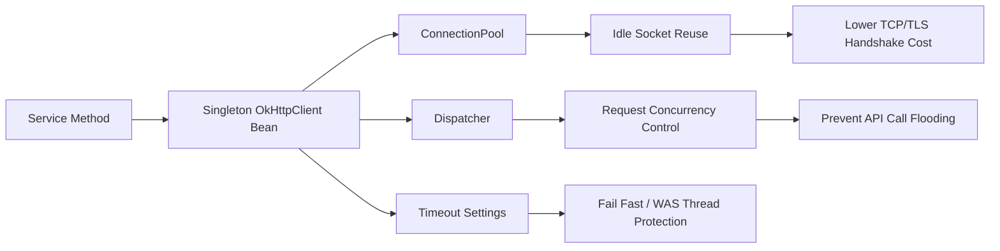

## Connection Pool 설정

### OkHttp 소켓 Connection Pool 설정 파라미터 상세 설명

#### 1. 핵심 결론

## OkHttp의 `ConnectionPool`은 **DB Connection Pool이 아니라 HTTP/TCP Socket 재사용 풀**입니다. API 호출이 끝난 뒤 TCP 연결을 바로 닫지 않고 잠시 보관했다가, 같은 목적지로 다음 요청이 오면 재사용하여 TCP handshake/TLS handshake 비용을 줄입니다. OkHttp 공식 문서 기준 기본 Pool은 현재 `최대 5개 idle connection`, `5분 idle 유지`로 설명됩니다. ([Square Open Source](https://square.github.io/okhttp/3.x/okhttp/okhttp3/ConnectionPool.html?utm_source=chatgpt.com "ConnectionPool (OkHttp 3.14.0 API)"))  
운영 서버에서는 L4/방화벽/서버 keep-alive timeout이 180초라면 OkHttp 기본 `5분`은 길 수 있으므로, `keepAliveDuration`을 L4 timeout보다 짧게 잡는 것이 안전합니다.

### 2. ConnectionPool 주요 파라미터

```java
ConnectionPool connectionPool =
    new ConnectionPool(
        20,              // maxIdleConnections
        150,             // keepAliveDuration
        TimeUnit.SECONDS
    );
```

|구분|설명|
|---|---|
|`maxIdleConnections`|Pool에 보관할 수 있는 **유휴 HTTP connection 최대 개수**|
|`keepAliveDuration`|요청 완료 후 connection이 idle 상태로 Pool에 남아 있을 수 있는 최대 시간|
|`TimeUnit`|`keepAliveDuration`의 시간 단위|

#### 2-1. `maxIdleConnections`

`maxIdleConnections`는 **전체 연결 최대 개수**가 아닙니다. 이름 그대로 **idle 상태로 보관할 최대 connection 수**입니다.  
예를 들어 `maxIdleConnections=20`이면:

- 요청 처리 중인 active connection은 이 값에 직접 제한되지 않음
    
- 요청 완료 후 놀고 있는 connection 중 최대 20개만 Pool에 유지
    
- 초과 idle connection은 정리 대상
    
- DB Pool의 `maxTotal`, `maximumPoolSize`와 같은 의미가 아님  
    즉, `maxIdleConnections=20`이라고 해서 동시 HTTP 요청이 20개로 제한되는 구조는 아닙니다.
    

#### 2-2. `keepAliveDuration`

`keepAliveDuration`은 connection이 **사용되지 않은 상태로 Pool에 남아 있을 수 있는 시간**입니다.  
예:

```java
new ConnectionPool(20, 150, TimeUnit.SECONDS)
```

의미:

- API 호출 완료
    
- 응답 body close
    
- socket connection을 바로 닫지 않고 Pool에 보관    
- 150초 안에 같은 Address로 요청이 오면 재사용 가능

- 150초 이상 사용되지 않으면 정리 대상  
    운영 환경에서 L4 idle timeout이 180초라면 OkHttp `keepAliveDuration`은 보통 `120~150초` 정도로 두는 것이 안전합니다. L4가 먼저 끊은 stale socket을 OkHttp가 재사용하려는 상황을 줄일 수 있기 때문입니다.

---

### 3. OkHttpClient 관련 파라미터

```java
OkHttpClient client = new OkHttpClient.Builder()
    .connectionPool(connectionPool)
    .connectTimeout(3, TimeUnit.SECONDS)
    .readTimeout(5, TimeUnit.SECONDS)
    .writeTimeout(5, TimeUnit.SECONDS)
    .callTimeout(10, TimeUnit.SECONDS)
    .retryOnConnectionFailure(true)
    .build();
```

|구분|의미|실무 영향|
|---|---|---|
|`connectionPool`|HTTP connection 재사용 Pool 지정|client 재사용 시 성능 개선|
|`connectTimeout`|TCP 연결을 맺는 시간 제한|서버/L4 접속 지연 감지|
|`readTimeout`|응답 데이터를 읽는 중 대기 제한|서버 응답 지연 방지|
|`writeTimeout`|요청 body 전송 시간 제한|큰 payload 전송 지연 방지|
|`callTimeout`|전체 Call의 최대 수행 시간|connect/read/write 전체 상한|
|`retryOnConnectionFailure`|연결 실패 시 재시도 허용 여부|stale connection, 일시적 네트워크 장애 완화|

## OkHttp 공식 Builder 문서에서 `connectTimeout`은 TCP socket 연결을 맺는 시간에 적용되며 기본값은 10초로 설명됩니다. `readTimeout`도 기본값 10초로 설명됩니다. ([Square Open Source](https://square.github.io/okhttp/3.x/okhttp/okhttp3/OkHttpClient.Builder.html?utm_source=chatgpt.com "OkHttpClient.Builder (OkHttp 3.14.0 API)"))

### 4. ConnectionPool과 Timeout의 역할 구분

|항목|ConnectionPool|Timeout|
|---|---|---|
|목적|이미 맺은 socket 재사용|지연/장애 상황에서 대기 시간 제한|
|대상|idle TCP connection|connect/read/write/call 단계|
|성능 영향|handshake 비용 감소|장애 전파 시간 감소|
|장애 영향|stale socket 재사용 가능성|timeout exception 발생|
|대표 설정|`maxIdleConnections`, `keepAliveDuration`|`connectTimeout`, `readTimeout`, `writeTimeout`, `callTimeout`|

ConnectionPool 설정만으로 `connect timed out`을 직접 해결하는 것은 아닙니다. `connect timed out`은 보통 다음 상황에서 발생합니다.

- 대상 서버 접속 불가
    
- L4/방화벽/라우팅 문제
    
- 대상 API 서버 backlog/accept 지연
    
- DNS 결과는 나왔지만 TCP 연결이 안 됨
    
- 순간 동시 요청 증가로 연결 생성이 지연됨  
    다만 매번 `new OkHttpClient()`를 만들면 Pool 재사용이 안 되어 TCP 연결 생성이 늘고, 그 결과 `connectTimeout` 발생 가능성을 높일 수 있습니다.
    

---

### 5. Dispatcher 관련 파라미터

OkHttp에서 동시 요청 수를 조절하려면 `ConnectionPool`이 아니라 `Dispatcher`를 봐야 합니다.

```java
Dispatcher dispatcher = new Dispatcher();
dispatcher.setMaxRequests(100);
dispatcher.setMaxRequestsPerHost(20);

OkHttpClient client = new OkHttpClient.Builder()
    .dispatcher(dispatcher)
    .connectionPool(new ConnectionPool(20, 150, TimeUnit.SECONDS))
    .connectTimeout(3, TimeUnit.SECONDS)
    .readTimeout(5, TimeUnit.SECONDS)
    .writeTimeout(5, TimeUnit.SECONDS)
    .callTimeout(10, TimeUnit.SECONDS)
    .build();
```

|구분|설명|
|---|---|
|`setMaxRequests`|전체 비동기 요청 최대 수|
|`setMaxRequestsPerHost`|동일 host 기준 비동기 요청 최대 수|
|주의|주로 `enqueue()` 비동기 호출에 영향|
|동기 호출|`execute()`는 호출한 thread에서 수행되므로 WAS thread pool 관리가 더 중요|

## `ConnectionPool`은 idle connection 보관 정책이고, `Dispatcher`는 요청 실행 동시성 제어에 가깝습니다. 둘을 혼동하면 `maxIdleConnections`를 동시 요청 제한값처럼 잘못 설정할 수 있습니다.

### 6. 실무 권장 설정 예시

#### 6-1. 일반적인 내부 API 호출

```java
@Bean
public OkHttpClient searchApiOkHttpClient() {
    ConnectionPool pool = new ConnectionPool(
        20,
        150,
        TimeUnit.SECONDS
    );

    Dispatcher dispatcher = new Dispatcher();
    dispatcher.setMaxRequests(100);
    dispatcher.setMaxRequestsPerHost(30);

    return new OkHttpClient.Builder()
        .connectionPool(pool)
        .dispatcher(dispatcher)
        .connectTimeout(3, TimeUnit.SECONDS)
        .readTimeout(5, TimeUnit.SECONDS)
        .writeTimeout(5, TimeUnit.SECONDS)
        .callTimeout(10, TimeUnit.SECONDS)
        .retryOnConnectionFailure(true)
        .build();
}
```

#### 6-2. L4 idle timeout이 180초인 경우

```java
new ConnectionPool(20, 120, TimeUnit.SECONDS)
```

또는

```java
new ConnectionPool(20, 150, TimeUnit.SECONDS)
```

권장 방향:

- L4 idle timeout: 180초
    
- OkHttp keepAliveDuration: 120~150초
    
- 이유: L4가 먼저 끊기 전에 OkHttp가 idle socket을 정리하도록 유도
    

---

### 7. 기존 코드에서 가장 위험한 패턴

```java
OkHttpClient client = new OkHttpClient().newBuilder().build();
```

또는

```java
OkHttpClient client = new OkHttpClient.Builder().build();
```

를 메서드 호출마다 생성하는 방식은 피해야 합니다.  
OkHttp 공식 문서도 `OkHttpClient`를 공유하고, `newBuilder()`로 파생 client를 만들면 connection pool, thread pool, 설정을 공유한다고 설명합니다. ([Square Open Source](https://square.github.io/okhttp/3.x/okhttp/okhttp3/OkHttpClient.html?utm_source=chatgpt.com "OkHttpClient (OkHttp 3.14.0 API)"))

#### 문제점

|문제|설명|
|---|---|
|Pool 재사용 실패|매번 새 client면 기존 socket 재사용 효과가 줄어듦|
|socket 증가|짧은 시간에 TCP connection 생성/종료 반복|
|TIME-WAIT 증가|연결을 자주 만들고 닫으면 TIME-WAIT 증가 가능|
|CLOSE-WAIT/LAST-ACK 악화 가능|response close 누락, 서버/클라이언트 종료 타이밍 문제와 결합 시 악화|
|성능 저하|TCP/TLS handshake 반복|
|장애 확산|API 지연 시 WAS thread 점유 증가|

---

### 8. Response close와 Pool 반환 관계

OkHttp에서 connection이 Pool로 정상 반환되려면 **ResponseBody가 반드시 닫혀야 합니다.**  
권장:

```java
try (Response response = client.newCall(request).execute()) {
    if (!response.isSuccessful()) {
        throw new IOException("Unexpected code " + response);
    }

    String responseBody = response.body() != null
        ? response.body().string()
        : null;

    return responseBody;
}
```

주의:

- `response.close()`는 내부적으로 response body close
    
- `response.body().string()`은 body를 모두 읽고 close하는 동작을 포함하지만, 예외 발생 경로까지 고려하면 `try-with-resources`가 안전
    
- close 누락 시 connection이 Pool로 반환되지 못하고 socket/file descriptor 누수로 이어질 수 있음
    

---

### 9. DB Connection Pool과의 차이

|구분|OkHttp ConnectionPool|DBCP2/HikariCP|
|---|---|---|
|대상|HTTP/TCP socket|DB connection|
|목적|HTTP 연결 재사용|DB 세션 재사용|
|최대값 의미|최대 idle connection 수|최대 전체 connection 수|
|트랜잭션|없음|DB transaction과 직접 관련|
|상태 예|ESTAB, TIME-WAIT, CLOSE-WAIT|active, idle, validation, abandoned|
|장애 양상|stale socket, timeout, reset|DB wait_timeout, deadlock, pool exhaustion|

## 중요한 점은 OkHttp의 socket pool은 DB Pool처럼 `maxTotal=100` 식으로 전체 connection 수를 강하게 제한하는 구조가 아니라는 점입니다.

### 10. Spring 5.3/JDK11 기준 Bean 구성 권장안

#### 10-1. 단일 API 대상

```java
@Configuration
public class OkHttpConfig {

    @Bean(destroyMethod = "dispatcher")
    public OkHttpClient searchOkHttpClient() {
        ConnectionPool connectionPool =
            new ConnectionPool(20, 150, TimeUnit.SECONDS);

        Dispatcher dispatcher = new Dispatcher();
        dispatcher.setMaxRequests(100);
        dispatcher.setMaxRequestsPerHost(30);

        return new OkHttpClient.Builder()
            .connectionPool(connectionPool)
            .dispatcher(dispatcher)
            .connectTimeout(3, TimeUnit.SECONDS)
            .readTimeout(5, TimeUnit.SECONDS)
            .writeTimeout(5, TimeUnit.SECONDS)
            .callTimeout(10, TimeUnit.SECONDS)
            .retryOnConnectionFailure(true)
            .build();
    }
}
```

위 `destroyMethod = "dispatcher"`는 부적절합니다. `OkHttpClient`에 그런 종료 메서드가 있는 것이 아니므로 실제 운영 Bean에는 쓰지 않는 편이 안전합니다. Spring 종료 시 명시 정리가 필요하면 별도 `@PreDestroy`에서 dispatcher executor와 pool eviction을 처리하는 방식을 사용합니다.

#### 10-2. 종료 처리까지 포함한 예시

```java
@Configuration
public class OkHttpConfig {

    private OkHttpClient searchClient;

    @Bean
    public OkHttpClient searchOkHttpClient() {
        ConnectionPool connectionPool =
            new ConnectionPool(20, 150, TimeUnit.SECONDS);

        Dispatcher dispatcher = new Dispatcher();
        dispatcher.setMaxRequests(100);
        dispatcher.setMaxRequestsPerHost(30);

        this.searchClient = new OkHttpClient.Builder()
            .connectionPool(connectionPool)
            .dispatcher(dispatcher)
            .connectTimeout(3, TimeUnit.SECONDS)
            .readTimeout(5, TimeUnit.SECONDS)
            .writeTimeout(5, TimeUnit.SECONDS)
            .callTimeout(10, TimeUnit.SECONDS)
            .retryOnConnectionFailure(true)
            .build();

        return this.searchClient;
    }

    @PreDestroy
    public void shutdown() {
        if (searchClient != null) {
            searchClient.dispatcher().executorService().shutdown();
            searchClient.connectionPool().evictAll();

            if (searchClient.cache() != null) {
                try {
                    searchClient.cache().close();
                } catch (IOException ignored) {
                    // shutdown path
                }
            }
        }
    }
}
```

---

### 11. 운영 기준 권장값

|상황|권장 설정|
|---|---|
|내부 검색 API 호출|`maxIdleConnections=10~30`, `keepAliveDuration=120~150초`|
|L4 idle 180초|`keepAliveDuration < 180초`|
|API 응답 빠름|`connectTimeout=2~3초`, `readTimeout=3~5초`|
|API 응답 변동 큼|`connectTimeout=3초`, `readTimeout=5~10초`|
|장애 격리 필요|`callTimeout=전체 허용시간` 설정|
|대량 비동기 호출|`Dispatcher`의 `maxRequestsPerHost` 별도 제한|
|동기 execute 사용|WAS thread pool, API timeout, circuit breaker 함께 관리|

---

### 12. 현재 장애 패턴과 연결해서 보면

#### 12-1. `CLOSE-WAIT` 증가

가능성이 큰 원인:

- `Response` 또는 `ResponseBody` close 누락
    
- 예외 발생 시 close 누락
    
- 서버가 먼저 FIN을 보냈는데 클라이언트 애플리케이션이 socket close를 완료하지 않음
    
- 메서드마다 client 생성 + 응답 close 불완전
    

#### 12-2. `LAST-ACK` 증가

가능성이 큰 원인:

- 로컬에서 close를 보냈지만 상대방 ACK가 늦거나 누락
    
- 네트워크/L4/상대 서버 종료 처리 지연
    
- 비정상적인 연결 종료가 반복
    

#### 12-3. `connect timed out` 증가

가능성이 큰 원인:

- connection 재사용 실패로 신규 TCP 연결이 과도하게 발생
    
- 대상 API 서버 accept 지연
    
- L4 연결 지연
    
- 네트워크 경로 문제
    
- 순간 요청 폭증
    
- timeout이 너무 길어 WAS thread가 쌓임
    

---

### 13. 권장 구조



---

### 14. 최종 권장안

```java
private static final OkHttpClient CLIENT = new OkHttpClient.Builder()
    .connectionPool(new ConnectionPool(20, 150, TimeUnit.SECONDS))
    .connectTimeout(3, TimeUnit.SECONDS)
    .readTimeout(5, TimeUnit.SECONDS)
    .writeTimeout(5, TimeUnit.SECONDS)
    .callTimeout(10, TimeUnit.SECONDS)
    .retryOnConnectionFailure(true)
    .build();
```

Spring 프로젝트에서는 `static final`보다 `@Bean` 등록을 권장합니다.  
운영 기준으로는 다음 3가지를 우선 적용하는 것이 좋습니다.

1. `OkHttpClient`를 메서드마다 생성하지 말고 Singleton Bean으로 공유
    
2. `Response`는 반드시 `try-with-resources`로 close
    
3. L4 idle timeout 180초보다 짧게 `ConnectionPool keepAliveDuration` 설정  
    가장 중요한 파라미터는 `maxIdleConnections`가 아니라 **`keepAliveDuration`과 Response close 보장**입니다. 현재처럼 L4 180초, CLOSE-WAIT/LAST-ACK, connect timeout이 함께 관찰되는 상황에서는 `new OkHttpClient()` 반복 생성과 응답 close 누락 여부를 최우선으로 점검해야 합니다.