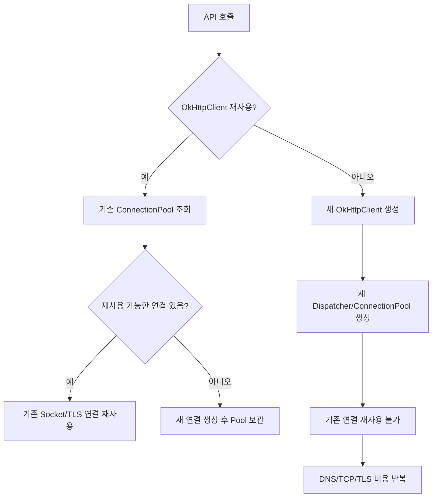

결론부터 말씀드리면, 두 방식의 속도와 성능 차이는 **하늘과 땅 차이**입니다.

매 요청마다 `new OkHttpClient()`를 호출하는 것은 내부적으로 수많은 스레드 풀과 네트워크 커넥션 풀을 무한히 새로 만드는 행위입니다. 이는 심각한 성능 저하를 유발하며, 트래픽이 조금만 몰려도 서버가 다운되는 주원인이 됩니다.

두 방식의 구체적인 속도 및 성능 차이를 상세히 분석해 드립니다.

### 1. 한눈에 보는 속도 및 성능 비교

|**비교 지표**|**커넥션 풀 사용 (싱글톤 재사용)**|**매번 새로 생성 (new OkHttpClient)**|
|---|---|---|
|**API 호출 지연 시간 (Latency)**|**극히 짧음** (보통 수 ms ~ 수십 ms)|**매우 길음** (최소 100ms ~ 500ms 이상 추가)|
|**네트워크 오버헤드**|최초 1회만 Handshake 후 **연결 재사용**|매 요청마다 **DNS 조회 + TCP + TLS Handshake** 반복|
|**서버 자원 소비 (CPU/Memory)**|**안정적임** (설정된 제한 내에서만 자원 사용)|**폭발적으로 증가** (스레드 및 가비지 메모리 급증)|
|**대량 트래픽 대처 능력**|**우수함** (동시 요청을 효율적으로 큐잉)|**장애 유발** (`Too many open files`, `OOM` 발생)|

### 2. 매번 생성할 때 발생하는 치명적인 성능 저하 원인

#### ① 네트워크 지연의 주범: TCP / TLS Handshake 무한 반복

HTTPS API를 호출할 때 클라이언트와 서버는 데이터를 주고받기 전에 서로 통신이 가능한지 확인하는 통전 의식을 치러야 합니다.

- **TCP 3-Way Handshake:** 네트워크 패킷이 최소 3번 오가야 합니다.
    
- **TLS(SSL) Handshake:** 인증서를 검증하고 암호화 키를 교환하기 위해 패킷이 추가로 수차례 오가야 합니다.
    

매번 클라이언트를 새로 생성하면 이 지연 시간(Latency)이 모든 API 호출마다 추가됩니다. 반면, 커넥션 풀을 사용하면 이미 맺어진 연결을 재사용(HTTP Keep-Alive)하므로 Handshake 과정이 통째로 생략되어 데이터만 즉시 오갑니다.

#### ② 시스템 자원 고갈: 스레드(Thread)와 소켓(Socket) 누수

`OkHttpClient` 객체는 단순히 설정 정보만 가진 가벼운 객체가 아닙니다. 내부적으로 네트워크 요청을 비동기로 처리하기 위한 자체적인 ExecutorService(스레드 풀)와 소켓을 관리하는 **ConnectionPool**을 무장하고 있습니다.

- 메서드 내부에서 `new OkHttpClient()`로 생성된 객체는 메서드가 끝나면 가비지 컬렉션(GC) 대상이 되지만, 내부에 살아있는 스레드 풀과 소켓 자원은 즉시 해제되지 않고 링거처럼 시스템에 남아있게 됩니다.
    
- 이로 인해 서버의 메모리가 순식간에 차오르고, OS가 가질 수 있는 최대 파일 디스크립터(File Descriptor) 한계를 초과하여 다른 네트워크 연결까지 전면 마비됩니다.
    

### 3. 실제 속도 차이 예시 (Vpc/내부망 기준)

- **싱글톤 커넥션 풀 사용 시:** 이미 연결이 유지되고 있으므로, `Request -> Response` 과정만 수행됩니다. 내부망 기준 대략 **3ms ~ 10ms** 소요.
    
- **매번 새로 생성 시:** `DNS 쿼리(10ms) + TCP Handshake(20ms) + TLS Handshake(60ms) + Request/Response(5ms)`가 매번 일어납니다. 대략 **95ms ~ 150ms** 소요.
    

> ⚡ **결론**
> 
> OkHttp를 사용할 때 단 하나의 싱글톤(Singleton) 인스턴스만 생성하여 전역에서 재사용하는 것은 선택이 아닌 **필수 규격**입니다. `newBuilder()`를 쓰더라도 기존에 생성된 싱글톤 인스턴스를 기반으로 베이스 풀(Pool)을 공유하도록 구현해야 안전합니다.

정확도: 96%

### 결론

맞습니다. **OkHttp의 `ConnectionPool`은 DB Connection Pool이 아니라 HTTP 통신용 Socket/TCP/TLS Connection Pool**입니다. DBCP2, HikariCP 같은 DB Pool과 혼동하면 안 됩니다.  
그리고 질문한 것처럼 OkHttp도 **idle socket connection을 일정 시간 이상 유지하지 않도록 설정할 수 있습니다.** 핵심 설정은 `ConnectionPool(maxIdleConnections, keepAliveDuration, timeUnit)`입니다. OkHttp 공식 문서 기준으로 `ConnectionPool`은 HTTP/HTTP2 connection 재사용을 관리하고, 기본 생성자는 현재 최대 5개의 idle connection을 5분 동안 유지 후 제거합니다. ([Square Open Source](https://square.github.io/okhttp/3.x/okhttp/okhttp3/ConnectionPool.html "ConnectionPool (OkHttp 3.14.0 API)"))

### OkHttp Pool과 DB Pool 차이

|구분|OkHttp `ConnectionPool`|DB Connection Pool|
|---|---|---|
|대상|HTTP API 서버와의 Socket/TCP/TLS 연결|DB 서버와의 JDBC Connection|
|대표 구현|OkHttp `ConnectionPool`|DBCP2, HikariCP|
|연결 의미|HTTP 요청 재사용용 네트워크 연결|DB 세션/트랜잭션 수행용 연결|
|idle 기준|HTTP 요청 완료 후 재사용 대기 상태|DB 작업 완료 후 pool 반납 상태|
|timeout 영향|L4, Proxy, API 서버 Keep-Alive, NAT 영향|DB `wait_timeout`, 방화벽, DBCP idle evictor 영향|
|장애 예|stale pooled connection, reset, timeout|stale DB connection, validation 실패, SQLNonTransientConnectionException|
|설정 위치|`OkHttpClient.Builder().connectionPool(...)`|`BasicDataSource`, Hikari 설정|

### L4 idle timeout이 180초라면

OkHttp 기본 idle 유지 시간이 **5분 = 300초**이므로, L4가 idle socket을 **180초 이후 끊는 구조**라면 기본값은 길 수 있습니다. 이 경우 OkHttp가 pool에 남아 있다고 생각한 socket을 재사용하려다 **stale pooled connection** 상황이 발생할 수 있습니다.  
OkHttp 공식 문서도 `ConnectionPool`이 socket 재사용으로 latency를 줄이지만, 이런 pooled connection은 가끔 timeout될 수 있고, `retryOnConnectionFailure` 기본 동작은 stale pooled connection 문제를 조용히 복구할 수 있다고 설명합니다. ([Square Open Source](https://square.github.io/okhttp/5.x/okhttp/okhttp3/-ok-http-client/-builder/retry-on-connection-failure.html?utm_source=chatgpt.com "retryOnConnectionFailure"))  
다만 커머스의 `POST` API 호출에서는 자동 재시도에 의존하는 것은 위험할 수 있습니다. 서버가 요청을 처리했는지 불명확한 상태에서 클라이언트가 재시도할 수 있기 때문입니다. 주문, 결제, 쿠폰, 재고 차감, 포인트 적립 같은 API는 반드시 **멱등키 또는 중복 처리 방지**가 필요합니다.

### 권장 설정 방향

L4 idle timeout이 180초라면 OkHttp idle 유지 시간은 그보다 짧게 잡는 것이 안전합니다.

```text
L4 idle timeout = 180초
OkHttp keepAliveDuration 권장 = 120~150초
```

너무 180초에 가깝게 잡지 말고 20~60초 정도 여유를 두는 것이 좋습니다. 운영 환경에서는 L4, nginx, API 서버 keep-alive timeout 중 **가장 짧은 값보다 OkHttp keepAliveDuration을 짧게** 잡는 방식이 안전합니다.

### Spring 5.3 기준 설정 예시

```java
@Configuration
public class OkHttpConfig {
    @Bean
    public OkHttpClient okHttpClient() {
        ConnectionPool connectionPool = new ConnectionPool(
                20,                 // maxIdleConnections
                150,                // keepAliveDuration
                TimeUnit.SECONDS
        );
        Dispatcher dispatcher = new Dispatcher();
        dispatcher.setMaxRequests(100);
        dispatcher.setMaxRequestsPerHost(30);
        return new OkHttpClient.Builder()
                .connectionPool(connectionPool)
                .dispatcher(dispatcher)
                .connectTimeout(3, TimeUnit.SECONDS)
                .readTimeout(5, TimeUnit.SECONDS)
                .writeTimeout(5, TimeUnit.SECONDS)
                .callTimeout(8, TimeUnit.SECONDS)
                .retryOnConnectionFailure(true)
                .build();
    }
}
```

### 각 설정의 의미

|설정|의미|주의|
|---|---|---|
|`maxIdleConnections`|pool에 idle 상태로 보관할 최대 socket 수|전체 최대 connection 수가 아님|
|`keepAliveDuration`|idle socket을 pool에 유지할 최대 시간|L4 idle timeout보다 짧게 권장|
|`connectTimeout`|TCP 연결 수립 제한 시간|idle 유지 시간과 무관|
|`readTimeout`|응답 데이터 read 대기 시간|idle pool 제거 시간 아님|
|`writeTimeout`|요청 body write 제한 시간|idle pool 제거 시간 아님|
|`callTimeout`|전체 call 제한 시간|API 호출 전체 상한|
|`retryOnConnectionFailure`|연결 문제 재시도 여부|POST/멱등성 주의|

### 중요한 구분: idle connection만 제거됨

`ConnectionPool`의 `keepAliveDuration`은 **사용 중인 active connection을 강제로 끊는 설정이 아닙니다.**  
즉:

```text
API 요청 처리 중인 socket = active connection
요청 완료 후 pool에 대기 중인 socket = idle connection
```

`keepAliveDuration`은 **요청 완료 후 idle 상태로 남아 있는 socket의 보관 시간**입니다. OkHttp 공식 문서도 `evictAll()`은 idle connection을 닫고 제거한다고 설명합니다. ([Square Open Source](https://square.github.io/okhttp/5.x/okhttp/okhttp3/-connection-pool/index.html "ConnectionPool"))

### `maxIdleConnections = 0`도 가능한가?

실무적으로는 다음 선택지가 있습니다.

```java
new ConnectionPool(0, 1, TimeUnit.SECONDS)
```

이렇게 하면 idle connection을 거의 유지하지 않는 방향으로 동작합니다. 다만 이 방식은 **Connection Pool 재사용 이점을 대부분 포기**하는 설정입니다.

|방식|장점|단점|
|---|---|---|
|`maxIdleConnections=0`|stale idle socket 가능성 최소화|매 호출 TCP/TLS 비용 증가|
|`keepAliveDuration=120~150초`|재사용 성능과 안정성 균형|L4 timeout보다 반드시 짧아야 함|
|기본값 5분|재사용 효율 높음|L4 180초 환경에서는 stale 위험|
|커머스 WAS에서는 보통 `maxIdleConnections=0`보다는 **L4보다 짧은 keepAliveDuration 설정**이 더 적절합니다.|||

### API 특성별 권장값

|API 유형|권장 방향|
|---|---|
|상품검색/자동완성/전시 API|`keepAliveDuration=120~150초`, 재사용 적극 활용|
|메일/알림 API|호출 빈도가 낮으면 `60~120초`도 가능|
|결제/주문/재고 차감 API|pool 재사용은 가능하나 멱등키 필수|
|외부 API가 idle socket을 빨리 끊는 경우|`30~90초`까지 단축 검토|
|장애 분석 중 임시 회피|`maxIdleConnections=0` 또는 짧은 keepAlive로 검증|

### 현재 상황에 대한 판단

현재 환경에서 L4가 180초 idle socket을 끊는다면, 아래 설정은 위험할 수 있습니다.

```java
new OkHttpClient()
```

이 경우 기본 `ConnectionPool` 정책을 사용하게 되고, OkHttp 3.x 문서 기준 기본 pool은 idle connection을 최대 5분 유지합니다. ([Square Open Source](https://square.github.io/okhttp/3.x/okhttp/okhttp3/ConnectionPool.html "ConnectionPool (OkHttp 3.14.0 API)"))  
따라서 다음처럼 명시 설정하는 것이 맞습니다.

```java
ConnectionPool pool = new ConnectionPool(20, 150, TimeUnit.SECONDS);
OkHttpClient client = new OkHttpClient.Builder()
        .connectionPool(pool)
        .connectTimeout(3, TimeUnit.SECONDS)
        .readTimeout(5, TimeUnit.SECONDS)
        .writeTimeout(5, TimeUnit.SECONDS)
        .callTimeout(8, TimeUnit.SECONDS)
        .build();
```

### 운영 점검 포인트

```bash
# API 서버 443 연결 상태 확인 예시
ss -tanp | grep ':443'
# 특정 API 서버 IP 기준 확인
ss -tanp | grep 'API_SERVER_IP:443'
# 오래된 socket fd 확인
ls -l /proc/{PID}/fd | grep socket
```

확인해야 할 상태는 다음입니다.

|상태|의미|판단|
|---|---|---|
|`ESTAB`|연결 유지 중|정상일 수 있음|
|`TIME-WAIT`|정상 종료 후 대기|많아도 상황별 정상 가능|
|`CLOSE-WAIT`|상대방이 닫았는데 내 애플리케이션이 close 미완료|높으면 위험|
|`LAST-ACK`|내 쪽 close 후 상대 ACK 대기|지속 증가하면 네트워크/상대 문제 가능|

### 권장 최종안

```java
@Bean
public OkHttpClient searchApiOkHttpClient() {
    return new OkHttpClient.Builder()
            .connectionPool(new ConnectionPool(20, 150, TimeUnit.SECONDS))
            .connectTimeout(3, TimeUnit.SECONDS)
            .readTimeout(5, TimeUnit.SECONDS)
            .writeTimeout(5, TimeUnit.SECONDS)
            .callTimeout(8, TimeUnit.SECONDS)
            .retryOnConnectionFailure(true)
            .build();
}
```

단, 결제/주문/재고 차감처럼 중복 실행 위험이 있는 API에서는 다음 중 하나를 반드시 적용해야 합니다.

```text
1. 서버 측 멱등키 적용
2. 요청 고유번호 기반 중복 처리
3. retryOnConnectionFailure(false) 검토
4. 클라이언트 재시도는 명시적 업무 정책에 따라 수행
```

### 최종 정리

OkHttp의 socket connection pool은 DB connection pool과 완전히 별개입니다. L4가 idle socket을 180초 이상에서 끊는 환경이라면, OkHttp 기본 5분 idle 유지값을 그대로 두지 말고 `ConnectionPool(maxIdleConnections, keepAliveDuration, TimeUnit.SECONDS)`로 **120~150초 수준**으로 줄이는 것이 적절합니다. 이렇게 하면 DB Connection Pool과 혼동하지 않으면서도 HTTP socket 재사용 성능은 유지하고, L4에 의해 끊긴 stale socket 재사용 위험을 줄일 수 있습니다.

## 참고

정확도: 96%

### 결론

`OkHttpClient`는 **매 API 호출마다 생성하면 안 되고, 애플리케이션/WAS 내에서 공유 객체로 재사용**하는 것이 원칙입니다. OkHttp 공식 문서도 `OkHttpClient`는 하나의 인스턴스를 재사용할 때 가장 성능이 좋고, 각 client가 자기 own `connection pool`과 `thread pool`을 가지므로 요청마다 client를 만들면 idle pool 자원을 낭비한다고 설명합니다. ([Square Open Source](https://square.github.io/okhttp/5.x/okhttp/okhttp3/-ok-http-client/ "OkHttpClient"))  
`new OkHttpClient().newBuilder().build()`를 매번 호출하는 방식은 **Connection Pool을 실질적으로 재사용하지 못합니다.** `newBuilder()`는 “기존 공유 client”에서 파생 client를 만들 때 의미가 있으며, 이 경우 기존 client의 connection pool과 thread pool을 공유합니다. 하지만 앞의 `new OkHttpClient()` 자체를 매번 새로 만들면, 매 요청마다 새로운 pool 계열이 생기는 구조가 됩니다. ([Square Open Source](https://square.github.io/okhttp/5.x/okhttp/okhttp3/-ok-http-client/ "OkHttpClient"))

### 성능 차이 요약

|구분|공유 `OkHttpClient` 사용|매번 `new OkHttpClient()` 생성|
|---|---|---|
|Connection Pool|재사용됨|요청마다 새 pool 생성|
|TCP 연결|기존 연결 재사용 가능|매번 새 연결 가능성 증가|
|TLS Handshake|재사용 시 감소|반복 발생 가능성 증가|
|HTTP/2|같은 host 요청이 socket 공유 가능|공유 효과 약화|
|Thread Pool|재사용됨|client별 dispatcher/thread pool 증가 가능|
|GC 부담|낮음|객체 생성/해제 증가|
|소켓 수|안정적|idle socket 증가 가능|
|응답 속도|2번째 요청부터 유리|매 요청 초기 연결 비용 발생|
|운영 안정성|유리|CLOSE_WAIT/idle pool/FD 증가 위험|

### 왜 공유 client가 빠른가

OkHttp의 `ConnectionPool`은 HTTP/HTTP2 연결 재사용을 관리하고, 같은 `Address`를 공유하는 요청은 connection을 공유할 수 있습니다. 공식 문서 기준으로 ConnectionPool은 네트워크 latency 감소를 위해 연결 재사용을 관리합니다. ([Square Open Source](https://square.github.io/okhttp/3.x/okhttp/okhttp3/ConnectionPool.html "ConnectionPool (OkHttp 3.14.0 API)"))  
OkHttp 개요 문서도 HTTP/2는 같은 host 요청이 socket을 공유할 수 있고, HTTP/2가 아니더라도 connection pooling이 request latency를 줄인다고 설명합니다. ([Square Open Source](https://square.github.io/okhttp/ "Overview - OkHttp"))



### `new OkHttpClient().newBuilder().build()`의 문제

다음 코드는 겉으로는 `newBuilder()`를 사용하지만, 실무적으로는 좋지 않습니다.

```java
OkHttpClient client = new OkHttpClient().newBuilder().build();
```

이유는 다음과 같습니다.

```text
1. new OkHttpClient() 생성
2. 그 client에서 newBuilder() 생성
3. build()로 또 다른 OkHttpClient 생성
4. 하지만 이 전체 과정이 매 요청마다 반복됨
5. 결과적으로 공유 pool 효과가 거의 없음
```

`newBuilder()`의 올바른 용도는 다음입니다.

```java
// 애플리케이션 공용 client
private static final OkHttpClient BASE_CLIENT = new OkHttpClient.Builder()
        .connectTimeout(3, TimeUnit.SECONDS)
        .readTimeout(5, TimeUnit.SECONDS)
        .writeTimeout(5, TimeUnit.SECONDS)
        .build();

// 특정 요청에서 timeout만 다르게 쓰고 싶을 때
OkHttpClient shortTimeoutClient = BASE_CLIENT.newBuilder()
        .readTimeout(1, TimeUnit.SECONDS)
        .build();
```

이 경우 `shortTimeoutClient`는 `BASE_CLIENT`의 connection pool과 thread pool을 공유합니다. OkHttp 공식 문서도 shared client를 `newBuilder()`로 커스터마이징하면 connection pool, thread pool, configuration을 공유한다고 설명합니다. ([Square Open Source](https://square.github.io/okhttp/5.x/okhttp/okhttp3/-ok-http-client/ "OkHttpClient"))

### 속도 차이의 실제 발생 지점

| 호출 상황           | 성능 차이                |
| --------------- | -------------------- |
| 첫 번째 호출         | 큰 차이가 없을 수 있음        |
| 같은 host로 반복 호출  | 공유 client가 유리        |
| HTTPS API 반복 호출 | 공유 client가 매우 유리     |
| HTTP/2 지원 API   | 공유 client가 매우 유리     |
| 호출 빈도 낮음        | 체감 차이 작을 수 있음        |
| WAS에서 다량 호출     | 공유 client가 압도적으로 안정적 |

- 정확한 ms 차이는 네트워크 거리, TLS, API 서버 keep-alive 설정, L4/nginx timeout, HTTP/2 지원 여부에 따라 달라서 단정하면 안 됩니다. 다만 구조적으로는 **공유 client 사용 시 DNS/TCP/TLS/스레드/소켓 생성 비용이 줄어드는 방향**이고, 매번 생성 방식은 그 최적화를 포기하는 구조입니다.
### Spring 5.3 기준 권장 Bean 구성

#### 1. OkHttpClient Bean 등록

```java
@Configuration
public class HttpClientConfig {
    @Bean
    public OkHttpClient okHttpClient() {
        Dispatcher dispatcher = new Dispatcher();
        dispatcher.setMaxRequests(100);
        dispatcher.setMaxRequestsPerHost(30);
        ConnectionPool connectionPool = new ConnectionPool(
                30,
                5,
                TimeUnit.MINUTES
        );
        return new OkHttpClient.Builder()
                .connectionPool(connectionPool)
                .dispatcher(dispatcher)
                .connectTimeout(3, TimeUnit.SECONDS)
                .readTimeout(5, TimeUnit.SECONDS)
                .writeTimeout(5, TimeUnit.SECONDS)
                .callTimeout(8, TimeUnit.SECONDS)
                .retryOnConnectionFailure(true)
                .build();
    }
}
```

#### 2. Service에서 주입받아 사용

```java
@Service
public class SearchApiClient {
    private final OkHttpClient okHttpClient;
    public SearchApiClient(OkHttpClient okHttpClient) {
        this.okHttpClient = okHttpClient;
    }
    public String callSearchApi(String json) throws IOException {
        RequestBody body = RequestBody.create(
                json,
                MediaType.parse("application/json; charset=utf-8")
        );
        Request request = new Request.Builder()
                .url("https://api.example.com/search")
                .post(body)
                .build();
        try (Response response = okHttpClient.newCall(request).execute()) {
            if (!response.isSuccessful()) {
                throw new IOException("API call failed. code=" + response.code());
            }
            ResponseBody responseBody = response.body();
            return responseBody == null ? "" : responseBody.string();
        }
    }
}
```

### 반드시 같이 지켜야 할 점: `Response` close

Connection Pool을 써도 `Response` 또는 `ResponseBody`를 닫지 않으면 연결이 pool로 정상 반환되지 못하고 자원이 누수될 수 있습니다. OkHttp 공식 문서는 `ResponseBody`가 socket 같은 제한 자원을 기반으로 하며, 닫지 않으면 애플리케이션이 느려지거나 crash가 발생할 수 있다고 설명합니다. ([Square Open Source](https://square.github.io/okhttp/5.x/okhttp/okhttp3/-response-body/index.html?utm_source=chatgpt.com "ResponseBody - okhttp"))  
따라서 동기 호출은 아래처럼 `try-with-resources`가 가장 안전합니다.

```java
try (Response response = okHttpClient.newCall(request).execute()) {
    // response.body().string() 또는 stream 처리
}
```

### Connection Pool과 Dispatcher는 역할이 다름

| 구분                   | 역할                      |
| -------------------- | ----------------------- |
| `ConnectionPool`     | idle connection 재사용 관리  |
| `Dispatcher`         | 동시 실행 request 수 제어      |
| `maxIdleConnections` | 유휴 상태로 보관할 connection 수 |
| `keepAliveDuration`  | idle connection 유지 시간   |
| `maxRequests`        | 전체 동시 실행 request 수      |
| `maxRequestsPerHost` | host별 동시 실행 request 수   |

- OkHttp `Dispatcher`는 동시 실행 request 수를 제어하며, 초과 요청은 memory queue에서 대기합니다. host별 동시 실행 제한은 `maxRequestsPerHost`로 관리됩니다. ([Square Open Source](https://square.github.io/okhttp/3.x/okhttp/okhttp3/Dispatcher.html?utm_source=chatgpt.com "Dispatcher (OkHttp 3.14.0 API)"))

### 운영 관점 위험 비교

|항목|공유 client|매번 생성|
|---|---|---|
|처리량|안정적|부하 증가 시 저하 가능|
|지연시간|낮아질 가능성 높음|연결 생성 비용 반복|
|WAS FD 사용량|예측 가능|증가 가능|
|CLOSE_WAIT|response 미close 시 발생 가능|client 난립 시 추적 어려움|
|LAST_ACK/TIME_WAIT|상대적으로 안정|연결 churn 증가 가능|
|GC|낮음|객체 churn 증가|
|장애 분석|단순|client/pool 단위가 많아 복잡|

### 현재 코드에 대한 판단

현재처럼 API 호출 메서드 안에서 아래 코드를 반복 생성한다면:

```java
OkHttpClient client = new OkHttpClient().newBuilder().build();
```

이는 실무적으로 다음과 같이 보는 것이 맞습니다.

```text
Connection Pool을 사용하는 라이브러리를 쓰고는 있지만,
Connection Pool 재사용 효과를 거의 버리는 코드 구조
```

즉, **OkHttpClient를 매번 생성하는 코드는 성능상 불리하고 운영상 위험합니다.**

### 권장 결론

| 상황               | 권장 방식                                               |
| ---------------- | --------------------------------------------------- |
| 일반 API 호출        | Spring Singleton Bean으로 `OkHttpClient` 1개 공유        |
| API별 timeout만 다름 | 공용 client의 `newBuilder()`로 파생 client 생성             |
| 인증 header만 다름    | client를 새로 만들지 말고 `Request` 단위 header 처리            |
| 대상 host가 여러 개    | 하나의 client로도 가능하나, 장애 격리가 필요하면 API군별 client 분리      |
| 대량 호출/검색 API     | 공유 client + timeout + dispatcher + pool 명시          |
| 운영 장애 분석 중       | `Response` close 여부, socket 상태, fd 수, pool count 확인 |

- 최종적으로 커머스 WAS에서는 **`OkHttpClient`를 Bean/Singleton으로 관리하고, 모든 API 호출에서 재사용**하는 구조가 맞습니다. `new OkHttpClient().newBuilder().build()`를 매 호출마다 수행하는 방식은 속도, 메모리, thread, socket, 장애 분석 측면에서 모두 불리합니다.