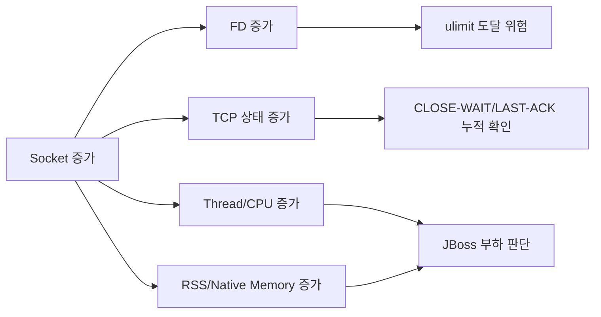

### 1. 핵심 모니터링 관점

|구분|확인 항목|의미|
|---|--:|---|
|Socket 증가|`ESTAB`, `CLOSE-WAIT`, `LAST-ACK`, `TIME-WAIT`|정상 연결 증가인지, close 누락/지연인지 판단|
|FD 증가|`/proc/{PID}/fd`|Socket 포함 전체 파일 디스크립터 증가 확인|
|CPU 증가|`%CPU`, Java Thread 수|Socket 증가가 요청 처리/GC/스레드 증가로 이어지는지 확인|
|Memory 증가|RSS, VSZ, Heap/Native Memory|Socket/Thread/Buffer 증가에 따른 메모리 부담 확인|
|JBoss 상태|Thread Count, GC, Open FD|WAS 내부 자원 증가 여부 확인|



### 2. JBoss PID 확인

```bash
ps -ef | grep -Ei 'jboss|wildfly|standalone|org.jboss.as|jboss-modules' | grep -v grep
```

또는:

```bash
pgrep -af 'jboss-modules|org.jboss.as|standalone|wildfly'
```

특정 PID를 확인했다면 이하 예시는 `PID=12345` 자리에 실제 JBoss PID를 넣으면 된다.

### 3. 즉시 화면+파일 동시 모니터링 명령

```bash
PID=12345
LOG=jboss_socket_cpu_mem_$(date +%Y%m%d).log
while true; do
  TS=$(date '+%Y-%m-%d %H:%M:%S')
  CPU=$(ps -p $PID -o %cpu= | awk '{print $1}')
  MEM=$(ps -p $PID -o %mem= | awk '{print $1}')
  RSS=$(ps -p $PID -o rss= | awk '{printf "%.1f", $1/1024}')
  VSZ=$(ps -p $PID -o vsz= | awk '{printf "%.1f", $1/1024}')
  THR=$(ps -p $PID -o nlwp= | awk '{print $1}')
  FD=$(ls -l /proc/$PID/fd 2>/dev/null | wc -l)
  SOCKFD=$(ls -l /proc/$PID/fd 2>/dev/null | grep -c 'socket:')
  STATES=$(sudo ss -Htanp 2>/dev/null | grep "pid=$PID," | awk '{cnt[$1]++} END{for(s in cnt) printf "%s=%d ",s,cnt[s]}')
  printf "%s PID=%s CPU=%s%% MEM=%s%% RSS_MB=%s VSZ_MB=%s THREAD=%s FD=%s SOCKET_FD=%s %s\n" "$TS" "$PID" "$CPU" "$MEM" "$RSS" "$VSZ" "$THR" "$FD" "$SOCKFD" "$STATES" | tee -a "$LOG"
  sleep 3
done
```

결과 예시:

```text
2026-06-10 09:30:01 PID=12345 CPU=38.5% MEM=42.1% RSS_MB=3580.4 VSZ_MB=8210.7 THREAD=312 FD=1840 SOCKET_FD=1260 ESTAB=430 CLOSE-WAIT=180 LAST-ACK=35 TIME-WAIT=90
```

### 4. 운영용 스크립트 생성

```bash
vi jboss_socket_monitor.sh
```

```bash
#!/bin/bash
PID="$1"
INTERVAL="${2:-3}"
LOG_DIR="${3:-./logs}"
if [ -z "$PID" ]; then
  echo "Usage: $0 <JBOSS_PID> [INTERVAL_SEC] [LOG_DIR]"
  exit 1
fi
if [ ! -d "/proc/$PID" ]; then
  echo "PID $PID not found"
  exit 1
fi
mkdir -p "$LOG_DIR"
LOG_FILE="$LOG_DIR/jboss_socket_cpu_mem_$(hostname)_$(date +%Y%m%d).log"
HEADER="DATETIME|PID|CPU_PCT|MEM_PCT|RSS_MB|VSZ_MB|THREAD|FD_TOTAL|SOCKET_FD|ESTAB|CLOSE_WAIT|LAST_ACK|TIME_WAIT|SYN_SENT|SYN_RECV|FIN_WAIT1|FIN_WAIT2"
if [ ! -f "$LOG_FILE" ]; then
  echo "$HEADER" | tee -a "$LOG_FILE"
fi
while true; do
  TS=$(date '+%Y-%m-%d %H:%M:%S')
  CPU=$(ps -p "$PID" -o %cpu= | awk '{print $1+0}')
  MEM=$(ps -p "$PID" -o %mem= | awk '{print $1+0}')
  RSS=$(ps -p "$PID" -o rss= | awk '{printf "%.1f", $1/1024}')
  VSZ=$(ps -p "$PID" -o vsz= | awk '{printf "%.1f", $1/1024}')
  THREAD=$(ps -p "$PID" -o nlwp= | awk '{print $1+0}')
  FD_TOTAL=$(ls -l "/proc/$PID/fd" 2>/dev/null | wc -l)
  SOCKET_FD=$(ls -l "/proc/$PID/fd" 2>/dev/null | grep -c 'socket:')
  SS_OUT=$(sudo ss -Htanp 2>/dev/null | grep "pid=$PID,")
  ESTAB=$(echo "$SS_OUT" | awk '$1=="ESTAB"{c++} END{print c+0}')
  CLOSE_WAIT=$(echo "$SS_OUT" | awk '$1=="CLOSE-WAIT"{c++} END{print c+0}')
  LAST_ACK=$(echo "$SS_OUT" | awk '$1=="LAST-ACK"{c++} END{print c+0}')
  TIME_WAIT=$(echo "$SS_OUT" | awk '$1=="TIME-WAIT"{c++} END{print c+0}')
  SYN_SENT=$(echo "$SS_OUT" | awk '$1=="SYN-SENT"{c++} END{print c+0}')
  SYN_RECV=$(echo "$SS_OUT" | awk '$1=="SYN-RECV"{c++} END{print c+0}')
  FIN_WAIT1=$(echo "$SS_OUT" | awk '$1=="FIN-WAIT-1"{c++} END{print c+0}')
  FIN_WAIT2=$(echo "$SS_OUT" | awk '$1=="FIN-WAIT-2"{c++} END{print c+0}')
  LINE="$TS|$PID|$CPU|$MEM|$RSS|$VSZ|$THREAD|$FD_TOTAL|$SOCKET_FD|$ESTAB|$CLOSE_WAIT|$LAST_ACK|$TIME_WAIT|$SYN_SENT|$SYN_RECV|$FIN_WAIT1|$FIN_WAIT2"
  echo "$LINE" | tee -a "$LOG_FILE"
  sleep "$INTERVAL"
done
```

권한 부여 및 실행:

```bash
chmod +x jboss_socket_monitor.sh
./jboss_socket_monitor.sh 12345 3 /var/log/jboss-monitor
```

백그라운드 실행:

```bash
nohup ./jboss_socket_monitor.sh 12345 3 /var/log/jboss-monitor > /var/log/jboss-monitor/monitor.out 2>&1 &
```

### 5. 특정 상태 Socket 상세 확인

#### 5.1 JBoss PID 기준 전체 Socket

```bash
sudo ss -tanp | grep "pid=12345,"
```

#### 5.2 CLOSE-WAIT만 확인

```bash
sudo ss -tanp state close-wait | grep "pid=12345,"
```

#### 5.3 ESTABLISHED만 확인

```bash
sudo ss -tanp state established | grep "pid=12345,"
```

#### 5.4 원격 IP별 Socket 수 집계

```bash
sudo ss -Htanp | grep "pid=12345," | awk '{peer=$5; sub(/:[0-9]+$/,"",peer); cnt[peer]++} END{for(ip in cnt) print ip,cnt[ip]}' | sort -k2 -nr
```

#### 5.5 DB 3306 연결만 확인

```bash
sudo ss -Htanp '( dport = :3306 )' | grep "pid=12345,"
```

#### 5.6 외부 API 443 연결만 확인

```bash
sudo ss -Htanp '( dport = :443 )' | grep "pid=12345,"
```

### 6. CPU/Memory 상세 모니터링 보조 명령

#### 6.1 프로세스 CPU/Memory 반복 확인

```bash
top -H -p 12345
```

`top -H`는 JBoss Java 프로세스 내부의 Linux Thread 단위 CPU 사용률을 보여준다. 특정 Thread가 CPU를 많이 쓰면 Java Thread Dump와 연결해서 분석할 수 있다.

#### 6.2 PID 단위 CPU/Memory 로그

```bash
pidstat -p 12345 -r -u -d -h 3 | tee -a jboss_pidstat_$(date +%Y%m%d).log
```

`pidstat`이 없다면 설치:

```bash
# RHEL/CentOS/Rocky
sudo yum install -y sysstat
# Ubuntu
sudo apt install -y sysstat
```

#### 6.3 Java GC 상태 확인

```bash
jstat -gcutil 12345 3000 | tee -a jboss_gc_$(date +%Y%m%d).log
```

#### 6.4 Java Thread Dump 저장

```bash
jstack -l 12345 > jboss_thread_dump_$(date +%Y%m%d_%H%M%S).log
```

Socket 증가와 함께 CPU가 올라가면 `jstack`을 여러 번 떠서 동일 Thread가 반복적으로 RUNNABLE 상태인지 확인하는 것이 좋다.

### 7. 로그 해석 기준

|패턴|의심 원인|확인 포인트|
|---|---|---|
|`ESTAB` 증가 + CPU 증가|요청량 증가, 외부 API/DB 호출 증가|정상 트래픽 증가인지 확인|
|`CLOSE-WAIT` 지속 증가|애플리케이션이 Socket close를 제대로 하지 못함|OkHttp/HttpClient/DB ResultSet/Stream close 누락 확인|
|`LAST-ACK` 증가|상대방 close 후 로컬 종료 지연|WAS/OS TCP 종료 지연, 애플리케이션 응답 지연 확인|
|`TIME-WAIT` 증가|짧은 연결을 자주 생성/종료|HTTP Client 재사용 미흡, KeepAlive 미사용 확인|
|`FD_TOTAL` 지속 증가|파일/Socket FD 누수 가능성|`ulimit -n`, `/proc/PID/fd` 확인|
|`THREAD` 증가 + RSS 증가|Thread 생성 증가, Pool 누수 가능성|JBoss thread pool, async executor, HTTP client dispatcher 확인|
|`RSS_MB` 증가 + Heap 안정|Native Memory/Direct Buffer/Thread Stack 가능성|NMT, pmap, thread count 확인|

### 8. JBoss 운영 관점 권장 확인 항목

|항목|명령|기준|
|---|---|---|
|Open File Limit|`cat /proc/12345/limits|grep "open files"`|
|현재 FD 수|`ls -l /proc/12345/fd|wc -l`|
|Socket FD 수|`ls -l /proc/12345/fd|grep -c socket`|
|Thread 수|`ps -p 12345 -o nlwp=`|Socket 증가와 동반 증가 여부 확인|
|RSS Memory|`ps -p 12345 -o rss=`|실제 물리 메모리 사용량|
|TCP 상태|`sudo ss -tanp|grep "pid=12345,"`|

### 9. logrotate 설정 권장

```bash
sudo vi /etc/logrotate.d/jboss-socket-monitor
```

```text
/var/log/jboss-monitor/*.log {
    daily
    rotate 14
    compress
    missingok
    notifempty
    copytruncate
}
```

### 10. 실무 판단 기준

|상황|판단|
|---|---|
|Socket 수 증가 후 일정 시간 뒤 감소|대체로 정상|
|`ESTAB`는 낮은데 `CLOSE-WAIT`만 계속 증가|애플리케이션 close 누락 가능성 높음|
|`TIME-WAIT`만 높음|짧은 연결을 많이 생성하는 구조 가능성|
|Socket 증가와 CPU 증가가 동시 발생|요청량 증가, 재시도 폭주, timeout 대기, Thread 증가 확인 필요|
|Socket 증가와 RSS 증가가 동시 발생|Thread Stack, Direct Buffer, Native Memory 증가 가능성 확인 필요|
|FD가 계속 증가하고 감소하지 않음|Socket/File Descriptor 누수 가능성 높음|

### 11. KTR/JBoss 환경 기준 권장 모니터링 조합

```bash
# 1) Socket + CPU + Memory 통합 로그
./jboss_socket_monitor.sh 12345 3 /var/log/jboss-monitor
# 2) PID 자원 사용률 별도 로그
pidstat -p 12345 -r -u -d -h 3 | tee -a /var/log/jboss-monitor/jboss_pidstat_$(date +%Y%m%d).log
# 3) GC 상태 로그
jstat -gcutil 12345 3000 | tee -a /var/log/jboss-monitor/jboss_gc_$(date +%Y%m%d).log
# 4) 문제 발생 시 Thread Dump
jstack -l 12345 > /var/log/jboss-monitor/jboss_thread_dump_$(date +%Y%m%d_%H%M%S).log
```

가장 먼저 적용할 것은 `jboss_socket_monitor.sh`이고, `CLOSE-WAIT`, `LAST-ACK`, `FD_TOTAL`, `SOCKET_FD`, `CPU`, `RSS_MB`, `THREAD`를 같은 시각 기준으로 보는 것이 핵심이다. 이 값들이 함께 증가하면 단순 Socket 증가가 아니라 JBoss 자원 누수 또는 외부 연동 지연/close 누락 문제로 분석해야 한다.

## Gemini

리눅스 환경에서 JBOSS 서버의 소켓 증가와 그에 따른 CPU, 메모리 부하를 화면(콘솔)과 파일로 동시에 모니터링하기 위해서는 쉘 스크립트(Shell Script)와 화면 출력/파일 저장을 동시에 처리해 주는 **`tee` 명령어**를 조합하는 것이 가장 효율적입니다.

다음은 해당 작업에 최적화된 모니터링 스크립트 작성 및 활용 방법입니다.

### 1. 모니터링 쉘 스크립트 작성

원하는 디렉토리에 모니터링 스크립트 파일(예: `jboss_monitor.sh`)을 생성하고 아래 코드를 작성합니다.

Bash

```
#!/bin/bash

# 1. JBoss 프로세스 ID(PID) 찾기
# 운영 환경에 맞춰 'jboss' 또는 'standalone', 'domain' 등의 키워드로 수정하세요.
JBOSS_PID=$(pgrep -f jboss | head -n 1)

if [ -z "$JBOSS_PID" ]; then
    echo "JBoss 프로세스를 찾을 수 없습니다. 서버가 실행 중인지 확인하세요."
    exit 1
fi

# 2. 로그 파일명 설정 (예: jboss_monitor_20260610.log)
LOG_FILE="jboss_monitor_$(date +%Y%m%d).log"

# 3. 헤더 출력 및 파일 저장 (tee -a 명령어 사용)
echo "==========================================================" | tee -a $LOG_FILE
echo "Monitoring JBoss (PID: $JBOSS_PID) - 시작 시간: $(date '+%Y-%m-%d %H:%M:%S')" | tee -a $LOG_FILE
echo "==========================================================" | tee -a $LOG_FILE
printf "%-20s | %-12s | %-8s | %-8s | %-12s\n" "TIME" "SOCKETS(Total)" "CPU(%)" "MEM(%)" "RSS(KB)" | tee -a $LOG_FILE
echo "----------------------------------------------------------" | tee -a $LOG_FILE

# 4. 무한 루프를 돌며 주기적으로 모니터링 (Ctrl+C 로 종료)
while true; do
    CURRENT_TIME=$(date "+%Y-%m-%d %H:%M:%S")

    # [소켓 수 모니터링] 
    # ss 명령어를 사용하여 해당 PID가 열고 있는 네트워크 소켓 개수 확인
    # 권한 문제 방지를 위해 sudo 실행이 필요할 수 있습니다.
    SOCKET_CNT=$(ss -anp 2>/dev/null | grep "$JBOSS_PID" | wc -l)

    # [CPU 및 메모리 모니터링]
    # ps 명령어로 해당 PID의 %cpu, %mem, RSS(실제 사용 메모리) 추출
    USAGE=$(ps -p $JBOSS_PID -o %cpu,%mem,rss --no-headers)

    # 프로세스가 종료되었는지 체크
    if [ -z "$USAGE" ]; then
        echo "$CURRENT_TIME | JBoss 프로세스($JBOSS_PID)가 종료되었습니다." | tee -a $LOG_FILE
        break
    fi

    # ps 출력 결과를 배열로 변환하여 각각의 변수에 담기
    read CPU MEM RSS <<< $USAGE

    # 결과 포맷팅 후 화면 출력 및 로그 파일에 추가 (tee -a)
    printf "%-20s | %-12s | %-8s | %-8s | %-12s\n" "$CURRENT_TIME" "$SOCKET_CNT" "$CPU" "$MEM" "$RSS" | tee -a $LOG_FILE

    # 모니터링 주기 설정 (예: 5초마다 갱신)
    sleep 5
done
```

### 2. 스크립트 실행 방법

1. **실행 권한 부여:**
    
    작성한 스크립트 파일에 실행 권한을 줍니다.
    
    Bash
    
    ```
    chmod +x jboss_monitor.sh
    ```
    
2. **스크립트 실행 (Root 또는 Sudo 권한 권장):**
    
    `ss -p` 명령어는 다른 사용자의 프로세스 정보를 보기 위해 종종 루트 권한을 요구합니다. 따라서 `root` 사용자로 실행하거나 `sudo`를 사용하는 것이 좋습니다.
    
    Bash
    
    ```
    sudo ./jboss_monitor.sh
    ```
    
3. **실행 결과 확인 (화면 & 파일):**
    
    스크립트를 실행하면 터미널 화면에 5초마다 실시간으로 수치가 출력되며, 동시에 동일한 디렉토리의 `jboss_monitor_YYYYMMDD.log` 파일에도 데이터가 누적(Append)됩니다.
    
    Plaintext
    
    ```
    TIME                 | SOCKETS(Total) | CPU(%)   | MEM(%)   | RSS(KB)     
    ----------------------------------------------------------
    2026-06-10 09:48:14  | 145          | 12.5     | 15.2     | 2048000     
    2026-06-10 09:48:19  | 148          | 18.0     | 15.2     | 2048512     
    ```
    

### 💡 JBOSS 소켓 누수(Leak) 분석을 위한 추가 팁

단순히 소켓의 **총 개수**가 증가하는 것 외에, 소켓의 상태(State)를 확인하는 것이 문제 해결에 매우 중요합니다.

만약 소켓 개수가 비정상적으로 치솟는다면, 새 터미널을 열고 아래 명령어를 통해 **어떤 상태의 소켓이 쌓이고 있는지** 확인해 보세요.

- **TIME_WAIT 상태의 소켓이 폭증하는 경우:** (연결 종료 후 대기 중인 소켓)
    
    Bash
    
    ```
    ss -anp | grep "TIME-WAIT" | grep "$(pgrep -f jboss | head -n 1)" | wc -l
    ```
    
    _원인 및 대책:_ 클라이언트와의 짧은 연결(Short Connection)이 너무 많거나 커넥션 풀(Connection Pool) 설정이 제대로 되지 않았을 확률이 높습니다. OS의 `tcp_tw_reuse` 커널 파라미터 튜닝이나 JBOSS Keep-Alive 설정을 검토해야 합니다.
    
- **CLOSE_WAIT 상태의 소켓이 폭증하는 경우:** (상대방은 연결을 끊었으나 JBOSS가 연결을 닫지 못함)
    
    Bash
    
    ```
    ss -anp | grep "CLOSE-WAIT" | grep "$(pgrep -f jboss | head -n 1)" | wc -l
    ```
    
    _원인 및 대책:_ 십중팔구 **애플리케이션 코드의 버그**입니다. DB 커넥션, 외부 API 호출, 파일 스트림 등을 사용한 후 `finally` 블록에서 자원(`close()`)을 제대로 반환하지 않았을 때 발생합니다.
    
- **File Descriptor 한계 확인:**
    
    소켓 증가로 인해 리눅스의 최대 열린 파일 수(`ulimit -n`)에 도달하면 `Too many open files` 에러가 발생하며 서버가 멈춥니다. 현재 JBOSS 프로세스가 점유한 총 File Descriptor를 확인하려면 아래 명령어를 사용하세요.
    
    Bash
    
    ```
    ls /proc/$(pgrep -f jboss | head -n 1)/fd | wc -l
    ```


JBOSS 서버의 소켓 상태(ESTABLISHED, TIME-WAIT, CLOSE-WAIT 등)와 CPU, 메모리 부하를 **동시에 결합하여 실시간으로 추적 관찰**할 수 있는 화면 모니터링 기법과 파일 적재 방식을 설명해 드리겠습니다.

이 방식은 소켓 증가가 실제 시스템 자원(CPU, Memory)에 미치는 상관관계를 한눈에 파악하는 데 가장 효과적입니다.

### 1. 화면 모니터링 (종합 실시간 대시보드)

단일 명령어로 CPU, 메모리, 소켓 상태별 개수를 터미널 한 화면에서 1초마다 동시 갱신하며 관찰하는 방법입니다.

#### 추천 커맨드

Bash

```
watch -n 1 -d "
echo '=== [JBOSS 자원 사용률 (PID: <JBOSS_PID>)] ===';
ps -p <JBOSS_PID> -o %cpu,%mem,rss,vsz --no-headers;
echo '';
echo '=== [소켓 상태별 개수] ===';
ss -antp 2>/dev/null | grep <JBOSS_PID> | awk '{print \$1}' | sort | uniq -c | sort -nr
"
```

_(주의: `<JBOSS_PID>` 부분에 실제 JBoss의 PID 번호를 입력하세요.)_

#### 실행 결과 예시

Plaintext

```
Every 1.0s: echo '=== [JBOSS 자원 사용률...  Wed Jun 10 10:00:00 2026

=== [JBOSS 자원 사용률 (PID: 12345)] ===
 25.4  18.2 2432104 4194304

=== [소켓 상태별 개수] ===
    210 ESTAB
     85 TIME-WAIT
     42 CLOSE-WAIT
      1 LISTEN
```

### 2. 파일 모니터링 (자원 + 소켓 통합 로그 적재)

자원 부하와 소켓 명세를 단일 라인(CSV 형태)으로 정렬하여 장기 기록에 적합하도록 파일에 적재하는 쉘 스크립트 방식입니다. 추후 엑셀이나 데이터 분석 도구로 시각화하기 매우 좋습니다.

#### 추천 쉘 스크립트 (`jboss_combined_monitor.sh`)

Bash

```
#!/bin/bash
JBOSS_PID=$1

if [ -z "$JBOSS_PID" ]; then
    echo "사용법: ./jboss_combined_monitor.sh <JBOSS_PID>"
    exit 1
fi

LOG_FILE="jboss_combined_$(date +%Y%m%d).log"

# 헤더 작성
echo "TIMESTAMP           | CPU(%) | MEM(%) | RSS(KB) | ESTAB | TIME_WAIT | CLOSE_WAIT | TOTAL_SOCK" >> $LOG_FILE
echo "------------------------------------------------------------------------------------------" >> $LOG_FILE

while true; do
    TIMESTAMP=$(date "+%Y-%m-%d %H:%M:%S")
    
    # CPU, 메모리 정보 추출
    SYS_USAGE=$(ps -p $JBOSS_PID -o %cpu,%mem,rss --no-headers 2>/dev/null)
    if [ -z "$SYS_USAGE" ]; then
        echo "$TIMESTAMP | JBoss 프로세스가 종료되었습니다." >> $LOG_FILE
        break
    fi
    read CPU MEM RSS <<< "$SYS_USAGE"
    
    # 소켓 정보 추출
    SS_OUTPUT=$(ss -antp 2>/dev/null | grep "$JBOSS_PID")
    ESTAB_CNT=$(echo "$SS_OUTPUT" | grep -c "ESTAB")
    TW_CNT=$(echo "$SS_OUTPUT" | grep -c "TIME-WAIT")
    CW_CNT=$(echo "$SS_OUTPUT" | grep -c "CLOSE-WAIT")
    TOTAL_CNT=$(echo "$SS_OUTPUT" | wc -l)
    
    # 로그 파일에 한 줄로 저장
    printf "%-19s | %-6s | %-6s | %-7s | %-5s | %-9s | %-10s | %-10s\n" \
    "$TIMESTAMP" "$CPU" "$MEM" "$RSS" "$ESTAB_CNT" "$TW_CNT" "$CW_CNT" "$TOTAL_CNT" >> $LOG_FILE
    
    sleep 5
done
```

- **백그라운드 실행 커맨드:** `nohup ./jboss_combined_monitor.sh 12345 &`
    

### 3. 사용된 핵심 커맨드 및 옵션 상세 설명

모니터링의 핵심이 되는 두 명령어 `ps`와 `ss`의 구체적인 작동 원리와 옵션의 의미입니다.

#### ① `ps` (Process Status) 명령어 옵션

리눅스의 프로세스 상태 정보를 확인할 때 사용하며, 여기서는 자원 소모량만 골라내기 위해 커스텀 출력 옵션을 사용했습니다.

- **`-p <PID>`**: 특정 프로세스 ID(PID)에 대한 정보만 필터링하여 조회합니다. 시스템 전체 프로세스를 읽지 않으므로 부하가 최소화됩니다.
    
- **`-o <format>`**: (User-defined Format) 사용자가 보고 싶은 컬럼(항목)만 지정하여 출력 포맷을 정의합니다.
    
    - `%cpu`: 프로세스가 생성된 이후 혹은 일정 주기 동안 사용한 **CPU 사용률**입니다.
        
    - `%mem`: 시스템의 전체 물리 메모리 중 해당 프로세스가 차지하는 **메모리 백분율**입니다.
        
    - `rss`: Resident Set Size(실제 메모리 크기)로, 스왑(Swap)되지 않고 물리 메모리(RAM)에 실제로 상주하고 있는 프로세스의 메모리 크기(KB 단위)를 뜻하므로 가장 실질적인 메모리 지표입니다.
        
    - `vsz`: Virtual Memory Size(가상 메모리 크기)로, 프로세스가 확보한 가상 메모리 공간의 총 크기입니다. 실제로 할당되지 않은 공간도 포함합니다.
        
- **`--no-headers`**: 출력 결과에서 맨 첫 줄에 나오는 제목 행(컬럼명)을 제거하여, 순수 데이터 값만 추출할 때 사용합니다. 스크립트 변수 적재에 필수적입니다.
    

#### ② `ss` (Socket Statistics) 명령어 옵션

과거에 사용되던 `netstat`을 대체하는 커널 내부의 넷링크(Netlink) 인터페이스 기반 명령어 정보로, 속도가 압도적으로 빠릅니다.

- **`-a` (All)**: 연결이 완료된 소켓뿐만 아니라 listen(연결 대기) 상태인 소켓까지 **모든 상태의 소켓**을 빠짐없이 출력합니다.
    
- **`-n` (Numeric)**: 포트 번호나 IP 주소를 서비스 이름(예: `http`, `ssh`, `domain`)으로 바꾸지 않고 **숫자 그대로(예: 80, 22, 53)** 출력합니다. 네트워크 이름을 조회하는 DNS 룩업 과정을 생략하므로 대량의 소켓 조회 시 속도가 지연되는 것을 막아줍니다.
    
- **`-t` (TCP)**: UDP나 Unix 소켓을 제외하고, 웹 애플리케이션 서버(WAS) 모니터링에 필수적인 **TCP 소켓 프로토콜**만 필터링합니다.
    
- **`-p` (Process)**: 소켓을 열고 제어 중인 **프로세스의 이름과 PID**를 출력 결과 맨 오른쪽에 보여줍니다. 이 정보가 있어야 `grep <PID>`를 통해 특정 JBOSS의 소켓만 발라낼 수 있습니다.
    