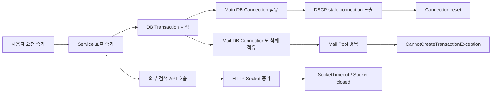
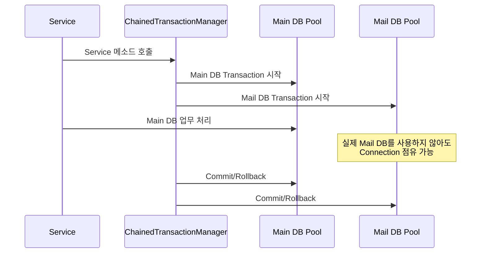
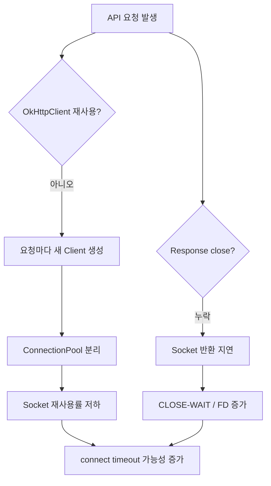

### bk-fo 운영 장애 원인 분석 및 개선 방향
#### DB Transaction · DBCP · Socket Connection 문제를 쉽게 설명하기

- 대상: bk-fo 운영 장애 공유 회의
- 목적: 장애 원인을 단순화해서 설명하고, 개선 우선순위를 팀 내에서 합의
- 핵심 메시지: `DB 연결`, `트랜잭션 범위`, `외부 API 소켓` 문제가 서로 영향을 주며 장애를 키웠다

> 발표 포인트: “이번 문제는 특정 코드 한 줄의 문제가 아니라, 연결 자원을 관리하는 방식이 여러 구간에서 동시에 느슨했던 복합 문제입니다.”

---

### 1. 오늘 설명할 내용

1. 현재 어떤 장애가 발생했는가
2. 장애 원인을 3가지로 나누어 보면 무엇인가
3. 왜 이 문제가 사용자 요청 증가 시 더 커지는가
4. 어떤 순서로 개선해야 하는가
5. 개선 후 어떤 효과를 기대할 수 있는가

> 발표 포인트: 기술 상세보다 먼저 “왜 장애가 반복될 수 있는 구조였는지”를 이해시키는 것이 목적입니다.

---

### 2. 한 장 요약

| 구분 | 문제 | 쉬운 설명 | 개선 방향 |
|---|---|---|---|
| DBCP | 끊어진 DB 연결이 Pool에 남음 | 이미 끊긴 전화를 살아있는 전화처럼 다시 사용 | 유휴 커넥션 검증/폐기 강화 |
| Transaction | Main 업무도 Mail DB 연결을 함께 점유 | 안 쓰는 회의실까지 매번 예약하는 구조 | Main/Mail 트랜잭션 분리 |
| Socket | 외부 API 호출 소켓 반환 미흡 | 통화 후 수화기를 내려놓지 않아 회선이 쌓임 | OkHttpClient 재사용, Response close |

> 발표 포인트: “DB, Transaction, Socket은 각각 다른 문제지만 공통점은 연결 자원을 제때 확인하고 반환하지 못했다는 점입니다.”

---

### 3. 전체 장애 구조



> 발표 포인트: 사용자 요청이 많아지면 DB 연결, Mail DB Pool, 외부 API Socket이 동시에 압박을 받습니다.

---

### 4. 먼저 알아야 할 용어 3개

| 용어 | 의미 | 쉬운 비유 |
|---|---|---|
| DB Connection Pool | DB 연결을 미리 만들어 두고 재사용하는 공간 | DB 연결 대기실 |
| Transaction | 여러 DB 작업을 하나의 작업 단위로 묶는 장치 | 모두 성공하거나 모두 취소되는 묶음 |
| Socket | 외부 서버와 통신하기 위한 네트워크 연결 | 전화 회선 |

> 발표 포인트: “이번 장애는 이 세 가지 자원이 적절한 시점에 생성, 검증, 반환되지 않으면서 발생했습니다.”

---

### 5. 문제 1: DB Connection 비정상 상태 오류

#### 대표 오류

```text
java.sql.SQLNonTransientConnectionException: Connection reset by peer
```

#### 의미

- 애플리케이션은 DB 연결이 살아있다고 보고 사용함
- 실제로는 DB 또는 L4에서 이미 끊어진 연결일 수 있음
- 끊어진 연결을 업무 로직에서 사용하면서 오류 발생

> 발표 포인트: “문제는 연결을 못 만든 것이 아니라, 이미 끊어진 연결을 살아있는 것으로 보고 다시 사용했다는 점입니다.”

---

### 6. 왜 끊어진 DB 연결이 남았는가

| 항목 | 현재 구조 | 문제 가능성 |
|---|---|---|
| DB/L4 timeout | 약 300초 | 5분 이상 유휴 연결은 외부에서 끊길 수 있음 |
| Evictor 주기 | 150초 | 한 번에 전체 연결을 다 보지 못하면 검증 지연 가능 |
| 검사 개수 | 1회 4개 | idle connection 전체 검사까지 시간이 걸림 |
| 유휴 폐기 기준 | 미흡 또는 비활성 | 오래된 idle connection이 Pool에 남을 수 있음 |

> 발표 포인트: “DB나 L4는 이미 연결을 끊었는데, 애플리케이션 Pool은 아직 그 사실을 모를 수 있습니다.”

---

### 7. DBCP 개선 방향

#### 핵심 원칙

- DB/L4 timeout보다 먼저 유휴 커넥션을 검증한다
- 오래된 idle connection은 계속 보관하지 않고 폐기한다
- 검증 쿼리가 오래 걸리지 않도록 timeout을 둔다

#### 개선 설정 방향

| 설정                              | 방향      | 기대 효과                     |
| ------------------------------- | ------- | ------------------------- |
| `testWhileIdle`                 | 활성화     | idle connection 주기적 검증    |
| `timeBetweenEvictionRunsMillis` | 120초 수준 | DB/L4 timeout 전 검증        |
| `numTestsPerEvictionRun`        | 증가      | Pool 내 연결 검사 누락 감소        |
| `minEvictableIdleTimeMillis`    | 180초 수준 | 오래된 idle connection 선제 폐기 |
| `validationQueryTimeout`        | 3초 수준   | 검증 쿼리 장기 점유 방지            |

> 발표 포인트: “DB 연결은 오래 들고 있는 것이 안정적인 게 아니라, 죽은 연결을 빨리 발견하고 교체하는 것이 안정적입니다.”

---

### 8. 문제 2: DB Connection 취득 불가 오류

#### 대표 오류

```text
CannotCreateTransactionException
Cannot get a connection, pool error Timeout waiting for idle object
```

#### 의미

- 트랜잭션을 시작하려고 했지만 필요한 DB Connection을 확보하지 못함
- 요청이 몰릴 때 Pool 안의 사용 가능한 Connection이 부족해짐
- 특히 Mail DB Pool이 작으면 Main 업무까지 같이 영향을 받을 수 있음

> 발표 포인트: “Main DB 업무인데도 Mail DB 연결을 같이 잡는 구조라면, Mail DB가 전체 병목이 될 수 있습니다.”

---

### 9. 현재 Transaction 구조의 핵심 문제



> 발표 포인트: “문제는 Mail DB를 쓰는 업무만 Mail DB 연결을 잡는 것이 아니라, 전역 설정 때문에 대부분의 Service가 Mail DB까지 같이 묶일 수 있다는 점입니다.”

---

### 10. ChainedTransactionManager + REQUIRED의 영향

| 문제 | 설명 | 결과 |
|---|---|---|
| Connection 낭비 | Main DB만 쓰는 업무도 Mail DB Transaction 대상이 될 수 있음 | 불필요한 Mail DB Connection 점유 |
| Pool 병목 | Main DB 100개, Mail DB 10개면 Mail DB가 전체 처리량 제한 가능 | 요청 집중 시 Transaction 시작 실패 |
| 장애 전파 | Mail DB 장애가 Main 업무에 영향을 줄 수 있음 | 검색/상품/세션 업무까지 영향 가능 |
| 성능 저하 | 모든 Service에 두 DB Transaction 비용 발생 | 조회성 업무까지 불필요한 부하 |

> 발표 포인트: “Main DB Pool을 크게 잡아도 Mail DB Pool이 작으면 전체 처리량은 Mail DB 10개에 묶일 수 있습니다.”

---

### 11. Transaction 개선 방향

#### 개선 원칙

- Main DB만 사용하는 업무는 Main DB Transaction만 사용한다
- Mail DB가 필요한 업무만 Mail DB Transaction을 사용한다
- 조회성 업무는 무조건 REQUIRED로 묶지 않는다
- 두 DB의 원자성이 반드시 필요한 업무는 별도 설계로 검토한다

| 대상 | AS-IS | TO-BE |
|---|---|---|
| Main 업무 | ChainedTransactionManager 전역 적용 가능 | Main DB 전용 TransactionManager |
| Mail 업무 | 전체 Chain에 포함 | 실제 Mail 업무에서만 별도 적용 |
| 조회 업무 | 전체 REQUIRED 가능 | SUPPORTS/read-only 검토 |
| 외부 API | Transaction 내부 호출 가능 | Transaction 밖 또는 짧은 Transaction으로 분리 |

> 발표 포인트: “트랜잭션은 넓게 잡는다고 안전해지는 것이 아니라, 필요한 범위만 짧게 잡는 것이 운영 안정성에 유리합니다.”

---

### 12. 문제 3: 외부 API Socket 오류

#### 대표 오류

```text
java.net.SocketException: Socket closed
java.net.SocketTimeoutException: timeout
```

#### 의미

- 외부 검색 API 호출 중 네트워크 연결이 정상적으로 유지되지 않음
- 요청마다 OkHttpClient를 새로 만들면 연결 재사용 효과가 떨어짐
- Response/Body를 닫지 않으면 사용이 끝난 Socket이 반환되지 않을 수 있음

> 발표 포인트: “DB Connection Pool과 HTTP Socket Pool은 다릅니다. 하지만 둘 다 핵심은 연결을 재사용하고, 사용 후 반드시 반환해야 한다는 점입니다.”

---

### 13. OkHttp 자원 관리 문제를 쉽게 설명하면



> 발표 포인트: “요청마다 Client를 새로 만드는 것은 매번 새 회선을 개통하는 것과 비슷합니다. 응답을 닫지 않는 것은 통화가 끝났는데 수화기를 내려놓지 않는 것과 같습니다.”

---

### 14. Socket 개선 방향

| 항목 | AS-IS | TO-BE |
|---|---|---|
| Client 생성 | 요청마다 생성 가능 | API 목적별 Singleton Bean |
| Response 처리 | close 누락 가능 | try-with-resources 적용 |
| ConnectionPool | Client별 분리 | 공유 Client Pool 사용 |
| Timeout | 기본값 의존 가능 | connect/read/write timeout 명시 |
| 모니터링 | 사후 로그 중심 | 상태별 Socket 수, timeout 건수 추적 |

#### 핵심 코드 방향

```java
try (Response response = searchOkHttpClient.newCall(request).execute()) {
    if (!response.isSuccessful()) {
        throw new IOException("API call failed: " + response.code());
    }
    String body = response.body() != null ? response.body().string() : "";
}
```

> 발표 포인트: “Response를 닫는 것은 선택이 아니라 필수입니다. 닫아야 Connection이 재사용되거나 정상 반환됩니다.”

---

### 15. 테스트 결과 요약

| 항목 | 테스트 방식 | 결과 |
|---|---|---|
| DB Connection | JMeter, 10분, 100명, 0.5초 딜레이, 4개 URL 반복 | Connection reset by peer 미관측 |
| 외부 API Socket | Postman, 100ms 간격 30회 반복 | 최대 생성 Connection 900개 → 9개 수준으로 감소 |

#### 해석

- DBCP 설정 개선 후 무효 Connection 사용 가능성이 낮아짐
- OkHttp 자원 관리 개선 후 불필요한 Socket 생성이 크게 감소
- Transaction 분리 테스트는 별도 검증이 필요

> 발표 포인트: “Socket 수가 줄었다는 것은 단순히 숫자가 줄었다는 의미가 아니라, WAS와 네트워크가 감당해야 하는 연결 생성/해제 부담이 크게 줄었다는 의미입니다.”

---

### 16. 개선 우선순위

| 우선 | 개선 항목 | 이유 |
|---:|---|---|
| 1 | OkHttpClient Singleton + Response close | 코드 변경 효과가 명확하고 Socket 폭증 완화 가능 |
| 2 | DBCP Evictor/Idle 설정 개선 | 끊어진 DB 연결 재사용 오류 완화 가능 |
| 3 | Transaction Manager 분리 | 구조 개선 효과가 크지만 영향 범위 검토 필요 |
| 4 | 조회성 메소드 SUPPORTS/read-only 재정비 | 불필요한 Transaction 비용 감소 |
| 5 | 운영 모니터링 지표 추가 | 재발 감지 및 개선 효과 검증 가능 |

> 발표 포인트: “단기적으로는 자원 반환 문제를 먼저 잡고, 중기적으로는 Transaction 구조를 정리하는 순서가 현실적입니다.”

---

### 17. 팀별로 확인해야 할 사항

| 담당 | 확인 항목 |
|---|---|
| 개발 | OkHttpClient 생성 위치, Response close 여부, 외부 API 호출 위치 |
| AA/공통 | Transaction AOP pointcut, propagation, TransactionManager Bean 구조 |
| DBA/인프라 | DB wait_timeout, L4 idle timeout, 세션 수, DB connection 상태 |
| 운영 | WAS별 Socket 상태, CLOSE-WAIT/TIME-WAIT, FD 사용량, 오류 재발 추이 |
| QA | 부하 테스트 시나리오, Transaction 분리 후 회귀 테스트 |

> 발표 포인트: “이 문제는 개발 코드만 고쳐서 끝나는 문제가 아니라, 설정·인프라·운영 모니터링을 같이 봐야 합니다.”

---

### 18. 운영 모니터링 지표 제안

| 구분 | 지표 | 목적 |
|---|---|---|
| DB Pool | active / idle / wait count | Pool 고갈 여부 확인 |
| DB 오류 | Connection reset, validation error | stale connection 재발 감지 |
| Transaction | CannotCreateTransactionException | Transaction 시작 실패 감지 |
| Socket | ESTAB / TIME-WAIT / CLOSE-WAIT | HTTP Socket 누수 또는 폭증 감지 |
| WAS | open file descriptor 수 | FD 고갈 위험 감지 |
| API | connect/read timeout 건수 | 외부 API 지연 및 장애 감지 |

> 발표 포인트: “개선 후에는 장애가 사라졌는지 감으로 판단하지 말고, 숫자로 확인해야 합니다.”

---

### 19. 발표 시 강조할 결론

#### 결론 1
이번 장애는 `DB 연결`, `Transaction 범위`, `HTTP Socket`이 각각 따로 발생한 것이 아니라 서로 영향을 주며 커진 복합 장애로 보는 것이 타당하다.

#### 결론 2
가장 중요한 개선 방향은 `연결 자원을 오래 잡지 않고`, `필요한 범위에서만 사용하고`, `사용 후 반드시 반환하는 구조`로 바꾸는 것이다.

#### 결론 3
단기 개선은 OkHttp/DBCP 설정으로 가능하지만, 장기적으로는 Main/Mail Transaction 분리가 필요하다.

> 발표 포인트: “장애를 줄이는 핵심은 연결 수를 무조건 늘리는 것이 아니라, 불필요한 점유와 반환 누락을 줄이는 것입니다.”

---

### 20. 예상 질문과 답변

#### Q1. Main DB Pool을 100개에서 더 늘리면 해결되나요?

아닙니다. Mail DB가 ChainedTransactionManager에 같이 묶여 있고 Mail DB Pool이 10개라면 Main DB Pool만 늘려도 전체 병목이 해소되지 않을 수 있습니다.

#### Q2. ChainedTransactionManager를 바로 제거해도 되나요?

업무 영향 확인이 필요합니다. 두 DB를 반드시 하나의 원자적 작업으로 묶어야 하는 업무가 있는지 먼저 확인해야 합니다.

#### Q3. Socket 오류와 DB Transaction 오류는 직접 관련이 있나요?

직접 원인은 다릅니다. 다만 외부 API 호출이 Transaction 내부에서 오래 걸리면 DB Connection 점유 시간이 길어져 간접적으로 악화될 수 있습니다.

---

### 21. 추가로 작성하면 좋은 자료

1. Service별 DB 사용 매핑표
   - 어떤 Service가 Main DB만 쓰는지, Mail DB도 쓰는지 정리
2. Transaction AOP 적용 범위표
   - pointcut에 걸리는 Service 목록 정리
3. DBCP AS-IS / TO-BE 설정 비교표
   - 모든 DataSource 기준으로 정리
4. OkHttp 적용 대상 목록
   - 자동완성, 상품검색, 외부 검색 API 등 호출부 정리
5. 부하 테스트 재현 절차서
   - JMeter/Postman 조건, 측정 지표, 성공 기준 포함
6. 운영 모니터링 대시보드 항목
   - DB Pool, Socket 상태, FD, API timeout 추이 포함

> 발표 포인트: “지금 보고서는 원인과 방향을 설명하는 자료이고, 실제 적용 전에는 영향 범위표와 회귀 테스트 기준표가 추가로 필요합니다.”

---

### 22. 마무리

#### 핵심 메시지

- DBCP 문제: 끊어진 DB 연결을 늦게 발견했다
- Transaction 문제: 필요 없는 Mail DB 연결까지 잡을 수 있는 구조였다
- Socket 문제: 외부 API 연결을 재사용·반환하는 방식이 미흡했다

#### 최종 개선 방향

```text
연결은 필요한 만큼만 사용한다.
오래된 연결은 먼저 검증하고 폐기한다.
사용한 연결은 반드시 반환한다.
트랜잭션은 필요한 범위만 짧게 유지한다.
```

> 발표 포인트: “이번 개선의 목표는 단순 오류 제거가 아니라, 요청이 늘어나도 연결 자원이 안정적으로 순환되는 구조를 만드는 것입니다.”


## Gemini

안녕하세요! 팀원분들께 복잡한 시스템 장애 원인과 해결책을 공유하기 위해 프레젠테이션을 준비하시느라 고생이 많으십니다.

제공해주신 'bk-fo DB Transaction, DBCP, Socket Connection 문제점 분석' 문서를 바탕으로, 비개발 직군이나 타 부서 팀원들도 쉽게 이해할 수 있도록 핵심만 요약한 발표용 마크다운(Markdown) 자료를 작성해 드립니다.

---

# 🚀 bk-fo 시스템 장애 분석 및 개선 방안

**작성일**: 2026-06-09  | **작성자**: 김원태 

---

## 1. 개요 및 문제점 요약

본 발표는 최근 운영 환경에서 발생한 시스템 장애(Transaction, DBCP, Socket 관련)의 원인을 명확히 파악하고, 이를 어떻게 해결할 것인지 공유하기 위해 준비했습니다.

현재 발생 중인 장애는 단순한 하나의 원인이 아닙니다. 다음 세 가지 요소가 복합적으로 얽혀 시스템 전반의 부하를 일으키고 있습니다.

* 
**DBCP (DB 커넥션 풀)**: 비효율적인 유휴 커넥션 검증 


* 
**Transaction (트랜잭션)**: 불필요하게 묶여있는 전역 DB 연결 구조 


* 
**Socket (소켓)**: 외부 API 호출 시 자원 낭비 및 관리 미흡 


---

## 2. 이슈 1: DB 연결 끊김 (DBCP 문제)

### 🚨 현상

* DB와 통신 중 `Connection reset by peer`라는 오류가 발생하고 있습니다.


### 🔍 원인 분석

* DB Connection Pool은 연결을 매번 새로 맺지 않도록 미리 만들어두는 '연결 대기실'입니다.


* 문제는 네트워크나 DB 측에서 이미 끊어버린 연결이 대기실에 남아있는데, 시스템은 이를 '정상'으로 착각하고 업무에 가져다 쓰면서 오류가 발생하는 것입니다.


* 현재 DB/L4가 연결을 끊는 시간은 300초인데, 시스템이 대기실을 청소(검증)하는 주기가 150초로 느리고 한 번에 4개만 검사하여 무효한 연결을 제때 걸러내지 못하고 있습니다.


### 💡 해결 방안

* 
**검증 주기 단축**: 150초 주기에서 120초 주기로 변경하여 더 자주 검사합니다.


* 
**검사 개수 증가**: 한 번에 검사하는 개수를 4개에서 10개로 늘려, 끊어지기 전에 풀 안의 모든 연결을 확실히 검증합니다.


---

## 3. 이슈 2: DB 커넥션 취득 불가 (Transaction 문제)

### 🚨 현상

* 특정 시간대에 사용자가 몰리면 `Timeout waiting for idle object` 오류가 나며 DB 연결을 얻지 못해 업무가 멈춥니다.


### 🔍 원인 분석

* 현재 시스템은 Main DB(메인 업무)와 Mail DB(메일 발송) 작업을 무조건 하나의 묶음(Chained Transaction)으로 처리하도록 설정되어 있습니다.


* Main DB 연결방은 100개인데 Mail DB 연결방은 10개뿐이라, 메일 발송과 상관없는 일반 업무를 할 때도 Mail DB 방을 차지하게 됩니다.


* 결과적으로 작은 Mail DB 풀이 꽉 차면, 전체 Main 업무까지 처리량이 막혀버리는 병목현상이 발생합니다.


### 💡 해결 방안

* 
**트랜잭션 분리**: Main DB와 Mail DB의 트랜잭션을 분리하여 서로 발목을 잡지 않게 만듭니다.


* 
**조회성 업무 최적화**: 단순 조회 업무에는 불필요한 트랜잭션 묶음을 해제(SUPPORTS 또는 read-only 적용)하여 시스템 자원 점유를 줄입니다.


---

## 4. 이슈 3: 외부 API 소켓 오류 (Socket 문제)

### 🚨 현상

* 상품 검색 등 외부 API를 호출할 때 `Socket closed`나 타임아웃 오류가 발생합니다.


### 🔍 원인 분석

* 외부 API 호출은 전화 통화와 같습니다. 매번 전화를 걸 때마다 새 전화기(OkHttpClient)를 사고, 통화가 끝났는데도 수화기(Response)를 내려놓지 않아 회선이 계속 낭비되는 상황입니다.


* 이로 인해 닫히지 않은 소켓이 쌓여 WAS(웹 서버)에 엄청난 부하를 주고 있습니다.


### 💡 해결 방안

* 
**전화기(Client) 재사용**: 요청마다 만들지 않고, 목적별로 하나만 만들어(Singleton) 공용으로 사용합니다.


* 
**확실한 종료 처리**: `try-with-resources` 설정을 적용하여 사용이 끝난 통신 응답은 강제로 닫고 자원을 반환하도록 합니다.


---

## 5. 개선 후 기대 효과 및 테스트 결과

위의 조치들을 시스템에 적용하고 부하 테스트를 진행한 결과는 다음과 같습니다.

### 📈 테스트 결과

1. 
**DBCP 안정성 확보**: DB 연결 끊김 관련 오류(`Connection reset by peer`)가 더 이상 관측되지 않으며 안정적인 운영이 확인되었습니다.


2. 
**소켓 자원 대폭 절감**: 외부 API 호출 시 기존에 최대 900개까지 생성되던 소켓이, 개선 후 단 9개만 생성되어 **약 99%의 자원 사용 감소**를 이뤄냈습니다.


### ✨ 최종 결론

이러한 개선을 통해 사용자 요청 증가 시 발생하던 병목 현상과 오류를 차단하고, 네트워크 및 시스템 부하를 획기적으로 줄여 훨씬 빠르고 안정적인 서비스 환경을 제공할 수 있습니다.