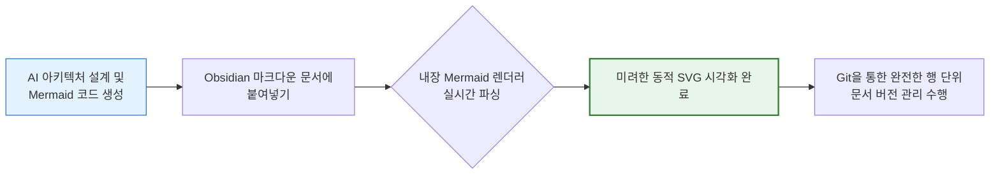

```mermaid  
graph LR  
A["AI 아키텍처 설계 및<br/>Mermaid 코드 생성"] --> B["Obsidian 마크다운 문서에<br/>붙여넣기"]  
B --> C{"내장 Mermaid 렌더러<br/>실시간 파싱"}  
C --> D["미려한 동적 SVG 시각화 완료"]  
D --> E["Git을 통한 완전한 행 단위<br/>문서 버전 관리 수행"]  
  
style A fill:#e3f2fd,stroke:#1565c0,stroke-width:1px  
style D fill:#e8f5e9,stroke:#2e7d32,stroke-width:2px  
```