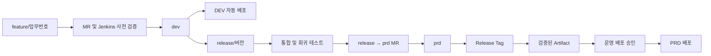
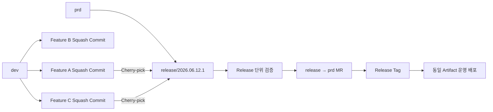
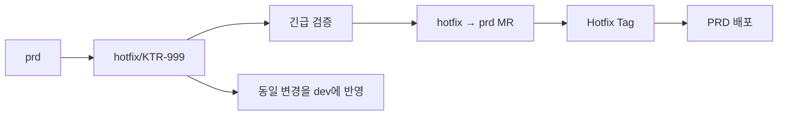
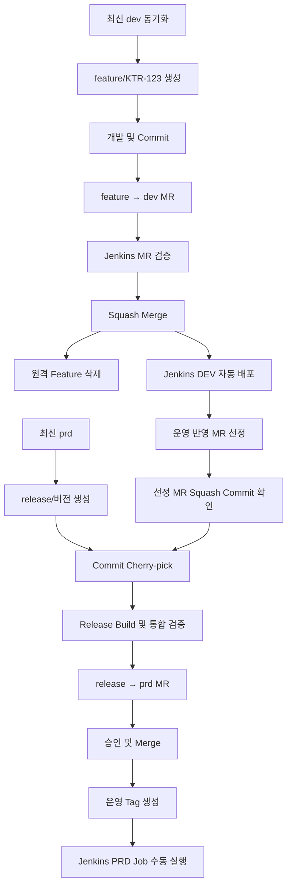
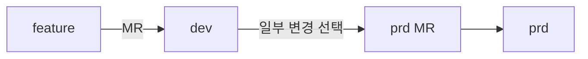
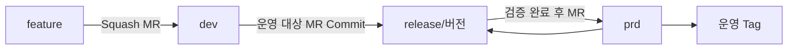

### 1. 현재 운영 방식 평가

현재 방식은 기본적인 형상관리 통제는 갖추고 있습니다.

|항목|평가|개선 필요성|
|---|---|---|
|`feature → dev` Merge Request|적절함|MR 병합 전 Jenkins 검증 추가 필요|
|MR 승인 후 원격 feature 삭제|적절함|MR·Commit 이력은 유지되므로 문제 없음|
|dev 변경 감지 후 자동 배포|적절함|중복 배포 방지와 배포 Commit 추적 필요|
|dev에서 운영 반영분만 선택|위험 요소가 큼|Release Branch 또는 Feature Flag 필요|
|`prd` Merge Request|적절함|승인·검증·릴리스 단위를 명확히 해야 함|
|PRD Jenkins Job 수동 실행|적절함|운영에서 다시 빌드하지 않고 검증된 Artifact를 승격해야 함|
|가장 큰 문제는 **dev 브랜치가 개발 통합 브랜치이면서 운영 반영 대상 선택 공간으로도 사용된다는 점**입니다.|||

### 2. 현재 방식의 주요 문제점

#### 2.1 dev 변경분을 선택적으로 PRD에 반영

`dev`에는 여러 개발자의 변경사항이 섞여 있을 가능성이 큽니다. 여기서 일부 파일이나 Commit을 선별하면 다음 문제가 발생할 수 있습니다.

- 공통 클래스·설정·DB 변경 누락
    
- 다른 Feature에 대한 숨은 의존성 누락
    
- Java 소스만 반영하고 XML, JSP, JavaScript, SQL 누락
    
- 동일 기능을 여러 Commit으로 나눈 경우 일부 Commit 누락
    
- 실제 dev에서 테스트한 소스와 PRD 소스가 달라짐
    
- 장애 발생 시 어떤 MR이 운영에 반영됐는지 추적하기 어려움  
    특히 **파일 단위 선택 반영은 금지**하는 것이 좋습니다. 운영 반영 단위는 최소한 `MR`, `Feature`, `Release` 중 하나여야 합니다.
    

#### 2.2 Merge 후에만 Jenkins 검증

현재 설명상 Jenkins dev Job은 `dev`에 병합된 이후 실행됩니다. 이 구조에서는 컴파일 오류나 테스트 실패가 발생한 소스가 이미 `dev`에 들어간 상태가 됩니다.  
GitLab과 Jenkins를 연동하면 MR 생성·갱신 또는 Push 시 Jenkins Job을 실행하고 결과를 GitLab MR 화면에 표시할 수 있습니다. GitLab의 `Pipelines must succeed` 설정을 적용하면 성공한 Pipeline이 없는 MR의 병합을 차단할 수 있습니다. ([GitLab Docs](https://docs.gitlab.com/integration/jenkins/?utm_source=chatgpt.com "Jenkins"))

#### 2.3 DEV와 PRD에서 각각 다시 빌드할 가능성

dev 배포 시 한 번 빌드하고 PRD 배포 시 다시 `mvn package`를 수행한다면 같은 Git 소스라도 다음 차이가 발생할 수 있습니다.

- Maven SNAPSHOT 의존성 변경
    
- 빌드 서버 환경 차이
    
- 빌드 시각·프로파일 차이
    
- 프런트엔드 빌드 결과 차이
    
- 외부 Repository 응답 차이  
    따라서 운영 배포는 소스를 다시 빌드하는 방식이 아니라 **검증된 동일 Artifact를 DEV/QA에서 PRD로 승격하는 방식**이 적절합니다. Jenkins는 Artifact 보관과 Fingerprint를 이용해 빌드 결과물의 추적 정보를 관리할 수 있습니다. ([Jenkins](https://www.jenkins.io/doc/pipeline/tour/tests-and-artifacts/?utm_source=chatgpt.com "Recording tests and artifacts"))
    

#### 2.4 운영 Merge 승인과 운영 배포 승인이 분리되지 않음

다음 권한은 구분하는 것이 좋습니다.

|권한|의미|
|---|---|
|MR 승인|소스 변경이 운영 후보로 적합한지 승인|
|PRD Merge|운영 기준 브랜치에 소스 포함|
|운영 배포 승인|실제 운영 서버에 배포할 시점 승인|
|Jenkins 실행|승인된 Artifact를 실제 서버에 적용|
|GitLab은 Protected Branch를 통해 직접 Push를 제한하고 Code Owner 및 승인 규칙을 적용할 수 있습니다. GitLab의 Protected Environment와 Deployment Approval은 라이선스에 따라 추가 적용할 수 있습니다. ([GitLab Docs](https://docs.gitlab.com/user/project/repository/branches/protected/?utm_source=chatgpt.com "Protected branches"))||

### 3. 권장 운영 모델

선택 배포가 계속 필요한지를 기준으로 두 가지 방식을 구분해야 합니다.

### 3.1 권장안 A: dev 전체를 하나의 Release로 운영

가장 이상적인 방식입니다.



운영 절차는 다음과 같습니다.

1. `feature/업무번호` 브랜치를 `dev`에서 생성
    
2. 개발자가 MR 생성
    
3. Jenkins에서 컴파일·단위 테스트·SonarQube 분석
    
4. 검증 성공 후 MR 승인
    
5. `dev`에 Squash Merge
    
6. Jenkins가 dev Artifact를 생성하고 DEV 자동 배포
    
7. 배포 대상이 정해지면 `release/버전`을 dev에서 생성
    
8. Release Branch를 QA 또는 별도 검증 환경에 배포
    
9. 통합·회귀 테스트 완료
    
10. `release/버전 → prd` MR
    
11. 승인 후 병합 및 Release Tag 생성
    
12. 검증한 동일 Artifact를 운영에 배포  
    이 방식에서는 `dev`에 병합된 모든 기능이 다음 Release에 포함됩니다. 아직 공개하면 안 되는 기능은 **Feature Flag**로 비활성화해야 합니다.
    

### 3.2 권장안 B: 선택적 운영 반영이 반드시 필요한 경우

현재 상황에는 이 방식이 현실적인 과도기 개선안입니다.



운영 절차는 다음과 같습니다.

1. `feature → dev` MR은 반드시 Squash Merge
    
2. 하나의 MR을 하나의 Squash Commit으로 관리
    
3. 운영 배포 시 최신 `prd`에서 `release/YYYY.MM.DD.N` 생성
    
4. 운영 대상 MR의 Squash Commit만 Release Branch에 Cherry-pick
    
5. Release Branch 전체를 빌드하고 통합 테스트
    
6. `release → prd` MR 생성
    
7. 운영 반영 MR 목록과 Commit SHA를 Release Manifest에 기록
    
8. 승인 후 PRD 병합
    
9. Release Tag 생성
    
10. Release Branch에서 검증한 Artifact와 동일한 결과물을 운영 배포  
    GitLab은 Commit 또는 MR 변경사항을 다른 Branch로 Cherry-pick할 수 있으며, Squash Merge를 사용하면 여러 개발 Commit을 하나의 기능 단위 Commit으로 정리할 수 있습니다. ([GitLab Docs](https://docs.gitlab.com/user/project/merge_requests/cherry_pick_changes/?utm_source=chatgpt.com "Cherry-pick changes"))  
    예:
    

```text
feature/KTR-123
  ↓ Squash Merge
dev commit: abc1234 KTR-123 상품검색 응답속도 개선
  ↓ Cherry-pick
release/2026.06.12.1 commit: def5678 KTR-123 상품검색 응답속도 개선
```

다만 Cherry-pick 기반 모델은 dev와 prd의 Commit SHA가 달라지고 브랜치 이력이 분기되는 단점이 있습니다. 따라서 장기적으로는 권장안 A와 Feature Flag 방식으로 전환하는 것이 좋습니다.

### 4. Jenkins Pipeline 개선안

#### 4.1 Jenkins Job을 검증과 배포로 분리

|Job|Trigger|주요 역할|
|---|---|---|
|`MR-VALIDATION`|MR 생성·Push|Compile, Unit Test, SonarQube, 정적 분석|
|`DEV-BUILD-DEPLOY`|dev Merge|Artifact 생성, Nexus 업로드, DEV 배포|
|`RELEASE-BUILD`|release Branch 생성·변경|Release Artifact 생성, QA 배포|
|`PRD-DEPLOY`|수동 승인|기존 Release Artifact만 운영 배포|
|`PRD-ROLLBACK`|수동 실행|이전 Release Artifact 재배포|
|Jenkins의 GitLab 연동을 사용하면 Push나 MR 이벤트로 Jenkins를 실행하고 Build Status를 GitLab에 반환할 수 있습니다. ([GitLab Docs](https://docs.gitlab.com/integration/jenkins/?utm_source=chatgpt.com "Jenkins"))|||

#### 4.2 Build Once, Deploy Many 적용

현재:

```text
DEV Job: Git Checkout → Maven Build → DEV 배포
PRD Job: Git Checkout → Maven Build → PRD 배포
```

개선:

```text
Release Build:
Git Checkout
→ Maven Build
→ 테스트
→ Artifact SHA-256 생성
→ Nexus 저장
→ DEV/QA 배포
PRD Deploy:
Nexus Artifact 다운로드
→ SHA-256 검증
→ 운영 배포
```

Artifact 예:

```text
groupId      : kr.co.ktr
artifactId   : ktr-commerce
version      : 2026.06.12.1
gitCommit    : abc123456789
jenkinsBuild : RELEASE-BUILD-125
sha256       : 8fa3...
```

PRD Job에서는 다음 작업을 하지 않는 것이 원칙입니다.

```text
mvn clean package
npm build
소스 수정
환경별 파일 치환
SNAPSHOT 의존성 다운로드
```

#### 4.3 운영 승인 정보 기록

Jenkins `input` 단계를 사용하면 Pipeline 실행 중 사람의 승인 또는 중단을 받을 수 있습니다. ([Jenkins](https://www.jenkins.io/doc/pipeline/steps/pipeline-input-step/?utm_source=chatgpt.com "Pipeline: Input Step"))  
운영 승인 시 최소한 다음 정보를 입력받아 기록하는 것이 좋습니다.

|항목|예시|
|---|---|
|Release Version|`2026.06.12.1`|
|Artifact|`ktr-commerce-2026.06.12.1.war`|
|Git Commit|`abc1234`|
|Git Tag|`v2026.06.12.1`|
|변경 요청 번호|`CHG-20260612-01`|
|승인자|운영 책임자|
|배포자|Jenkins 실행자|
|배포 시각|실제 수행 시각|
|Rollback Version|`2026.06.05.2`|

#### 4.4 동시 배포 방지

PRD Job에는 다음 통제가 필요합니다.

```groovy
options {
    disableConcurrentBuilds()
    timestamps()
}
```

동일 애플리케이션에 대해 두 운영 배포가 동시에 수행되지 않도록 해야 합니다.

### 5. GitLab 설정 개선안

#### 5.1 Branch 보호

|브랜치|Direct Push|Force Push|Merge 권한|삭제|
|---|--:|--:|---|--:|
|`feature/*`|허용|제한적 허용|개발자|허용|
|`dev`|금지|금지|Maintainer 또는 승인자|금지|
|`release/*`|금지|금지|Release 담당자|배포 후 허용|
|`prd`|금지|금지|운영 승인자|금지|
|Protected Branch를 사용하면 직접 Push와 권한 없는 Merge를 차단할 수 있습니다. ([GitLab Docs](https://docs.gitlab.com/user/project/repository/branches/protected/?utm_source=chatgpt.com "Protected branches"))|||||

#### 5.2 Merge Request 필수 조건

`feature → dev`:

- Jenkins Build 성공
    
- Unit Test 성공
    
- SonarQube Quality Gate 성공
    
- 미해결 Discussion 없음
    
- 최소 1명 승인
    
- 작성자 본인 승인 금지
    
- Squash Commit 필수  
    `release → prd`:
    
- Release Build 성공
    
- 통합·회귀 테스트 완료
    
- 운영 대상 MR 목록 첨부
    
- DB Script 및 설정 변경 검토
    
- Rollback 계획 첨부
    
- 개발 책임자·운영 책임자 승인  
    GitLab은 모든 Discussion이 해결되기 전 병합을 제한할 수 있고, 승인 규칙을 이용해 검토 절차를 강제할 수 있습니다. ([GitLab Docs](https://docs.gitlab.com/user/project/merge_requests/?utm_source=chatgpt.com "Merge requests"))
    

#### 5.3 Squash Merge 규칙

선택 배포를 수행하려면 다음 규칙이 필요합니다.

```text
1 MR = 1 업무 = 1 Squash Commit
```

권장 Commit Message:

```text
[KTR-123] 상품검색 API Connection Pool 적용
- OkHttpClient Singleton 적용
- ConnectionPool 설정 추가
- Timeout 및 예외 처리 개선
```

이렇게 관리하면 Release Branch에 업무 단위로 Cherry-pick하기 쉽고, 운영 반영 여부도 MR 기준으로 추적할 수 있습니다.

### 6. Release Manifest 도입

운영 배포마다 다음 문서를 남기는 것이 좋습니다.

```yaml
releaseVersion: 2026.06.12.1
releaseDate: 2026-06-12
sourceBranch: release/2026.06.12.1
targetBranch: prd
gitTag: v2026.06.12.1
artifact:
  name: ktr-commerce-2026.06.12.1.war
  sha256: 8fa3...
mergeRequests:
  - id: KTR-123
    commit: abc1234
    description: 상품검색 API 성능 개선
  - id: KTR-130
    commit: ddd9876
    description: DBCP Connection 검증 설정 변경
databaseChanges:
  - V20260612_01__add_search_index.sql
configurationChanges:
  - context-datasource.xml
rollbackVersion: 2026.06.05.2
```

이를 통해 GitLab MR, Git Commit, Jenkins Build, Artifact, 실제 운영 배포를 연결할 수 있습니다.

### 7. Hotfix 운영 방식

운영 긴급 장애 수정은 일반 Feature와 분리해야 합니다.



핵심 규칙은 다음과 같습니다.

```text
hotfix는 prd에서 생성
hotfix → prd MR
운영 배포 후 동일 변경을 dev에도 반드시 반영
```

Hotfix를 `prd`에만 반영하면 이후 `dev → prd` 배포에서 긴급 수정 내용이 사라질 수 있습니다.

### 8. DB 변경 시 추가 통제

선택 배포에서는 애플리케이션보다 DB 변경이 더 위험합니다.

|위험|개선 원칙|
|---|---|
|컬럼 삭제 후 구버전 실행|즉시 삭제하지 않고 단계적 제거|
|NOT NULL 컬럼 즉시 추가|기본값 또는 Nullable 단계 선행|
|API와 DB 동시 변경|구버전·신버전 동시 호환|
|Rollback 시 Schema 불일치|Expand-Contract 방식 적용|
|SQL 누락|Release Manifest에 SQL 명시|
|권장 순서:||

```text
1. 신규 컬럼·테이블 추가
2. 구버전과 신버전이 모두 동작하도록 배포
3. 데이터 이관
4. 신버전 사용 전환
5. 충분한 검증 후 기존 컬럼 제거
```

### 9. 단계별 적용 우선순위

|우선순위|개선 항목|난이도|효과|
|--:|---|--:|--:|
|1|dev/prd Direct Push 금지|하|높음|
|2|MR 생성 시 Jenkins 사전 검증|중|매우 높음|
|3|`Pipelines must succeed` 적용|하|높음|
|4|`1 MR = 1 Squash Commit` 적용|하|높음|
|5|파일 단위 선택 반영 금지|하|매우 높음|
|6|Release Branch 도입|중|매우 높음|
|7|Release Manifest 도입|하|높음|
|8|Build Once, Deploy Many 적용|중~상|매우 높음|
|9|PRD Rollback Job 구축|중|매우 높음|
|10|Feature Flag 도입|상|매우 높음|
|11|QA 또는 Staging 환경 분리|상|매우 높음|
|12|Merge Train 적용|중|중~높음|
|MR이 빈번한 프로젝트에서는 Merge Train으로 MR을 순서대로 대기시키고 앞선 MR들과 함께 검증할 수 있습니다. 다만 GitLab 라이선스와 현재 사용 중인 GitLab 16.5.0에서의 지원 범위를 별도로 확인해야 합니다. ([GitLab Docs](https://docs.gitlab.com/ci/pipelines/merge_trains/?utm_source=chatgpt.com "Merge trains"))||||

### 10. 최종 권장 구조

현재 환경에 바로 적용하기 좋은 구조는 다음과 같습니다.

```text
feature/*
  ↓ MR + Jenkins 사전 검증
dev
  ↓ 자동 Build/DEV 배포
release/YYYY.MM.DD.N
  ↓ 운영 대상 Squash Commit 선택
  ↓ Release Artifact 생성
  ↓ 통합·회귀 테스트
prd MR
  ↓ 개발/운영 승인
Release Tag
  ↓ Jenkins 수동 승인
동일 Artifact PRD 배포
```

핵심 개선 원칙은 네 가지입니다.

1. **운영 반영분을 파일이 아닌 MR·Feature 단위로 관리**
    
2. **Merge 이전에 Jenkins 검증을 완료**
    
3. **운영에서는 소스를 재빌드하지 않고 검증된 Artifact를 배포**
    
4. **Git Commit, Release Tag, Artifact, Jenkins Build, 운영 배포 이력을 하나로 연결**  
    현재 방식은 전면 교체가 필요한 수준은 아니며, `Release Branch`, `MR 사전 검증`, `Artifact 승격` 세 가지를 추가하는 것만으로도 운영 반영의 안정성과 추적성이 크게 개선됩니다.


### 1. 적용 결론

현재 운영 방식은 `dev`에 여러 기능이 통합되어 있고, 그중 일부만 `prd`에 반영하는 **선택 배포 방식**입니다.  
따라서 Release Branch는 다음과 같이 운영하는 것이 가장 안전합니다.

```text
feature/* → dev MR → DEV 자동 배포
                         ↓ 운영 반영 대상 MR 선정
prd → release/* 생성 → 선정 MR의 Commit만 Cherry-pick
                         ↓ Release 검증
release/* → prd MR → PRD 수동 배포
```

핵심은 다음과 같습니다.

> `release/*` 브랜치는 `dev`가 아니라 최신 `prd`에서 생성한다.  
> `dev`에서 Release Branch를 생성하면 아직 운영 대상이 아닌 다른 개발자의 변경사항까지 포함됩니다. 현재처럼 선택 배포가 필요한 환경에서는 `prd`를 기준으로 Release Branch를 만든 후, 운영 대상 Feature의 변경만 MR 단위로 가져와야 합니다.

### 2. 브랜치별 역할

|브랜치|기준 브랜치|역할|수명|
|---|---|---|---|
|`feature/KTR-123`|`dev`|개별 기능 개발|개발 완료 후 삭제|
|`dev`|장기 유지|개발 통합 및 DEV 서버 배포 기준|영구|
|`release/2026.06.12.1`|`prd`|운영 반영 대상만 모은 운영 후보|운영 배포 후 삭제 가능|
|`prd`|장기 유지|실제 운영 반영 소스 기준|영구|
|`v2026.06.12.1`|`prd` Commit|실제 운영 배포 버전 고정|영구|
|Release Branch는 하나를 계속 사용하는 방식보다 배포 단위로 새로 생성하는 방식을 권장합니다.||||

```text
release/2026.06.12.1
release/2026.06.19.1
release/2026.06.19.2
```

또는 업무에서 Semantic Version을 사용한다면 다음과 같이 구성할 수 있습니다.

```text
release/1.8.0
release/1.8.1
```

### 3. 전체 흐름



### 4. 기존 운영 방식에서 변경되는 부분

|단계|현재 방식|Release Branch 도입 후|
|---|---|---|
|Feature 생성|`dev`에서 생성|동일|
|Feature 개발|Feature Branch에서 개발|동일|
|DEV 반영|`feature → dev` MR|동일|
|Feature 원격 브랜치 삭제|MR Merge 후 삭제|동일|
|DEV 배포|dev 변경 감지 후 자동 배포|동일|
|운영 대상 선택|dev 변경분을 직접 prd MR에 반영|운영 대상 MR의 Commit을 Release Branch에 반영|
|PRD MR|`dev → prd` 또는 dev 변경분 기준|`release/* → prd`|
|운영 전 검증|dev 기준 검증|실제 운영 후보인 Release Branch 기준 검증|
|PRD 배포|Jenkins PRD Job 수동 실행|동일하되 Tag 또는 Release Version 지정 권장|
|가장 중요한 변경은 다음 두 가지입니다.|||

```text
기존: dev → prd Merge Request
변경: release/버전 → prd Merge Request
```

```text
기존: dev에서 운영 반영분 선택
변경: prd에서 Release Branch를 만들고 운영 대상 MR Commit만 Cherry-pick
```

### 5. 사전 GitLab 설정

#### 5.1 Feature MR의 Squash 필수화

선택 배포에서는 다음 원칙이 중요합니다.

```text
1개 업무 = 1개 Feature Branch = 1개 MR = 1개 운영 반영 Commit
```

개발자가 Feature Branch에서 여러 번 Commit하더라도 `dev`에 병합될 때는 하나의 Squash Commit으로 합치는 것이 좋습니다.  
예:

```text
feature/KTR-123 개발 Commit
- 111aaaa 기본 기능 작성
- 222bbbb 오류 처리 추가
- 333cccc 코드 리뷰 반영
dev 병합 결과
- abc1234 [KTR-123] 상품검색 API 개선
```

GitLab의 Squash Merge는 Feature Branch의 여러 Commit을 하나의 논리적인 Commit으로 합쳐 Feature 단위 추적과 Revert를 쉽게 합니다. 다만 프로젝트 Merge Method가 일반 Merge Commit 방식이면 Squash Commit과 Merge Commit 두 개가 생성될 수 있고, Fast-forward Merge 방식이면 Squash Commit 하나만 Target Branch에 추가됩니다. ([GitLab Docs](https://docs.gitlab.com/user/project/merge_requests/squash_and_merge/ "Squash and merge | GitLab Docs"))  
GitLab 설정:

```text
Settings
  → Merge requests
  → Squash commits when merging
```

권장 설정:

```text
Squash option: Require
```

GitLab 16.5.0에서는 실제 메뉴 표현이 최신 GitLab 문서와 일부 다를 수 있으므로 현재 프로젝트 설정 화면에서 `Squash commits when merging` 항목을 확인해야 합니다.

#### 5.2 브랜치 보호

권장 권한은 다음과 같습니다.

|브랜치 패턴|Direct Push|MR Merge|Force Push|삭제|
|---|--:|--:|--:|--:|
|`dev`|금지|Maintainer/승인자|금지|금지|
|`prd`|금지|운영 승인자|금지|금지|
|`release/*`|Release 담당자만 허용|Maintainer|금지|배포 후 허용|
|`feature/*`|개발자 허용|개발자|제한적 허용|MR 후 삭제|
|GitLab Protected Branch는 Push와 Merge 권한을 구분하고, 중요 브랜치의 강제 Push나 우발적 삭제를 방지할 수 있습니다. 최신 GitLab 문서에서는 `Branch rules`를 사용하도록 안내하지만, GitLab 16.5.0에서는 일반적으로 `Settings → Repository → Protected branches`에서 설정합니다. ([GitLab Docs](https://docs.gitlab.com/user/project/repository/branches/protected/ "Protected branches \| GitLab Docs"))|||||

#### 5.3 MR Pipeline 성공 조건

`feature → dev`, `release → prd` MR 모두 Jenkins 검증 성공 후에만 Merge하도록 설정하는 것이 좋습니다.  
GitLab은 외부 CI인 Jenkins의 Pipeline 상태도 Merge 조건으로 사용할 수 있으며, `Pipelines must succeed`를 활성화하면 성공한 Pipeline이 없는 MR의 병합을 차단합니다. ([GitLab Docs](https://docs.gitlab.com/user/project/merge_requests/auto_merge/ "Auto-merge | GitLab Docs"))  
설정 위치:

```text
Settings
  → Merge requests
  → Merge checks
  → Pipelines must succeed
```

### 6. 1단계: 개발 시작 전 dev 최신화

개발자는 항상 최신 `dev`에서 Feature Branch를 생성합니다.

```bash
git fetch origin --prune
git switch dev
git pull --ff-only origin dev
```

확인:

```bash
git status
git log --oneline -5
```

정상 상태:

```text
On branch dev
Your branch is up to date with 'origin/dev'.
nothing to commit, working tree clean
```

`git pull --ff-only`를 사용하는 이유는 개발자가 로컬 `dev`에서 실수로 별도 Commit을 만든 경우 자동 Merge Commit이 발생하는 것을 방지하기 위해서입니다.

### 7. 2단계: Feature Branch 생성

예시 업무번호를 `KTR-123`으로 가정합니다.

```bash
git switch -c feature/KTR-123
git push -u origin feature/KTR-123
```

확인:

```bash
git branch -vv
```

결과 예:

```text
* feature/KTR-123 abc1234 [origin/feature/KTR-123] ...
  dev             def5678 [origin/dev] ...
```

브랜치명 권장 규칙:

```text
feature/KTR-123-product-search
feature/KTR-130-dbcp-validation
feature/KTR-145-order-timeout
```

### 8. 3단계: 개발 및 Push

소스를 수정한 후 다음과 같이 Commit합니다.

```bash
git status
git add src/main/java/...
git add src/main/resources/...
git commit -m "[KTR-123] 상품검색 API 응답 처리 개선"
git push origin feature/KTR-123
```

추가 수정:

```bash
git add .
git commit -m "[KTR-123] 코드 리뷰 전 예외 처리 보완"
git push
```

Feature Branch에서는 여러 Commit을 생성해도 되지만, 하나의 Feature Branch에는 하나의 업무만 포함해야 합니다.  
피해야 할 구조:

```text
feature/KTR-123
- 상품검색 개선
- 장바구니 오류 수정
- DBCP 설정 변경
```

권장 구조:

```text
feature/KTR-123 : 상품검색 개선
feature/KTR-124 : 장바구니 오류 수정
feature/KTR-125 : DBCP 설정 변경
```

### 9. 4단계: MR 생성 전 최신 dev 반영

Feature 개발 중 다른 변경사항이 `dev`에 먼저 반영될 수 있으므로 MR 병합 전에 최신 `dev`와의 충돌을 확인합니다.

#### 9.1 단독 개발 Feature인 경우: Rebase 권장

```bash
git fetch origin --prune
git switch feature/KTR-123
git rebase origin/dev
```

충돌 발생 시:

```bash
git status
```

충돌 파일 수정 후:

```bash
git add <충돌해결파일>
git rebase --continue
```

중단:

```bash
git rebase --abort
```

Rebase 후 원격 Push:

```bash
git push --force-with-lease origin feature/KTR-123
```

`--force`가 아니라 `--force-with-lease`를 사용해야 다른 개발자가 원격 Feature Branch에 추가한 Commit을 실수로 덮어쓰는 위험을 줄일 수 있습니다.

#### 9.2 여러 개발자가 같은 Feature Branch를 공유하는 경우

공유 Feature Branch에서는 Rebase보다 Merge 방식이 안전합니다.

```bash
git fetch origin --prune
git switch feature/KTR-123
git merge origin/dev
git push origin feature/KTR-123
```

다만 최종 MR에서 Squash Merge하므로 Feature Branch의 중간 Merge Commit은 `dev`에 그대로 남지 않습니다.

### 10. 5단계: `feature → dev` Merge Request

GitLab에서 다음 MR을 생성합니다.

```text
Source Branch : feature/KTR-123
Target Branch : dev
```

#### 10.1 기존 방식에서 유지되는 항목

- Target Branch는 계속 `dev`
    
- 개발자 코드 리뷰 수행
    
- MR 승인 후 Merge
    
- Merge 후 원격 Feature Branch 삭제
    
- dev 변경 감지 후 Jenkins DEV Job 자동 실행
    

#### 10.2 새로 필수화할 항목

- `Squash commits` 선택
    
- MR 제목에 업무번호 포함
    
- 하나의 MR에 하나의 업무만 포함
    
- MR Pipeline 성공 후 Merge
    
- 운영 반영 시 사용할 Squash Commit SHA 기록  
    MR 제목 예:
    

```text
[KTR-123] 상품검색 API Connection Pool 적용
```

MR 설명 예:

```text
업무번호: KTR-123
변경내용:
- OkHttpClient 공용 Bean 적용
- Connection Pool 설정 추가
- Timeout 예외 처리 개선
영향범위:
- 상품검색 API
- 자동완성 API
DB 변경: 없음
설정 변경: context-http-client.xml
운영 반영 필요 여부: 필요
```

MR Merge 시:

```text
☑ Squash commits
☑ Delete source branch
```

### 11. 6단계: Feature MR 병합 후 로컬 정리

GitLab에서 MR이 승인되면:

```text
feature/KTR-123 → dev Merge
origin/feature/KTR-123 삭제
Jenkins DEV Job 자동 실행
```

원격 Feature Branch가 삭제되어도 로컬 Feature Branch는 자동으로 삭제되지 않습니다.

```bash
git fetch origin --prune
git switch dev
git pull --ff-only origin dev
git branch -d feature/KTR-123
```

강제 삭제가 필요할 때만:

```bash
git branch -D feature/KTR-123
```

`-D`는 병합되지 않은 로컬 Commit도 삭제하므로 신중하게 사용해야 합니다.

### 12. 7단계: DEV 테스트 및 운영 대상 MR 선정

DEV 서버에서 기능 테스트를 수행한 후 운영 반영 대상을 선정합니다.  
예:

|MR|업무|dev 반영|운영 반영|
|--:|---|--:|--:|
|!1201|상품검색 API 개선|완료|포함|
|!1202|신규 이벤트 화면|완료|제외|
|!1203|DBCP Connection 검증|완료|포함|
|!1204|주문 UI 개편|완료|제외|
|운영 반영 대상:||||

```text
MR !1201
MR !1203
```

운영 제외 대상:

```text
MR !1202
MR !1204
```

이 단계부터는 더 이상 `dev → prd` MR을 생성하지 않습니다.

### 13. 8단계: 운영 대상 Squash Commit 확인

각 MR이 `dev`에 병합될 때 만들어진 Feature 단위 Commit SHA를 확인합니다.  
GitLab MR 화면에서 확인할 정보:

```text
MR 번호
업무번호
MR 제목
Squash Commit SHA
Merge Commit SHA
```

예:

```text
MR !1201
Squash Commit: a1b2c3d
MR !1203
Squash Commit: e4f5g6h
```

로컬 확인:

```bash
git fetch origin --prune
git log origin/dev --oneline --decorate -30
```

특정 Commit 확인:

```bash
git show --stat a1b2c3d
git show --stat e4f5g6h
```

#### Merge Commit과 Squash Commit 구분

프로젝트가 일반 Merge Commit 방식을 사용한다면 하나의 MR 병합 시 다음과 같이 나타날 수 있습니다.

```text
m111111 Merge branch 'feature/KTR-123' into 'dev'
a1b2c3d [KTR-123] 상품검색 API 개선
```

Release Branch에는 원칙적으로 `a1b2c3d`와 같은 Squash Commit을 Cherry-pick합니다.  
Merge Commit의 두 번째 부모가 Squash Commit인지 확인:

```bash
git rev-parse m111111^2
```

결과:

```text
a1b2c3d...
```

Commit 내용 비교:

```bash
git show m111111^2
```

Squash Commit을 찾을 수 없고 Merge Commit 자체를 반영해야 한다면 다음 명령이 필요할 수 있습니다.

```bash
git cherry-pick -m 1 -x m111111
```

하지만 `-m 1`은 Merge Commit의 첫 번째 부모를 기준으로 변경분을 적용하므로, Commit 구조를 확인하지 않고 사용하는 것은 위험합니다. 가능하면 Squash Commit SHA를 운영 반영 단위로 사용해야 합니다.

### 14. 9단계: Release Branch 생성

#### 14.1 가장 중요한 기준

Release Branch는 최신 `prd`에서 생성합니다.

```bash
git fetch origin --prune
git switch prd
git pull --ff-only origin prd
```

Release Branch 생성:

```bash
git switch -c release/2026.06.12.1
```

원격 생성:

```bash
git push -u origin release/2026.06.12.1
```

한 번에 생성하려면:

```bash
git fetch origin --prune
git switch -c release/2026.06.12.1 origin/prd
git push -u origin release/2026.06.12.1
```

현재 기준 확인:

```bash
git log --oneline --decorate -5
git merge-base release/2026.06.12.1 origin/prd
git rev-parse origin/prd
```

Release 생성 시점에는 다음 두 SHA가 같아야 합니다.

```text
release 생성 기준 SHA
origin/prd HEAD SHA
```

#### 잘못된 생성 방법

```bash
git switch dev
git switch -c release/2026.06.12.1
```

위 방식은 `dev`의 모든 변경사항이 Release Branch에 포함되므로 현재 선택 배포 정책과 맞지 않습니다.

### 15. 10단계: 운영 대상 Commit Cherry-pick

Release Branch로 이동합니다.

```bash
git switch release/2026.06.12.1
```

운영 대상 Commit을 오래된 순서부터 반영합니다.

```bash
git cherry-pick -x a1b2c3d
git cherry-pick -x e4f5g6h
```

여러 Commit을 한 번에 적용:

```bash
git cherry-pick -x a1b2c3d e4f5g6h
```

`-x` 옵션을 사용하면 새 Commit 메시지에 원본 Commit SHA가 기록됩니다.  
예:

```text
(cherry picked from commit a1b2c3d...)
```

따라서 Release Branch의 Commit과 원래 `dev`의 Feature Commit을 추적하기 쉽습니다.  
Cherry-pick 후 확인:

```bash
git log --oneline --decorate origin/prd..HEAD
```

예상 결과:

```text
77aa111 [KTR-130] DBCP Connection 검증 설정 변경
55bb222 [KTR-123] 상품검색 API 개선
```

원격 Push:

```bash
git push origin release/2026.06.12.1
```

GitLab 16.9 이후에는 일부 Fast-forward/Squash MR도 GitLab UI에서 전체 Cherry-pick할 수 있지만, 이 기능은 16.9 이후 조건부로 지원됩니다. 현재 환경이 GitLab 16.5.0이라면 MR 화면의 Cherry-pick 기능에 의존하지 말고 CLI에서 Squash Commit을 `git cherry-pick -x`로 적용하는 방식을 권장합니다. ([GitLab Docs](https://docs.gitlab.com/user/project/merge_requests/cherry_pick_changes/ "Cherry-pick changes | GitLab Docs"))

### 16. Cherry-pick 충돌 처리

충돌 발생:

```text
CONFLICT (content): Merge conflict in ...
error: could not apply a1b2c3d...
```

상태 확인:

```bash
git status
```

충돌 파일 수정 후:

```bash
git add <충돌해결파일>
git cherry-pick --continue
```

Cherry-pick 취소:

```bash
git cherry-pick --abort
```

충돌 해결 후 반드시 다음 내용을 확인해야 합니다.

```bash
git diff HEAD^ HEAD
git show --stat HEAD
```

충돌이 발생했다는 것은 해당 Feature가 다른 `dev` 변경사항에 의존하거나 현재 `prd` 코드와 차이가 크다는 의미일 수 있습니다. 단순히 컴파일 오류만 제거하지 말고 기능 의존성을 다시 검토해야 합니다.

### 17. Commit 적용 순서

Cherry-pick은 다음 순서로 적용해야 합니다.

```text
1. 공통 기반 기능
2. DB 또는 Domain 변경
3. Service 변경
4. Controller/API 변경
5. 화면 및 JavaScript 변경
6. 설정 변경
```

예:

```text
KTR-100 공통 VO 추가
KTR-101 Service 구현
KTR-102 Controller 구현
```

적용:

```bash
git cherry-pick -x <KTR-100-SHA>
git cherry-pick -x <KTR-101-SHA>
git cherry-pick -x <KTR-102-SHA>
```

반대로 적용하면 중간 Commit에서 컴파일 오류가 발생할 수 있습니다.

### 18. Release Branch 반영 내용 검증

#### 18.1 포함 Commit 확인

```bash
git log --oneline origin/prd..release/2026.06.12.1
```

#### 18.2 변경 파일 확인

```bash
git diff --name-status origin/prd..release/2026.06.12.1
```

#### 18.3 전체 변경 내용 확인

```bash
git diff origin/prd..release/2026.06.12.1
```

#### 18.4 변경 통계 확인

```bash
git diff --stat origin/prd..release/2026.06.12.1
```

#### 18.5 운영 제외 기능 포함 여부 검색

예:

```bash
git log --oneline origin/prd..release/2026.06.12.1
```

결과에 운영 제외 대상이 없어야 합니다.

```text
포함 대상:
[KTR-123] 상품검색 API 개선
[KTR-130] DBCP Connection 검증
제외 대상:
[KTR-124] 신규 이벤트 화면
[KTR-131] 주문 UI 개편
```

#### 18.6 빌드

```bash
mvn clean verify
```

프로젝트에 별도 Profile이 있다면:

```bash
mvn clean verify -Pdev
```

단, 환경별 설정을 WAR 안에 직접 포함하는 방식이라면 Release Artifact와 운영 Artifact의 동일성 문제가 있으므로 향후 외부 설정화 또는 Artifact 승격 구조를 검토해야 합니다.

### 19. 11단계: Release Branch 검증

Release Branch는 실제 운영 후보이므로 `dev`와 별도로 검증해야 합니다.

#### 최소 적용안

```text
release/* Push
→ Jenkins Release Build Job 실행
→ Compile
→ Unit Test
→ SonarQube
→ WAR 생성
```

#### 권장 적용안

```text
release/* Push
→ Jenkins Release Build
→ QA 또는 STG 서버 배포
→ 통합 테스트
→ 회귀 테스트
→ 운영 승인
```

현재 DEV 서버는 `dev` 브랜치 변경 시 자동 배포되므로 Release Branch를 동일 DEV 서버에 배포하면 다른 dev Push에 의해 덮어써질 수 있습니다.  
따라서 권장 구조는 다음과 같습니다.

|환경|배포 브랜치|Trigger|
|---|---|---|
|DEV|`dev`|자동|
|QA/STG|`release/*`|자동 또는 수동|
|PRD|Tag 또는 `prd`|수동|
|QA/STG 환경을 즉시 추가하기 어렵다면 최소한 Release Branch 전용 Jenkins Build Job을 만들어 빌드와 자동 테스트를 수행해야 합니다.|||

### 20. Release 검증 중 오류 수정

Release 검증에서 오류가 발견되면 Release Branch에 직접 수정하지 않는 것이 좋습니다.

#### 방법 A: dev에도 존재하는 일반 기능 오류

`dev`에서 수정 Feature Branch를 생성합니다.

```bash
git fetch origin --prune
git switch dev
git pull --ff-only origin dev
git switch -c feature/KTR-123-fix
```

수정:

```bash
git add .
git commit -m "[KTR-123] 상품검색 API 오류 수정"
git push -u origin feature/KTR-123-fix
```

GitLab:

```text
feature/KTR-123-fix → dev MR
```

MR Merge 후 생성된 Squash Commit을 Release Branch에 추가:

```bash
git fetch origin --prune
git switch release/2026.06.12.1
git pull --ff-only
git cherry-pick -x <수정-Squash-SHA>
git push
```

이 방식은 수정사항이 `dev`와 Release Branch 양쪽에 모두 반영되므로 가장 권장됩니다.

#### 방법 B: Release 조합에서만 발생하는 오류

Release Branch에서 수정 브랜치를 생성합니다.

```bash
git switch release/2026.06.12.1
git pull --ff-only
git switch -c release-fix/KTR-123
```

수정:

```bash
git add .
git commit -m "[KTR-123] Release 통합 오류 수정"
git push -u origin release-fix/KTR-123
```

GitLab MR:

```text
release-fix/KTR-123 → release/2026.06.12.1
```

이후 같은 수정사항을 반드시 `dev`에도 반영해야 합니다.

```text
release-fix Commit
→ dev용 Feature Branch에 Cherry-pick
→ feature → dev MR
```

Release에만 수정하고 dev에 반영하지 않으면 다음 배포에서 동일 오류가 다시 발생할 수 있습니다.

### 21. 12단계: `release → prd` Merge Request

검증이 끝나면 GitLab에서 MR을 생성합니다.

```text
Source Branch : release/2026.06.12.1
Target Branch : prd
```

이것이 기존 `dev → prd` MR을 대체합니다.

#### MR 제목

```text
[RELEASE] 2026.06.12.1 운영 반영
```

#### MR 설명 필수 항목

```text
Release Version: 2026.06.12.1
Source Branch: release/2026.06.12.1
Target Branch: prd
운영 반영 MR:
- !1201 [KTR-123] 상품검색 API 개선
- !1203 [KTR-130] DBCP Connection 검증
원본 dev Commit:
- a1b2c3d
- e4f5g6h
Release Commit:
- 55bb222
- 77aa111
Jenkins Release Build:
- RELEASE-BUILD #125
DB 변경:
- 없음
설정 변경:
- context-datasource.xml
Rollback 대상:
- v2026.06.05.1
테스트 결과:
- Compile 성공
- Unit Test 성공
- SonarQube Quality Gate 성공
- QA 통합 테스트 성공
```

#### MR 승인 조건

|조건|필수|
|---|--:|
|Release Pipeline 성공|필수|
|운영 대상 MR 목록 확인|필수|
|불필요한 Commit 미포함 확인|필수|
|DB 변경 검토|해당 시 필수|
|설정 변경 검토|해당 시 필수|
|Rollback 버전 확인|필수|
|개발 책임자 승인|필수|
|운영 담당자 승인|권장|

### 22. PRD가 Release 준비 중 변경된 경우

Release Branch를 만든 후 다른 Hotfix나 Release가 먼저 `prd`에 반영될 수 있습니다.  
현재 상태 확인:

```bash
git fetch origin --prune
git log --oneline release/2026.06.12.1..origin/prd
```

출력되는 Commit이 있다면 `prd`가 Release Branch보다 앞서 있습니다.

#### 가장 안전한 방법

Release 규모가 작다면 새로운 최신 `prd` 기준으로 Release Branch를 다시 생성하고 운영 대상 Commit을 다시 Cherry-pick합니다.

```bash
git switch prd
git pull --ff-only origin prd
git switch -c release/2026.06.12.2
git cherry-pick -x a1b2c3d
git cherry-pick -x e4f5g6h
git push -u origin release/2026.06.12.2
```

기존 Release Branch:

```bash
git push origin --delete release/2026.06.12.1
git branch -D release/2026.06.12.1
```

이미 통합 테스트를 상당 부분 수행했다면 최신 `prd`를 Release에 반영할 수도 있습니다.

```bash
git switch release/2026.06.12.1
git merge origin/prd
git push
```

하지만 기준 소스가 변경되었으므로 Release 테스트를 다시 수행해야 합니다.  
운영 원칙상 동일 애플리케이션의 Release Branch는 한 번에 하나만 준비하는 것이 가장 단순합니다.

### 23. 13단계: `release → prd` Merge

GitLab에서 다음을 확인한 후 Merge합니다.

```text
Pipeline passed
Required approvals satisfied
No unresolved discussions
No merge conflicts
```

`release → prd` MR에서는 다시 Squash하지 않는 것을 권장합니다.  
이유:

- Release Branch에는 이미 Feature 단위 Commit이 정리되어 있음
    
- Release에 포함된 각 업무 Commit 이력을 유지할 수 있음
    
- 운영 장애 발생 시 특정 업무 Commit 추적이 쉬움  
    권장:
    

```text
feature → dev MR      : Squash 사용
release → prd MR      : Squash 사용하지 않음
```

단, GitLab의 Squash 정책을 프로젝트 전체에서 `Require`로 설정하면 `release → prd` MR에도 Squash가 강제될 수 있습니다. GitLab 버전과 설정에 따라 Target Branch별 Squash 정책 분리가 어려울 수 있으므로 다음 중 하나를 선택합니다.

|방안|특징|
|---|---|
|Squash 기본 권장|Feature MR은 사용, Release MR은 해제 가능|
|Squash 강제|Release 전체가 하나의 Commit으로 합쳐짐|
|Fast-forward + Feature Squash|가장 깔끔하지만 Feature Branch Rebase 관리 필요|
|Release 전체를 하나의 Commit으로 Squash해도 소스 자체에는 문제가 없지만, `prd`에서 Feature별 Commit 추적이 어려워집니다.||

### 24. 14단계: PRD Merge 결과 동기화

MR Merge 후 로컬 `prd`를 최신화합니다.

```bash
git fetch origin --prune
git switch prd
git pull --ff-only origin prd
```

확인:

```bash
git log --oneline --decorate -10
```

Release와 PRD의 파일 내용 비교:

```bash
git diff release/2026.06.12.1..prd
```

정상적으로 동일한 소스라면 차이가 없어야 합니다.  
Tree SHA 비교:

```bash
git rev-parse release/2026.06.12.1^{tree}
git rev-parse prd^{tree}
```

두 Tree SHA가 같으면 Commit SHA가 달라도 실제 파일 내용은 동일합니다.

### 25. 15단계: 운영 Tag 생성

실제 운영에 반영할 `prd` Commit에 Tag를 생성합니다.

```bash
git switch prd
git pull --ff-only origin prd
git tag -a v2026.06.12.1 -m "KTR 운영 배포 2026.06.12.1"
git push origin v2026.06.12.1
```

확인:

```bash
git show v2026.06.12.1
```

원격 Tag 확인:

```bash
git ls-remote --tags origin
```

GitLab Release 기능을 사용하면 Tag를 기준으로 Release Note, Binary, 문서 및 배포 이력을 묶어 관리할 수 있습니다. GitLab Release 생성 시 Tag를 새로 만들거나 기존 Tag를 선택할 수 있습니다. ([GitLab Docs](https://docs.gitlab.com/user/project/releases/ "Releases | GitLab Docs"))

#### Tag 보호

권장 패턴:

```text
v*
```

권한:

```text
Allowed to create: Maintainer 또는 Release Manager
Allowed to delete: 제한
```

### 26. 16단계: Jenkins PRD Job 수동 실행

현재처럼 운영 배포는 수동 실행을 유지할 수 있습니다.  
다만 Jenkins PRD Job은 단순히 최신 `prd`를 배포하는 방식보다 Release Tag를 입력받는 방식을 권장합니다.

#### 기존 방식

```text
Jenkins PRD Job 실행
→ origin/prd Checkout
→ Build
→ PRD 배포
```

#### 개선 방식

```text
Jenkins PRD Job 실행
→ RELEASE_TAG 입력
→ 해당 Tag Checkout
→ Build 또는 기존 Artifact 취득
→ PRD 배포
```

Jenkins Parameter 예:

```text
RELEASE_TAG=v2026.06.12.1
```

Checkout:

```bash
git fetch origin --tags --prune
git checkout v2026.06.12.1
```

검증:

```bash
git rev-parse HEAD
git describe --tags --exact-match
```

예상:

```text
v2026.06.12.1
```

장기적으로는 Release Branch에서 한 번 생성하고 검증한 Artifact를 Nexus에 저장한 뒤, PRD Job에서는 동일 Artifact만 다운로드하여 배포하는 `Build Once, Deploy Many` 방식이 가장 안전합니다.

### 27. 17단계: 배포 완료 후 Release Branch 정리

운영 배포와 정상 동작 확인이 완료되면 Release Branch를 삭제할 수 있습니다.  
원격 삭제:

```bash
git push origin --delete release/2026.06.12.1
```

로컬 삭제:

```bash
git switch prd
git branch -d release/2026.06.12.1
```

Release Branch를 삭제해도 다음 정보는 남습니다.

```text
prd Commit 이력
운영 Tag
GitLab Release
Merge Request
Jenkins Build 이력
Release Note
```

따라서 운영 기준점은 Release Branch가 아니라 Tag로 관리하는 것이 적절합니다.

### 28. 전체 명령어 요약

#### 28.1 Feature 개발

```bash
git fetch origin --prune
git switch dev
git pull --ff-only origin dev
git switch -c feature/KTR-123
git push -u origin feature/KTR-123
# 소스 수정
git add .
git commit -m "[KTR-123] 상품검색 API 개선"
git push
```

GitLab:

```text
feature/KTR-123 → dev MR
Squash commits: 선택
Delete source branch: 선택
```

#### 28.2 Feature Merge 후 정리

```bash
git fetch origin --prune
git switch dev
git pull --ff-only origin dev
git branch -d feature/KTR-123
```

#### 28.3 Release Branch 생성

```bash
git fetch origin --prune
git switch -c release/2026.06.12.1 origin/prd
git push -u origin release/2026.06.12.1
```

#### 28.4 운영 대상 반영

```bash
git cherry-pick -x <KTR-123-SQUASH-SHA>
git cherry-pick -x <KTR-130-SQUASH-SHA>
git push
```

#### 28.5 Release 검증

```bash
git log --oneline origin/prd..HEAD
git diff --name-status origin/prd..HEAD
mvn clean verify
```

GitLab:

```text
release/2026.06.12.1 → prd MR
```

#### 28.6 PRD 병합 후 Tag

```bash
git fetch origin --prune
git switch prd
git pull --ff-only origin prd
git tag -a v2026.06.12.1 -m "KTR 운영 배포 2026.06.12.1"
git push origin v2026.06.12.1
```

#### 28.7 Jenkins 운영 배포

```text
PRD Job 수동 실행
RELEASE_TAG=v2026.06.12.1
```

#### 28.8 Release Branch 삭제

```bash
git push origin --delete release/2026.06.12.1
git branch -d release/2026.06.12.1
```

### 29. 변경 전후 MR 흐름 비교

#### 현재 방식



문제점:

- dev에서 어떤 변경을 선택했는지 관리하기 어려움
    
- 실제 운영 후보 브랜치가 없음
    
- PRD MR 전 별도 통합 검증이 어려움
    
- 일부 파일이나 일부 Commit 누락 가능성
    

#### 변경 방식



개선점:

- 운영 대상 소스가 Release Branch에 명확히 존재
    
- PRD 반영 전에 전체 운영 후보를 검증 가능
    
- MR·Commit·Tag·Jenkins Build 추적 가능
    
- 운영 제외 기능이 `dev`에 있어도 Release에서 배제 가능
    

### 30. 운영 규칙

|번호|규칙|
|--:|---|
|1|Feature Branch는 최신 `dev`에서 생성|
|2|하나의 Feature Branch에는 하나의 업무만 포함|
|3|`feature → dev` MR은 Squash Merge|
|4|원격 Feature Branch는 Merge 후 삭제|
|5|Release Branch는 반드시 최신 `prd`에서 생성|
|6|`dev` 전체를 Release에 Merge하지 않음|
|7|운영 대상 MR의 Squash Commit만 Cherry-pick|
|8|Cherry-pick에는 `-x` 옵션 사용|
|9|Release Branch 전체를 다시 Build·Test|
|10|PRD MR은 반드시 `release → prd`|
|11|배포 버전은 Tag로 고정|
|12|PRD Jenkins Job은 Tag 또는 Artifact를 입력받음|
|13|Release 수정사항은 반드시 `dev`에도 반영|
|14|운영 완료 후 Release Branch는 삭제 가능|

### 31. `origin/dev is ambiguous` 발생 시

이전에 발생했던 것처럼 `origin/dev`가 모호하다는 오류가 나오면 로컬에 잘못된 이름의 Branch 또는 Tag가 존재하는지 확인합니다.

```bash
git show-ref | grep 'origin/dev'
```

정상적인 Remote Tracking Branch:

```text
refs/remotes/origin/dev
```

잘못 생성된 로컬 Branch 예:

```text
refs/heads/origin/dev
```

잘못된 로컬 Branch 삭제:

```bash
git branch -D origin/dev
```

Tag 충돌 확인:

```bash
git tag -l "origin/dev"
```

Tag가 잘못 생성됐다면:

```bash
git tag -d origin/dev
```

명시적으로 Remote Tracking Branch를 지정할 수도 있습니다.

```bash
git switch -c feature/KTR-123 refs/remotes/origin/dev
```

Release 생성:

```bash
git switch -c release/2026.06.12.1 refs/remotes/origin/prd
```

### 32. 최종 권장 운영안

현재 운영 방식에 가장 적합한 최종 절차는 다음입니다.

```text
1. 최신 dev에서 feature 생성
2. Feature 개발 및 Push
3. feature → dev MR
4. Jenkins 검증
5. Squash Merge 및 원격 Feature 삭제
6. Jenkins DEV 자동 배포
7. DEV 테스트 후 운영 대상 MR 선정
8. 최신 prd에서 release/버전 생성
9. 운영 대상 MR의 Squash Commit만 Cherry-pick
10. Release Branch Build 및 통합 검증
11. release/버전 → prd MR
12. 승인 후 Merge
13. prd Commit에 운영 Tag 생성
14. Jenkins PRD Job에 Tag를 지정하여 수동 배포
15. 운영 확인 후 Release Branch 삭제
```

Release Branch 도입의 핵심 목적은 단순히 브랜치를 하나 더 만드는 것이 아니라, **`dev`에 섞여 있는 변경사항 중 실제 운영 반영 대상만 모아 별도로 검증할 수 있는 운영 후보 기준점을 만드는 것**입니다.