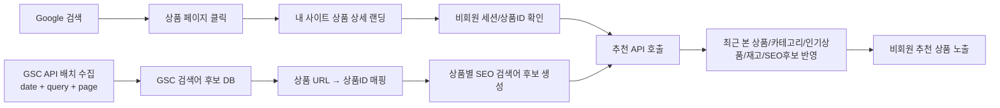
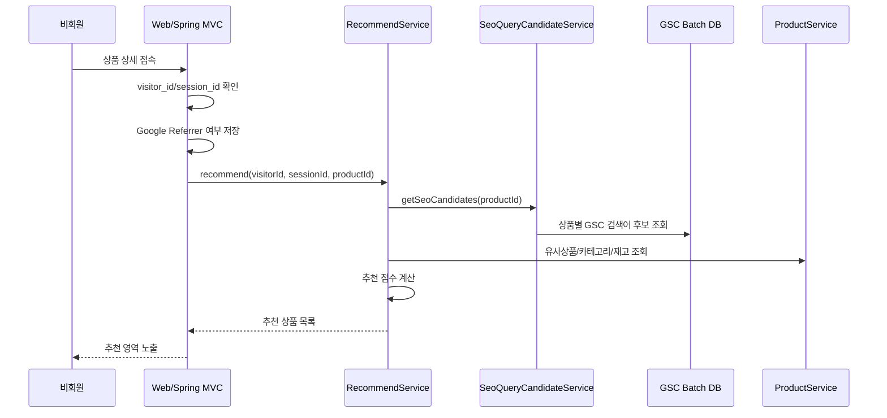

### 핵심 결론

이 기능은 **“비회원이 실제로 입력한 Google 검색어”를 알아내는 기능이 아니라**, **GSC에서 수집한 상품 페이지별 과거 검색어 후보를 이용해 추천 가중치를 보정하는 기능**으로 설계해야 한다. GSC Search Analytics API는 `query`, `page`, `date` 같은 dimension 기준으로 검색 성과를 그룹화해 `clicks`, `impressions`, `ctr`, `position`을 반환하는 집계 API이며, 방문자 ID나 세션 ID를 제공하지 않는다. ([Google for Developers](https://developers.google.com/webmaster-tools/v1/searchanalytics/query?utm_source=chatgpt.com "Search Analytics: query | Search Console API"))

### 전체 처리 구조



### 1단계. 비회원 랜딩 상품 페이지 수집

비회원이 Google 검색 결과에서 상품 상세 페이지로 들어오면, 서버 또는 GTM에서 다음 정보를 저장한다.

|수집 항목|예시|목적|
|---|---|---|
|방문자 식별자|`visitor_id`|비회원 구분|
|세션 식별자|`session_id`|방문 단위 구분|
|랜딩 URL|`https://site.com/product/1001`|유입 페이지 확인|
|상품 ID|`1001`|추천 기준 상품|
|Referrer|`https://www.google.com/`|Google 유입 여부 확인|
|유입 시각|`2026-06-30 15:00:00`|분석 기준|

#### 저장 테이블 예시

```sql
CREATE TABLE guest_landing_event (
    id BIGINT AUTO_INCREMENT PRIMARY KEY,
    visitor_id VARCHAR(100) NOT NULL,
    session_id VARCHAR(100) NOT NULL,
    product_id BIGINT,
    landing_url TEXT NOT NULL,
    landing_path VARCHAR(1000),
    referrer_url TEXT,
    is_google_referrer CHAR(1) DEFAULT 'N',
    event_time DATETIME NOT NULL,
    created_at DATETIME DEFAULT CURRENT_TIMESTAMP,
    INDEX idx_session_id (session_id),
    INDEX idx_product_id (product_id),
    INDEX idx_event_time (event_time)
);
```

#### 실무적 문제점

|문제|설명|
|---|---|
|검색어는 이 단계에서 알 수 없음|Google Referrer에 검색어가 거의 포함되지 않음|
|GTM 수집 누락 가능|JS 차단, 로딩 실패, 브라우저 보안 설정으로 누락 가능|
|비회원 쿠키 고지 필요|visitor_id 쿠키를 쓰면 개인정보/쿠키 고지 검토 필요|
|Referrer 누락 가능|브라우저 정책, 앱 브라우저, 보안 설정에 따라 Referrer가 비어 있을 수 있음|

### 2단계. GSC API로 `date + query + page` 데이터 수집

별도 배치에서 GSC Search Analytics API를 호출해 Google 검색 성과 데이터를 가져온다.

#### API 요청 예시

```json
{
  "startDate": "2026-06-27",
  "endDate": "2026-06-27",
  "dimensions": ["date", "query", "page"],
  "type": "web",
  "rowLimit": 25000,
  "startRow": 0
}
```

Search Console API는 `rowLimit` 최대 25,000건까지 지정할 수 있고, 결과를 더 가져오려면 `startRow`를 증가시켜 페이징해야 한다. ([Google for Developers](https://developers.google.com/webmaster-tools/v1/searchanalytics/query?utm_source=chatgpt.com "Search Analytics: query | Search Console API"))

#### 저장 테이블 예시

```sql
CREATE TABLE gsc_query_page_daily (
    id BIGINT AUTO_INCREMENT PRIMARY KEY,
    stat_date DATE NOT NULL,
    query_text VARCHAR(1000) NOT NULL,
    page_url TEXT NOT NULL,
    normalized_page_path VARCHAR(1000),
    clicks INT DEFAULT 0,
    impressions INT DEFAULT 0,
    ctr DECIMAL(10,6),
    position DECIMAL(10,2),
    collected_at DATETIME DEFAULT CURRENT_TIMESTAMP,
    INDEX idx_stat_page (stat_date, normalized_page_path(255)),
    INDEX idx_query (query_text(255))
);
```

#### 실무적 문제점

|문제|설명|
|---|---|
|실시간 데이터 아님|Search Console 데이터는 보통 2~3일 후 사용 가능하므로 당일 추천 근거로 부적합하다. ([Google for Developers](https://developers.google.com/webmaster-tools/v1/how-tos/all-your-data?utm_source=chatgpt.com "Getting your performance data \| Search Console API"))|
|일부 query 누락|개인정보 보호와 내부 처리 제한으로 일부 검색어는 표시되지 않을 수 있다. ([Google for Developers](https://developers.google.com/search/blog/2022/10/performance-data-deep-dive?utm_source=chatgpt.com "A deep dive into Search Console performance data filtering ..."))|
|데이터 row가 많음|상품 수가 많으면 `query + page + date` 조합이 폭증|
|상위 row 편향|클릭이 적은 상품 페이지의 롱테일 검색어가 누락될 수 있음|
|API 실패/쿼터 관리 필요|배치 실패 시 재수집, 날짜별 상태 관리 필요|

### 3단계. GSC `page_url`을 상품 ID로 매핑

GSC에서 받은 `page_url`을 현재 사이트의 상품 ID와 연결한다.

#### URL 정규화 예시

```text
https://www.site.com/product/1001?utm_source=google
→ /product/1001
→ product_id = 1001
```

#### URL 정규화 로직

|처리 항목|예시|
|---|---|
|도메인 제거|`https://site.com/product/1001` → `/product/1001`|
|QueryString 제거|`/product/1001?utm=x` → `/product/1001`|
|Fragment 제거|`/product/1001#review` → `/product/1001`|
|Trailing slash 통일|`/product/1001/` → `/product/1001`|
|구 URL 매핑|`/goods/old/1001` → `/product/1001`|

#### 매핑 테이블 예시

```sql
CREATE TABLE product_url_mapping (
    id BIGINT AUTO_INCREMENT PRIMARY KEY,
    product_id BIGINT NOT NULL,
    url_path VARCHAR(1000) NOT NULL,
    canonical_path VARCHAR(1000),
    is_active CHAR(1) DEFAULT 'Y',
    created_at DATETIME DEFAULT CURRENT_TIMESTAMP,
    INDEX idx_url_path (url_path(255)),
    INDEX idx_product_id (product_id)
);
```

Search Console 성과 데이터는 중복 URL보다 canonical URL에 할당되는 경우가 많으므로, 실제 랜딩 URL과 GSC `page`가 다를 수 있다. ([Google 도움말](https://support.google.com/webmasters/answer/7576553?hl=en-EN&utm_source=chatgpt.com "Performance report (Search results)"))

#### 실무적 문제점

|문제|설명|
|---|---|
|URL 문자열 단순 JOIN 위험|`www`, QueryString, slash 차이로 매칭 실패 가능|
|canonical URL 문제|GSC는 canonical 기준, 사이트는 실제 접근 URL 기준일 수 있음|
|리다이렉트 문제|Google은 구 URL을 클릭했지만 사용자는 신 URL로 도착할 수 있음|
|품절/삭제 상품 문제|과거 GSC page가 현재 상품 마스터에 없을 수 있음|
|다국어 URL 문제|`/en/product/1001`, `/ko/product/1001` 처리 기준 필요|

### 4단계. 상품별 검색어 후보 Mart 생성

GSC 데이터를 상품 ID 기준으로 모아 **상품별 SEO 검색어 후보**를 만든다.

#### Mart 테이블 예시

```sql
CREATE TABLE product_seo_query_candidate (
    product_id BIGINT NOT NULL,
    stat_date DATE NOT NULL,
    query_candidate VARCHAR(1000) NOT NULL,
    gsc_clicks INT DEFAULT 0,
    gsc_impressions INT DEFAULT 0,
    gsc_ctr DECIMAL(10,6),
    gsc_position DECIMAL(10,2),
    gsc_click_ratio DECIMAL(10,4),
    confidence_level VARCHAR(20),
    created_at DATETIME DEFAULT CURRENT_TIMESTAMP,
    PRIMARY KEY (product_id, stat_date, query_candidate(255))
);
```

#### 검색어 후보 생성 SQL 예시

```sql
INSERT INTO product_seo_query_candidate (
    product_id,
    stat_date,
    query_candidate,
    gsc_clicks,
    gsc_impressions,
    gsc_ctr,
    gsc_position,
    gsc_click_ratio,
    confidence_level
)
SELECT
    m.product_id,
    g.stat_date,
    g.query_text,
    SUM(g.clicks) AS gsc_clicks,
    SUM(g.impressions) AS gsc_impressions,
    AVG(g.ctr) AS gsc_ctr,
    AVG(g.position) AS gsc_position,
    ROUND(
        SUM(g.clicks) / NULLIF(SUM(SUM(g.clicks)) OVER (
            PARTITION BY m.product_id, g.stat_date
        ), 0) * 100,
        2
    ) AS gsc_click_ratio,
    CASE
        WHEN SUM(g.clicks) >= 100 THEN 'HIGH'
        WHEN SUM(g.clicks) >= 10 THEN 'MEDIUM'
        ELSE 'LOW'
    END AS confidence_level
FROM gsc_query_page_daily g
JOIN product_url_mapping m
  ON m.url_path = g.normalized_page_path
GROUP BY
    m.product_id,
    g.stat_date,
    g.query_text;
```

#### 실무적 문제점

|문제|설명|
|---|---|
|검색어 후보일 뿐 실제 검색어 아님|`query_candidate`를 `user_keyword`로 쓰면 안 됨|
|저클릭 상품 신뢰도 낮음|클릭 1~2건으로 추천을 바꾸면 오추천 가능|
|검색어 비율 오해 위험|`gsc_click_ratio`는 GSC 클릭 기준 비율이지 실제 방문자 비율이 아님|
|롱테일 누락|상품명+모델명+규격 같은 중요한 검색어가 빠질 수 있음|

### 5단계. 비회원 추천 API에서 보조 가중치로 사용

비회원이 상품 페이지에 들어오면 추천 API는 다음 정보를 조합한다.

|추천 입력값|우선도|설명|
|---|--:|---|
|현재 상품 ID|상|현재 보고 있는 상품|
|최근 본 상품|상|비회원 행동 기반|
|카테고리|상|상품 분류 기반|
|인기 상품|중|기본 fallback|
|재고/판매 가능 여부|상|노출 가능 상품 필터|
|GSC 검색어 후보|중~하|상품 SEO 특성 보조값|
|가격대/브랜드/국가|중|상품 속성 기반|

#### 추천 API 요청 예시

```json
{
  "visitorId": "guest-abc",
  "sessionId": "sid-123",
  "currentProductId": 1001,
  "source": "GOOGLE_ORGANIC",
  "seoQueryCandidates": [
    {
      "query": "korean mask pack wholesale",
      "ratio": 60.0,
      "confidence": "HIGH"
    },
    {
      "query": "k beauty mask",
      "ratio": 30.0,
      "confidence": "MEDIUM"
    }
  ]
}
```

#### 추천 점수 계산 예시

```text
추천점수 =
  현재 상품 유사도 40%
+ 최근 본 상품/카테고리 30%
+ 인기/판매량 15%
+ GSC 검색어 후보 기반 보조점수 10%
+ 재고/프로모션 5%
```

#### 실무적 문제점

|문제|설명|
|---|---|
|GSC 후보를 과도하게 반영하면 오추천|현재 비회원의 실제 검색어가 아니므로 보조값으로만 사용해야 함|
|검색어 기반 추천 상품 매칭 어려움|검색어를 어떤 상품 속성과 연결할지 별도 사전/검색엔진 필요|
|추천 결과 설명 어려움|“이 검색어로 들어와서 추천”이라고 표시하면 부정확|
|데이터 없을 때 fallback 필요|GSC 후보가 없는 상품도 많음|

### 6단계. 검색어 후보를 상품 속성과 연결

GSC query를 직접 추천 조건으로 쓰지 말고, 상품 속성과 연결해 점수화한다.

#### 예시

|GSC 검색어 후보|추출 속성|추천 반영|
|---|---|---|
|`korean mask pack wholesale`|마스크팩, 도매, 한국|마스크팩/도매 가능 상품 가중치|
|`red ginseng extract korea`|홍삼, 농축액, 한국|홍삼 카테고리 상품 가중치|
|`stainless kitchenware supplier`|주방용품, 공급업체|주방용품 B2B 상품 가중치|

#### 간단한 키워드 매핑 테이블

```sql
CREATE TABLE seo_query_attribute_mapping (
    id BIGINT AUTO_INCREMENT PRIMARY KEY,
    query_pattern VARCHAR(500) NOT NULL,
    category_id BIGINT,
    attribute_key VARCHAR(100),
    attribute_value VARCHAR(500),
    weight DECIMAL(10,4) DEFAULT 1.0,
    use_yn CHAR(1) DEFAULT 'Y'
);
```

#### 실무적 문제점

|문제|설명|
|---|---|
|다국어 처리 필요|영어, 한국어, 스페인어 등 query 해석 필요|
|동의어 처리 필요|`mask pack`, `face mask`, `sheet mask` 매핑 필요|
|브랜드/상품명 오인식|일반명과 브랜드명을 구분해야 함|
|운영 관리 필요|MD/SEO 담당자가 매핑을 수정할 수 있어야 함|

### 7단계. 신뢰도 기준과 fallback 적용

GSC 후보가 부족하거나 신뢰도가 낮으면 추천에 쓰지 않는다.

|조건|처리|
|---|---|
|상품별 GSC clicks ≥ 100|추천 보조 가중치 사용|
|GSC clicks 10~99|약한 보조 가중치 사용|
|GSC clicks < 10|추천 반영 제외 또는 낮은 가중치|
|검색어 후보 없음|카테고리 인기상품/최근 본 상품 fallback|
|URL 매칭 실패|GSC 후보 사용 금지|
|상품 품절/판매중지|추천 결과에서 제외|

#### 실무적 문제점

|문제|설명|
|---|---|
|기준값 설정이 필요|clicks 10, 50, 100 등은 사이트 규모에 맞게 조정|
|데이터 편향|인기 상품은 GSC 데이터가 많고 신규 상품은 부족|
|신규 상품 추천 약화|GSC 데이터가 쌓이기 전까지 SEO 후보 사용 불가|

### 8단계. 관리자 화면에는 “추정”으로 표시

관리자/운영 화면에서는 반드시 데이터 성격을 명확히 표시한다.

|비권장 표현|권장 표현|
|---|---|
|유입 검색어|GSC 기반 검색어 후보|
|사용자 검색어|상품 페이지 검색어 후보|
|검색어별 방문자 수|GSC 클릭 수|
|검색어별 전환율|검색어 후보 기반 참고 지표|
|개인화 키워드|SEO 보조 키워드|

#### 관리자 화면 예시

|상품ID|상품명|검색어 후보|GSC 클릭|노출|CTR|평균순위|신뢰도|추천 반영|
|--:|---|---|--:|--:|--:|--:|---|---|
|1001|마스크팩 A|`korean mask pack wholesale`|120|3,000|4.0%|5.2|HIGH|사용|
|1001|마스크팩 A|`k beauty mask`|35|1,400|2.5%|8.7|MEDIUM|약하게 사용|
|1001|마스크팩 A|`cheap facial mask`|3|200|1.5%|14.1|LOW|제외|

### 9단계. 개발 구성 예시

|구성 요소|역할|
|---|---|
|GTM/서버 수집 API|비회원 랜딩 상품, Referrer, 세션 저장|
|GSC Batch|D-3 기준 `date + query + page` 수집|
|URL Normalizer|GSC page URL을 상품 URL로 정규화|
|Product URL Mapping|URL과 상품 ID 연결|
|SEO Candidate Mart|상품별 검색어 후보 생성|
|Recommendation API|추천 상품 산출|
|Admin Report|검색어 후보, 신뢰도, 추천 반영 여부 표시|

### 10단계. Spring 5.3 기준 서비스 흐름 예시



### 11단계. 추천 서비스 의사코드

```java
public List<ProductRecommendDto> recommendForGuest(GuestRecommendRequest request) {
    Long productId = request.getCurrentProductId();
    List<SeoQueryCandidate> seoCandidates =
            seoQueryCandidateService.findUsableCandidates(productId);
    List<Product> baseCandidates =
            productService.findRecommendCandidates(productId);
    List<ProductRecommendScore> scored = new ArrayList<>();
    for (Product product : baseCandidates) {
        double score = 0;
        score += productSimilarityScore(productId, product) * 0.40;
        score += categoryScore(productId, product) * 0.25;
        score += popularityScore(product) * 0.15;
        score += stockScore(product) * 0.10;
        score += seoCandidateScore(seoCandidates, product) * 0.10;
        scored.add(new ProductRecommendScore(product, score));
    }
    return scored.stream()
            .sorted(Comparator.comparing(ProductRecommendScore::getScore).reversed())
            .limit(10)
            .map(ProductRecommendDto::from)
            .collect(Collectors.toList());
}
```

### 기능 구현 단계별 문제점 정리

|단계|구현 내용|실무적 문제점|
|--:|---|---|
|1|비회원 랜딩 이벤트 저장|검색어 직접 취득 불가, 쿠키 고지 필요|
|2|GSC API 수집|2~3일 지연, row 제한, query 누락|
|3|URL 정규화|canonical, redirect, QueryString 차이|
|4|상품 ID 매핑|품절/삭제/URL 변경 상품 처리 필요|
|5|검색어 후보 Mart 생성|후보를 실제 검색어로 오해할 위험|
|6|추천 API 반영|개인화 키워드가 아니라 보조 가중치로만 사용해야 함|
|7|신뢰도 기준 적용|저클릭 상품은 추천 왜곡 가능|
|8|fallback 추천|GSC 데이터 없는 상품에 대한 기본 추천 필요|
|9|관리자 화면 표시|“유입 검색어”로 표시하면 데이터 오해 발생|
|10|정합성 검증|GSC 클릭과 실제 세션 수가 다르므로 별도 검증 필요|

### 최종 권장 설계

|항목|권장 기준|
|---|---|
|데이터 명칭|`GSC 기반 상품 페이지 검색어 후보`|
|추천 사용 방식|보조 가중치로만 사용|
|비회원 실제 검색어로 사용|금지|
|수집 기준|D-3 기준 정식 수집 + 최근 7일 재수집|
|URL 처리|정규화 + canonical + redirect + 상품 URL 이력 관리|
|신뢰도|clicks/impressions/URL매칭 성공 여부로 등급화|
|fallback|최근 본 상품, 동일 카테고리 인기상품, 재고상품|
|관리자 표시|`추정`, `GSC 클릭 기준`, `개인 검색어 아님` 명시|

### 최종 정리

이 기능은 다음처럼 이해하면 된다.

```text
현재 비회원의 검색어를 알아내서 추천하는 기능 ❌
상품 페이지가 과거 Google에서 어떤 검색어로 클릭됐는지 보고,
그 상품의 SEO 성격을 추천에 약하게 반영하는 기능 ✅
```

따라서 구현은 가능하지만, 추천 로직에서는 **GSC query를 개인화 핵심값이 아니라 상품 속성 보조 데이터**로만 사용해야 한다. 이 전제를 지키면 SEO 기반 추천 보정에는 활용 가능하고, 이 전제를 지키지 않으면 데이터 정합성과 추천 품질 모두 문제가 된다.


### 핵심 결론

`GSC API(query + page + date)`로 상품 페이지별 유입 키워드 후보를 만들고, 그 값을 **비회원 개인별 상품 추천에 직접 사용하는 것은 데이터 정합성 리스크가 큼**. 이 데이터는 **“해당 상품 페이지가 과거에 Google에서 어떤 검색어로 클릭되었는지”** 를 보여주는 집계 데이터이지, **“현재 접속한 비회원이 입력한 검색어”** 가 아니다.

### 구조상 가장 중요한 오해

```text
비회원 A가 /product/1001 페이지에 유입
↓
GSC에서 /product/1001의 과거 검색어 후보 조회
↓
"korean cosmetics wholesale" 비중이 높음
↓
비회원 A가 이 검색어로 왔다고 간주하고 추천
```

위 방식은 위험하다. GSC API는 요청한 dimension 기준의 **집계 row**를 반환하며, `query`, `page`, `date`로 그룹화할 수 있지만 방문자 ID나 세션 ID는 제공하지 않는다. 결과도 `clicks`, `impressions`, `ctr`, `position` 같은 검색 성과 지표다. ([Google for Developers](https://developers.google.com/webmaster-tools/v1/searchanalytics/query "Search Analytics: query  |  Search Console API  |  Google for Developers"))

### 1. 실무 문제점

|문제|쉬운 설명|추천 영향|
|---|---|---|
|개별 검색어가 아님|GSC 검색어는 “그 페이지에 과거 유입된 검색어 집계”임|현재 비회원의 의도와 다를 수 있음|
|2~3일 지연|오늘 들어온 사용자의 검색어를 오늘 알 수 없음|실시간 추천에 부적합|
|일부 검색어 누락|저빈도·민감 검색어는 표시되지 않을 수 있음|롱테일 상품 검색어 누락|
|상위 데이터 중심|Search Console은 모든 row를 보장하지 않고 주요 row 중심으로 제공|클릭 적은 상품 페이지 키워드 누락|
|URL 매칭 오류|GSC의 page와 실제 랜딩 URL이 다를 수 있음|엉뚱한 상품 키워드로 추천 가능|
|날짜 기준 차이|GSC 일자는 PT 기준, 서버는 KST 기준일 가능성|일자별 JOIN 오차|
|클릭≠세션|GSC 클릭 수와 실제 사이트 유입 세션 수는 다름|비율 계산 오류|
|상품 URL 변경|품절, 삭제, 리다이렉트, canonical URL 때문에 상품 매핑 실패|추천 대상 상품 오류|
|추천 근거 과대해석|“검색어 후보”를 “사용자 검색어”로 오인|개인화 품질 저하|
|법적/고지 리스크|비회원 식별 쿠키와 추천 목적 수집 시 고지/동의 검토 필요|운영 리스크|

### 2. 왜 비회원 추천에 직접 쓰면 위험한가

|항목|GSC 데이터의 의미|추천에서 필요한 데이터|차이|
|---|---|---|---|
|검색어|상품 페이지별 과거 검색어 후보|현재 비회원이 입력한 실제 검색어|불일치|
|시간|2~3일 이상 지난 데이터 가능|현재 세션 실시간 의도|지연|
|단위|query-page-date 집계|visitor/session 단위|단위 불일치|
|정확도|일부 query 누락 가능|개인 추천은 높은 정확도 필요|부족|
|매칭 기준|Google이 인식한 URL/canonical URL|사이트 실제 상품 ID|매핑 필요|
|Search Console은 개인정보 보호와 내부 제한 때문에 모든 데이터를 보여주지 않으며, 일부 저빈도·민감 query를 추적하지 않을 수 있고, 상위 row 중심으로 저장한다고 설명한다. ([Google 도움말](https://support.google.com/webmasters/answer/96568?hl=en "About Search Console data - Search Console Help"))||||

### 3. 상품 페이지 추천 시 발생 가능한 예시

#### 예시 상황

|항목|값|
|---|---|
|현재 비회원 랜딩 상품|`/product/1001` 마스크팩|
|GSC 검색어 후보 1|`korean mask pack wholesale` 60%|
|GSC 검색어 후보 2|`k beauty mask` 30%|
|GSC 검색어 후보 3|`cheap facial mask korea` 10%|
|실제 현재 비회원 의도|브랜드명으로 특정 상품만 확인|

#### 잘못된 추천

|잘못된 처리|문제|
|---|---|
|비회원이 `korean mask pack wholesale`로 유입됐다고 간주|실제 검색어가 아님|
|도매 마스크팩 추천을 강하게 노출|현재 사용자는 특정 브랜드 상품만 찾는 중일 수 있음|
|검색어별 구매전환율 계산|검색어와 주문 세션이 직접 연결되지 않음|
|해당 검색어를 쿠키에 저장|정확하지 않은 추정값을 사용자 속성으로 저장|

### 4. 개발 업체에게 반드시 확인해야 할 내용

#### 4.1 데이터 성격 확인

|확인 질문|정합성 판단 기준|
|---|---|
|GSC query를 “사용자 검색어”로 저장하고 있는가, “검색어 후보”로 저장하고 있는가?|컬럼명/화면명에 `candidate`, `estimated`, `gsc` 명시 필요|
|비회원 세션 ID와 GSC query를 1:1로 연결하고 있는가?|1:1 연결이면 구조적으로 잘못된 설계 가능성 높음|
|추천 API에 전달하는 keyword가 실제 검색어인가, GSC 후보인가?|GSC 후보라면 추천 가중치 보조값으로만 사용해야 함|
|검색어 후보의 신뢰도 등급을 계산하는가?|클릭 수, 누락률, 매칭 성공 여부 기준 필요|

#### 4.2 GSC API 수집 방식 확인

|확인 질문|확인해야 할 정상 답변|
|---|---|
|API 요청 dimensions는 무엇인가?|`["date","query","page"]` 또는 목적에 맞는 조합|
|`rowLimit`과 `startRow` paging을 처리하는가?|25,000 row 단위 paging 필요|
|하루 단위로 수집하는가?|일 단위 수집 권장|
|D-3 기준으로 수집하는가?|2~3일 지연을 감안해야 함|
|최근 7일 재수집을 하는가?|preliminary/지연 데이터 보정 목적|
|API 실패 시 재처리 가능한가?|날짜별 batch 상태 관리 필요|
|Search Console API 가이드는 하루 단위 쿼리를 권장하고, 데이터는 보통 2~3일 후 사용 가능하며, `startRow`를 증가시키며 paging하라고 설명한다. 또한 Search Analytics는 검색 타입별 하루 최대 50,000 row를 노출한다고 설명한다. ([Google for Developers](https://developers.google.com/webmaster-tools/v1/how-tos/all-your-data "Getting your performance data  \|  Search Console API  \|  Google for Developers"))||

#### 4.3 URL/상품 매핑 확인

|확인 질문|정합성 리스크|
|---|---|
|GSC `page` URL을 상품 ID로 어떻게 매핑하는가?|URL 문자열만으로 매핑하면 오류 가능|
|canonical URL 기준인지 실제 landing URL 기준인지 구분하는가?|GSC는 canonical URL로 집계될 수 있음|
|리다이렉트 URL은 어떻게 처리하는가?|구 URL 클릭 후 신 URL 랜딩 시 매칭 실패|
|QueryString, trailing slash, www 차이를 정규화하는가?|동일 상품이 다른 URL로 분리될 수 있음|
|품절/삭제/통합 상품 URL 이력을 관리하는가?|과거 GSC 데이터가 현재 상품과 안 맞을 수 있음|
|Search Console의 page dimension은 검색 결과가 링크한 최종 URL 기준이며, 성과 데이터는 중복 URL이 아니라 canonical URL에 배정되는 경우가 많다. ([Google 도움말](https://support.google.com/webmasters/answer/17011259?hl=en "Performance report (Search results): Dimensions and data groupings - Search Console Help"))||

#### 4.4 날짜/시간 기준 확인

|확인 질문|확인해야 할 내용|
|---|---|
|GSC date 기준 timezone은 무엇으로 처리하는가?|PT 기준|
|서버 로그의 event_time 기준은 무엇인가?|KST인지 UTC인지 확인|
|JOIN 시 단순 `DATE(event_time) = gsc.date`로 처리하는가?|KST/PT 차이로 오류 가능|
|전후 1일 보정 또는 GSC 기준 일자 컬럼이 있는가?|상품별 유입 후보 추정 정확도 개선|
|Search Console Performance report는 일별 데이터를 캘리포니아 현지 시간 기준으로 라벨링하므로 다른 시스템의 timezone과 일별 수치가 정확히 맞지 않을 수 있다. ([Google 도움말](https://support.google.com/webmasters/answer/96568?hl=en "About Search Console data - Search Console Help"))||

#### 4.5 GSC 클릭과 실제 유입 세션 비교 확인

|확인 질문|정상 설계|
|---|---|
|GSC clicks와 서버/GTM organic session을 같은 값으로 보고 있는가?|같은 값으로 보면 안 됨|
|상품 페이지별 GSC 클릭 수와 실제 Google 유입 세션 수 차이를 관리하는가?|차이율 모니터링 필요|
|GTM 미실행, JS 차단, 로딩 실패를 고려하는가?|누락 사유 분리 필요|
|GSC 기반 추천 적용 시 최소 클릭 수 기준이 있는가?|저클릭 데이터는 추천에 사용 제한|
|Search Console은 중복 제거·로봇 방문 제거 등 추가 처리를 하므로 다른 통계와 다를 수 있고, JavaScript 기반 도구는 JavaScript 활성 사용자만 추적할 수 있다. ([Google 도움말](https://support.google.com/webmasters/answer/96568?hl=en "About Search Console data - Search Console Help"))||

### 5. 개발 업체 확인용 체크리스트

|No|확인 항목|질문|정상 기준|위험 신호|
|--:|---|---|---|---|
|1|데이터 정의|GSC query를 무엇으로 정의했는가?|`검색어 후보`|`사용자 검색어`라고 설명|
|2|추천 입력값|추천 API에 query를 직접 전달하는가?|보조 가중치만 사용|개인 키워드처럼 사용|
|3|세션 매칭|비회원 ID와 query를 연결하는가?|직접 연결 안 함|1:1 매핑 주장|
|4|수집 지연|D-3 기준 수집인가?|D-3/D-4 정식 수집|당일 데이터 사용|
|5|재수집|최근 기간 재수집하는가?|최근 7일 보정|1회 수집 후 확정|
|6|누락 처리|anonymized/저빈도 query 누락을 반영하는가?|누락률/주의 표시|전체 키워드라고 표시|
|7|URL 정규화|page URL 정규화 로직이 있는가?|도메인/쿼리/슬래시 처리|문자열 단순 JOIN|
|8|canonical 처리|canonical URL 매핑을 하는가?|상품 ID 매핑 테이블 존재|현재 URL만 기준|
|9|상품 이력|삭제/품절/URL변경 이력을 보관하는가?|상품 URL 이력 테이블|현재 상품 테이블만 JOIN|
|10|timezone|GSC date와 서버 date를 어떻게 맞추는가?|PT 기준 컬럼/보정|KST `DATE()` 단순 JOIN|
|11|row paging|`startRow` paging 처리하는가?|25,000 단위 반복|첫 페이지만 수집|
|12|row 한도|50K row 제한 초과 시 정책이 있는가?|우선순위/분할/경고|초과 여부 미확인|
|13|신뢰도|추천 사용 최소 기준이 있는가?|clicks ≥ N, confidence|모든 query 사용|
|14|화면 표시|관리자 화면에 추정 표시가 있는가?|`GSC 기반 추정` 표시|`유입 검색어` 단정|
|15|검증 리포트|GSC 클릭과 서버 세션 비교 리포트가 있는가?|일자/상품별 차이율|검증 화면 없음|

### 6. 추천 시스템에 적용할 때의 안전한 사용 기준

|사용 방식|권장 여부|설명|
|---|--:|---|
|현재 비회원의 실제 검색어로 사용|비권장|GSC는 세션 검색어가 아님|
|상품 페이지의 대표 검색어 후보로 사용|가능|상품 SEO 특성값으로 사용|
|상품 추천의 보조 가중치로 사용|부분 가능|클릭 수·신뢰도 기준 필요|
|검색어별 매출 기여도 계산|비권장|주문 세션과 직접 연결 불가|
|상품명/메타태그/상세설명 개선|권장|GSC 본래 용도에 가까움|
|카테고리/연관상품 사전 구축|부분 가능|집계 기준 보조 데이터로 사용|

### 7. 추천 로직에서 안전한 설계 예시

#### 비권장

```text
비회원 세션 → 상품 페이지 → GSC 1위 query 조회 → 해당 query로 개인화 추천
```

#### 권장

```text
비회원 세션
→ 현재 랜딩 상품 ID 확인
→ 해당 상품의 GSC 검색어 후보를 상품 속성으로 조회
→ 최근 본 상품/카테고리/인기상품/재고/가격대와 함께 보조 가중치로만 반영
→ 신뢰도 낮으면 GSC 후보는 제외
```

### 8. 추천 API 입력값 명명 기준

|비권장 필드명|권장 필드명|
|---|---|
|`userKeyword`|`gscQueryCandidate`|
|`searchKeyword`|`estimatedLandingQuery`|
|`sessionQuery`|`productSeoQueryCandidate`|
|`keywordRatio`|`gscClickBasedRatio`|
|`keywordScore`|`seoCandidateScore`|

### 9. 개발 업체에 요청할 산출물

|산출물|목적|
|---|---|
|GSC API 요청/응답 샘플|`query + page + date` 수집 여부 확인|
|수집 배치 설계서|D-3 수집, 재수집, 실패 재처리 확인|
|DB ERD|GSC raw, normalized, 상품 매핑, 추천 입력 테이블 분리 확인|
|URL 정규화 규칙표|상품 URL 매칭 오류 방지|
|상품 URL 이력 매핑표|삭제/품절/리다이렉트 상품 처리 확인|
|추천 API Spec|GSC 후보가 개인 검색어처럼 전달되는지 확인|
|데이터 정합성 검증 SQL|GSC 클릭 vs 서버 세션 차이 확인|
|관리자 화면 문구|`검색어 후보/추정` 표시 여부 확인|
|테스트 케이스|URL 변경, 저클릭 상품, 날짜 차이, query 누락 검증|

### 10. 개발 업체에 그대로 물어볼 질문

```text
1. GSC API에서 수집한 query를 비회원의 실제 검색어로 사용하고 있습니까, 아니면 상품 페이지별 검색어 후보로 사용하고 있습니까?
2. 추천 API에 전달되는 keyword 필드의 정의는 무엇입니까?
3. 비회원 visitor_id/session_id와 GSC query를 직접 매핑하는 로직이 있습니까?
4. GSC query + page + date 데이터는 D-3 기준으로 수집합니까?
5. 최근 7일 데이터 재수집으로 GSC 지연/변경 데이터를 보정합니까?
6. rowLimit 25,000 초과 시 startRow paging을 끝까지 수행합니까?
7. Search Analytics의 하루 50,000 row 제한에 걸릴 경우 누락 정책은 무엇입니까?
8. GSC page URL과 상품 ID 매핑은 URL 문자열 기준입니까, canonical/redirect/URL 이력까지 반영합니까?
9. GSC date의 PT 기준과 서버 로그의 KST 기준 차이를 어떻게 보정합니까?
10. 저빈도 검색어, anonymized query, 누락 query를 어떻게 표시합니까?
11. GSC clicks와 실제 Google Organic 세션 수 차이를 검증하는 리포트가 있습니까?
12. 추천 결과에 GSC 검색어 후보를 사용할 때 최소 clicks/impressions 기준과 confidence 기준이 있습니까?
13. 관리자 화면에는 “유입 검색어”가 아니라 “GSC 기반 검색어 후보”로 표시됩니까?
14. 이 데이터로 검색어별 매출/전환율을 계산하고 있다면, 어떤 근거로 주문 세션과 연결합니까?
15. GSC 후보 데이터가 없거나 신뢰도 낮은 상품은 어떤 fallback 추천을 사용합니까?
```

### 최종 판단

| 판단 항목                                                                                                                                                      | 권장 기준                                                          |
| ---------------------------------------------------------------------------------------------------------------------------------------------------------- | -------------------------------------------------------------- |
| 비회원 개인화 추천 직접 사용                                                                                                                                           | 비권장                                                            |
| 상품 페이지 SEO 키워드 후보로 사용                                                                                                                                      | 권장                                                             |
| 추천 보조 가중치로 사용                                                                                                                                              | 조건부 가능                                                         |
| 필수 조건                                                                                                                                                      | `추정 데이터` 명시, URL/상품 매핑 검증, D-3 수집, 최근 재수집, 신뢰도 기준, fallback 로직 |
| 개발 업체 검증 핵심                                                                                                                                                | “GSC query를 현재 비회원의 실제 검색어로 오인하고 있지 않은가”                       |
| 따라서 개발 업체에는 **GSC query가 사용자 검색어가 아니라 상품 페이지별 검색어 후보라는 전제를 시스템 전반에서 지키고 있는지**를 먼저 확인해야 한다. 이 전제가 지켜지지 않으면 데이터 정합성뿐 아니라 추천 품질, 리포트 신뢰도, 운영 판단이 모두 흔들릴 수 있다. |                                                                |


### Google 정책 의존으로 문제가 커질 수 있는 부분 순차 지적

현재 구조를 실무 사이트에 적용할 때 가장 큰 문제는 **상품 추천이라는 서비스 핵심 로직 일부가 GTM, Google 정책, Google 태그 실행 환경에 의존하게 되는 것**입니다. GTM은 본래 태그·분석·마케팅 스크립트 관리 도구이고, `dataLayer`도 클라이언트에서 태그·트리거·변수에 값을 전달하기 위한 임시 계층입니다. Google 공식 문서도 `dataLayer`를 “client에서 태그, 트리거, 변수에 사용할 값을 임시로 보관하는 구조”로 설명합니다. ([Google 도움말](https://support.google.com/tagmanager/answer/6103657?hl=en&utm_source=chatgpt.com "Components of Google Tag Manager"))

### 1. 추천 기능이 GTM 실행 성공 여부에 의존

|구분|문제점|실무 위험|
|---|---|---|
|현 구조|GTM이 `dataLayer` 값을 읽고 Meta 정보를 보강한 뒤 추천 API 호출 흐름에 관여|GTM이 늦게 로딩되거나 차단되면 추천 영역이 비거나 fallback 발생|
|정책/운영 의존|GTM Container 배포 상태, Preview/Publish 상태, 계정 권한, 태그 실행 조건에 의존|마케팅 담당자가 GTM 태그를 수정해도 서비스 추천 로직에 영향|
|장애 형태|특정 브라우저, 광고차단 환경, CSP 정책, 네트워크 문제에서 GTM 미실행|검색/추천 품질이 환경별로 달라짐|
|권장 수정|GTM은 이벤트 수집/보조 컨텍스트 보강까지만 사용|추천 판단과 API 호출은 FrontEnd/BackEnd 표준 코드로 고정|

### 2. GTM Custom HTML에 서비스 로직을 넣는 문제

|구분|설명|
|---|---|
|문제|GTM Custom HTML 태그에 JavaScript를 넣어 Meta 분석, Context 보강, 완료 이벤트 발생 등을 처리하면 추천 기능 일부가 GTM 설정에 묶임|
|Google 의존|Google은 GTM에서 Custom HTML 태그를 제공하지만, JavaScript는 `<script>` 안에 넣어야 하며 GTM 관리 UI와 권한 정책의 영향을 받습니다. ([Google 도움말](https://support.google.com/tagmanager/answer/6107167?hl=en&utm_source=chatgpt.com "Custom tags - Tag Manager Help"))|
|운영 위험|GTM 버전 변경, 태그 중복 실행, Trigger 조건 오류, 담당자 실수로 추천 API 호출이 중복 또는 누락될 수 있음|
|보안 위험|GTM 권한이 있는 사용자가 운영 사이트에서 실행되는 JavaScript를 수정할 수 있음|
|권장 수정|추천 API 호출·추천 결과 렌더링은 배포 관리되는 FrontEnd 소스에 두고, GTM은 `event` 송신 정도로 제한|

### 3. GTM 권한·보안 정책 변경에 따른 운영 영향

|항목|문제|
|---|---|
|Custom HTML/JavaScript 수정 권한|Google Tag Manager는 계정 설정에 따라 Custom HTML 태그나 JavaScript 매크로 수정 시 2단계 인증을 요구할 수 있습니다. ([Google 도움말](https://support.google.com/tagmanager/answer/4525539?hl=en-gb&utm_source=chatgpt.com "2-step verification - Tag Manager Help"))|
|실무 영향|운영 장애 시 GTM 수정이 필요한데 권한, 2FA, 승인 프로세스 때문에 즉시 대응이 어려울 수 있음|
|위험도|높음|
|권장|서비스 필수 기능은 Git/Jenkins 배포 라인으로 관리하고, GTM은 마케팅 태그 영역으로 분리|

### 4. `dataLayer` 타이밍 의존

|구분|문제점|
|---|---|
|FrontEnd → GTM|FrontEnd가 `dataLayer.push({event:'landing_context_ready'})`를 먼저 실행해야 GTM Trigger가 정상 동작|
|GTM → FrontEnd|GTM이 보강 완료 후 `CustomEvent`를 발생시켜야 FrontEnd가 추천 API 호출 가능|
|실무 문제|이벤트 리스너 등록 전 GTM이 완료 이벤트를 쏘면 FrontEnd가 신호를 놓칠 수 있음|
|장애 형태|간헐적으로 추천 영역 미노출, 특정 페이지에서만 추천 실패|
|권장|FrontEnd 단독 fallback context 생성 로직 필수. GTM 완료 이벤트는 보조값으로만 사용|

### 5. Google Analytics/Google Ads와 결합 시 개인정보 정책 리스크

|구분|문제점|
|---|---|
|검색어·사용자 식별자|내부 검색어, `guest_id`, 세션 기반 사용자 정보가 GA/Google Ads 이벤트에 섞이면 정책 위반 가능성 증가|
|Google 정책|Google Analytics 정책은 Google이 개인을 식별할 수 있는 PII를 전송하지 말라고 명시합니다. 이메일, 전화번호 등 PII가 포함될 수 있는 데이터 전송을 금지하는 취지입니다. ([Google 도움말](https://support.google.com/analytics/answer/6004245?hl=en&utm_source=chatgpt.com "Safeguarding your data - Analytics Help"))|
|실무 위험|사용자가 내부 검색창에 전화번호, 이메일, 회사명, 담당자명 등을 입력하면 검색어가 PII가 될 수 있음|
|권장|추천용 검색어 DB와 Google Analytics/Ads 이벤트를 분리. Google로 보내는 검색어는 마스킹·필터링 또는 전송 제외|

### 6. `guest_id`, `user_id`를 Google 식별자처럼 쓰는 문제

|구분|문제점|
|---|---|
|현 구조|비회원 랜덤 식별자와 세션 정보를 DB에 저장하고 이후 추천/이력에 사용|
|Google 연계 위험|이 식별자를 GA/Google Ads의 `user_id` 또는 이벤트 파라미터로 보내면 Google 정책 검토 대상이 됨|
|Google 정책|Google Ads/Tag 설정 문서에서도 `user_id`는 PII 자체여서는 안 되며, Analytics 쿠키나 Analytics 제공 저장소에 지속 저장하면 안 된다고 설명합니다. ([Google 도움말](https://support.google.com/google-ads/answer/13438166?hl=en-GB&utm_source=chatgpt.com "Reuse configuration settings in Google Tag Manager"))|
|권장|자사 추천용 `guest_id`는 자사 DB 내부 전용으로 사용. Google 태그로 전송하지 않거나, 전송 시 정책 검토 후 별도 식별자 체계 사용|

### 7. EU/UK/스위스 사용자 동의 정책 의존

|구분|문제점|
|---|---|
|Google 정책|Google은 EEA, UK, Switzerland 사용자에 대해 광고·측정 제품 사용 시 쿠키/로컬스토리지 사용과 개인화 광고 목적의 개인정보 수집·공유·사용에 필요한 동의를 요구합니다. ([Business Data Responsibility](https://business.safety.google/gdpr/?utm_source=chatgpt.com "GDPR Requirements for Businesses"))|
|실무 영향|글로벌 커머스라면 단순히 한국 기준 동의 화면만으로 부족할 수 있음|
|문제 시나리오|GTM/GA/Google Ads와 추천 이벤트가 연결되어 있으면 “추천용 데이터”가 “광고/측정용 데이터”로 해석될 수 있음|
|권장|자사 추천 동의와 Google 광고/분석 동의를 분리. Consent Mode, CMP, 지역별 동의 정책을 별도 설계|

### 8. Google 서비스 간 데이터 공유 정책 변경 영향

|구분|문제점|
|---|---|
|정책 변화|Google은 EEA에서 특정 Google 서비스 간 데이터 연결·공유에 사용자 동의가 필요하다고 안내하고 있습니다. 2024년 3월부터 관련 동의 요구가 강화된 영역이 있습니다. ([Business Data Responsibility](https://business.safety.google/privacy/google-services/ads/?utm_source=chatgpt.com "Data use in Ad services for the European Economic Area (EEA)"))|
|실무 위험|GA, Google Ads, Merchant Center, Search, Shopping 데이터를 묶어 추천·광고 성과 분석에 쓰는 구조는 향후 정책 변경 영향을 크게 받음|
|권장|추천 엔진의 핵심 데이터는 자사 수집·자사 저장·자사 동의 체계로 독립 운영|

### 9. Google이 파트너 사이트에서 수집하는 정보와의 경계 불명확

|구분|문제점|
|---|---|
|Google 설명|Google은 자사 서비스를 사용하는 사이트·앱에서 쿠키, 로컬 스토리지, 픽셀 등 다양한 기술로 정보를 수집·저장할 수 있다고 설명합니다. ([Google 정책](https://policies.google.com/privacy?hl=en-US&utm_source=chatgpt.com "Google Privacy Policy"))|
|실무 리스크|GTM/GA/Ads가 삽입된 페이지에서 추천용 사용자 행동 데이터가 Google 태그와 섞이면, 내부 추천 데이터인지 Google 측정/광고 데이터인지 경계가 흐려짐|
|권장|추천 API 요청, 검색어 저장, 추천 이력 저장은 Google 태그와 별도 경로로 처리. Google 전송 이벤트는 최소화|

### 10. Google Search Console/Google 검색어 의존 구조와 혼동 위험

|구분|문제점|
|---|---|
|내부 검색어|사이트 내부 검색창에서 사용자가 직접 입력한 검색어|
|Google 유입 검색어|Google 검색에서 어떤 검색어로 유입됐는지에 대한 정보|
|실무 위험|두 데이터를 섞으면 “사용자가 내부에서 검색한 키워드”와 “Google에서 유입된 추정 키워드”가 혼동됨|
|정책/기술 의존|Google 검색어 데이터는 개별 사용자 단위로 안정적으로 제공되는 데이터가 아니며, GSC 데이터는 집계/제한/지연 특성이 있어 실시간 개인화 추천 기준으로 부적합|
|권장|상품 추천 기준은 내부 검색어, 상품조회, 클릭 이력 중심으로 설계. Google 검색어 데이터는 페이지 단위 분석/운영 리포트 용도로 제한|

### 11. GTM을 비즈니스 로직 실행 엔진처럼 쓰는 구조

|구분|문제점|
|---|---|
|문제|GTM Trigger, Custom HTML, Data Layer Variable이 추천 API 호출 흐름의 일부가 되면 추천 기능이 마케팅 태그 관리 도구에 종속됨|
|장애 영향|GTM 미배포, 잘못된 Trigger, 변수명 변경, Preview 환경 잔존, Container 권한 문제로 추천 기능 장애 발생|
|품질 문제|소스코드 리뷰, 단위 테스트, 배포 검증, 롤백 체계가 일반 애플리케이션 코드보다 약함|
|권장|GTM은 “측정/태깅 계층”, 추천은 “서비스 애플리케이션 계층”으로 분리|

### 12. 상품추천 솔루션과 Google 데이터 결합 시 책임 경계 불명확

|구분|문제점|
|---|---|
|구조|GTM/Google 태그가 수집한 컨텍스트를 상품추천 솔루션 요청에 사용|
|실무 위험|추천 솔루션 장애인지, GTM 변수 누락인지, Google 태그 정책 변경인지 장애 원인 추적이 어려움|
|감사 리스크|어떤 데이터가 Google로 전송됐고, 어떤 데이터가 추천 솔루션으로 전송됐는지 증적 관리가 어려움|
|권장|추천 솔루션 입력 데이터는 BackEnd API 계약으로 명확화. GTM 수집값은 보조 필드로만 사용|

### 13. 운영 배포 체계 이원화 문제

|구분|소스 배포|GTM 배포|
|---|---|---|
|관리 도구|GitLab/Jenkins|GTM Workspace/Version/Publish|
|승인 체계|MR, 코드리뷰, 빌드 검증|GTM 권한/승인|
|롤백|Git revert, 재배포|GTM 이전 버전 Publish|
|문제점|추천 기능이 양쪽에 걸치면 장애 대응·원인 분석이 복잡해짐||
|권장|추천 기능 핵심은 Git 배포 체계에 포함. GTM은 독립적으로 실패해도 추천 기능이 살아야 함||

### 14. 실무 적용 시 위험도 순위

|순위|위험 요소|위험도|수정 방향|
|--:|---|--:|---|
|1|추천 API 호출 흐름을 GTM Custom HTML에 의존|상|FrontEnd/BackEnd 표준 코드로 이동|
|2|검색어·식별자·세션 정보를 Google 태그로 전송|상|Google 전송 제외 또는 마스킹|
|3|Google 광고/분석 동의와 자사 추천 동의 혼재|상|동의 목적 분리|
|4|GTM 실행 완료를 추천 렌더링 필수 조건으로 사용|상|FrontEnd fallback 필수|
|5|GSC/Google 유입 검색어를 개인화 추천 기준처럼 사용|상|집계 분석 용도로 제한|
|6|GTM 변수명/Trigger 변경에 추천 로직 영향|중~상|계약 필드 고정, 모니터링|
|7|Google 정책 변경에 따른 데이터 공유 제한|중~상|자사 데이터 파이프라인 독립화|
|8|GTM 권한/2FA/배포 절차 때문에 장애 대응 지연|중|운영 권한·승인 체계 분리|

### 권장 아키텍처 조정안

|영역|권장 구조|
|---|---|
|사용자 식별|BackEnd가 `SessionID → guest_id` 순으로 판단|
|검색어 저장|BackEnd가 DB에 저장|
|추천 API 호출|BackEnd가 상품추천 솔루션 호출|
|추천 결과 저장|BackEnd가 추천이력 테이블 저장|
|GTM 역할|추천 노출/클릭 이벤트 수집, 보조 Meta 정보 수집|
|Google 전송 데이터|PII·검색어 원문·guest_id 원문 전송 금지|
|Fallback|GTM 미실행 시에도 내부 검색어 기반 추천은 정상 동작|
|동의|자사 추천 동의와 Google 광고/분석 동의 분리|

### 최종 판단

이 구현을 실무 사이트에 적용할 때 Google 정책 의존성이 가장 큰 부분은 **GTM을 추천 로직의 실행 조건으로 사용하는 것**, **검색어·식별자·세션 정보를 Google 태그와 결합하는 것**, **Google 광고/분석 동의와 자사 개인화 추천 동의를 혼동하는 것**입니다.  
안전한 구조는 **추천 로직은 BackEnd 중심으로 고정하고, GTM은 추천 노출/클릭 측정과 보조 컨텍스트 수집까지만 사용하는 것**입니다.

### 비회원 상품 추천 솔루션 적용 시 필수 확인 7가지

|No|확인 항목|확인해야 하는 이유|
|--:|---|---|
|1|**GTM/DataLayer 미실행 시에도 추천 기능이 동작하는지**|GTM은 광고차단, CSP, 네트워크 지연, 태그 배포 오류로 실행되지 않을 수 있음. 추천 기능이 GTM 실행에 의존하면 일부 사용자에게 추천 영역이 비거나 오류가 발생할 수 있음. **FrontEnd 또는 BackEnd fallback 추천**이 반드시 있어야 함|
|2|**개인정보 이용 동의 전/후 데이터 수집 범위가 분리되어 있는지**|동의 전부터 `guest_id`, 검색어, 상품조회 이력, 추천 이력을 저장하면 법적·정책 리스크가 큼. 동의 전에는 기초 추천만 제공하고, 동의 후에만 비회원 식별자 생성·Cookie 발급·검색어 저장이 이루어져야 함|
|3|**SessionID → Cookie 식별자 순서로 사용자 조회가 정확히 동작하는지**|요구 구조상 사용자 상세 정보 조회는 `SessionID`가 1순위, 실패 시 `guest_id`가 2순위임. 이 순서가 깨지면 다른 사용자의 검색어/추천 이력이 연결되거나, 동일 사용자의 이력이 분리되어 추천 품질이 떨어질 수 있음|
|4|**HttpOnly/Secure Cookie 발급·저장·재전송이 정상인지**|`guest_id`는 FrontEnd가 직접 읽는 값이 아니라 브라우저가 저장하고 BackEnd 요청 시 자동 전송하는 값임. `Set-Cookie`, `HttpOnly`, `Secure`, `SameSite`, `Path`, `Max-Age` 설정이 잘못되면 재방문 시 사용자를 식별하지 못해 개인화 추천이 동작하지 않음|
|5|**내부 검색어 저장과 추천 API 호출의 기준 데이터가 일치하는지**|사용자가 검색한 검색어가 DB에 저장된 값과 상품추천 솔루션에 전달된 값이 다르면 추천 결과 검증이 불가능함. 예를 들어 사용자는 `선크림`을 검색했는데 추천 API에는 가공된 다른 키워드가 전달되면 추천 품질과 이력 분석이 어긋남|
|6|**추천 API 결과가 추천이력 테이블에 정확히 저장되는지**|추천 상품을 사용자에게 보여준 뒤 이력이 저장되지 않으면 이후 추천 영역에서 “이전 검색어 기반 추천”, 추천 성과 분석, 클릭률 분석, 장애 추적이 불가능함. `recommendationId`, `visitorId`, `keyword`, `productId`, `score`, `slotId`, `createdAt` 저장 여부를 확인해야 함|
|7|**Google/GTM으로 전송되는 데이터와 자사 DB 저장 데이터가 분리되어 있는지**|내부 검색어, 세션 정보, `guest_id`, 추천 이력 등이 GTM/GA/Google Ads 이벤트로 섞여 전송되면 Google 정책 및 개인정보 리스크가 커짐. 자사 추천용 데이터는 BackEnd/DB 내부에서 처리하고, GTM은 추천 노출·클릭 측정 정도로 제한해야 함|

### 우선 확인 순서

|우선순위|확인 포인트|
|--:|---|
|1|동의 전에는 식별자/검색어/추천이력 저장이 안 되는지|
|2|동의 후 `guest_id` Cookie가 `HttpOnly`, `Secure`로 발급되는지|
|3|재요청 시 BackEnd가 `SessionID → guest_id` 순서로 사용자 정보를 조회하는지|
|4|검색어 저장값과 추천 API 요청값이 동일하게 추적 가능한지|
|5|추천 API 응답 결과가 추천이력 테이블에 저장되는지|
|6|GTM 미실행 환경에서도 추천 fallback이 동작하는지|
|7|Google로 검색어/식별자/세션 정보가 전송되지 않는지|

### 최종 판단 기준

이 솔루션을 실무 비회원 상품 추천에 사용하려면 단순히 “추천 상품이 화면에 나온다”가 아니라, **동의 → 식별자 발급 → 사용자 조회 → 검색어 저장 → 추천 API 호출 → 추천이력 저장 → 재방문 추천**이 하나의 흐름으로 검증되어야 합니다.  
특히 GTM은 필수 실행 로직이 아니라 **보조 수집/측정 계층**으로만 사용되는지 확인해야 합니다.