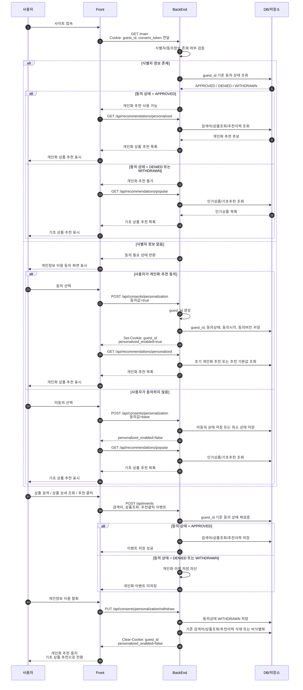

### 비회원 개인화 추천 프로세스 설계도

### 구성 요소별 역할

|영역|주요 역할|주의점|
|---|---|---|
|사용자|동의/미동의/철회 선택|동의하지 않아도 서비스 이용 자체는 가능해야 함|
|Front|동의 화면 표시, 쿠키 전달, 추천 영역 분기 표시|Front 판단만으로 개인화 여부 결정 금지|
|BackEnd|식별자 검증, 동의 상태 검증, 추천 API 분기, 이벤트 저장 통제|동의 상태 최종 판단은 반드시 BackEnd에서 수행|
|DB/저장소|동의 이력, 비회원 식별자, 검색어, 상품조회, 추천이력 저장|동의 철회 시 삭제/비식별화/보관정책 적용 필요|

### BackEnd 기준 분기 로직

|조건|처리|
|---|---|
|`guest_id` 없음 + 동의정보 없음|동의 화면 표시 상태 반환|
|동의함|`guest_id` 생성 후 쿠키 발급, 개인화 추천 활성화|
|동의 안함|개인화 이력 저장 금지, 인기상품/기초추천 제공|
|기존 `guest_id` 있음 + 동의상태 `APPROVED`|검색어/조회/추천 이력 누적 가능|
|기존 `guest_id` 있음 + 동의상태 `DENIED`|개인화 이력 저장 금지|
|동의상태 `WITHDRAWN`|개인화 중지, 쿠키 제거, 기존 이력 삭제 또는 비식별화|

### 저장소 설계 예시

|저장소|주요 컬럼|설명|
|---|---|---|
|`guest_identity`|`guest_id`, `created_at`, `last_seen_at`, `status`|비회원 식별자 관리|
|`guest_consent`|`guest_id`, `consent_type`, `status`, `policy_version`, `consented_at`, `withdrawn_at`|개인화 동의 상태 관리|
|`guest_search_history`|`guest_id`, `keyword`, `searched_at`|동의한 사용자만 저장|
|`guest_product_view_history`|`guest_id`, `product_id`, `viewed_at`|동의한 사용자만 저장|
|`guest_recommend_history`|`guest_id`, `recommendation_id`, `product_id`, `clicked_yn`, `created_at`|추천 노출/클릭 이력|
|`popular_product_snapshot`|`product_id`, `rank`, `basis_date`, `score`|미동의 사용자용 인기상품 추천|

### API 설계 예시

|API|Method|역할|
|---|--:|---|
|`/api/session/check`|GET|식별자/동의상태 확인|
|`/api/consents/personalization`|POST|개인화 동의 또는 미동의 저장|
|`/api/consents/personalization/withdraw`|PUT|개인화 동의 철회|
|`/api/recommendations/personalized`|GET|개인화 상품 추천|
|`/api/recommendations/popular`|GET|기초 인기상품 추천|
|`/api/events/search`|POST|검색어 이벤트 저장|
|`/api/events/product-view`|POST|상품조회 이벤트 저장|
|`/api/events/recommend-click`|POST|추천 클릭 이벤트 저장|

### 핵심 설계 기준

| 항목       | 권장 기준                                        |
| -------- | -------------------------------------------- |
| 쿠키 발급 시점 | 개인화 목적의 식별자는 동의 후 발급                         |
| 세션ID 사용  | `JSESSIONID`는 WAS 세션 관리용으로만 사용               |
| 개인화 식별자  | 별도 `guest_id` 사용                             |
| 추천 분기    | `APPROVED`면 개인화 추천, 그 외는 인기상품 추천             |
| 이벤트 저장   | BackEnd에서 동의 상태 재검증 후 저장                     |
| 철회 처리    | 개인화 중지 + 쿠키 제거 + 기존 이력 삭제/비식별화               |
| 보안 속성    | `HttpOnly`, `Secure`, `SameSite=Lax` 이상 적용   |
| 로그       | `guest_id`, 검색어, Referer 원문 로그 저장 최소화/마스킹 권장 |