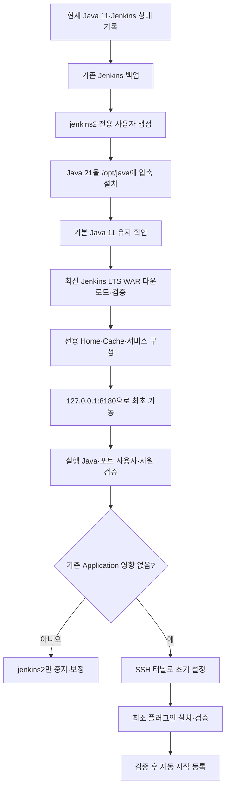

### 결론

기존 환경을 그대로 유지하면서 동일 서버에 다음과 같이 완전히 분리해 설치하는 것이 가장 안전합니다.

| 항목           | 기존 환경             | 신규 환경                       |
| ------------ | ----------------- | --------------------------- |
| 서비스          | `jenkins.service` | `jenkins2.service`          |
| 실행 사용자       | 기존 `jenkins`      | 신규 `jenkins2`               |
| Java         | 기존 OpenJDK 11     | `/opt/java/temurin-21`      |
| Jenkins      | 2.414.3           | 최신 LTS                      |
| JENKINS_HOME | 기존 경로             | `/var/lib/jenkins2`         |
| HTTP 포트      | 기존 8080 등         | `127.0.0.1:8180`            |
| WAR 파일       | 기존 패키지/WAR        | `/opt/jenkins2/jenkins.war` |
| 플러그인         | 기존 플러그인           | 신규 Jenkins 전용               |
| Java 기본값     | 변경 없음             | 서비스에서 절대경로 지정               |

- 2026년 7월 16일 현재 공식 최신 Jenkins는 **LTS 2.568.1**, Weekly 2.573입니다. 운영 목적이라면 Weekly가 아니라 **LTS 2.568.1**을 사용하는 것이 적합하며, 해당 LTS 계열은 Java 21 이상이 필요합니다. ([Jenkins][1])
- 가장 중요한 원칙은 다음입니다.

```text
시스템 기본 Java를 변경하지 않는다.
기존 Jenkins 서비스 파일을 수정하지 않는다.
기존 JENKINS_HOME을 복사하거나 공유하지 않는다.
신규 Jenkins는 전용 사용자·전용 포트·전용 디렉터리를 사용한다.
```

> **중요:** 동일 서버의 CPU·메모리·디스크·네트워크는 물리적으로 공유되므로 다른 애플리케이션에 대한 영향이 “수학적으로 0”이라고 보장할 수는 없습니다. 그러나 Java 경로·서비스·파일·포트·권한을 분리하고 systemd 자원 제한을 적용하면 설정 충돌과 자원 영향도를 매우 낮게 제한할 수 있습니다.

### 1. 설치 전 현재 환경 기록

변경 전에 기존 Jenkins와 Java 상태를 기록합니다.

#### 1.1 OS와 아키텍처 확인

```bash
cat /etc/os-release
uname -m
uname -a
```

아키텍처 결과:

| 출력        | Java 다운로드 아키텍처 |
| --------- | -------------- |
| `x86_64`  | `x64`          |
| `aarch64` | `aarch64`      |

#### 1.2 현재 기본 Java 확인

```bash
java -version
which java
readlink -f "$(which java)"
echo "$JAVA_HOME"
```

예상:

```text
openjdk version "11.0.21"
```

#### 1.3 기존 Jenkins 실제 Java 확인

```bash
OLD_PID=$(systemctl show jenkins -p MainPID --value)
echo "OLD_PID=$OLD_PID"
readlink -f "/proc/$OLD_PID/exe"
tr '\0' '\n' < "/proc/$OLD_PID/environ" \
  | grep -E '^(JAVA_HOME|JENKINS_HOME|PATH)='
ps -p "$OLD_PID" -o pid,user,lstart,args
```

#### 1.4 기존 Jenkins 서비스 정의 저장

```bash
sudo systemctl cat jenkins \
  > /root/jenkins-old-service-before.txt
sudo systemctl show jenkins \
  -p MainPID \
  -p ExecStart \
  -p Environment \
  -p EnvironmentFiles \
  > /root/jenkins-old-runtime-before.txt
```

#### 1.5 기존 포트 확인

```bash
sudo ss -lntp | grep -i java
sudo ss -lntp | grep -E ':8080|:8180'
```

`8180`에 결과가 없어야 합니다.

```bash
sudo lsof -iTCP:8180 -sTCP:LISTEN
```

결과가 없으면 사용 가능한 상태입니다.

#### 1.6 시스템 기본 Java 설정 기록

RHEL 계열:

```bash
alternatives --display java \
  > /root/java-alternatives-before.txt 2>&1
```

Ubuntu/Debian 계열:

```bash
update-alternatives --display java \
  > /root/java-alternatives-before.txt 2>&1
```

#### 1.7 자원 여유 확인

```bash
free -h
df -h
df -i
nproc
uptime
ps -eo pid,user,%cpu,%mem,rss,args \
  --sort=-%mem | head -20
```

`iostat`가 설치된 경우:

```bash
iostat -xz 1 3
```

확인 기준:

| 항목    | 점검 내용                     |
| ----- | ------------------------- |
| 메모리   | 신 Jenkins JVM용 여유 메모리 존재  |
| Swap  | 지속적인 Swap 사용 여부           |
| 디스크   | JENKINS_HOME과 빌드 기록 저장 공간 |
| CPU   | 기존 애플리케이션의 사용률이 이미 높은지    |
| inode | 플러그인·Workspace 파일 생성 여유   |

### 2. 기존 Jenkins 백업

신규 설치가 기존 Jenkins 파일을 건드리지는 않지만, 서버 변경 작업 전 백업을 확보하는 것이 안전합니다.
먼저 기존 `JENKINS_HOME`을 확인합니다.

```bash
sudo systemctl show jenkins -p Environment
sudo systemctl cat jenkins | grep -i JENKINS_HOME
```

예를 들어 `/var/lib/jenkins`라면:

```bash
sudo mkdir -p /backup/jenkins
```

일관성이 가장 높은 백업:

```bash
# ⚠️ 주의: 기존 Jenkins가 잠시 중지됩니다.
sudo systemctl stop jenkins
sudo tar -C /var/lib \
  -czpf "/backup/jenkins/jenkins-old-$(date +%Y%m%d-%H%M).tar.gz" \
  jenkins
sudo systemctl start jenkins
```

백업 검증:

```bash
BACKUP=$(ls -1t /backup/jenkins/jenkins-old-*.tar.gz | head -1)
tar -tzf "$BACKUP" >/dev/null &&
  echo "BACKUP ARCHIVE OK"
sha256sum "$BACKUP" | sudo tee "${BACKUP}.sha256"
```

기존 Jenkins가 정상 복귀했는지 확인합니다.

```bash
sudo systemctl is-active jenkins
curl -sI http://127.0.0.1:8080/login \
  | grep -iE 'HTTP/|X-Jenkins'
```

### 3. Java 21 설치 방식 선택

다른 애플리케이션에 영향을 주지 않으려면 RPM·DEB 방식보다 **압축 아카이브를 `/opt/java`에 직접 설치하는 방식**이 가장 안전합니다.
이 방식은 다음 항목을 변경하지 않습니다.

```text
/usr/bin/java
/etc/alternatives/java
JAVA_HOME 전역 환경변수
/etc/profile
/etc/environment
기존 Jenkins 서비스
다른 Java 애플리케이션의 실행 Java
```

Jenkins 프로젝트는 OpenJDK HotSpot 계열과 Eclipse Temurin을 주요 테스트 JVM으로 사용합니다. ([Jenkins][2])

### 4. 신규 전용 사용자 생성

기존 `jenkins` 사용자와 완전히 분리하기 위해 `jenkins2` 시스템 사용자를 생성합니다.
사용자 존재 여부 확인:

```bash
getent passwd jenkins2
```

결과가 없을 때만 생성합니다.
RHEL/Rocky/AlmaLinux:

```bash
sudo useradd \
  --system \
  --home-dir /var/lib/jenkins2 \
  --shell /sbin/nologin \
  --comment "Jenkins 2 isolated service" \
  jenkins2
```

Ubuntu/Debian:

```bash
sudo useradd \
  --system \
  --home-dir /var/lib/jenkins2 \
  --shell /usr/sbin/nologin \
  --comment "Jenkins 2 isolated service" \
  jenkins2
```

확인:

```bash
id jenkins2
getent passwd jenkins2
```

> **주의:** `jenkins2` 사용자를 기존 `jenkins` 그룹이나 운영 배포용 그룹에 추가하지 않습니다. 기존 Jenkins 파일, 배포 스크립트, 인증서, 운영 Application 경로에 접근할 권한을 부여하지 않습니다.

### 5. Java 21 전용 디렉터리 생성

```bash
sudo install -d \
  -o root \
  -g root \
  -m 0755 \
  /opt/java
sudo install -d \
  -o root \
  -g root \
  -m 0755 \
  /opt/java/temurin-21
```

확인:

```bash
ls -ld /opt/java /opt/java/temurin-21
```

### 6. Java 21 다운로드

#### 권장: 사내 승인된 Java 아카이브 사용

보안망 환경에서는 승인된 Eclipse Temurin/OpenJDK 21 `tar.gz` 파일을 `/tmp`에 전달받습니다.
예:

```text
/tmp/OpenJDK21U-jdk_x64_linux_hotspot_21.x.x.tar.gz
```

파일 확인:

```bash
ls -lh /tmp/OpenJDK21U-jdk_*_linux_hotspot_21*.tar.gz
file /tmp/OpenJDK21U-jdk_*_linux_hotspot_21*.tar.gz
```

압축 파일 무결성 확인:

```bash
tar -tzf /tmp/OpenJDK21U-jdk_*_linux_hotspot_21*.tar.gz \
  >/dev/null &&
  echo "JAVA ARCHIVE OK"
```

공급처에서 SHA-256을 제공했다면 반드시 비교합니다.

```bash
sha256sum /tmp/OpenJDK21U-jdk_*_linux_hotspot_21*.tar.gz
```

제공된 해시가 파일에 있다면:

```bash
cd /tmp
sha256sum -c OpenJDK21U-jdk.sha256
```

### 7. Java 21 압축 해제

```bash
# ⚠️ 주의: 대상 디렉터리가 비어 있는지 먼저 확인합니다.
sudo find /opt/java/temurin-21 \
  -mindepth 1 \
  -maxdepth 1 \
  -print
```

아무 결과도 없어야 합니다.

```bash
JAVA_ARCHIVE=$(ls -1 /tmp/OpenJDK21U-jdk_*_linux_hotspot_21*.tar.gz | head -1)
sudo tar -xzf "$JAVA_ARCHIVE" \
  -C /opt/java/temurin-21 \
  --strip-components=1
```

권한 설정:

```bash
sudo chown -R root:root /opt/java/temurin-21
sudo find /opt/java/temurin-21 \
  -type d -exec chmod 0755 {} \;
```

Java 실행 파일 확인:

```bash
ls -l /opt/java/temurin-21/bin/java
/opt/java/temurin-21/bin/java -version
/opt/java/temurin-21/bin/javac -version
```

예상:

```text
openjdk version "21..."
```

#### 기존 기본 Java가 유지되는지 확인

```bash
java -version
readlink -f "$(which java)"
```

여전히 Java 11이어야 합니다.

```text
기본 java                  → Java 11
/opt/java/temurin-21/bin/java → Java 21
```

> **절대 실행하지 않을 명령**

```bash
# ⚠️ 실행 금지: 서버 전체 기본 Java가 변경될 수 있습니다.
sudo alternatives --config java
sudo update-alternatives --config java
sudo ln -sf /opt/java/temurin-21/bin/java /usr/bin/java
export JAVA_HOME=/opt/java/temurin-21   # 전역 profile에 저장 금지
```

현재 터미널에서 일시적으로 `export`하는 것도 후속 명령에 영향을 줄 수 있으므로, 앞으로는 `/opt/java/temurin-21/bin/java` 절대경로를 사용합니다.

### 8. 신규 Jenkins 디렉터리 생성

```bash
sudo install -d \
  -o root \
  -g root \
  -m 0755 \
  /opt/jenkins2
sudo install -d \
  -o jenkins2 \
  -g jenkins2 \
  -m 0750 \
  /var/lib/jenkins2
sudo install -d \
  -o jenkins2 \
  -g jenkins2 \
  -m 0750 \
  /var/cache/jenkins2
sudo install -d \
  -o root \
  -g jenkins2 \
  -m 0750 \
  /etc/jenkins2
```

확인:

```bash
ls -ld \
  /opt/jenkins2 \
  /var/lib/jenkins2 \
  /var/cache/jenkins2 \
  /etc/jenkins2
```

### 9. 최신 Jenkins LTS 다운로드

현재 최신 LTS 버전을 변수로 고정합니다.

```bash
JENKINS_LTS_VERSION="2.568.1"
```

> **주의:** 운영 Jenkins에서는 `latest` URL을 서비스 시작 시마다 참조하지 않습니다. 검증한 정확한 버전 번호로 고정해야 재현과 롤백이 가능합니다.
> 다운로드:

```bash
curl -fL \
  --connect-timeout 10 \
  --max-time 300 \
  "https://get.jenkins.io/war-stable/${JENKINS_LTS_VERSION}/jenkins.war" \
  -o "/tmp/jenkins-${JENKINS_LTS_VERSION}.war"
```

확인:

```bash
ls -lh "/tmp/jenkins-${JENKINS_LTS_VERSION}.war"
file "/tmp/jenkins-${JENKINS_LTS_VERSION}.war"
```

Jenkins 공식 다운로드 페이지에 게시된 2.568.1 LTS SHA-256은 다음과 같습니다. ([Jenkins][1])

```text
58f24f3965fbef7708629fbe158d51bf138ffd577cadbc86b46367e8ad0beb83
```

검증:

```bash
echo \
"58f24f3965fbef7708629fbe158d51bf138ffd577cadbc86b46367e8ad0beb83  /tmp/jenkins-2.568.1.war" \
  | sha256sum -c -
```

정상:

```text
/tmp/jenkins-2.568.1.war: OK
```

Jenkins는 수동 다운로드 WAR에 대해 SHA-256 또는 GPG 검증을 권장합니다. ([Jenkins][3])

### 10. Jenkins WAR 배치

```bash
sudo install \
  -o root \
  -g root \
  -m 0644 \
  "/tmp/jenkins-${JENKINS_LTS_VERSION}.war" \
  "/opt/jenkins2/jenkins-${JENKINS_LTS_VERSION}.war"
```

애플리케이션 전용 심볼릭 링크 생성:

```bash
sudo ln -s \
  "/opt/jenkins2/jenkins-${JENKINS_LTS_VERSION}.war" \
  /opt/jenkins2/jenkins.war
```

확인:

```bash
ls -l /opt/jenkins2/
sha256sum /opt/jenkins2/jenkins.war
```

WAR Manifest 확인:

```bash
unzip -p /opt/jenkins2/jenkins.war \
  META-INF/MANIFEST.MF \
  | grep -E '^(Jenkins-Version|Implementation-Version):'
```

### 11. Java 21에서 Jenkins 사전 기동 검사

실제 서비스 시작 전에 도움말이 정상 출력되는지 확인합니다.

```bash
sudo -u jenkins2 \
  env -i \
  HOME=/var/lib/jenkins2 \
  JENKINS_HOME=/var/lib/jenkins2 \
  PATH=/usr/bin:/bin \
  /opt/java/temurin-21/bin/java \
  -jar /opt/jenkins2/jenkins.war \
  --help | head -50
```

이 명령은 Jenkins를 장시간 기동하지 않고 WAR와 Java 호환성을 확인합니다.
Jenkins WAR는 지원되는 Java로 직접 실행할 수 있고, `JENKINS_HOME`과 `--httpPort`를 별도로 지정할 수 있습니다. ([Jenkins][4])

### 12. 신규 Jenkins 전용 systemd 서비스 작성

파일 생성:

```bash
sudo vi /etc/systemd/system/jenkins2.service
```

내용:

```ini
[Unit]
Description=Jenkins LTS Isolated Controller
Documentation=https://www.jenkins.io/
After=network-online.target
Wants=network-online.target
Conflicts=
[Service]
Type=simple
User=jenkins2
Group=jenkins2
WorkingDirectory=/var/lib/jenkins2
Environment="HOME=/var/lib/jenkins2"
Environment="JENKINS_HOME=/var/lib/jenkins2"
Environment="JAVA_HOME=/opt/java/temurin-21"
Environment="PATH=/opt/java/temurin-21/bin:/usr/bin:/bin"
ExecStart=/opt/java/temurin-21/bin/java \
  -Xms512m \
  -Xmx1024m \
  -Djava.awt.headless=true \
  -Djava.io.tmpdir=/var/cache/jenkins2 \
  -jar /opt/jenkins2/jenkins.war \
  --httpListenAddress=127.0.0.1 \
  --httpPort=8180 \
  --webroot=/var/cache/jenkins2/war
SuccessExitStatus=143
Restart=on-failure
RestartSec=10
TimeoutStartSec=180
TimeoutStopSec=90
LimitNOFILE=8192
UMask=0027
NoNewPrivileges=true
PrivateTmp=true
ProtectHome=true
ProtectSystem=full
ReadWritePaths=/var/lib/jenkins2 /var/cache/jenkins2
# 다른 Application의 자원 보호를 위한 초기 제한 예시
MemoryHigh=1200M
MemoryMax=1536M
CPUQuota=100%
TasksMax=512
[Install]
WantedBy=multi-user.target
```

#### 자원 제한 해석

| 설정                 | 의미                      |
| ------------------ | ----------------------- |
| `-Xmx1024m`        | Jenkins JVM Heap 최대 1GB |
| `MemoryHigh=1200M` | 1.2GB부터 메모리 압박 적용       |
| `MemoryMax=1536M`  | 서비스 전체 최대 1.5GB         |
| `CPUQuota=100%`    | 최대 CPU 코어 1개 수준         |
| `TasksMax=512`     | 프로세스·스레드 과다 생성 제한       |

> **주의:** 위 값은 초기 설치·플러그인 검증용 보수적인 예입니다. 실제 Job을 실행하기 전 서버 자원과 Jenkins 부하에 맞게 조정해야 합니다. `MemoryMax`에 도달하면 신규 Jenkins만 OOM 종료될 수 있지만, 다른 애플리케이션의 메모리를 무제한 점유하는 것을 방지합니다.

### 13. 서비스 파일 문법 검증

```bash
sudo systemd-analyze verify \
  /etc/systemd/system/jenkins2.service
```

출력이 없으면 일반적으로 문법상 오류가 없는 상태입니다.
기존 서비스가 수정되지 않았는지 확인:

```bash
sudo systemctl cat jenkins \
  | sha256sum
sha256sum /root/jenkins-old-service-before.txt
```

보다 직접적으로 비교:

```bash
sudo systemctl cat jenkins \
  > /tmp/jenkins-old-service-after.txt
diff -u \
  /root/jenkins-old-service-before.txt \
  /tmp/jenkins-old-service-after.txt
```

차이가 없어야 합니다.

### 14. systemd 설정 인식

```bash
# ⚠️ 주의: daemon-reload는 systemd 서비스 정의를 다시 읽습니다.
# 실행 중인 기존 서비스를 재시작하지는 않습니다.
sudo systemctl daemon-reload
```

신규 서비스 확인:

```bash
sudo systemctl cat jenkins2
sudo systemctl show jenkins2 \
  -p User \
  -p Group \
  -p ExecStart \
  -p Environment
```

### 15. 기동 전 최종 검사

#### 포트

```bash
sudo ss -lntp | grep ':8180'
```

출력이 없어야 합니다.

#### 디렉터리

```bash
sudo -u jenkins2 test -w /var/lib/jenkins2 &&
  echo "JENKINS_HOME WRITABLE"
sudo -u jenkins2 test -w /var/cache/jenkins2 &&
  echo "CACHE WRITABLE"
sudo -u jenkins2 test -r /opt/jenkins2/jenkins.war &&
  echo "WAR READABLE"
```

#### 기존 Jenkins

```bash
sudo systemctl is-active jenkins
OLD_PID=$(systemctl show jenkins -p MainPID --value)
readlink -f "/proc/$OLD_PID/exe"
```

#### 메모리

```bash
free -h
```

### 16. 신규 Jenkins 최초 기동

```bash
# ⚠️ 주의: 신규 Jenkins 프로세스를 실제로 시작합니다.
# 아직 enable하지 않으므로 서버 재부팅 시 자동 시작되지는 않습니다.
sudo systemctl start jenkins2
```

상태:

```bash
sudo systemctl status jenkins2 --no-pager
```

로그:

```bash
sudo journalctl -u jenkins2 -n 300 --no-pager
sudo journalctl -fu jenkins2
```

### 17. 신규 Jenkins 정상 여부 확인

#### 프로세스

```bash
NEW_PID=$(systemctl show jenkins2 -p MainPID --value)
echo "NEW_PID=$NEW_PID"
ps -p "$NEW_PID" -o pid,user,lstart,%cpu,%mem,rss,args
```

#### 실행 Java

```bash
readlink -f "/proc/$NEW_PID/exe"
```

정상:

```text
/opt/java/temurin-21/bin/java
```

#### 환경변수

```bash
sudo tr '\0' '\n' < "/proc/$NEW_PID/environ" \
  | grep -E '^(JAVA_HOME|JENKINS_HOME|HOME|PATH)='
```

정상:

```text
JAVA_HOME=/opt/java/temurin-21
JENKINS_HOME=/var/lib/jenkins2
```

#### 포트

```bash
sudo ss -lntp | grep ':8180'
```

정상:

```text
127.0.0.1:8180
```

#### HTTP

```bash
curl -sI http://127.0.0.1:8180/login \
  | grep -iE 'HTTP/|X-Jenkins'
```

#### 신규 Jenkins 버전

```bash
curl -sI http://127.0.0.1:8180/login \
  | grep -i X-Jenkins
```

### 18. 기존 Jenkins가 영향받지 않았는지 검증

#### 기존 Jenkins 실행 Java

```bash
OLD_PID=$(systemctl show jenkins -p MainPID --value)
readlink -f "/proc/$OLD_PID/exe"
```

기존 Java 11 경로여야 합니다.

#### 기존 Jenkins 포트

```bash
sudo ss -lntp | grep -E ':8080|:8180'
```

예상:

```text
기존 Jenkins → 0.0.0.0:8080 또는 기존 주소
신규 Jenkins → 127.0.0.1:8180
```

#### 셸 기본 Java

```bash
java -version
readlink -f "$(which java)"
```

여전히 Java 11이어야 합니다.

#### alternatives 비교

RHEL:

```bash
alternatives --display java \
  > /tmp/java-alternatives-after.txt 2>&1
diff -u \
  /root/java-alternatives-before.txt \
  /tmp/java-alternatives-after.txt
```

Ubuntu:

```bash
update-alternatives --display java \
  > /tmp/java-alternatives-after.txt 2>&1
diff -u \
  /root/java-alternatives-before.txt \
  /tmp/java-alternatives-after.txt
```

차이가 없어야 합니다.

#### 두 프로세스 사용자 확인

```bash
ps -eo pid,user,%cpu,%mem,rss,args \
  | grep -E '[j]enkins.*war|jenkins2'
```

정상 구조:

```text
기존 Jenkins → jenkins 사용자
신규 Jenkins → jenkins2 사용자
```

### 19. 외부에 노출하지 않고 관리 화면 접속

신규 Jenkins는 `127.0.0.1:8180`으로만 바인딩했으므로 외부에서 직접 접근할 수 없습니다.
관리 PC에서 SSH 터널을 생성합니다.

```bash
ssh -L 8180:127.0.0.1:8180 \
  서버계정@JENKINS_SERVER_IP
```

브라우저:

```text
http://127.0.0.1:8180
```

초기 관리자 비밀번호 확인:

```bash
sudo cat \
  /var/lib/jenkins2/secrets/initialAdminPassword
```

초기 Setup Wizard에서는 우선 최소 플러그인만 설치하거나 플러그인 설치를 건너뛰고 기동 상태부터 검증하는 것이 안전합니다.

### 20. 자동 시작 등록

기동·접속·Java 분리가 확인된 후에만 자동 시작을 등록합니다.

```bash
# ⚠️ 주의: enable 이후 서버가 재부팅되면 신규 Jenkins도 자동 시작됩니다.
sudo systemctl enable jenkins2
```

확인:

```bash
sudo systemctl is-enabled jenkins2
sudo systemctl is-active jenkins2
```

### 21. 네트워크 확인

신규 Jenkins가 플러그인 Update Center에 접근할 수 있는지 `jenkins2` 계정 기준으로 확인합니다.

```bash
sudo -u jenkins2 getent ahosts updates.jenkins.io
```

TCP 443:

```bash
sudo -u jenkins2 \
  timeout 5 bash -c \
  'cat < /dev/null > /dev/tcp/updates.jenkins.io/443' &&
  echo "TCP 443 OK" ||
  echo "TCP 443 FAIL"
```

HTTPS:

```bash
sudo -u jenkins2 \
  curl -fsSIL \
  --connect-timeout 10 \
  --max-time 30 \
  https://updates.jenkins.io/update-center.json
```

리다이렉트 포함:

```bash
sudo -u jenkins2 \
  curl -IL \
  --connect-timeout 10 \
  --max-time 30 \
  https://updates.jenkins.io/latest/git.hpi
```

### 22. 사내 인증서가 필요한 경우

Java 11의 `cacerts`를 직접 수정하거나 신규 Java 21의 기본 `cacerts`를 변경하면 관리가 복잡해집니다.
신규 Jenkins 전용 TrustStore를 만듭니다.

```bash
sudo cp \
  /opt/java/temurin-21/lib/security/cacerts \
  /etc/jenkins2/cacerts
sudo chown root:jenkins2 \
  /etc/jenkins2/cacerts
sudo chmod 0640 \
  /etc/jenkins2/cacerts
```

사내 Root CA 추가:

```bash
# ⚠️ 주의: 신뢰할 수 있는 사내 CA 인증서인지 먼저 확인해야 합니다.
sudo /opt/java/temurin-21/bin/keytool \
  -importcert \
  -alias company-root-ca \
  -file /승인경로/company-root-ca.crt \
  -keystore /etc/jenkins2/cacerts \
  -storepass changeit
```

확인:

```bash
sudo /opt/java/temurin-21/bin/keytool \
  -list \
  -keystore /etc/jenkins2/cacerts \
  -storepass changeit \
  -alias company-root-ca
```

`jenkins2.service`의 Java 옵션에 추가:

```ini
-Djavax.net.ssl.trustStore=/etc/jenkins2/cacerts
-Djavax.net.ssl.trustStorePassword=changeit
```

적용:

```bash
sudo systemctl daemon-reload
sudo systemctl restart jenkins2
```

이 방식은 다음 파일에 영향을 주지 않습니다.

```text
기존 Java 11 cacerts
신규 Java 21 원본 cacerts
다른 Application의 TrustStore
OS 전체 인증서 저장소
```

### 23. 플러그인 설치 전 주의

처음부터 기존 Jenkins의 `/var/lib/jenkins/plugins`를 복사하지 않는 것이 좋습니다.

```bash
# ⚠️ 권장하지 않음
cp -a /var/lib/jenkins/plugins \
      /var/lib/jenkins2/
```

문제:

| 위험         | 내용                   |
| ---------- | -------------------- |
| 구 플러그인 호환성 | 신 Jenkins에서 로딩 실패 가능 |
| 의존성 충돌     | 오래된 의존 플러그인 동반 이관    |
| 취약점 이관     | 기존 취약 버전까지 복사        |
| 설정 혼입      | 기존 운영 설정이 신규 환경에 복제  |
| 권장 순서:     |                      |

1. 기존 Jenkins 플러그인 ID 목록만 추출
2. 신규 Jenkins 호환 최신 버전 확인
3. 신규 Jenkins 전용 플러그인 디렉터리에 설치
4. 플러그인별 기동 로그 확인

### 24. 다른 애플리케이션 영향 방지 체크리스트

| 항목                 | 안전 기준                     |
| ------------------ | ------------------------- |
| `/usr/bin/java`    | 변경하지 않음                   |
| `alternatives`     | 변경하지 않음                   |
| `/etc/profile`     | 변경하지 않음                   |
| `/etc/environment` | 변경하지 않음                   |
| 기존 Jenkins unit    | 변경하지 않음                   |
| 기존 JENKINS_HOME    | 공유·복사하지 않음                |
| 신 Java             | `/opt/java/temurin-21` 전용 |
| 신 Jenkins          | `jenkins2` 사용자 전용         |
| 포트                 | `127.0.0.1:8180`          |
| Agent              | 초기에는 연결하지 않음              |
| Job                | 초기에는 생성·복사하지 않음           |
| 자원                 | MemoryMax·CPUQuota 설정     |
| TrustStore         | 신 Jenkins 전용 파일           |
| Proxy              | 신 Jenkins service에만 지정    |

### 25. 절대 피해야 할 명령

```bash
# ⚠️ 서버 전체 기본 Java 변경 위험
sudo alternatives --config java
sudo update-alternatives --config java
# ⚠️ 시스템 Java 심볼릭 링크 변경 위험
sudo ln -sf /opt/java/temurin-21/bin/java /usr/bin/java
# ⚠️ 모든 사용자와 Application에 JAVA_HOME 적용 위험
echo 'export JAVA_HOME=/opt/java/temurin-21' \
  | sudo tee -a /etc/profile
# ⚠️ 기존 Jenkins 서비스 변경 위험
sudo systemctl edit jenkins
# ⚠️ 기존 JENKINS_HOME 손상 위험
sudo chown -R jenkins2:jenkins2 /var/lib/jenkins
# ⚠️ 구·신 Jenkins가 같은 데이터를 동시에 수정
JENKINS_HOME=/var/lib/jenkins \
  /opt/java/temurin-21/bin/java \
  -jar /opt/jenkins2/jenkins.war
# ⚠️ 기존 패키지 Jenkins가 교체될 수 있음
sudo dnf update jenkins
sudo apt upgrade jenkins
```

### 26. 신규 Jenkins 중지·롤백

신규 설치에 문제가 있으면 기존 Jenkins는 그대로 유지한 채 신규 서비스만 중지합니다.

```bash
sudo systemctl stop jenkins2
sudo systemctl disable jenkins2
```

확인:

```bash
sudo systemctl is-active jenkins
sudo systemctl is-active jenkins2
java -version
```

신규 서비스 파일 제거:

```bash
# ⚠️ 주의: 신규 Jenkins 서비스만 제거합니다.
sudo rm -f /etc/systemd/system/jenkins2.service
sudo systemctl daemon-reload
```

신규 데이터 완전 삭제는 검증과 백업 후에만 수행합니다.

```bash
# ⚠️ 매우 주의: 아래 경로가 신규 전용 경로인지 반드시 재확인합니다.
sudo test -d /var/lib/jenkins2 &&
  sudo test "/var/lib/jenkins2" != "/var/lib/jenkins" &&
  echo "DELETE TARGET CHECKED"
# 확인 후에만 실행
sudo rm -rf /var/lib/jenkins2
sudo rm -rf /var/cache/jenkins2
sudo rm -rf /opt/jenkins2
sudo rm -rf /opt/java/temurin-21
sudo rm -rf /etc/jenkins2
```

기존 Jenkins 확인:

```bash
sudo systemctl restart jenkins
sudo systemctl status jenkins --no-pager
```

### 최종 권장 절차



핵심 구성은 다음과 같습니다.

```text
기존:
  /usr/bin/java 또는 기존 Java 경로
  Java 11.0.21
  jenkins.service
  기존 JENKINS_HOME
  기존 HTTP 포트
신규:
  /opt/java/temurin-21/bin/java
  Java 21
  jenkins2.service
  /var/lib/jenkins2
  127.0.0.1:8180
```

이 구조에서는 신규 Java와 Jenkins가 기존 Application의 `PATH`, `JAVA_HOME`, Java 심볼릭 링크, Jenkins 서비스 및 데이터 디렉터리를 변경하지 않습니다. 다만 동일 서버 자원 공유에 따른 간접 영향까지 제한하려면 `MemoryMax`, `CPUQuota`, 전용 사용자, localhost 바인딩을 반드시 유지해야 합니다.

[1]: https://www.jenkins.io/download/ "
Download and deploy
"
[2]: https://www.jenkins.io/doc/book/platform-information/support-policy-java/ "
Java Support Policy
"
[3]: https://www.jenkins.io/download/verify/ "
Verifying Downloads
"
[4]: https://www.jenkins.io/doc/book/installing/war-file/ "
WAR file
"
