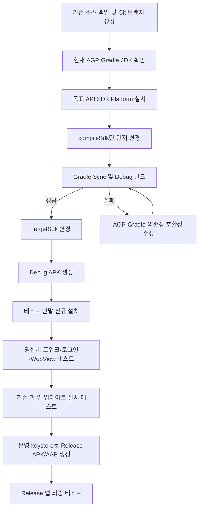

### 1. 전체 작업 흐름
```text
개발 PC 환경 준비
→ Android Studio 설치
→ 기존 Kotlin 프로젝트 열기
→ 현재 Gradle·AGP·JDK 버전 확인
→ Android SDK Platform 설치
→ compileSdk·targetSdk 변경
→ Gradle Sync
→ 빌드 오류 수정
→ Debug APK 생성
→ 테스트 단말 USB 연결
→ APK 설치 및 기능 테스트
→ Release APK/AAB 서명 빌드
```
`app/build.gradle.kts`가 존재한다면 Gradle 설정을 **Kotlin DSL**로 작성한 Android 프로젝트입니다. Android Studio는 Android 앱 개발을 위한 공식 IDE이며, 최신 프로젝트에서는 Kotlin DSL이 기본 빌드 설정 방식으로 사용됩니다. citeturn885796search26turn885796search37
---
### 2. 준비할 개발 도구
|도구|필수 여부|용도|
|---|---:|---|
|Android Studio|필수|소스 편집, SDK 관리, 빌드, 디버깅|
|Android SDK Platform|필수|지정한 `compileSdk` 버전으로 컴파일|
|Android SDK Build-Tools|필수|APK/AAB 생성|
|Android SDK Platform-Tools|필수|`adb`를 이용한 단말 연결·설치|
|JDK|필수|Gradle 및 Android 빌드 실행|
|USB 드라이버|Windows에서 필요 가능|PC가 Android 단말을 인식하도록 지원|
|Git|권장|변경 전 소스 백업과 형상관리|
Android Studio 설치본에는 일반적으로 빌드에 사용할 JDK가 포함되므로, 처음부터 별도의 Java를 시스템 전역에 설치할 필요는 없습니다. 기존 프로젝트가 특정 JDK 버전을 요구하는 경우에만 프로젝트별 Gradle JDK 설정을 조정합니다.
---
### 3. Android Studio 설치
#### 3.1 설치 파일 다운로드
Android 공식 사이트에서 Windows용 Android Studio 최신 안정 버전을 내려받아 설치합니다. Google은 Windows 환경에서 EXE 설치 파일 사용을 권장합니다. citeturn885796search0turn885796search8
설치 화면에서는 다음 항목을 선택합니다.
```text
Android Studio
Android Virtual Device
Android SDK
Android SDK Platform-Tools
Android SDK Build-Tools
```
실제 모바일 단말만 사용하더라도 `Platform-Tools`는 반드시 설치해야 합니다.
#### 3.2 초기 실행
Android Studio 최초 실행 시:
```text
Do not import settings
→ Standard
→ 사용할 UI Theme 선택
→ SDK 설치 확인
→ Finish
```
#### 3.3 SDK 위치 확인
Android Studio에서 다음 메뉴를 엽니다.
```text
File
→ Settings
→ Languages & Frameworks
→ Android SDK
```
일반적인 Windows SDK 경로:
```text
C:\Users\사용자계정\AppData\Local\Android\Sdk
```
---
### 4. 기존 Kotlin 프로젝트 열기
Android Studio에서:
```text
File
→ Open
→ 프로젝트 루트 디렉터리 선택
```
`app` 폴더만 선택하지 말고 다음 파일이 있는 **프로젝트 최상위 디렉터리**를 선택합니다.
```text
프로젝트-root/
├─ app/
│  ├─ src/
│  └─ build.gradle.kts
├─ gradle/
├─ build.gradle.kts
├─ settings.gradle.kts
├─ gradle.properties
├─ gradlew
└─ gradlew.bat
```
프로젝트를 열면 Android Studio가 Gradle Sync를 실행합니다. 처음에는 필요한 Gradle과 라이브러리를 내려받으므로 인터넷 연결이 필요합니다.
---
### 5. 변경 전에 프로젝트 백업
Git을 사용하는 프로젝트라면 프로젝트 루트에서 다음 명령을 실행합니다.
```bash
git status
git checkout -b upgrade/android-target-sdk
git add .
git commit -m "backup before Android SDK upgrade"
```
아직 Git 저장소가 아니라면 프로젝트 전체를 별도 디렉터리에 복사합니다.
```text
my-android-app
→ my-android-app_backup_20260722
```
SDK 변경 과정에서는 `build.gradle.kts` 외에 AGP, Gradle Wrapper, 라이브러리 버전까지 변경될 수 있으므로 백업이 필요합니다.
---
### 6. 현재 빌드 환경 확인
#### 6.1 Gradle 빌드 가능 여부 확인
Android Studio 하단의 `Terminal`을 열고 프로젝트 루트에서 실행합니다.
```bat
gradlew.bat --version
```
PowerShell에서는 다음 명령도 가능합니다.
```powershell
.\gradlew.bat --version
```
예상 출력:
```text
Gradle 8.x
Kotlin 1.x 또는 2.x
Launcher JVM 17.x
Daemon JVM 17.x
```
#### 6.2 Android Gradle Plugin 버전 확인
프로젝트에 따라 다음 위치 중 하나에 정의되어 있습니다.
##### 루트 `build.gradle.kts`
```kotlin
plugins {
    id("com.android.application") version "8.7.3" apply false
    id("org.jetbrains.kotlin.android") version "2.0.21" apply false
}
```
##### `settings.gradle.kts`
```kotlin
pluginManagement {
    plugins {
        id("com.android.application") version "8.7.3"
        id("org.jetbrains.kotlin.android") version "2.0.21"
    }
}
```
##### `gradle/libs.versions.toml`
```toml
[versions]
agp = "8.7.3"
kotlin = "2.0.21"
```
#### 6.3 Gradle Wrapper 버전 확인
`gradle/wrapper/gradle-wrapper.properties`:
```properties
distributionUrl=https\://services.gradle.org/distributions/gradle-8.9-bin.zip
```
Android Studio, AGP, Gradle, JDK는 서로 호환되는 조합이어야 합니다. Android 공식 문서에서도 Android Studio와 AGP 호환성을 별도로 관리합니다. citeturn885796search35
---
### 7. `compileSdk`, `targetSdk`, `minSdk` 의미
|설정|역할|영향|
|---|---|---|
|`compileSdk`|소스를 어떤 Android API로 컴파일할지 결정|사용 가능한 API와 빌드 환경|
|`targetSdk`|앱이 어떤 Android 버전 동작 정책까지 대응했는지 선언|권한, 백그라운드 실행, 보안 정책 등|
|`minSdk`|앱을 설치할 수 있는 최소 Android 버전|지원 가능한 최소 단말|
예:
```kotlin
android {
    compileSdk = 35
    defaultConfig {
        minSdk = 24
        targetSdk = 35
    }
}
```
#### 중요한 차이
```text
compileSdk 변경
→ 주로 컴파일 환경과 API 사용 가능 범위에 영향
targetSdk 변경
→ 최신 Android의 보안·권한·백그라운드 동작 정책 적용
minSdk 변경
→ 설치 가능한 구형 단말 범위 변경
```
`targetSdk`를 올린다고 해서 `minSdk`도 같이 올려야 하는 것은 아닙니다.
---
### 8. 필요한 Android SDK 설치
예를 들어 다음과 같이 변경한다고 가정합니다.
```kotlin
compileSdk = 35
targetSdk = 35
```
Android Studio에서:
```text
Tools
→ SDK Manager
→ SDK Platforms
```
다음 항목을 선택합니다.
```text
Android 15.0
API Level 35
Android SDK Platform 35
```
그다음:
```text
SDK Tools
→ Android SDK Build-Tools
→ Android SDK Platform-Tools
→ Android SDK Command-line Tools
```
`Show Package Details`를 선택하면 세부 버전을 볼 수 있습니다.
Android 15 API를 사용하려면 `compileSdk = 35`로 설정하고 해당 SDK Platform을 설치해야 합니다. Android 공식 문서는 Android 15 빌드에 AGP 8.6.1 이상을 안내하고 있습니다. citeturn885796search42
> Android 16/API 36으로 올리는 경우 `compileSdk = 36`을 사용하며, 기존 AGP가 낮다면 AGP 업그레이드가 먼저 필요합니다. 공식 Android 16 설정 문서는 AGP 8.9.0-rc01 이상을 요구합니다. 운영 프로젝트에서는 RC보다 최신 안정 AGP 사용이 안전합니다. citeturn885796search30
---
### 9. `app/build.gradle.kts` 변경
#### 9.1 일반적인 변경 예
변경 전:
```kotlin
plugins {
    id("com.android.application")
    id("org.jetbrains.kotlin.android")
}
android {
    namespace = "com.example.myapp"
    compileSdk = 33
    defaultConfig {
        applicationId = "com.example.myapp"
        minSdk = 24
        targetSdk = 33
        versionCode = 10
        versionName = "1.0.10"
    }
}
```
변경 후:
```kotlin
plugins {
    id("com.android.application")
    id("org.jetbrains.kotlin.android")
}
android {
    namespace = "com.example.myapp"
    compileSdk = 35
    defaultConfig {
        applicationId = "com.example.myapp"
        minSdk = 24
        targetSdk = 35
        versionCode = 11
        versionName = "1.0.11"
    }
}
```
Android 앱 모듈의 SDK 설정은 모듈 수준 `app/build.gradle.kts`의 `android` 블록과 `defaultConfig` 블록에 지정합니다. citeturn885796search2turn885796search10
#### 9.2 핵심 변경 항목
```diff
android {
-    compileSdk = 33
+    compileSdk = 35
    defaultConfig {
        minSdk = 24
-        targetSdk = 33
+        targetSdk = 35
-        versionCode = 10
-        versionName = "1.0.10"
+        versionCode = 11
+        versionName = "1.0.11"
    }
}
```
`versionCode`와 `versionName`은 로컬 테스트만 한다면 반드시 변경할 필요는 없습니다. 다만 Play Console에 새 버전을 올릴 예정이라면 기존 배포본보다 `versionCode`가 커야 합니다.
---
### 10. SDK 값이 다른 파일에서 관리되는 경우
프로젝트에 따라 숫자가 직접 작성되지 않고 변수로 관리될 수 있습니다.
#### 10.1 변수 사용
```kotlin
android {
    compileSdk = rootProject.extra["compileSdkVersion"] as Int
    defaultConfig {
        targetSdk = rootProject.extra["targetSdkVersion"] as Int
    }
}
```
이 경우 루트 `build.gradle.kts` 또는 별도 설정 파일을 찾아 변경해야 합니다.
#### 10.2 Version Catalog 사용
`gradle/libs.versions.toml`:
```toml
[versions]
compileSdk = "35"
targetSdk = "35"
minSdk = "24"
```
`app/build.gradle.kts`:
```kotlin
android {
    compileSdk = libs.versions.compileSdk.get().toInt()
    defaultConfig {
        minSdk = libs.versions.minSdk.get().toInt()
        targetSdk = libs.versions.targetSdk.get().toInt()
    }
}
```
이 구조에서는 `app/build.gradle.kts`가 아닌 `libs.versions.toml` 값을 변경합니다.
---
### 11. Gradle Sync 실행
파일 변경 후 Android Studio 우측 상단의 다음 메시지를 클릭합니다.
```text
Sync Now
```
또는 메뉴에서:
```text
File
→ Sync Project with Gradle Files
```
정상 완료 메시지:
```text
BUILD SUCCESSFUL
```
Sync 단계에서 실패하면 바로 APK 빌드를 진행하지 말고 Gradle, AGP, JDK 및 의존성 오류부터 해결해야 합니다.
---
### 12. Gradle JDK 설정
Android Studio에서:
```text
File
→ Settings
→ Build, Execution, Deployment
→ Build Tools
→ Gradle
→ Gradle JDK
```
우선 권장:
```text
GRADLE_LOCAL_JAVA_HOME
또는
Embedded JDK
```
AGP 8.x 프로젝트는 일반적으로 JDK 17을 사용합니다.
예:
```text
Gradle JDK
→ jbr-17
```
기존 프로젝트가 AGP 7.x 이하라면 무조건 JDK만 먼저 올리지 말고 기존 AGP와 Gradle 호환성을 확인해야 합니다.
#### 확인 명령
```bat
gradlew.bat --version
```
실행 결과의 다음 항목을 확인합니다.
```text
Gradle
Launcher JVM
Daemon JVM
```
---
### 13. 첫 번째 명령행 빌드
프로젝트 루트의 Android Studio Terminal에서 실행합니다.
#### 13.1 Windows CMD
```bat
gradlew.bat clean
gradlew.bat assembleDebug
```
#### 13.2 Windows PowerShell
```powershell
.\gradlew.bat clean
.\gradlew.bat assembleDebug
```
#### 13.3 한 번에 실행
```bat
gradlew.bat clean assembleDebug
```
정상 결과:
```text
BUILD SUCCESSFUL
```
생성되는 APK:
```text
app\build\outputs\apk\debug\app-debug.apk
```
#### 각 명령 역할
|명령|역할|
|---|---|
|`clean`|기존 빌드 결과 삭제|
|`assembleDebug`|디버그 APK 생성|
|`assembleRelease`|릴리스 APK 생성|
|`bundleRelease`|Google Play용 AAB 생성|
|`installDebug`|연결된 단말에 Debug APK 설치|
|`testDebugUnitTest`|로컬 단위 테스트 실행|
|`connectedDebugAndroidTest`|연결 단말에서 계측 테스트 실행|
---
### 14. Android Studio 메뉴로 Debug APK 생성
명령어 대신 Android Studio 메뉴에서도 생성할 수 있습니다.
```text
Build
→ Build Bundle(s) / APK(s)
→ Build APK(s)
```
완료 후 우측 하단 메시지:
```text
APK(s) generated successfully
```
`locate`를 클릭하면 APK 위치가 열립니다.
```text
app\build\outputs\apk\debug\app-debug.apk
```
---
### 15. 테스트용 모바일 설정
#### 15.1 개발자 옵션 활성화
테스트 Android 단말에서:
```text
설정
→ 휴대전화 정보
→ 소프트웨어 정보
→ 빌드 번호 7회 연속 터치
```
잠금 비밀번호를 입력하면 개발자 옵션이 활성화됩니다.
#### 15.2 USB 디버깅 활성화
```text
설정
→ 개발자 옵션
→ USB 디버깅 활성화
```
실제 단말에서 앱을 디버깅하려면 개발자 옵션에서 USB 디버깅을 활성화해야 합니다. citeturn885796search4
#### 15.3 USB 연결
1. 데이터 통신이 가능한 USB 케이블로 PC와 단말을 연결합니다.
2. 단말 USB 모드를 `파일 전송`으로 변경합니다.
3. 다음 메시지가 나타나면 허용합니다.
```text
이 컴퓨터에서 USB 디버깅을 허용하시겠습니까?
→ 항상 이 컴퓨터에서 허용
→ 허용
```
---
### 16. PC에서 단말 연결 확인
Android Studio Terminal에서:
```bat
adb devices
```
`adb` 경로가 등록되지 않았다면:
```bat
"%LOCALAPPDATA%\Android\Sdk\platform-tools\adb.exe" devices
```
정상:
```text
List of devices attached
R3XXXXXXXXX    device
```
상태별 의미:

| 상태             | 의미               | 처리              |
| -------------- | ---------------- | --------------- |
| `device`       | 정상 연결            | 설치 가능           |
| `unauthorized` | 단말에서 USB 디버깅 미승인 | 단말 승인창 확인       |
| 목록 없음          | USB 드라이버·케이블 문제  | 드라이버와 USB 모드 확인 |
| `offline`      | ADB 통신 비정상       | ADB 재시작         |

ADB 재시작:
```bat
adb kill-server
adb start-server
adb devices
```
---
### 17. 테스트용 앱 설치
#### 방법 1: Gradle로 빌드와 설치
```bat
gradlew.bat installDebug
```
#### 방법 2: APK 직접 설치
```bat
adb install app\build\outputs\apk\debug\app-debug.apk
```
기존 앱을 유지하면서 덮어쓰기:
```bat
adb install -r app\build\outputs\apk\debug\app-debug.apk
```
권한까지 다시 부여하며 설치:
```bat
adb install -r -g app\build\outputs\apk\debug\app-debug.apk
```
#### 방법 3: Android Studio Run
1. Android Studio 상단 단말 목록에서 연결된 스마트폰을 선택합니다.
2. 실행 구성에서 `app`을 선택합니다.
3. ▶ Run 버튼을 누릅니다.
단축키:
```text
Shift + F10
```
Android Studio는 앱 빌드, 단말 설치, 앱 실행을 순차적으로 수행합니다.
---
### 18. 운영 앱과 테스트 앱을 동시에 설치하는 방법
기존 운영 앱과 테스트 앱의 `applicationId`가 같으면 테스트 앱 설치 시 운영 앱과 충돌하거나 덮어쓸 수 있습니다.
가장 안전한 방법은 Debug 빌드에 `applicationIdSuffix`를 지정하는 것입니다.
```kotlin
android {
    namespace = "org.buykorea.app"
    compileSdk = 35
    defaultConfig {
        applicationId = "org.buykorea.app"
        minSdk = 24
        targetSdk = 35
        versionCode = 11
        versionName = "1.0.11"
    }
    buildTypes {
        debug {
            applicationIdSuffix = ".dev"
            versionNameSuffix = "-dev"
            isDebuggable = true
        }
        release {
            isMinifyEnabled = false
            proguardFiles(
                getDefaultProguardFile("proguard-android-optimize.txt"),
                "proguard-rules.pro"
            )
        }
    }
}
```
결과:

|구분|Application ID|표시 버전|
|---|---|---|
|운영 앱|`org.buykorea.app`|`1.0.11`|
|테스트 앱|`org.buykorea.app.dev`|`1.0.11-dev`|
단, 다음 외부 연동이 `applicationId` 또는 서명 인증서를 기준으로 등록되어 있다면 테스트용 ID를 별도로 등록해야 합니다.
```text
Firebase
Google Login
Google Maps
Kakao Login
Naver Login
Deep Link / App Link
Push 알림
외부 결제 SDK
사내 MDM
```
---
### 19. 테스트 앱 이름도 구분
`src/debug/res/values/strings.xml` 파일을 생성합니다.
```xml
<resources>
    <string name="app_name">buyKOREA DEV</string>
</resources>
```
운영 앱:
```text
buyKOREA
```
테스트 앱:
```text
buyKOREA DEV
```
아이콘과 이름이 구분되므로 잘못 실행하는 사고를 줄일 수 있습니다.
---
### 20. 앱 실행 로그 확인
Android Studio:
```text
View
→ Tool Windows
→ Logcat
```
패키지 필터:
```text
package:org.buykorea.app.dev
```
명령행:
```bat
adb logcat
```
앱 프로세스 로그 중심 확인:
```bat
adb logcat --pid=%PID%
```
Windows에서 패키지 PID 확인:
```bat
adb shell pidof org.buykorea.app.dev
```
간단한 오류 검색:
```bat
adb logcat | findstr /i "FATAL EXCEPTION AndroidRuntime"
```
로그 초기화 후 재현:
```bat
adb logcat -c
adb logcat
```
---
### 21. `targetSdk` 변경 후 중점 테스트 항목
`targetSdk` 상승은 단순 빌드 숫자 변경이 아니라 Android 최신 동작 정책 적용을 의미합니다.

|분류|확인 항목|
|---|---|
|앱 실행|초기 화면, Splash, 자동 로그인|
|권한|카메라, 저장소, 알림, 위치 권한|
|파일|다운로드, 업로드, 첨부파일, 사진 선택|
|네트워크|HTTP/HTTPS API, 인증서, 사내망|
|로그인|일반 로그인, 간편 로그인, 생체인증|
|웹뷰|로그인 유지, 파일 업로드, 다운로드, 팝업|
|알림|FCM 수신, 알림 클릭, 백그라운드 수신|
|백그라운드|서비스, WorkManager, 위치 추적|
|딥링크|웹 URL에서 앱 실행|
|카메라|촬영, QR·바코드 인식|
|화면|상태바, 내비게이션바, Edge-to-edge|
|결제|PG 앱 호출, 결제 완료 복귀|
|업데이트|기존 운영 앱 위에 업그레이드 설치|
#### 특히 확인해야 할 시나리오
```text
1. 앱 신규 설치
2. 권한을 모두 허용
3. 권한 일부 거부
4. 앱 종료 후 재실행
5. 백그라운드 전환 후 복귀
6. 네트워크 Wi-Fi ↔ LTE/5G 변경
7. 화면 회전
8. 기존 버전에서 신규 버전으로 업데이트
9. 로그아웃 후 재로그인
10. 앱 데이터 삭제 후 재실행
```
---
### 22. 자동 테스트 실행
#### 22.1 로컬 단위 테스트
```bat
gradlew.bat testDebugUnitTest
```
테스트 결과:
```text
app\build\reports\tests\testDebugUnitTest\index.html
```
#### 22.2 실제 단말 계측 테스트
단말 연결 후:
```bat
gradlew.bat connectedDebugAndroidTest
```
결과:
```text
app\build\reports\androidTests\connected\index.html
```
#### 22.3 전체 검사
```bat
gradlew.bat clean testDebugUnitTest lintDebug assembleDebug
```

| 작업                  | 검증 대상                       |
| ------------------- | --------------------------- |
| `testDebugUnitTest` | JVM 단위 테스트                  |
| `lintDebug`         | Android API·리소스·보안 관련 정적 검사 |
| `assembleDebug`     | Debug APK 생성 가능 여부          |

---
### 23. 기존 버전에서 업데이트 설치 테스트
실제 배포에서는 신규 설치뿐 아니라 기존 앱 위에 업데이트되는지가 중요합니다.
#### 23.1 기존 APK 설치
```bat
adb install old-app.apk
```
#### 23.2 기존 앱에서 데이터 생성
```text
로그인
설정 저장
자동 로그인 정보 저장
로컬 DB 데이터 생성
파일 다운로드
```
#### 23.3 신규 APK 덮어쓰기
```bat
adb install -r app\build\outputs\apk\debug\app-debug.apk
```
단, 기존 APK와 신규 APK는 다음 두 조건이 같아야 업데이트 설치됩니다.
```text
applicationId 동일
서명 키 동일
```
서명 키가 다르면 다음 오류가 발생할 수 있습니다.
```text
INSTALL_FAILED_UPDATE_INCOMPATIBLE
```
이 경우 테스트 단말에서 기존 앱을 제거한 후 설치해야 합니다.
```bat
adb uninstall org.buykorea.app
adb install app-debug.apk
```
앱 삭제 시 앱 내부 데이터도 삭제되므로 주의해야 합니다.
---
### 24. Release APK 생성
Debug APK는 테스트용입니다. 실제 배포에는 서명된 Release APK 또는 AAB가 필요합니다.
Android Studio에서:
```text
Build
→ Generate Signed App Bundle or APK
```
Android 공식 빌드 절차도 해당 메뉴에서 서명된 APK 또는 AAB를 생성하도록 안내합니다. citeturn885796search6
#### 24.1 APK 선택
테스트 단말에 직접 배포:
```text
APK
```
Google Play 업로드:
```text
Android App Bundle
```
AAB는 Google Play에 업로드하는 배포 형식이며, Google Play가 단말별 APK를 생성합니다. citeturn885796search24turn885796search47
#### 24.2 기존 앱인 경우 주의
기존 Google Play 앱을 업데이트하려면 반드시 기존 앱과 동일한 서명 체계를 사용해야 합니다.
```text
기존 keystore
기존 key alias
keystore password
key password
```
새 keystore를 임의로 만들면 기존 앱 업데이트가 불가능할 수 있습니다.
#### 24.3 신규 테스트용 keystore 생성
새로운 독립 테스트 앱이라면:
```text
Create new
```
입력 예:
```text
Key store path: C:\android-signing\test-app.jks
Alias: test-app
Validity: 25년 이상
```
> 운영 keystore와 비밀번호를 Git 저장소, 메일, 메신저 또는 소스 코드에 저장하면 안 됩니다.
#### 24.4 빌드 타입 선택
```text
Build Variant: release
Signature Versions: V1, V2
→ Create
```
생성 위치 예:
```text
app\build\outputs\apk\release\app-release.apk
```
AAB:
```text
app\build\outputs\bundle\release\app-release.aab
```
---
### 25. 명령어 기반 Release 빌드
서명 설정이 `build.gradle.kts`에 정상적으로 연결되어 있다면:
```bat
gradlew.bat clean assembleRelease
```
AAB:
```bat
gradlew.bat clean bundleRelease
```
생성 결과:
```text
app\build\outputs\apk\release\
app\build\outputs\bundle\release\
```
---
### 26. Release APK 테스트 단말 설치
```bat
adb install app\build\outputs\apk\release\app-release.apk
```
기존 버전 위에 덮어쓰기:
```bat
adb install -r app\build\outputs\apk\release\app-release.apk
```
설치된 패키지 확인:
```bat
adb shell pm list packages | findstr buykorea
```
버전 확인:
```bat
adb shell dumpsys package org.buykorea.app | findstr /i "versionCode versionName"
```
---
### 27. 자주 발생하는 빌드 오류
#### 27.1 SDK 미설치
```text
Failed to find target with hash string 'android-35'
```
조치:
```text
Tools
→ SDK Manager
→ Android SDK Platform 35 설치
```
#### 27.2 AGP 버전 부족
```text
We recommend using a newer Android Gradle plugin to use compileSdk
```
조치 순서:
```text
1. 프로젝트 백업
2. Tools → AGP Upgrade Assistant
3. AGP 호환 버전 확인
4. Gradle Wrapper 업데이트
5. JDK 버전 확인
6. Gradle Sync
```
#### 27.3 JDK 불일치
```text
Android Gradle plugin requires Java 17
```
조치:
```text
File
→ Settings
→ Build Tools
→ Gradle
→ Gradle JDK
→ Embedded JDK 17 선택
```
#### 27.4 Manifest `exported` 오류
```text
android:exported needs to be explicitly specified
```
Intent Filter가 있는 Activity·Service·Receiver에 명시합니다.
```xml
<activity
    android:name=".MainActivity"
    android:exported="true">
    <intent-filter>
        <action android:name="android.intent.action.MAIN" />
        <category android:name="android.intent.category.LAUNCHER" />
    </intent-filter>
</activity>
```
외부에서 실행할 필요가 없는 컴포넌트:
```xml
android:exported="false"
```
#### 27.5 Deprecated API 경고
```text
uses or overrides a deprecated API
```
상세 확인:
```bat
gradlew.bat compileDebugKotlin --warning-mode all
```
단순 경고인지 빌드 실패 원인인지 분리해야 합니다.
#### 27.6 의존성 충돌
```text
Duplicate class ...
```
의존성 트리 확인:
```bat
gradlew.bat app:dependencies
```
특정 의존성 확인:
```bat
gradlew.bat app:dependencyInsight --dependency 라이브러리명 --configuration debugRuntimeClasspath
```
#### 27.7 캐시 문제
먼저:
```bat
gradlew.bat clean
```
그래도 실패하면:
```text
File
→ Invalidate Caches
→ Invalidate and Restart
```
`.gradle`, `build` 디렉터리 삭제는 마지막 수단으로 사용합니다.
---
### 28. 권장 실행 체크리스트
#### 개발 환경
- [ ] Android Studio 설치
- [ ] 프로젝트 루트 열기
- [ ] Android SDK Platform 설치
- [ ] Platform-Tools 설치
- [ ] Gradle JDK 확인
- [ ] `gradlew.bat --version` 실행
#### 빌드 설정
- [ ] 변경 전 Git 브랜치 생성
- [ ] `compileSdk` 변경
- [ ] `targetSdk` 변경
- [ ] 필요하면 `versionCode` 증가
- [ ] Gradle Sync 성공
- [ ] AGP·Gradle 호환성 확인
#### Debug 빌드
- [ ] `gradlew.bat clean assembleDebug`
- [ ] `app-debug.apk` 생성 확인
- [ ] USB 디버깅 활성화
- [ ] `adb devices` 정상 확인
- [ ] `gradlew.bat installDebug`
- [ ] Logcat 오류 확인
#### 테스트
- [ ] 신규 설치 테스트
- [ ] 기존 버전 업데이트 테스트
- [ ] 권한 허용·거부 테스트
- [ ] 로그인·로그아웃 테스트
- [ ] WebView 및 파일 업로드 테스트
- [ ] 알림·딥링크 테스트
- [ ] 백그라운드·복귀 테스트
- [ ] Android 구버전·신버전 단말 테스트
#### 배포 빌드
- [ ] 기존 운영 keystore 확인
- [ ] 서명된 Release APK 생성
- [ ] 서명된 AAB 생성
- [ ] Release 빌드 실제 단말 설치
- [ ] 운영 API·로그·난독화 영향 확인
---
### 29. 처음 수행할 때의 권장 명령 순서
프로젝트 루트에서 아래 순서대로 진행하면 됩니다.
```bat
REM 1. Gradle/JDK 환경 확인
gradlew.bat --version
REM 2. 사용 가능한 작업 확인
gradlew.bat tasks
REM 3. 기존 산출물 삭제
gradlew.bat clean
REM 4. Debug APK 빌드
gradlew.bat assembleDebug
REM 5. 단위 테스트
gradlew.bat testDebugUnitTest
REM 6. Lint 검사
gradlew.bat lintDebug
REM 7. 연결된 단말 확인
adb devices
REM 8. Debug 앱 설치
gradlew.bat installDebug
```
최종 검증:
```bat
gradlew.bat clean testDebugUnitTest lintDebug assembleDebug
```
Release 빌드:
```bat
gradlew.bat clean assembleRelease bundleRelease
```
### 30. 가장 안전한 실제 적용 순서

기존 앱의 SDK를 한 번에 모두 변경하기보다 **`compileSdk` 변경 및 빌드 성공 → `targetSdk` 변경 및 동작 테스트** 순서로 진행하면 컴파일 호환성 문제와 Android 정책 변경 문제를 구분하기 쉽습니다.


## Gemini 답변
```markdown
[도출 과정 스크립트]
1. 질의 의도 파악: 기존 Kotlin 기반 안드로이드 앱의 SDK 버전(compileSdk, targetSdk) 업데이트 목적 및 이를 위한 환경 구축부터 배포까지의 전체 파이프라인(엔드투엔드) 구성 방법 안내 요청.
2. 기술 스택 및 정책 확인: 2026년 기준 안드로이드 공식 가이드라인(targetSdk 34~35 요구), 최신 Android Gradle Plugin(AGP) 호환 JDK(17 또는 21) 및 Android App Bundle(AAB) 배포 표준 확인.
3. 답변 구조화: 문제 현상 및 원인 분석(SDK 업데이트의 필요성) -> 개발 환경 준비(표) -> 단계별 작업 절차(Sequence 컴포넌트) -> 내용 진위 확인 및 예외 사항 명시.

```

## 1. SDK 버전 변경의 원인 및 전망

* **원인**: 구글 플레이스토어는 사용자 보안 강화와 최신 Android OS 기능 호환성을 위해 주기적으로 앱의 `targetSdk` 최소 버전을 상향하는 정책을 강제합니다.
* **현황**: 기존 소스코드의 SDK 버전을 그대로 방치할 경우 스토어 신규 등록 및 기존 앱 업데이트가 거부되며, 최신 OS(Android 14, 15 등) 기기에서 권한 획득 실패 등 비정상 동작이 발생할 수 있습니다.
* **대책**: 최신 Android Studio 환경을 구축하고 `build.gradle`의 `compileSdk`와 `targetSdk`를 최신 정책(API 34 이상)에 맞게 수정한 후, 변경된 API 호환성 점검과 기기 테스트를 거쳐 재배포해야 합니다.
* **전망**: 안드로이드 생태계 특성상 매년 하반기 새로운 목표 API 레벨이 요구되므로, SDK 마이그레이션 및 라이브러리 업데이트 작업은 연 단위로 정례화하여 관리해야 합니다.

## 2. 개발 환경 준비 요약

| 구성 요소 | 권장 버전 (2026년 기준) | 설명 |
| --- | --- | --- |
| **JDK (Java)** | JDK 17 또는 21 | Android Gradle Plugin(AGP) 8.x 이상은 JDK 17 이상을 요구합니다. |
| **IDE** | Android Studio 최신 안정 버전 | 설치 시 개발에 필요한 Android SDK 및 최적화된 내장 JDK가 자동 포함됩니다. |
| **Android SDK** | API 34 ~ 35 이상 | 구글 플레이스토어 심사 통과를 위해 필수적으로 요구되는 타겟 레벨입니다. |

## 3. 환경 구축 및 배포 단계별 가이드

1. **Java(JDK) 및 Android Studio 설치:**
* **JDK 설치**: 최신 Android Studio는 자체적으로 최적화된 JetBrains Runtime(JDK)을 내장하고 있습니다. 호환성 및 환경변수 충돌 방지를 위해 **별도의 Java를 설치하지 않고 IDE 내장 JDK를 사용하는 것이 공식 권장 사항**입니다. (수동 관리가 꼭 필요한 특수 환경에서만 OpenJDK 21 등을 설치합니다.)
* **IDE 설치**: Android Studio 공식 웹사이트에서 설치 파일을 다운로드하여 실행한 뒤, 'Standard' 옵션으로 설치를 진행하면 필수 SDK와 빌드 툴이 자동 다운로드됩니다.
**[주의할 점]**: 기존 PC 환경변수(`JAVA_HOME`)에 구버전 Java(예: JDK 8)가 잡혀있다면 Gradle 빌드 시 충돌 에러가 발생할 수 있습니다. 환경변수를 제거하거나 Android Studio 내장 JDK를 바라보도록 설정해야 합니다.


2. **소스코드 Workspace 구성 (임포트):**
* Android Studio 실행 후 시작 화면에서 **'Open'**을 클릭합니다.
* 기존 Kotlin 앱 소스코드의 최상위 폴더(`build.gradle` 또는 `build.gradle.kts` 파일이 존재하는 폴더)를 선택하여 엽니다.
* 프로젝트가 열리면 백그라운드에서 Gradle Sync(의존성 라이브러리 다운로드 및 환경 동기화)가 자동 실행됩니다.
**[주의할 점]**: 사내 보안망이나 방화벽 환경에서는 라이브러리 다운로드가 차단되어 Sync 에러가 발생할 수 있습니다. 에러 발생 시 네트워크 프록시를 설정하거나, 구버전 Gradle 플러그인을 현재 IDE 호환 버전에 맞춰 업데이트해야 합니다.


3. **compileSdk 및 targetSdk 버전 변경:**
* 좌측 'Project' 탭을 `Android` 뷰로 맞추고 `Gradle Scripts` 하위의 **`build.gradle.kts (Module :app)`** 또는 `build.gradle` 파일을 엽니다.
* `android { ... }` 블록 내의 버전을 최신 기준으로 수정합니다.

```kotlin
android {
    compileSdk = 35 // 최신 안드로이드 API로 컴파일
    defaultConfig {
        targetSdk = 35 // 플레이스토어 정책에 맞춘 앱의 타겟 API
        minSdk = 24    // 최소 지원 기기 설정 (기존 값 유지)
    }
}

```

* 수정 후 우측 상단에 나타나는 **'Sync Now'** 버튼을 반드시 클릭하여 변경 사항을 적용합니다.
**[유의할 점]**: 버전을 크게 올릴 경우 과거 코드에서 쓰던 기능(Deprecated API)으로 인해 컴파일 에러가 발생할 수 있습니다. 에러가 난 코드는 안드로이드 공식 문서를 참고하여 최신 API로 변경해야 합니다.


4. **빌드 및 테스트용 APK 작성:**
* 상단 메뉴에서 `Build` -> `Build Bundle(s) / APK(s)` -> **`Build APK(s)`**를 클릭합니다.
* 빌드가 완료되면 우측 하단 팝업의 'locate' 링크를 클릭하여 생성된 `app-debug.apk` 파일을 얻을 수 있습니다.
**[유의할 점]**: 생성된 APK는 디버그용 키스토어로 임시 서명된 파일이므로, 로컬 기기 테스트용으로만 사용할 수 있으며 플레이스토어에는 등록이 불가능합니다.


5. **모바일 기기 설치 및 테스트:**
* 테스트할 스마트폰의 '설정' -> '휴대전화 정보' -> '소프트웨어 정보'로 이동 후 **'빌드 번호'를 7회 연속 탭**하여 **'개발자 옵션'**을 활성화합니다.
* 활성화된 '개발자 옵션'에서 **'USB 디버깅'**을 켜고 기기를 PC와 케이블로 연결합니다. (권한 허용 팝업 수락)
* Android Studio 상단의 타겟 기기 목록에서 본인의 스마트폰을 선택한 뒤 **'Run (▶ 녹색 화살표)'** 버튼을 클릭하면 앱이 기기에 설치되고 즉시 실행됩니다.
**[주의할 점]**: 타겟 스마트폰의 안드로이드 OS 버전이 앱에 설정된 `minSdk`보다 낮을 경우 설치가 거부됩니다.


6. **배포용 빌드 작성 (Release) 및 스토어 배포:**
* 상단 메뉴에서 `Build` -> **`Generate Signed Bundle / APK`**를 클릭합니다.
* 구글 플레이스토어 배포 표준 형식인 **'Android App Bundle (.aab)'**을 선택합니다.
* `Key store path` 항목 아래 **'Create new...'**를 클릭하여 앱 서명에 사용할 새로운 키스토어 파일(.jks 또는 .keystore)과 비밀번호를 생성합니다.
* 생성한 키를 적용하고 Build Variants를 **'release'**로 선택하여 빌드를 완료합니다.
* 생성된 `.aab` 파일을 Google Play Console의 앱 릴리스 페이지에 업로드하여 배포 심사를 요청합니다.
**[주의할 점]**: 앱 서명에 사용된 **키스토어 파일과 비밀번호는 절대 분실하면 안 됩니다.** 분실 시 향후 동일한 앱의 업데이트 버전을 스토어에 출시할 수 없게 되므로, 2중 이상 안전하게 백업해 두어야 합니다.


## 4. 진위 확인 결과 및 예외 사항

* **[진위확인 완료]**: Google Play의 `targetSdk` 최신화 요구 정책, 내장 JDK 사용 권장 사항, AAB 포맷 기반의 배포 방식은 Google 안드로이드 공식 개발자 정책에 기반한 정확한 사실입니다.
* **[진위확인필요]**: 보유 중인 기존 소스코드가 서드파티 라이브러리를 다수 포함하고 있거나 비표준 아키텍처로 구성된 경우, 단순히 `build.gradle`의 버전 수치만 변경한다고 해서 Sync가 완료되지 않을 수 있습니다. 소스코드 원본의 노후화 정도에 따라 구형 라이브러리 간의 의존성 충돌 해결 과정이 추가로 필요할 수 있습니다.