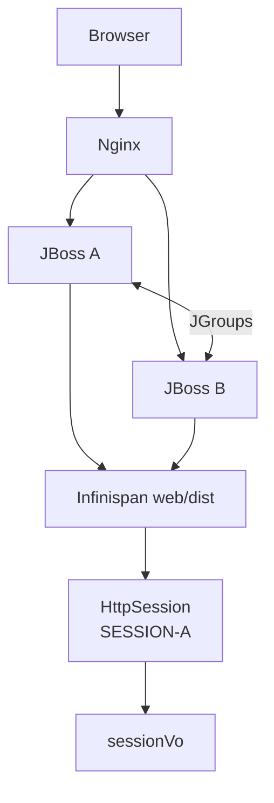
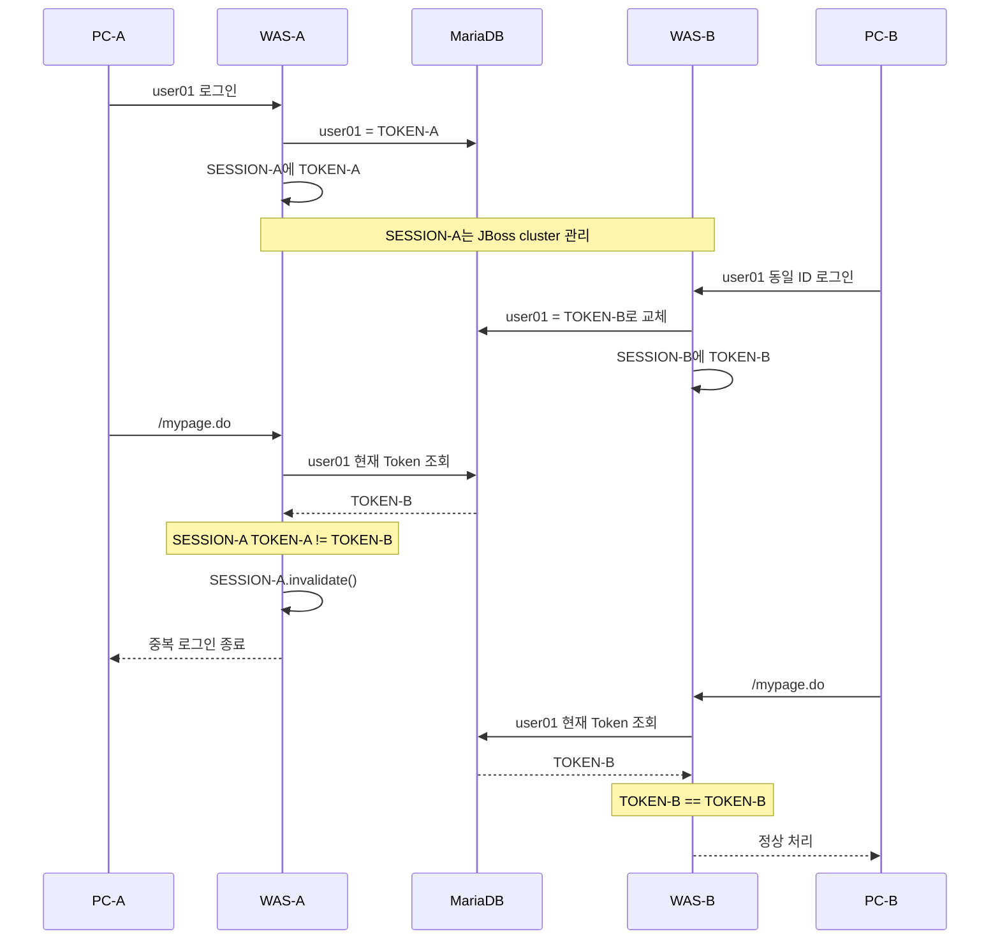
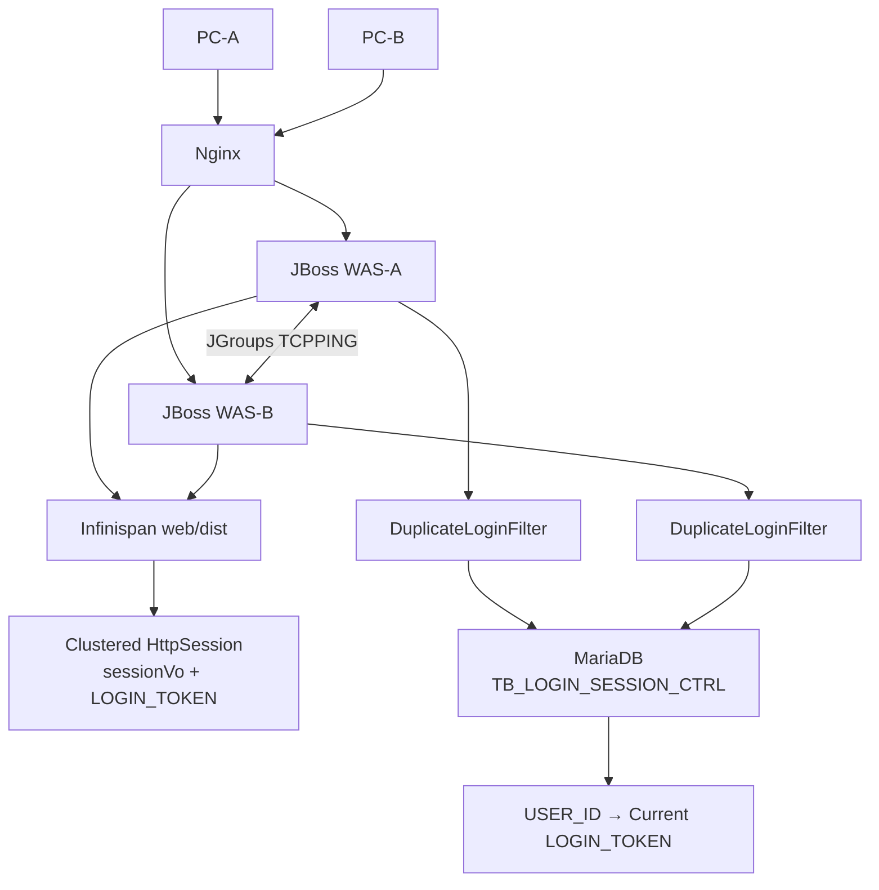

## 1. 결론

현재까지 확인된 구성은 다음과 같습니다.

```text
Spring Framework 5.3
Spring Security 미사용
JBoss EAP 7 계열 WAS A/B
standalone-ha.xml
JGroups TCPPING
Infinispan web/dist
web.xml <distributable/>
HttpSession.setAttribute("sessionVo", sessionVo)
```

이 정도면 **JBoss의 HTTP Session 클러스터링은 이미 사용할 수 있도록 구성된 상태**라고 볼 수 있습니다. `<distributable/>`로 선언된 웹 애플리케이션의 세션은 JBoss의 `web` Infinispan cache를 통해 분산되며, 노드 장애 시 다른 노드가 세션을 이어받을 수 있습니다. ([레드햇 문서][1])
다만 **세션 클러스터링만으로 중복 로그인은 해결되지 않습니다.**

```text
user01
├─ SESSION-A : PC-A에서 로그인
└─ SESSION-B : PC-B에서 로그인
```

JBoss 입장에서는 `SESSION-A`, `SESSION-B` 모두 정상적인 서로 다른 `HttpSession`입니다. 클러스터링은 **sessionId 기준 세션 가용성**을 제공하지, `userId → 하나의 sessionId만 허용`이라는 인증 정책을 제공하지 않습니다.
따라서 Spring Security를 사용하지 않는 현재 시스템에서는 반드시 다음과 같은 **클러스터 전체가 공유하는 "현재 로그인 상태"가 하나 더 필요**합니다.

```text
user01 → 현재 유효한 LOGIN_TOKEN
```

현재 별도의 Redis/Login Repository가 없다면 실무적으로 가장 안정적인 방법은:

> **기존 공용 MariaDB에 사용자별 LOGIN_TOKEN 하나를 저장하고, 로그인 시 교체한 뒤 Servlet Filter에서 세션의 토큰과 DB 토큰을 비교하는 방식**
> 입니다.
> 이 방식의 가장 큰 장점은 **현재 `standalone-ha.xml`, JGroups, Infinispan web cache 설정을 변경할 필요가 없다는 것**입니다.

---

## 2. 세션 클러스터링과 중복 로그인 제어의 역할을 분리해야 함

현재 JBoss가 담당하는 영역은 다음입니다.



Red Hat 문서상 `web` cache-container는 웹 세션 클러스터링 용도이고, distributable web session의 기본 관리 역시 `web` Infinispan cache를 사용합니다. ([레드햇 문서][2])
하지만 이것만으로는:

```text
SESSION-A.sessionVo.userId = user01
SESSION-B.sessionVo.userId = user01
```

을 발견해서 SESSION-A를 자동 제거하지 않습니다.
따라서 다음 레이어를 추가합니다.

```text
┌──────────────────────────────────────┐
│        Login Validity Layer          │
│                                      │
│ MariaDB                              │
│ user01 → TOKEN-B                     │
└───────────────────┬──────────────────┘
                    │
        ┌───────────┴───────────┐
        ▼                       ▼
   SESSION-A                SESSION-B
   TOKEN-A                  TOKEN-B
      │                        │
      ▼                        ▼
 A != B → 무효             B == B → 정상
```

이 구조에서는 역할이 명확합니다.

| 구성요소                  | 역할                      |
| --------------------- | ----------------------- |
| JBoss `HttpSession`   | 사용자 로그인 상태/sessionVo 보관 |
| JGroups               | WAS A/B 클러스터 통신         |
| Infinispan `web/dist` | HttpSession 분산/Failover |
| MariaDB Login Control | 현재 유효한 로그인 1개 결정        |
| Spring/Servlet Filter | 모든 요청에서 현재 로그인 유효성 검증   |

---

## 3. 중요한 원리: 기존 HttpSession을 찾아 죽일 필요가 없음

많이 시도하는 방식이 다음입니다.

```java
Map<String, HttpSession> sessions;
```

그리고:

```java
HttpSession oldSession = sessions.get(userId);
oldSession.invalidate();
```

하지만 다중 WAS에서는 이 설계를 사용하면 안 됩니다.

```text
WAS-A JVM
└─ Map
   └─ user01 → SESSION-A
WAS-B JVM
└─ Map
   └─ user01 → SESSION-B
```

`static`, Spring Singleton, `ConcurrentHashMap` 모두 JVM 로컬 객체이므로 클러스터 공유 데이터가 아닙니다.
또한 Servlet 표준 API에는:

```java
getSessionById("ABC")
```

처럼 **임의의 sessionId를 가지고 다른 세션 객체를 획득하는 표준 기능도 없습니다.**
따라서 더 안전한 개념은:

> **Session을 물리적으로 먼저 찾아 제거하는 것이 아니라 인증 권한을 논리적으로 무효화한다.**
> 입니다.

---

## 4. 동작 원리

### 최초 로그인

PC-A에서 `user01`이 로그인합니다.

```text
① 인증 성공
② UUID TOKEN-A 생성
③ DB
   user01 → TOKEN-A
④ HttpSession
   SESSION-A
   ├─ sessionVo=user01
   └─ LOGIN_TOKEN=TOKEN-A
```

DB:

```text
USER_ID     LOGIN_TOKEN
--------------------------
user01      TOKEN-A
```

---

## 5. 동일 ID로 PC-B 로그인

PC-B가 `user01`로 다시 로그인합니다.

```text
① 인증 성공
② TOKEN-B 생성
③ DB의 user01 TOKEN을 TOKEN-B로 교체
④ SESSION-B에 TOKEN-B 저장
```

DB:

```text
USER_ID     LOGIN_TOKEN
--------------------------
user01      TOKEN-B
```

이제:

```text
SESSION-A
sessionVo.userId = user01
LOGIN_TOKEN      = TOKEN-A
SESSION-B
sessionVo.userId = user01
LOGIN_TOKEN      = TOKEN-B
DB
user01           = TOKEN-B
```

---

## 6. 기존 PC-A에서 다음 요청

예:

```http
GET /mypage.do
Cookie: JSESSIONID=SESSION-A
```

Filter에서:

```text
Session Token = TOKEN-A
DB Token      = TOKEN-B
```

따라서:

```text
TOKEN-A != TOKEN-B
```

즉:

> 다른 곳에서 같은 ID로 새로 로그인했다.
> 로 판단합니다.
> 이때:

```java
session.invalidate();
```

한 후 로그인을 종료합니다.
JBoss의 distributable session이므로 이 session invalidation 역시 해당 세션 관리 체계에서 처리됩니다. JBoss EAP는 distributable application의 세션 상태를 클러스터에서 공유하며 session mutation을 replication 대상으로 처리합니다. ([레드햇 문서][1])
-----------------------------------------------------------------------------------------------------------------------------------------------------------------------------------------------

## 7. 중요한 특성: "즉시 물리 삭제"와 "즉시 사용 불가"는 다름

PC-B 로그인 순간:

```text
SESSION-A
```

를 반드시 Infinispan에서 바로 찾아 물리적으로 삭제할 필요는 없습니다.
DB가:

```text
user01 → TOKEN-B
```

로 바뀌는 순간 SESSION-A는 **논리적으로 무효**입니다.
PC-A가 아무 요청도 하지 않으면 SESSION-A 자체는 일정 시간 존재할 수 있습니다.
그러나 다음 요청에서는:

```text
TOKEN-A != TOKEN-B
```

가 되어 업무 Controller까지 도달하지 못합니다.
따라서 보안 관점에서는:

```text
새 로그인 성공
      ↓
기존 로그인 권한 즉시 무효
      ↓
기존 Client 다음 Request
      ↓
Filter 차단
      ↓
session.invalidate()
```

가 됩니다.
이 방식이 직접 다른 WAS의 `HttpSession` 객체를 찾아다니는 방식보다 훨씬 안정적입니다.
--------------------------------------------------------

## 8. 권장 DB 테이블

예:

```sql
CREATE TABLE TB_LOGIN_SESSION_CTRL (
    USER_ID         VARCHAR(100) NOT NULL COMMENT '사용자 ID',
    LOGIN_TOKEN     VARCHAR(64)  NOT NULL COMMENT '현재 유효 로그인 토큰',
    SESSION_ID      VARCHAR(128) NULL     COMMENT '현재 로그인 Session ID',
    LOGIN_DT        DATETIME     NOT NULL COMMENT '로그인 일시',
    UPDT_DT         DATETIME     NOT NULL COMMENT '변경 일시',
    PRIMARY KEY (USER_ID)
) ENGINE=InnoDB
COMMENT='사용자 단일 로그인 제어';
```

핵심은:

```sql
PRIMARY KEY (USER_ID)
```

입니다.
그래야:

```text
user01 → TOKEN 하나
```

만 존재할 수 있습니다.
`SESSION_ID`는 진단/감사 용도로 저장하는 것이며 **중복 로그인 판정의 핵심 값은 `LOGIN_TOKEN`**으로 두는 것을 권장합니다.
----------------------------------------------------------------------------------

## 9. 왜 SESSION_ID만 비교하지 않고 TOKEN을 별도로 쓰는가

다음처럼 할 수도 있습니다.

```text
user01 → SESSION_ID
```

하지만 별도의 Login Token을 두는 편이 좋습니다.

| 구분              | SESSION_ID        | LOGIN_TOKEN |
| --------------- | ----------------- | ----------- |
| 생성 주체           | Servlet Container | Application |
| 세션 재발급 영향       | 받음                | 독립적         |
| 인증 버전 의미        | 불명확               | 명확          |
| 로그인 교체 판단       | 가능                | **더 명확**    |
| 테스트 용이성         | 보통                | 좋음          |
| 로그인 Token은 사실상: |                   |             |

```text
user01의 현재 Login Generation
```

을 나타냅니다.

```text
1번째 로그인 → token A
2번째 로그인 → token B
3번째 로그인 → token C
```

### 라고 이해하면 됩니다.

## 10. MyBatis Mapper

현재 시스템에서 MyBatis를 사용한다면 다음과 같이 구현할 수 있습니다.

#### Mapper interface

```java
public interface LoginSessionMapper {
    int upsertLoginSession(LoginSessionVO param);
    String selectLoginToken(String userId);
    int deleteLoginSession(LoginSessionVO param);
}
```

#### VO

```java
public class LoginSessionVO {
    private String userId;
    private String loginToken;
    private String sessionId;
    public String getUserId() {
        return userId;
    }
    public void setUserId(String userId) {
        this.userId = userId;
    }
    public String getLoginToken() {
        return loginToken;
    }
    public void setLoginToken(String loginToken) {
        this.loginToken = loginToken;
    }
    public String getSessionId() {
        return sessionId;
    }
    public void setSessionId(String sessionId) {
        this.sessionId = sessionId;
    }
}
```

---

## 11. 로그인 UPSERT SQL

MariaDB에서는 다음 방식이 실무적으로 편합니다.

```xml
<insert id="upsertLoginSession"
        parameterType="LoginSessionVO">
    INSERT INTO TB_LOGIN_SESSION_CTRL
    (
          USER_ID
        , LOGIN_TOKEN
        , SESSION_ID
        , LOGIN_DT
        , UPDT_DT
    )
    VALUES
    (
          #{userId}
        , #{loginToken}
        , #{sessionId}
        , NOW()
        , NOW()
    )
    ON DUPLICATE KEY UPDATE
          LOGIN_TOKEN = VALUES(LOGIN_TOKEN)
        , SESSION_ID  = VALUES(SESSION_ID)
        , LOGIN_DT    = NOW()
        , UPDT_DT     = NOW()
</insert>
```

이 구조에서 두 WAS에서 거의 동시에 로그인해도:

```text
WAS-A → TOKEN-A
WAS-B → TOKEN-B
```

DB의 `USER_ID` PK 때문에 최종적으로는:

```text
user01 → 마지막 UPDATE된 Token
```

하나만 남습니다.
즉 별도의 JVM `synchronized`는 의미가 없고 기본 설계에서는 필요하지 않습니다.
----------------------------------------------------

## 12. Token 조회

```xml
<select id="selectLoginToken"
        parameterType="string"
        resultType="string">
    SELECT LOGIN_TOKEN
      FROM TB_LOGIN_SESSION_CTRL
     WHERE USER_ID = #{userId}
</select>
```

### `USER_ID`가 PK이므로 단건 인덱스 조회가 됩니다.

## 13. 로그아웃 DELETE에서 매우 중요한 조건

잘못 구현하면 다음 문제가 발생합니다.

```sql
DELETE FROM TB_LOGIN_SESSION_CTRL
WHERE USER_ID = #{userId}
```

이렇게 하면 안 됩니다.
예:

```text
PC-A TOKEN-A
PC-B TOKEN-B ← 현재 정상 로그인
PC-A logout
```

PC-A가:

```sql
DELETE WHERE USER_ID='user01'
```

을 실행하면 **PC-B의 정상 로그인 TOKEN-B까지 삭제**하게 됩니다.
따라서 반드시:

```xml
<delete id="deleteLoginSession"
        parameterType="LoginSessionVO">
    DELETE
      FROM TB_LOGIN_SESSION_CTRL
     WHERE USER_ID = #{userId}
       AND LOGIN_TOKEN = #{loginToken}
</delete>
```

로 해야 합니다.
이 조건은 실무 구현에서 매우 중요합니다.
-----------------------

## 14. LoginSessionService

```java
@Service
public class LoginSessionService {
    private final LoginSessionMapper loginSessionMapper;
    public LoginSessionService(LoginSessionMapper loginSessionMapper) {
        this.loginSessionMapper = loginSessionMapper;
    }
    @Transactional
    public String registerLogin(String userId, String sessionId) {
        String loginToken = UUID.randomUUID().toString();
        LoginSessionVO param = new LoginSessionVO();
        param.setUserId(userId);
        param.setLoginToken(loginToken);
        param.setSessionId(sessionId);
        loginSessionMapper.upsertLoginSession(param);
        return loginToken;
    }
    @Transactional(readOnly = true)
    public boolean isValidLogin(
            String userId,
            String loginToken) {
        if (userId == null || loginToken == null) {
            return false;
        }
        String currentToken =
                loginSessionMapper.selectLoginToken(userId);
        return loginToken.equals(currentToken);
    }
    @Transactional
    public void logout(
            String userId,
            String loginToken) {
        LoginSessionVO param = new LoginSessionVO();
        param.setUserId(userId);
        param.setLoginToken(loginToken);
        /*
         * 현재 자신의 Token과 일치할 때만 삭제.
         * 다른 PC의 신규 Login 상태를 삭제하지 않는다.
         */
        loginSessionMapper.deleteLoginSession(param);
    }
}
```

---

## 15. 로그인 성공 처리

기존 코드가:

```java
SessionVO sessionVo = loginService.login(loginVO);
HttpSession session = request.getSession();
session.setAttribute("sessionVo", sessionVo);
```

였다면 다음 정도로 변경합니다.

```java
@PostMapping("/loginProc.do")
public String login(
        LoginVO loginVO,
        HttpServletRequest request) {
    /*
     * 1. ID/PW 인증
     */
    SessionVO sessionVo = loginService.login(loginVO);
    if (sessionVo == null) {
        return "redirect:/login.do?error=auth";
    }
    /*
     * 2. HttpSession 확보
     */
    HttpSession session = request.getSession(true);
    /*
     * 3. Session Fixation 대응
     *    기존 Session 내용을 유지하면서 ID만 변경
     */
    request.changeSessionId();
    session = request.getSession(false);
    /*
     * 4. 현재 로그인을 새로운 유효 Login으로 등록
     */
    String loginToken =
            loginSessionService.registerLogin(
                    sessionVo.getUserId(),
                    session.getId());
    /*
     * 5. 기존 로그인 정보 저장
     */
    session.setAttribute("sessionVo", sessionVo);
    /*
     * 6. 중복 로그인 검증 Token 저장
     */
    session.setAttribute("LOGIN_TOKEN", loginToken);
    return "redirect:/main.do";
}
```

`HttpServletRequest.changeSessionId()`는 Servlet 3.1부터 제공되는 API로, 현재 요청과 연결된 session ID를 변경하는 용도입니다. ([Oracle Docs][3])
기존 시스템에서 이미 별도의 Session Fixation 대응을 하고 있다면 이 부분은 중복 적용하지 않습니다.
---------------------------------------------------------------

## 16. Spring 5.3에서는 `OncePerRequestFilter` 권장

중복 로그인 검증은 Controller마다:

```java
if (...)
```

를 넣으면 안 됩니다.
공통 진입점에서 검사해야 합니다.
Spring MVC의 `HandlerInterceptor`도 사용할 수 있지만 Spring 공식 문서는 보안 계층은 URL 매핑 불일치 가능성 때문에 Interceptor보다 **Servlet Filter chain처럼 더 앞단에 적용되는 방법을 권장**합니다. ([Home][4])
현재 Spring 5.3이면:

```java
org.springframework.web.filter.OncePerRequestFilter
```

### 를 사용하는 것이 적합합니다. 이 Filter는 한 request dispatch에서 중복 실행되지 않도록 처리하는 Spring의 기반 Filter입니다. ([Home][5])

## 17. 실무용 Filter

```java
@Component("duplicateLoginFilter")
public class DuplicateLoginFilter extends OncePerRequestFilter {
    private static final String SESSION_USER_KEY = "sessionVo";
    private static final String LOGIN_TOKEN_KEY = "LOGIN_TOKEN";
    private final LoginSessionService loginSessionService;
    public DuplicateLoginFilter(
            LoginSessionService loginSessionService) {
        this.loginSessionService = loginSessionService;
    }
    @Override
    protected void doFilterInternal(
            HttpServletRequest request,
            HttpServletResponse response,
            FilterChain filterChain)
            throws ServletException, IOException {
        HttpSession session = request.getSession(false);
        /*
         * 로그인하지 않은 요청은 기존 인증 로직에 맡긴다.
         */
        if (session == null) {
            filterChain.doFilter(request, response);
            return;
        }
        SessionVO sessionVo =
                (SessionVO) session.getAttribute(
                        SESSION_USER_KEY);
        /*
         * 로그인 Session이 아니라면 기존 처리 유지
         */
        if (sessionVo == null) {
            filterChain.doFilter(request, response);
            return;
        }
        String loginToken =
                (String) session.getAttribute(
                        LOGIN_TOKEN_KEY);
        boolean valid =
                loginSessionService.isValidLogin(
                        sessionVo.getUserId(),
                        loginToken);
        /*
         * 현재 DB Token과 Session Token 불일치
         * = 다른 곳에서 신규 로그인 되었음
         */
        if (!valid) {
            invalidateQuietly(session);
            handleInvalidLogin(request, response);
            return;
        }
        filterChain.doFilter(request, response);
    }
    private void invalidateQuietly(HttpSession session) {
        try {
            session.invalidate();
        } catch (IllegalStateException ignored) {
            /*
             * 동시 요청에서 이미 invalidate 된 경우 무시
             */
        }
    }
    private void handleInvalidLogin(
            HttpServletRequest request,
            HttpServletResponse response)
            throws IOException {
        if (isAjaxRequest(request)) {
            response.setStatus(
                    HttpServletResponse.SC_UNAUTHORIZED);
            response.setContentType(
                    "application/json;charset=UTF-8");
            response.getWriter().write(
                    "{\"code\":\"DUPLICATE_LOGIN\","
                    + "\"message\":\"다른 환경에서 로그인되어 "
                    + "현재 로그인이 종료되었습니다.\"}");
            return;
        }
        response.sendRedirect(
                request.getContextPath()
                + "/login.do?reason=duplicate");
    }
    private boolean isAjaxRequest(
            HttpServletRequest request) {
        String requestedWith =
                request.getHeader("X-Requested-With");
        return "XMLHttpRequest".equalsIgnoreCase(
                requestedWith);
    }
}
```

핵심은 다음입니다.

```java
request.getSession(false);
```

### 새로운 세션을 만들어서는 안 되므로 `false`를 사용합니다.

## 18. Filter 등록

일반 Spring MVC + JBoss WAR 환경이라면 `DelegatingFilterProxy`를 사용하는 방식이 깔끔합니다.
`web.xml`:

```xml
<filter>
    <filter-name>duplicateLoginFilter</filter-name>
    <filter-class>
        org.springframework.web.filter.DelegatingFilterProxy
    </filter-class>
</filter>
<filter-mapping>
    <filter-name>duplicateLoginFilter</filter-name>
    <url-pattern>/*</url-pattern>
</filter-mapping>
```

Spring Bean 이름:

```java
@Component("duplicateLoginFilter")
public class DuplicateLoginFilter
        extends OncePerRequestFilter {
    ...
}
```

### 이렇게 하면 Filter 자체는 Servlet Filter Chain에서 실행되면서 내부 Service/Mapper는 Spring DI를 그대로 사용할 수 있습니다.

## 19. 반드시 Filter 제외 URL을 설계

`/*`를 전부 DB 조회하면 CSS, JS, 이미지까지 불필요한 검사가 발생할 수 있습니다.
`OncePerRequestFilter`의 `shouldNotFilter()`를 구현하는 것이 좋습니다.

```java
@Override
protected boolean shouldNotFilter(
        HttpServletRequest request) {
    String uri = request.getRequestURI();
    String contextPath = request.getContextPath();
    String path = uri.substring(contextPath.length());
    return path.equals("/login.do")
        || path.equals("/loginProc.do")
        || path.startsWith("/css/")
        || path.startsWith("/js/")
        || path.startsWith("/images/")
        || path.startsWith("/favicon")
        || path.startsWith("/health/");
}
```

### 실제 시스템의 public URL 정책에 맞게 White List를 관리해야 합니다.

## 20. 정상 Logout 구현

```java
@GetMapping("/logout.do")
public String logout(
        HttpServletRequest request) {
    HttpSession session =
            request.getSession(false);
    if (session == null) {
        return "redirect:/login.do";
    }
    SessionVO sessionVo =
            (SessionVO) session.getAttribute(
                    "sessionVo");
    String loginToken =
            (String) session.getAttribute(
                    "LOGIN_TOKEN");
    if (sessionVo != null
            && loginToken != null) {
        /*
         * userId + token 일치 시에만 DB 삭제
         */
        loginSessionService.logout(
                sessionVo.getUserId(),
                loginToken);
    }
    try {
        session.invalidate();
    } catch (IllegalStateException ignored) {
    }
    return "redirect:/login.do";
}
```

여기서 다시 중요한 것은:

```text
USER_ID + LOGIN_TOKEN
```

### 조건으로 삭제한다는 것입니다.

## 21. 실제 전체 Sequence



Nginx가 다음 요청을 다른 WAS로 보내도 원리는 동일합니다.

```text
PC-A
  ↓
이번 요청 WAS-B
  ↓
JBoss Cluster가 SESSION-A 인식
  ↓
TOKEN-A 조회
  ↓
DB TOKEN-B
  ↓
불일치 → 차단
```

### 따라서 이 설계는 **Sticky Session에 의존하지 않습니다.**

## 22. JBoss 설정 변경은 필요한가?

### 권장안에서는 필요 없음

현재 확인된 JBoss 설정:

```text
standalone-ha.xml
JGroups
TCPPING
Infinispan web/dist
web.xml <distributable/>
```

을 그대로 유지합니다.

| 설정                                   |              변경 | 이유                           |
| ------------------------------------ | --------------: | ---------------------------- |
| `standalone-ha.xml`                  |          **없음** | 기존 Session clustering 그대로 사용 |
| JGroups                              |              없음 | A/B 통신 기존 사용                 |
| TCPPING                              |              없음 | 기존 A/B discovery 그대로         |
| `web` cache-container                |          **없음** | 로그인 Registry 용도로 손대지 않음      |
| `dist` cache                         |              없음 | 기존 HttpSession용              |
| `owners`                             |              없음 | 중복 로그인 때문에 변경할 이유 없음         |
| Nginx                                |              없음 | Token 방식은 Sticky와 무관         |
| `<distributable/>`                   |              유지 | Session failover 사용          |
| Application `web.xml`                | Filter 등록 추가 가능 | WAR 변경                       |
| MariaDB                              |       테이블 1개 추가 | 현재 Login Token 공유            |
| 즉 **WAS 인프라 설정 변경에 따른 위험은 거의 없습니다.** |                 |                              |

---

## 23. 왜 기존 `web/dist` Infinispan에 LOGIN_TOKEN Map을 직접 넣지 않는가

예를 들어 이런 생각을 할 수 있습니다.

```text
web cache
├─ HttpSession
└─ user01 → TOKEN-A
```

하지만 권장하지 않습니다.
`web` cache-container는 **JBoss Web Session clustering subsystem이 사용하는 목적성 캐시**입니다. Red Hat 문서도 `web` cache-container를 웹 세션 클러스터링 용도로 정의합니다. ([레드햇 문서][6])
따라서 애플리케이션의 별도 로그인 Registry 데이터를 기존 `web/dist` 내부에 임의로 섞기보다는:

```text
web/dist
→ JBoss에 맡김
Login Registry
→ DB 또는 별도 application cache
```

### 로 분리하는 것이 안전합니다.

## 24. JBoss Infinispan을 Login Registry로 사용하는 대안도 가능

DB 부하가 문제라면 두 번째 대안은 있습니다.
JBoss EAP 7.4에서는 애플리케이션이 **별도의 Infinispan cache/container를 만들어 사용하는 것이 공식 지원**되며 JNDI를 통해 cache를 application에 주입할 수 있습니다. ([레드햇 문서][6])
예:

```text
Infinispan
├─ web
│   └─ dist            ← JBoss HttpSession 전용
│
└─ login-control       ← 신규
    └─ tokens
        ├─ user01 → TOKEN-B
        ├─ user02 → TOKEN-X
        └─ ...
```

Application에서는 공식 JNDI 형식으로:

```java
@Resource(
    lookup = "java:jboss/infinispan/cache/login-control/tokens"
)
private Cache<String, String> loginCache;
```

처럼 사용할 수 있습니다. Red Hat 문서에서도 `java:jboss/infinispan/cache/{container}/{cache}` 형태의 resource injection을 지원합니다. ([레드햇 문서][2])
그러나 이 방식은:

```text
standalone-ha.xml 변경
+
A/B 동일 설정 적용
+
JBoss Infinispan API 의존
+
reload/restart 검증
+
Split brain / cache consistency 검토
```

가 필요합니다.
JBoss EAP 7.1 이후 cache-container transport 변경은 batch 또는 service restart가 필요한 경우가 있으며 Red Hat도 관련 설정 변경 시 서비스가 일시적으로 중단될 수 있음을 명시합니다. ([레드햇 문서][7])
따라서 **중복 로그인 하나 때문에 현재 안정적으로 운영 중인 JBoss cluster 설정을 변경하는 것은 1차 선택으로 권하지 않습니다.**
--------------------------------------------------------------------------------

## 25. 두 방법 비교

| 항목                     | MariaDB Login Token | JBoss 별도 Infinispan Cache |
| ---------------------- | ------------------: | ------------------------: |
| `standalone-ha.xml` 변경 |              **없음** |                        필요 |
| WAS restart/reload     |              **없음** |                    가능성 있음 |
| 현재 DB 이용               |                   O |                         X |
| 추가 서버 필요               |                   X |                         X |
| A/B 공유                 |                   O |                         O |
| 장애 시 일관성               |              **높음** |             Cluster 상태 의존 |
| JBoss 종속성              |                  낮음 |                    **높음** |
| 매 요청 부하                |           DB SELECT |         메모리/cluster cache |
| 구현 난이도                 |              **낮음** |                        중간 |
| 운영 영향                  |              **낮음** |                        중간 |
| 향후 WAS 교체              |                  용이 |                    재검토 필요 |
| 현재 환경 추천               |             **1순위** |                       2순위 |

#### 권장

현재 단계에서는:

> **JBoss Session Cluster는 그대로 유지 + MariaDB Login Token Registry 추가**
> 를 권장합니다.

---

## 26. DB 조회 부하는 반드시 고려

권장 방식의 가장 큰 단점은:

```text
로그인된 Request
       ↓
SELECT LOGIN_TOKEN
       ↓
Controller
```

가 발생한다는 점입니다.
예:

```text
1 사용자 화면 요청
├─ /mypage.do
├─ /cartCount.do
├─ /noticeCount.do
└─ /recommend.do
```

가 모두 인증 URL이면 SELECT가 4번 발생할 수 있습니다.
다만 쿼리는:

```sql
SELECT LOGIN_TOKEN
FROM TB_LOGIN_SESSION_CTRL
WHERE USER_ID = ?
```

이고 `USER_ID`가 PK이므로 DB 실행 자체는 매우 단순합니다.
그래도 TPS가 높은 커머스에서는 전체 요청량을 기준으로 반드시 부하 테스트해야 합니다.

#### 최적화 우선순위

```text
1. CSS/JS/Image 등 Filter 제외
2. 비회원 URL 제외
3. 실제 로그인 보호 URL만 Token 검사
4. DB Connection Pool/TPS 확인
5. 그래도 부하가 높다면 별도 Infinispan login cache 검토
```

---

## 27. "5초마다만 확인" 같은 Local Cache는 신중

DB 부하를 줄이려고:

```text
5초 이내 확인했으면 DB 조회 생략
```

하도록 만들 수도 있습니다.
하지만 그러면:

```text
새 로그인
   ↓
기존 사용자가 최대 5초간 계속 정상 사용
```

할 수 있습니다.
즉:

| 검증 방식                                               | 기존 로그인 종료 정확도 |
| --------------------------------------------------- | ------------- |
| 매 보호 Request DB 확인                                  | **다음 요청 즉시**  |
| 5초 Cache                                            | 최대 5초 지연      |
| 30초 Cache                                           | 최대 30초 지연     |
| 단일 로그인 정책이 보안 요구사항이면 **매 보호 Request 검증**을 우선 권장합니다. |               |

---

## 28. `sessionVo`도 다시 확인

JBoss는 distributable session의 attribute를 다른 노드에서 사용할 수 있도록 marshalling/replication합니다. Red Hat은 distributable web application에서 session attribute marshalling을 별도로 규정하고 있고 session mutation도 replication trigger가 됩니다. ([레드햇 문서][1])
따라서 기존:

```java
session.setAttribute("sessionVo", sessionVo);
```

에 사용하는 VO는:

```java
public class SessionVO implements Serializable {
    private static final long serialVersionUID = 1L;
    ...
}
```

인지 반드시 확인하는 것을 권장합니다.
새로 추가하는:

```java
String loginToken
```

### 은 이 측면에서 부담이 거의 없습니다.

## 29. 서버 영향 관점에서 가장 중요한 점

이번 구현에서 **하지 말아야 할 변경**도 명확합니다.

```text
❌ web cache-container 이름 변경
❌ dist cache 이름 변경
❌ owners 임의 변경
❌ session clustering 방식을 replicated로 변경
❌ JGroups stack 변경
❌ TCPPING 변경
❌ 중복 로그인 때문에 Sticky Session 추가
❌ static ConcurrentHashMap<HttpSession> 도입
```

Red Hat도 Infinispan cache/container의 이름은 다른 구성요소가 참조할 수 있으므로 변경을 피하도록 명시합니다. ([레드햇 문서][6])
현재 **세션 클러스터링은 이미 동작 가능한 인프라**이므로 중복 로그인이라는 별도의 업무 정책 때문에 그 하부 구성을 건드리지 않는 것이 좋습니다.
-----------------------------------------------------------------------------------

## 30. 실제 적용 순서

```text
[1] 현재 Session Cluster 검증
       ↓
A 로그인 → A 중지 → B에서 sessionVo 유지 확인
       ↓
[2] TB_LOGIN_SESSION_CTRL 생성
       ↓
[3] LoginSessionMapper 구현
       ↓
[4] LoginSessionService 구현
       ↓
[5] 로그인 성공 시 UUID Token 생성/UPSERT
       ↓
[6] HttpSession에 LOGIN_TOKEN 저장
       ↓
[7] OncePerRequestFilter 적용
       ↓
[8] Token mismatch → session.invalidate()
       ↓
[9] logout은 userId + token 조건 DELETE
       ↓
[10] WAS-A/B 교차 로그인 테스트
       ↓
[11] 동시 로그인 테스트
       ↓
[12] DB TPS / Connection Pool 모니터링
```

---

## 31. 반드시 수행할 테스트 시나리오

|                                               번호 | 테스트                    | 기대 결과                  |
| -----------------------------------------------: | ---------------------- | ---------------------- |
|                                                1 | PC-A user01 로그인        | 정상                     |
|                                                2 | PC-A 여러 요청             | 정상                     |
|                                                3 | PC-B user01 로그인        | 정상                     |
|                                                4 | PC-A 요청                | **중복 로그인 종료**          |
|                                                5 | PC-B 요청                | 정상                     |
|                                                6 | PC-A logout 호출         | PC-B 로그인 유지            |
|                                                7 | PC-B logout            | 정상 로그아웃                |
|                                                8 | A 로그인 후 A WAS shutdown | B에서 Session 유지         |
|                                                9 | A/B 거의 동시 로그인          | 최종 Token 보유 로그인만 유효    |
|                                               10 | WAS-A/B 교차 요청          | 동일 결과                  |
|                                               11 | AJAX 호출 중 기존 로그인 만료    | 401/DUPLICATE_LOGIN 처리 |
|                                               12 | DB 장애                  | 로그인/검증 Fail-safe 정책 확인 |
|                                특히 **6번**이 중요합니다. |                        |                        |
| 예전 세션의 logout이 신규 로그인 상태를 삭제하지 않는지 반드시 검증해야 합니다. |                        |                        |

---

## 32. DB 장애 시 정책도 결정해야 함

Filter에서 DB를 조회하는 구조이므로 DB 오류가 날 수 있습니다.

```java
try {
    valid = loginSessionService.isValidLogin(...);
} catch (DataAccessException e) {
    ...
}
```

커머스 인증 영역에서는 일반적으로:

```text
DB 조회 실패
    ↓
"검증할 수 없으니 정상으로 간주"
```

하는 **Fail Open**보다,

```text
DB 조회 실패
    ↓
인증 상태 확인 불가
    ↓
요청 차단 / 장애 페이지
```

인 **Fail Closed** 정책이 보안적으로 더 안전합니다.
다만 로그인 DB가 기존 업무 DB와 동일하다면 DB 장애 시 다른 업무도 대부분 불가능할 가능성이 높으므로 실제 시스템의 장애 정책에 맞춰 결정하면 됩니다.
----------------------------------------------------------------------------------------

#### 33. 최종 권장 아키텍처



전체 설계를 한 문장으로 정리하면:

> **JBoss Infinispan은 “세션을 어느 WAS에서도 사용할 수 있게 하는 것”을 담당하고, MariaDB Login Token은 “그 사용자에게 어느 로그인만 유효한지”를 담당하며, Spring `OncePerRequestFilter`가 두 정보를 비교해 기존 로그인을 차단한다.**
> 현재 시스템에는 이 방식이 가장 적합합니다. **`standalone-ha.xml`, JGroups, `web/dist`에는 변경을 가하지 않고 애플리케이션 코드 + Login Control 테이블만 추가**할 수 있어 운영 영향도도 가장 낮습니다. Spring MVC `HandlerInterceptor`보다 Servlet Filter chain을 인증 검증 지점으로 사용하는 것도 현재처럼 Spring Security가 없는 구조에서는 더 안전한 선택입니다. ([Home][4])
> 특히 **JBoss 세션 클러스터링이 존재한다고 해서 별도의 로그인 Registry가 불필요해지는 것은 아닙니다.** 현재의 `HttpSession`은 `sessionId` 기준으로 분산되는 것이고, 중복 로그인을 막으려면 반드시 `userId → 현재 유효 loginToken`이라는 별도의 전역 상태가 하나 필요합니다. 그 전역 상태를 현재 인프라에서는 MariaDB로 두는 것이 가장 변경 영향이 작습니다.
