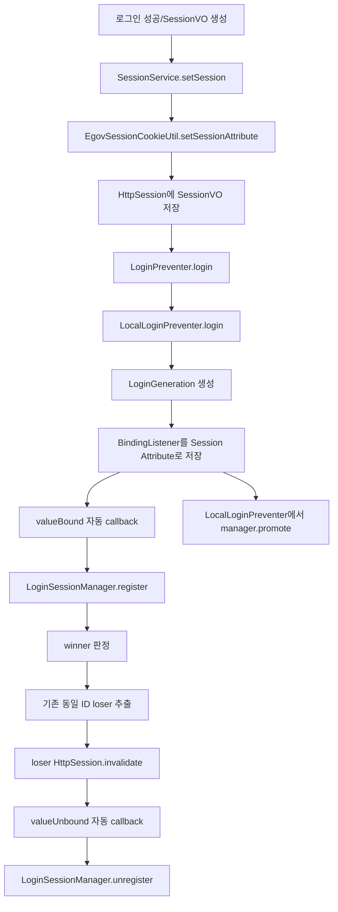
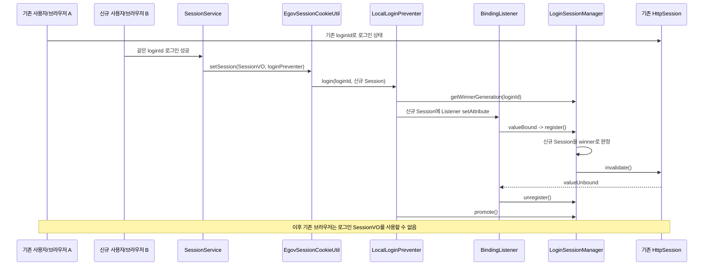

# JBoss 중복로그인 방지 구조 및 운영 가이드
> 기준: 첨부 압축파일 `중복로그인 검증.7z`에 포함된 실제 소스 14개 파일 분석
> 목적: 개발자 인수인계/구조 설명/장애 분석/로그 모니터링
> 원칙: 각 파일의 **첨부 원문 전체를 먼저 수록**하고 바로 아래에 해당 파일의 역할과 연결 관계를 설명한다.
### 1. 결론 요약
첨부 소스의 중복로그인 핵심 구현은 JBoss 전용 API나 DB/Redis를 사용하지 않고, `HttpSession + HttpSessionBindingListener + JVM Singleton LoginSessionManager + HashMap`으로 동작하는 구조다.
따라서 **동일 JVM/WAS 안에서는 동일 loginId의 이전 Session을 찾아 invalidate할 수 있지만, 다른 JVM/WAS에만 존재하는 Session을 직접 제거할 수 없다.** `web.xml`의 `<distributable/>` 또는 JBoss의 HTTP Session clustering과 `LoginSessionManager`의 로컬 Registry 공유는 별개의 문제다.
첨부본에는 과거 JBoss Cluster/CommandDispatcher 방식 검토 흔적으로 보이는 클래스와 설정이 남아 있으며, 현재 Local 실행 경로와 구분해서 이해해야 한다.
### 2. 소스 구성 및 현재 역할 분류
| 구성요소                                            | 판정            | 역할/상태                                                           |
| ----------------------------------------------- | ------------- | --------------------------------------------------------------- |
| `SessionService`                                | 활성            | 로그인 SessionVO 저장 진입점. `LoginPreventer`를 Setter Injection으로 주입   |
| `EgovSessionCookieUtil`                         | 활성            | 로그인 SessionVO를 HttpSession에 저장한 뒤 `loginPreventer.login()` 호출   |
| `LoginPreventer`                                | 활성            | 중복로그인 방지 추상화 인터페이스                                              |
| `LocalLoginPreventer`                           | 조건부 활성        | `loginPreventer` Bean이 이 구현체일 때 실제 로컬 중복로그인 처리                  |
| `CustomHttpSessionBindingListener`              | 활성            | Session Attribute로 저장되어 `valueBound/valueUnbound` 자동 호출         |
| `LoginSessionManager`                           | 활성            | JVM 로컬 Registry와 winner 관리, loser Session `invalidate()`        |
| `LoginGeneration`                               | 활성            | 로그인 순서 판정용 sequence + nonce                                     |
| `CustomHttpSessionIdListener`                   | 현재 비활성        | 첨부 `web.xml`에 Listener 등록이 없어 현재 그대로는 호출되지 않음                   |
| `CommandContext`                                | 잔존 코드         | CommandDispatcher 설계 흔적. 현재 Local 흐름에서는 호출되지 않음                 |
| `SessionCommand`                                | 잔존 코드         | CommandDispatcher 설계 흔적. 현재 Local 흐름에서는 호출되지 않음                 |
| `ClusterLoginControlException`                  | 잔존 코드         | 첨부 소스 내 사용처 없음                                                  |
| `jboss-deployment-structure.xml` clustering.api | 잔존 설정 가능성     | 첨부 Java 소스에는 `org.wildfly.clustering.api` import/호출 없음          |
| `web.xml <distributable/>`                      | 세션 클러스터 관련 설정 | HTTP Session 분산 가능 선언. `LoginSessionManager`의 HashMap을 공유하지는 않음 |

### 3. 현재 실제 동작 구조

### 4. 동일 WAS에서 중복로그인 발생 시 상세 시퀀스

### 5. WAS 2대 환경에서의 경계
```text
WAS-01 JVM                                  WAS-02 JVM
┌────────────────────────┐                  ┌────────────────────────┐
│ LoginSessionManager #1 │                  │ LoginSessionManager #2 │
│ HashMap #1             │                  │ HashMap #2             │
│ userA -> Session-A     │                  │ userA -> Session-B     │
└────────────────────────┘                  └────────────────────────┘
          X  JVM 메모리/HttpSession 객체를 직접 공유하지 않음  X
```
L4가 Round-Robin이든 IP Hash이든 핵심 제한은 동일하다. 신규 로그인 요청이 기존 Session이 등록된 JVM과 다른 JVM으로 들어가면 현재 `LocalLoginPreventer`만으로는 기존 JVM의 `HttpSession` 객체를 찾아 invalidate할 방법이 없다.
### 6. Registry 데이터 구조
| 구조                   | 예시                                     | 설명                      |
| -------------------- | -------------------------------------- | ----------------------- |
| `sessionsByLoginId`  | `userA -> {S1 -> SessionEntry}`        | 실제 로컬 HttpSession 보관    |
| `loginIdBySessionId` | `S1 -> userA`                          | Session ID로 loginId 역조회 |
| `winnerByLoginId`    | `userA -> WinnerState(S1, generation)` | 현재 최신 로그인 판정            |
| `SessionEntry`       | `HttpSession + LoginGeneration`        | Session과 생성 순서 결합       |
| `WinnerState`        | `sessionId + LoginGeneration`          | 유지할 최종 winner           |
### 7. 로그 모니터링 방법
JBoss EAP 기본 standalone 구성이라면 일반적으로 `$JBOSS_HOME/standalone/log/server.log`를 확인한다. 실제 운영 환경에서 logging subsystem 또는 별도 Log4j2 설정으로 경로를 변경했다면 해당 파일을 기준으로 한다.
#### 7.1 전체 중복로그인 로그 검색
```bash
grep -E "\[LoginPreventer\]|EgovSessionCookieUtil.setSessionAttribute loginPreventer.login" server.log
```
#### 7.2 특정 사용자 loginId 추적
```bash
grep "사용자LOGIN_ID" server.log | grep -E "LoginPreventer|EgovSessionCookieUtil"
```
#### 7.3 실시간 모니터링
```bash
tail -F server.log | grep --line-buffered -E "\[LoginPreventer\]|EgovSessionCookieUtil.setSessionAttribute loginPreventer.login"
```
#### 7.4 주요 로그 해석
| 로그 문자열                                         | 의미                                             | 확인 포인트                     |
| ---------------------------------------------- | ---------------------------------------------- | -------------------------- |
| `EgovSessionCookieUtil...loginPreventer.login` | 로그인 Session 저장 후 중복로그인 로직 진입                   | loginId, 신규 Session        |
| `LoginSessionManager register started`         | BindingListener의 valueBound를 통해 Registry 등록 시작 | loginId/session/generation |
| `step-winner sessionId`                        | 신규 등록 Session ID 확인                            | 신규 JSESSIONID              |
| `step-remove target ... delete true`           | 해당 Session을 loser로 판정                          | 기존 세션이 맞는지                 |
| `step-remove losers=[...]`                     | 실제 invalidate 대상 목록 확정                         | 1개 이상이면 중복로그인 제거 발생        |
| `unregister loginId=...`                       | invalidate/logout/timeout으로 Registry 정리        | 종료 대상 loginId/session      |
| `step-promote`                                 | winner generation 최종 반영                        | 신규 generation              |
#### 7.5 정상 최초 로그인 예상 흐름
```text
EgovSessionCookieUtil...loginPreventer.login
LoginSessionManager register started
LoginSessionManager step-winner
LoginSessionManager step-remove ... delete false
LoginSessionManager step-remove losers=[]
LoginSessionManager step-promote ...
LoginSessionManager step-promote losers=[]
```
#### 7.6 동일 WAS 중복로그인 예상 흐름
```text
신규 로그인 진입
  -> register started
  -> 기존 Session: delete true
  -> 신규 Session: delete false
  -> step-remove losers=[기존 Session]
  -> 기존 Session.invalidate()
  -> valueUnbound
  -> unregister
  -> promote
```
### 8. 운영 장애 판별 체크리스트
- [ ] `EgovSessionCookieUtil...loginPreventer.login` 로그가 존재하는가
- [ ] `LoginSessionManager register started`가 바로 이어지는가
- [ ] 같은 loginId의 두 로그인에서 `delete true`가 발생하는가
- [ ] `step-remove losers`에 기존 Session이 포함되는가
- [ ] 이후 `unregister`가 발생하는가
- [ ] 두 로그인이 서로 다른 WAS에서 처리된 것은 아닌가
- [ ] 실제 활성 Spring Profile과 `loginPreventer` 구현체가 무엇인지 확인했는가
- [ ] `CustomHttpSessionIdListener`가 필요한 환경인데 등록이 빠져 있지 않은가
- [ ] 중복로그인 오류가 Utility 내부에서 catch되어 상위로 숨겨지지 않았는가
### 9. 현재 소스 기준 주요 리스크/확인 사항
| 우선순위 | 항목                     | 현재 소스 기준 판단                                                             |
| ---- | ---------------------- | ----------------------------------------------------------------------- |
| 상    | WAS 간 중복로그인            | 지원하지 않음. JVM 로컬 Registry만 사용                                            |
| 상    | `dev/prd` Bean 설정      | 첨부본은 `JbossLoginPreventer`를 가리키지만 클래스가 첨부되지 않음. 실제 배포 Profile/클래스 확인 필요 |
| 중    | Session ID 변경 Listener | `web.xml` 등록 없음. `changeSessionId()` 사용 시 Registry 정합성 확인 필요            |
| 중    | 중복로그인 종료 사유 표시         | 현재 상태로는 불가. invalidate된 기존 Session에 종료 사유가 남지 않음                        |
| 중    | 오류 전파                  | Utility가 예외를 catch 후 false 반환, `SessionService`는 반환값 무시                 |
| 중    | `winnerByLoginId` 생명주기 | unregister 시 제거하지 않아 사용자 수 증가에 따라 Map 엔트리가 장기 누적 가능                     |
| 하    | Cluster 관련 잔존 코드/설정    | 실제 Local 경로와 혼동 가능. 문서/소스 정리 대상                                         |
| 하    | Logger category        | `EgovSessionCookieUtil`이 `DeviceUtil.class` Logger 사용                   |
### 10. 실제 활성 구조 확인용 운영 명령 예시
#### WAR에 포함된 LoginPreventer 구현 클래스 확인
```bash
jar tf application.war | grep 'bk/comm/login/.*LoginPreventer'
```
#### Spring Profile 확인 예시
```bash
ps -ef | grep java | grep 'spring.profiles.active'
```
환경변수/외부 Spring 설정을 사용하는 경우 해당 배포 스크립트와 JBoss System Property도 함께 확인한다.
### 11. 소스 원문 및 파일별 설명
> 아래 소스 블록은 첨부 압축파일에서 추출한 파일 내용을 수정하지 않고 수록하였다. 설명은 각 원문 바로 아래에 배치한다.

### 11.1. `context-common.xml`
````xml
<?xml version="1.0" encoding="UTF-8"?>
<beans xmlns="http://www.springframework.org/schema/beans" xmlns:xsi="http://www.w3.org/2001/XMLSchema-instance"
	xmlns:context="http://www.springframework.org/schema/context"
	xmlns:task="http://www.springframework.org/schema/task"
	xsi:schemaLocation="http://www.springframework.org/schema/beans http://www.springframework.org/schema/beans/spring-beans-4.0.xsd
        				http://www.springframework.org/schema/context http://www.springframework.org/schema/context/spring-context-4.0.xsd
        				http://www.springframework.org/schema/task		http://www.springframework.org/schema/task/spring-task-4.2.xsd ">

    <context:component-scan base-package="bk">
       <context:exclude-filter type="annotation" expression="org.springframework.stereotype.Controller" />
    </context:component-scan>
    
    <!--  이커머스 개발팀 추가 항목 :: 2023-08-18 신문섭 -->
	<!-- Tiles3 -->	
	<bean id="mcPreparer" class="bk.app.mc.McPreparer"></bean>
	<bean id="tilesConfigurer" class="org.springframework.web.servlet.view.tiles3.TilesConfigurer">
		<property name="definitionsFactoryClass"  value="bk.app.comm.factory.CustomLocaleDefinitionsFactory" />
		<property name="definitions">
	   		<list>
	    		<value>/WEB-INF/tiles/tiles-layout-web.xml</value>
	    		<value>/WEB-INF/tiles/tiles-layout-mobile.xml</value>
	   		</list>
	  	</property>
		<property name="preparerFactoryClass" value="org.springframework.web.servlet.view.tiles3.SpringBeanPreparerFactory"></property>
	</bean>
	
	<!-- Scheduler 캐시 데이터 갱신 관리 :: 2023-10-05 신문섭 -->
	<task:scheduler id="jobScheduler" pool-size="10"/>
	<task:annotation-driven scheduler="jobScheduler" />

	<!-- 메시지소스빈 설정 -->
    <bean id="egovMessageSource" class="bk.comm.util.EgovMessageSource">
        <property name="reloadableResourceBundleMessageSource">
            <ref bean="messageSource" />
        </property> 
    </bean>
    
    <!-- 프로퍼티 파일 위치 설정 -->
	<bean id="messageSource" class="org.springframework.context.support.ReloadableResourceBundleMessageSource">
		<property name="basenames">
			<list>
				<value>classpath:/egovframework/message/message-common</value>
				<value>classpath:/egovframework/message/ec/message-ec</value>
				<value>classpath:/egovframework/message/mm/message-mm</value>
				<value>classpath:/egovframework/message/ts/message-ts</value>
				<value>classpath:/egovframework/message/go/message-go</value>
				<value>classpath:/egovframework/message/mc/message-mc</value>
				<value>classpath:/org/egovframe/rte/fdl/idgnr/messages/idgnr</value>
				<value>classpath:/org/egovframe/rte/fdl/property/messages/properties</value>
			</list>
		</property>
		<property name="cacheSeconds">
			<value>60</value>
		</property>
	</bean>
	
	<!-- Exception 발생시 후처리용 별도작업을 위해 실행환경의 LeveaTrace를 활용하도록 설정 -->
	<bean id="leaveaTrace" class="org.egovframe.rte.fdl.cmmn.trace.LeaveaTrace">
		<property name="traceHandlerServices">
			<list>
				<ref bean="traceHandlerService" />
			</list>
		</property>
	</bean>

    <!-- Exception 발생시 후처리용 별도작업을 위해 실행환경의 DefaultTrace Handle Manager 를 활용하도록 설정 -->
	<bean id="traceHandlerService" class="org.egovframe.rte.fdl.cmmn.trace.manager.DefaultTraceHandleManager">
		<property name="reqExpMatcher">
			<ref bean="antPathMater" />
		</property>
		<property name="patterns">
			<list>
				<value>*</value>
			</list>
		</property>
		<property name="handlers">
			<list>
				<ref bean="defaultTraceHandler" />
			</list>
		</property>
	</bean>
	
	<!-- Exception 발생시 후처리용 별도작업을 위해 실행환경의  AntPathMatcher 를 활용하도록 설정 -->
	<bean id="antPathMater" class="org.springframework.util.AntPathMatcher" />
	<!-- Exception 발생시 후처리용 별도작업을 위해 실행환경의  DefaultTraceHandler 를 활용하도록 설정 org.egovframe.rte.fdl.cmmn.trace.handler.DefaultTraceHandler -->
	<bean id="defaultTraceHandler" class="org.egovframe.rte.fdl.cmmn.trace.handler.DefaultTraceHandler" />
	 
	<bean id="multipartResolver" class="org.springframework.web.multipart.commons.CommonsMultipartResolver">
		<property name="maxUploadSize" value="100000000" />
		<property name="maxInMemorySize" value="100000000" />
	</bean>

	<beans profile="local">
		<bean id="loginPreventer" class="bk.comm.login.LocalLoginPreventer"/>
	</beans>
	<beans profile="dev">
		<bean id="loginPreventer" class="bk.comm.login.JbossLoginPreventer"/>
	</beans>
		<beans profile="prd">
		<bean id="loginPreventer" class="bk.comm.login.JbossLoginPreventer"/>
	</beans>

</beans>
````
### 파일 기능
Spring Root ApplicationContext의 공통 Bean 설정 파일이다. 중복로그인 기능과 직접 연결되는 부분은 하단의 `loginPreventer` Bean 정의다.
### 중복로그인 관련 연결
| Profile | 첨부 소스의 Bean 정의                      | 의미                  |
| ------- | ----------------------------------- | ------------------- |
| `local` | `bk.comm.login.LocalLoginPreventer` | JVM 내부 중복로그인 방지     |
| `dev`   | `bk.comm.login.JbossLoginPreventer` | 첨부본에는 해당 클래스 원문이 없음 |
| `prd`   | `bk.comm.login.JbossLoginPreventer` | 첨부본에는 해당 클래스 원문이 없음 |
`SessionService.setLoginPreventer()`의 `@Autowired`가 이 이름이 아니라 **타입(`LoginPreventer`) 기준**으로 구현체를 주입받는다.
### 확인이 필요한 중요 사항
첨부된 전체 소스에는 `JbossLoginPreventer.java`가 존재하지 않는다. 따라서 첨부본만 기준으로는 `dev/prd` Profile 활성 시 이 Bean을 생성할 수 있는 근거가 없다.
현재 JBoss 서버가 실제로 `LocalLoginPreventer`를 사용 중이라면 다음 중 하나가 별도 배포 설정에 존재해야 한다.
- JBoss에서도 `local` Profile을 활성화
- 실제 서버의 `context-common.xml`이 첨부본과 다름
- 다른 classpath/JAR/WAR 위치에 `JbossLoginPreventer`가 존재
이 부분은 운영 설명 자료에서 **현재 실제 활성 Profile을 반드시 확인해야 하는 항목**으로 관리하는 것이 안전하다.

### 11.2. `EgovSessionCookieUtil.java`
````java
package bk.comm.util;

import java.io.UnsupportedEncodingException;
import java.net.URLDecoder;
import java.net.URLEncoder;
import java.util.Enumeration;

import javax.servlet.http.Cookie;
import javax.servlet.http.HttpServletRequest;
import javax.servlet.http.HttpServletResponse;
import javax.servlet.http.HttpSession;

import org.apache.commons.lang3.StringUtils;
import org.apache.logging.log4j.LogManager;
import org.apache.logging.log4j.Logger;
import org.springframework.web.context.request.RequestContextHolder;
import org.springframework.web.context.request.ServletRequestAttributes;

import bk.app.comm.constants.CommonConstants;
import bk.comm.exception.util.EcException;
import bk.comm.login.LoginPreventer;
import bk.comm.vo.SessionVO;


/**
 * 세션, 쿠키 처리 유틸리티
 *
 * @author 박주한
 * @since 2023. 9. 8.
 * @version 0.1
 * @see
 *
 * <pre>
 * << 개정이력(Modification Information) >>
 *
 * 수정일         수정자                 수정내용
 * ----------  ------------- --------------------
 * 2023. 9. 8.     박주한        최초 생성
 * </pre>
 */
public class EgovSessionCookieUtil {

	private final static Logger LOG = LogManager.getLogger(DeviceUtil.class); 
	
	/**
	 * HttpSession에 주어진 키 값으로 세션 정보를 생성하는 기능 (String)
	 *
	 * @param keyStr - 세션 키
	 * @param valStr - 세션 값
	 * @return void
	 * @exception
	 *
	 * <pre>
	 * << 개정이력(Modification Information) >>
	 *
	 * 수정일         수정자                 수정내용
	 * ----------  ------------- --------------------
	 * 2023. 9. 8.     박주한       최초 생성
	 * </pre>
	 */
	public static void setSessionAttribute(HttpServletRequest request, String keyStr, String valStr) throws Exception {

		HttpSession session = request.getSession();
		session.setAttribute(keyStr, valStr);
	}
	
	/**
	 * HttpSession에 주어진 키 값으로 세션 객체를 생성하는 기능 (Object)
	 *
	 * @param keyStr - 세션 키
	 * @param valStr - 세션 값
	 * @return void
	 * @exception
	 *
	 * <pre>
	 * << 개정이력(Modification Information) >>
	 *
	 * 수정일         수정자                 수정내용
	 * ----------  ------------- --------------------
	 * 2023. 9. 8.     박주한       최초 생성
	 * </pre>
	 */
	public static void setSessionAttribute(HttpServletRequest request, String keyStr, Object obj) throws Exception {

		HttpSession session = request.getSession();
		session.setAttribute(keyStr, obj);
	}
	
		/**
	 * 
	 * HttpSession에 주어진 키 값으로 세션 객체를 생성하는 기능 (Object) :: Key / Value 사용
	 *
	 * @param 
	 * @return boolean
	 * @exception
	 *
	 * <pre>
	 * << 개정이력(Modification Information) >>
	 *
	 * 수정일         수정자                 수정내용
	 * ----------  ------------- --------------------
	 * 2023. 9. 26.     신문섭       최초 생성
	 * </pre>
	 */
	public static boolean setSessionAttribute(String keyStr, Object obj) {
		return setSessionAttribute(keyStr, obj, null);
	}

	/**
	 * 
	 * HttpSession에 주어진 키 값으로 세션 객체를 생성하는 기능 (Object) :: Key / Value 사용
	 *
	 * @param 
	 * @return boolean
	 * @exception
	 *
	 * <pre>
	 * << 개정이력(Modification Information) >>
	 *
	 * 수정일         수정자                 수정내용
	 * ----------  ------------- --------------------
	 * 2023. 9. 26.     신문섭       최초 생성
	 * </pre>
	 */
	public static boolean setSessionAttribute(String keyStr, Object obj, LoginPreventer loginPreventer) {
		HttpServletRequest request = ((ServletRequestAttributes) RequestContextHolder.getRequestAttributes()).getRequest();
		try {
			if (loginPreventer == null 
			|| (obj instanceof SessionVO && ((SessionVO)obj).getLoginId() == null)
			) {
				setSessionAttribute(request, keyStr, obj);

			} else {
				HttpSession session = request.getSession();
				session.setAttribute(keyStr, obj);
				if (CommonConstants.LOGIN_SESSION_ATTR_NM.equals(keyStr))  {
					LOG.info("[EgovSessionCookieUtil.setSessionAttribute loginPreventer.login : {} - {}]", ((SessionVO)obj).getLoginId(), session);
					loginPreventer.login(((SessionVO)obj).getLoginId(), session);
				}
			}
			return true;
		} catch (EcException e) {
			LOG.info("********[EgovSessionCookieUtil.setSessionAttribute  method error : {}]*********", e);
			return false;
		} catch (Exception e) {
			LOG.info("********[EgovSessionCookieUtil.setSessionAttribute  method error : {}]*********", e);
			return false;
		}
	}

	/**
	 * HttpSession에 존재하는 주어진 키 값에 해당하는 세션 값을 얻어오는 기능
	 *
	 * @param request
	 * @param keyStr - 세션 키
	 * @return Object
	 * @exception
	 *
	 * <pre>
	 * << 개정이력(Modification Information) >>
	 *
	 * 수정일         수정자                 수정내용
	 * ----------  ------------- --------------------
	 * 2023. 9. 8.     박주한       최초 생성
	 * </pre>
	 */
	public static Object getSessionAttribute(HttpServletRequest request, String keyStr) throws Exception {
		HttpSession session = request.getSession();
		return session.getAttribute(keyStr);
	}
	
	/**
	 * 
	 *HttpSession에 존재하는 주어진 키 값에 해당하는 세션 값을 얻어오는 기능 :: Key만 사용 
	 *
	 * @param 
	 * @return Object
	 * @exception
	 *
	 * <pre>
	 * << 개정이력(Modification Information) >>
	 *
	 * 수정일         수정자                 수정내용
	 * ----------  ------------- --------------------
	 * 2023. 9. 26.     신문섭       최초 생성
	 * </pre>
	 */
	public static Object getSessionAttribute(String keyStr) {
		HttpServletRequest request = ((ServletRequestAttributes) RequestContextHolder.getRequestAttributes()).getRequest();
		try {
			return getSessionAttribute(request, keyStr);
		} catch (EcException e) {
			LOG.info("********[EgovSessionCookieUtil.getSessionAttribute  method error]*********");
			return null;
		} catch (Exception e) {
			LOG.info("********[EgovSessionCookieUtil.getSessionAttribute  method error]*********");
			return null;
		}
	}

	/**
	 * HttpSession 객체내의 모든 값을 호출하는 기능
	 *
	 * @param request
	 * @return String
	 * @exception
	 *
	 * <pre>
	 * << 개정이력(Modification Information) >>
	 *
	 * 수정일         수정자                 수정내용
	 * ----------  ------------- --------------------
	 * 2023. 9. 8.     박주한       최초 생성
	 * </pre>
	 */
	public static String getSessionValuesString(HttpServletRequest request) throws Exception {
		HttpSession session = request.getSession();
		String returnVal = "";

		Enumeration<?> e = session.getAttributeNames();
		while (e.hasMoreElements()) {
			String sessionKey = (String)e.nextElement();
			returnVal = returnVal + "[" + sessionKey + " : " + session.getAttribute(sessionKey) + "]";
		}

		return returnVal;
	}

	/**
	 * HttpSession에 존재하는 세션을 주어진 키 값으로 삭제하는 기능
	 *
	 * @param request
	 * @param keyStr - 세션 키
	 * @return void
	 * @exception
	 *
	 * <pre>
	 * << 개정이력(Modification Information) >>
	 *
	 * 수정일         수정자                 수정내용
	 * ----------  ------------- --------------------
	 * 2023. 9. 8.     박주한       최초 생성
	 * </pre>
	 */
	public static void removeSessionAttribute(HttpServletRequest request, String keyStr) throws Exception {

		HttpSession session = request.getSession();
		session.removeAttribute(keyStr);
	}
	
	/**
	 * 쿠키생성 - 입력받은 분만큼 쿠키를 유지되도록 세팅한다.
	 * 쿠키의 유효시간을 5분으로 설정 =>(cookie.setMaxAge(60 * 5)
	 * 쿠키의 유효시간을 10일로 설정 =>(cookie.setMaxAge(60 * 60 * 24 * 10)
	 *
	 * @param response - Response
	 * @param cookieNm - 쿠키명
	 * @param cookieValue - 쿠키값
	 * @param minute - 지속시킬 시간(분)
	 * @return void
	 * @throws UnsupportedEncodingException 
	 * @exception
	 *
	 * <pre>
	 * << 개정이력(Modification Information) >>
	 *
	 * 수정일         수정자                 수정내용
	 * ----------  ------------- --------------------
	 * 2023. 9. 8.     박주한       최초 생성
	 * </pre>
	 */
	public static void setCookie(HttpServletResponse response, String cookieNm, String cookieVal, int minute) throws UnsupportedEncodingException {
		setCookie(response, cookieNm, cookieVal, minute, 1, null);	// 기본값 분으로 계산
	}
	public static void setCookie(HttpServletResponse response, String cookieNm, String cookieVal, int minute, int type) throws UnsupportedEncodingException {
		setCookie(response, cookieNm, cookieVal, minute, type, null);	// 타입으로 유지시간단위 계산
	}
	public static void setCookie(HttpServletResponse response, String cookieNm, String cookieVal, int minute, int type, String path)
		throws UnsupportedEncodingException {

		// 특정의 encode 방식을 사용해 캐릭터 라인을 application/x-www-form-urlencoded 형식으로 변환
		// 일반 문자열을 웹에서 통용되는 'x-www-form-urlencoded' 형식으로 변환하는 역할
		String cookieValue = URLEncoder.encode(cookieVal, "utf-8");

		// 쿠키생성 - 쿠키의 이름, 쿠키의 값
		Cookie cookie = new Cookie(cookieNm, cookieValue);

		cookie.setSecure(true);

		cookie.setHttpOnly(true);// Cookie without the HttpOnly flag 처리

		// 쿠키의 유효시간 설정
		int maxAge = 0;
		if(type == 1) {	// 분으로 계산
			maxAge = 60 * minute;
			if (maxAge > 60 * 60 * 3) {
				maxAge = 60 * 60 * 3;
			}
		}else if(type == 2) {	// 시간으로 계산
			maxAge = 60 * 60 * minute;
		}else if(type == 3) {	// 일(day)으로 계산
			maxAge = 60 * 60 * 24 * minute;
		}
		cookie.setMaxAge(maxAge);
		
		//패스
		if(StringUtils.isNotEmpty(path)) {
			cookie.setPath(path);
		}

		// response 내장 객체를 이용해 쿠키를 전송
		response.addCookie(cookie);
	}
	
	/**
	 * 쿠키생성 - 쿠키의 유효시간을 설정하지 않을 경우 쿠키의 생명주기는 브라우저가 종료될 때까지
	 *
	 * @param response - Response
	 * @param cookieNm - 쿠키명
	 * @param cookieValue - 쿠키값
	 * @return void
	 * @exception
	 *
	 * <pre>
	 * << 개정이력(Modification Information) >>
	 *
	 * 수정일         수정자                 수정내용
	 * ----------  ------------- --------------------
	 * 2023. 9. 8.     박주한       최초 생성
	 * </pre>
	 */
	public static void setCookie(HttpServletResponse response, String cookieNm, String cookieVal)
		throws UnsupportedEncodingException {

		// 특정의 encode 방식을 사용해 캐릭터 라인을 application/x-www-form-urlencoded 형식으로 변환
		// 일반 문자열을 웹에서 통용되는 'x-www-form-urlencoded' 형식으로 변환하는 역할
		String cookieValue = URLEncoder.encode(cookieVal, "utf-8");

		// 쿠키생성
		Cookie cookie = new Cookie(EgovWebUtil.removeCRLF(cookieNm), EgovWebUtil.removeCRLF(cookieValue));

		cookie.setSecure(true);

		cookie.setHttpOnly(true);// Cookie without the HttpOnly flag 처리

		// response 내장 객체를 이용해 쿠키를 전송
		response.addCookie(cookie);
	}

	/**
	 * 쿠키값 사용 - 쿠키값을 읽어들인다.
	 *
	 * @param request - Request
	 * @param name - 쿠키명
	 * @return String
	 * @exception
	 *
	 * <pre>
	 * << 개정이력(Modification Information) >>
	 *
	 * 수정일         수정자                 수정내용
	 * ----------  ------------- --------------------
	 * 2023. 9. 8.     박주한       최초 생성
	 * </pre>
	 */
	public static String getCookie(HttpServletRequest request, String cookieNm) throws Exception {

		// 한 도메인에서 여러 개의 쿠키를 사용할 수 있기 때문에 Cookie[] 배열이 반환
		// Cookie를 읽어서 Cookie 배열로 반환
		Cookie[] cookies = request.getCookies();

		if (cookies == null) {
			return "";
		}

		String cookieValue = null;

		// 입력받은 쿠키명으로 비교해서 쿠키값을 얻어낸다.
		for (int i = 0; i < cookies.length; i++) {

			if (cookieNm.equals(cookies[i].getName())) {

				// 특별한 encode 방식을 사용해 application/x-www-form-urlencoded 캐릭터 라인을 디코드
				// URLEncoder로 인코딩된 결과를 디코딩하는 클래스
				cookieValue = URLDecoder.decode(cookies[i].getValue(), "utf-8");

				break;
			}
		}

		return cookieValue;
	}
	
	/**
	 * 쿠키값 삭제 - cookie.setMaxAge(0) - 쿠키의 유효시간을 0으로 설정해 줌으로써 쿠키를 삭제하는 것과 동일한 효과
	 *
	 * @param request - Request
	 * @param name - 쿠키명
	 * @return void
	 * @exception
	 *
	 * <pre>
	 * << 개정이력(Modification Information) >>
	 *
	 * 수정일         수정자                 수정내용
	 * ----------  ------------- --------------------
	 * 2023. 9. 8.     박주한       최초 생성
	 * </pre>
	 */
	public static void setCookie(HttpServletResponse response, String cookieNm) throws UnsupportedEncodingException {

		// 쿠키생성 - 쿠키의 이름, 쿠키의 값
		Cookie cookie = new Cookie(EgovWebUtil.removeCRLF(cookieNm), null);

		cookie.setSecure(true);

		cookie.setHttpOnly(true);// Cookie without the HttpOnly flag 처리

		// 쿠키를 삭제하는 메소드가 따로 존재하지 않음
		// 쿠키의 유효시간을 0으로 설정해 줌으로써 쿠키를 삭제하는 것과 동일한 효과
		cookie.setMaxAge(0);

		// response 내장 객체를 이용해 쿠키를 전송
		response.addCookie(cookie);
	}
}
````
### 파일 기능
기존 Session/Cookie 공통 Utility에 중복로그인 진입 로직이 추가되어 있다. 핵심은 다음 Overload다.
```java
setSessionAttribute(String keyStr, Object obj, LoginPreventer loginPreventer)
```
### 중복로그인 관련 처리 순서
1. `RequestContextHolder`에서 현재 `HttpServletRequest`를 취득한다.
2. `loginPreventer == null`이거나 `SessionVO.loginId == null`이면 기존 방식으로 Session Attribute만 저장한다.
3. 그 외에는 `SessionVO`를 먼저 HttpSession에 저장한다.
4. Attribute명이 `CommonConstants.LOGIN_SESSION_ATTR_NM`이면 `loginPreventer.login(loginId, session)`을 호출한다.
5. 이후 실제 구현체가 `LocalLoginPreventer`라면 JVM 로컬 중복로그인 처리가 시작된다.
### 호출 핵심
```text
SessionService.setSession()
  -> EgovSessionCookieUtil.setSessionAttribute(..., loginPreventer)
     -> session.setAttribute(LOGIN_SESSION_ATTR_NM, SessionVO)
     -> loginPreventer.login(loginId, session)
```
### 모니터링 핵심 로그
```text
[EgovSessionCookieUtil.setSessionAttribute loginPreventer.login : {loginId} - {session}]
```
이 로그가 보이면 최소한 `SessionService → EgovSessionCookieUtil → LoginPreventer` 진입 직전까지 도달한 것이다.
### 운영상 주의점
- `LOG`가 `LogManager.getLogger(DeviceUtil.class)`로 생성되어 있어 Logger category는 클래스명과 다를 수 있다. 메시지 문자열의 `EgovSessionCookieUtil.setSessionAttribute`로 검색하는 것이 안전하다.
- `loginPreventer.login()`에서 RuntimeException이 발생해도 이 메소드가 `Exception`을 catch하고 `false`를 반환한다.
- `SessionService.setSession()`은 이 boolean 반환값을 사용하지 않는다. 따라서 중복로그인 제어 실패가 상위 로그인 처리에 명시적으로 전파되지 않을 수 있다.
- 예외 로그가 `INFO` 레벨이고 `{}` 인자에 Exception을 전달하므로 운영 장애 분석 시 stack trace가 충분히 남는지 실제 Log4j2 설정에서 확인이 필요하다.

### 11.3. `jboss-deployment-structure.xml`
````xml
<jboss-deployment-structure>
  <deployment>
    <!-- 중복 로그인 방지 관련 jboss lib참조 -->
    <dependencies>
        <module name="org.wildfly.clustering.api"/>
    </dependencies>
    
    <exclusions>
        <module name="org.apache.logging.log4j" />
        <module name="org.apache.commons.logging" />
		<module name="org.apache.log4j" />
		<module name="org.jboss.logging" />
		<module name="org.jboss.logging.jul-to-slf4j-stub" />
		<module name="org.slf4j" />
		<module name="org.slf4j.impl" />
					  
		<module name="com.fasterxml.jackson.core.jackson-annotations" />
        <module name="com.fasterxml.jackson.core.jackson-core" />
        <module name="com.fasterxml.jackson.core.jackson-databind" />
        <module name="com.fasterxml.jackson.datatype.jackson-datatype-jdk8" />
        <module name="com.fasterxml.jackson.datatype.jackson-datatype-jsr310" />
        <module name="com.fasterxml.jackson.jaxrs.jackson-jaxrs-json-provider" />       
        
        <module name="org.jboss.resteasy.resteasy-jackson2-provider" />
        
    </exclusions>
  </deployment>
</jboss-deployment-structure>
````
### 파일 기능
JBoss EAP Deployment ClassLoader에 사용할 모듈 의존성과 제외 모듈을 선언한다.
### 중복로그인 관련 부분
```xml
<module name="org.wildfly.clustering.api"/>
```
주석상 중복로그인 방지용 JBoss 라이브러리 참조로 되어 있으나, **첨부된 Java 소스 전체에서는 `org.wildfly.clustering.api`를 import하거나 호출하는 코드가 확인되지 않는다.**
따라서 현재 `LocalLoginPreventer + LoginSessionManager` 동작 자체에는 이 모듈이 필요하지 않다.
### 현재 구조에서의 의미
- 이 설정이 존재한다고 해서 `LoginSessionManager`의 `HashMap`이 Cluster 공유되는 것은 아니다.
- 이 설정은 단지 Deployment가 해당 JBoss Module의 클래스를 볼 수 있게 하는 ClassLoader 설정이다.
- 현재 실제 중복로그인 알고리즘은 Servlet `HttpSession` API와 Java Collection만 사용한다.
### 관리 포인트
과거 CommandDispatcher/JBoss Cluster 방식 검토 과정의 잔존 설정일 가능성이 있으므로, 제거 여부는 별도 배포 회귀 테스트 후 결정해야 한다.

### 11.4. `login/CommandContext.java`
````java
package bk.comm.login;

/**
 * CommandDispatcher를 통해 각 WAS에서 SessionCommand가 실행될 때
 * 해당 WAS의 LoginSessionManager에 접근할 수 있도록 전달하는 Context 객체.
 * SessionCommand는 이 Context를 통해 "현재 명령이 실행되고 있는 WAS"의 LoginSessionManager를 호출한다.
 *
 * 각 WAS가 자기 JVM 내부의 HttpSession만 직접 관리하도록 하는 역할이다.
 * 
 * @author Kim.WT
 * @since 2026. 8. 25.
 * @version 0.1
 * @see
 *
 * <pre>
 * << 개정이력(Modification Information) >>
 *
 * 수정일         수정자                 수정내용
 * ----------  ------------- --------------------
 * 2026. 8. 25.     Kim.WT       최초 생성
 * </pre>
 */
public final class CommandContext {

    /**
     * 현재 WAS JVM의 로그인 Session 관리 객체.
     *
     * LoginSessionManager는 WAS JVM당 하나의 Singleton 객체이며,
     * 동일 loginId에 대한 현재 Session 및 winner generation을 관리한다.
     */
    private final LoginSessionManager sessionManager;

    /**
     * CommandContext 생성자.
     *
     * JbossLoginPreventer 초기화 시 CommandDispatcher 생성 과정에서
     * 현재 WAS의 LoginSessionManager를 Context에 주입한다.
     *
     * @param sessionManager 현재 WAS JVM의 LoginSessionManager
     */
    public CommandContext(LoginSessionManager sessionManager) {
        this.sessionManager = sessionManager;
    }


    /**
     * 현재 WAS의 LoginSessionManager 반환.
     *
     * SessionCommand.execute()에서 이 메소드를 호출하여
     * QUERY 또는 PROMOTE 처리를 수행한다.
     *
     * @return 현재 WAS JVM의 LoginSessionManager
     */
    public LoginSessionManager getSessionManager() {
        return sessionManager;
    }
}
````
### 파일 기능
주석상 JBoss `CommandDispatcher`가 각 WAS에서 `SessionCommand`를 실행할 때 해당 JVM의 `LoginSessionManager`를 전달하기 위한 Context 객체다.
### 현재 적용 경로 판단
첨부 소스에서 `new CommandContext(...)` 호출이나 실제 Dispatcher 생성 코드가 존재하지 않는다. `LocalLoginPreventer`도 이 클래스를 참조하지 않는다.
따라서 **현재 Local/JVM 기반 중복로그인 동작에는 참여하지 않는 잔존 코드**로 분류할 수 있다.
### 다른 개발자가 혼동하지 않아야 할 점
이 파일의 주석에는 Cluster/WAS 간 명령 실행 구조가 설명되어 있지만, 첨부된 현재 실행 경로는 그 구조를 사용하지 않는다.

### 11.5. `login/CustomHttpSessionBindingListener.java`
````java
package bk.comm.login;

import java.io.Serializable;
import javax.servlet.http.HttpSessionActivationListener;
import javax.servlet.http.HttpSessionBindingEvent;
import javax.servlet.http.HttpSessionBindingListener;
import javax.servlet.http.HttpSessionEvent;

/**
 * Login Session의 생명주기를 감지하여
 * LoginSessionManager의 Local Registry를 관리하는 Listener.
 *
 * <p>
 * 이 Listener 자체를 Session Attribute로 저장한다.
 *
 * <pre>
 * session.setAttribute(
 *     "__CLUSTER_LOGIN_BINDING_LISTENER__",
 *     new CustomHttpSessionBindingListener(...)
 * );
 * </pre>
 *
 * 그러면 Servlet Container가 자동으로:
 *
 * valueBound()
 *
 * 를 호출한다.
 *
 * Session이 제거되면:
 *
 * valueUnbound()
 *
 * 가 자동 호출된다.
 *
 * Session Cluster failover/passivation을 위해
 * HttpSessionActivationListener도 구현한다.
 */
public final class CustomHttpSessionBindingListener implements HttpSessionBindingListener, Serializable {
    private static final long serialVersionUID = 1L;
    
    private final String loginId;
    private final LoginGeneration generation;

    public CustomHttpSessionBindingListener (String loginId, LoginGeneration generation) {
        this.loginId = loginId;
        this.generation = generation;
    }

    /**
     * Session에 Listener가 bind 될 때.
     */
    @Override
    public void valueBound(HttpSessionBindingEvent event) {
        LoginSessionManager
            .getInstance()
            .register(loginId, event.getSession(), generation);
    }

    /**
     * logout / timeout / invalidate.
     */
    @Override
    public void valueUnbound(HttpSessionBindingEvent event) {
        LoginSessionManager
            .getInstance()
            .unregister(loginId, event.getSession());
    }

    // /**
    //  * Session passivation.
    //  */
    // @Override
    // public void sessionWillPassivate(HttpSessionEvent event) {
    //     LoginSessionManager
    //         .getInstance()
    //         .unregister(loginId, event.getSession());
    // }

    // /**
    //  * Failover/passivation 후 Session activation.
    //  * 이전 generation Session이면 register 과정에서
    //  * 현재 winner와 비교되어 invalidate 된다.
    //  */
    // @Override
    // public void sessionDidActivate(HttpSessionEvent event) {
    //     LoginSessionManager
    //         .getInstance()
    //         .register(loginId, event.getSession(), generation);
    // }
}
````
### 파일 기능
중복로그인 Registry와 실제 `HttpSession` 생명주기를 연결하는 핵심 Listener다.
`HttpSessionBindingListener`는 web.xml에 Listener로 등록하는 방식이 아니라 **해당 객체 자체가 Session Attribute에 bind될 때** Servlet Container가 callback을 호출한다.
### 생성 및 연결
`LocalLoginPreventer.login()`에서 다음 코드로 Session에 저장된다.
```java
session.setAttribute(
    "__CLUSTER_LOGIN_BINDING_LISTENER__",
    new CustomHttpSessionBindingListener(loginId, generation)
);
```
### Callback
|이벤트|Servlet callback|처리|
|---|---|---|
|Listener 객체가 Session에 저장됨|`valueBound()`|`LoginSessionManager.register()`|
|Attribute 제거/교체, Session invalidate/종료 과정|`valueUnbound()`|`LoginSessionManager.unregister()`|
### 중요한 구현 사실
클래스 선언은 다음과 같다.
```java
implements HttpSessionBindingListener, Serializable
```
`HttpSessionActivationListener`는 import되어 있고 관련 메소드도 주석으로 남아 있지만 **실제로 implements 하지 않으며 메소드도 주석 처리**되어 있다.
따라서 Session passivation/activation/failover 시 Local Registry 재구축을 이 클래스가 현재 수행하지 않는다.
### 중복로그인에서의 역할
신규 로그인 Session에 Listener가 bind되는 순간 `register()`가 수행되고, 이 과정에서 동일 JVM의 기존 Session이 loser로 판단되면 실제 `invalidate()`된다.

### 11.6. `login/CustomHttpSessionIdListener.java`
````java
package bk.comm.login;

import javax.servlet.http.HttpSessionEvent;
import javax.servlet.http.HttpSessionIdListener;

/**
 * HttpSession ID가 변경되는 경우
 * LoginSessionManager 내부 Registry의 Session ID도
 * 동일하게 변경하기 위한 Listener.
 *
 * <p>
 * 로그인 성공 시 Session Fixation 방지를 위해
 *
 * <pre>
 * request.changeSessionId();
 * </pre>
 *
 * 가 호출될 수 있다.
 *
 * Registry가 ABC123을 계속 가지고 있으면
 * 이후 Session 관리가 정확하지 않으므로
 * 새 Session ID로 교체한다.
 *
 * 이 Listener는 HttpSessionBindingListener와 달리
 * web.xml에 등록해야 한다.
 */
public final class CustomHttpSessionIdListener implements HttpSessionIdListener {
    @Override
    public void sessionIdChanged(HttpSessionEvent event, String oldSessionId) {
        LoginSessionManager
            .getInstance()
            .sessionIdChanged(event.getSession(), oldSessionId);
    }
}
````
### 파일 기능
Servlet 3.1의 `changeSessionId()` 등으로 JSESSIONID가 변경될 때 `LoginSessionManager`의 Reverse Index를 새 Session ID로 변경하기 위한 Listener다.
### 현재 활성 여부
이 클래스에는 `@WebListener`가 없고 첨부 `web.xml`에도 다음 형태의 등록이 없다.
```xml
<listener>
    <listener-class>bk.comm.login.CustomHttpSessionIdListener</listener-class>
</listener>
```
따라서 **첨부본 그대로라면 Servlet Container가 이 Listener를 호출하지 않는다.**
### 영향
애플리케이션/Container에서 로그인 후 Session ID를 변경하는 경우:
- 실제 HttpSession의 ID는 변경될 수 있음
- `LoginSessionManager.loginIdBySessionId`에는 이전 ID가 남을 수 있음
- 이후 Registry 정합성이 깨질 가능성이 있음
Session ID 변경 기능을 사용하지 않는 환경이면 직접 영향은 없지만, 보안상 Session Fixation 방지를 위해 ID 회전이 적용되는지 확인해야 한다.

### 11.7. `login/exception/ClusterLoginControlException.java`
````java
package bk.comm.login.exception;

/**
 * Cluster 기반 중복 로그인 제어 과정에서 발생하는
 * 예외를 구분하기 위한 전용 RuntimeException.
 *
 * <p>
 * 일반 로그인 실패와 Cluster 장애를 구분하기 위해 사용한다.
 *
 * 대표 발생 원인:
 *
 * <pre>
 * CommandDispatcher 초기화 실패
 * JNDI Lookup 실패
 * Cluster 응답 없음
 * Command timeout
 * 특정 WAS Command 실행 실패
 * 동시 로그인에서 현재 Session이 loser가 됨
 * </pre>
 */
public class ClusterLoginControlException extends RuntimeException {
    
    private static final long serialVersionUID = 1L;

    public ClusterLoginControlException(String message) {
        super(message);
    }

    public ClusterLoginControlException(String message, Throwable cause) {
        super(message, cause);
    }
}
````
### 파일 기능
원래 Cluster 방식 중복로그인 제어에서 Cluster 통신/Dispatcher 오류와 일반 로그인 오류를 구분하기 위해 만든 RuntimeException이다.
### 현재 적용 경로 판단
첨부 소스 전체에서 이 예외를 throw하거나 catch하는 사용처가 없다.
따라서 현재 `LocalLoginPreventer` 기반 실행 경로에는 참여하지 않는 잔존 코드다.

### 11.8. `login/LocalLoginPreventer.java`
````java
package bk.comm.login;

import javax.servlet.http.HttpSession;
/**
 * Eclipse Tomcat 등 Local 환경에서 사용하는
 * 단일 JVM용 중복 로그인 방지 구현체.
 * WildFly/JBoss API를 전혀 사용하지 않는다.
 *
 * LOCAL에서는 한 Tomcat JVM 안에서만
 * 중복 로그인 동작을 테스트할 수 있다.
 */
public class LocalLoginPreventer implements LoginPreventer {

    /**
     * Session에 BindingListener를 저장할 Attribute 이름.
     *
     * Session에 객체를 저장하면
     * HttpSessionBindingListener.valueBound()가 자동 호출된다.
     */
    private static final String SESSION_LISTENER_ATTRIBUTE = "__CLUSTER_LOGIN_BINDING_LISTENER__";

    /**
     * Local 환경 로그인 처리.
     *
     * 처리 순서:
     *
     * <pre>
     * 1. Local LoginSessionManager 조회
     * 2. 현재 winner generation 조회
     * 3. 다음 generation 생성
     * 4. Session에 BindingListener 등록
     * 5. register() 자동 수행
     * 6. promote() 수행
     * 7. 기존 동일 ID Session invalidate
     * </pre>
     *
     * @param loginId 로그인 사용자 ID
     * @param session 신규 HttpSession
     */
    @Override
    public void login(String loginId, HttpSession session) {
        // 현재 JVM의 Singleton Session Manager 취득.
        LoginSessionManager manager = LoginSessionManager.getInstance();
        // 현재 사용자의 최신 로그인 generation 조회.
        LoginGeneration current = manager.getWinnerGeneration(loginId);
        // 다음 Sequence 생성
        long nextSequence = current == null ? 1L : current.getSequence() + 1L;
        // 신규 로그인용 generation 생성.
        LoginGeneration generation = LoginGeneration.next(nextSequence);
        session.setAttribute(SESSION_LISTENER_ATTRIBUTE, new CustomHttpSessionBindingListener(loginId, generation));
        manager.promote(loginId, session.getId(), generation);
    }
}
````
### 파일 기능
현재 JBoss 전용 API 없이 구현 가능한 **단일 JVM 중복로그인 방지 핵심 구현체**다.
`LoginPreventer` 인터페이스를 구현하며 Servlet `HttpSession`과 로컬 Singleton `LoginSessionManager`만 사용한다.
### `login()` 처리 순서
1. `LoginSessionManager.getInstance()`로 현재 JVM Singleton을 취득한다.
2. `manager.getWinnerGeneration(loginId)`로 기존 최신 로그인 세대를 조회한다.
3. 기존 값이 없으면 sequence=1, 있으면 `current.sequence + 1`을 생성한다.
4. `LoginGeneration.next(sequence)`로 UUID nonce가 포함된 generation을 만든다.
5. Session에 `CustomHttpSessionBindingListener`를 저장한다.
6. Session Attribute bind 과정에서 `valueBound()`가 호출되고 `manager.register()`가 수행된다.
7. `register()`가 기존 동일 ID Session을 loser로 판단해 invalidate한다.
8. Attribute 설정이 끝난 뒤 `manager.promote()`를 한 번 더 수행해 winner 상태를 확정한다.
### 핵심 특징
- DB 사용 없음
- Redis/Infinispan 사용 없음
- JBoss 전용 API 사용 없음
- Spring Security 의존 없음
- **현재 JVM 내부에서만 제어**
### WAS 2대 환경의 한계
```text
WAS-01 JVM                       WAS-02 JVM
LoginSessionManager #1           LoginSessionManager #2
userA -> Session-A               userA -> Session-B
```
두 Manager는 서로 다른 Java 객체/HashMap이다. 따라서 WAS-02의 신규 로그인은 WAS-01에만 존재하는 Session-A를 직접 찾거나 invalidate할 수 없다.
HTTP Session clustering이 별도로 존재하더라도 이 Local Registry가 자동으로 공유되는 것은 아니다.

### 11.9. `login/LoginGeneration.java`
````java
package bk.comm.login;

import java.io.Serializable;
import java.util.Objects;
import java.util.UUID;

/**
 * 로그인 순서를 나타내는 버전 객체.
 *
 * <p>
 * 동일 사용자가 여러 WAS에서 거의 동시에 로그인할 경우
 * 어느 Session을 최종적으로 유지할지 결정하기 위해 사용한다.
 *
 * <pre>
 * WAS-01 로그인
 * generation = 10:A
 *
 * WAS-02 로그인
 * generation = 10:B
 *
 * B > A
 * → WAS-02 Session 승리
 * </pre>
 *
 * sequence만 사용하면 두 WAS가 동시에 같은 sequence를
 * 생성할 수 있으므로 UUID nonce를 추가 tie-breaker로 사용한다.
 */
public final class LoginGeneration implements Serializable, Comparable<LoginGeneration> {
    private static final long serialVersionUID = 1L;

    // 로그인 순서의 기본 숫자.
    private final long sequence;
    //  같은 sequence가 동시에 생성되는 경우 순서를 결정하기 위한 보조값.    
    private final String nonce;

    /**
     * LoginGeneration 생성자.
     *
     * @param sequence 로그인 순서
     * @param nonce 동일 sequence 충돌 시 비교할 값
     */
    public LoginGeneration(long sequence, String nonce) {
        this.sequence = sequence;
        this.nonce = Objects.requireNonNull(nonce, "nonce");
    }

    /**
     * 새로운 LoginGeneration을 생성한다.
     *
     * @param sequence 사용할 sequence
     * @return 새 LoginGeneration
     */
    public static LoginGeneration next(long sequence) {
        return new LoginGeneration(sequence, UUID.randomUUID().toString());
    }

    /**
     * sequence 반환.
     *
     * JbossLoginPreventer가 Cluster 전체에서
     * 가장 높은 generation을 찾은 후 다음 sequence를 생성할 때 사용한다.
     */
    public long getSequence() {
        return sequence;
    }
    
    /**
     * tie-breaker UUID 반환.
     */
    public String getNonce() {
        return nonce;
    }

    /**
     * 두 LoginGeneration의 최신 여부를 비교한다.
     *
     * 비교 순서:
     *
     * 1. sequence 비교
     * 2. sequence가 같으면 nonce 비교
     *
     * 반환값:
     *
     * <pre>
     * 음수 : this가 이전 로그인
     * 0    : 동일 generation
     * 양수 : this가 더 최신 로그인
     * </pre>
     */
    @Override
    public int compareTo(LoginGeneration other) {
        int result = Long.compare(this.sequence, other.sequence);
        if (result != 0) {
            return result;
        }
        return this.nonce.compareTo(other.nonce);
    }

    /**
     * sequence와 nonce가 모두 같으면
     * 같은 LoginGeneration으로 판단한다.
     */
    @Override
    public boolean equals(Object obj) {
        if (this == obj) {
            return true;
        }

        if (!(obj instanceof LoginGeneration)) {
            return false;
        }

        LoginGeneration other = (LoginGeneration) obj;
        return sequence == other.sequence && nonce.equals(other.nonce);
    }

    /**
     * equals()와 동일 기준의 hashCode 생성.
     */
    @Override
    public int hashCode() {
        return Objects.hash(sequence, nonce);
    }

    /**
     * 로그 확인용 문자열 반환.
     */
    @Override
    public String toString() {
        return sequence + ":" + nonce;
    }
}
````
### 파일 기능
동일 loginId에 대해 어떤 로그인이 더 최신인지 비교하기 위한 불변(immutable) 값 객체다.
### 데이터
|필드|역할|
|---|---|
|`sequence`|기본 로그인 순서|
|`nonce`|동일 sequence 충돌 시 tie-breaker. UUID 문자열|
### 비교 규칙
1. `sequence`가 큰 generation이 최신
2. sequence가 같으면 `nonce` 문자열 비교
Local 단일 JVM에서는 `monitor`로 동기화되고 sequence를 직전 winner에서 증가시키므로 동일 sequence 충돌 가능성이 낮지만, 과거 Cluster 동시 로그인 설계를 고려한 nonce 구조가 남아 있다.
### 직렬화
`Serializable`을 구현하므로 이 객체를 포함한 BindingListener가 distributable Session에 저장될 때 직렬화 가능한 형태다.

### 11.10. `login/LoginPreventer.java`
````java
package bk.comm.login;

import javax.servlet.http.HttpSession;

/**
 * 중복 로그인 방지 기능의 공통 인터페이스.
 *
 * <p>
 * 호출하는 SessionService나 Controller는
 * 현재 실행 환경이 Tomcat인지 JBoss EAP인지 알 필요가 없다.
 *
 * <pre>
 * SessionService
 *      ↓
 * LoginPreventer
 *      │
 *      ├─ LOCAL → LocalLoginPreventer
 *      │
 *      └─ EAP   → JbossLoginPreventer
 * </pre>
 *
 * Spring profile을 이용하여 실행 환경별 구현체를 교체한다.
 *
 * local:
 *   LocalLoginPreventer
 *
 * dev/prd:
 *   JbossLoginPreventer
 */
public interface LoginPreventer {
    /**
     * 로그인 성공 후 해당 사용자의 Session을
     * 중복 로그인 제어 대상으로 등록한다.
     *
     * <p>
     * LOCAL에서는 현재 JVM 내부에서만 기존 Session을 제거하고,
     * EAP에서는 CommandDispatcher를 이용하여 전체 WAS에서
     * 동일 loginId의 기존 Session을 제거한다.
     *
     * @param loginId 로그인 사용자 식별자
     * @param session 신규 로그인으로 생성된 HttpSession
     */
    void login(String loginId, HttpSession session);
    
}
````
### 파일 기능
`SessionService` 및 공통 Utility가 실행 환경의 구체적인 중복로그인 구현을 몰라도 되도록 만든 Strategy 인터페이스다.
### 실제 호출 계약
```java
void login(String loginId, HttpSession session);
```
로그인 성공 후 `SessionVO`가 HttpSession에 저장된 직후 호출된다.
### 현재 소스와 주석의 차이
주석에는 `LocalLoginPreventer`와 `JbossLoginPreventer` 두 구현을 설명하지만 첨부본에는 `JbossLoginPreventer` 클래스가 없다.
현재 JBoss 전용 API를 사용하지 않는 실제 구조를 설명할 때는 **`LocalLoginPreventer`가 주입된 경우를 현재 실행 경로**로 설명하는 것이 정확하다.

### 11.11. `login/LoginSessionManager.java`
````java
package bk.comm.login;

import java.util.ArrayList;
import java.util.HashMap;
import java.util.Iterator;
import java.util.List;
import java.util.Map;
import java.util.Objects;
import javax.servlet.http.HttpSession;

import org.slf4j.Logger;
import org.slf4j.LoggerFactory;
/**
 * 각 WAS JVM 안에서 현재 로그인 중인 `HttpSession`을 관리하고, 
 * 같은 ID로 새 로그인이 들어왔을 때 이전 세션을 찾아 `invalidate()` 하는 클래스
 *
 * @author Kim.WT
 * @since 2026. 8. 25.
 * @version 0.1
 * @see
 *
 * <pre>
 * << 개정이력(Modification Information) >>
 *
 * 수정일         수정자                 수정내용
 * ----------  ------------- --------------------
 * 2026. 8. 25.     Kim.WT       최초 생성
 * </pre>
 */
public final class LoginSessionManager {

    private static final Logger LOGGER = LoggerFactory.getLogger(LoginSessionManager.class);

    // Singleton 객체로 관리
    private static final LoginSessionManager INSTANCE = new LoginSessionManager();

    // 멀티스레드 동기화에 사용하는 lock
    private final Object monitor = new Object();

    /**
     * loginId -> sessionId -> SessionEntry
     * 각 WAS JVM 내부에서만 존재한다.
     * 
     * String, <String, SessionEntry>  => loginId, < sessionId, HttpSession + Generation > 구조
     */
    private final Map<String, Map<String, SessionEntry>> sessionsByLoginId = new HashMap<>();

    /**
     * sessionId -> loginId
     * Session ID 변경 대응용 index.
     * 
     * sessionId, HttpSession + Generation 구조
     * 이전 sessionId 값을 이용하여 loginId 를 찾을 때 사용
     * 
     * oldSessionId -> loginIdBySessionId -> loginId
     */
    private final Map<String, String> loginIdBySessionId = new HashMap<>();

    /**
     * 현재 어떤 로그인 세션이 최신 로그인인지 기록
     * loginId별 현재 최신(승자) Session.
     * 
     * passivation된 오래된 Session이 나중에
     * activation 되었을 때도 구 Session임을 판별하기 위해 유지한다.
     */
    private final Map<String, WinnerState> winnerByLoginId = new HashMap<>();

    private LoginSessionManager() {}

    // singleton 보장
    public static LoginSessionManager getInstance() {
        return INSTANCE;
    }

    /**
     * 현재 WAS에 Session 등록.
     */
    public void register(String loginId, HttpSession session, LoginGeneration generation) {

        LOGGER.debug("[LoginPreventer] LoginSessionManager register started. loginId={}, session={}, generation={}"
            , loginId, session, generation
        );
        Objects.requireNonNull(loginId, "loginId");         // Non null 보장
        Objects.requireNonNull(session, "session");         // Non null 보장
        Objects.requireNonNull(generation, "generation");   // Non null 보장

        String sessionId = session.getId();     // JSESSIONID 값 취득
        List<HttpSession> losers;      // 제거 대상 Session 보관

        LOGGER.debug("[LoginPreventer] LoginSessionManager step-winner sessionId={}", sessionId);
        synchronized (monitor) {        // 멀티스레드 동기화
            sessionsByLoginId.computeIfAbsent(loginId, key -> new HashMap<>())  // Session 등록
                    .put(sessionId, new SessionEntry(session,generation));      // loginid가 key,  세션id를 key로 한 HttpSession, generation 이 value

            loginIdBySessionId.put(sessionId, loginId);         // Reverse Index 등록(세션id가 key, loginid가 value)
            WinnerState current = winnerByLoginId.get(loginId);             // 현재 winner
            WinnerState candidate = new WinnerState(sessionId, generation); // 새로 등록하려는 Session을 Winner 후보로 생성

            /*
             * 현재 등록되는 Session이
             * 기존 winner보다 새로운 경우 winner 갱신.
             */
            if (current == null || candidate.compareTo(current) > 0) {      // 기존 winner가 없거나 신규 candidate가 기존보다 최신이면
                winnerByLoginId.put(loginId, candidate);                    // winner 교체
                current = candidate;                                        // 현재 winner로 설정
            }
            losers = removeLosersLocked(loginId, current);                  // winner 이 외 이전 등록 된 Session 찾기
        }

        /*
         * synchronized 영역 밖에서 invalidate.
         *
         * invalidate 과정에서 valueUnbound()가
         * 다시 LoginSessionManager를 호출하기 때문이다.
         */
        invalidateAll(losers);
    }

    /**
     * Session invalidate/logout/timeout 시 호출. 
     * Session을 Local Registry에서 삭제
     */
    public void unregister(String loginId, HttpSession session) {
        LOGGER.debug("[LoginPreventer] LoginSessionManager unregister loginId={}, session={}", loginId, session);
        if (loginId == null || session == null) {   // 예상치 못한 null 대응
            return;
        }

        String sessionId = null;
        try {
            sessionId = session.getId();            // Session ID 조회
            LOGGER.debug("[LoginPreventer] LoginSessionManager target sessionId={}", sessionId);
        } catch (IllegalStateException ignored) {}  // 이미 invalidate 된 Session일 수 있다.

        synchronized (monitor) {
            Map<String, SessionEntry> sessions = sessionsByLoginId.get(loginId);    // 사용자 Session Map 조회
            LOGGER.debug("[LoginPreventer] LoginSessionManager target sessions={}", sessions);
            if (sessions == null) {
                return;
            }
            if (sessionId != null) {
                sessions.remove(sessionId);             // Registry에서 제거
                loginIdBySessionId.remove(sessionId);   // Reverse Index에서도 제거
                
            } else {
                /*
                 * sessionId를 얻을 수 없다면 HttpSession object 자체를 비교
                 * invalidate 이후 getId() 접근 불가 환경 대응.
                 * HttpSession object identity로 찾는다.
                 */
                Iterator<Map.Entry<String, SessionEntry>> iterator = sessions.entrySet().iterator();
                while (iterator.hasNext()) {            // 현재 사용자의 모든 Session을 순회
                    Map.Entry<String, SessionEntry> item = iterator.next();
                    if (item.getValue().session == session) {           // 동일 HttpSession 객체 인스턴스 여부 확인
                        LOGGER.debug("[LoginPreventer] LoginSessionManager remove session={}", item.getKey());
                        loginIdBySessionId.remove(item.getKey());       // Registry에서 제거
                        iterator.remove();                              // 사용자 Session에서도 제거
                        break;
                    }
                }
            }
            if (sessions.isEmpty()) {                   //  사용자 Session이 하나도 없으면
                sessionsByLoginId.remove(loginId);      //  사용자 entry 자체를 제거
            }
        }
    }

    /**
     * Cluster에서 현재 loginId의
     * 최신 generation 조회. 최신 로그인 generation을 반환한다.
     */
    public LoginGeneration getWinnerGeneration(String loginId) {
        synchronized (monitor) {
            WinnerState winner = winnerByLoginId.get(loginId);
            return winner != null ? winner.generation: null;
        }
    }

    /**
     * 새로운 로그인 세션 생성 전파 시 실행.
     * Cluster Login winner 반영. 
     * return 값: 최종적으로 이 WAS가 판단한 winner generation.
     */
    public LoginGeneration promote(String loginId, String sessionId, LoginGeneration generation) {
        LOGGER.debug("[LoginPreventer] LoginSessionManager step-promote loginId={}, sessionId={}, generation={}", loginId, sessionId, generation);
        List<HttpSession> losers;
        WinnerState winner;
        synchronized (monitor) {
            WinnerState current = winnerByLoginId.get(loginId);                 // 기존 Winner 조회
            WinnerState candidate = new WinnerState(sessionId, generation);     // 신규 후보 생성
            if (current == null || candidate.compareTo(current) > 0) {          // 최신이면 Winner 교체
                winnerByLoginId.put(loginId, candidate);
                current = candidate;
            }
            winner = current;   // 최종 Winner 저장
            /*
             * winner외 다른 동일 ID Session 제거.
             */
            losers = removeLosersLocked(loginId, winner);
        }
        LOGGER.debug("[LoginPreventer] LoginSessionManager step-promote losers={}", losers);
        invalidateAll(losers);  // winner외 다른 동일 ID의 실제 Session 제거
        return winner.generation;   //  최종 Winner generation을 반환
    }

    /**
     * Servlet 3.1 changeSessionId() 대응.
     * 로그인 성공 시 JSESSIONI가 바뀌는 경우 대응
     */
    public void sessionIdChanged(HttpSession session, String oldSessionId) {
        if (session == null || oldSessionId == null) {
            return;
        }
        String newSessionId = session.getId();
        synchronized (monitor) {
            String loginId = loginIdBySessionId.remove(oldSessionId);
            if (loginId == null) {
                return;
            }

            Map<String, SessionEntry> sessions = sessionsByLoginId.get(loginId);
            if (sessions == null) {
                return;
            }

            SessionEntry entry = sessions.remove(oldSessionId);
            if (entry == null) {
                return;
            }

            sessions.put(newSessionId, entry);
            loginIdBySessionId.put(newSessionId, loginId);
            WinnerState winner = winnerByLoginId.get(loginId);

            /*
             * winner Session ID도 같이 변경.
             */
            if (winner != null && winner.sessionId.equals(oldSessionId) && winner.generation.equals(entry.generation)) {
                winnerByLoginId.put(loginId, new WinnerState(newSessionId, winner.generation));
            }
        }
    }

    /**
     * winner를 제외한 동일 ID Session을 Registry에서 제거.
     */
    private List<HttpSession> removeLosersLocked(String loginId, WinnerState winner) {
        List<HttpSession> losers = new ArrayList<>();
        Map<String, SessionEntry> sessions = sessionsByLoginId.get(loginId);    // loginId의 전체 Session 조회

        if (sessions == null) {
            return losers;
        }

        Iterator<Map.Entry<String, SessionEntry>> iterator = sessions.entrySet().iterator();
        LOGGER.debug("[LoginPreventer] LoginSessionManager step-remove target iterator={}", iterator);
        while (iterator.hasNext()) {
            Map.Entry<String, SessionEntry> item = iterator.next();
            String sessionId = item.getKey();
            SessionEntry entry = item.getValue();
            // Winner인지 판단
            boolean keep = sessionId.equals(winner.sessionId) && entry.generation.equals(winner.generation);
            
            LOGGER.debug("[LoginPreventer] LoginSessionManager step-remove target loginId:{}, sessionId:{} => delete {}", loginId, sessionId, !keep);
            // Winner가 아니면 제거
            if (!keep) {
                LOGGER.debug("[LoginPreventer] LoginSessionManager step-remove target sessionId={}", sessionId);
                iterator.remove();
                loginIdBySessionId.remove(sessionId);
                losers.add(entry.session);
            }
        }
        if (sessions.isEmpty()) {
            sessionsByLoginId.remove(loginId);
        }
        LOGGER.debug("[LoginPreventer] LoginSessionManager step-remove losers={}", losers);
        return losers;
    }

    // Loser Session들을 실제 종료
    private void invalidateAll(List<HttpSession> sessions) {
        for (HttpSession session : sessions) {
            try {
                session.invalidate();

            } catch (IllegalStateException ignored) {
                /*
                 * 다른 Request/Cluster 처리에 의해
                 * 이미 invalidate 된 경우 정상 처리.
                 */
            }
        }
    }

    // Map에 실제로 저장되는 객체
    private static final class SessionEntry {
        private final HttpSession session;
        private final LoginGeneration generation;
        private SessionEntry(HttpSession session, LoginGeneration generation) {
            this.session = session;
            this.generation = generation;
        }
    }

    // 현재 승리한 로그인 정보
    private static final class WinnerState implements Comparable<WinnerState> {
        private final String sessionId;
        private final LoginGeneration generation;

        private WinnerState(String sessionId, LoginGeneration generation) {
            this.sessionId = sessionId;
            this.generation = generation;
        }

        @Override
        public int compareTo(WinnerState other) {
            int result = this.generation.compareTo(other.generation);
            if (result != 0) {
                return result;
            }
            return this.sessionId.compareTo(other.sessionId);
        }
    }
}
````
### 파일 기능
중복로그인 방지 알고리즘의 실질적인 상태 저장소이자 Session 종료 수행 클래스다.
JVM당 하나의 Singleton 인스턴스를 사용한다.
### 내부 Registry
|Map|구조|용도|
|---|---|---|
|`sessionsByLoginId`|`loginId -> sessionId -> SessionEntry`|사용자별 로컬 HttpSession 목록|
|`loginIdBySessionId`|`sessionId -> loginId`|Session ID 변경 처리용 Reverse Index|
|`winnerByLoginId`|`loginId -> WinnerState`|현재 최신 로그인 Session/generation|
### 동시성
모든 Map 변경 핵심 구간을 단일 `monitor` 객체의 `synchronized` 블록으로 보호한다. 따라서 한 JVM 내 여러 Request Thread가 같은 ID로 동시에 로그인해도 Registry 변경은 직렬화된다.
### `register()` 상세
1. 신규 Session을 `sessionsByLoginId`에 저장
2. Reverse Index 저장
3. 기존 winner 조회
4. 신규 Session을 candidate로 구성
5. candidate가 최신이면 winner 갱신
6. `removeLosersLocked()`로 winner 이외 Session을 Registry에서 제거
7. synchronized 블록 밖에서 `invalidateAll()` 수행
`invalidate()`는 `valueUnbound()` callback을 다시 발생시킬 수 있으므로 Lock을 잡은 상태에서 Container callback을 길게 수행하지 않도록 분리한 구조다.
### `unregister()` 상세
Session logout/timeout/invalidate 시 BindingListener의 `valueUnbound()`에서 호출된다.
- Session ID를 얻을 수 있으면 ID 기준 제거
- 이미 invalidate되어 ID 취득이 불가능하면 `HttpSession` 객체 identity로 찾아 제거
### `promote()` 상세
winner generation을 반영하고 loser를 다시 정리한다. Local 흐름에서는 `valueBound()->register()`가 먼저 실행되므로 보통 `promote()` 시점에는 이미 기존 loser가 제거되어 있을 수 있다.
### `sessionIdChanged()` 상세
old ID → new ID로 다음 세 구조를 함께 변경한다.
- `loginIdBySessionId`
- `sessionsByLoginId`
- winner의 sessionId
단, 현재 첨부 `web.xml`에는 `CustomHttpSessionIdListener`가 등록되어 있지 않아 이 메소드가 실제 호출되는 경로는 확인되지 않는다.
### `removeLosersLocked()`의 winner 조건
```text
sessionId == winner.sessionId
AND
entry.generation == winner.generation
```
두 조건을 모두 만족하는 Session 하나만 유지하고 나머지는 loser로 수집한다.
### `invalidateAll()`
Registry에서 먼저 제거한 loser `HttpSession` 각각에 `invalidate()`를 호출한다. 이미 다른 경로에서 종료된 Session의 `IllegalStateException`은 정상적인 중복 종료 상황으로 보고 무시한다.
### 중요 운영 특성 및 한계
1. `HashMap`은 JVM Heap 안에만 존재한다. 다른 WAS와 공유되지 않는다.
2. `winnerByLoginId`는 `unregister()`에서 제거하지 않는다. 따라서 로그아웃 후에도 마지막 generation 정보가 남아 다음 로그인 sequence가 계속 증가한다.
3. 위 특성은 오래된 Session 판별에는 도움이 되지만, 고유 loginId가 장기간 계속 증가하면 `winnerByLoginId`의 항목도 계속 남는 구조이므로 Heap 사용량 관점에서 장기 모니터링이 필요하다.
4. failover/activation callback이 현재 비활성이라 Failover된 Session을 이 Registry에 자동 재등록하는 구조가 아니다.

### 11.12. `login/SessionCommand.java`
````java
package bk.comm.login;

import org.slf4j.Logger;
import org.slf4j.LoggerFactory;
/**
 * JBoss EAP CommandDispatcher를 이용하여
 * 클러스터에 참여한 각 WAS에서 실행되는 중복 로그인 제어 Command.
 *
 * 이 객체는 WAS 간 전송되므로 HttpSession과 같은 WAS 로컬 객체를
 * 멤버 변수로 포함하면 안 된다.
 * 
 * 주요 명령은 2가지이다.
 *
 * <pre>
 * QUERY
 *   → 각 WAS가 알고 있는 해당 사용자의 최신 LoginGeneration 조회
 *
 * PROMOTE
 *   → 새 로그인 정보를 각 WAS에 반영
 *   → 이전 generation의 동일 사용자 Session invalidate
 * </pre>
 *
 * @author Kim.WT
 * @since 2026. 8. 25.
 * @version 0.1
 * @see
 *
 * <pre>
 * << 개정이력(Modification Information) >>
 *
 * 수정일         수정자                 수정내용
 * ----------  ------------- --------------------
 * 2026. 8. 25.     Kim.WT       최초 생성
 * </pre>
 */
public final class SessionCommand  {
    private static final long serialVersionUID = 1L;

    private static final Logger LOGGER = LoggerFactory.getLogger(SessionCommand.class);

    /**
     * Cluster에서 수행할 명령 유형.
     */
    private enum Type {
        QUERY,
        PROMOTE
    }

    // 실행할 Command 종류.
    private final Type type;
    // 중복 로그인 여부를 관리할 사용자 식별자.
    private final String loginId;
    // 신규 로그인 Session ID.
    private final String sessionId;
    // 현재 로그인 후보의 순서 정보.
    private final LoginGeneration generation;       

    /**
     * SessionCommand 내부 생성자.
     *
     * 외부에서 임의 조합으로 Command를 생성하지 않고
     * query(), promote() factory method를 통해 생성하도록 private 처리한다.
     *
     * @param type Command 종류
     * @param loginId 사용자 로그인 ID
     * @param sessionId 신규 Session ID, QUERY인 경우 null
     * @param generation 신규 LoginGeneration, QUERY인 경우 null
     */
    private SessionCommand(Type type, String loginId, String sessionId, LoginGeneration generation) {
        this.type = type;
        this.loginId = loginId;
        this.sessionId = sessionId;
        this.generation = generation;
    }

    /**
     * 현재 사용자의 최신 LoginGeneration 조회용 QUERY Command 생성.
     *
     * JbossLoginPreventer.login()에서 새 generation을 만들기 전에
     * 전체 WAS가 알고 있는 현재 최신 generation을 조회하기 위해 사용한다.
     *
     * 예:
     * <pre>
     * SessionCommand.query("hong")
     * </pre>
     *
     * 각 WAS에서 다음과 같이 실행된다.
     *
     * <pre>
     * LoginSessionManager
     *     .getWinnerGeneration("hong")
     * </pre>
     *
     * @param loginId 조회할 사용자 ID
     * @return QUERY용 SessionCommand
     */
    public static SessionCommand query(String loginId) {
        LOGGER.debug("[LoginPreventer] SessionCommand query. loginId={}", loginId);
        return new SessionCommand(
                Type.QUERY,
                loginId,
                null,
                null
        );
    }

    /**
     * 새로운 로그인 정보를 Cluster 전체에 반영하는 PROMOTE Command 생성.
     *
     * 새 로그인 성공 후 생성한 Session ID와 LoginGeneration을
     * 각 WAS에 전달한다.
     *
     * 각 WAS는 이 정보를 자신의 LoginSessionManager에 반영하고
     * 동일 loginId의 기존 Session 중 새 winner보다 오래된 Session을
     * invalidate한다.
     *
     * 예:
     * <pre>
     * SessionCommand.promote(
     *     "hong",
     *     "ABC123",
     *     generation
     * )
     * </pre>
     *
     * @param loginId 로그인 사용자 ID
     * @param sessionId 신규 로그인 Session ID
     * @param generation 신규 로그인 순서 정보
     * @return PROMOTE용 SessionCommand
     */
    public static SessionCommand promote(String loginId, String sessionId, LoginGeneration generation) {
        LOGGER.debug("[LoginPreventer] SessionCommand query. loginId={}, sessionId={}, loginId={}", loginId, sessionId, generation);
        return new SessionCommand(
                Type.PROMOTE,
                loginId,
                sessionId,
                generation
        );
    }

    /**
     * CommandDispatcher에 의해 각 WAS에서 실제 실행되는 메소드.
     *
     * <p>
     * 이 메소드는 JbossLoginPreventer가 직접 호출하는 것이 아니라,
     * EAP CommandDispatcher가 Cluster의 각 node에서 호출한다.
     *
     * 처리 방식:
     *
     * <pre>
     * type == QUERY
     *      ↓
     * 현재 WAS의 LoginSessionManager에서
     * 해당 loginId의 최신 generation 조회
     *
     * type == PROMOTE
     *      ↓
     * 현재 WAS의 LoginSessionManager에
     * 신규 login 정보를 반영
     *      ↓
     * 이전 Session 제거 및 invalidate
     * </pre>
     *
     * @param context 현재 명령이 실행되고 있는 WAS의 CommandContext
     * @return 해당 WAS가 판단한 최신 LoginGeneration
     */
    // @Override
    public LoginGeneration execute(CommandContext context) {
        if (type == Type.QUERY) {
            return context
                .getSessionManager()
                .getWinnerGeneration(loginId);
        }

        return context
                .getSessionManager()
                .promote(loginId, sessionId, generation);
    }
}
````
### 파일 기능
주석상 JBoss EAP CommandDispatcher 기반 Cluster QUERY/PROMOTE 명령 객체다.
### 현재 적용 경로 판단
- `LocalLoginPreventer`에서 호출하지 않음
- 실제 Dispatcher 생성/호출 코드가 첨부본에 없음
- JBoss Command 인터페이스 구현도 현재 주석 처리된 형태
따라서 현재 JVM 로컬 방식 중복로그인 제어에는 참여하지 않는 잔존 코드다.
### 소스상 참고 사항
`serialVersionUID`는 선언되어 있지만 클래스 자체가 `Serializable`을 구현하지 않는다. 또한 `execute()`의 `@Override`가 주석 처리되어 있다. 이는 현재 파일이 실제 CommandDispatcher 실행용 완성본으로 사용되는 상태가 아님을 뒷받침한다.
`promote()` Factory의 DEBUG 메시지가 `SessionCommand query`로 기록되는 오타도 있으나 현재 비활성 경로이므로 운영 로그에는 일반적으로 나타나지 않아야 한다.

### 11.13. `SessionService.java`
````java
package bk.app.comm.service;


import javax.servlet.http.HttpServletRequest;

import org.apache.logging.log4j.LogManager;
import org.apache.logging.log4j.Logger;
import org.egovframe.rte.fdl.cmmn.EgovAbstractServiceImpl;
import org.springframework.beans.factory.annotation.Autowired;
import org.springframework.stereotype.Service;

import bk.app.comm.constants.CommonConstants;
import bk.comm.exception.util.EcException;
import bk.comm.login.LoginPreventer;
import bk.comm.util.EgovSessionCookieUtil;
import bk.comm.util.EgovStringUtil;
import bk.comm.vo.SessionVO;


/**
 * 
 * 로그인 서비스 
 *
 * @author 신문섭
 * @since 2023. 8. 21.
 * @version 0.1
 * @see
 *
 * <pre>
 * << 개정이력(Modification Information) >>
 *
 * 수정일         수정자                 수정내용
 * ----------  ------------- --------------------
 * 2023. 8. 21.     신문섭     최초 생성
 * 2023.10.20  Insia         클래스변수 제거 및 체크로직 추가
 * 2026. 8.26.	김원태		 중복로그인 방지 적용 수정
 * </pre>
 */

@Service("sessionService")
public class SessionService extends EgovAbstractServiceImpl {

	private final Logger log = LogManager.getLogger(this.getClass()); 
	
	private LoginPreventer loginPreventer;

	/**
	 * 
	 * SessionVO 객체 반환
	 *
	 * @param 
	 * @return SessionVO
	 * @exception
	 *
	 * <pre>
	 * << 개정이력(Modification Information) >>
	 *
	 * 수정일         수정자                 수정내용
	 * ----------  ------------- --------------------
	 * 2023. 8. 21.     신문섭       최초 생성
	 * </pre>
	 */
	public SessionVO getSession() {
		Object obj = EgovSessionCookieUtil.getSessionAttribute(CommonConstants.LOGIN_SESSION_ATTR_NM);
		SessionVO sessionVo = (obj == null)? new SessionVO() : (SessionVO)obj ;
		
		return sessionVo;
	}
	
	/**
	 * 
	 * SessionVO 객체 저장
	 *
	 * @param 
	 * @return void
	 * @exception
	 *
	 * <pre>
	 * << 개정이력(Modification Information) >>
	 *
	 * 수정일         수정자                 수정내용
	 * ----------  ------------- --------------------
	 * 2023. 8. 21.     신문섭       최초 생성
	 * </pre>
	 */
	public void setSession(SessionVO sessionVo){
		if(sessionVo == null) return ;
		EgovSessionCookieUtil.setSessionAttribute(CommonConstants.LOGIN_SESSION_ATTR_NM, sessionVo, loginPreventer);
	}
	
	
	/**
	 * 
	 * 회원로그인 여부 반환
	 *
	 * @param 
	 * @return boolean
	 * @exception
	 *
	 * <pre>
	 * << 개정이력(Modification Information) >>
	 *
	 * 수정일         수정자                 수정내용
	 * ----------  ------------- --------------------
	 * 2023. 8. 21.     신문섭       최초 생성
	 * </pre>
	 */
	public boolean isLogin(HttpServletRequest request) {
		
		boolean isReturn = false;
		
		SessionVO sessionVo = (SessionVO) EgovSessionCookieUtil.getSessionAttribute(CommonConstants.LOGIN_SESSION_ATTR_NM);

		
		if (sessionVo == null) {
			log.debug("****");
			return isReturn;
		}
		
		log.debug("******getMberSn: "+sessionVo.getMberSn());
		if(!EgovStringUtil.isEmpty(sessionVo.getMberSn())) {
		
			isReturn = true;
		}
		
		
		/**
		// KOTRA 회원인 경우
		if(isReturn && this.isKotraEmplCheck(sessionVo) && !this.isMcUrlCheck(request)) {
			// MC URL이 아닌곳은 미로그인처리 :: 2025-04-28 신문섭
			isReturn = false;
		}*/
		
		return isReturn;
	}
	
	
	/**
	 * 
	 * 비회원 여부 반환
	 *
	 * @param 
	 * @return boolean
	 * @exception
	 *
	 * <pre>
	 * << 개정이력(Modification Information) >>
	 *
	 * 수정일         수정자                 수정내용
	 * ----------  ------------- --------------------
	 * 2023.10.04  신문섭          최초 생성
	 * 
	 * </pre>
	 */
	public boolean isNonMember(HttpServletRequest request) {
		boolean isReturn = false;
		if(this.isLogin(request)) return isReturn;
		SessionVO sessionVo = (SessionVO) EgovSessionCookieUtil.getSessionAttribute(CommonConstants.LOGIN_SESSION_ATTR_NM);
		if (sessionVo == null) {
			return isReturn;
		}
		
		
		/*****************************************
		 * 비회원 인증 검사 로직 추가 할 것
		 */
		if(!EgovStringUtil.isEmpty(sessionVo.getMberSn()) && "9999999999".equals(sessionVo.getMberSn())) {
			isReturn = true;
		}
		
		return isReturn;
	}
	
	
	/**
	 * 
	 * 로그인 회원 중 바이어 여부 반환 :: 로그인 회원 중 셀러 or 바이어 아닌 회원 존재함
	 *
	 * @param 
	 * @return boolean
	 * @exception
	 *
	 * <pre>
	 * << 개정이력(Modification Information) >>
	 *
	 * 수정일         수정자                 수정내용
	 * ----------  ------------- --------------------
	 * 2023.10.04  신문섭          최초 생성
	 * 2023.10.20  Insia         바이어여부 
	 * </pre>
	 */
	public boolean isBuyer() {
		boolean isReturn = false;
		
		
		SessionVO sessionVo = (SessionVO) EgovSessionCookieUtil.getSessionAttribute(CommonConstants.LOGIN_SESSION_ATTR_NM);
		if (sessionVo == null) {
			return isReturn;
		}
		try {
			isReturn = sessionVo.getIsBuyer();
		}catch(EcException e) {
			isReturn = false;
		}catch(Exception e) {
			isReturn = false;
		}
		return isReturn;
	}
	
	
	/**
	 * 
	 * 로그인 회원 중 셀러 여부 반환 :: 로그인 회원 중 셀러 or 바이어 아닌 회원 존재함
	 *
	 * @param 
	 * @return boolean
	 * @exception
	 *
	 * <pre>
	 * << 개정이력(Modification Information) >>
	 *
	 * 수정일         수정자                 수정내용
	 * ----------  ------------- --------------------
	 * 2023.10.04  user1         최초 생성
	 * 2023.10.20  Insia         셀러여부 
	 * </pre>
	 */
	public boolean isSeller() {
		boolean isReturn = false;
		
		SessionVO sessionVo = (SessionVO) EgovSessionCookieUtil.getSessionAttribute(CommonConstants.LOGIN_SESSION_ATTR_NM);
		if (sessionVo == null) {
			return isReturn;
		}
		try {
			isReturn = sessionVo.getIsSeller();
		}catch(EcException e) {
			isReturn = false;
		}catch(Exception e) {
			isReturn = false;
		}
		return isReturn;
	}
	
	
	/**
	 * 
	 * 셀러 회원 중 마스터 회원 여부 반환
	 *
	 * @param 
	 * @return boolean
	 * @exception
	 *
	 * <pre>
	 * << 개정이력(Modification Information) >>
	 *
	 * 수정일         수정자                 수정내용
	 * ----------  ------------- --------------------
	 * 2023. 10. 4.     신문섭       최초 생성
	 * 2023.10.20  Insia         기업 마스터 회원 여부 수정 
	 * </pre>
	 */
	public boolean isMaster() {
		boolean isReturn = false;
		SessionVO sessionVo = (SessionVO) EgovSessionCookieUtil.getSessionAttribute(CommonConstants.LOGIN_SESSION_ATTR_NM);
		if (sessionVo == null) {
			return isReturn;
		}
		try {
			isReturn = sessionVo.getIsDmstcEntpMst();
		}catch(EcException e) {
			isReturn = false;
		}catch(Exception e) {
			isReturn = false;
		}
		
		return isReturn;
	}
	
	/**
	 * 
	 * 셀러 기업 ID
	 *
	 * @param 
	 * @return boolean
	 * @exception
	 *
	 * <pre>
	 * << 개정이력(Modification Information) >>
	 *
	 * 수정일         수정자                 수정내용
	 * ----------  ------------- --------------------
	 * 2023.10.20. Insia       최초 생성
	 * </pre>
	 */
	public String getEntpId() {
		
		SessionVO sessionVo = (SessionVO) EgovSessionCookieUtil.getSessionAttribute(CommonConstants.LOGIN_SESSION_ATTR_NM);
		if (sessionVo == null) {
			return null;
		}
		
		String entpId = sessionVo.getEntpId();
		
		return entpId;
	}

	public boolean isApp() {
		boolean isReturn = false;
		SessionVO sessionVo = (SessionVO) EgovSessionCookieUtil.getSessionAttribute(CommonConstants.LOGIN_SESSION_ATTR_NM);
		if (sessionVo == null) {
			return isReturn;
		}
		
		isReturn = sessionVo.isApp();
		
		return isReturn;
	}

	public boolean isMobile() {
		boolean isReturn = false;
		SessionVO sessionVo = (SessionVO) EgovSessionCookieUtil.getSessionAttribute(CommonConstants.LOGIN_SESSION_ATTR_NM);
		if (sessionVo == null) {
			return isReturn;
		}
		
		isReturn = sessionVo.isMobile();
		
		return isReturn;
	}

	public boolean isWeb() {
		boolean isReturn = false;
		SessionVO sessionVo = (SessionVO) EgovSessionCookieUtil.getSessionAttribute(CommonConstants.LOGIN_SESSION_ATTR_NM);
		if (sessionVo == null) {
			return isReturn;
		}
		
		isReturn = sessionVo.isWeb();
		
		return isReturn;
	}

	public boolean isAutoLogin() {
		boolean isReturn = false;
		SessionVO sessionVo = (SessionVO) EgovSessionCookieUtil.getSessionAttribute(CommonConstants.LOGIN_SESSION_ATTR_NM);
		if (sessionVo == null) {
			return isReturn;
		}
		
		isReturn = sessionVo.isAutoLogin();
		
		return isReturn;
	}

	@Autowired
	public void setLoginPreventer(LoginPreventer loginPreventer) {
		this.loginPreventer = loginPreventer;
	}
	
	/*
	// MC URL 검사
	private boolean isMcUrlCheck(HttpServletRequest request) {
		String uri = request.getRequestURI();
		String mc 		= "/mc/";
		String openchat = "/openchat/";
		String comm 	= "/comm/";
		log.debug("### isMcUrlCheck = {}, {}, {}", uri, mc, openchat);
		return 
			(  
				( 
						uri.length() > mc.length() 
						&& uri.substring(0, mc.length()).equals(mc) 
				) || ( 
						uri.length() > openchat.length() 
						&& uri.substring(0, openchat.length()).equals(openchat) 
				) || ( 
						uri.length() > comm.length() 
						&& uri.substring(0, comm.length()).equals(comm) 
				)
			)?  true : false;
	}
	
	
	// KOTRA 사원여부 검사
	private boolean isKotraEmplCheck(SessionVO sessionVo) {
		boolean re = false;
		if(sessionVo == null) return re;
		re = (!"B".equals(sessionVo.getBuyerSellerGbnCd())
				&& !"S".equals(sessionVo.getBuyerSellerGbnCd())
				&& sessionVo.getEmplNo() != null && !"".equals(sessionVo.getEmplNo()) 
				);
		log.debug("### isKotraEmplCheck = {}", re);
		return re;
	}
	*/	
		
}


````
### 파일 기능
애플리케이션에서 로그인 Session 정보를 읽고/저장하고 로그인 여부를 판정하는 Service다. 중복로그인 기능의 **업무 코드 진입점**은 `setSession(SessionVO)`이다.
### 연결 구조
```java
public void setSession(SessionVO sessionVo){
    if(sessionVo == null) return ;
    EgovSessionCookieUtil.setSessionAttribute(
        CommonConstants.LOGIN_SESSION_ATTR_NM,
        sessionVo,
        loginPreventer
    );
}
```
`loginPreventer`는 하단의 Setter Injection으로 주입된다.
```java
@Autowired
public void setLoginPreventer(LoginPreventer loginPreventer) {
    this.loginPreventer = loginPreventer;
}
```
### 로그인 판정
`isLogin()`은 `LOGIN_SESSION_ATTR_NM`의 `SessionVO`를 조회하고 `mberSn` 존재 여부로 로그인 상태를 판정한다.
따라서 이전 Session이 중복로그인 처리로 `invalidate()`된 후 기존 브라우저가 다시 요청하면 기존 `SessionVO`를 정상 로그인 정보로 읽을 수 없게 되고, 결과적으로 미로그인 상태로 처리되는 것이 기본 동작이다.
### 중요한 제한
현재 코드에는 **"중복 로그인 때문에 세션이 종료되었다"는 사유를 이전 사용자에게 전달하는 별도 상태/쿠키/토큰이 없다.**
Session 자체가 invalidate되므로 그 Session 안에 종료 사유를 남기는 것도 불가능하다. 따라서 현재 구현만으로는 단순 미로그인과 중복로그인 강제 종료를 화면에서 확실히 구분할 수 없다.
### 오류 전파
`EgovSessionCookieUtil.setSessionAttribute(...)`의 boolean 결과를 받지 않는다. 중복로그인 처리 내부 오류가 Utility에서 catch되면 `SessionService`는 이를 알지 못한다.

### 11.14. `web.xml`
````xml
<?xml version="1.0" encoding="UTF-8"?>
<web-app id="WebApp_ID" version="3.1" xmlns="http://xmlns.jcp.org/xml/ns/javaee"
		xmlns:xsi="http://www.w3.org/2001/XMLSchema-instance"
		xsi:schemaLocation="http://xmlns.jcp.org/xml/ns/javaee http://xmlns.jcp.org/xml/ns/javaee/web-app_3_1.xsd">
	<display-name>buykorea</display-name>
    
	<filter>
		<filter-name>encodingFilter</filter-name>
		<filter-class>org.springframework.web.filter.CharacterEncodingFilter</filter-class>
		<init-param>
			<param-name>encoding</param-name>
			<param-value>utf-8</param-value>
		</init-param>
	</filter>
	<filter-mapping>
		<filter-name>encodingFilter</filter-name>
		<url-pattern>*.do</url-pattern>
	</filter-mapping>
	
	<!-- API Key Filter -->
	<filter>
		<filter-name>ApiKeyFilter</filter-name>
		<filter-class>bk.comm.filter.ApiKeyFilter</filter-class>
	</filter>
	<filter-mapping>
		<filter-name>ApiKeyFilter</filter-name>
		<url-pattern>/api/*</url-pattern>
	</filter-mapping>
    
    <!-- XSS 방어 Parameter, JSON Filter -->
	<filter>
		<filter-name>HTMLTagFilter</filter-name>
		<filter-class>bk.comm.filter.HTMLTagFilter</filter-class>
	</filter>
	<filter-mapping>
		<filter-name>HTMLTagFilter</filter-name>
		<url-pattern>/*</url-pattern>
	</filter-mapping>

	<!-- Request Filter 설정 -->
	<filter>
		<filter-name>requestFilter</filter-name>
		<filter-class>bk.comm.filter.RequestFilter</filter-class>
	</filter>

	<filter-mapping>
		<filter-name>requestFilter</filter-name>
		<url-pattern>*.do</url-pattern>
	</filter-mapping>
    
	<context-param>
		<param-name>contextConfigLocation</param-name>
		<param-value>classpath*:egovframework/spring/context-*.xml</param-value>
	</context-param>
    
	<listener>
		<listener-class>org.springframework.web.context.ContextLoaderListener</listener-class>
	</listener>
	
	<!-- 서비스에서 HttpServletRequest 정보 얻기 -->
    <listener>
    	<listener-class>org.springframework.web.context.request.RequestContextListener</listener-class>
    </listener>
    
	<servlet>
		<servlet-name>action</servlet-name>
		<servlet-class>org.springframework.web.servlet.DispatcherServlet</servlet-class>
		<init-param>
			<param-name>contextConfigLocation</param-name>
			<param-value>/WEB-INF/config/egovframework/springmvc/dispatcher-servlet.xml</param-value>
		</init-param>
		<load-on-startup>1</load-on-startup>
	</servlet>
    
    <!-- 2023.10.17 PNH URL 로 이동하는 부분이 있어서 수정 START -->
	<servlet-mapping>
		<servlet-name>action</servlet-name>
		<url-pattern>/</url-pattern>
	</servlet-mapping>   
   <!-- 2023.10.17 PNH URL 로 이동하는 부분이 있어서 수정 END -->
   
	<!-- <welcome-file-list>   
		<welcome-file>index.jsp</welcome-file>
	</welcome-file-list> -->
    
	<login-config>
		<auth-method>BASIC</auth-method>
	</login-config>
    
	<error-page>
		<exception-type>java.lang.Throwable</exception-type>
		<location>/comm/error/errorThrowable.do</location>
	</error-page>
	<error-page>
		<error-code>404</error-code>
		<location>/comm/error/error404.do</location>
	</error-page>
	<error-page>
		<error-code>500</error-code>
		<location>/comm/error/error500.do</location>
	</error-page>
	
	<session-config>
    	<session-timeout>60</session-timeout>
    </session-config>
    
    <distributable/>
</web-app>
````
### 파일 기능
Servlet Web Application의 Listener, Filter, DispatcherServlet, Session 설정을 정의한다.
### 중복로그인 관련 확인
#### 1. Session Timeout
```xml
<session-config>
    <session-timeout>60</session-timeout>
</session-config>
```
Container 기준 Session timeout은 60분이다. Timeout으로 Session이 종료될 때 BindingListener가 unbind되면 `LoginSessionManager.unregister()` 경로가 수행될 수 있다.
#### 2. `<distributable/>`
```xml
<distributable/>
```
애플리케이션이 distributable Web Application임을 선언한다. JBoss의 HTTP Session clustering/failover와 관련될 수 있지만 이것만으로 `LoginSessionManager`의 Singleton/HashMap이 Cluster 공유되는 것은 아니다.
#### 3. `CustomHttpSessionIdListener`
현재 `web.xml`에 등록되어 있지 않다. 클래스에도 `@WebListener`가 없으므로 첨부본 기준으로 `sessionIdChanged()` callback은 활성화되지 않는다.
#### 4. `CustomHttpSessionBindingListener`
web.xml 등록이 없어도 정상이다. 이 Listener는 Listener 객체 자체를 Session Attribute로 저장하는 방식이므로 `HttpSessionBindingListener` 규칙에 따라 동작한다.

### 12. 개발자 설명용 1분 요약
```text
1) 로그인 성공 시 SessionService가 SessionVO를 저장한다.
2) EgovSessionCookieUtil이 LoginPreventer.login()을 호출한다.
3) LocalLoginPreventer는 generation을 만들고 BindingListener를 Session에 넣는다.
4) valueBound()가 자동 호출되어 LoginSessionManager.register()가 실행된다.
5) LoginSessionManager는 같은 loginId의 Session 중 최신 하나만 winner로 남긴다.
6) 이전 Session은 HttpSession.invalidate()되고 valueUnbound()로 Registry에서도 제거된다.
7) 단, 이 모든 Registry는 JVM 로컬 HashMap이므로 다른 WAS의 Session까지 제거하지는 못한다.
```
### 13. 최종 판단
현재 첨부 소스의 실질적인 중복로그인 제어는 **Servlet 표준 API만으로 구현된 JVM 로컬 방식**이다. 동일 WAS에서는 구조적으로 중복로그인 이전 Session을 제거할 수 있으나, WAS 간 제어는 제공하지 않는다. `SessionCommand/CommandContext/ClusterLoginControlException`, JBoss clustering module 설정, 일부 Cluster 관련 주석은 현재 실행 경로와 분리해 이해해야 한다.
운영 인수인계 시 가장 먼저 확인할 것은 **실제 JBoss의 Spring Profile과 최종 주입된 `LoginPreventer` 구현체**이며, 그 다음으로 `LoginSessionManager`의 DEBUG 로그를 이용해 `register → loser 판정 → invalidate → unregister` 순서가 발생하는지를 추적하면 된다.
